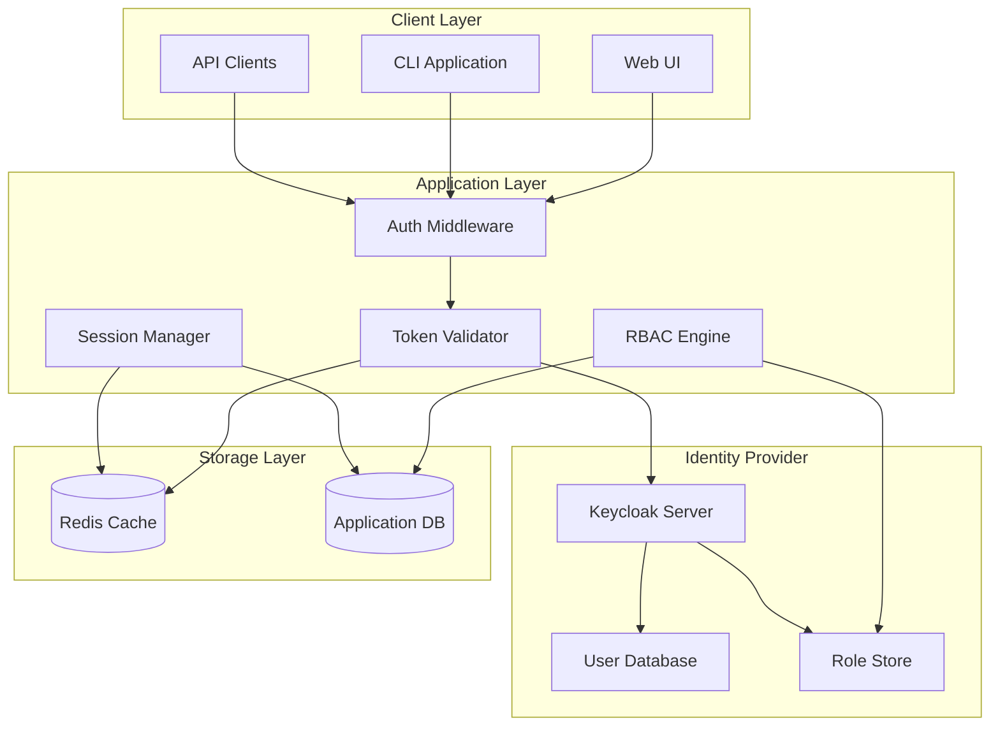
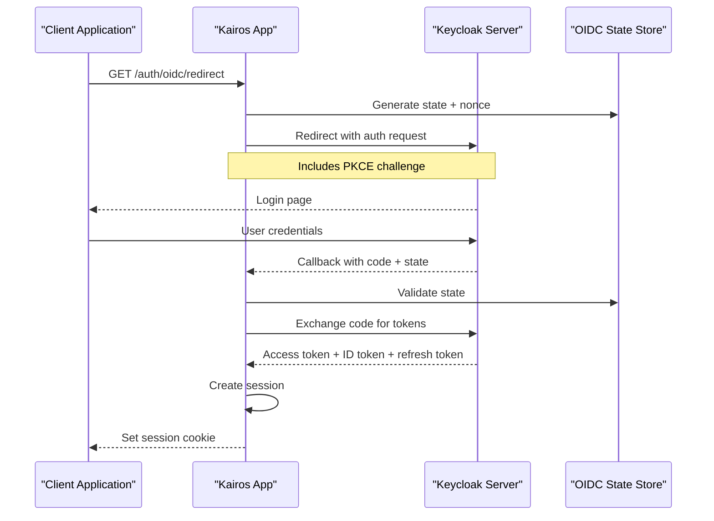
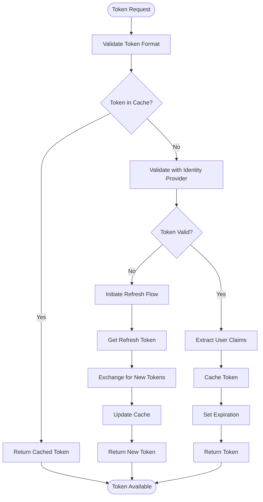
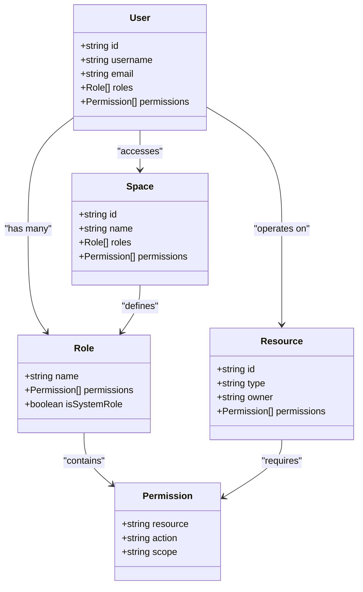
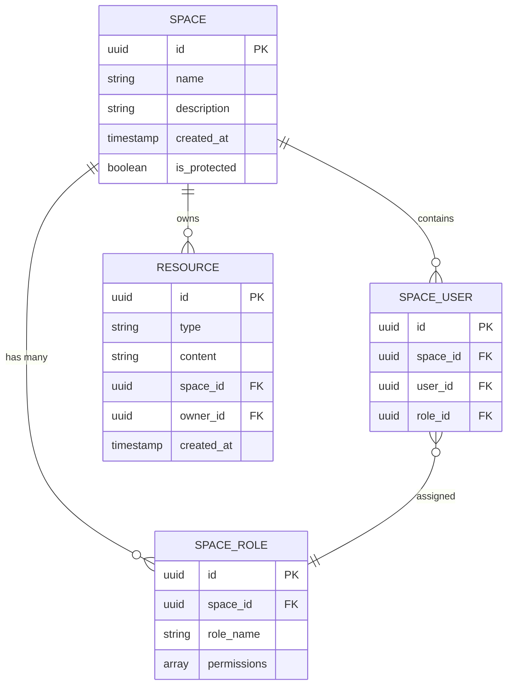
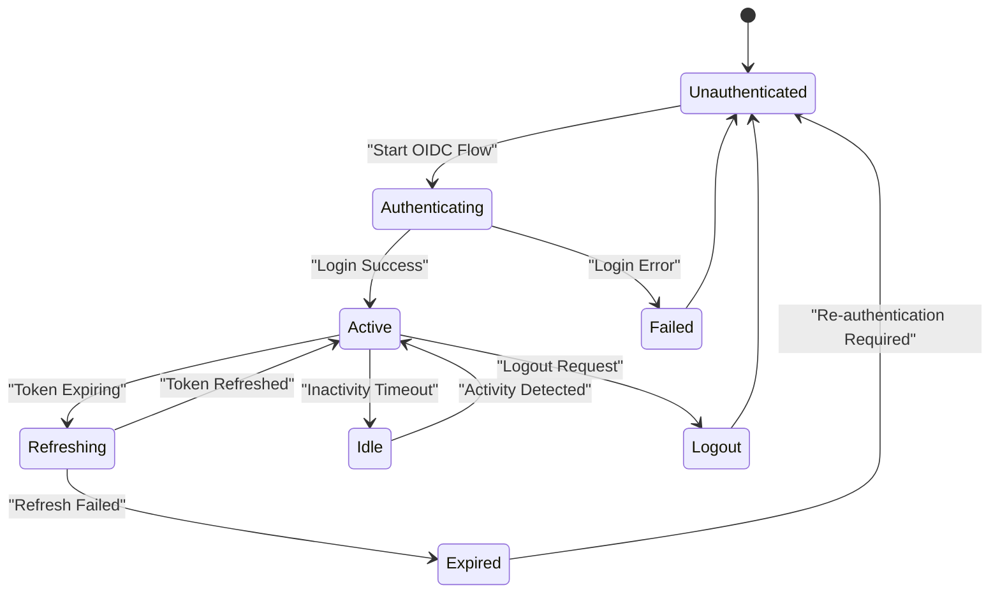
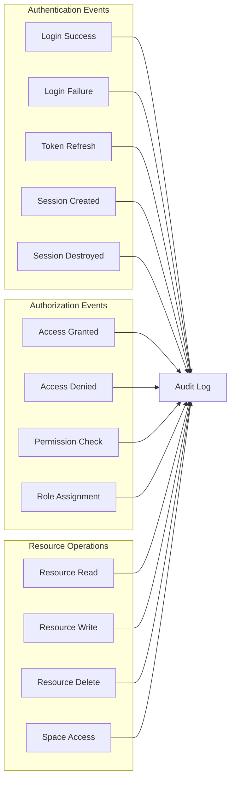

# Authentication and Authorization Model

<cite>
**Referenced Files in This Document**
- [auth-overview.md](file://docs/architecture/auth-overview.md)
- [http-auth-middleware.ts](file://src/http/http-auth-middleware.ts)
- [http-auth-callback.ts](file://src/http/http-auth-callback.ts)
- [http-auth-oidc-redirect.ts](file://src/http/http-auth-oidc-redirect.ts)
- [bearer-validate.ts](file://src/http/bearer-validate.ts)
- [oidc-state-store.ts](file://src/services/oidc-state-store.ts)
- [keycloak README.md](file://docs/keycloak/README.md)
- [kairos-realm.json](file://helm/kairos-mcp/files/kairos-realm.json)
- [deploy-configure-keycloak-realms.py](file://scripts/deploy-configure-keycloak-realms.py)
- [audit-log.md](file://docs/security/audit-log.md)
- [oauth-refresh.ts](file://src/cli/oauth-refresh.ts)
- [token.ts](file://src/cli/commands/token.ts)
- [login.ts](file://src/cli/commands/login.ts)
- [logout.ts](file://src/cli/commands/logout.ts)
- [spaces.ts](file://src/tools/spaces.ts)
- [protected-space-write-guard.ts](file://src/utils/protected-space-write-guard.ts)
</cite>

## Table of Contents
1. [Introduction](#introduction)
2. [Authentication Architecture Overview](#authentication-architecture-overview)
3. [OIDC Integration](#oidc-integration)
4. [Token Management](#token-management)
5. [Role-Based Access Control](#role-based-access-control)
6. [Space-Based Permissions](#space-based-permissions)
7. [Protected Resources](#protected-resources)
8. [Session Management](#session-management)
9. [Keycloak Configuration](#keycloak-configuration)
10. [Audit Logging](#audit-logging)
11. [Security Best Practices](#security-best-practices)
12. [Troubleshooting Guide](#troubleshooting-guide)
13. [Conclusion](#conclusion)

## Introduction

This document provides comprehensive coverage of the authentication and authorization model implemented in the system. It explains how OpenID Connect (OIDC) integration works, token management strategies, role-based access control (RBAC), space-based permissions, and fine-grained access control mechanisms. The document also covers Keycloak integration, audit logging for security compliance, and security best practices for secure deployment.

The authentication system is built around modern OIDC standards, providing secure user authentication through external identity providers while maintaining robust authorization controls at both resource and space levels.

## Authentication Architecture Overview

The authentication architecture follows a distributed model where the application integrates with an OIDC-compliant identity provider (Keycloak) to handle user authentication. The system implements multiple authentication flows for different client types including web browsers, CLI applications, and API clients.

**Diagram sources**
- [http-auth-middleware.ts:1-100](file://src/http/http-auth-middleware.ts#L1-L100)
- [bearer-validate.ts:1-100](file://src/http/bearer-validate.ts#L1-L100)
- [oidc-state-store.ts:1-100](file://src/services/oidc-state-store.ts#L1-L100)

**Section sources**
- [auth-overview.md:1-50](file://docs/architecture/auth-overview.md#L1-L50)

## OIDC Integration

The system implements full OpenID Connect integration with Keycloak as the primary identity provider. The OIDC flow supports standard authorization code flow with PKCE for enhanced security.

### OIDC Flow Components

**Diagram sources**
- [http-auth-oidc-redirect.ts:1-150](file://src/http/http-auth-oidc-redirect.ts#L1-L150)
- [http-auth-callback.ts:1-150](file://src/http/http-auth-callback.ts#L1-L150)
- [oidc-state-store.ts:1-200](file://src/services/oidc-state-store.ts#L1-L200)

### OIDC Configuration

The OIDC configuration includes support for multiple identity providers, custom scopes, and claim mapping. The system validates OIDC responses and extracts user claims for authorization decisions.

**Section sources**
- [http-auth-oidc-redirect.ts:1-200](file://src/http/http-auth-oidc-redirect.ts#L1-L200)
- [http-auth-callback.ts:1-200](file://src/http/http-auth-callback.ts#L1-L200)
- [oidc-state-store.ts:1-300](file://src/services/oidc-state-store.ts#L1-L300)

## Token Management

The system implements comprehensive token management including JWT validation, refresh token handling, and token caching strategies.

### Token Lifecycle

**Diagram sources**
- [bearer-validate.ts:1-200](file://src/http/bearer-validate.ts#L1-L200)
- [oauth-refresh.ts:1-200](file://src/cli/oauth-refresh.ts#L1-L200)

### Token Types and Scopes

The system supports multiple token types including access tokens, ID tokens, and refresh tokens. Each token type has specific scopes and expiration policies.

**Section sources**
- [bearer-validate.ts:1-300](file://src/http/bearer-validate.ts#L1-L300)
- [oauth-refresh.ts:1-300](file://src/cli/oauth-refresh.ts#L1-L300)

## Role-Based Access Control

The authorization system implements role-based access control (RBAC) that maps user roles to specific permissions across resources and spaces.

### RBAC Architecture

**Diagram sources**
- [http-auth-middleware.ts:1-200](file://src/http/http-auth-middleware.ts#L1-L200)
- [spaces.ts:1-200](file://src/tools/spaces.ts#L1-L200)

### Permission Evaluation

The permission evaluation engine checks user roles against required permissions for each resource operation. It supports hierarchical role inheritance and space-scoped permissions.

**Section sources**
- [http-auth-middleware.ts:1-300](file://src/http/http-auth-middleware.ts#L1-L300)
- [spaces.ts:1-300](file://src/tools/spaces.ts#L1-L300)

## Space-Based Permissions

Spaces provide a namespace isolation mechanism with granular access control. Each space can have its own set of users, roles, and permissions.

### Space Permission Model

**Diagram sources**
- [spaces.ts:1-300](file://src/tools/spaces.ts#L1-L300)
- [protected-space-write-guard.ts:1-200](file://src/utils/protected-space-write-guard.ts#L1-L200)

### Space Operations

The system enforces space-based access control for all CRUD operations. Protected spaces require explicit permissions even for space members.

**Section sources**
- [spaces.ts:1-400](file://src/tools/spaces.ts#L1-L400)
- [protected-space-write-guard.ts:1-300](file://src/utils/protected-space-write-guard.ts#L1-L300)

## Protected Resources

Protected resources implement fine-grained access control with support for ownership-based permissions, inherited permissions, and dynamic authorization rules.

### Resource Protection Levels

Resources are protected at multiple levels:
- **Public**: No authentication required
- **Authenticated**: Requires valid user session
- **Space-scoped**: Requires space membership
- **Protected**: Requires explicit write permissions
- **Admin-only**: Requires administrative privileges

### Dynamic Authorization

The authorization system supports dynamic rules that can evaluate context-specific conditions beyond simple role checks.

**Section sources**
- [protected-space-write-guard.ts:1-400](file://src/utils/protected-space-write-guard.ts#L1-L400)

## Session Management

The system implements secure session management with support for concurrent sessions, session persistence, and automatic cleanup.

### Session Architecture

**Diagram sources**
- [http-auth-middleware.ts:1-300](file://src/http/http-auth-middleware.ts#L1-L300)
- [oidc-state-store.ts:1-400](file://src/services/oidc-state-store.ts#L1-L400)

### Session Storage

Sessions are stored in Redis with configurable TTL and support for distributed session sharing across multiple application instances.

**Section sources**
- [oidc-state-store.ts:1-500](file://src/services/oidc-state-store.ts#L1-L500)

## Keycloak Configuration

Keycloak serves as the primary identity provider with comprehensive configuration options for realms, clients, and user management.

### Realm Configuration

The Keycloak realm configuration defines the authentication domain, including user attributes, roles, and client settings.

### Client Registration

Clients are registered with specific redirect URIs, scopes, and authentication flows tailored to different use cases.

**Section sources**
- [keycloak README.md:1-200](file://docs/keycloak/README.md#L1-L200)
- [kairos-realm.json:1-500](file://helm/kairos-mcp/files/kairos-realm.json#L1-L500)
- [deploy-configure-keycloak-realms.py:1-300](file://scripts/deploy-configure-keycloak-realms.py#L1-L300)

## Audit Logging

The system implements comprehensive audit logging for security compliance and threat detection. All authentication events, authorization decisions, and sensitive operations are logged with detailed context.

### Audit Event Types

**Diagram sources**
- [audit-log.md:1-200](file://docs/security/audit-log.md#L1-L200)

### Security Monitoring

Audit logs support real-time monitoring, alerting, and compliance reporting. Logs include user context, IP addresses, user agents, and detailed operation metadata.

**Section sources**
- [audit-log.md:1-300](file://docs/security/audit-log.md#L1-L300)

## Security Best Practices

The authentication and authorization system follows industry best practices for secure implementation and deployment.

### Authentication Security

- **PKCE Implementation**: All OAuth2 flows use Proof Key for Code Exchange (PKCE) to prevent authorization code interception attacks
- **Secure Token Storage**: Tokens are stored securely with appropriate encryption and access controls
- **Session Security**: Sessions use secure cookies with HttpOnly, Secure, and SameSite flags
- **Rate Limiting**: Authentication endpoints implement rate limiting to prevent brute force attacks

### Authorization Security

- **Principle of Least Privilege**: Default deny policy with explicit allow rules
- **Defense in Depth**: Multiple layers of authorization checks at different system levels
- **Input Validation**: Comprehensive input validation and sanitization
- **Context-Aware Authorization**: Authorization decisions consider user context, resource sensitivity, and operational environment

### Deployment Security

- **TLS Enforcement**: All communications encrypted with TLS 1.3
- **Secrets Management**: Sensitive configuration managed through secure secret stores
- **Network Isolation**: Services deployed in isolated network segments
- **Regular Security Audits**: Automated vulnerability scanning and manual security reviews

## Troubleshooting Guide

Common authentication and authorization issues and their resolution steps.

### Authentication Issues

**Problem**: Users cannot log in through OIDC
- Verify Keycloak connectivity and certificate validity
- Check redirect URI configuration matches exactly
- Validate client secrets and scopes
- Review browser console for CORS errors

**Problem**: Token validation failures
- Ensure clock synchronization between services
- Verify token signing keys are properly configured
- Check token expiration and refresh token validity
- Review token format and claim structure

### Authorization Issues

**Problem**: Users lack expected permissions
- Verify role assignments in Keycloak
- Check space membership and role inheritance
- Review resource-level permission configurations
- Validate authorization rule logic

**Problem**: Space access denied
- Confirm user has space membership
- Check if space is marked as protected
- Verify write permissions for modification operations
- Review space owner permissions

### Performance Issues

**Problem**: Slow authentication responses
- Monitor Keycloak response times
- Check Redis performance for session storage
- Review token validation cache hit rates
- Analyze database query performance for permission checks

**Section sources**
- [auth-overview.md:1-100](file://docs/architecture/auth-overview.md#L1-L100)
- [audit-log.md:1-200](file://docs/security/audit-log.md#L1-L200)

## Conclusion

The authentication and authorization model provides a comprehensive, secure, and scalable foundation for user access control. The system leverages modern OIDC standards, implements robust role-based and space-based permissions, and maintains detailed audit trails for security compliance.

Key strengths include:
- **Standards Compliance**: Full OIDC compatibility with industry best practices
- **Granular Control**: Fine-grained permissions at resource and space levels
- **Scalability**: Distributed architecture supporting high availability
- **Security**: Multiple layers of security controls and monitoring
- **Flexibility**: Extensible authorization framework supporting custom rules

The system is designed to evolve with changing security requirements while maintaining backward compatibility and operational simplicity.