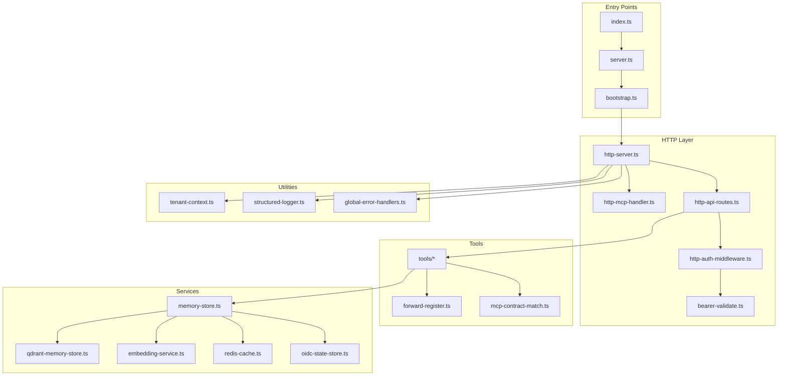
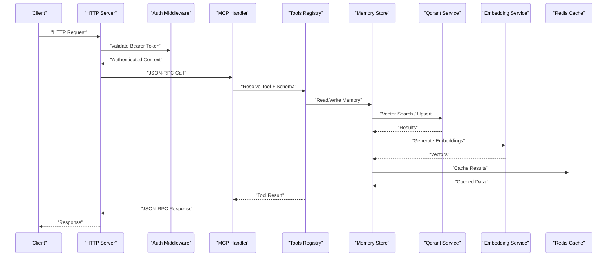
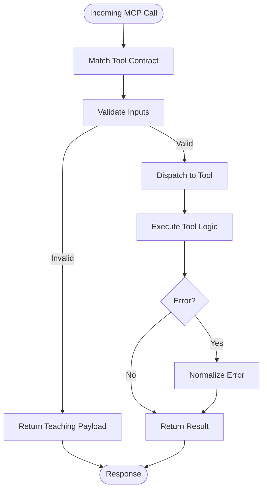
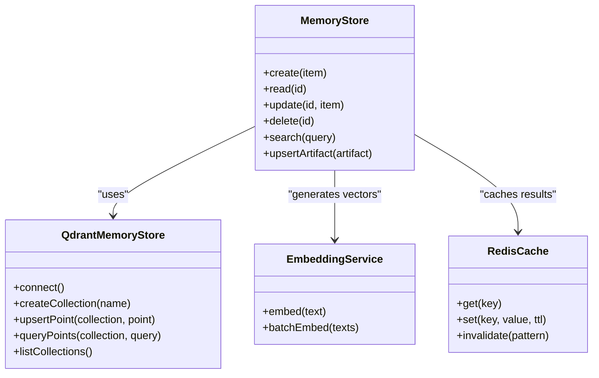
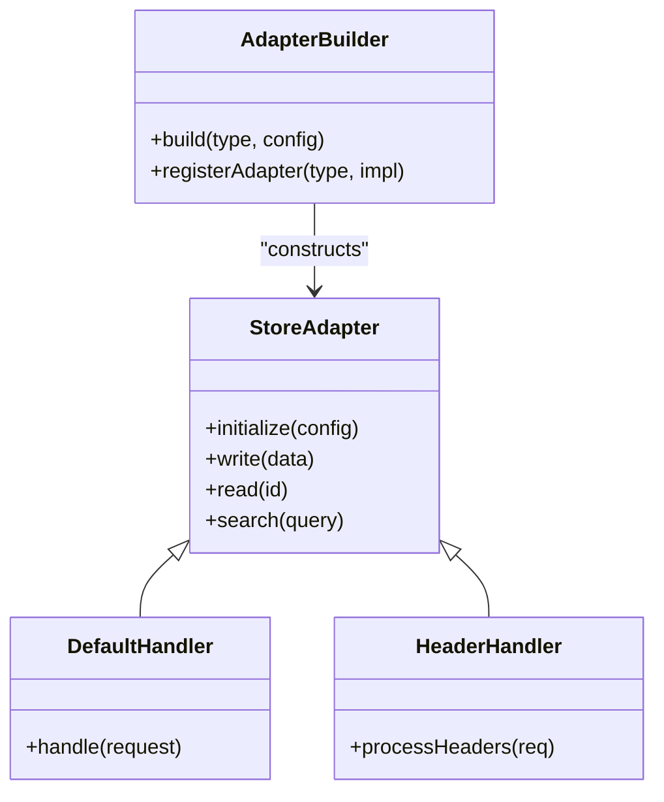
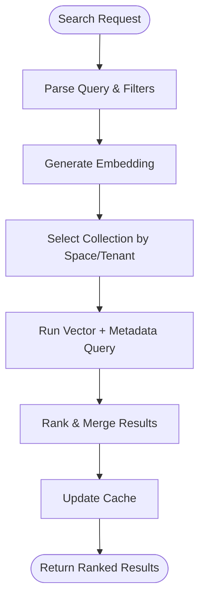
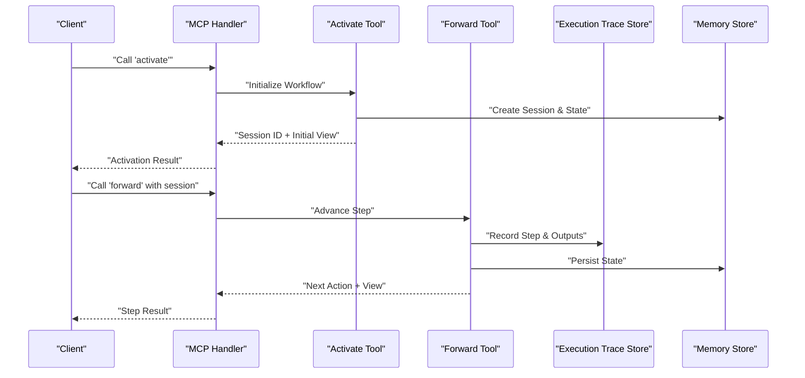
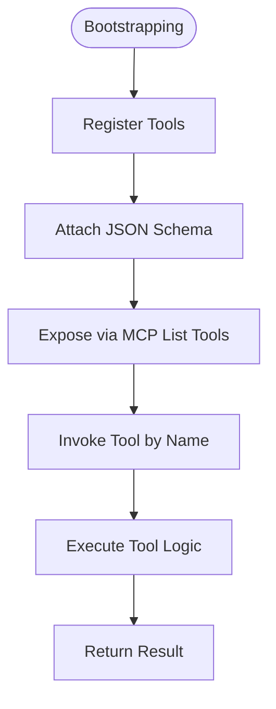
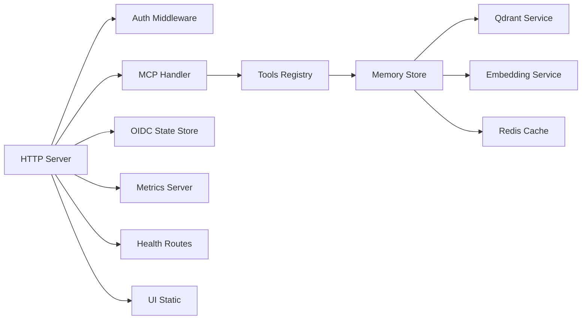

# Core Concepts

<cite>
**Referenced Files in This Document**
- [README.md](file://README.md)
- [server.ts](file://src/server.ts)
- [bootstrap.ts](file://src/bootstrap.ts)
- [index.ts](file://src/index.ts)
- [http-server.ts](file://src/http/http-server.ts)
- [http-mcp-handler.ts](file://src/http/http-mcp-handler.ts)
- [mcp-ui-offerings-auth-jsonrpc.ts](file://src/http/mcp-ui-offerings-auth-jsonrpc.ts)
- [store.ts](file://src/services/memory/store.ts)
- [memory-store.ts](file://src/services/memory-store.ts)
- [qdrant-memory-store.ts](file://src/services/qdrant/memory-store.ts)
- [qdrant-service.ts](file://src/services/qdrant/service.ts)
- [embedding-service.ts](file://src/services/embedding/service.ts)
- [adapter-builder.ts](file://src/services/memory/adapter-builder.ts)
- [store-adapter.ts](file://src/services/memory/store-adapter.ts)
- [forward-tool-error.ts](file://src/tools/forward-tool-error.ts)
- [forward-register.ts](file://src/tools/forward-register.ts)
- [forward.ts](file://src/tools/forward.ts)
- [activate.ts](file://src/tools/activate.ts)
- [search.ts](file://src/tools/search.ts)
- [spaces.ts](file://src/tools/spaces.ts)
- [train.ts](file://src/tools/train.ts)
- [tune.ts](file://src/tools/tune.ts)
- [reward.ts](file://src/tools/reward.ts)
- [export.ts](file://src/tools/export.ts)
- [delete.ts](file://src/tools/delete.ts)
- [update.ts](file://src/tools/update.ts)
- [next.ts](file://src/tools/next.ts)
- [dump.ts](file://src/tools/dump.ts)
- [kairos-uri.ts](file://src/tools/kairos-uri.ts)
- [artifact-catalog.ts](file://src/tools/artifact-catalog.ts)
- [forward-view.ts](file://src/tools/forward-view.ts)
- [forward-helpers.ts](file://src/tools/forward-helpers.ts)
- [forward-trace.ts](file://src/tools/forward-trace.ts)
- [execution-trace-store.ts](file://src/services/execution-trace-store.ts)
- [redis-cache.ts](file://src/services/redis-cache.ts)
- [key-value-store-factory.ts](file://src/services/key-value-store-factory.ts)
- [oidc-state-store.ts](file://src/services/oidc-state-store.ts)
- [bearer-validate.ts](file://src/http/bearer-validate.ts)
- [http-auth-middleware.ts](file://src/http/http-auth-middleware.ts)
- [http-api-routes.ts](file://src/http/http-api-routes.ts)
- [http-export-artifact-download-routes.ts](file://src/http/http-export-artifact-download-routes.ts)
- [http-export-download-routes.ts](file://src/http/http-export-download-routes.ts)
- [http-health-routes.ts](file://src/http/http-health-routes.ts)
- [http-well-known.ts](file://src/http/http-well-known.ts)
- [http-ui-static.ts](file://src/http/http-ui-static.ts)
- [mcp-audit-emit.ts](file://src/http/mcp-audit-emit.ts)
- [mcp-contract-match.ts](file://src/tools/mcp-contract-match.ts)
- [mcp-runtime-error.ts](file://src/tools/mcp-runtime-error.ts)
- [mcp-tool-input-teaching.ts](file://src/tools/mcp-tool-input-teaching.ts)
- [mcp-loose-input-schema.ts](file://src/tools/mcp-loose-input-schema.ts)
- [validate-protocol-structure.ts](file://src/services/memory/validate-protocol-structure.ts)
- [activation-pattern-payload.ts](file://src/services/memory/activation-pattern-payload.ts)
- [activation-search-backfill.ts](file://src/services/memory/activation-search-backfill.ts)
- [activation-search-fields.ts](file://src/services/memory/activation-search-fields.ts)
- [qdrant-point-to-memory.ts](file://src/services/memory/qdrant-point-to-memory.ts)
- [store-methods.ts](file://src/services/memory/store-methods.ts)
- [store-title-similarity-search.ts](file://src/services/memory/store-title-similarity-search.ts)
- [store-init.ts](file://src/services/memory/store-init.ts)
- [store-artifact.ts](file://src/services/memory/store-artifact.ts)
- [store-adapter-default-handler.ts](file://src/services/memory/store-adapter-default-handler.ts)
- [store-adapter-header-handler.ts](file://src/services/memory/store-adapter-header-handler.ts)
- [store-adapter-helpers.ts](file://src/services/memory/store-adapter-helpers.ts)
- [validate-adapter-markdown-size.ts](file://src/services/memory/validate-adapter-markdown-size.ts)
- [artifact-metadata.ts](file://src/services/memory/artifact-metadata.ts)
- [qdrant-collection-utils.ts](file://src/utils/qdrant-collection-utils.ts)
- [qdrant-query-utils.ts](file://src/utils/qdrant-query-utils.ts)
- [qdrant-vector-management.ts](file://src/utils/qdrant-vector-management.ts)
- [qdrant-vector-types.ts](file://src/utils/qdrant-vector-types.ts)
- [resolve-space-param.ts](file://src/utils/resolve-space-param.ts)
- [space-filter.ts](file://src/utils/space-filter.ts)
- [tenant-context.ts](file://src/utils/tenant-context.ts)
- [structured-logger.ts](file://src/utils/structured-logger.ts)
- [log-core.ts](file://src/utils/log-core.ts)
- [audit-log-events.ts](file://src/utils/audit-log-events.ts)
- [audit-mcp-summary.ts](file://src/utils/audit-mcp-summary.ts)
- [concurrency-limit.ts](file://src/utils/concurrency-limit.ts)
- [global-error-handlers.ts](file://src/utils/global-error-handlers.ts)
- [build-version.ts](file://src/utils/build-version.ts)
- [frontmatter.ts](file://src/utils/frontmatter.ts)
- [kairos-local-artifact-dirs.ts](file://src/utils/kairos-local-artifact-dirs.ts)
- [kairos-user-dirs.ts](file://src/utils/kairos-user-dirs.ts)
- [memory-body.ts](file://src/utils/memory-body.ts)
- [memory-store-utils.ts](file://src/utils/memory-store-utils.ts)
- [normalize-redis-url.ts](file://src/utils/normalize-redis-url.ts)
- [protocol-slug.ts](file://src/utils/protocol-slug.ts)
- [qdrant-utils.ts](file://src/utils/qdrant-utils.ts)
- [space-display.ts](file://src/utils/space-display.ts)
- [uri-builder.ts](file://src/utils/uri-builder.ts)
- [version-compare.ts](file://src/utils/version-compare.ts)
- [zod-to-jsonschema.ts](file://src/utils/zod-to-jsonschema.ts)
- [http-api-me.ts](file://src/http/http-api-me.ts)
- [http-client-registration-proxy.ts](file://src/http/http-client-registration-proxy.ts)
- [http-auth-callback.ts](file://src/http/http-auth-callback.ts)
- [http-auth-oidc-redirect.ts](file://src/http/http-auth-oidc-redirect.ts)
- [oidc-profile-claims.ts](file://src/http/oidc-profile-claims.ts)
- [oidc-scopes.ts](file://src/http/oidc-scopes.ts)
- [http-metrics-middleware.ts](file://src/http/http-metrics-middleware.ts)
- [metrics-server.ts](file://src/metrics-server.ts)
- [stdio-server.ts](file://src/stdio/stdio-server.ts)
- [cli-program.ts](file://src/cli/program.ts)
- [cli-index.ts](file://src/cli/index.ts)
- [cli-config-file.ts](file://src/cli/config-file.ts)
- [cli-config.ts](file://src/cli/config.ts)
- [cli-output.ts](file://src/cli/output.ts)
- [cli-keyring.ts](file://src/cli/keyring.ts)
- [cli-oauth-refresh.ts](file://src/cli/oauth-refresh.ts)
- [cli-safe-http-url.ts](file://src/cli/safe-http-url.ts)
- [cli-skill-zip-local-write.ts](file://src/cli/skill-zip-local-write.ts)
- [cli-upload-guards.ts](file://src/cli/upload-guards.ts)
- [cli-download-export-ref.ts](file://src/cli/download-export-ref.ts)
- [cli-format-next-call.ts](file://src/cli/format-next-call.ts)
- [cli-rewrite-login-url.ts](file://src/cli/rewrite-login-url.ts)
- [cli-resolve-api-base.ts](file://src/cli/resolve-api-base.ts)
- [cli-client-factory.ts](file://src/cli/client-factory.ts)
- [cli-auth-error.ts](file://src/cli/auth-error.ts)
- [cli-api-client.ts](file://src/cli/api-client.ts)
- [cli-commands-begin.ts](file://src/cli/commands/begin.ts)
- [cli-commands-delete.ts](file://src/cli/commands/delete.ts)
- [cli-commands-export.ts](file://src/cli/commands/export.ts)
- [cli-commands-login.ts](file://src/cli/commands/login.ts)
- [cli-commands-logout.ts](file://src/cli/commands/logout.ts)
- [cli-commands-search.ts](file://src/cli/commands/search.ts)
- [cli-commands-serve.ts](file://src/cli/commands/serve.ts)
- [cli-commands-spaces.ts](file://src/cli/commands/spaces.ts)
- [cli-commands-token.ts](file://src/cli/commands/token.ts)
- [cli-commands-update.ts](file://src/cli/commands/update.ts)
- [cli-commands-attest.ts](file://src/cli/commands/attest.ts)
- [cli-commands-cli-train.ts](file://src/cli/commands/cli-train.ts)
- [cli-commands-delete-metadata.ts](file://src/cli/commands/delete-metadata.ts)
</cite>

## Table of Contents
1. [Introduction](#introduction)
2. [Project Structure](#project-structure)
3. [Core Components](#core-components)
4. [Architecture Overview](#architecture-overview)
5. [Detailed Component Analysis](#detailed-component-analysis)
6. [Dependency Analysis](#dependency-analysis)
7. [Performance Considerations](#performance-considerations)
8. [Troubleshooting Guide](#troubleshooting-guide)
9. [Conclusion](#conclusion)
10. [Appendices](#appendices)

## Introduction
This document explains the core concepts of Kairos MCP, focusing on:
- Model Context Protocol (MCP) standards and how they are implemented
- Memory store architecture with vector embeddings and semantic search using Qdrant
- Workflow orchestration patterns for stateful execution
- Tool registration mechanisms and the adapter pattern for external service integration
- Key terms such as protocols, adapters, artifacts, spaces, and workflows
- Data flow between components and architectural decisions

The goal is to provide a clear mental model of how Kairos orchestrates tools, persists state, indexes content for retrieval, and exposes capabilities via MCP and HTTP interfaces.

## Project Structure
Kairos is organized into layers:
- Entry points and bootstrap logic initialize configuration, services, and routes
- HTTP server exposes REST and MCP endpoints with authentication and metrics
- Tools implement business operations and workflow steps
- Services encapsulate memory, embedding, Qdrant, Redis, and OIDC integrations
- Utilities provide cross-cutting concerns like logging, error handling, and tenant context

**Diagram sources**
- [index.ts](file://src/index.ts)
- [server.ts](file://src/server.ts)
- [bootstrap.ts](file://src/bootstrap.ts)
- [http-server.ts](file://src/http/http-server.ts)
- [http-mcp-handler.ts](file://src/http/http-mcp-handler.ts)
- [http-api-routes.ts](file://src/http/http-api-routes.ts)
- [http-auth-middleware.ts](file://src/http/http-auth-middleware.ts)
- [bearer-validate.ts](file://src/http/bearer-validate.ts)
- [forward-register.ts](file://src/tools/forward-register.ts)
- [mcp-contract-match.ts](file://src/tools/mcp-contract-match.ts)
- [memory-store.ts](file://src/services/memory-store.ts)
- [qdrant-memory-store.ts](file://src/services/qdrant/memory-store.ts)
- [embedding-service.ts](file://src/services/embedding/service.ts)
- [redis-cache.ts](file://src/services/redis-cache.ts)
- [oidc-state-store.ts](file://src/services/oidc-state-store.ts)
- [tenant-context.ts](file://src/utils/tenant-context.ts)
- [structured-logger.ts](file://src/utils/structured-logger.ts)
- [global-error-handlers.ts](file://src/utils/global-error-handlers.ts)

**Section sources**
- [README.md](file://README.md)
- [index.ts](file://src/index.ts)
- [server.ts](file://src/server.ts)
- [bootstrap.ts](file://src/bootstrap.ts)
- [http-server.ts](file://src/http/http-server.ts)
- [http-api-routes.ts](file://src/http/http-api-routes.ts)

## Core Components
- MCP Host and Handler: Exposes MCP JSON-RPC endpoints, validates requests, and dispatches tool calls.
- Tools Registry: Centralized registration of MCP tools and their schemas, including forward activation flows.
- Memory Store Abstraction: Encapsulates persistence and retrieval of memory items, artifacts, and metadata.
- Vector Search with Qdrant: Embeddings generated by an embedding service are stored and queried semantically.
- Stateful Workflows: Orchestrated sequences of steps with persistent state and traceability.
- Authentication and Tenancy: OIDC-based auth, bearer token validation, and per-tenant scoping.
- Observability: Metrics, structured logging, audit events, and health endpoints.

Key responsibilities:
- Protocols define the shape of interactions and tool contracts.
- Adapters bridge external systems into the memory store and tool layer.
- Artifacts represent versioned content units consumed or produced by workflows.
- Spaces partition data and permissions across tenants or domains.
- Workflows describe multi-step processes with state transitions and rewards.

**Section sources**
- [http-mcp-handler.ts](file://src/http/http-mcp-handler.ts)
- [forward-register.ts](file://src/tools/forward-register.ts)
- [memory-store.ts](file://src/services/memory-store.ts)
- [qdrant-memory-store.ts](file://src/services/qdrant/memory-store.ts)
- [embedding-service.ts](file://src/services/embedding/service.ts)
- [oidc-state-store.ts](file://src/services/oidc-state-store.ts)
- [bearer-validate.ts](file://src/http/bearer-validate.ts)
- [http-auth-middleware.ts](file://src/http/http-auth-middleware.ts)
- [structured-logger.ts](file://src/utils/structured-logger.ts)
- [audit-log-events.ts](file://src/utils/audit-log-events.ts)

## Architecture Overview
High-level flow from client to storage and back:

**Diagram sources**
- [http-server.ts](file://src/http/http-server.ts)
- [http-mcp-handler.ts](file://src/http/http-mcp-handler.ts)
- [forward-register.ts](file://src/tools/forward-register.ts)
- [memory-store.ts](file://src/services/memory-store.ts)
- [qdrant-memory-store.ts](file://src/services/qdrant/memory-store.ts)
- [embedding-service.ts](file://src/services/embedding/service.ts)
- [redis-cache.ts](file://src/services/redis-cache.ts)
- [bearer-validate.ts](file://src/http/bearer-validate.ts)
- [http-auth-middleware.ts](file://src/http/http-auth-middleware.ts)

## Detailed Component Analysis

### MCP Standards and Tool Registration
- MCP Contract Matching: Validates input schemas against declared tool contracts and supports loose schema modes for flexibility.
- Tool Input Teaching: Provides guidance and teaching payloads to clients based on tool schemas.
- Forward Tool Error Handling: Normalizes errors returned by tools to consistent MCP responses.
- Forward Registration: Central registry that maps tool names to implementations and schemas, enabling dynamic discovery.

**Diagram sources**
- [mcp-contract-match.ts](file://src/tools/mcp-contract-match.ts)
- [mcp-tool-input-teaching.ts](file://src/tools/mcp-tool-input-teaching.ts)
- [forward-tool-error.ts](file://src/tools/forward-tool-error.ts)
- [forward-register.ts](file://src/tools/forward-register.ts)
- [mcp-loose-input-schema.ts](file://src/tools/mcp-loose-input-schema.ts)

**Section sources**
- [mcp-contract-match.ts](file://src/tools/mcp-contract-match.ts)
- [mcp-tool-input-teaching.ts](file://src/tools/mcp-tool-input-teaching.ts)
- [forward-tool-error.ts](file://src/tools/forward-tool-error.ts)
- [forward-register.ts](file://src/tools/forward-register.ts)
- [mcp-loose-input-schema.ts](file://src/tools/mcp-loose-input-schema.ts)

### Memory Store Architecture and Vector Embeddings
- Memory Store Abstraction: Defines CRUD operations for memory items, artifacts, and metadata.
- Qdrant Integration: Stores vectors and performs similarity search; manages collections and point mappings.
- Embedding Service: Converts text to vectors for indexing and retrieval.
- Title Similarity Search: Optimized search over titles and metadata fields.
- Activation Patterns: Backfills and structures activation-related search fields.

**Diagram sources**
- [memory-store.ts](file://src/services/memory-store.ts)
- [qdrant-memory-store.ts](file://src/services/qdrant/memory-store.ts)
- [embedding-service.ts](file://src/services/embedding/service.ts)
- [redis-cache.ts](file://src/services/redis-cache.ts)
- [store-title-similarity-search.ts](file://src/services/memory/store-title-similarity-search.ts)
- [activation-search-backfill.ts](file://src/services/memory/activation-search-backfill.ts)
- [activation-search-fields.ts](file://src/services/memory/activation-search-fields.ts)

**Section sources**
- [memory-store.ts](file://src/services/memory-store.ts)
- [qdrant-memory-store.ts](file://src/services/qdrant/memory-store.ts)
- [qdrant-service.ts](file://src/services/qdrant/service.ts)
- [embedding-service.ts](file://src/services/embedding/service.ts)
- [store-title-similarity-search.ts](file://src/services/memory/store-title-similarity-search.ts)
- [activation-search-backfill.ts](file://src/services/memory/activation-search-backfill.ts)
- [activation-search-fields.ts](file://src/services/memory/activation-search-fields.ts)
- [qdrant-point-to-memory.ts](file://src/services/memory/qdrant-point-to-memory.ts)
- [qdrant-collection-utils.ts](file://src/utils/qdrant-collection-utils.ts)
- [qdrant-query-utils.ts](file://src/utils/qdrant-query-utils.ts)
- [qdrant-vector-management.ts](file://src/utils/qdrant-vector-management.ts)
- [qdrant-vector-types.ts](file://src/utils/qdrant-vector-types.ts)

### Adapter Pattern for External Service Integration
Adapters allow plugging in different storage backends and external systems while keeping a uniform interface. The builder constructs adapters from configuration, and helpers validate and normalize inputs.

**Diagram sources**
- [store-adapter.ts](file://src/services/memory/store-adapter.ts)
- [adapter-builder.ts](file://src/services/memory/adapter-builder.ts)
- [store-adapter-default-handler.ts](file://src/services/memory/store-adapter-default-handler.ts)
- [store-adapter-header-handler.ts](file://src/services/memory/store-adapter-header-handler.ts)
- [store-adapter-helpers.ts](file://src/services/memory/store-adapter-helpers.ts)
- [validate-adapter-markdown-size.ts](file://src/services/memory/validate-adapter-markdown-size.ts)

**Section sources**
- [store-adapter.ts](file://src/services/memory/store-adapter.ts)
- [adapter-builder.ts](file://src/services/memory/adapter-builder.ts)
- [store-adapter-default-handler.ts](file://src/services/memory/store-adapter-default-handler.ts)
- [store-adapter-header-handler.ts](file://src/services/memory/store-adapter-header-handler.ts)
- [store-adapter-helpers.ts](file://src/services/memory/store-adapter-helpers.ts)
- [validate-adapter-markdown-size.ts](file://src/services/memory/validate-adapter-markdown-size.ts)

### Semantic Search Capabilities Using Qdrant
Semantic search combines embeddings with metadata filters and title similarity. The pipeline includes:
- Query parsing and normalization
- Vector generation via embedding service
- Qdrant collection selection and filtering
- Result ranking and caching

**Diagram sources**
- [store-title-similarity-search.ts](file://src/services/memory/store-title-similarity-search.ts)
- [qdrant-memory-store.ts](file://src/services/qdrant/memory-store.ts)
- [embedding-service.ts](file://src/services/embedding/service.ts)
- [redis-cache.ts](file://src/services/redis-cache.ts)
- [resolve-space-param.ts](file://src/utils/resolve-space-param.ts)
- [space-filter.ts](file://src/utils/space-filter.ts)
- [tenant-context.ts](file://src/utils/tenant-context.ts)

**Section sources**
- [store-title-similarity-search.ts](file://src/services/memory/store-title-similarity-search.ts)
- [qdrant-memory-store.ts](file://src/services/qdrant/memory-store.ts)
- [embedding-service.ts](file://src/services/embedding/service.ts)
- [redis-cache.ts](file://src/services/redis-cache.ts)
- [resolve-space-param.ts](file://src/utils/resolve-space-param.ts)
- [space-filter.ts](file://src/utils/space-filter.ts)
- [tenant-context.ts](file://src/utils/tenant-context.ts)

### Stateful Workflow Orchestration
Workflows are composed of tools and steps with persistent state and traces. The forward tool orchestrates step-by-step execution, while activate prepares initial state and views.

**Diagram sources**
- [activate.ts](file://src/tools/activate.ts)
- [forward.ts](file://src/tools/forward.ts)
- [forward-view.ts](file://src/tools/forward-view.ts)
- [forward-helpers.ts](file://src/tools/forward-helpers.ts)
- [forward-trace.ts](file://src/tools/forward-trace.ts)
- [execution-trace-store.ts](file://src/services/execution-trace-store.ts)
- [memory-store.ts](file://src/services/memory-store.ts)

**Section sources**
- [activate.ts](file://src/tools/activate.ts)
- [forward.ts](file://src/tools/forward.ts)
- [forward-view.ts](file://src/tools/forward-view.ts)
- [forward-helpers.ts](file://src/tools/forward-helpers.ts)
- [forward-trace.ts](file://src/tools/forward-trace.ts)
- [execution-trace-store.ts](file://src/services/execution-trace-store.ts)
- [memory-store.ts](file://src/services/memory-store.ts)

### Tool Registration Mechanisms
Tools are registered centrally and exposed via MCP and HTTP APIs. Each tool defines its schema and behavior, and the registry resolves them at runtime.

**Diagram sources**
- [forward-register.ts](file://src/tools/forward-register.ts)
- [http-mcp-handler.ts](file://src/http/http-mcp-handler.ts)
- [http-api-routes.ts](file://src/http/http-api-routes.ts)

**Section sources**
- [forward-register.ts](file://src/tools/forward-register.ts)
- [http-mcp-handler.ts](file://src/http/http-mcp-handler.ts)
- [http-api-routes.ts](file://src/http/http-api-routes.ts)

### Key Terms
- Protocols: Formal definitions of tool contracts, schemas, and interaction patterns.
- Adapters: Pluggable components implementing a common interface to integrate external systems.
- Artifacts: Versioned content units with metadata, used as inputs or outputs in workflows.
- Spaces: Logical partitions for data isolation and access control, often aligned with tenants or projects.
- Workflows: Multi-step processes orchestrated by tools with persistent state and observability.

[No sources needed since this section doesn't analyze specific files]

## Dependency Analysis
Component relationships and coupling:

**Diagram sources**
- [http-server.ts](file://src/http/http-server.ts)
- [http-mcp-handler.ts](file://src/http/http-mcp-handler.ts)
- [forward-register.ts](file://src/tools/forward-register.ts)
- [memory-store.ts](file://src/services/memory-store.ts)
- [qdrant-memory-store.ts](file://src/services/qdrant/memory-store.ts)
- [embedding-service.ts](file://src/services/embedding/service.ts)
- [redis-cache.ts](file://src/services/redis-cache.ts)
- [oidc-state-store.ts](file://src/services/oidc-state-store.ts)
- [metrics-server.ts](file://src/metrics-server.ts)
- [http-health-routes.ts](file://src/http/http-health-routes.ts)
- [http-ui-static.ts](file://src/http/http-ui-static.ts)

**Section sources**
- [http-server.ts](file://src/http/http-server.ts)
- [http-mcp-handler.ts](file://src/http/http-mcp-handler.ts)
- [forward-register.ts](file://src/tools/forward-register.ts)
- [memory-store.ts](file://src/services/memory-store.ts)
- [qdrant-memory-store.ts](file://src/services/qdrant/memory-store.ts)
- [embedding-service.ts](file://src/services/embedding/service.ts)
- [redis-cache.ts](file://src/services/redis-cache.ts)
- [oidc-state-store.ts](file://src/services/oidc-state-store.ts)
- [metrics-server.ts](file://src/metrics-server.ts)
- [http-health-routes.ts](file://src/http/http-health-routes.ts)
- [http-ui-static.ts](file://src/http/http-ui-static.ts)

## Performance Considerations
- Embedding Generation: Batch embeddings where possible and cache results to reduce latency and cost.
- Vector Search: Use appropriate collection strategies and filters to minimize payload sizes and improve recall.
- Caching: Leverage Redis for hot paths like search results and activation states.
- Concurrency Limits: Apply rate limiting and concurrency controls to protect downstream services.
- Structured Logging: Keep logs concise and avoid heavy payloads to reduce overhead.

[No sources needed since this section provides general guidance]

## Troubleshooting Guide
Common issues and diagnostics:
- Authentication Failures: Check bearer token validation and OIDC redirects/callbacks.
- MCP Contract Mismatches: Review tool schema matching and loose input modes.
- Qdrant Connectivity: Verify collection existence and vector dimensions.
- Embedding Errors: Inspect provider health and retry policies.
- Workflow Stalls: Inspect execution traces and persisted state for stuck sessions.

Operational utilities:
- Audit Events: Correlate MCP actions with audit summaries.
- Global Error Handlers: Ensure consistent error propagation and user-friendly messages.
- Health Endpoints: Confirm service readiness and dependencies.

**Section sources**
- [bearer-validate.ts](file://src/http/bearer-validate.ts)
- [http-auth-middleware.ts](file://src/http/http-auth-middleware.ts)
- [http-auth-callback.ts](file://src/http/http-auth-callback.ts)
- [http-auth-oidc-redirect.ts](file://src/http/http-auth-oidc-redirect.ts)
- [mcp-contract-match.ts](file://src/tools/mcp-contract-match.ts)
- [mcp-runtime-error.ts](file://src/tools/mcp-runtime-error.ts)
- [qdrant-memory-store.ts](file://src/services/qdrant/memory-store.ts)
- [embedding-service.ts](file://src/services/embedding/service.ts)
- [execution-trace-store.ts](file://src/services/execution-trace-store.ts)
- [audit-log-events.ts](file://src/utils/audit-log-events.ts)
- [audit-mcp-summary.ts](file://src/utils/audit-mcp-summary.ts)
- [global-error-handlers.ts](file://src/utils/global-error-handlers.ts)
- [http-health-routes.ts](file://src/http/http-health-routes.ts)

## Conclusion
Kairos MCP integrates MCP standards with a robust memory store backed by Qdrant for semantic search, and orchestrates stateful workflows through a centralized tool registry. The adapter pattern enables flexible integrations, while authentication, tenancy, and observability ensure secure and maintainable operations. Understanding these core concepts helps developers extend capabilities, troubleshoot effectively, and design scalable workflows.

[No sources needed since this section summarizes without analyzing specific files]

## Appendices

### Tool Catalog Reference
- Activate: Initializes workflows and returns initial views.
- Forward: Advances workflow steps and returns next actions.
- Search: Performs semantic and metadata-driven searches.
- Train: Ingests and indexes content with embeddings.
- Tune: Adjusts models or parameters based on feedback.
- Reward: Records evaluations and propagates signals.
- Export/Dump: Exports artifacts and telemetry.
- Delete/Update: Manages lifecycle of resources.
- Next: Determines canonical next actions based on protocol state.
- Spaces: Lists and manages spaces for data isolation.

**Section sources**
- [activate.ts](file://src/tools/activate.ts)
- [forward.ts](file://src/tools/forward.ts)
- [search.ts](file://src/tools/search.ts)
- [train.ts](file://src/tools/train.ts)
- [tune.ts](file://src/tools/tune.ts)
- [reward.ts](file://src/tools/reward.ts)
- [export.ts](file://src/tools/export.ts)
- [delete.ts](file://src/tools/delete.ts)
- [update.ts](file://src/tools/update.ts)
- [next.ts](file://src/tools/next.ts)
- [dump.ts](file://src/tools/dump.ts)
- [spaces.ts](file://src/tools/spaces.ts)

### Artifact and URI Utilities
- Artifact cataloging and MIME inference support diverse content types.
- URI builders and relative path resolution simplify artifact references.

**Section sources**
- [artifact-catalog.ts](file://src/tools/artifact-catalog.ts)
- [kairos-uri.ts](file://src/tools/kairos-uri.ts)
- [artifact-relative-path.ts](file://src/tools/artifact-relative-path.ts)
- [artifact-mime.ts](file://src/tools/artifact-mime.ts)

### Protocol Validation and Structure
- Protocol structure validation ensures consistency across tools and workflows.
- Activation pattern payloads and fields guide search and display.

**Section sources**
- [validate-protocol-structure.ts](file://src/services/memory/validate-protocol-structure.ts)
- [activation-pattern-payload.ts](file://src/services/memory/activation-pattern-payload.ts)
- [activation-search-fields.ts](file://src/services/memory/activation-search-fields.ts)

### Storage Initialization and Methods
- Store initialization sets up collections and default handlers.
- Store methods abstract common operations for memory and artifacts.

**Section sources**
- [store-init.ts](file://src/services/memory/store-init.ts)
- [store-methods.ts](file://src/services/memory/store-methods.ts)
- [store-artifact.ts](file://src/services/memory/store-artifact.ts)

### HTTP API and Resources
- Well-known endpoints and health checks expose operational status.
- Export download routes serve artifacts securely.
- UI static assets and offerings enhance developer experience.

**Section sources**
- [http-well-known.ts](file://src/http/http-well-known.ts)
- [http-health-routes.ts](file://src/http/http-health-routes.ts)
- [http-export-artifact-download-routes.ts](file://src/http/http-export-artifact-download-routes.ts)
- [http-export-download-routes.ts](file://src/http/http-export-download-routes.ts)
- [http-ui-static.ts](file://src/http/http-ui-static.ts)
- [mcp-ui-offerings-auth-jsonrpc.ts](file://src/http/mcp-ui-offerings-auth-jsonrpc.ts)

### CLI and Stdio Interfaces
- CLI commands wrap core functionality for automation and scripting.
- Stdio server enables process-based invocation.

**Section sources**
- [cli-program.ts](file://src/cli/program.ts)
- [cli-index.ts](file://src/cli/index.ts)
- [stdio-server.ts](file://src/stdio/stdio-server.ts)