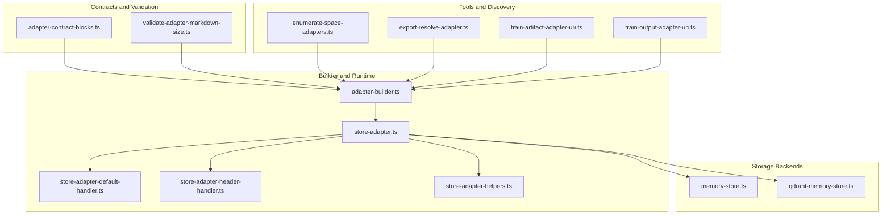
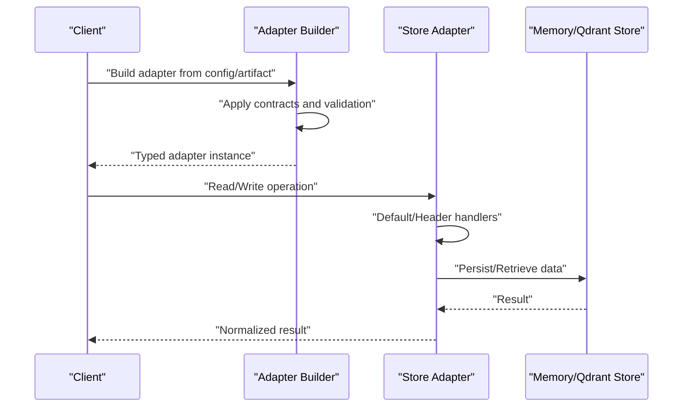
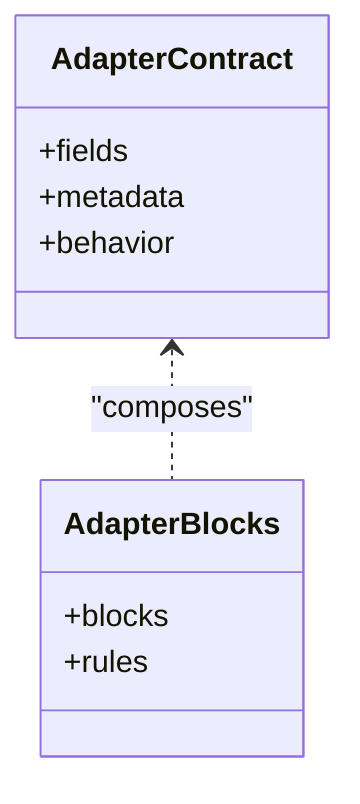
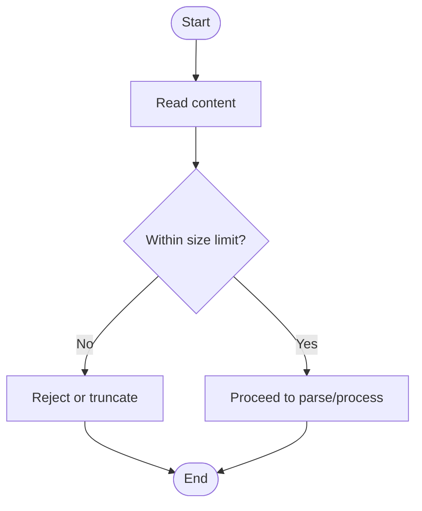
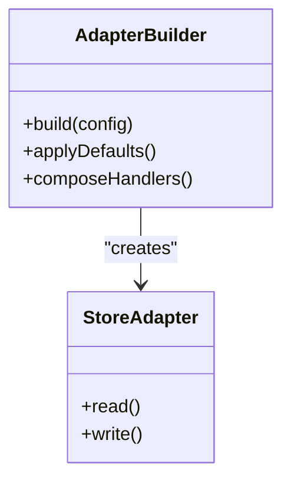
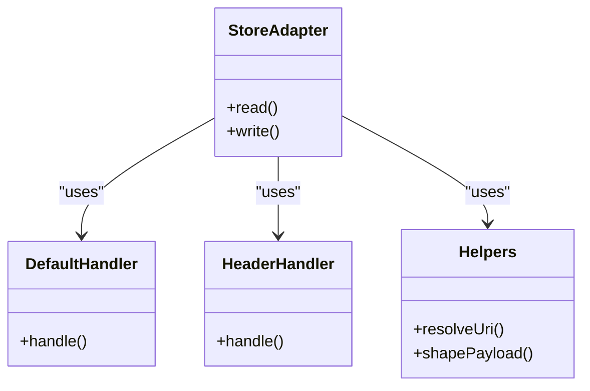
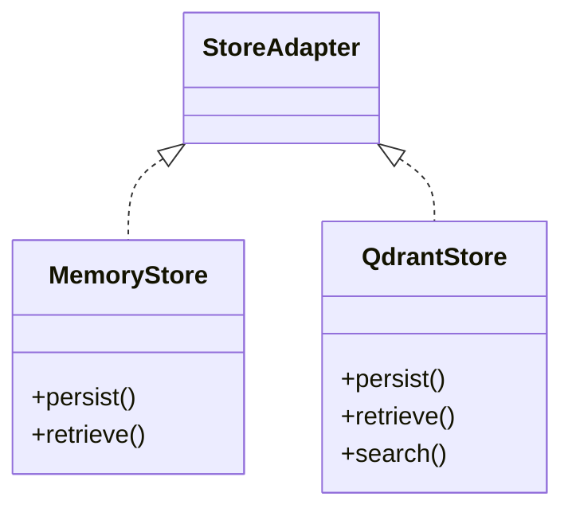
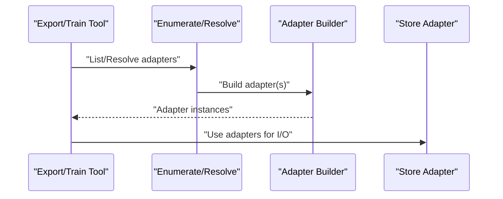
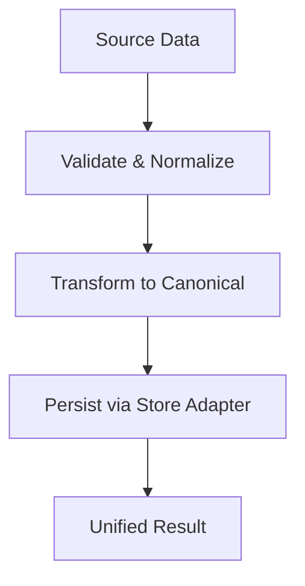
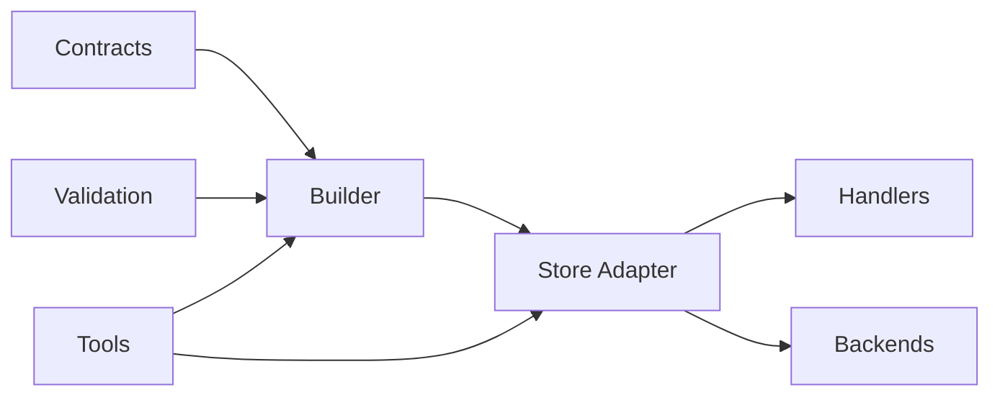

# Adapter System and Data Processing

<cite>
**Referenced Files in This Document**
- [adapter-builder.ts](file://src/services/memory/adapter-builder.ts)
- [store-adapter.ts](file://src/services/memory/store-adapter.ts)
- [store-adapter-default-handler.ts](file://src/services/memory/store-adapter-default-handler.ts)
- [store-adapter-header-handler.ts](file://src/services/memory/store-adapter-header-handler.ts)
- [store-adapter-helpers.ts](file://src/services/memory/store-adapter-helpers.ts)
- [validate-adapter-markdown-size.ts](file://src/services/memory/validate-adapter-markdown-size.ts)
- [adapter-contract-blocks.ts](file://src/services/memory/adapter-contract-blocks.ts)
- [memory-store.ts](file://src/services/memory-store.ts)
- [qdrant-memory-store.ts](file://src/services/qdrant/memory-store.ts)
- [export-resolve-adapter.ts](file://src/tools/export-resolve-adapter.ts)
- [train-artifact-adapter-uri.ts](file://src/tools/train-artifact-adapter-uri.ts)
- [train-output-adapter-uri.ts](file://src/tools/train-output-adapter-uri.ts)
- [enumerate-space-adapters.ts](file://src/tools/skill-export/enumerate-space-adapters.ts)
- [adapter-example-all-types.md](file://docs/examples/adapter-example-all-types.md)
- [adapter-example-comment.md](file://docs/examples/adapter-example-comment.md)
- [adapter-example-mcp.md](file://docs/examples/adapter-example-mcp.md)
- [adapter-example-shell.md](file://docs/examples/adapter-example-shell.md)
- [adapter-example-user-input.md](file://docs/examples/adapter-example-user-input.md)
- [adapter-twelve-step-linear-test.md](file://docs/examples/adapter-twelve-step-linear-test.md)
</cite>

## Table of Contents
1. [Introduction](#introduction)
2. [Project Structure](#project-structure)
3. [Core Components](#core-components)
4. [Architecture Overview](#architecture-overview)
5. [Detailed Component Analysis](#detailed-component-analysis)
6. [Dependency Analysis](#dependency-analysis)
7. [Performance Considerations](#performance-considerations)
8. [Troubleshooting Guide](#troubleshooting-guide)
9. [Conclusion](#conclusion)
10. [Appendices](#appendices)

## Introduction
This document explains the adapter system and data processing pipeline used to ingest, validate, transform, and store content across multiple sources. It focuses on:
- The adapter pattern implementation and contract definitions
- Validation mechanisms (including markdown size limits)
- The adapter builder, type safety, and runtime adaptation
- Content processing workflows (markdown parsing, normalization, and storage)
- Custom adapter development, data transformation, and error handling
- Registration, discovery, and lifecycle management
- Performance optimization, caching strategies, and testing approaches

The goal is to provide both a conceptual overview and code-level guidance for building robust adapters that integrate with the memory store and downstream services.

## Project Structure
The adapter system spans several modules:
- Contract and validation utilities define the shape of adapters and enforce constraints
- The adapter builder constructs typed adapters from configuration or source artifacts
- Store adapters encapsulate read/write operations against different backends
- Tools resolve and enumerate adapters during export and training flows
- Examples demonstrate common adapter patterns and usage

**Diagram sources**
- [adapter-contract-blocks.ts](file://src/services/memory/adapter-contract-blocks.ts)
- [validate-adapter-markdown-size.ts](file://src/services/memory/validate-adapter-markdown-size.ts)
- [adapter-builder.ts](file://src/services/memory/adapter-builder.ts)
- [store-adapter.ts](file://src/services/memory/store-adapter.ts)
- [store-adapter-default-handler.ts](file://src/services/memory/store-adapter-default-handler.ts)
- [store-adapter-header-handler.ts](file://src/services/memory/store-adapter-header-handler.ts)
- [store-adapter-helpers.ts](file://src/services/memory/store-adapter-helpers.ts)
- [memory-store.ts](file://src/services/memory-store.ts)
- [qdrant-memory-store.ts](file://src/services/qdrant/memory-store.ts)
- [enumerate-space-adapters.ts](file://src/tools/skill-export/enumerate-space-adapters.ts)
- [export-resolve-adapter.ts](file://src/tools/export-resolve-adapter.ts)
- [train-artifact-adapter-uri.ts](file://src/tools/train-artifact-adapter-uri.ts)
- [train-output-adapter-uri.ts](file://src/tools/train-output-adapter-uri.ts)

**Section sources**
- [adapter-builder.ts](file://src/services/memory/adapter-builder.ts)
- [store-adapter.ts](file://src/services/memory/store-adapter.ts)
- [store-adapter-default-handler.ts](file://src/services/memory/store-adapter-default-handler.ts)
- [store-adapter-header-handler.ts](file://src/services/memory/store-adapter-header-handler.ts)
- [store-adapter-helpers.ts](file://src/services/memory/store-adapter-helpers.ts)
- [validate-adapter-markdown-size.ts](file://src/services/memory/validate-adapter-markdown-size.ts)
- [adapter-contract-blocks.ts](file://src/services/memory/adapter-contract-blocks.ts)
- [memory-store.ts](file://src/services/memory-store.ts)
- [qdrant-memory-store.ts](file://src/services/qdrant/memory-store.ts)
- [enumerate-space-adapters.ts](file://src/tools/skill-export/enumerate-space-adapters.ts)
- [export-resolve-adapter.ts](file://src/tools/export-resolve-adapter.ts)
- [train-artifact-adapter-uri.ts](file://src/tools/train-artifact-adapter-uri.ts)
- [train-output-adapter-uri.ts](file://src/tools/train-output-adapter-uri.ts)

## Core Components
- Adapter contracts and blocks define the expected structure and behavior of adapters, ensuring consistent input/output shapes and metadata requirements.
- Markdown size validation enforces content limits before ingestion, preventing oversized payloads from entering the pipeline.
- The adapter builder composes typed adapters from configuration or artifact URIs, applying defaults and resolving handlers.
- Store adapters abstract backend operations, providing default and header-specific behaviors while delegating to concrete storage implementations.
- Helper utilities standardize common tasks such as URI resolution, payload shaping, and error mapping.

Key responsibilities:
- Contract enforcement and schema validation
- Builder-time composition and runtime dispatch
- Storage abstraction and handler chaining
- Size and content validation
- Error propagation and diagnostics

**Section sources**
- [adapter-contract-blocks.ts](file://src/services/memory/adapter-contract-blocks.ts)
- [validate-adapter-markdown-size.ts](file://src/services/memory/validate-adapter-markdown-size.ts)
- [adapter-builder.ts](file://src/services/memory/adapter-builder.ts)
- [store-adapter.ts](file://src/services/memory/store-adapter.ts)
- [store-adapter-default-handler.ts](file://src/services/memory/store-adapter-default-handler.ts)
- [store-adapter-header-handler.ts](file://src/services/memory/store-adapter-header-handler.ts)
- [store-adapter-helpers.ts](file://src/services/memory/store-adapter-helpers.ts)

## Architecture Overview
The adapter system follows a layered architecture:
- Contracts layer defines schemas and validation rules
- Builder layer constructs typed adapters with composed handlers
- Store layer abstracts persistence and retrieval
- Tooling layer resolves and enumerates adapters for export and training

**Diagram sources**
- [adapter-builder.ts](file://src/services/memory/adapter-builder.ts)
- [store-adapter.ts](file://src/services/memory/store-adapter.ts)
- [store-adapter-default-handler.ts](file://src/services/memory/store-adapter-default-handler.ts)
- [store-adapter-header-handler.ts](file://src/services/memory/store-adapter-header-handler.ts)
- [memory-store.ts](file://src/services/memory-store.ts)
- [qdrant-memory-store.ts](file://src/services/qdrant/memory-store.ts)

## Detailed Component Analysis

### Adapter Contracts and Blocks
- Purpose: Define the canonical shape of adapters, including required fields, metadata, and behavioral contracts.
- Validation: Enforced at build time and runtime to ensure consistency across adapters.
- Extensibility: New blocks can be added by extending the contract schema and updating builders/handlers accordingly.

**Diagram sources**
- [adapter-contract-blocks.ts](file://src/services/memory/adapter-contract-blocks.ts)

**Section sources**
- [adapter-contract-blocks.ts](file://src/services/memory/adapter-contract-blocks.ts)

### Markdown Size Validation
- Purpose: Prevent ingestion of oversized markdown content by enforcing size limits.
- Workflow: Validate content length before further processing; reject or truncate based on policy.
- Integration: Called early in the pipeline to fail fast on invalid inputs.

**Diagram sources**
- [validate-adapter-markdown-size.ts](file://src/services/memory/validate-adapter-markdown-size.ts)

**Section sources**
- [validate-adapter-markdown-size.ts](file://src/services/memory/validate-adapter-markdown-size.ts)

### Adapter Builder
- Purpose: Construct typed adapters from configuration or artifact URIs, applying defaults and composing handlers.
- Type Safety: Uses strong typing to ensure correct field presence and value constraints.
- Runtime Adaptation: Resolves handlers and applies transformations dynamically based on context.

**Diagram sources**
- [adapter-builder.ts](file://src/services/memory/adapter-builder.ts)
- [store-adapter.ts](file://src/services/memory/store-adapter.ts)

**Section sources**
- [adapter-builder.ts](file://src/services/memory/adapter-builder.ts)
- [store-adapter.ts](file://src/services/memory/store-adapter.ts)

### Store Adapters and Handlers
- Purpose: Abstract storage operations and provide reusable behaviors via handlers.
- Default Handler: Implements baseline read/write logic and error mapping.
- Header Handler: Adds header-aware processing (e.g., content-type negotiation).
- Helpers: Provide shared utilities for URI resolution, payload shaping, and diagnostics.

**Diagram sources**
- [store-adapter.ts](file://src/services/memory/store-adapter.ts)
- [store-adapter-default-handler.ts](file://src/services/memory/store-adapter-default-handler.ts)
- [store-adapter-header-handler.ts](file://src/services/memory/store-adapter-header-handler.ts)
- [store-adapter-helpers.ts](file://src/services/memory/store-adapter-helpers.ts)

**Section sources**
- [store-adapter.ts](file://src/services/memory/store-adapter.ts)
- [store-adapter-default-handler.ts](file://src/services/memory/store-adapter-default-handler.ts)
- [store-adapter-header-handler.ts](file://src/services/memory/store-adapter-header-handler.ts)
- [store-adapter-helpers.ts](file://src/services/memory/store-adapter-helpers.ts)

### Storage Backends
- Memory Store: In-memory implementation suitable for development and tests.
- Qdrant Store: Vector-backed implementation for search and similarity operations.
- Abstraction: Store adapters delegate to these backends, maintaining consistent interfaces.

**Diagram sources**
- [memory-store.ts](file://src/services/memory-store.ts)
- [qdrant-memory-store.ts](file://src/services/qdrant/memory-store.ts)

**Section sources**
- [memory-store.ts](file://src/services/memory-store.ts)
- [qdrant-memory-store.ts](file://src/services/qdrant/memory-store.ts)

### Tools and Discovery
- Enumerate Space Adapters: Discovers available adapters within a space for export or inspection.
- Export Resolve Adapter: Resolves specific adapters referenced by exports.
- Train Artifact/Output Adapter URIs: Maps URIs to adapter instances for training pipelines.

**Diagram sources**
- [enumerate-space-adapters.ts](file://src/tools/skill-export/enumerate-space-adapters.ts)
- [export-resolve-adapter.ts](file://src/tools/export-resolve-adapter.ts)
- [train-artifact-adapter-uri.ts](file://src/tools/train-artifact-adapter-uri.ts)
- [train-output-adapter-uri.ts](file://src/tools/train-output-adapter-uri.ts)

**Section sources**
- [enumerate-space-adapters.ts](file://src/tools/skill-export/enumerate-space-adapters.ts)
- [export-resolve-adapter.ts](file://src/tools/export-resolve-adapter.ts)
- [train-artifact-adapter-uri.ts](file://src/tools/train-artifact-adapter-uri.ts)
- [train-output-adapter-uri.ts](file://src/tools/train-output-adapter-uri.ts)

### Conceptual Overview
Adapters act as pluggable connectors between heterogeneous data sources and the unified memory store. They encapsulate:
- Input validation and normalization
- Transformation into canonical forms
- Error handling and diagnostics
- Backend-specific optimizations

[No sources needed since this diagram shows conceptual workflow, not actual code structure]

## Dependency Analysis
The adapter system exhibits clear separation of concerns:
- Contracts and validation are independent and reused across builders and tools
- Builders depend on contracts and helpers but remain decoupled from storage specifics
- Store adapters depend on handlers and helpers, abstracting backend differences
- Tools depend on builders and resolvers, enabling flexible discovery and usage

**Diagram sources**
- [adapter-contract-blocks.ts](file://src/services/memory/adapter-contract-blocks.ts)
- [validate-adapter-markdown-size.ts](file://src/services/memory/validate-adapter-markdown-size.ts)
- [adapter-builder.ts](file://src/services/memory/adapter-builder.ts)
- [store-adapter.ts](file://src/services/memory/store-adapter.ts)
- [store-adapter-default-handler.ts](file://src/services/memory/store-adapter-default-handler.ts)
- [store-adapter-header-handler.ts](file://src/services/memory/store-adapter-header-handler.ts)
- [store-adapter-helpers.ts](file://src/services/memory/store-adapter-helpers.ts)
- [memory-store.ts](file://src/services/memory-store.ts)
- [qdrant-memory-store.ts](file://src/services/qdrant/memory-store.ts)
- [enumerate-space-adapters.ts](file://src/tools/skill-export/enumerate-space-adapters.ts)
- [export-resolve-adapter.ts](file://src/tools/export-resolve-adapter.ts)
- [train-artifact-adapter-uri.ts](file://src/tools/train-artifact-adapter-uri.ts)
- [train-output-adapter-uri.ts](file://src/tools/train-output-adapter-uri.ts)

**Section sources**
- [adapter-contract-blocks.ts](file://src/services/memory/adapter-contract-blocks.ts)
- [validate-adapter-markdown-size.ts](file://src/services/memory/validate-adapter-markdown-size.ts)
- [adapter-builder.ts](file://src/services/memory/adapter-builder.ts)
- [store-adapter.ts](file://src/services/memory/store-adapter.ts)
- [store-adapter-default-handler.ts](file://src/services/memory/store-adapter-default-handler.ts)
- [store-adapter-header-handler.ts](file://src/services/memory/store-adapter-header-handler.ts)
- [store-adapter-helpers.ts](file://src/services/memory/store-adapter-helpers.ts)
- [memory-store.ts](file://src/services/memory-store.ts)
- [qdrant-memory-store.ts](file://src/services/qdrant/memory-store.ts)
- [enumerate-space-adapters.ts](file://src/tools/skill-export/enumerate-space-adapters.ts)
- [export-resolve-adapter.ts](file://src/tools/export-resolve-adapter.ts)
- [train-artifact-adapter-uri.ts](file://src/tools/train-artifact-adapter-uri.ts)
- [train-output-adapter-uri.ts](file://src/tools/train-output-adapter-uri.ts)

## Performance Considerations
- Early validation: Enforce size and schema checks before heavy processing to reduce wasted work.
- Handler composition: Keep handlers small and focused to minimize overhead and improve reusability.
- Caching: Consider caching normalized results where appropriate, especially for static or infrequently changing content.
- Backend selection: Use vector-backed stores for similarity search; use in-memory stores for low-latency development scenarios.
- Concurrency: Batch operations where possible and avoid unnecessary serialization/deserialization.

[No sources needed since this section provides general guidance]

## Troubleshooting Guide
Common issues and resolutions:
- Validation failures: Review contract definitions and size limits; adjust policies if necessary.
- Builder errors: Inspect configuration completeness and handler availability; verify URI resolution paths.
- Store errors: Check backend connectivity and permissions; review error mappings in handlers.
- Diagnostics: Leverage helper utilities for structured logging and error context.

**Section sources**
- [store-adapter-helpers.ts](file://src/services/memory/store-adapter-helpers.ts)
- [store-adapter-default-handler.ts](file://src/services/memory/store-adapter-default-handler.ts)
- [store-adapter-header-handler.ts](file://src/services/memory/store-adapter-header-handler.ts)

## Conclusion
The adapter system provides a robust, extensible framework for integrating diverse data sources into a unified pipeline. By enforcing contracts, validating inputs, and abstracting storage through store adapters, it ensures reliability and performance. The builder and tooling layers enable flexible registration, discovery, and lifecycle management, while examples and utilities guide custom adapter development.

[No sources needed since this section summarizes without analyzing specific files]

## Appendices

### Example Adapters and Patterns
- All types example: Demonstrates comprehensive adapter capabilities and configurations.
- Comment adapter: Shows lightweight text-based adapters.
- MCP adapter: Integrates with Model Context Protocol endpoints.
- Shell adapter: Executes shell commands and captures outputs.
- User input adapter: Captures interactive user inputs.
- Twelve-step linear test: Provides a structured testing approach for adapters.

**Section sources**
- [adapter-example-all-types.md](file://docs/examples/adapter-example-all-types.md)
- [adapter-example-comment.md](file://docs/examples/adapter-example-comment.md)
- [adapter-example-mcp.md](file://docs/examples/adapter-example-mcp.md)
- [adapter-example-shell.md](file://docs/examples/adapter-example-shell.md)
- [adapter-example-user-input.md](file://docs/examples/adapter-example-user-input.md)
- [adapter-twelve-step-linear-test.md](file://docs/examples/adapter-twelve-step-linear-test.md)