# Memory Store Architecture

<cite>
**Referenced Files in This Document**
- [src/services/memory/store.ts](file://src/services/memory/store.ts)
- [src/services/memory/store-init.ts](file://src/services/memory/store-init.ts)
- [src/services/memory/store-methods.ts](file://src/services/memory/store-methods.ts)
- [src/services/memory/store-adapter.ts](file://src/services/memory/store-adapter.ts)
- [src/services/memory/store-artifact.ts](file://src/services/memory/store-artifact.ts)
- [src/services/memory/qdrant-point-to-memory.ts](file://src/services/memory/qdrant-point-to-memory.ts)
- [src/services/memory/activation-search-backfill.ts](file://src/services/memory/activation-search-backfill.ts)
- [src/services/memory/activation-search-fields.ts](file://src/services/memory/activation-search-fields.ts)
- [src/services/memory/store-title-similarity-search.ts](file://src/services/memory/store-title-similarity-search.ts)
- [src/services/memory/validate-protocol-structure.ts](file://src/services/memory/validate-protocol-structure.ts)
- [src/services/memory/validate-adapter-markdown-size.ts](file://src/services/memory/validate-adapter-markdown-size.ts)
- [src/services/memory/store-adapter-default-handler.ts](file://src/services/memory/store-adapter-default-handler.ts)
- [src/services/memory/store-adapter-header-handler.ts](file://src/services/memory/store-adapter-header-handler.ts)
- [src/services/memory/store-adapter-helpers.ts](file://src/services/memory/store-adapter-helpers.ts)
- [src/services/memory/memory-accessors.ts](file://src/services/memory/memory-accessors.ts)
- [src/services/qdrant/service.ts](file://src/services/qdrant/service.ts)
- [src/services/qdrant/connection.ts](file://src/services/qdrant/connection.ts)
- [src/services/qdrant/index.ts](file://src/services/qdrant/index.ts)
- [src/services/qdrant/initialization.ts](file://src/services/qdrant/initialization.ts)
- [src/services/qdrant/search.ts](file://src/services/qdrant/search.ts)
- [src/services/qdrant/memory-store.ts](file://src/services/qdrant/memory-store.ts)
- [src/services/qdrant/memory-updates.ts](file://src/services/qdrant/memory-updates.ts)
- [src/services/qdrant/resources.ts](file://src/services/qdrant/resources.ts)
- [src/services/qdrant/snapshots.ts](file://src/services/qdrant/snapshots.ts)
- [src/services/qdrant/types.ts](file://src/services/qdrant/types.ts)
- [src/services/qdrant/utils.ts](file://src/services/qdrant/utils.ts)
- [src/services/qdrant/undici-compat.ts](file://src/services/qdrant/undici-compat.ts)
- [src/services/qdrant/quality.ts](file://src/services/qdrant/quality.ts)
- [src/services/qdrant/reward-propagation.ts](file://src/services/qdrant/reward-propagation.ts)
- [src/services/qdrant/listing.ts](file://src/services/qdrant/listing.ts)
- [src/services/qdrant/memory-retrieval.ts](file://src/services/qdrant/memory-retrieval.ts)
- [src/services/qdrant/protocol.ts](file://src/services/qdrant/protocol.ts)
- [src/services/key-value-store-factory.ts](file://src/services/key-value-store-factory.ts)
- [src/services/key-value-store.ts](file://src/services/key-value-store.ts)
- [src/services/redis-cache.ts](file://src/services/redis-cache.ts)
- [src/services/redis.ts](file://src/services/redis.ts)
- [src/utils/concurrency-limit.ts](file://src/utils/concurrency-limit.ts)
- [src/utils/global-error-handlers.ts](file://src/utils/global-error-handlers.ts)
- [src/utils/log-core.ts](file://src/utils/log-core.ts)
- [src/utils/mcp-tool-doc-runtime.ts](file://src/utils/mcp-tool-doc-runtime.ts)
- [src/utils/qdrant-collection-utils.ts](file://src/utils/qdrant-collection-utils.ts)
- [src/utils/qdrant-query-utils.ts](file://src/utils/qdrant-query-utils.ts)
- [src/utils/qdrant-vector-management.ts](file://src/utils/qdrant-vector-management.ts)
- [src/utils/qdrant-vector-types.ts](file://src/utils/qdrant-vector-types.ts)
- [src/utils/structured-logger.ts](file://src/utils/structured-logger.ts)
- [src/utils/tenant-context.ts](file://src/utils/tenant-context.ts)
- [src/utils/uri-builder.ts](file://src/utils/uri-builder.ts)
- [src/utils/version-compare.ts](file://src/utils/version-compare.ts)
- [src/utils/zod-to-jsonschema.ts](file://src/utils/zod-to-jsonschema.ts)
- [src/config.ts](file://src/config.ts)
- [src/bootstrap.ts](file://src/bootstrap.ts)
- [src/server.ts](file://src/server.ts)
</cite>

## Table of Contents
1. [Introduction](#introduction)
2. [Project Structure](#project-structure)
3. [Core Components](#core-components)
4. [Architecture Overview](#architecture-overview)
5. [Detailed Component Analysis](#detailed-component-analysis)
6. [Dependency Analysis](#dependency-analysis)
7. [Performance Considerations](#performance-considerations)
8. [Troubleshooting Guide](#troubleshooting-guide)
9. [Conclusion](#conclusion)
10. [Appendices](#appendices)

## Introduction
This document explains the memory store architecture, focusing on the core interface, initialization process, data access patterns, lifecycle and connection management, error handling strategies, and the abstraction layer that unifies operations across storage backends. It also covers configuration examples, connection pooling, transaction-like semantics, performance considerations, caching mechanisms, scalability patterns, integration with the broader system, and concurrent access handling.

## Project Structure
The memory store is implemented as a layered system:
- High-level memory store API and orchestration live under services/memory.
- The Qdrant-backed implementation lives under services/qdrant.
- Shared utilities for concurrency, logging, validation, and tenant context are under utils.
- Configuration and bootstrap glue connect the server to the memory store.

```mermaid
graph TB
subgraph "Memory Layer"
MS["store.ts"]
SI["store-init.ts"]
SM["store-methods.ts"]
SA["store-adapter.ts"]
SART["store-adapter-helpers.ts"]
SADH["store-adapter-default-handler.ts"]
SAHH["store-adapter-header-handler.ts"]
SATS["store-title-similarity-search.ts"]
SABF["activation-search-backfill.ts"]
SAF["activation-search-fields.ts"]
SAPM["qdrant-point-to-memory.ts"]
SVPS["validate-protocol-structure.ts"]
SVAM["validate-adapter-markdown-size.ts"]
end
subgraph "Qdrant Backend"
QSvc["service.ts"]
QConn["connection.ts"]
QIdx["index.ts"]
QInit["initialization.ts"]
QSearch["search.ts"]
QMemStore["memory-store.ts"]
QUpdates["memory-updates.ts"]
QRes["resources.ts"]
QSnap["snapshots.ts"]
QTypes["types.ts"]
QUtils["utils.ts"]
QUndi["undici-compat.ts"]
QQual["quality.ts"]
QRew["reward-propagation.ts"]
QList["listing.ts"]
QRet["memory-retrieval.ts"]
QProto["protocol.ts"]
end
subgraph "Shared"
KVFactory["key-value-store-factory.ts"]
KV["key-value-store.ts"]
RedisCache["redis-cache.ts"]
Redis["redis.ts"]
CCL["concurrency-limit.ts"]
GEH["global-error-handlers.ts"]
Log["log-core.ts"]
StructLog["structured-logger.ts"]
Tenant["tenant-context.ts"]
URI["uri-builder.ts"]
VComp["version-compare.ts"]
ZodJS["zod-to-jsonschema.ts"]
QColl["qdrant-collection-utils.ts"]
QQuery["qdrant-query-utils.ts"]
QVecMgmt["qdrant-vector-management.ts"]
QVecTypes["qdrant-vector-types.ts"]
end
MS --> SA
SA --> QSvc
SI --> MS
SM --> MS
SATS --> MS
SABF --> MS
SAF --> MS
SAPM --> MS
SVPS --> MS
SVAM --> MS
QSvc --> QConn
QSvc --> QInit
QSvc --> QSearch
QSvc --> QMemStore
QSvc --> QUpdates
QSvc --> QRes
QSvc --> QSnap
QSvc --> QList
QSvc --> QRet
QSvc --> QProto
QSvc --> QUtils
QSvc --> QTypes
QSvc --> QUndi
QSvc --> QQual
QSvc --> QRew
KVFactory --> KV
KVFactory --> RedisCache
RedisCache --> Redis
MS --> KVFactory
MS --> CCL
MS --> GEH
MS --> Log
MS --> StructLog
MS --> Tenant
MS --> URI
MS --> VComp
MS --> ZodJS
MS --> QColl
MS --> QQuery
MS --> QVecMgmt
MS --> QVecTypes
```

**Diagram sources**
- [src/services/memory/store.ts](file://src/services/memory/store.ts)
- [src/services/memory/store-init.ts](file://src/services/memory/store-init.ts)
- [src/services/memory/store-methods.ts](file://src/services/memory/store-methods.ts)
- [src/services/memory/store-adapter.ts](file://src/services/memory/store-adapter.ts)
- [src/services/memory/store-adapter-helpers.ts](file://src/services/memory/store-adapter-helpers.ts)
- [src/services/memory/store-adapter-default-handler.ts](file://src/services/memory/store-adapter-default-handler.ts)
- [src/services/memory/store-adapter-header-handler.ts](file://src/services/memory/store-adapter-header-handler.ts)
- [src/services/memory/store-title-similarity-search.ts](file://src/services/memory/store-title-similarity-search.ts)
- [src/services/memory/activation-search-backfill.ts](file://src/services/memory/activation-search-backfill.ts)
- [src/services/memory/activation-search-fields.ts](file://src/services/memory/activation-search-fields.ts)
- [src/services/memory/qdrant-point-to-memory.ts](file://src/services/memory/qdrant-point-to-memory.ts)
- [src/services/memory/validate-protocol-structure.ts](file://src/services/memory/validate-protocol-structure.ts)
- [src/services/memory/validate-adapter-markdown-size.ts](file://src/services/memory/validate-adapter-markdown-size.ts)
- [src/services/qdrant/service.ts](file://src/services/qdrant/service.ts)
- [src/services/qdrant/connection.ts](file://src/services/qdrant/connection.ts)
- [src/services/qdrant/index.ts](file://src/services/qdrant/index.ts)
- [src/services/qdrant/initialization.ts](file://src/services/qdrant/initialization.ts)
- [src/services/qdrant/search.ts](file://src/services/qdrant/search.ts)
- [src/services/qdrant/memory-store.ts](file://src/services/qdrant/memory-store.ts)
- [src/services/qdrant/memory-updates.ts](file://src/services/qdrant/memory-updates.ts)
- [src/services/qdrant/resources.ts](file://src/services/qdrant/resources.ts)
- [src/services/qdrant/snapshots.ts](file://src/services/qdrant/snapshots.ts)
- [src/services/qdrant/types.ts](file://src/services/qdrant/types.ts)
- [src/services/qdrant/utils.ts](file://src/services/qdrant/utils.ts)
- [src/services/qdrant/undici-compat.ts](file://src/services/qdrant/undici-compat.ts)
- [src/services/qdrant/quality.ts](file://src/services/qdrant/quality.ts)
- [src/services/qdrant/reward-propagation.ts](file://src/services/qdrant/reward-propagation.ts)
- [src/services/qdrant/listing.ts](file://src/services/qdrant/listing.ts)
- [src/services/qdrant/memory-retrieval.ts](file://src/services/qdrant/memory-retrieval.ts)
- [src/services/qdrant/protocol.ts](file://src/services/qdrant/protocol.ts)
- [src/services/key-value-store-factory.ts](file://src/services/key-value-store-factory.ts)
- [src/services/key-value-store.ts](file://src/services/key-value-store.ts)
- [src/services/redis-cache.ts](file://src/services/redis-cache.ts)
- [src/services/redis.ts](file://src/services/redis.ts)
- [src/utils/concurrency-limit.ts](file://src/utils/concurrency-limit.ts)
- [src/utils/global-error-handlers.ts](file://src/utils/global-error-handlers.ts)
- [src/utils/log-core.ts](file://src/utils/log-core.ts)
- [src/utils/structured-logger.ts](file://src/utils/structured-logger.ts)
- [src/utils/tenant-context.ts](file://src/utils/tenant-context.ts)
- [src/utils/uri-builder.ts](file://src/utils/uri-builder.ts)
- [src/utils/version-compare.ts](file://src/utils/version-compare.ts)
- [src/utils/zod-to-jsonschema.ts](file://src/utils/zod-to-jsonschema.ts)
- [src/utils/qdrant-collection-utils.ts](file://src/utils/qdrant-collection-utils.ts)
- [src/utils/qdrant-query-utils.ts](file://src/utils/qdrant-query-utils.ts)
- [src/utils/qdrant-vector-management.ts](file://src/utils/qdrant-vector-management.ts)
- [src/utils/qdrant-vector-types.ts](file://src/utils/qdrant-vector-types.ts)

**Section sources**
- [src/services/memory/store.ts](file://src/services/memory/store.ts)
- [src/services/qdrant/service.ts](file://src/services/qdrant/service.ts)
- [src/services/key-value-store-factory.ts](file://src/services/key-value-store-factory.ts)
- [src/services/redis-cache.ts](file://src/services/redis-cache.ts)
- [src/utils/concurrency-limit.ts](file://src/utils/concurrency-limit.ts)

## Core Components
- Memory Store Interface and Orchestration: The central memory store module exposes high-level methods for training, activation, search, listing, and resource operations. It coordinates adapters, validators, and backend calls.
- Adapter Abstraction: A consistent adapter contract allows different storage backends (e.g., Qdrant) to be plugged in uniformly. Default and header handlers implement common behaviors.
- Initialization and Lifecycle: Dedicated initialization routines set up collections, indexes, and preconditions before serving requests.
- Data Access Patterns: Methods encapsulate read/write flows, including vector indexing, metadata updates, and retrieval pipelines.
- Validation Utilities: Protocol structure and markdown size validations ensure data integrity before persistence.
- Search Enhancements: Title similarity search and activation search fields/backfills improve relevance and discoverability.

Key responsibilities by file:
- High-level API and orchestration: [src/services/memory/store.ts](file://src/services/memory/store.ts), [src/services/memory/store-methods.ts](file://src/services/memory/store-methods.ts)
- Adapter contract and handlers: [src/services/memory/store-adapter.ts](file://src/services/memory/store-adapter.ts), [src/services/memory/store-adapter-helpers.ts](file://src/services/memory/store-adapter-helpers.ts), [src/services/memory/store-adapter-default-handler.ts](file://src/services/memory/store-adapter-default-handler.ts), [src/services/memory/store-adapter-header-handler.ts](file://src/services/memory/store-adapter-header-handler.ts)
- Initialization and lifecycle: [src/services/memory/store-init.ts](file://src/services/memory/store-init.ts)
- Search and retrieval helpers: [src/services/memory/store-title-similarity-search.ts](file://src/services/memory/store-title-similarity-search.ts), [src/services/memory/activation-search-backfill.ts](file://src/services/memory/activation-search-backfill.ts), [src/services/memory/activation-search-fields.ts](file://src/services/memory/activation-search-fields.ts), [src/services/memory/qdrant-point-to-memory.ts](file://src/services/memory/qdrant-point-to-memory.ts)
- Validation utilities: [src/services/memory/validate-protocol-structure.ts](file://src/services/memory/validate-protocol-structure.ts), [src/services/memory/validate-adapter-markdown-size.ts](file://src/services/memory/validate-adapter-markdown-size.ts)
- Artifact operations: [src/services/memory/store-artifact.ts](file://src/services/memory/store-artifact.ts)

**Section sources**
- [src/services/memory/store.ts](file://src/services/memory/store.ts)
- [src/services/memory/store-methods.ts](file://src/services/memory/store-methods.ts)
- [src/services/memory/store-adapter.ts](file://src/services/memory/store-adapter.ts)
- [src/services/memory/store-adapter-helpers.ts](file://src/services/memory/store-adapter-helpers.ts)
- [src/services/memory/store-adapter-default-handler.ts](file://src/services/memory/store-adapter-default-handler.ts)
- [src/services/memory/store-adapter-header-handler.ts](file://src/services/memory/store-adapter-header-handler.ts)
- [src/services/memory/store-init.ts](file://src/services/memory/store-init.ts)
- [src/services/memory/store-title-similarity-search.ts](file://src/services/memory/store-title-similarity-search.ts)
- [src/services/memory/activation-search-backfill.ts](file://src/services/memory/activation-search-backfill.ts)
- [src/services/memory/activation-search-fields.ts](file://src/services/memory/activation-search-fields.ts)
- [src/services/memory/qdrant-point-to-memory.ts](file://src/services/memory/qdrant-point-to-memory.ts)
- [src/services/memory/validate-protocol-structure.ts](file://src/services/memory/validate-protocol-structure.ts)
- [src/services/memory/validate-adapter-markdown-size.ts](file://src/services/memory/validate-adapter-markdown-size.ts)
- [src/services/memory/store-artifact.ts](file://src/services/memory/store-artifact.ts)

## Architecture Overview
The memory store sits between application layers and the Qdrant vector database. It provides a unified API for CRUD, search, and artifact operations while abstracting backend specifics via an adapter pattern.

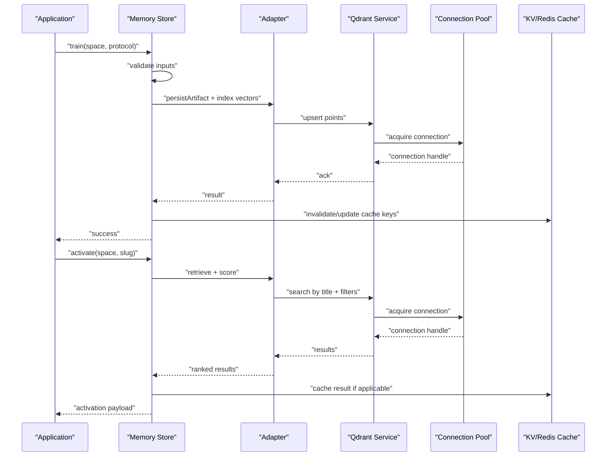

**Diagram sources**
- [src/services/memory/store.ts](file://src/services/memory/store.ts)
- [src/services/memory/store-adapter.ts](file://src/services/memory/store-adapter.ts)
- [src/services/qdrant/service.ts](file://src/services/qdrant/service.ts)
- [src/services/qdrant/connection.ts](file://src/services/qdrant/connection.ts)
- [src/services/key-value-store-factory.ts](file://src/services/key-value-store-factory.ts)
- [src/services/redis-cache.ts](file://src/services/redis-cache.ts)

## Detailed Component Analysis

### Memory Store Interface and Orchestration
- Responsibilities:
  - Expose high-level methods for training, activation, search, listing, and artifacts.
  - Coordinate validation, adapter calls, and cache interactions.
  - Enforce tenant scoping and version compatibility checks.
- Key files:
  - [src/services/memory/store.ts](file://src/services/memory/store.ts)
  - [src/services/memory/store-methods.ts](file://src/services/memory/store-methods.ts)

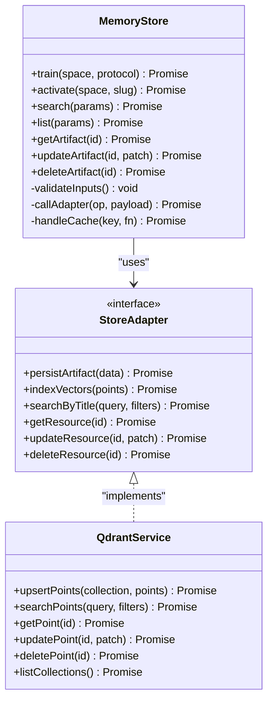

**Diagram sources**
- [src/services/memory/store.ts](file://src/services/memory/store.ts)
- [src/services/memory/store-adapter.ts](file://src/services/memory/store-adapter.ts)
- [src/services/qdrant/service.ts](file://src/services/qdrant/service.ts)

**Section sources**
- [src/services/memory/store.ts](file://src/services/memory/store.ts)
- [src/services/memory/store-methods.ts](file://src/services/memory/store-methods.ts)
- [src/services/memory/store-adapter.ts](file://src/services/memory/store-adapter.ts)
- [src/services/qdrant/service.ts](file://src/services/qdrant/service.ts)

### Initialization Process and Lifecycle
- Responsibilities:
  - Ensure required collections exist and are configured.
  - Prepare indexes and default settings.
  - Run readiness checks and expose health endpoints.
- Key files:
  - [src/services/memory/store-init.ts](file://src/services/memory/store-init.ts)
  - [src/services/qdrant/initialization.ts](file://src/services/qdrant/initialization.ts)
  - [src/services/qdrant/index.ts](file://src/services/qdrant/index.ts)

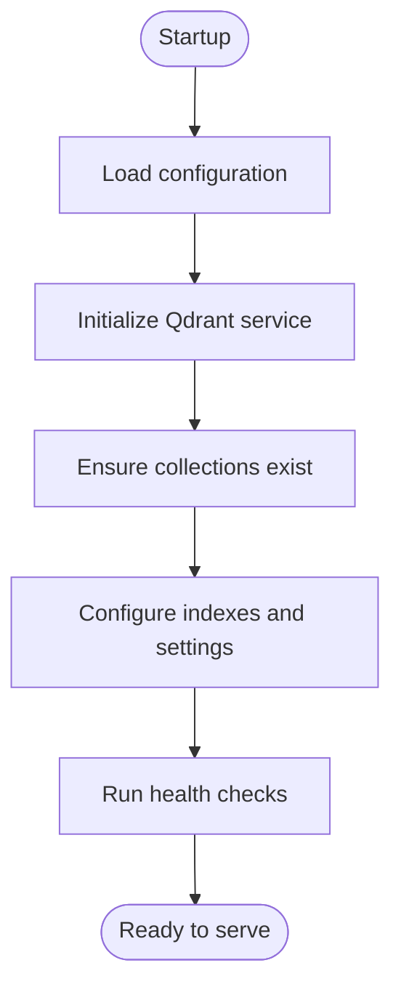

**Diagram sources**
- [src/services/memory/store-init.ts](file://src/services/memory/store-init.ts)
- [src/services/qdrant/initialization.ts](file://src/services/qdrant/initialization.ts)
- [src/services/qdrant/index.ts](file://src/services/qdrant/index.ts)

**Section sources**
- [src/services/memory/store-init.ts](file://src/services/memory/store-init.ts)
- [src/services/qdrant/initialization.ts](file://src/services/qdrant/initialization.ts)
- [src/services/qdrant/index.ts](file://src/services/qdrant/index.ts)

### Data Access Patterns and Abstraction Layer
- Responsibilities:
  - Provide a uniform adapter contract for storage operations.
  - Implement default and header-specific handlers for common logic.
  - Map Qdrant points to domain memory objects.
- Key files:
  - [src/services/memory/store-adapter.ts](file://src/services/memory/store-adapter.ts)
  - [src/services/memory/store-adapter-helpers.ts](file://src/services/memory/store-adapter-helpers.ts)
  - [src/services/memory/store-adapter-default-handler.ts](file://src/services/memory/store-adapter-default-handler.ts)
  - [src/services/memory/store-adapter-header-handler.ts](file://src/services/memory/store-adapter-header-handler.ts)
  - [src/services/memory/qdrant-point-to-memory.ts](file://src/services/memory/qdrant-point-to-memory.ts)

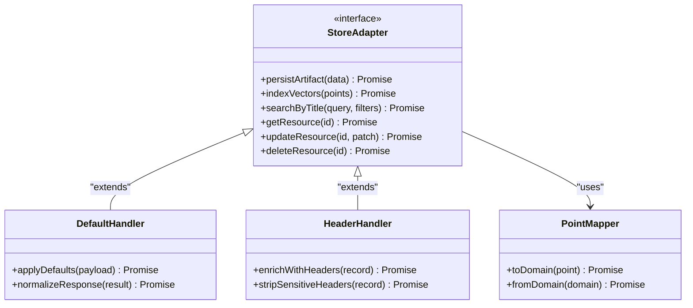

**Diagram sources**
- [src/services/memory/store-adapter.ts](file://src/services/memory/store-adapter.ts)
- [src/services/memory/store-adapter-default-handler.ts](file://src/services/memory/store-adapter-default-handler.ts)
- [src/services/memory/store-adapter-header-handler.ts](file://src/services/memory/store-adapter-header-handler.ts)
- [src/services/memory/qdrant-point-to-memory.ts](file://src/services/memory/qdrant-point-to-memory.ts)

**Section sources**
- [src/services/memory/store-adapter.ts](file://src/services/memory/store-adapter.ts)
- [src/services/memory/store-adapter-helpers.ts](file://src/services/memory/store-adapter-helpers.ts)
- [src/services/memory/store-adapter-default-handler.ts](file://src/services/memory/store-adapter-default-handler.ts)
- [src/services/memory/store-adapter-header-handler.ts](file://src/services/memory/store-adapter-header-handler.ts)
- [src/services/memory/qdrant-point-to-memory.ts](file://src/services/memory/qdrant-point-to-memory.ts)

### Connection Management and Concurrency
- Responsibilities:
  - Manage connection pooling to Qdrant.
  - Limit concurrency to protect downstream systems.
  - Handle retries and timeouts at the connection layer.
- Key files:
  - [src/services/qdrant/connection.ts](file://src/services/qdrant/connection.ts)
- Shared utilities:
  - [src/utils/concurrency-limit.ts](file://src/utils/concurrency-limit.ts)

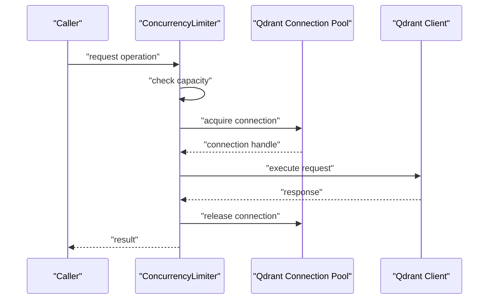

**Diagram sources**
- [src/services/qdrant/connection.ts](file://src/services/qdrant/connection.ts)
- [src/utils/concurrency-limit.ts](file://src/utils/concurrency-limit.ts)

**Section sources**
- [src/services/qdrant/connection.ts](file://src/services/qdrant/connection.ts)
- [src/utils/concurrency-limit.ts](file://src/utils/concurrency-limit.ts)

### Error Handling Strategies
- Responsibilities:
  - Centralized error handling and structured logging.
  - Consistent error shapes for callers.
  - Graceful degradation where possible.
- Key files:
  - [src/utils/global-error-handlers.ts](file://src/utils/global-error-handlers.ts)
  - [src/utils/log-core.ts](file://src/utils/log-core.ts)
  - [src/utils/structured-logger.ts](file://src/utils/structured-logger.ts)

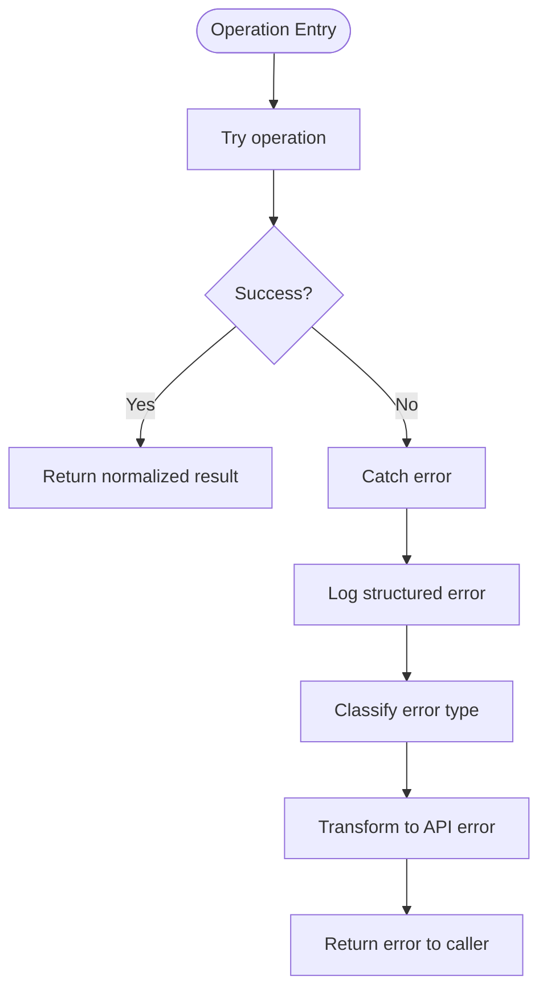

**Diagram sources**
- [src/utils/global-error-handlers.ts](file://src/utils/global-error-handlers.ts)
- [src/utils/log-core.ts](file://src/utils/log-core.ts)
- [src/utils/structured-logger.ts](file://src/utils/structured-logger.ts)

**Section sources**
- [src/utils/global-error-handlers.ts](file://src/utils/global-error-handlers.ts)
- [src/utils/log-core.ts](file://src/utils/log-core.ts)
- [src/utils/structured-logger.ts](file://src/utils/structured-logger.ts)

### Transaction-Like Semantics and Atomicity
- Responsibilities:
  - Group related writes into logical transactions using adapter abstractions.
  - Ensure consistency across point insertions and metadata updates.
  - Rollback or compensate on partial failures.
- Key files:
  - [src/services/qdrant/memory-updates.ts](file://src/services/qdrant/memory-updates.ts)
  - [src/services/memory/store-adapter.ts](file://src/services/memory/store-adapter.ts)

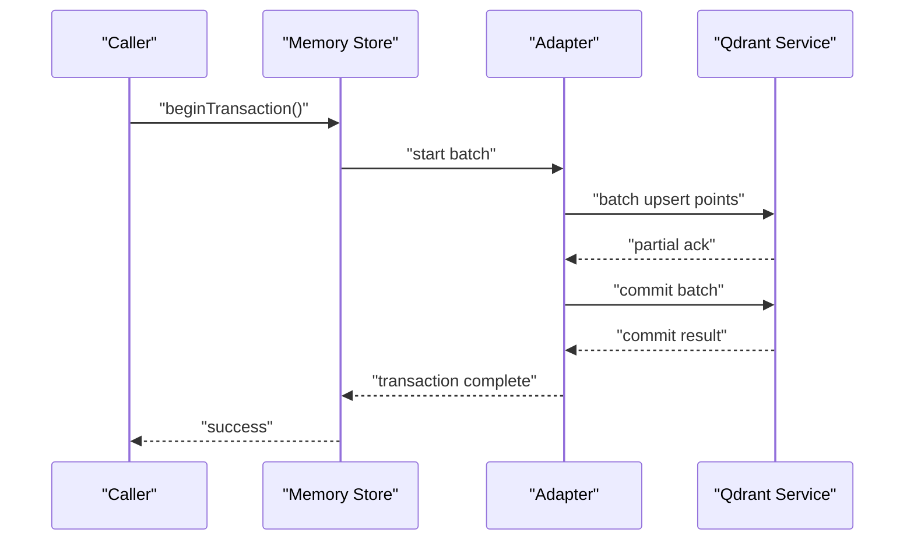

**Diagram sources**
- [src/services/qdrant/memory-updates.ts](file://src/services/qdrant/memory-updates.ts)
- [src/services/memory/store-adapter.ts](file://src/services/memory/store-adapter.ts)

**Section sources**
- [src/services/qdrant/memory-updates.ts](file://src/services/qdrant/memory-updates.ts)
- [src/services/memory/store-adapter.ts](file://src/services/memory/store-adapter.ts)

### Caching Mechanisms and Invalidation
- Responsibilities:
  - Provide a key-value store abstraction backed by Redis or in-memory stores.
  - Cache frequent reads and invalidate on writes.
- Key files:
  - [src/services/key-value-store-factory.ts](file://src/services/key-value-store-factory.ts)
  - [src/services/key-value-store.ts](file://src/services/key-value-store.ts)
  - [src/services/redis-cache.ts](file://src/services/redis-cache.ts)
  - [src/services/redis.ts](file://src/services/redis.ts)

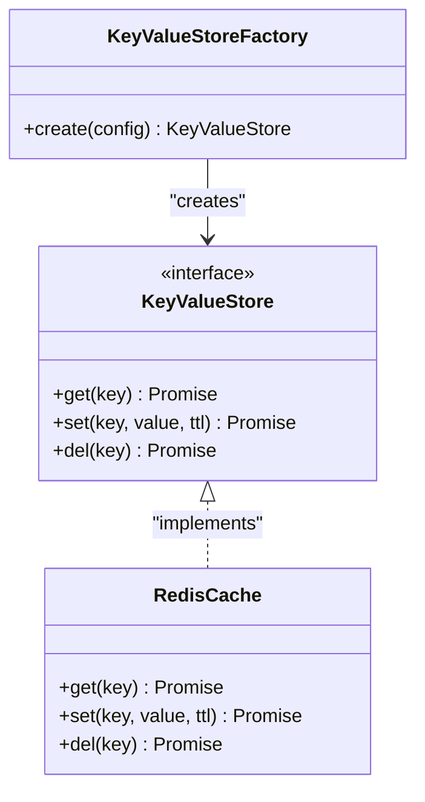

**Diagram sources**
- [src/services/key-value-store-factory.ts](file://src/services/key-value-store-factory.ts)
- [src/services/key-value-store.ts](file://src/services/key-value-store.ts)
- [src/services/redis-cache.ts](file://src/services/redis-cache.ts)
- [src/services/redis.ts](file://src/services/redis.ts)

**Section sources**
- [src/services/key-value-store-factory.ts](file://src/services/key-value-store-factory.ts)
- [src/services/key-value-store.ts](file://src/services/key-value-store.ts)
- [src/services/redis-cache.ts](file://src/services/redis-cache.ts)
- [src/services/redis.ts](file://src/services/redis.ts)

### Search and Retrieval Pipelines
- Responsibilities:
  - Title similarity search and activation search field mapping.
  - Backfill activation search data when needed.
  - Convert Qdrant points to domain memory objects.
- Key files:
  - [src/services/memory/store-title-similarity-search.ts](file://src/services/memory/store-title-similarity-search.ts)
  - [src/services/memory/activation-search-backfill.ts](file://src/services/memory/activation-search-backfill.ts)
  - [src/services/memory/activation-search-fields.ts](file://src/services/memory/activation-search-fields.ts)
  - [src/services/memory/qdrant-point-to-memory.ts](file://src/services/memory/qdrant-point-to-memory.ts)
  - [src/services/qdrant/search.ts](file://src/services/qdrant/search.ts)
  - [src/services/qdrant/memory-retrieval.ts](file://src/services/qdrant/memory-retrieval.ts)

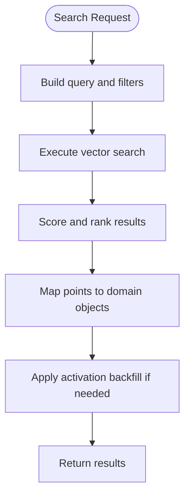

**Diagram sources**
- [src/services/memory/store-title-similarity-search.ts](file://src/services/memory/store-title-similarity-search.ts)
- [src/services/memory/activation-search-backfill.ts](file://src/services/memory/activation-search-backfill.ts)
- [src/services/memory/activation-search-fields.ts](file://src/services/memory/activation-search-fields.ts)
- [src/services/memory/qdrant-point-to-memory.ts](file://src/services/memory/qdrant-point-to-memory.ts)
- [src/services/qdrant/search.ts](file://src/services/qdrant/search.ts)
- [src/services/qdrant/memory-retrieval.ts](file://src/services/qdrant/memory-retrieval.ts)

**Section sources**
- [src/services/memory/store-title-similarity-search.ts](file://src/services/memory/store-title-similarity-search.ts)
- [src/services/memory/activation-search-backfill.ts](file://src/services/memory/activation-search-backfill.ts)
- [src/services/memory/activation-search-fields.ts](file://src/services/memory/activation-search-fields.ts)
- [src/services/memory/qdrant-point-to-memory.ts](file://src/services/memory/qdrant-point-to-memory.ts)
- [src/services/qdrant/search.ts](file://src/services/qdrant/search.ts)
- [src/services/qdrant/memory-retrieval.ts](file://src/services/qdrant/memory-retrieval.ts)

### Validation and Data Integrity
- Responsibilities:
  - Validate protocol structures and markdown sizes.
  - Prevent invalid or oversized payloads from reaching the backend.
- Key files:
  - [src/services/memory/validate-protocol-structure.ts](file://src/services/memory/validate-protocol-structure.ts)
  - [src/services/memory/validate-adapter-markdown-size.ts](file://src/services/memory/validate-adapter-markdown-size.ts)

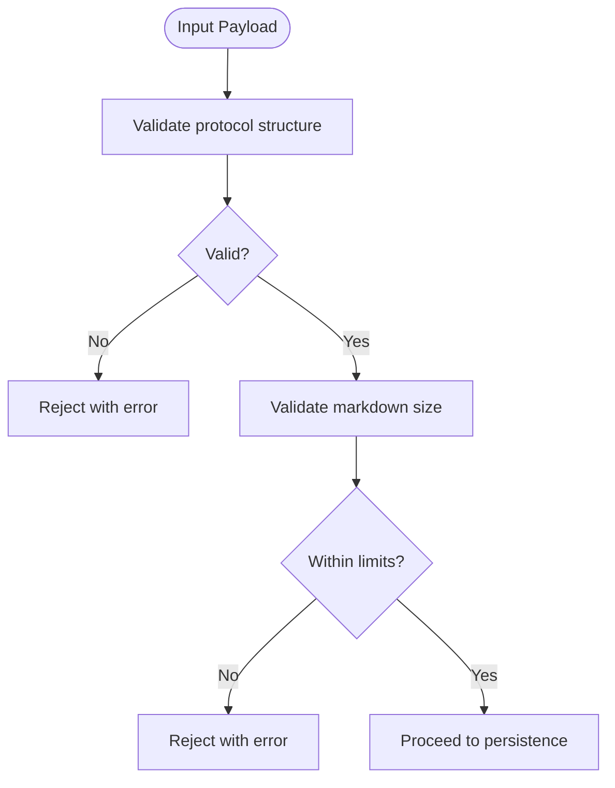

**Diagram sources**
- [src/services/memory/validate-protocol-structure.ts](file://src/services/memory/validate-protocol-structure.ts)
- [src/services/memory/validate-adapter-markdown-size.ts](file://src/services/memory/validate-adapter-markdown-size.ts)

**Section sources**
- [src/services/memory/validate-protocol-structure.ts](file://src/services/memory/validate-protocol-structure.ts)
- [src/services/memory/validate-adapter-markdown-size.ts](file://src/services/memory/validate-adapter-markdown-size.ts)

### Artifact Operations
- Responsibilities:
  - Read, update, and delete artifacts associated with memory records.
- Key files:
  - [src/services/memory/store-artifact.ts](file://src/services/memory/store-artifact.ts)
  - [src/services/qdrant/resources.ts](file://src/services/qdrant/resources.ts)

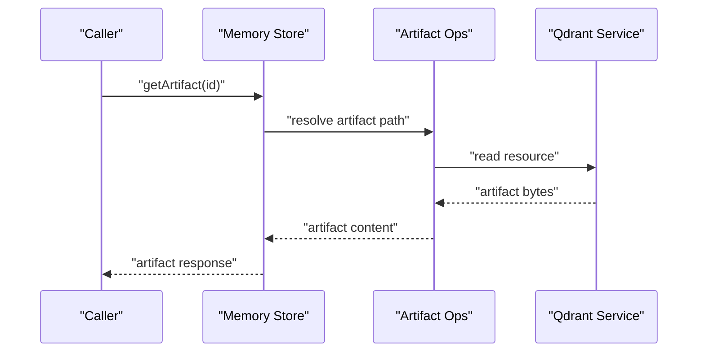

**Diagram sources**
- [src/services/memory/store-artifact.ts](file://src/services/memory/store-artifact.ts)
- [src/services/qdrant/resources.ts](file://src/services/qdrant/resources.ts)

**Section sources**
- [src/services/memory/store-artifact.ts](file://src/services/memory/store-artifact.ts)
- [src/services/qdrant/resources.ts](file://src/services/qdrant/resources.ts)

### Integration with Broader System
- Responsibilities:
  - Connect to HTTP server and CLI entry points.
  - Provide metrics and health endpoints.
  - Support tenant context and URI building.
- Key files:
  - [src/server.ts](file://src/server.ts)
  - [src/bootstrap.ts](file://src/bootstrap.ts)
  - [src/utils/tenant-context.ts](file://src/utils/tenant-context.ts)
  - [src/utils/uri-builder.ts](file://src/utils/uri-builder.ts)

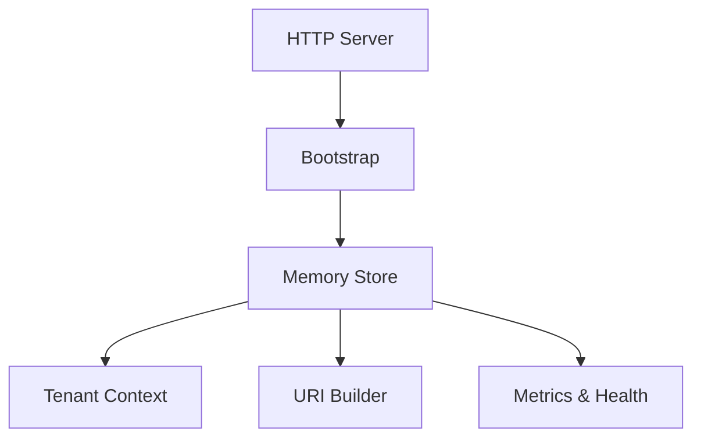

**Diagram sources**
- [src/server.ts](file://src/server.ts)
- [src/bootstrap.ts](file://src/bootstrap.ts)
- [src/utils/tenant-context.ts](file://src/utils/tenant-context.ts)
- [src/utils/uri-builder.ts](file://src/utils/uri-builder.ts)

**Section sources**
- [src/server.ts](file://src/server.ts)
- [src/bootstrap.ts](file://src/bootstrap.ts)
- [src/utils/tenant-context.ts](file://src/utils/tenant-context.ts)
- [src/utils/uri-builder.ts](file://src/utils/uri-builder.ts)

## Dependency Analysis
The memory store depends on:
- Qdrant service for vector operations and persistence.
- Key-value store factory for caching.
- Concurrency limiter for safe parallelism.
- Logging and error handling utilities.
- Tenant context and URI builder for multi-tenancy and addressing.

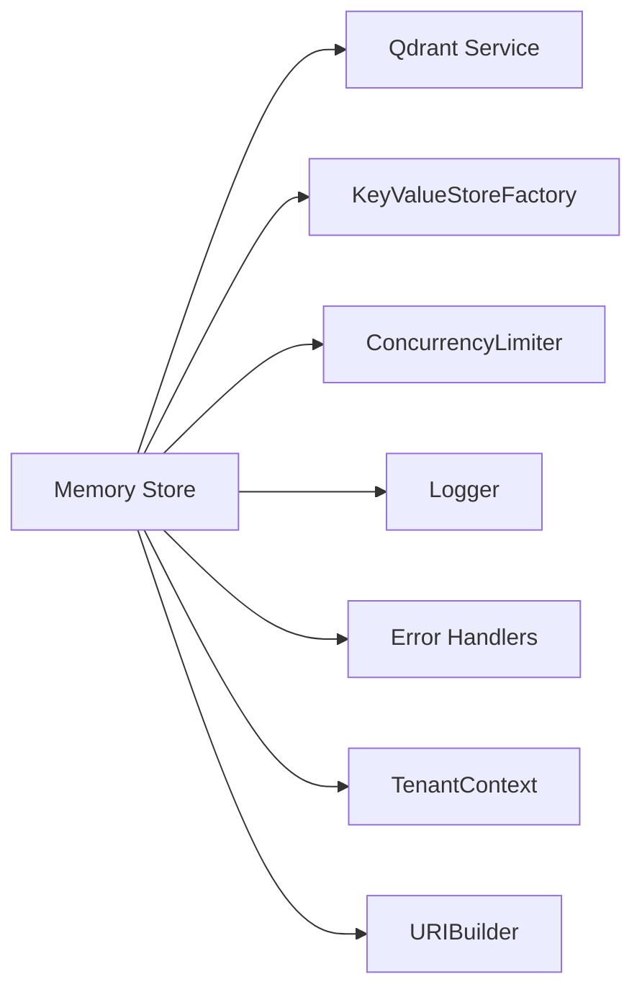

**Diagram sources**
- [src/services/memory/store.ts](file://src/services/memory/store.ts)
- [src/services/qdrant/service.ts](file://src/services/qdrant/service.ts)
- [src/services/key-value-store-factory.ts](file://src/services/key-value-store-factory.ts)
- [src/utils/concurrency-limit.ts](file://src/utils/concurrency-limit.ts)
- [src/utils/log-core.ts](file://src/utils/log-core.ts)
- [src/utils/global-error-handlers.ts](file://src/utils/global-error-handlers.ts)
- [src/utils/tenant-context.ts](file://src/utils/tenant-context.ts)
- [src/utils/uri-builder.ts](file://src/utils/uri-builder.ts)

**Section sources**
- [src/services/memory/store.ts](file://src/services/memory/store.ts)
- [src/services/qdrant/service.ts](file://src/services/qdrant/service.ts)
- [src/services/key-value-store-factory.ts](file://src/services/key-value-store-factory.ts)
- [src/utils/concurrency-limit.ts](file://src/utils/concurrency-limit.ts)
- [src/utils/log-core.ts](file://src/utils/log-core.ts)
- [src/utils/global-error-handlers.ts](file://src/utils/global-error-handlers.ts)
- [src/utils/tenant-context.ts](file://src/utils/tenant-context.ts)
- [src/utils/uri-builder.ts](file://src/utils/uri-builder.ts)

## Performance Considerations
- Vector Indexing: Use appropriate dimensionality and distance metrics; leverage collection-level settings for optimal recall vs. speed.
- Batch Writes: Prefer batch upserts to reduce round-trips and increase throughput.
- Concurrency Limits: Tune concurrency limits based on Qdrant capacity and network latency.
- Caching: Cache frequent reads with short TTLs; invalidate aggressively on writes.
- Query Optimization: Filter early and minimize payload sizes; use title similarity only when necessary.
- Resource Monitoring: Monitor Qdrant metrics and adjust shard counts or replica factors as needed.

[No sources needed since this section provides general guidance]

## Troubleshooting Guide
Common issues and diagnostics:
- Connection errors: Verify Qdrant connectivity and credentials; check connection pool exhaustion.
- Validation failures: Inspect protocol structure and markdown size constraints.
- Search anomalies: Review filters, title similarity parameters, and backfill status.
- Cache misses: Confirm key naming and invalidation triggers.
- Errors and logs: Use structured logs and global error handlers to trace failures.

**Section sources**
- [src/services/qdrant/connection.ts](file://src/services/qdrant/connection.ts)
- [src/services/memory/validate-protocol-structure.ts](file://src/services/memory/validate-protocol-structure.ts)
- [src/services/memory/validate-adapter-markdown-size.ts](file://src/services/memory/validate-adapter-markdown-size.ts)
- [src/services/memory/activation-search-backfill.ts](file://src/services/memory/activation-search-backfill.ts)
- [src/services/key-value-store-factory.ts](file://src/services/key-value-store-factory.ts)
- [src/utils/global-error-handlers.ts](file://src/utils/global-error-handlers.ts)
- [src/utils/log-core.ts](file://src/utils/log-core.ts)

## Conclusion
The memory store provides a robust, extensible abstraction over Qdrant with clear separation of concerns: high-level orchestration, adapter-based backend access, validation, caching, and lifecycle management. Its design supports concurrent access, scalable search, and consistent operations across backends, integrating seamlessly with the broader application through standardized interfaces and utilities.

[No sources needed since this section summarizes without analyzing specific files]

## Appendices

### Configuration Examples
- Qdrant connection:
  - Base URL, authentication, timeout, retry policy.
  - Collection names and vector dimensions.
- Caching:
  - Redis URL, TTL defaults, fallback to in-memory.
- Concurrency:
  - Max parallel operations per tenant.
- Tenancy:
  - Tenant ID propagation and scope enforcement.

[No sources needed since this section provides general guidance]