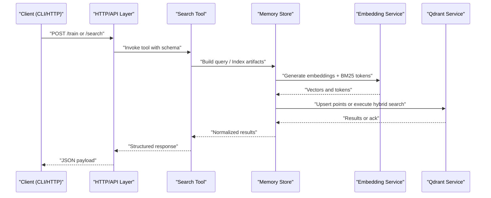
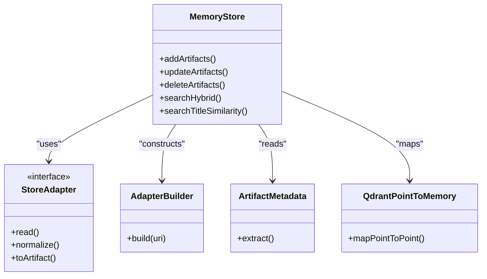
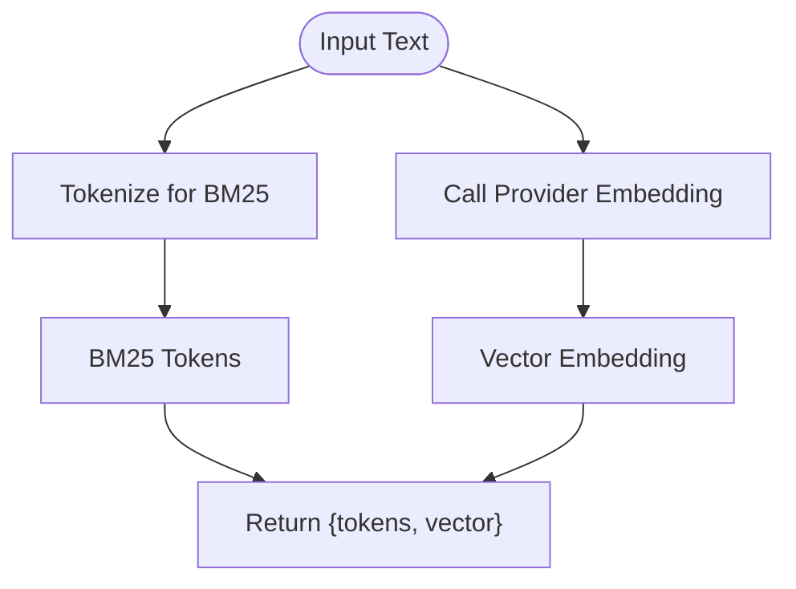
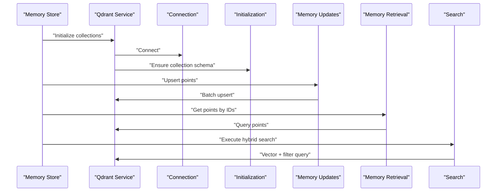
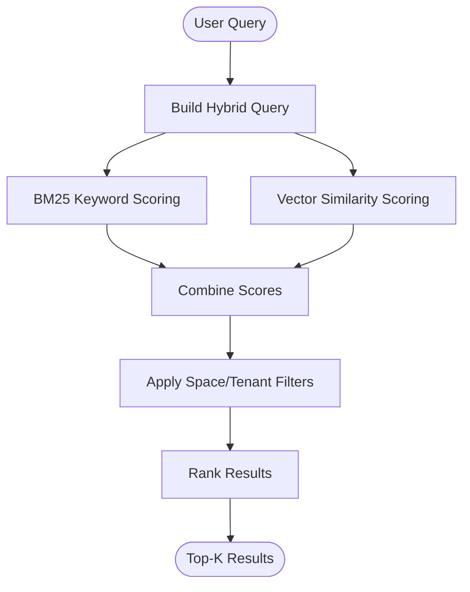
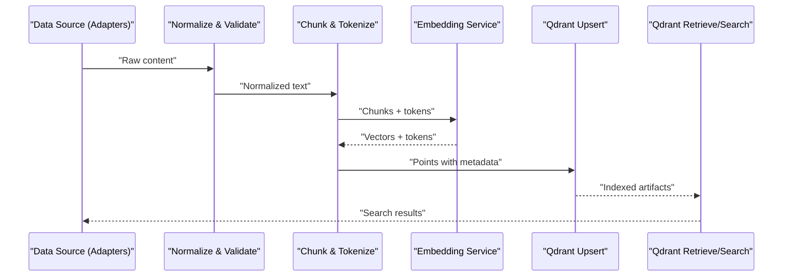
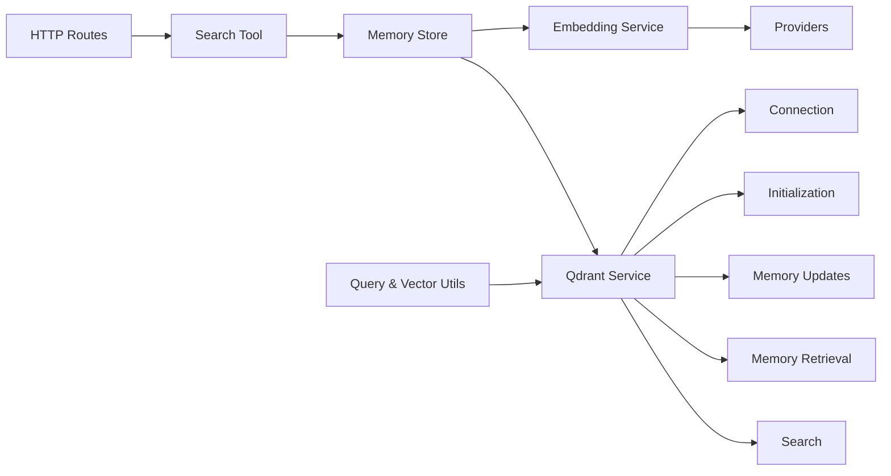

# Memory and Semantic Search System

<cite>
**Referenced Files in This Document**
- [src/services/memory/store.ts](file://src/services/memory/store.ts)
- [src/services/memory/store-methods.ts](file://src/services/memory/store-methods.ts)
- [src/services/memory/store-init.ts](file://src/services/memory/store-init.ts)
- [src/services/memory/store-artifact.ts](file://src/services/memory/store-artifact.ts)
- [src/services/memory/store-adapter.ts](file://src/services/memory/store-adapter.ts)
- [src/services/memory/adapter-builder.ts](file://src/services/memory/adapter-builder.ts)
- [src/services/memory/qdrant-point-to-memory.ts](file://src/services/memory/qdrant-point-to-memory.ts)
- [src/services/memory/memory-accessors.ts](file://src/services/memory/memory-accessors.ts)
- [src/services/memory/activation-search-fields.ts](file://src/services/memory/activation-search-fields.ts)
- [src/services/memory/activation-pattern-payload.ts](file://src/services/memory/activation-pattern-payload.ts)
- [src/services/memory/validate-protocol-structure.ts](file://src/services/memory/validate-protocol-structure.ts)
- [src/services/memory/validate-adapter-markdown-size.ts](file://src/services/memory/validate-adapter-markdown-size.ts)
- [src/services/memory/store-title-similarity-search.ts](file://src/services/memory/store-title-similarity-search.ts)
- [src/services/memory/store-adapter-default-handler.ts](file://src/services/memory/store-adapter-default-handler.ts)
- [src/services/memory/store-adapter-header-handler.ts](file://src/services/memory/store-adapter-header-handler.ts)
- [src/services/memory/store-adapter-helpers.ts](file://src/services/memory/store-adapter-helpers.ts)
- [src/services/memory/artifact-metadata.ts](file://src/services/memory/artifact-metadata.ts)
- [src/services/qdrant/service.ts](file://src/services/qdrant/service.ts)
- [src/services/qdrant/connection.ts](file://src/services/qdrant/connection.ts)
- [src/services/qdrant/index.ts](file://src/services/qdrant/index.ts)
- [src/services/qdrant/initialization.ts](file://src/services/qdrant/initialization.ts)
- [src/services/qdrant/memory-store.ts](file://src/services/qdrant/memory-store.ts)
- [src/services/qdrant/memory-updates.ts](file://src/services/qdrant/memory-updates.ts)
- [src/services/qdrant/memory-retrieval.ts](file://src/services/qdrant/memory-retrieval.ts)
- [src/services/qdrant/search.ts](file://src/services/qdrant/search.ts)
- [src/services/qdrant/types.ts](file://src/services/qdrant/types.ts)
- [src/services/qdrant/protocol.ts](file://src/services/qdrant/protocol.ts)
- [src/services/qdrant/resources.ts](file://src/services/qdrant/resources.ts)
- [src/services/qdrant/snapshots.ts](file://src/services/qdrant/snapshots.ts)
- [src/services/qdrant/utils.ts](file://src/services/qdrant/utils.ts)
- [src/services/embedding/service.ts](file://src/services/embedding/service.ts)
- [src/services/embedding/config.ts](file://src/services/embedding/config.ts)
- [src/services/embedding/providers.ts](file://src/services/embedding/providers.ts)
- [src/services/embedding/bm25-tokenizer.ts](file://src/services/embedding/bm25-tokenizer.ts)
- [src/services/embedding/audit.ts](file://src/services/embedding/audit.ts)
- [src/services/embedding/health.ts](file://src/services/embedding/health.ts)
- [src/services/embedding/types.ts](file://src/services/embedding/types.ts)
- [src/tools/search.ts](file://src/tools/search.ts)
- [src/tools/search_output.ts](file://src/tools/search_output.ts)
- [src/tools/search_schema.ts](file://src/tools/search_schema.ts)
- [src/constants/builtin-search-meta.ts](file://src/constants/builtin-search-meta.ts)
- [src/utils/qdrant-query-utils.ts](file://src/utils/qdrant-query-utils.ts)
- [src/utils/qdrant-vector-management.ts](file://src/utils/qdrant-vector-management.ts)
- [src/utils/qdrant-vector-types.ts](file://src/utils/qdrant-vector-types.ts)
- [src/utils/qdrant-collection-utils.ts](file://src/utils/qdrant-collection-utils.ts)
- [src/utils/memory-body.ts](file://src/utils/memory-body.ts)
- [src/utils/memory-store-utils.ts](file://src/utils/memory-store-utils.ts)
- [src/utils/resolve-space-param.ts](file://src/utils/resolve-space-param.ts)
- [src/utils/space-filter.ts](file://src/utils/space-filter.ts)
- [src/http/http-api-routes.ts](file://src/http/http-api-routes.ts)
- [src/http/http-api-dump.ts](file://src/http/http-api-dump.ts)
- [src/http/http-api-train-json.ts](file://src/http/http-api-train-json.ts)
- [src/cli/commands/search.ts](file://src/cli/commands/search.ts)
- [scripts/deploy-raw-qdrant-search.mjs](file://scripts/deploy-raw-qdrant-search.mjs)
</cite>

## Table of Contents
1. [Introduction](#introduction)
2. [Project Structure](#project-structure)
3. [Core Components](#core-components)
4. [Architecture Overview](#architecture-overview)
5. [Detailed Component Analysis](#detailed-component-analysis)
6. [Dependency Analysis](#dependency-analysis)
7. [Performance Considerations](#performance-considerations)
8. [Troubleshooting Guide](#troubleshooting-guide)
9. [Conclusion](#conclusion)
10. [Appendices](#appendices)

## Introduction
This document explains the memory and semantic search system, focusing on:
- The memory store architecture and its adapter pattern for diverse data sources
- Vector embedding generation using Qdrant and embedding service configuration
- Semantic search capabilities, including hybrid search combining BM25 keyword matching with vector similarity
- Data flow from raw content to searchable vectors, covering preprocessing, chunking, and metadata extraction
- Examples of memory operations, search queries, and embedding configuration
- Performance optimization, caching strategies, and scalability considerations for large datasets

The system is designed to ingest heterogeneous content via adapters, transform it into structured artifacts, generate embeddings, index them in Qdrant, and support both semantic and hybrid search across spaces and tenants.

## Project Structure
At a high level, the memory and search subsystem spans several modules:
- Memory layer: adapters, artifact handling, validation, and accessors
- Embedding layer: provider abstraction, tokenization, and configuration
- Qdrant integration: connection, initialization, indexing, retrieval, and search
- Tools and HTTP endpoints: user-facing APIs for training, search, and export
- Utilities: query building, vector management, space filtering, and tenant context

```mermaid
graph TB
subgraph "Memory Layer"
A["store.ts"]
B["store-methods.ts"]
C["store-init.ts"]
D["store-artifact.ts"]
E["store-adapter.ts"]
F["adapter-builder.ts"]
G["qdrant-point-to-memory.ts"]
H["memory-accessors.ts"]
I["artifact-metadata.ts"]
end
subgraph "Embedding Layer"
J["embedding/service.ts"]
K["embedding/config.ts"]
L["embedding/providers.ts"]
M["embedding/bm25-tokenizer.ts"]
N["embedding/types.ts"]
end
subgraph "Qdrant Integration"
O["qdrant/service.ts"]
P["qdrant/connection.ts"]
Q["qdrant/initialization.ts"]
R["qdrant/memory-store.ts"]
S["qdrant/memory-updates.ts"]
T["qdrant/memory-retrieval.ts"]
U["qdrant/search.ts"]
V["qdrant/types.ts"]
W["qdrant/protocol.ts"]
X["qdrant/resources.ts"]
Y["qdrant/snapshots.ts"]
Z["qdrant/utils.ts"]
end
subgraph "Tools & HTTP"
AA["tools/search.ts"]
AB["http-api-routes.ts"]
AC["http-api-train-json.ts"]
AD["cli/commands/search.ts"]
end
subgraph "Utilities"
AE["utils/qdrant-query-utils.ts"]
AF["utils/qdrant-vector-management.ts"]
AG["utils/qdrant-vector-types.ts"]
AH["utils/qdrant-collection-utils.ts"]
AI["utils/memory-body.ts"]
AJ["utils/memory-store-utils.ts"]
AK["utils/resolve-space-param.ts"]
AL["utils/space-filter.ts"]
end
A --> B
A --> C
A --> D
A --> E
A --> F
A --> G
A --> H
A --> I
A --> J
J --> K
J --> L
J --> M
J --> N
A --> O
O --> P
O --> Q
O --> R
O --> S
O --> T
O --> U
O --> V
O --> W
O --> X
O --> Y
O --> Z
AA --> A
AB --> AA
AC --> A
AD --> AA
AE --> O
AF --> O
AG --> O
AH --> O
AI --> A
AJ --> A
AK --> A
AL --> A
```

**Diagram sources**
- [src/services/memory/store.ts](file://src/services/memory/store.ts)
- [src/services/memory/store-methods.ts](file://src/services/memory/store-methods.ts)
- [src/services/memory/store-init.ts](file://src/services/memory/store-init.ts)
- [src/services/memory/store-artifact.ts](file://src/services/memory/store-artifact.ts)
- [src/services/memory/store-adapter.ts](file://src/services/memory/store-adapter.ts)
- [src/services/memory/adapter-builder.ts](file://src/services/memory/adapter-builder.ts)
- [src/services/memory/qdrant-point-to-memory.ts](file://src/services/memory/qdrant-point-to-memory.ts)
- [src/services/memory/memory-accessors.ts](file://src/services/memory/memory-accessors.ts)
- [src/services/memory/artifact-metadata.ts](file://src/services/memory/artifact-metadata.ts)
- [src/services/embedding/service.ts](file://src/services/embedding/service.ts)
- [src/services/embedding/config.ts](file://src/services/embedding/config.ts)
- [src/services/embedding/providers.ts](file://src/services/embedding/providers.ts)
- [src/services/embedding/bm25-tokenizer.ts](file://src/services/embedding/bm25-tokenizer.ts)
- [src/services/embedding/types.ts](file://src/services/embedding/types.ts)
- [src/services/qdrant/service.ts](file://src/services/qdrant/service.ts)
- [src/services/qdrant/connection.ts](file://src/services/qdrant/connection.ts)
- [src/services/qdrant/initialization.ts](file://src/services/qdrant/initialization.ts)
- [src/services/qdrant/memory-store.ts](file://src/services/qdrant/memory-store.ts)
- [src/services/qdrant/memory-updates.ts](file://src/services/qdrant/memory-updates.ts)
- [src/services/qdrant/memory-retrieval.ts](file://src/services/qdrant/memory-retrieval.ts)
- [src/services/qdrant/search.ts](file://src/services/qdrant/search.ts)
- [src/services/qdrant/types.ts](file://src/services/qdrant/types.ts)
- [src/services/qdrant/protocol.ts](file://src/services/qdrant/protocol.ts)
- [src/services/qdrant/resources.ts](file://src/services/qdrant/resources.ts)
- [src/services/qdrant/snapshots.ts](file://src/services/qdrant/snapshots.ts)
- [src/services/qdrant/utils.ts](file://src/services/qdrant/utils.ts)
- [src/tools/search.ts](file://src/tools/search.ts)
- [src/http/http-api-routes.ts](file://src/http/http-api-routes.ts)
- [src/http/http-api-train-json.ts](file://src/http/http-api-train-json.ts)
- [src/cli/commands/search.ts](file://src/cli/commands/search.ts)
- [src/utils/qdrant-query-utils.ts](file://src/utils/qdrant-query-utils.ts)
- [src/utils/qdrant-vector-management.ts](file://src/utils/qdrant-vector-management.ts)
- [src/utils/qdrant-vector-types.ts](file://src/utils/qdrant-vector-types.ts)
- [src/utils/qdrant-collection-utils.ts](file://src/utils/qdrant-collection-utils.ts)
- [src/utils/memory-body.ts](file://src/utils/memory-body.ts)
- [src/utils/memory-store-utils.ts](file://src/utils/memory-store-utils.ts)
- [src/utils/resolve-space-param.ts](file://src/utils/resolve-space-param.ts)
- [src/utils/space-filter.ts](file://src/utils/space-filter.ts)

**Section sources**
- [src/services/memory/store.ts](file://src/services/memory/store.ts)
- [src/services/qdrant/service.ts](file://src/services/qdrant/service.ts)
- [src/services/embedding/service.ts](file://src/services/embedding/service.ts)
- [src/tools/search.ts](file://src/tools/search.ts)
- [src/http/http-api-routes.ts](file://src/http/http-api-routes.ts)

## Core Components
- Memory Store: Central orchestrator for memory operations, coordinating adapters, artifacts, and persistence. It provides methods for adding, updating, deleting, and searching memories.
- Adapters: Pluggable components that read content from various sources (e.g., files, MCP tools, shell commands), normalize content, and produce artifacts suitable for indexing.
- Artifact Pipeline: Converts normalized content into structured artifacts with metadata, text chunks, and optional title or body segments.
- Embedding Service: Abstracts embedding providers, configures models, and exposes functions to generate vectors and BM25 tokens.
- Qdrant Integration: Manages connections, collections, points, and performs upserts, retrieval, and search operations.
- Hybrid Search: Combines BM25 keyword scoring with vector similarity to improve recall and precision.
- Tools and HTTP Endpoints: Expose training, search, and export functionality to CLI and HTTP clients.

Key responsibilities:
- Normalize and validate input content
- Chunk and tokenize text for BM25
- Generate embeddings via configured providers
- Upsert points into Qdrant with rich metadata
- Execute hybrid queries with filters by space and tenant

**Section sources**
- [src/services/memory/store.ts](file://src/services/memory/store.ts)
- [src/services/memory/store-methods.ts](file://src/services/memory/store-methods.ts)
- [src/services/memory/store-artifact.ts](file://src/services/memory/store-artifact.ts)
- [src/services/memory/store-adapter.ts](file://src/services/memory/store-adapter.ts)
- [src/services/memory/adapter-builder.ts](file://src/services/memory/adapter-builder.ts)
- [src/services/embedding/service.ts](file://src/services/embedding/service.ts)
- [src/services/qdrant/service.ts](file://src/services/qdrant/service.ts)
- [src/tools/search.ts](file://src/tools/search.ts)

## Architecture Overview
The system follows a layered architecture:
- Presentation: CLI and HTTP endpoints
- Orchestration: Memory store and embedding service
- Persistence: Qdrant vector database
- Utilities: Query builders, vector utilities, space filters, and tenant context

**Diagram sources**
- [src/http/http-api-routes.ts](file://src/http/http-api-routes.ts)
- [src/tools/search.ts](file://src/tools/search.ts)
- [src/services/memory/store.ts](file://src/services/memory/store.ts)
- [src/services/embedding/service.ts](file://src/services/embedding/service.ts)
- [src/services/qdrant/service.ts](file://src/services/qdrant/service.ts)

## Detailed Component Analysis

### Memory Store and Adapter Pattern
The memory store coordinates ingestion and retrieval. Adapters implement a contract to read from different sources and produce standardized artifacts. An adapter builder constructs instances based on configuration.

**Diagram sources**
- [src/services/memory/store.ts](file://src/services/memory/store.ts)
- [src/services/memory/store-adapter.ts](file://src/services/memory/store-adapter.ts)
- [src/services/memory/adapter-builder.ts](file://src/services/memory/adapter-builder.ts)
- [src/services/memory/artifact-metadata.ts](file://src/services/memory/artifact-metadata.ts)
- [src/services/memory/qdrant-point-to-memory.ts](file://src/services/memory/qdrant-point-to-memory.ts)

Key behaviors:
- Validation: Protocol structure and markdown size limits are enforced before indexing.
- Accessors: Provide safe reading/writing patterns and helper utilities for memory bodies.
- Title similarity search: Dedicated path for title-based matching.

**Section sources**
- [src/services/memory/store.ts](file://src/services/memory/store.ts)
- [src/services/memory/store-methods.ts](file://src/services/memory/store-methods.ts)
- [src/services/memory/store-init.ts](file://src/services/memory/store-init.ts)
- [src/services/memory/store-artifact.ts](file://src/services/memory/store-artifact.ts)
- [src/services/memory/store-adapter.ts](file://src/services/memory/store-adapter.ts)
- [src/services/memory/adapter-builder.ts](file://src/services/memory/adapter-builder.ts)
- [src/services/memory/qdrant-point-to-memory.ts](file://src/services/memory/qdrant-point-to-memory.ts)
- [src/services/memory/memory-accessors.ts](file://src/services/memory/memory-accessors.ts)
- [src/services/memory/validate-protocol-structure.ts](file://src/services/memory/validate-protocol-structure.ts)
- [src/services/memory/validate-adapter-markdown-size.ts](file://src/services/memory/validate-adapter-markdown-size.ts)
- [src/services/memory/store-title-similarity-search.ts](file://src/services/memory/store-title-similarity-search.ts)

### Embedding Service and Providers
The embedding service abstracts provider-specific implementations and exposes unified methods for generating vectors and BM25 tokens. Configuration controls model selection, dimensions, and rate limiting.

**Diagram sources**
- [src/services/embedding/service.ts](file://src/services/embedding/service.ts)
- [src/services/embedding/config.ts](file://src/services/embedding/config.ts)
- [src/services/embedding/providers.ts](file://src/services/embedding/providers.ts)
- [src/services/embedding/bm25-tokenizer.ts](file://src/services/embedding/bm25-tokenizer.ts)
- [src/services/embedding/types.ts](file://src/services/embedding/types.ts)

Configuration highlights:
- Model selection and dimension alignment with Qdrant collection schema
- Rate limiting and health checks for provider availability
- Audit logging for embedding usage and errors

**Section sources**
- [src/services/embedding/service.ts](file://src/services/embedding/service.ts)
- [src/services/embedding/config.ts](file://src/services/embedding/config.ts)
- [src/services/embedding/providers.ts](file://src/services/embedding/providers.ts)
- [src/services/embedding/bm25-tokenizer.ts](file://src/services/embedding/bm25-tokenizer.ts)
- [src/services/embedding/audit.ts](file://src/services/embedding/audit.ts)
- [src/services/embedding/health.ts](file://src/services/embedding/health.ts)
- [src/services/embedding/types.ts](file://src/services/embedding/types.ts)

### Qdrant Integration and Indexing
Qdrant service manages connection lifecycle, collection initialization, and point operations. Memory updates and retrieval are encapsulated to ensure consistency and performance.

**Diagram sources**
- [src/services/qdrant/service.ts](file://src/services/qdrant/service.ts)
- [src/services/qdrant/connection.ts](file://src/services/qdrant/connection.ts)
- [src/services/qdrant/initialization.ts](file://src/services/qdrant/initialization.ts)
- [src/services/qdrant/memory-updates.ts](file://src/services/qdrant/memory-updates.ts)
- [src/services/qdrant/memory-retrieval.ts](file://src/services/qdrant/memory-retrieval.ts)
- [src/services/qdrant/search.ts](file://src/services/qdrant/search.ts)

Indexing strategy:
- Points include vector embeddings and rich metadata (space, tenant, artifact identifiers, titles, and body snippets).
- Collections are initialized with appropriate vector sizes and distance metrics aligned with embedding providers.
- Batch upserts optimize throughput for large datasets.

**Section sources**
- [src/services/qdrant/service.ts](file://src/services/qdrant/service.ts)
- [src/services/qdrant/connection.ts](file://src/services/qdrant/connection.ts)
- [src/services/qdrant/initialization.ts](file://src/services/qdrant/initialization.ts)
- [src/services/qdrant/memory-store.ts](file://src/services/qdrant/memory-store.ts)
- [src/services/qdrant/memory-updates.ts](file://src/services/qdrant/memory-updates.ts)
- [src/services/qdrant/memory-retrieval.ts](file://src/services/qdrant/memory-retrieval.ts)
- [src/services/qdrant/search.ts](file://src/services/qdrant/search.ts)
- [src/services/qdrant/types.ts](file://src/services/qdrant/types.ts)
- [src/services/qdrant/protocol.ts](file://src/services/qdrant/protocol.ts)
- [src/services/qdrant/resources.ts](file://src/services/qdrant/resources.ts)
- [src/services/qdrant/snapshots.ts](file://src/services/qdrant/snapshots.ts)
- [src/services/qdrant/utils.ts](file://src/services/qdrant/utils.ts)

### Hybrid Search: BM25 + Vector Similarity
Hybrid search combines BM25 keyword relevance with vector similarity to balance precision and recall. Queries can be filtered by space and tenant context.

**Diagram sources**
- [src/services/qdrant/search.ts](file://src/services/qdrant/search.ts)
- [src/utils/qdrant-query-utils.ts](file://src/utils/qdrant-query-utils.ts)
- [src/utils/space-filter.ts](file://src/utils/space-filter.ts)
- [src/utils/resolve-space-param.ts](file://src/utils/resolve-space-param.ts)
- [src/constants/builtin-search-meta.ts](file://src/constants/builtin-search-meta.ts)

Examples:
- Pure vector search: Provide a query vector and top-k limit.
- BM25-only search: Provide tokens and filters without vector.
- Hybrid search: Provide both tokens and vector; combine scores according to weights.

**Section sources**
- [src/services/qdrant/search.ts](file://src/services/qdrant/search.ts)
- [src/utils/qdrant-query-utils.ts](file://src/utils/qdrant-query-utils.ts)
- [src/utils/space-filter.ts](file://src/utils/space-filter.ts)
- [src/utils/resolve-space-param.ts](file://src/utils/resolve-space-param.ts)
- [src/constants/builtin-search-meta.ts](file://src/constants/builtin-search-meta.ts)

### Data Flow: Raw Content to Searchable Vectors
End-to-end pipeline from ingestion to search:

Preprocessing steps:
- Content normalization and sanitization
- Markdown size validation and protocol structure checks
- Chunking strategies for optimal retrieval granularity
- Metadata extraction (titles, identifiers, space, tenant)

**Diagram sources**
- [src/services/memory/store-artifact.ts](file://src/services/memory/store-artifact.ts)
- [src/services/memory/validate-adapter-markdown-size.ts](file://src/services/memory/validate-adapter-markdown-size.ts)
- [src/services/memory/validate-protocol-structure.ts](file://src/services/memory/validate-protocol-structure.ts)
- [src/services/embedding/bm25-tokenizer.ts](file://src/services/embedding/bm25-tokenizer.ts)
- [src/services/qdrant/memory-updates.ts](file://src/services/qdrant/memory-updates.ts)
- [src/services/qdrant/memory-retrieval.ts](file://src/services/qdrant/memory-retrieval.ts)

**Section sources**
- [src/services/memory/store-artifact.ts](file://src/services/memory/store-artifact.ts)
- [src/services/memory/validate-adapter-markdown-size.ts](file://src/services/memory/validate-adapter-markdown-size.ts)
- [src/services/memory/validate-protocol-structure.ts](file://src/services/memory/validate-protocol-structure.ts)
- [src/services/embedding/bm25-tokenizer.ts](file://src/services/embedding/bm25-tokenizer.ts)
- [src/services/qdrant/memory-updates.ts](file://src/services/qdrant/memory-updates.ts)
- [src/services/qdrant/memory-retrieval.ts](file://src/services/qdrant/memory-retrieval.ts)

### Examples: Memory Operations, Search Queries, and Embedding Configuration
- Memory operations: Add/update/delete artifacts through the memory store methods.
- Search queries: Use the search tool to perform pure vector, BM25-only, or hybrid searches with filters.
- Embedding configuration: Set provider parameters, model names, and dimensions in the embedding service configuration.

Reference paths:
- Memory operations: [src/services/memory/store-methods.ts](file://src/services/memory/store-methods.ts)
- Search tool: [src/tools/search.ts](file://src/tools/search.ts), [src/tools/search_output.ts](file://src/tools/search_output.ts), [src/tools/search_schema.ts](file://src/tools/search_schema.ts)
- Embedding configuration: [src/services/embedding/config.ts](file://src/services/embedding/config.ts)

**Section sources**
- [src/services/memory/store-methods.ts](file://src/services/memory/store-methods.ts)
- [src/tools/search.ts](file://src/tools/search.ts)
- [src/tools/search_output.ts](file://src/tools/search_output.ts)
- [src/tools/search_schema.ts](file://src/tools/search_schema.ts)
- [src/services/embedding/config.ts](file://src/services/embedding/config.ts)

## Dependency Analysis
High-level dependencies between core modules:

**Diagram sources**
- [src/services/memory/store.ts](file://src/services/memory/store.ts)
- [src/services/embedding/service.ts](file://src/services/embedding/service.ts)
- [src/services/qdrant/service.ts](file://src/services/qdrant/service.ts)
- [src/tools/search.ts](file://src/tools/search.ts)
- [src/http/http-api-routes.ts](file://src/http/http-api-routes.ts)
- [src/utils/qdrant-query-utils.ts](file://src/utils/qdrant-query-utils.ts)
- [src/utils/qdrant-vector-management.ts](file://src/utils/qdrant-vector-management.ts)

Coupling and cohesion:
- Memory store depends on embedding and qdrant services but remains cohesive around orchestration.
- Qdrant service encapsulates all persistence concerns, improving modularity.
- Embedding service isolates provider logic, enabling easy replacement.

Potential circular dependencies:
- Avoid direct imports between Qdrant and Embedding services; rely on memory store as mediator.

External integrations:
- Qdrant client library for vector operations
- External embedding providers (e.g., OpenAI, local models)

Interface contracts:
- Store adapter contract defines read/normalize/toArtifact methods.
- Embedding service contract defines embed and tokenize methods.
- Qdrant service contract defines upsert, retrieve, and search methods.

**Section sources**
- [src/services/memory/store.ts](file://src/services/memory/store.ts)
- [src/services/embedding/service.ts](file://src/services/embedding/service.ts)
- [src/services/qdrant/service.ts](file://src/services/qdrant/service.ts)
- [src/tools/search.ts](file://src/tools/search.ts)
- [src/http/http-api-routes.ts](file://src/http/http-api-routes.ts)
- [src/utils/qdrant-query-utils.ts](file://src/utils/qdrant-query-utils.ts)
- [src/utils/qdrant-vector-management.ts](file://src/utils/qdrant-vector-management.ts)

## Performance Considerations
- Batch upserts: Group points to reduce network overhead and increase throughput.
- Connection pooling: Reuse Qdrant connections to minimize latency.
- Chunk sizing: Tune chunk length to balance retrieval accuracy and storage cost.
- BM25 tokenization: Optimize tokenizer settings for domain-specific vocabulary.
- Filtering: Apply space and tenant filters early to reduce result set size.
- Caching: Cache frequent search results and embedding outputs where appropriate.
- Concurrency: Limit concurrent embedding requests to respect provider rate limits.
- Monitoring: Track embedding latency, Qdrant query times, and error rates.

[No sources needed since this section provides general guidance]

## Troubleshooting Guide
Common issues and diagnostics:
- Embedding failures: Check provider health and configuration; review audit logs for errors.
- Qdrant connectivity: Verify connection parameters and collection initialization status.
- Invalid inputs: Ensure protocol structure and markdown size constraints are met.
- Search anomalies: Inspect hybrid query construction and filter application.

Diagnostic references:
- Embedding health and audit: [src/services/embedding/health.ts](file://src/services/embedding/health.ts), [src/services/embedding/audit.ts](file://src/services/embedding/audit.ts)
- Qdrant utils and types: [src/services/qdrant/utils.ts](file://src/services/qdrant/utils.ts), [src/services/qdrant/types.ts](file://src/services/qdrant/types.ts)
- Validation helpers: [src/services/memory/validate-protocol-structure.ts](file://src/services/memory/validate-protocol-structure.ts), [src/services/memory/validate-adapter-markdown-size.ts](file://src/services/memory/validate-adapter-markdown-size.ts)

**Section sources**
- [src/services/embedding/health.ts](file://src/services/embedding/health.ts)
- [src/services/embedding/audit.ts](file://src/services/embedding/audit.ts)
- [src/services/qdrant/utils.ts](file://src/services/qdrant/utils.ts)
- [src/services/qdrant/types.ts](file://src/services/qdrant/types.ts)
- [src/services/memory/validate-protocol-structure.ts](file://src/services/memory/validate-protocol-structure.ts)
- [src/services/memory/validate-adapter-markdown-size.ts](file://src/services/memory/validate-adapter-markdown-size.ts)

## Conclusion
The memory and semantic search system integrates a flexible adapter pattern, robust embedding generation, and powerful hybrid search backed by Qdrant. By separating concerns across memory orchestration, embedding abstraction, and persistence, the system scales to large datasets while maintaining high-quality retrieval. Proper configuration, chunking strategies, and performance tuning are essential for optimal outcomes.

[No sources needed since this section summarizes without analyzing specific files]

## Appendices

### API and CLI References
- HTTP routes for training and search: [src/http/http-api-routes.ts](file://src/http/http-api-routes.ts)
- Train JSON endpoint: [src/http/http-api-train-json.ts](file://src/http/http-api-train-json.ts)
- Dump endpoint: [src/http/http-api-dump.ts](file://src/http/http-api-dump.ts)
- CLI search command: [src/cli/commands/search.ts](file://src/cli/commands/search.ts)
- Raw Qdrant search script example: [scripts/deploy-raw-qdrant-search.mjs](file://scripts/deploy-raw-qdrant-search.mjs)

**Section sources**
- [src/http/http-api-routes.ts](file://src/http/http-api-routes.ts)
- [src/http/http-api-train-json.ts](file://src/http/http-api-train-json.ts)
- [src/http/http-api-dump.ts](file://src/http/http-api-dump.ts)
- [src/cli/commands/search.ts](file://src/cli/commands/search.ts)
- [scripts/deploy-raw-qdrant-search.mjs](file://scripts/deploy-raw-qdrant-search.mjs)

### Utility References
- Qdrant query utilities: [src/utils/qdrant-query-utils.ts](file://src/utils/qdrant-query-utils.ts)
- Vector management: [src/utils/qdrant-vector-management.ts](file://src/utils/qdrant-vector-management.ts)
- Vector types: [src/utils/qdrant-vector-types.ts](file://src/utils/qdrant-vector-types.ts)
- Collection utilities: [src/utils/qdrant-collection-utils.ts](file://src/utils/qdrant-collection-utils.ts)
- Memory body helpers: [src/utils/memory-body.ts](file://src/utils/memory-body.ts)
- Memory store utilities: [src/utils/memory-store-utils.ts](file://src/utils/memory-store-utils.ts)
- Space resolution and filtering: [src/utils/resolve-space-param.ts](file://src/utils/resolve-space-param.ts), [src/utils/space-filter.ts](file://src/utils/space-filter.ts)

**Section sources**
- [src/utils/qdrant-query-utils.ts](file://src/utils/qdrant-query-utils.ts)
- [src/utils/qdrant-vector-management.ts](file://src/utils/qdrant-vector-management.ts)
- [src/utils/qdrant-vector-types.ts](file://src/utils/qdrant-vector-types.ts)
- [src/utils/qdrant-collection-utils.ts](file://src/utils/qdrant-collection-utils.ts)
- [src/utils/memory-body.ts](file://src/utils/memory-body.ts)
- [src/utils/memory-store-utils.ts](file://src/utils/memory-store-utils.ts)
- [src/utils/resolve-space-param.ts](file://src/utils/resolve-space-param.ts)
- [src/utils/space-filter.ts](file://src/utils/space-filter.ts)