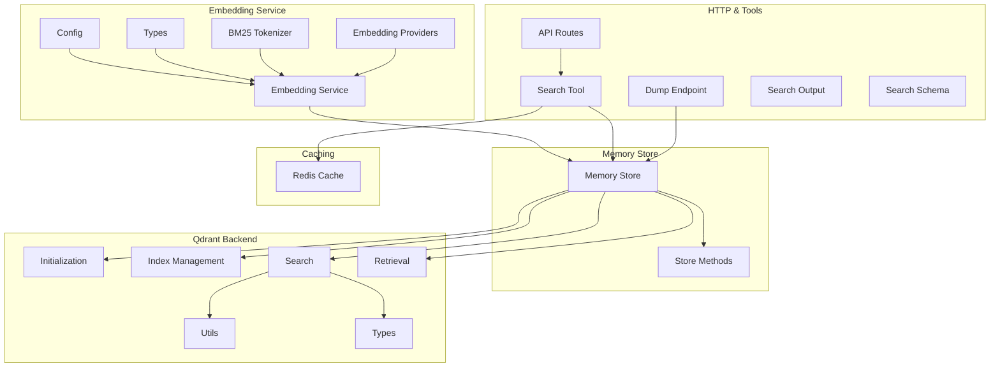
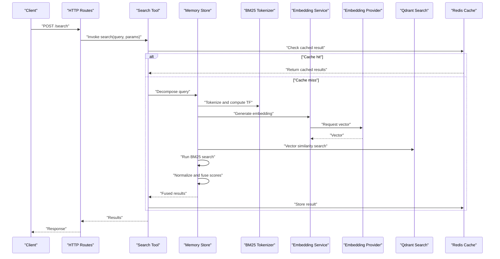
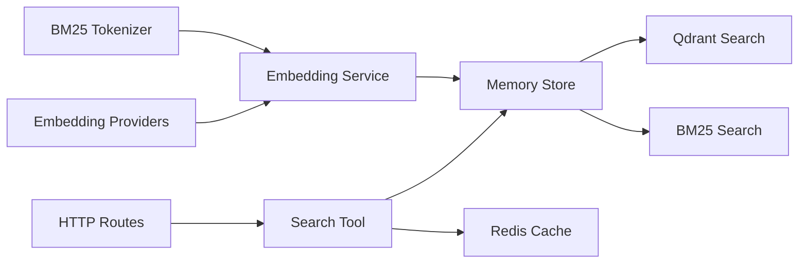

# Hybrid Search Implementation

<cite>
**Referenced Files in This Document**
- [bm25-tokenizer.ts](file://src/services/embedding/bm25-tokenizer.ts)
- [service.ts](file://src/services/embedding/service.ts)
- [types.ts](file://src/services/embedding/types.ts)
- [config.ts](file://src/services/embedding/config.ts)
- [providers.ts](file://src/services/embedding/providers.ts)
- [memory-store.ts](file://src/services/memory/store.ts)
- [store-methods.ts](file://src/services/memory/store-methods.ts)
- [qdrant-memory-retrieval.ts](file://src/services/qdrant/memory-retrieval.ts)
- [qdrant-search.ts](file://src/services/qdrant/search.ts)
- [qdrant-index.ts](file://src/services/qdrant/index.ts)
- [qdrant-initialization.ts](file://src/services/qdrant/initialization.ts)
- [qdrant-types.ts](file://src/services/qdrant/types.ts)
- [qdrant-utils.ts](file://src/utils/qdrant-utils.ts)
- [qdrant-query-utils.ts](file://src/utils/qdrant-query-utils.ts)
- [redis-cache.ts](file://src/services/redis-cache.ts)
- [search.ts](file://src/tools/search.ts)
- [search_output.ts](file://src/tools/search_output.ts)
- [search_schema.ts](file://src/tools/search_schema.ts)
- [http-api-routes.ts](file://src/http/http-api-routes.ts)
- [http-api-dump.ts](file://src/http/http-api-dump.ts)
</cite>

## Table of Contents
1. [Introduction](#introduction)
2. [Project Structure](#project-structure)
3. [Core Components](#core-components)
4. [Architecture Overview](#architecture-overview)
5. [Detailed Component Analysis](#detailed-component-analysis)
6. [Dependency Analysis](#dependency-analysis)
7. [Performance Considerations](#performance-considerations)
8. [Troubleshooting Guide](#troubleshooting-guide)
9. [Conclusion](#conclusion)
10. [Appendices](#appendices)

## Introduction
This document explains the hybrid search implementation that combines BM25 keyword matching with vector similarity scoring. It covers the dual-index architecture, query decomposition into keyword and semantic components, result fusion algorithms, BM25 tokenization and term frequency calculations, vector embedding generation, and operational aspects such as index synchronization, caching strategies, and performance tuning. The goal is to provide both conceptual clarity and code-level traceability for developers and operators.

## Project Structure
The hybrid search spans several modules:
- Embedding service: BM25 tokenizer, embedding provider abstraction, configuration, and types
- Memory store: orchestration of indexing and retrieval across backends
- Qdrant integration: vector storage, search APIs, initialization, and utilities
- HTTP and tools: API routes and CLI tooling for search operations
- Caching: Redis-backed cache for embeddings and results

**Diagram sources**
- [config.ts](file://src/services/embedding/config.ts)
- [types.ts](file://src/services/embedding/types.ts)
- [bm25-tokenizer.ts](file://src/services/embedding/bm25-tokenizer.ts)
- [providers.ts](file://src/services/embedding/providers.ts)
- [service.ts](file://src/services/embedding/service.ts)
- [memory-store.ts](file://src/services/memory/store.ts)
- [store-methods.ts](file://src/services/memory/store-methods.ts)
- [qdrant-initialization.ts](file://src/services/qdrant/initialization.ts)
- [qdrant-index.ts](file://src/services/qdrant/index.ts)
- [qdrant-search.ts](file://src/services/qdrant/search.ts)
- [qdrant-memory-retrieval.ts](file://src/services/qdrant/memory-retrieval.ts)
- [qdrant-utils.ts](file://src/utils/qdrant-utils.ts)
- [qdrant-types.ts](file://src/services/qdrant/types.ts)
- [http-api-routes.ts](file://src/http/http-api-routes.ts)
- [http-api-dump.ts](file://src/http/http-api-dump.ts)
- [search.ts](file://src/tools/search.ts)
- [search_output.ts](file://src/tools/search_output.ts)
- [search_schema.ts](file://src/tools/search_schema.ts)
- [redis-cache.ts](file://src/services/redis-cache.ts)

**Section sources**
- [memory-store.ts](file://src/services/memory/store.ts)
- [store-methods.ts](file://src/services/memory/store-methods.ts)
- [qdrant-search.ts](file://src/services/qdrant/search.ts)
- [qdrant-memory-retrieval.ts](file://src/services/qdrant/memory-retrieval.ts)
- [bm25-tokenizer.ts](file://src/services/embedding/bm25-tokenizer.ts)
- [service.ts](file://src/services/embedding/service.ts)
- [providers.ts](file://src/services/embedding/providers.ts)
- [config.ts](file://src/services/embedding/config.ts)
- [types.ts](file://src/services/embedding/types.ts)
- [http-api-routes.ts](file://src/http/http-api-routes.ts)
- [search.ts](file://src/tools/search.ts)
- [search_output.ts](file://src/tools/search_output.ts)
- [search_schema.ts](file://src/tools/search_schema.ts)
- [redis-cache.ts](file://src/services/redis-cache.ts)

## Core Components
- BM25 Tokenizer: Normalizes text, splits into tokens, and computes term frequencies used by BM25 scoring.
- Embedding Providers: Abstract interface and implementations for generating dense vectors from text.
- Embedding Service: Orchestrates tokenization and embedding generation; exposes typed interfaces for consumers.
- Memory Store: Coordinates indexing and retrieval across BM25 (keyword) and vector indexes; manages hybrid queries.
- Qdrant Integration: Manages vector collections, performs similarity search, and provides utility functions for payloads and filters.
- HTTP and Tools: Expose search endpoints and CLI tools; define schemas and output formatting.
- Caching: Redis-backed cache for embeddings and intermediate results to reduce latency and provider costs.

Key responsibilities:
- Query decomposition: Split user input into keyword terms and semantic intent.
- Dual-index search: Execute BM25 and vector searches in parallel or sequentially depending on configuration.
- Result fusion: Combine scores from BM25 and vector similarity using configurable weights.
- Index synchronization: Ensure keyword and vector indexes remain consistent after updates.

**Section sources**
- [bm25-tokenizer.ts](file://src/services/embedding/bm25-tokenizer.ts)
- [providers.ts](file://src/services/embedding/providers.ts)
- [service.ts](file://src/services/embedding/service.ts)
- [memory-store.ts](file://src/services/memory/store.ts)
- [qdrant-search.ts](file://src/services/qdrant/search.ts)
- [qdrant-memory-retrieval.ts](file://src/services/qdrant/memory-retrieval.ts)
- [search.ts](file://src/tools/search.ts)
- [search_output.ts](file://src/tools/search_output.ts)
- [search_schema.ts](file://src/tools/search_schema.ts)
- [redis-cache.ts](file://src/services/redis-cache.ts)

## Architecture Overview
Hybrid search uses a dual-index architecture:
- Keyword index: BM25 over tokenized text fields.
- Vector index: Dense embeddings stored in Qdrant.

At query time, the system decomposes the query into keyword and semantic parts, executes both searches, normalizes scores, and fuses them into a unified ranking.

**Diagram sources**
- [http-api-routes.ts](file://src/http/http-api-routes.ts)
- [search.ts](file://src/tools/search.ts)
- [memory-store.ts](file://src/services/memory/store.ts)
- [bm25-tokenizer.ts](file://src/services/embedding/bm25-tokenizer.ts)
- [service.ts](file://src/services/embedding/service.ts)
- [providers.ts](file://src/services/embedding/providers.ts)
- [qdrant-search.ts](file://src/services/qdrant/search.ts)
- [redis-cache.ts](file://src/services/redis-cache.ts)

## Detailed Component Analysis

### BM25 Tokenization and Term Frequency
Responsibilities:
- Normalize text (lowercasing, punctuation handling).
- Tokenize into terms suitable for BM25.
- Compute term frequencies per document for scoring.

Complexity considerations:
- Tokenization is linear in document length.
- Term frequency computation is O(n) per document where n is number of tokens.

Optimization opportunities:
- Precompute and cache normalized tokens for repeated documents.
- Use efficient data structures for term counts.

Error handling:
- Handle empty inputs gracefully.
- Validate token lengths and filter stop words if configured.

**Section sources**
- [bm25-tokenizer.ts](file://src/services/embedding/bm25-tokenizer.ts)

### Embedding Generation and Providers
Responsibilities:
- Provide an abstraction for embedding providers.
- Generate dense vectors from text segments.
- Manage provider selection and fallbacks.

Integration points:
- Embedding service calls provider via typed interface.
- Config controls model selection and parameters.

Performance considerations:
- Batch requests when supported by provider.
- Cache embeddings by content hash to avoid redundant calls.

**Section sources**
- [providers.ts](file://src/services/embedding/providers.ts)
- [service.ts](file://src/services/embedding/service.ts)
- [config.ts](file://src/services/embedding/config.ts)
- [types.ts](file://src/services/embedding/types.ts)

### Memory Store and Hybrid Query Orchestration
Responsibilities:
- Coordinate BM25 and vector searches.
- Decompose queries into keyword and semantic components.
- Normalize and fuse scores from both indexes.
- Manage index synchronization after writes.

Data flow:
- Input query -> decomposition -> BM25 search + vector search -> normalization -> fusion -> ranked results.

Index synchronization:
- On create/update/delete, ensure both keyword and vector indexes are updated atomically or with consistency guarantees.

**Section sources**
- [memory-store.ts](file://src/services/memory/store.ts)
- [store-methods.ts](file://src/services/memory/store-methods.ts)

### Qdrant Integration for Vector Similarity
Responsibilities:
- Initialize and manage vector collections.
- Perform similarity search with payload filtering.
- Provide utilities for building queries and handling responses.

Key interactions:
- Memory store invokes Qdrant search with embedding vectors and optional filters.
- Utilities assist in constructing payload schemas and query constraints.

**Section sources**
- [qdrant-initialization.ts](file://src/services/qdrant/initialization.ts)
- [qdrant-index.ts](file://src/services/qdrant/index.ts)
- [qdrant-search.ts](file://src/services/qdrant/search.ts)
- [qdrant-memory-retrieval.ts](file://src/services/qdrant/memory-retrieval.ts)
- [qdrant-utils.ts](file://src/utils/qdrant-utils.ts)
- [qdrant-types.ts](file://src/services/qdrant/types.ts)

### HTTP and Tooling Interfaces
Responsibilities:
- Define API routes for search operations.
- Implement CLI tool entrypoints for search.
- Enforce input schemas and format outputs consistently.

Examples:
- POST endpoint accepts query text, weighting parameters, and filters.
- CLI tool wraps HTTP client with convenient flags.

**Section sources**
- [http-api-routes.ts](file://src/http/http-api-routes.ts)
- [search.ts](file://src/tools/search.ts)
- [search_output.ts](file://src/tools/search_output.ts)
- [search_schema.ts](file://src/tools/search_schema.ts)

### Caching Strategy
Responsibilities:
- Cache embeddings by content hash to reduce provider calls.
- Cache fused search results for identical queries within TTL.
- Invalidate caches on index changes.

Implementation notes:
- Use Redis for distributed caching.
- Key design includes query fingerprint and embedding version.

**Section sources**
- [redis-cache.ts](file://src/services/redis-cache.ts)

## Dependency Analysis
The hybrid search depends on cohesive modules with clear boundaries:
- Embedding service depends on tokenizer and providers.
- Memory store orchestrates BM25 and Qdrant components.
- HTTP and tools depend on memory store and cache.

**Diagram sources**
- [bm25-tokenizer.ts](file://src/services/embedding/bm25-tokenizer.ts)
- [providers.ts](file://src/services/embedding/providers.ts)
- [service.ts](file://src/services/embedding/service.ts)
- [memory-store.ts](file://src/services/memory/store.ts)
- [qdrant-search.ts](file://src/services/qdrant/search.ts)
- [http-api-routes.ts](file://src/http/http-api-routes.ts)
- [search.ts](file://src/tools/search.ts)
- [redis-cache.ts](file://src/services/redis-cache.ts)

**Section sources**
- [memory-store.ts](file://src/services/memory/store.ts)
- [qdrant-search.ts](file://src/services/qdrant/search.ts)
- [bm25-tokenizer.ts](file://src/services/embedding/bm25-tokenizer.ts)
- [service.ts](file://src/services/embedding/service.ts)
- [providers.ts](file://src/services/embedding/providers.ts)
- [http-api-routes.ts](file://src/http/http-api-routes.ts)
- [search.ts](file://src/tools/search.ts)
- [redis-cache.ts](file://src/services/redis-cache.ts)

## Performance Considerations
- Tokenization efficiency: Minimize regex overhead; precompute common transformations.
- Embedding batching: Group requests to providers to reduce latency and cost.
- Score normalization: Apply min-max or z-score normalization before fusion to balance disparate score ranges.
- Fusion strategy: Weighted sum or reciprocal rank fusion based on workload characteristics.
- Caching: Enable embedding and result caching with appropriate TTLs; invalidate on updates.
- Index sizing: Tune vector dimensionality and BM25 parameters (k1, b) for precision/recall trade-offs.
- Concurrency: Parallelize BM25 and vector searches where possible; limit concurrency to avoid overload.

[No sources needed since this section provides general guidance]

## Troubleshooting Guide
Common issues and resolutions:
- Empty or malformed queries: Validate inputs early; return informative errors.
- Tokenization anomalies: Check stop word lists and normalization rules; log token counts.
- Embedding failures: Inspect provider health and rate limits; implement retries and fallbacks.
- Score imbalance: Review normalization and fusion weights; adjust based on evaluation metrics.
- Index drift: Verify write paths update both indexes; add consistency checks and reconciliation jobs.
- Cache misses or stale results: Ensure cache keys include versioning; enforce invalidation on mutations.

Operational checks:
- Monitor embedding provider latency and error rates.
- Track BM25 term frequency distributions for outliers.
- Observe Qdrant collection sizes and query latencies.
- Audit cache hit ratios and invalidation events.

**Section sources**
- [bm25-tokenizer.ts](file://src/services/embedding/bm25-tokenizer.ts)
- [service.ts](file://src/services/embedding/service.ts)
- [providers.ts](file://src/services/embedding/providers.ts)
- [memory-store.ts](file://src/services/memory/store.ts)
- [qdrant-search.ts](file://src/services/qdrant/search.ts)
- [redis-cache.ts](file://src/services/redis-cache.ts)

## Conclusion
The hybrid search implementation integrates BM25 keyword matching with vector similarity through a well-structured dual-index architecture. By decomposing queries, executing parallel searches, and fusing normalized scores, it achieves robust recall and precision. Proper tokenization, embedding generation, index synchronization, and caching are essential for performance and reliability. Continuous monitoring and parameter tuning will further optimize outcomes.

[No sources needed since this section summarizes without analyzing specific files]

## Appendices

### Example: Constructing Hybrid Queries
- Inputs: query text, BM25 weight, vector weight, filters, top-k.
- Process:
  - Decompose query into keywords and semantic intent.
  - Run BM25 search with keyword terms and filters.
  - Generate embedding and run vector similarity search with filters.
  - Normalize scores and apply weighted fusion.
  - Return top-k results with combined metadata.

**Section sources**
- [search_schema.ts](file://src/tools/search_schema.ts)
- [search_output.ts](file://src/tools/search_output.ts)
- [memory-store.ts](file://src/services/memory/store.ts)

### Example: Weighting Parameters and Optimization
- Weights: Adjust BM25 vs vector weights based on domain specificity.
- Normalization: Choose min-max or z-score depending on score distributions.
- Fusion: Try weighted sum first; switch to reciprocal rank fusion if needed.
- Evaluation: Use precision@k and NDCG to guide parameter selection.

**Section sources**
- [memory-store.ts](file://src/services/memory/store.ts)
- [qdrant-search.ts](file://src/services/qdrant/search.ts)

### Example: Index Synchronization Workflow
- Write path:
  - Create/update/delete document.
  - Update BM25 index with tokenized content.
  - Generate embedding and upsert vector record.
  - Invalidate related caches.
- Consistency:
  - Use transactions or idempotent operations.
  - Periodic reconciliation job to detect drift.

**Section sources**
- [memory-store.ts](file://src/services/memory/store.ts)
- [store-methods.ts](file://src/services/memory/store-methods.ts)
- [redis-cache.ts](file://src/services/redis-cache.ts)