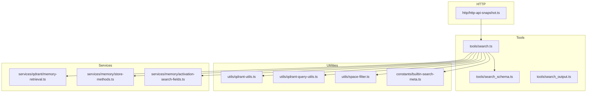
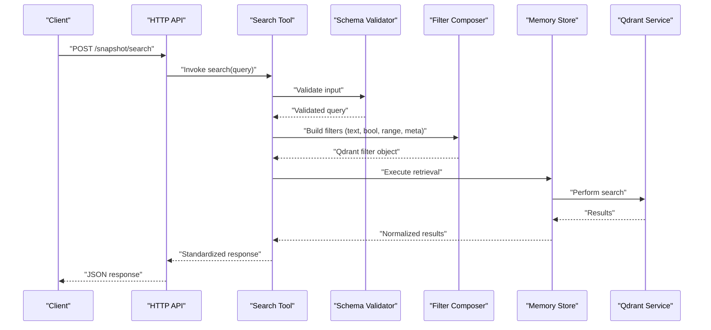
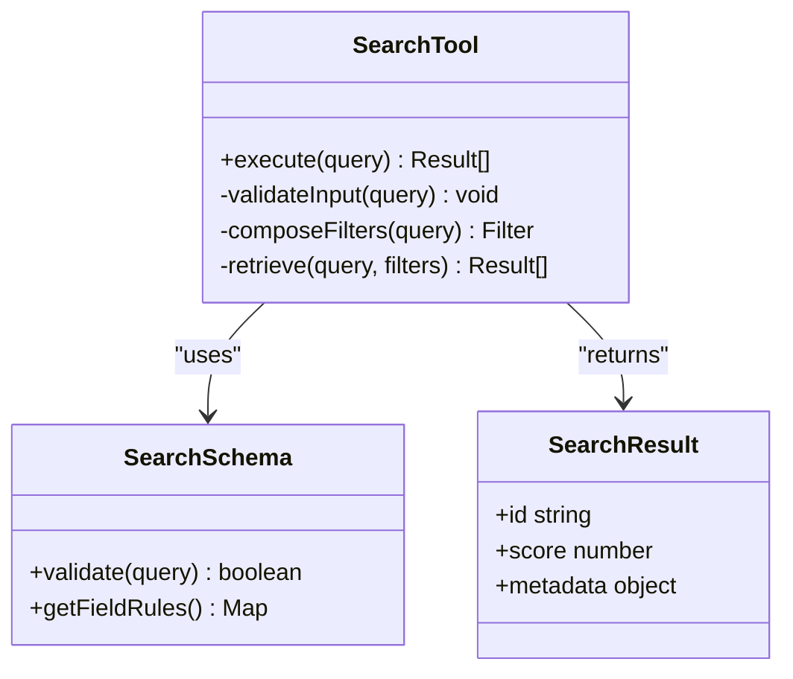
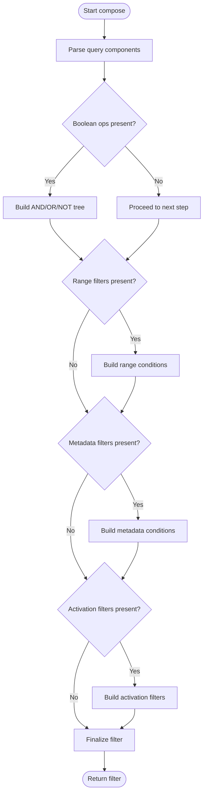
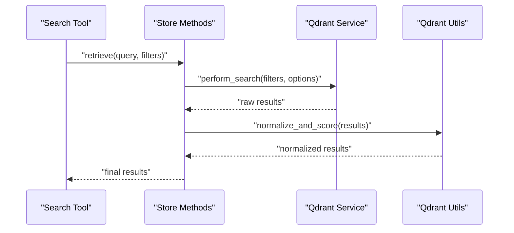
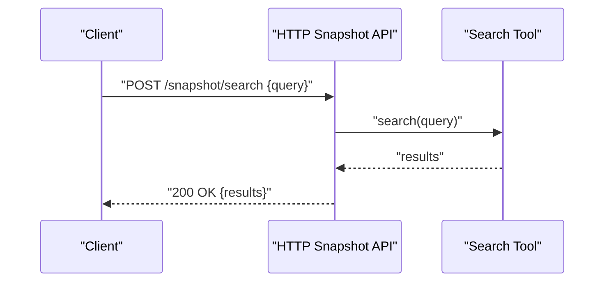
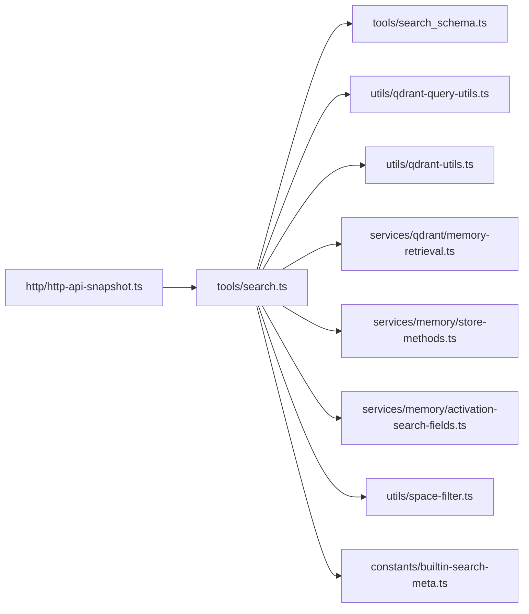

# Query Construction and Filtering

<cite>
**Referenced Files in This Document**
- [search.ts](file://src/tools/search.ts)
- [search_schema.ts](file://src/tools/search_schema.ts)
- [search_output.ts](file://src/tools/search_output.ts)
- [qdrant-query-utils.ts](file://src/utils/qdrant-query-utils.ts)
- [qdrant-utils.ts](file://src/utils/qdrant-utils.ts)
- [memory-retrieval.ts](file://src/services/qdrant/memory-retrieval.ts)
- [store-methods.ts](file://src/services/memory/store-methods.ts)
- [activation-search-fields.ts](file://src/services/memory/activation-search-fields.ts)
- [space-filter.ts](file://src/utils/space-filter.ts)
- [constants/builtin-search-meta.ts](file://src/constants/builtin-search-meta.ts)
- [http-api-snapshot.ts](file://src/http/http-api-snapshot.ts)
- [cli-commands-basic.test.ts](file://tests/integration/cli-commands-basic.test.ts)
- [kairos-search-case1.test.ts](file://tests/integration/kairos-search-case1.test.ts)
- [kairos-search-case2.test.ts](file://tests/integration/kairos-search-case2.test.ts)
- [kairos-search-case3.test.ts](file://tests/integration/kairos-search-case3.test.ts)
- [kairos-search-case4.test.ts](file://tests/integration/kairos-search-case4.test.ts)
- [kairos-search-perfect-matches.test.ts](file://tests/integration/kairos-search-perfect-matches.test.ts)
- [kairos-search-scores.test.ts](file://tests/integration/kairos-search-scores.test.ts)
- [kairos-search-forbidden-behavior.test.ts](file://tests/integration/kairos-search-forbidden-behavior.test.ts)
- [kairos-search-access.test.ts](file://tests/integration/kairos-search-access.test.ts)
</cite>

## Table of Contents
1. [Introduction](#introduction)
2. [Project Structure](#project-structure)
3. [Core Components](#core-components)
4. [Architecture Overview](#architecture-overview)
5. [Detailed Component Analysis](#detailed-component-analysis)
6. [Dependency Analysis](#dependency-analysis)
7. [Performance Considerations](#performance-considerations)
8. [Troubleshooting Guide](#troubleshooting-guide)
9. [Conclusion](#conclusion)
10. [Appendices](#appendices)

## Introduction
This document explains how queries are constructed and filtered across the system, focusing on:
- Field-specific search strategies
- Activation-based filtering
- Complex query composition with boolean operations, ranges, and metadata filters
- Validation and optimization techniques
- Common patterns and advanced examples

The implementation combines a typed input schema, flexible filter composition utilities, and Qdrant-backed retrieval to support semantic and structured searches over artifacts and activations.

## Project Structure
Query-related code spans tools, utilities, services, and tests:
- Tools layer defines the user-facing API for searching and its schema
- Utilities provide filter composition helpers and Qdrant query builders
- Services implement memory retrieval and integration with storage backends
- Tests validate behavior across multiple scenarios

**Diagram sources**
- [search.ts](file://src/tools/search.ts)
- [search_schema.ts](file://src/tools/search_schema.ts)
- [search_output.ts](file://src/tools/search_output.ts)
- [qdrant-query-utils.ts](file://src/utils/qdrant-query-utils.ts)
- [qdrant-utils.ts](file://src/utils/qdrant-utils.ts)
- [memory-retrieval.ts](file://src/services/qdrant/memory-retrieval.ts)
- [store-methods.ts](file://src/services/memory/store-methods.ts)
- [activation-search-fields.ts](file://src/services/memory/activation-search-fields.ts)
- [space-filter.ts](file://src/utils/s space-filter.ts)
- [builtin-search-meta.ts](file://src/constants/builtin-search-meta.ts)
- [http-api-snapshot.ts](file://src/http/http-api-snapshot.ts)

**Section sources**
- [search.ts](file://src/tools/search.ts)
- [search_schema.ts](file://src/tools/search_schema.ts)
- [search_output.ts](file://src/tools/search_output.ts)
- [qdrant-query-utils.ts](file://src/utils/qdrant-query-utils.ts)
- [qdrant-utils.ts](file://src/utils/qdrant-utils.ts)
- [memory-retrieval.ts](file://src/services/qdrant/memory-retrieval.ts)
- [store-methods.ts](file://src/services/memory/store-methods.ts)
- [activation-search-fields.ts](file://src/services/memory/activation-search-fields.ts)
- [space-filter.ts](file://src/utils/space-filter.ts)
- [builtin-search-meta.ts](file://src/constants/builtin-search-meta.ts)
- [http-api-snapshot.ts](file://src/http/http-api-snapshot.ts)

## Core Components
- Search tool entry point: validates inputs, composes filters, executes retrieval, and returns results
- Schema validation: enforces allowed fields, operators, and constraints
- Filter composition: builds Qdrant-compatible filters from high-level query objects
- Retrieval service: performs hybrid or vector search against Qdrant
- Space scoping: restricts queries by space context
- Builtin metadata: provides canonical field names and defaults for search

Key responsibilities:
- Input normalization and validation
- Building structured filters (boolean, range, equality, text match)
- Executing retrieval with optional activation-based filters
- Returning standardized output with scores and metadata

**Section sources**
- [search.ts](file://src/tools/search.ts)
- [search_schema.ts](file://src/tools/search_schema.ts)
- [search_output.ts](file://src/tools/search_output.ts)
- [qdrant-query-utils.ts](file://src/utils/qdrant-query-utils.ts)
- [qdrant-utils.ts](file://src/utils/qdrant-utils.ts)
- [memory-retrieval.ts](file://src/services/qdrant/memory-retrieval.ts)
- [store-methods.ts](file://src/services/memory/store-methods.ts)
- [activation-search-fields.ts](file://src/services/memory/activation-search-fields.ts)
- [space-filter.ts](file://src/utils/space-filter.ts)
- [builtin-search-meta.ts](file://src/constants/builtin-search-meta.ts)

## Architecture Overview
The search flow integrates user input, schema validation, filter composition, and backend retrieval.

**Diagram sources**
- [http-api-snapshot.ts](file://src/http/http-api-snapshot.ts)
- [search.ts](file://src/tools/search.ts)
- [search_schema.ts](file://src/tools/search_schema.ts)
- [qdrant-query-utils.ts](file://src/utils/qdrant-query-utils.ts)
- [memory-retrieval.ts](file://src/services/qdrant/memory-retrieval.ts)
- [store-methods.ts](file://src/services/memory/store-methods.ts)

## Detailed Component Analysis

### Search Tool and Schema
- The search tool accepts a query object, validates it via the schema, constructs filters, and delegates to retrieval
- The schema enforces allowed fields, operator types, value constraints, and maximum sizes
- Output is normalized into a consistent shape with scores and metadata

**Diagram sources**
- [search.ts](file://src/tools/search.ts)
- [search_schema.ts](file://src/tools/search_schema.ts)
- [search_output.ts](file://src/tools/search_output.ts)

**Section sources**
- [search.ts](file://src/tools/search.ts)
- [search_schema.ts](file://src/tools/search_schema.ts)
- [search_output.ts](file://src/tools/search_output.ts)

### Filter Composition Utilities
- Compose boolean filters (AND/OR/NOT)
- Build range filters (numeric/date)
- Apply equality and text-match filters
- Integrate activation-based filters using activation search fields
- Respect space scoping and builtin metadata fields

**Diagram sources**
- [qdrant-query-utils.ts](file://src/utils/qdrant-query-utils.ts)
- [qdrant-utils.ts](file://src/utils/qdrant-utils.ts)
- [activation-search-fields.ts](file://src/services/memory/activation-search-fields.ts)
- [space-filter.ts](file://src/utils/space-filter.ts)
- [builtin-search-meta.ts](file://src/constants/builtin-search-meta.ts)

**Section sources**
- [qdrant-query-utils.ts](file://src/utils/qdrant-query-utils.ts)
- [qdrant-utils.ts](file://src/utils/qdrant-utils.ts)
- [activation-search-fields.ts](file://src/services/memory/activation-search-fields.ts)
- [space-filter.ts](file://src/utils/space-filter.ts)
- [builtin-search-meta.ts](file://src/constants/builtin-search-meta.ts)

### Memory Retrieval and Storage Integration
- Executes retrieval using store methods and Qdrant service
- Supports hybrid search when applicable
- Normalizes results and applies post-processing (e.g., score scaling)

**Diagram sources**
- [memory-retrieval.ts](file://src/services/qdrant/memory-retrieval.ts)
- [store-methods.ts](file://src/services/memory/store-methods.ts)
- [qdrant-utils.ts](file://src/utils/qdrant-utils.ts)

**Section sources**
- [memory-retrieval.ts](file://src/services/qdrant/memory-retrieval.ts)
- [store-methods.ts](file://src/services/memory/store-methods.ts)
- [qdrant-utils.ts](file://src/utils/qdrant-utils.ts)

### HTTP Snapshot Endpoint
- Exposes search via HTTP
- Validates request payload and invokes the search tool
- Returns standardized JSON responses

**Diagram sources**
- [http-api-snapshot.ts](file://src/http/http-api-snapshot.ts)
- [search.ts](file://src/tools/search.ts)

**Section sources**
- [http-api-snapshot.ts](file://src/http/http-api-snapshot.ts)
- [search.ts](file://src/tools/search.ts)

## Dependency Analysis
High-level dependencies among query-related modules:

**Diagram sources**
- [search.ts](file://src/tools/search.ts)
- [search_schema.ts](file://src/tools/search_schema.ts)
- [qdrant-query-utils.ts](file://src/utils/qdrant-query-utils.ts)
- [qdrant-utils.ts](file://src/utils/qdrant-utils.ts)
- [memory-retrieval.ts](file://src/services/qdrant/memory-retrieval.ts)
- [store-methods.ts](file://src/services/memory/store-methods.ts)
- [activation-search-fields.ts](file://src/services/memory/activation-search-fields.ts)
- [space-filter.ts](file://src/utils/space-filter.ts)
- [builtin-search-meta.ts](file://src/constants/builtin-search-meta.ts)
- [http-api-snapshot.ts](file://src/http/http-api-snapshot.ts)

**Section sources**
- [search.ts](file://src/tools/search.ts)
- [search_schema.ts](file://src/tools/search_schema.ts)
- [qdrant-query-utils.ts](file://src/utils/qdrant-query-utils.ts)
- [qdrant-utils.ts](file://src/utils/qdrant-utils.ts)
- [memory-retrieval.ts](file://src/services/qdrant/memory-retrieval.ts)
- [store-methods.ts](file://src/services/memory/store-methods.ts)
- [activation-search-fields.ts](file://src/services/memory/activation-search-fields.ts)
- [space-filter.ts](file://src/utils/space-filter.ts)
- [builtin-search-meta.ts](file://src/constants/builtin-search-meta.ts)
- [http-api-snapshot.ts](file://src/http/http-api-snapshot.ts)

## Performance Considerations
- Prefer precise filters (equality, ranges) to reduce scan scope
- Combine semantic search with structured filters to improve relevance and speed
- Limit result sets where possible; use pagination at higher layers if needed
- Avoid overly deep boolean nesting; flatten where feasible
- Use space scoping early to constrain search domains
- Leverage builtin metadata fields for fast prefiltering

[No sources needed since this section provides general guidance]

## Troubleshooting Guide
Common issues and diagnostics:
- Invalid query structure: ensure all required fields are present and values conform to schema rules
- Unexpected empty results: verify space scoping and activation filters; check that filters do not conflict
- Slow queries: simplify boolean trees, add range/equality filters, and confirm index usage
- Access errors: confirm tenant and space permissions; review access-scoped filters

Validation and test references:
- Basic CLI search flows and error paths
- Multiple search cases covering edge conditions
- Perfect matches and scoring behaviors
- Forbidden behaviors and access control

**Section sources**
- [cli-commands-basic.test.ts](file://tests/integration/cli-commands-basic.test.ts)
- [kairos-search-case1.test.ts](file://tests/integration/kairos-search-case1.test.ts)
- [kairos-search-case2.test.ts](file://tests/integration/kairos-search-case2.test.ts)
- [kairos-search-case3.test.ts](file://tests/integration/kairos-search-case3.test.ts)
- [kairos-search-case4.test.ts](file://tests/integration/kairos-search-case4.test.ts)
- [kairos-search-perfect-matches.test.ts](file://tests/integration/kairos-search-perfect-matches.test.ts)
- [kairos-search-scores.test.ts](file://tests/integration/kairos-search-scores.test.ts)
- [kairos-search-forbidden-behavior.test.ts](file://tests/integration/kairos-search-forbidden-behavior.test.ts)
- [kairos-search-access.test.ts](file://tests/integration/kairos-search-access.test.ts)

## Conclusion
The query construction and filtering system provides a robust, validated, and extensible interface for building complex searches. By combining schema-driven inputs, composable filters, and efficient retrieval, it supports both simple lookups and sophisticated multi-criteria queries while maintaining performance and correctness.

[No sources needed since this section summarizes without analyzing specific files]

## Appendices

### Filter Syntax and Operations
- Boolean operations: AND, OR, NOT
- Equality and inequality filters
- Range queries for numeric and date fields
- Text matching strategies (as supported by the underlying engine)
- Metadata filters using canonical field names
- Activation-based filters leveraging activation search fields

Examples and patterns are validated across integration tests referenced above.

**Section sources**
- [search_schema.ts](file://src/tools/search_schema.ts)
- [qdrant-query-utils.ts](file://src/utils/qdrant-query-utils.ts)
- [activation-search-fields.ts](file://src/services/memory/activation-search-fields.ts)
- [builtin-search-meta.ts](file://src/constants/builtin-search-meta.ts)
- [kairos-search-case1.test.ts](file://tests/integration/kairos-search-case1.test.ts)
- [kairos-search-case2.test.ts](file://tests/integration/kairos-search-case2.test.ts)
- [kairos-search-case3.test.ts](file://tests/integration/kairos-search-case3.test.ts)
- [kairos-search-case4.test.ts](file://tests/integration/kairos-search-case4.test.ts)
- [kairos-search-perfect-matches.test.ts](file://tests/integration/kairos-search-perfect-matches.test.ts)
- [kairos-search-scores.test.ts](file://tests/integration/kairos-search-scores.test.ts)
- [kairos-search-forbidden-behavior.test.ts](file://tests/integration/kairos-search-forbidden-behavior.test.ts)
- [kairos-search-access.test.ts](file://tests/integration/kairos-search-access.test.ts)