# Search Algorithms and Query Processing

<cite>
**Referenced Files in This Document**
- [search.ts](file://src/tools/search.ts)
- [search_schema.ts](file://src/tools/search_schema.ts)
- [search_output.ts](file://src/tools/search_output.ts)
- [memory-store.ts](file://src/services/memory-store.ts)
- [store-methods.ts](file://src/services/memory/store-methods.ts)
- [qdrant-search.ts](file://src/services/qdrant/search.ts)
- [bm25-tokenizer.ts](file://src/services/embedding/bm25-tokenizer.ts)
- [store-title-similarity-search.ts](file://src/services/memory/store-title-similarity-search.ts)
- [activation-search-fields.ts](file://src/services/memory/activation-search-fields.ts)
- [qdrant-query-utils.ts](file://src/utils/qdrant-query-utils.ts)
- [qdrant-vector-types.ts](file://src/utils/qdrant-vector-types.ts)
- [qdrant-collection-utils.ts](file://src/utils/qdrant-collection-utils.ts)
- [http-api-routes.ts](file://src/http/http-api-routes.ts)
- [cli-search.ts](file://src/cli/commands/search.ts)
</cite>

## Table of Contents
1. [Introduction](#introduction)
2. [Project Structure](#project-structure)
3. [Core Components](#core-components)
4. [Architecture Overview](#architecture-overview)
5. [Detailed Component Analysis](#detailed-component-analysis)
6. [Dependency Analysis](#dependency-analysis)
7. [Performance Considerations](#performance-considerations)
8. [Troubleshooting Guide](#troubleshooting-guide)
9. [Conclusion](#conclusion)
10. [Appendices](#appendices)

## Introduction
This document explains the search algorithms and query processing pipeline used to retrieve relevant artifacts from memory stores. It covers hybrid search combining BM25 keyword matching with vector similarity scoring, query construction, ranking, result aggregation, title similarity search, activation-based filtering, field-specific strategies, complex queries, pagination, optimization, index usage, performance tuning, result formatting, relevance scoring, and debugging techniques.

## Project Structure
The search system spans multiple layers:
- Tooling layer exposes CLI and HTTP interfaces for search operations.
- Memory store orchestrates retrieval across backends.
- Qdrant integration performs vector and metadata searches.
- Embedding utilities provide BM25 tokenization and text preprocessing.
- Utilities implement query building, collection management, and vector typing.

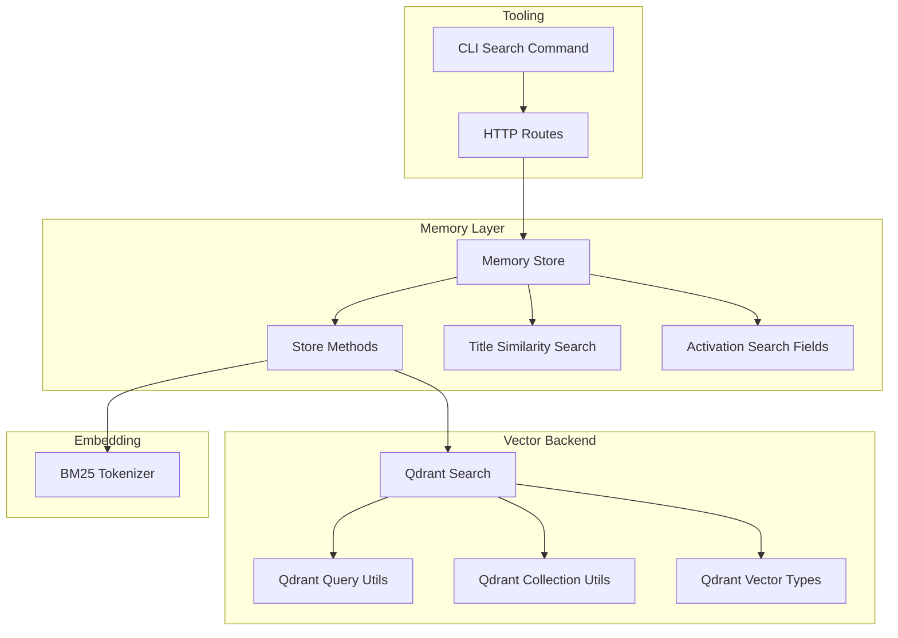

**Diagram sources**
- [cli-search.ts](file://src/cli/commands/search.ts)
- [http-api-routes.ts](file://src/http/http-api-routes.ts)
- [memory-store.ts](file://src/services/memory-store.ts)
- [store-methods.ts](file://src/services/memory/store-methods.ts)
- [store-title-similarity-search.ts](file://src/services/memory/store-title-similarity-search.ts)
- [activation-search-fields.ts](file://src/services/memory/activation-search-fields.ts)
- [qdrant-search.ts](file://src/services/qdrant/search.ts)
- [qdrant-query-utils.ts](file://src/utils/qdrant-query-utils.ts)
- [qdrant-collection-utils.ts](file://src/utils/qdrant-collection-utils.ts)
- [qdrant-vector-types.ts](file://src/utils/qdrant-vector-types.ts)
- [bm25-tokenizer.ts](file://src/services/embedding/bm25-tokenizer.ts)

**Section sources**
- [cli-search.ts](file://src/cli/commands/search.ts)
- [http-api-routes.ts](file://src/http/http-api-routes.ts)
- [memory-store.ts](file://src/services/memory-store.ts)
- [store-methods.ts](file://src/services/memory/store-methods.ts)
- [qdrant-search.ts](file://src/services/qdrant/search.ts)
- [bm25-tokenizer.ts](file://src/services/embedding/bm25-tokenizer.ts)
- [store-title-similarity-search.ts](file://src/services/memory/store-title-similarity-search.ts)
- [activation-search-fields.ts](file://src/services/memory/activation-search-fields.ts)
- [qdrant-query-utils.ts](file://src/utils/qdrant-query-utils.ts)
- [qdrant-collection-utils.ts](file://src/utils/qdrant-collection-utils.ts)
- [qdrant-vector-types.ts](file://src/utils/qdrant-vector-types.ts)

## Core Components
- Search tooling:
  - Input schema validation and output formatting ensure consistent request/response contracts.
  - CLI command provides a user-facing interface for constructing and executing queries.
- Memory store:
  - Central orchestration point that coordinates BM25 and vector search, applies filters, merges results, and paginates.
- Qdrant integration:
  - Executes vector similarity search and structured metadata filtering.
  - Builds efficient filter expressions using utility helpers.
- BM25 tokenizer:
  - Normalizes and tokenizes text for keyword matching.
- Title similarity search:
  - Specialized path for high-precision title matches.
- Activation-based filtering:
  - Restricts search scope by activation patterns or fields.

**Section sources**
- [search_schema.ts](file://src/tools/search_schema.ts)
- [search_output.ts](file://src/tools/search_output.ts)
- [cli-search.ts](file://src/cli/commands/search.ts)
- [memory-store.ts](file://src/services/memory-store.ts)
- [store-methods.ts](file://src/services/memory/store-methods.ts)
- [qdrant-search.ts](file://src/services/qdrant/search.ts)
- [bm25-tokenizer.ts](file://src/services/embedding/bm25-tokenizer.ts)
- [store-title-similarity-search.ts](file://src/services/memory/store-title-similarity-search.ts)
- [activation-search-fields.ts](file://src/services/memory/activation-search-fields.ts)

## Architecture Overview
The hybrid search pipeline combines lexical (BM25) and semantic (vector) signals:
- Query parsing validates inputs and extracts keywords, filters, and pagination parameters.
- BM25 path tokenizes text and builds keyword filters.
- Vector path embeds the query and requests nearest neighbors from Qdrant with optional metadata filters.
- Results are merged and re-ranked using a combined score.
- Final results are formatted and paginated before returning.

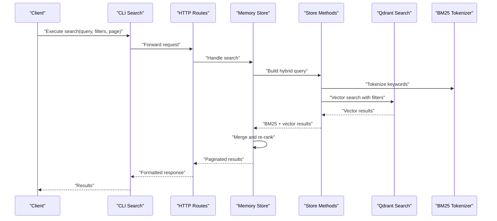

**Diagram sources**
- [cli-search.ts](file://src/cli/commands/search.ts)
- [http-api-routes.ts](file://src/http/http-api-routes.ts)
- [memory-store.ts](file://src/services/memory-store.ts)
- [store-methods.ts](file://src/services/memory/store-methods.ts)
- [qdrant-search.ts](file://src/services/qdrant/search.ts)
- [bm25-tokenizer.ts](file://src/services/embedding/bm25-tokenizer.ts)

## Detailed Component Analysis

### Hybrid Search Pipeline
- Query construction:
  - Extracts free-text query, field filters, space scoping, and pagination.
  - Validates constraints via schema definitions.
- BM25 keyword matching:
  - Tokenizes input text into terms suitable for lexical matching.
  - Builds structured filters for indexed fields.
- Vector similarity:
  - Generates an embedding for the query and retrieves top-k vectors.
  - Applies metadata filters to constrain the candidate set.
- Ranking and aggregation:
  - Combines BM25 and vector scores into a unified ranking.
  - Deduplicates and sorts final results.
- Pagination:
  - Supports offset/limit or cursor-based pagination depending on backend capabilities.

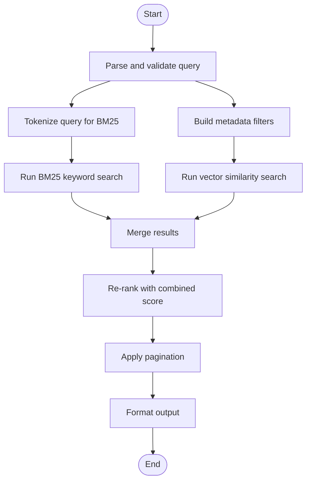

**Diagram sources**
- [memory-store.ts](file://src/services/memory-store.ts)
- [store-methods.ts](file://src/services/memory/store-methods.ts)
- [bm25-tokenizer.ts](file://src/services/embedding/bm25-tokenizer.ts)
- [qdrant-search.ts](file://src/services/qdrant/search.ts)

**Section sources**
- [memory-store.ts](file://src/services/memory-store.ts)
- [store-methods.ts](file://src/services/memory/store-methods.ts)
- [bm25-tokenizer.ts](file://src/services/embedding/bm25-tokenizer.ts)
- [qdrant-search.ts](file://src/services/qdrant/search.ts)

### Query Construction and Schema
- Input schema enforces:
  - Required and optional fields for query text, filters, and pagination.
  - Type safety and default values for robustness.
- Output schema defines:
  - Result shape, scoring metadata, and pagination tokens.

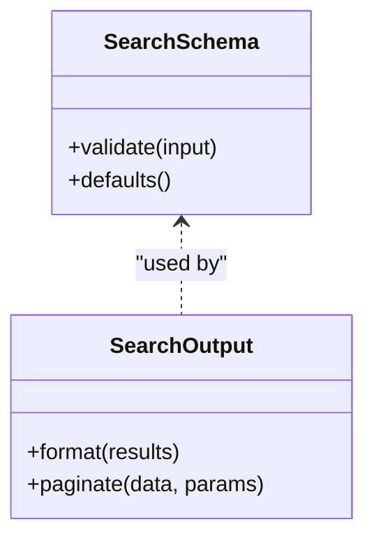

**Diagram sources**
- [search_schema.ts](file://src/tools/search_schema.ts)
- [search_output.ts](file://src/tools/search_output.ts)

**Section sources**
- [search_schema.ts](file://src/tools/search_schema.ts)
- [search_output.ts](file://src/tools/search_output.ts)

### BM25 Keyword Matching
- Tokenization strategy:
  - Normalizes text, splits into tokens, and removes noise.
- Index usage:
  - Maps tokens to indexed fields for fast lookup.
- Optimization:
  - Short-circuits when filters reduce candidate sets significantly.

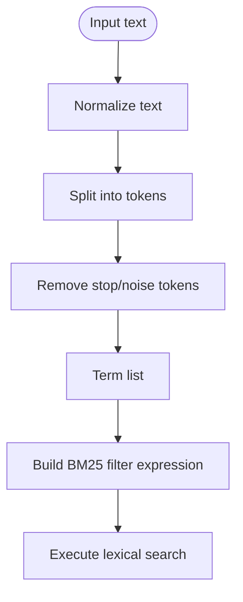

**Diagram sources**
- [bm25-tokenizer.ts](file://src/services/embedding/bm25-tokenizer.ts)
- [store-methods.ts](file://src/services/memory/store-methods.ts)

**Section sources**
- [bm25-tokenizer.ts](file://src/services/embedding/bm25-tokenizer.ts)
- [store-methods.ts](file://src/services/memory/store-methods.ts)

### Vector Similarity Search
- Embedding generation:
  - Converts query text into a vector representation.
- Retrieval:
  - Queries Qdrant for nearest neighbors with optional metadata filters.
- Scoring:
  - Returns similarity scores normalized for ranking.

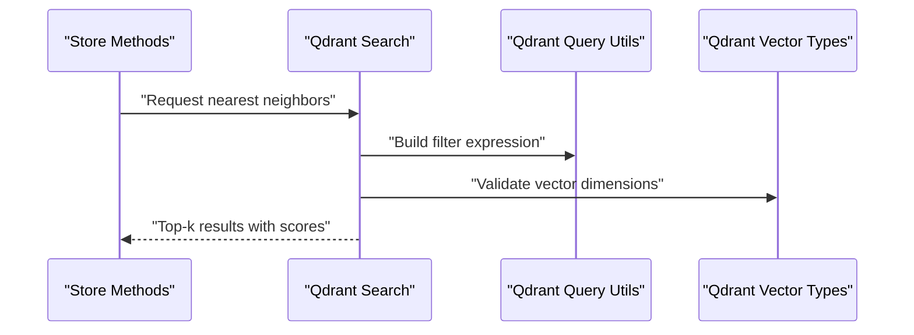

**Diagram sources**
- [qdrant-search.ts](file://src/services/qdrant/search.ts)
- [qdrant-query-utils.ts](file://src/utils/qdrant-query-utils.ts)
- [qdrant-vector-types.ts](file://src/utils/qdrant-vector-types.ts)

**Section sources**
- [qdrant-search.ts](file://src/services/qdrant/search.ts)
- [qdrant-query-utils.ts](file://src/utils/qdrant-query-utils.ts)
- [qdrant-vector-types.ts](file://src/utils/qdrant-vector-types.ts)

### Title Similarity Search
- Purpose:
  - High-precision retrieval focused on title fields.
- Strategy:
  - Uses specialized logic to match titles semantically or lexically.
- Use cases:
  - Quick navigation to exact or near-exact documents.

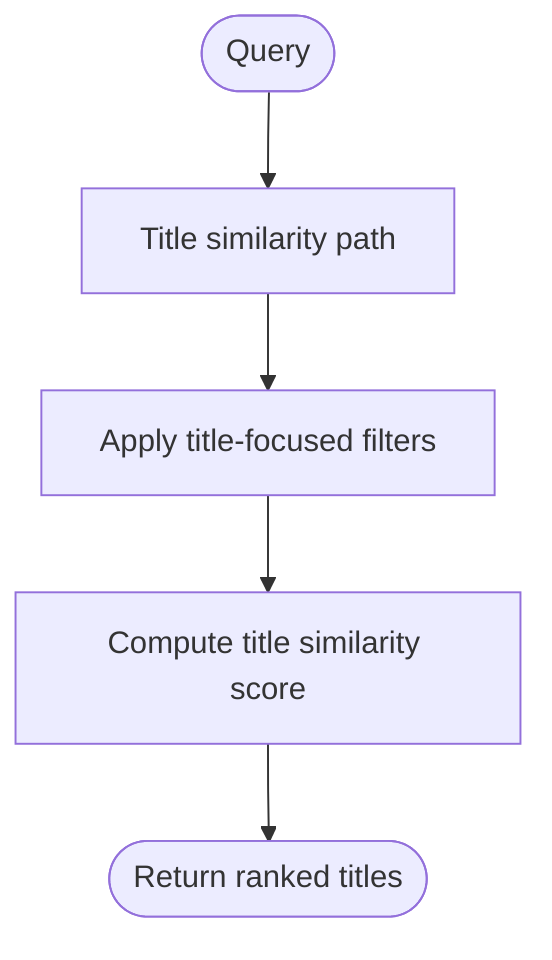

**Diagram sources**
- [store-title-similarity-search.ts](file://src/services/memory/store-title-similarity-search.ts)

**Section sources**
- [store-title-similarity-search.ts](file://src/services/memory/store-title-similarity-search.ts)

### Activation-Based Filtering
- Scope control:
  - Limits search to items associated with specific activations or patterns.
- Field mapping:
  - Maps activation identifiers to searchable fields.
- Performance:
  - Reduces candidate set early to improve latency.

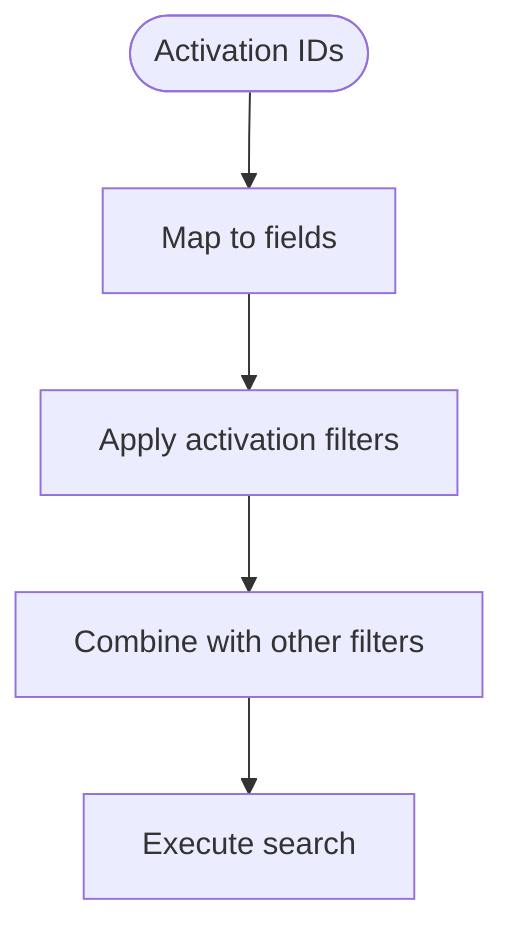

**Diagram sources**
- [activation-search-fields.ts](file://src/services/memory/activation-search-fields.ts)

**Section sources**
- [activation-search-fields.ts](file://src/services/memory/activation-search-fields.ts)

### Field-Specific Search Strategies
- Targeted fields:
  - Allows restricting search to specific attributes (e.g., title, tags).
- Weighting:
  - Adjusts importance per field during ranking.
- Examples:
  - Title-only search for precise lookups.
  - Tag-filtered search for categorical narrowing.

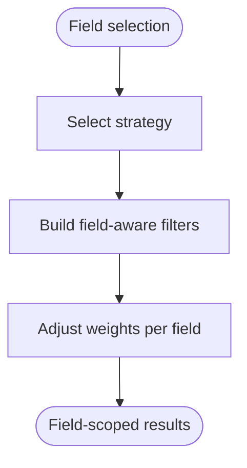

[No sources needed since this section describes conceptual strategies without analyzing specific files]

### Complex Queries, Filtering, and Pagination
- Complex queries:
  - Combine free-text with structured filters (spaces, tags, dates).
- Filtering conditions:
  - Support equality, range, and presence checks.
- Pagination:
  - Offset/limit or cursor-based approaches for large datasets.

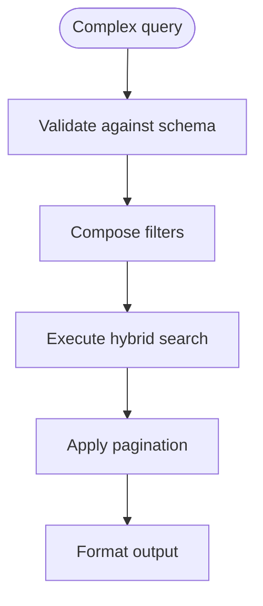

**Diagram sources**
- [search_schema.ts](file://src/tools/search_schema.ts)
- [search_output.ts](file://src/tools/search_output.ts)
- [memory-store.ts](file://src/services/memory-store.ts)

**Section sources**
- [search_schema.ts](file://src/tools/search_schema.ts)
- [search_output.ts](file://src/tools/search_output.ts)
- [memory-store.ts](file://src/services/memory-store.ts)

## Dependency Analysis
The search subsystem depends on:
- Tooling interfaces (CLI and HTTP) for entry points.
- Memory store for orchestration.
- Qdrant integration for vector retrieval and filtering.
- Embedding utilities for tokenization.
- Utilities for query building and collection management.

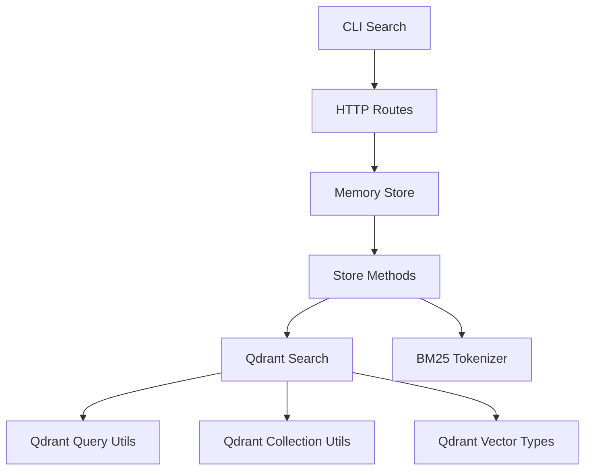

**Diagram sources**
- [cli-search.ts](file://src/cli/commands/search.ts)
- [http-api-routes.ts](file://src/http/http-api-routes.ts)
- [memory-store.ts](file://src/services/memory-store.ts)
- [store-methods.ts](file://src/services/memory/store-methods.ts)
- [qdrant-search.ts](file://src/services/qdrant/search.ts)
- [bm25-tokenizer.ts](file://src/services/embedding/bm25-tokenizer.ts)
- [qdrant-query-utils.ts](file://src/utils/qdrant-query-utils.ts)
- [qdrant-collection-utils.ts](file://src/utils/qdrant-collection-utils.ts)
- [qdrant-vector-types.ts](file://src/utils/qdrant-vector-types.ts)

**Section sources**
- [cli-search.ts](file://src/cli/commands/search.ts)
- [http-api-routes.ts](file://src/http/http-api-routes.ts)
- [memory-store.ts](file://src/services/memory-store.ts)
- [store-methods.ts](file://src/services/memory/store-methods.ts)
- [qdrant-search.ts](file://src/services/qdrant/search.ts)
- [bm25-tokenizer.ts](file://src/services/embedding/bm25-tokenizer.ts)
- [qdrant-query-utils.ts](file://src/utils/qdrant-query-utils.ts)
- [qdrant-collection-utils.ts](file://src/utils/qdrant-collection-utils.ts)
- [qdrant-vector-types.ts](file://src/utils/qdrant-vector-types.ts)

## Performance Considerations
- Index usage:
  - Prefer field-specific filters to reduce candidate sets early.
  - Leverage title similarity for high-precision, low-latency lookups.
- Query optimization:
  - Minimize free-text complexity; use structured filters where possible.
  - Avoid overly broad wildcard patterns in keyword searches.
- Vector search tuning:
  - Choose appropriate top-k to balance recall and cost.
  - Ensure vector dimension consistency to avoid runtime errors.
- Aggregation and ranking:
  - Keep merge and re-ranking lightweight; pre-sort when feasible.
- Pagination:
  - Use cursor-based pagination for deep paging to avoid expensive offsets.

[No sources needed since this section provides general guidance]

## Troubleshooting Guide
- Validation errors:
  - Check input schema compliance and required fields.
- No results:
  - Verify filters are not too restrictive.
  - Confirm embeddings exist for queried items.
- Slow queries:
  - Add more structured filters to narrow candidates.
  - Reduce top-k or limit result size.
- Incorrect scores:
  - Inspect normalization and weighting logic in ranking.
- Debugging:
  - Log intermediate steps: tokenization, filter composition, vector retrieval, and merge outcomes.

**Section sources**
- [search_schema.ts](file://src/tools/search_schema.ts)
- [memory-store.ts](file://src/services/memory-store.ts)
- [qdrant-search.ts](file://src/services/qdrant/search.ts)

## Conclusion
The search system implements a robust hybrid approach combining BM25 keyword matching with vector similarity. By leveraging structured filters, title similarity, and activation-based scoping, it achieves both precision and recall while maintaining performance through careful index usage and query optimization. Clear schemas and output formatting ensure reliable integrations across CLI and HTTP interfaces.

## Appendices

### Example Patterns
- Title-only search:
  - Use title similarity path with minimal filters.
- Tag-filtered search:
  - Combine tag equality filters with free-text query.
- Date-range search:
  - Apply range filters alongside BM25 and vector components.
- Deep pagination:
  - Use cursor-based pagination for stable ordering and efficiency.

[No sources needed since this section provides conceptual examples]