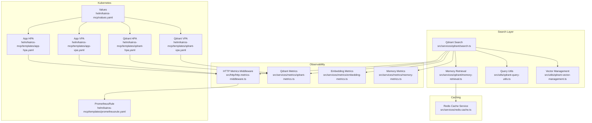
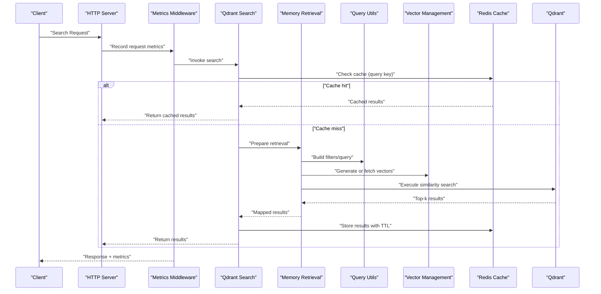
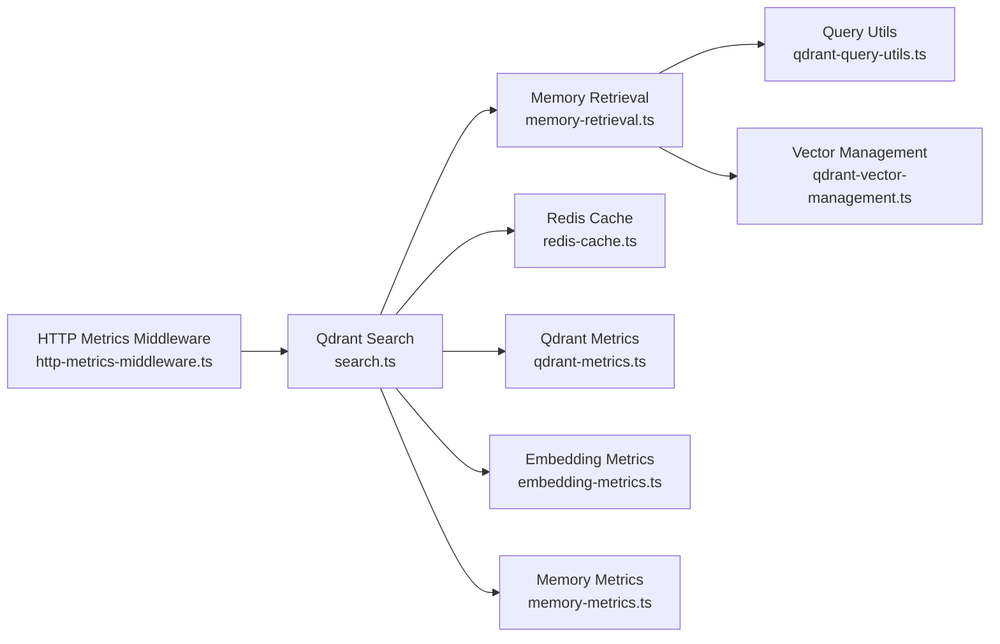

# Search Performance and Optimization

<cite>
**Referenced Files in This Document**
- [search.ts](file://src/services/qdrant/search.ts)
- [memory-retrieval.ts](file://src/services/qdrant/memory-retrieval.ts)
- [qdrant-query-utils.ts](file://src/utils/qdrant-query-utils.ts)
- [qdrant-vector-management.ts](file://src/utils/qdrant-vector-management.ts)
- [redis-cache.ts](file://src/services/redis-cache.ts)
- [http-metrics-middleware.ts](file://src/http/http-metrics-middleware.ts)
- [qdrant-metrics.ts](file://src/services/metrics/qdrant-metrics.ts)
- [embedding-metrics.ts](file://src/services/metrics/embedding-metrics.ts)
- [memory-metrics.ts](file://src/services/metrics/memory-metrics.ts)
- [app-hpa.yaml](file://helm/kairos-mcp/templates/app-hpa.yaml)
- [qdrant-hpa.yaml](file://helm/kairos-mcp/templates/qdrant-hpa.yaml)
- [values.yaml](file://helm/kairos-mcp/values.yaml)
- [qdrant-vpa.yaml](file://helm/kairos-mcp/templates/qdrant-vpa.yaml)
- [app-vpa.yaml](file://helm/kairos-mcp/templates/app-vpa.yaml)
- [prometheusrule.yaml](file://helm/kairos-mcp/templates/prometheusrule.yaml)
</cite>

## Table of Contents
1. [Introduction](#introduction)
2. [Project Structure](#project-structure)
3. [Core Components](#core-components)
4. [Architecture Overview](#architecture-overview)
5. [Detailed Component Analysis](#detailed-component-analysis)
6. [Dependency Analysis](#dependency-analysis)
7. [Performance Considerations](#performance-considerations)
8. [Troubleshooting Guide](#troubleshooting-guide)
9. [Conclusion](#conclusion)
10. [Appendices](#appendices)

## Introduction
This document provides a comprehensive guide to search performance optimization and tuning for the system. It covers indexing strategies, query optimization techniques, caching mechanisms, performance monitoring, bottleneck identification, scaling considerations, query profiling, index maintenance, resource allocation, load balancing, connection pooling, and memory management. The guidance is grounded in the actual implementation details present in the repository’s Qdrant integration, Redis-based caching, metrics collection, and Kubernetes deployment configurations.

## Project Structure
The search subsystem spans several modules:
- Qdrant client and search orchestration
- Query construction utilities
- Vector management helpers
- Redis-backed caching layer
- Metrics and observability middleware
- Kubernetes autoscaling and resource configuration

**Diagram sources**
- [search.ts](file://src/services/qdrant/search.ts)
- [memory-retrieval.ts](file://src/services/qdrant/memory-retrieval.ts)
- [qdrant-query-utils.ts](file://src/utils/qdrant-query-utils.ts)
- [qdrant-vector-management.ts](file://src/utils/qdrant-vector-management.ts)
- [redis-cache.ts](file://src/services/redis-cache.ts)
- [http-metrics-middleware.ts](file://src/http/http-metrics-middleware.ts)
- [qdrant-metrics.ts](file://src/services/metrics/qdrant-metrics.ts)
- [embedding-metrics.ts](file://src/services/metrics/embedding-metrics.ts)
- [memory-metrics.ts](file://src/services/metrics/memory-metrics.ts)
- [app-hpa.yaml](file://helm/kairos-mcp/templates/app-hpa.yaml)
- [qdrant-hpa.yaml](file://helm/kairos-mcp/templates/qdrant-hpa.yaml)
- [app-vpa.yaml](file://helm/kairos-mcp/templates/app-vpa.yaml)
- [qdrant-vpa.yaml](file://helm/kairos-mcp/templates/qdrant-vpa.yaml)
- [prometheusrule.yaml](file://helm/kairos-mcp/templates/prometheusrule.yaml)
- [values.yaml](file://helm/kairos-mcp/values.yaml)

**Section sources**
- [search.ts](file://src/services/qdrant/search.ts)
- [memory-retrieval.ts](file://src/services/qdrant/memory-retrieval.ts)
- [qdrant-query-utils.ts](file://src/utils/qdrant-query-utils.ts)
- [qdrant-vector-management.ts](file://src/utils/qdrant-vector-management.ts)
- [redis-cache.ts](file://src/services/redis-cache.ts)
- [http-metrics-middleware.ts](file://src/http/http-metrics-middleware.ts)
- [qdrant-metrics.ts](file://src/services/metrics/qdrant-metrics.ts)
- [embedding-metrics.ts](file://src/services/metrics/embedding-metrics.ts)
- [memory-metrics.ts](file://src/services/metrics/memory-metrics.ts)
- [app-hpa.yaml](file://helm/kairos-mcp/templates/app-hpa.yaml)
- [qdrant-hpa.yaml](file://helm/kairos-mcp/templates/qdrant-hpa.yaml)
- [app-vpa.yaml](file://helm/kairos-mcp/templates/app-vpa.yaml)
- [qdrant-vpa.yaml](file://helm/kairos-mcp/templates/qdrant-vpa.yaml)
- [prometheusrule.yaml](file://helm/kairos-mcp/templates/prometheusrule.yaml)
- [values.yaml](file://helm/kairos-mcp/values.yaml)

## Core Components
- Qdrant Search Orchestration: Coordinates vector similarity search, filters, and result shaping.
- Memory Retrieval: Bridges application memory models with Qdrant retrieval operations.
- Query Utilities: Builds efficient filter expressions and query parameters.
- Vector Management: Handles embedding generation and vector lifecycle.
- Redis Cache: Provides low-latency caching for frequent queries and embeddings.
- Observability: HTTP metrics middleware and domain-specific metrics for Qdrant, embeddings, and memory.
- Kubernetes Autoscaling: Horizontal and vertical pod autoscalers tuned by Helm values.

Key responsibilities and interactions are visualized below.

**Section sources**
- [search.ts](file://src/services/qdrant/search.ts)
- [memory-retrieval.ts](file://src/services/qdrant/memory-retrieval.ts)
- [qdrant-query-utils.ts](file://src/utils/qdrant-query-utils.ts)
- [qdrant-vector-management.ts](file://src/utils/qdrant-vector-management.ts)
- [redis-cache.ts](file://src/services/redis-cache.ts)
- [http-metrics-middleware.ts](file://src/http/http-metrics-middleware.ts)
- [qdrant-metrics.ts](file://src/services/metrics/qdrant-metrics.ts)
- [embedding-metrics.ts](file://src/services/metrics/embedding-metrics.ts)
- [memory-metrics.ts](file://src/services/metrics/memory-metrics.ts)

## Architecture Overview
The search pipeline integrates application logic with Qdrant for vector similarity search, uses Redis for caching, and exposes metrics for monitoring and autoscaling.

**Diagram sources**
- [http-metrics-middleware.ts](file://src/http/http-metrics-middleware.ts)
- [search.ts](file://src/services/qdrant/search.ts)
- [memory-retrieval.ts](file://src/services/qdrant/memory-retrieval.ts)
- [qdrant-query-utils.ts](file://src/utils/qdrant-query-utils.ts)
- [qdrant-vector-management.ts](file://src/utils/qdrant-vector-management.ts)
- [redis-cache.ts](file://src/services/redis-cache.ts)

## Detailed Component Analysis

### Qdrant Search Orchestration
Responsibilities:
- Orchestrates search requests, including filtering, top-k selection, and score normalization.
- Integrates with Redis to short-circuit repeated queries.
- Emits Qdrant-specific metrics for latency and throughput.

Optimization tips:
- Tune top-k and threshold parameters to balance recall and latency.
- Use precise filters to reduce search space.
- Prefer batched operations where applicable.

**Section sources**
- [search.ts](file://src/services/qdrant/search.ts)
- [qdrant-metrics.ts](file://src/services/metrics/qdrant-metrics.ts)

### Memory Retrieval Bridge
Responsibilities:
- Translates application memory structures into Qdrant-compatible payloads.
- Applies field-level filters and scoring adjustments.

Optimization tips:
- Minimize payload size; only include necessary fields.
- Precompute stable identifiers to avoid recomputation.

**Section sources**
- [memory-retrieval.ts](file://src/services/qdrant/memory-retrieval.ts)

### Query Utilities
Responsibilities:
- Constructs filter expressions and query parameters efficiently.
- Encapsulates common filter patterns and value sanitization.

Optimization tips:
- Reuse compiled filter templates for similar queries.
- Avoid overly complex nested conditions.

**Section sources**
- [qdrant-query-utils.ts](file://src/utils/qdrant-query-utils.ts)

### Vector Management
Responsibilities:
- Manages embedding generation and vector lifecycle.
- Ensures consistent vector dimensions and normalization.

Optimization tips:
- Normalize vectors consistently to improve similarity accuracy.
- Cache embeddings when inputs are deterministic.

**Section sources**
- [qdrant-vector-management.ts](file://src/utils/qdrant-vector-management.ts)
- [embedding-metrics.ts](file://src/services/metrics/embedding-metrics.ts)

### Redis Caching Layer
Responsibilities:
- Stores frequently accessed search results and embeddings.
- Supports configurable TTLs and keys derived from query fingerprints.

Optimization tips:
- Design stable cache keys based on normalized query inputs.
- Set appropriate TTLs to balance freshness and hit rate.
- Monitor cache hit ratio and adjust TTLs accordingly.

**Section sources**
- [redis-cache.ts](file://src/services/redis-cache.ts)

### Observability and Metrics
Responsibilities:
- HTTP metrics middleware records request durations and counts.
- Domain metrics capture Qdrant, embedding, and memory operation stats.

Optimization tips:
- Instrument custom counters for cache hits/misses and filter complexity.
- Correlate latency spikes with Qdrant metrics and resource utilization.

**Section sources**
- [http-metrics-middleware.ts](file://src/http/http-metrics-middleware.ts)
- [qdrant-metrics.ts](file://src/services/metrics/qdrant-metrics.ts)
- [embedding-metrics.ts](file://src/services/metrics/embedding-metrics.ts)
- [memory-metrics.ts](file://src/services/metrics/memory-metrics.ts)

### Kubernetes Autoscaling and Resource Allocation
Responsibilities:
- Horizontal Pod Autoscaler (HPA) scales replicas based on CPU, memory, and custom metrics.
- Vertical Pod Autoscaler (VPA) adjusts resource requests/limits.
- Prometheus rules expose alerts for search-related anomalies.

Optimization tips:
- Align HPA targets with p95 latency thresholds.
- Use VPA recommendations to right-size containers.
- Configure separate HPAs for app and Qdrant to scale independently.

**Section sources**
- [app-hpa.yaml](file://helm/kairos-mcp/templates/app-hpa.yaml)
- [qdrant-hpa.yaml](file://helm/kairos-mcp/templates/qdrant-hpa.yaml)
- [app-vpa.yaml](file://helm/kairos-mcp/templates/app-vpa.yaml)
- [qdrant-vpa.yaml](file://helm/kairos-mcp/templates/qdrant-vpa.yaml)
- [prometheusrule.yaml](file://helm/kairos-mcp/templates/prometheusrule.yaml)
- [values.yaml](file://helm/kairos-mcp/values.yaml)

## Dependency Analysis
The following diagram shows how components depend on each other during a typical search operation.

**Diagram sources**
- [http-metrics-middleware.ts](file://src/http/http-metrics-middleware.ts)
- [search.ts](file://src/services/qdrant/search.ts)
- [memory-retrieval.ts](file://src/services/qdrant/memory-retrieval.ts)
- [qdrant-query-utils.ts](file://src/utils/qdrant-query-utils.ts)
- [qdrant-vector-management.ts](file://src/utils/qdrant-vector-management.ts)
- [redis-cache.ts](file://src/services/redis-cache.ts)
- [qdrant-metrics.ts](file://src/services/metrics/qdrant-metrics.ts)
- [embedding-metrics.ts](file://src/services/metrics/embedding-metrics.ts)
- [memory-metrics.ts](file://src/services/metrics/memory-metrics.ts)

**Section sources**
- [search.ts](file://src/services/qdrant/search.ts)
- [memory-retrieval.ts](file://src/services/qdrant/memory-retrieval.ts)
- [qdrant-query-utils.ts](file://src/utils/qdrant-query-utils.ts)
- [qdrant-vector-management.ts](file://src/utils/qdrant-vector-management.ts)
- [redis-cache.ts](file://src/services/redis-cache.ts)
- [http-metrics-middleware.ts](file://src/http/http-metrics-middleware.ts)
- [qdrant-metrics.ts](file://src/services/metrics/qdrant-metrics.ts)
- [embedding-metrics.ts](file://src/services/metrics/embedding-metrics.ts)
- [memory-metrics.ts](file://src/services/metrics/memory-metrics.ts)

## Performance Considerations

### Indexing Strategies
- Choose appropriate vector dimensions and distance metrics aligned with your data distribution.
- Maintain consistent normalization across embeddings to maximize recall.
- Partition collections by logical domains if access patterns differ significantly.

### Query Optimization Techniques
- Narrow filters early to reduce candidate sets.
- Limit top-k to the minimum required for downstream processing.
- Avoid deep nested filters; prefer flat, selective predicates.

### Caching Mechanisms
- Cache at multiple levels:
  - Embeddings for deterministic inputs.
  - Final search results keyed by normalized query fingerprints.
- Set TTLs based on data volatility and user expectations.
- Track cache hit ratios and adjust TTLs dynamically.

### Performance Monitoring and Bottleneck Identification
- Use HTTP metrics middleware to track request latency distributions.
- Correlate Qdrant metrics with application-side timings to pinpoint slow stages.
- Monitor embedding generation costs and frequency.

### Scaling Considerations
- Scale horizontally via HPA based on CPU, memory, and custom metrics like latency percentiles.
- Scale Qdrant independently using its own HPA to handle vector search load.
- Apply VPA recommendations to optimize resource requests and limits.

### Load Balancing
- Rely on Kubernetes service load balancing across replicas.
- Ensure sticky sessions are not required for stateless search endpoints.

### Connection Pooling
- Use connection pooling for Redis and Qdrant clients to reduce overhead under high concurrency.
- Tune pool sizes according to observed throughput and latency.

### Memory Management
- Right-size container memory limits to prevent OOM kills.
- Monitor heap usage and GC pauses; adjust JVM/runtime settings if applicable.
- Stream large payloads instead of loading entirely into memory.

[No sources needed since this section provides general guidance]

## Troubleshooting Guide

Common issues and resolutions:
- High latency spikes:
  - Inspect Qdrant metrics for slow searches and check filter complexity.
  - Validate cache hit rates; increase TTLs or refine cache keys if misses dominate.
- Elevated error rates:
  - Review HTTP metrics middleware logs for timeouts and upstream failures.
  - Check Redis connectivity and Qdrant health endpoints.
- Resource exhaustion:
  - Adjust HPA/VPA targets and limits based on Prometheus alerts.
  - Increase connection pool sizes if saturation is observed.

Operational checks:
- Verify PrometheusRule alerts are firing for search anomalies.
- Confirm autoscaling policies align with target latency SLAs.

**Section sources**
- [http-metrics-middleware.ts](file://src/http/http-metrics-middleware.ts)
- [qdrant-metrics.ts](file://src/services/metrics/qdrant-metrics.ts)
- [embedding-metrics.ts](file://src/services/metrics/embedding-metrics.ts)
- [memory-metrics.ts](file://src/services/metrics/memory-metrics.ts)
- [prometheusrule.yaml](file://helm/kairos-mcp/templates/prometheusrule.yaml)

## Conclusion
Effective search performance hinges on disciplined indexing, careful query design, strategic caching, robust observability, and well-tuned autoscaling. By leveraging the Qdrant integration, Redis caching, and Kubernetes autoscaling resources documented here, teams can achieve low-latency, scalable search operations while maintaining high recall and operational reliability.

[No sources needed since this section summarizes without analyzing specific files]

## Appendices

### Example: Query Profiling Workflow
- Capture request duration and component timings via HTTP metrics middleware.
- Compare against Qdrant metrics to isolate slow phases.
- Adjust filters, top-k, and cache TTLs iteratively based on observed improvements.

### Example: Index Maintenance Checklist
- Periodically review embedding normalization and dimension consistency.
- Rebuild or reorganize collections if fragmentation impacts performance.
- Validate filter selectivity and remove unused fields.

### Example: Resource Allocation Guidelines
- Start with VPA recommendations and validate with HPA targets.
- Monitor Prometheus alerts and adjust thresholds to match SLAs.
- Separate autoscaling for app and Qdrant to decouple compute and storage workloads.

[No sources needed since this section provides general guidance]