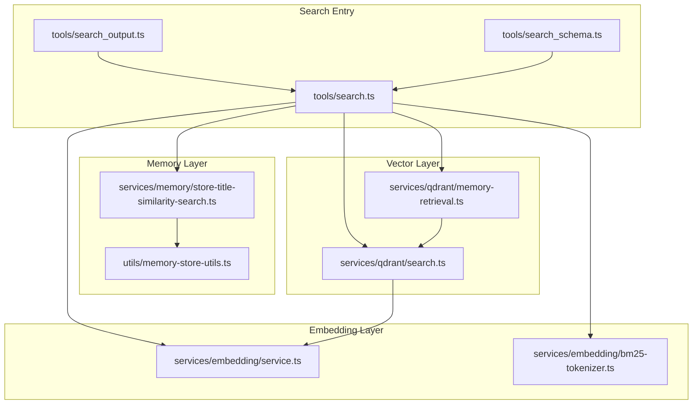
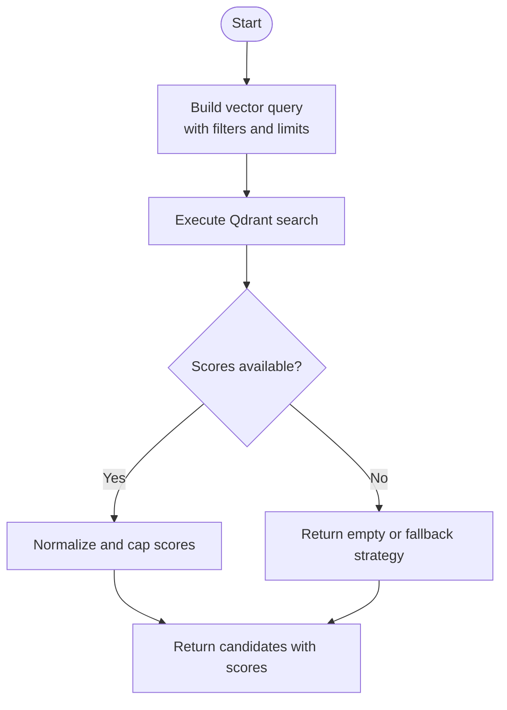
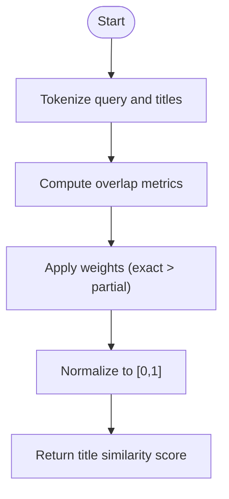
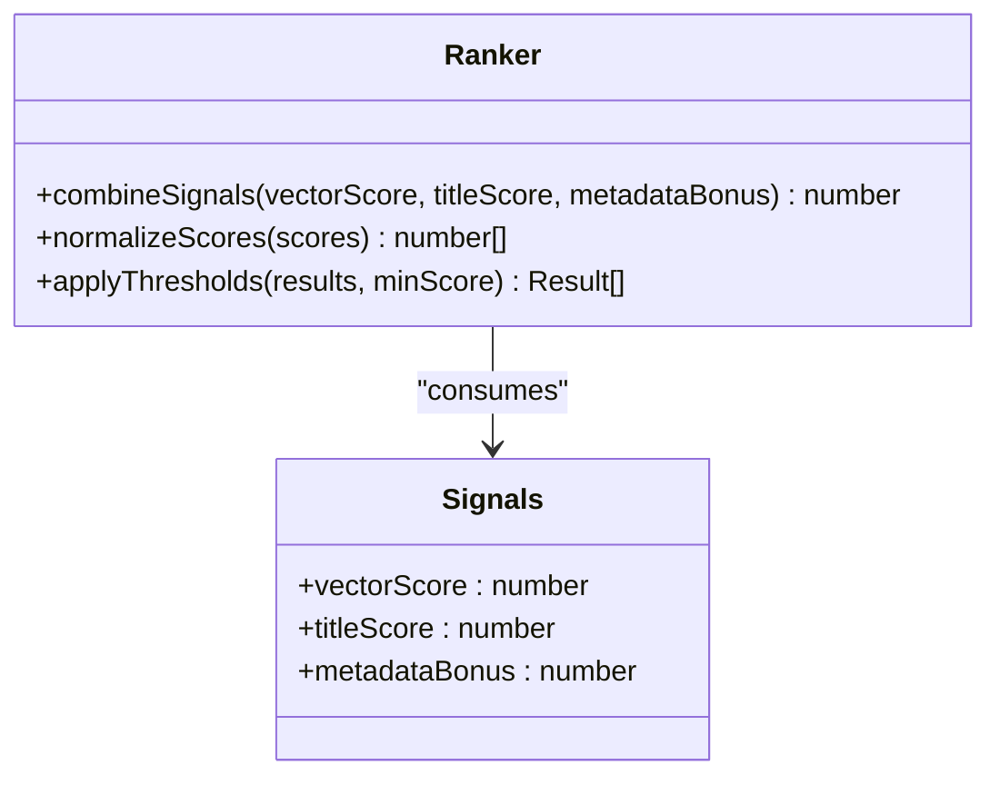
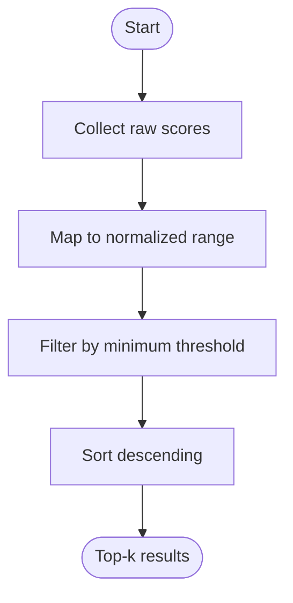
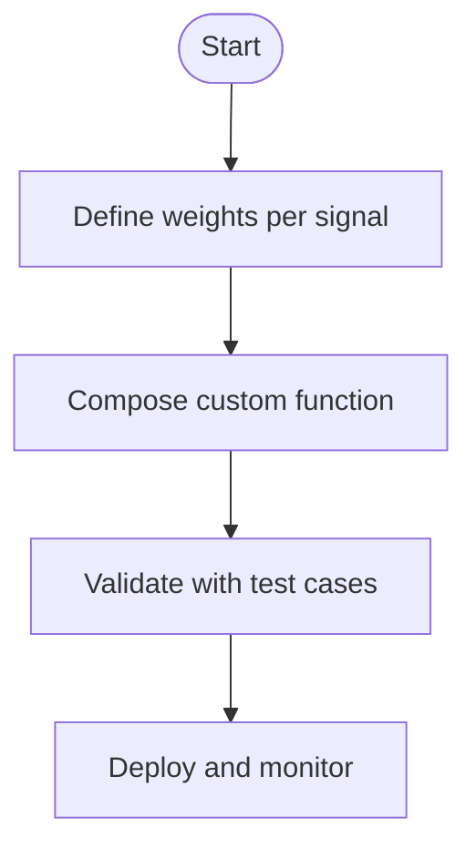
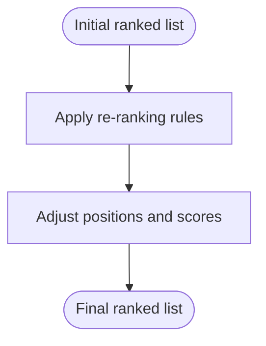
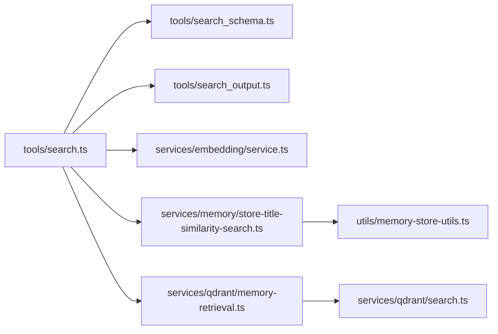

# Similarity Scoring and Ranking

<cite>
**Referenced Files in This Document**
- [store-title-similarity-search.ts](file://src/services/memory/store-title-similarity-search.ts)
- [qdrant-memory-retrieval.ts](file://src/services/qdrant/memory-retrieval.ts)
- [qdrant-search.ts](file://src/services/qdrant/search.ts)
- [embedding-service.ts](file://src/services/embedding/service.ts)
- [bm25-tokenizer.ts](file://src/services/embedding/bm25-tokenizer.ts)
- [memory-store-utils.ts](file://src/utils/memory-store-utils.ts)
- [relevance-scoring.test.ts](file://tests/utils/relevance-scoring.test.ts)
- [kairos-search-scores.test.ts](file://tests/integration/kairos-search-scores.test.ts)
- [search.ts](file://src/tools/search.ts)
- [search_output.ts](file://src/tools/search_output.ts)
- [search_schema.ts](file://src/tools/search_schema.ts)
</cite>

## Table of Contents
1. [Introduction](#introduction)
2. [Project Structure](#project-structure)
3. [Core Components](#core-components)
4. [Architecture Overview](#architecture-overview)
5. [Detailed Component Analysis](#detailed-component-analysis)
6. [Dependency Analysis](#dependency-analysis)
7. [Performance Considerations](#performance-considerations)
8. [Troubleshooting Guide](#troubleshooting-guide)
9. [Conclusion](#conclusion)
10. [Appendices](#appendices)

## Introduction
This document explains the similarity scoring and ranking mechanisms used across the system, focusing on:
- Cosine similarity calculations for vector embeddings
- Title-based similarity matching
- Multi-factor ranking systems that combine multiple signals
- Score normalization, threshold configuration, and relevance tuning
- Custom scoring functions, weighted combinations, and re-ranking strategies
- Performance optimization, score calibration, and debugging techniques

The goal is to provide both a conceptual overview and code-level insights so you can understand, tune, and extend the search and ranking behavior.

## Project Structure
Relevant modules for similarity and ranking are primarily located under:
- services/memory: title similarity search implementation
- services/qdrant: vector retrieval and search orchestration
- services/embedding: embedding service and BM25 tokenizer utilities
- utils: memory store utilities and helpers
- tools: search tool entry points and output shaping
- tests: unit and integration tests validating scoring behavior



**Diagram sources**
- [search.ts](file://src/tools/search.ts)
- [search_output.ts](file://src/tools/search_output.ts)
- [search_schema.ts](file://src/tools/search_schema.ts)
- [store-title-similarity-search.ts](file://src/services/memory/store-title-similarity-search.ts)
- [memory-store-utils.ts](file://src/utils/memory-store-utils.ts)
- [qdrant-memory-retrieval.ts](file://src/services/qdrant/memory-retrieval.ts)
- [qdrant-search.ts](file://src/services/qdrant/search.ts)
- [embedding-service.ts](file://src/services/embedding/service.ts)
- [bm25-tokenizer.ts](file://src/services/embedding/bm25-tokenizer.ts)

**Section sources**
- [search.ts](file://src/tools/search.ts)
- [search_output.ts](file://src/tools/search_output.ts)
- [search_schema.ts](file://src/tools/search_schema.ts)
- [store-title-similarity-search.ts](file://src/services/memory/store-title-similarity-search.ts)
- [memory-store-utils.ts](file://src/utils/memory-store-utils.ts)
- [qdrant-memory-retrieval.ts](file://src/services/qdrant/memory-retrieval.ts)
- [qdrant-search.ts](file://src/services/qdrant/search.ts)
- [embedding-service.ts](file://src/services/embedding/service.ts)
- [bm25-tokenizer.ts](file://src/services/embedding/bm25-tokenizer.ts)

## Core Components
- Title similarity search: Implements lexical/title-focused matching logic and integrates with memory utilities.
- Vector retrieval and search: Orchestrates Qdrant-based vector search and returns scored results.
- Embedding service: Provides embedding generation and tokenization utilities (including BM25).
- Search tooling: Defines input schemas, orchestrates calls, and shapes outputs.

Key responsibilities:
- Compute or retrieve similarity scores from vectors and text fields
- Combine multiple signals into a unified ranking
- Normalize and filter by thresholds
- Expose configurable parameters for tuning

**Section sources**
- [store-title-similarity-search.ts](file://src/services/memory/store-title-similarity-search.ts)
- [qdrant-memory-retrieval.ts](file://src/services/qdrant/memory-retrieval.ts)
- [qdrant-search.ts](file://src/services/qdrant/search.ts)
- [embedding-service.ts](file://src/services/embedding/service.ts)
- [bm25-tokenizer.ts](file://src/services/embedding/bm25-tokenizer.ts)
- [search.ts](file://src/tools/search.ts)
- [search_output.ts](file://src/tools/search_output.ts)
- [search_schema.ts](file://src/tools/search_schema.ts)

## Architecture Overview
The search pipeline typically follows these steps:
1. Parse and validate inputs via schema.
2. Generate embeddings if needed using the embedding service.
3. Execute vector search against Qdrant to obtain candidate items with cosine similarity scores.
4. Optionally run title-based similarity to boost or refine matches.
5. Combine signals (vector score, title match, metadata bonuses) into a final rank.
6. Normalize scores, apply thresholds, and return top-k results.

```mermaid
sequenceDiagram
participant Client as "Client"
participant Tool as "tools/search.ts"
participant Schema as "tools/search_schema.ts"
participant Embed as "services/embedding/service.ts"
participant QRet as "services/qdrant/memory-retrieval.ts"
participant QSearch as "services/qdrant/search.ts"
participant Title as "services/memory/store-title-similarity-search.ts"
participant Utils as "utils/memory-store-utils.ts"
Client->>Tool : "search(query, options)"
Tool->>Schema : "validate(input)"
alt "needs embeddings"
Tool->>Embed : "embed(text)"
Embed-->>Tool : "vector"
end
Tool->>QRet : "retrieveCandidates(vector, filters)"
QRet->>QSearch : "query(collection, vector, params)"
QSearch-->>QRet : "results with cosine scores"
QRet-->>Tool : "candidates"
Tool->>Title : "titleSimilarity(query, candidates)"
Title->>Utils : "normalize/prepare data"
Utils-->>Title : "processed"
Title-->>Tool : "title scores"
Tool->>Tool : "combineSignals(vectorScore, titleScore, metadata)"
Tool->>Tool : "normalizeScores()"
Tool->>Tool : "applyThresholds()"
Tool-->>Client : "ranked results"
```

**Diagram sources**
- [search.ts](file://src/tools/search.ts)
- [search_schema.ts](file://src/tools/search_schema.ts)
- [embedding-service.ts](file://src/services/embedding/service.ts)
- [qdrant-memory-retrieval.ts](file://src/services/qdrant/memory-retrieval.ts)
- [qdrant-search.ts](file://src/services/qdrant/search.ts)
- [store-title-similarity-search.ts](file://src/services/memory/store-title-similarity-search.ts)
- [memory-store-utils.ts](file://src/utils/memory-store-utils.ts)

## Detailed Component Analysis

### Cosine Similarity and Vector Search
- The vector layer uses Qdrant to perform nearest neighbor searches. Results include similarity scores derived from dot product or cosine operations depending on collection configuration.
- The retrieval module coordinates query construction and post-processing before returning candidates to the caller.



**Diagram sources**
- [qdrant-memory-retrieval.ts](file://src/services/qdrant/memory-retrieval.ts)
- [qdrant-search.ts](file://src/services/qdrant/search.ts)

**Section sources**
- [qdrant-memory-retrieval.ts](file://src/services/qdrant/memory-retrieval.ts)
- [qdrant-search.ts](file://src/services/qdrant/search.ts)

### Title-Based Similarity Matching
- Title similarity focuses on lexical overlap between query terms and item titles. It may use tokenization and weighting to emphasize exact or partial matches.
- Integration with memory utilities ensures consistent preprocessing and normalization.



**Diagram sources**
- [store-title-similarity-search.ts](file://src/services/memory/store-title-similarity-search.ts)
- [memory-store-utils.ts](file://src/utils/memory-store-utils.ts)

**Section sources**
- [store-title-similarity-search.ts](file://src/services/memory/store-title-similarity-search.ts)
- [memory-store-utils.ts](file://src/utils/memory-store-utils.ts)

### Multi-Factor Ranking System
- Combines multiple signals such as vector cosine score, title similarity, and optional metadata bonuses.
- Uses configurable weights to balance importance of each factor.
- Applies normalization to bring all scores onto a common scale before combination.



**Diagram sources**
- [search.ts](file://src/tools/search.ts)
- [search_output.ts](file://src/tools/search_output.ts)

**Section sources**
- [search.ts](file://src/tools/search.ts)
- [search_output.ts](file://src/tools/search_output.ts)

### Score Normalization and Threshold Configuration
- Normalization maps raw scores to a standard range (e.g., [0,1]) to ensure fair comparison across different signals.
- Thresholds filter out low-relevance results and improve precision.



**Diagram sources**
- [search.ts](file://src/tools/search.ts)
- [search_output.ts](file://src/tools/search_output.ts)

**Section sources**
- [search.ts](file://src/tools/search.ts)
- [search_output.ts](file://src/tools/search_output.ts)

### Relevance Tuning and Custom Scoring Functions
- Weights for each signal can be tuned to reflect domain priorities (e.g., boosting title matches for short queries).
- Custom scoring functions can be introduced to incorporate additional features like recency, authorship, or content type.



[No sources needed since this diagram shows conceptual workflow, not actual code structure]

**Section sources**
- [search.ts](file://src/tools/search.ts)
- [search_output.ts](file://src/tools/search_output.ts)

### Result Re-Ranking Strategies
- After initial retrieval, re-rankers can adjust order based on secondary criteria (e.g., diversity, freshness, user preferences).
- Re-ranking should preserve high-confidence matches while improving overall relevance.



[No sources needed since this diagram shows conceptual workflow, not actual code structure]

## Dependency Analysis
The following diagram highlights key dependencies among components involved in similarity and ranking:



**Diagram sources**
- [search.ts](file://src/tools/search.ts)
- [search_schema.ts](file://src/tools/search_schema.ts)
- [search_output.ts](file://src/tools/search_output.ts)
- [embedding-service.ts](file://src/services/embedding/service.ts)
- [store-title-similarity-search.ts](file://src/services/memory/store-title-similarity-search.ts)
- [qdrant-memory-retrieval.ts](file://src/services/qdrant/memory-retrieval.ts)
- [qdrant-search.ts](file://src/services/qdrant/search.ts)
- [memory-store-utils.ts](file://src/utils/memory-store-utils.ts)

**Section sources**
- [search.ts](file://src/tools/search.ts)
- [search_schema.ts](file://src/tools/search_schema.ts)
- [search_output.ts](file://src/tools/search_output.ts)
- [embedding-service.ts](file://src/services/embedding/service.ts)
- [store-title-similarity-search.ts](file://src/services/memory/store-title-similarity-search.ts)
- [qdrant-memory-retrieval.ts](file://src/services/qdrant/memory-retrieval.ts)
- [qdrant-search.ts](file://src/services/qdrant/search.ts)
- [memory-store-utils.ts](file://src/utils/memory-store-utils.ts)

## Performance Considerations
- Vector search efficiency:
  - Use appropriate limit and filters to reduce payload size.
  - Ensure collections are optimized for the chosen distance metric.
- Tokenization overhead:
  - Cache tokens where possible; avoid recomputation for repeated queries.
- Normalization and filtering:
  - Perform early pruning to minimize downstream processing.
- Batch operations:
  - Where feasible, batch embedding requests to reduce latency.
- Monitoring:
  - Track score distributions and recall@k to detect regressions.

[No sources needed since this section provides general guidance]

## Troubleshooting Guide
Common issues and diagnostics:
- Low recall:
  - Increase candidate pool size or relax filters.
  - Verify embedding quality and dimensionality.
- Poor precision:
  - Raise thresholds or increase weight of precise signals (e.g., title exact match).
- Score instability:
  - Inspect normalization ranges and ensure consistent scaling across signals.
- Debugging steps:
  - Log intermediate scores (vector, title, metadata) to identify dominant factors.
  - Compare against baseline datasets and expected rankings.

**Section sources**
- [relevance-scoring.test.ts](file://tests/utils/relevance-scoring.test.ts)
- [kairos-search-scores.test.ts](file://tests/integration/kairos-search-scores.test.ts)

## Conclusion
The similarity and ranking system combines vector cosine similarity with title-based lexical matching and optional metadata signals. By normalizing scores, applying thresholds, and allowing tunable weights, it supports flexible relevance control. For best results, continuously calibrate weights and thresholds using representative queries and monitor performance metrics to maintain high precision and recall.

[No sources needed since this section summarizes without analyzing specific files]

## Appendices

### Example Patterns and References
- Input validation and schema usage:
  - [search_schema.ts](file://src/tools/search_schema.ts)
- Output shaping and result formatting:
  - [search_output.ts](file://src/tools/search_output.ts)
- Search orchestration and combining signals:
  - [search.ts](file://src/tools/search.ts)
- Title similarity implementation:
  - [store-title-similarity-search.ts](file://src/services/memory/store-title-similarity-search.ts)
- Memory utilities for normalization and preparation:
  - [memory-store-utils.ts](file://src/utils/memory-store-utils.ts)
- Vector retrieval and search coordination:
  - [qdrant-memory-retrieval.ts](file://src/services/qdrant/memory-retrieval.ts)
  - [qdrant-search.ts](file://src/services/qdrant/search.ts)
- Embedding service and BM25 tokenizer:
  - [embedding-service.ts](file://src/services/embedding/service.ts)
  - [bm25-tokenizer.ts](file://src/services/embedding/bm25-tokenizer.ts)
- Tests for relevance scoring and search scores:
  - [relevance-scoring.test.ts](file://tests/utils/relevance-scoring.test.ts)
  - [kairos-search-scores.test.ts](file://tests/integration/kairos-search-scores.test.ts)