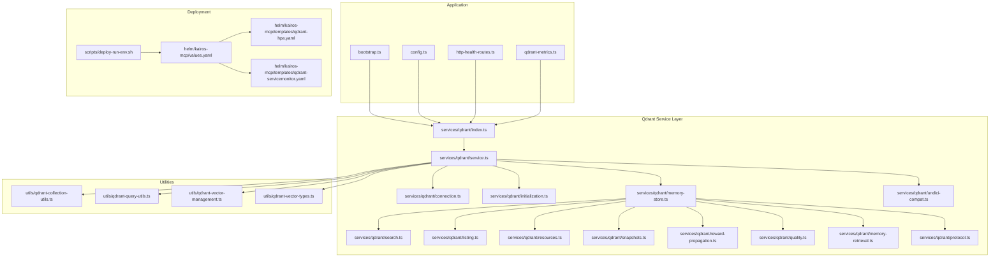
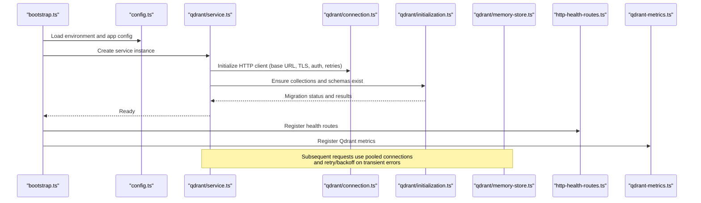
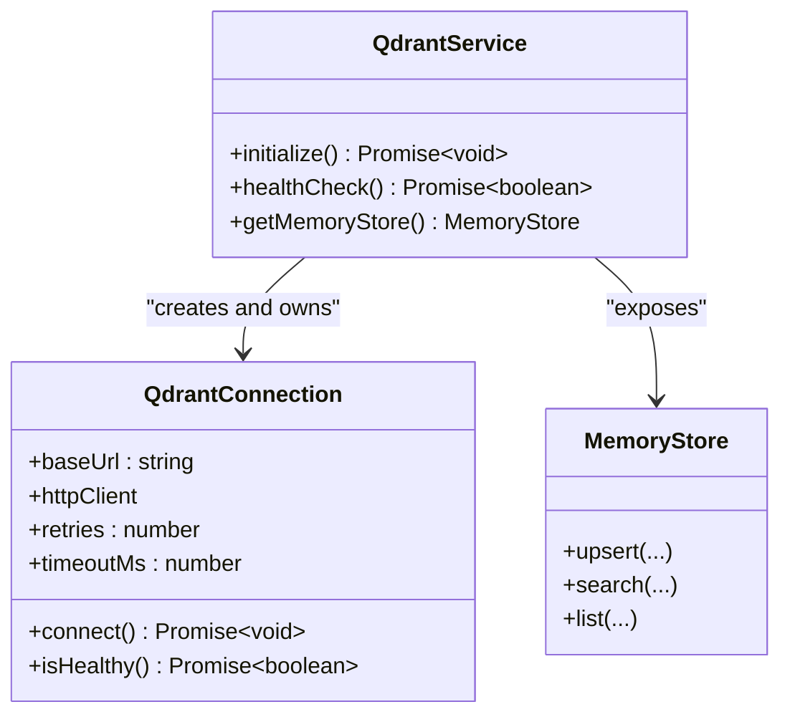
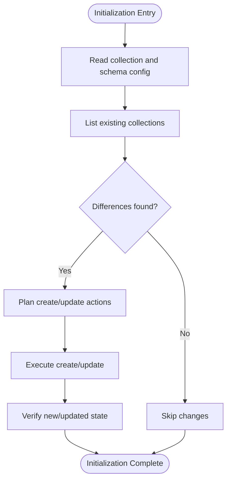
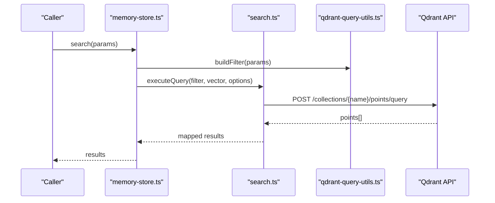
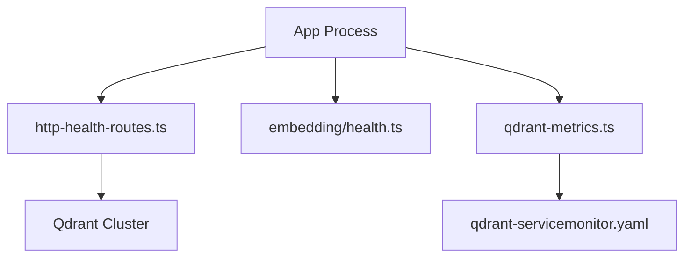
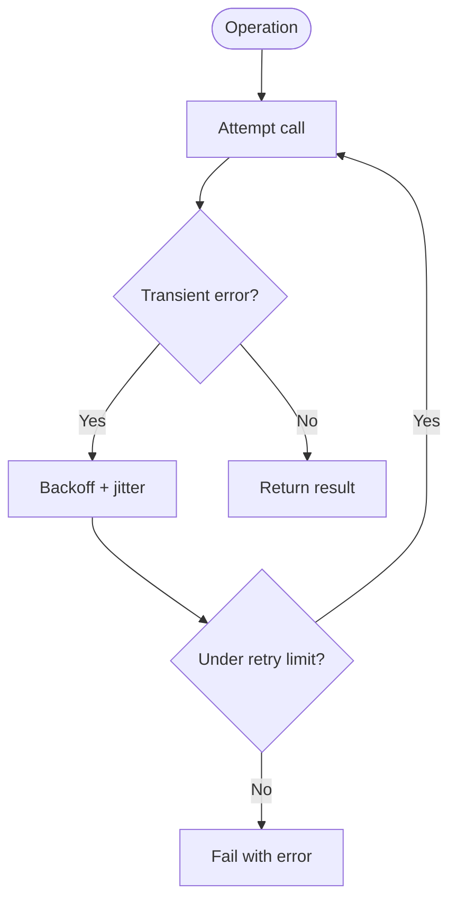
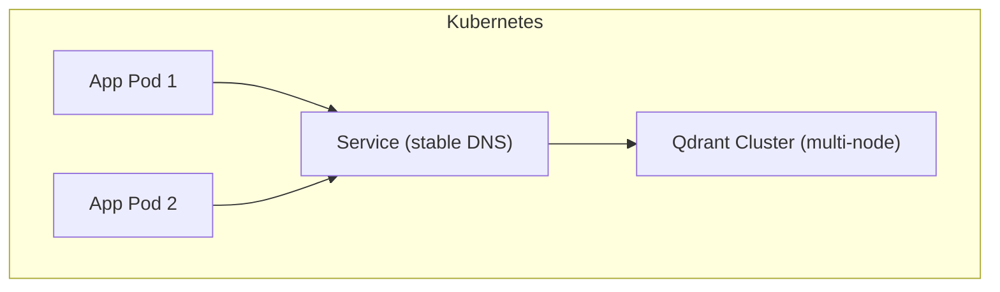
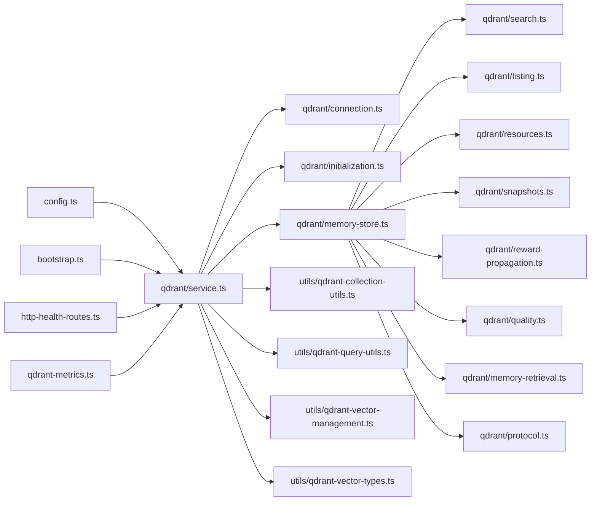

# Connection Management and Initialization

<cite>
**Referenced Files in This Document**
- [src/services/qdrant/connection.ts](file://src/services/qdrant/connection.ts)
- [src/services/qdrant/initialization.ts](file://src/services/qdrant/initialization.ts)
- [src/services/qdrant/service.ts](file://src/services/qdrant/service.ts)
- [src/services/qdrant/index.ts](file://src/services/qdrant/index.ts)
- [src/services/qdrant/types.ts](file://src/services/qdrant/types.ts)
- [src/services/qdrant/utils.ts](file://src/services/qdrant/utils.ts)
- [src/services/qdrant/memory-store.ts](file://src/services/qdrant/memory-store.ts)
- [src/services/qdrant/search.ts](file://src/services/qdrant/search.ts)
- [src/services/qdrant/listing.ts](file://src/services/qdrant/listing.ts)
- [src/services/qdrant/resources.ts](file://src/services/qdrant/resources.ts)
- [src/services/qdrant/snapshots.ts](file://src/services/qdrant/snapshots.ts)
- [src/services/qdrant/reward-propagation.ts](file://src/services/qdrant/reward-propagation.ts)
- [src/services/qdrant/quality.ts](file://src/services/qdrant/quality.ts)
- [src/services/qdrant/memories-retrieval.ts](file://src/services/qdrant/memory-retrieval.ts)
- [src/services/qdrant/protocol.ts](file://src/services/qdrant/protocol.ts)
- [src/services/qdrant/undici-compat.ts](file://src/services/qdrant/undici-compat.ts)
- [src/utils/qdrant-collection-utils.ts](file://src/utils/qdrant-collection-utils.ts)
- [src/utils/qdrant-query-utils.ts](file://src/utils/qdrant-query-utils.ts)
- [src/utils/qdrant-vector-management.ts](file://src/utils/qdrant-vector-management.ts)
- [src/utils/qdrant-vector-types.ts](file://src/utils/qdrant-vector-types.ts)
- [src/bootstrap.ts](file://src/bootstrap.ts)
- [src/config.ts](file://src/config.ts)
- [src/http/http-health-routes.ts](file://src/http/http-health-routes.ts)
- [src/services/embedding/health.ts](file://src/services/embedding/health.ts)
- [src/services/metrics/qdrant-metrics.ts](file://src/services/metrics/qdrant-metrics.ts)
- [helm/kairos-mcp/templates/qdrant-hpa.yaml](file://helm/kairos-mcp/templates/qdrant-hpa.yaml)
- [helm/kairos-mcp/templates/qdrant-servicemonitor.yaml](file://helm/kairos-mcp/templates/qdrant-servicemonitor.yaml)
- [helm/kairos-mcp/values.yaml](file://helm/kairos-mcp/values.yaml)
- [scripts/deploy-run-env.sh](file://scripts/deploy-run-env.sh)
</cite>

## Table of Contents
1. [Introduction](#introduction)
2. [Project Structure](#project-structure)
3. [Core Components](#core-components)
4. [Architecture Overview](#architecture-overview)
5. [Detailed Component Analysis](#detailed-component-analysis)
6. [Dependency Analysis](#dependency-analysis)
7. [Performance Considerations](#performance-considerations)
8. [Troubleshooting Guide](#troubleshooting-guide)
9. [Conclusion](#conclusion)
10. [Appendices](#appendices)

## Introduction
This document explains how the application manages Qdrant connections and initializes vector storage for memory operations. It covers client configuration, connection lifecycle, health monitoring, collection setup and schema definition, migration procedures, error recovery and retry logic, environment-specific configurations, load balancing and high availability deployment patterns, troubleshooting, performance monitoring, and scaling considerations. The goal is to provide both a conceptual overview and code-level details so that operators and developers can reliably deploy and operate Qdrant-backed memory services.

## Project Structure
The Qdrant integration is implemented under the services layer with supporting utilities and Helm charts for deployment. Key areas include:
- Client and service orchestration for Qdrant connectivity
- Initialization routines for collections and schema
- Health checks and metrics exposure
- Utilities for collection naming, query building, and vector management
- Helm templates for autoscaling and service monitoring

**Diagram sources**
- [src/bootstrap.ts](file://src/bootstrap.ts)
- [src/config.ts](file://src/config.ts)
- [src/http/http-health-routes.ts](file://src/http/http-health-routes.ts)
- [src/services/metrics/qdrant-metrics.ts](file://src/services/metrics/qdrant-metrics.ts)
- [src/services/qdrant/index.ts](file://src/services/qdrant/index.ts)
- [src/services/qdrant/service.ts](file://src/services/qdrant/service.ts)
- [src/services/qdrant/connection.ts](file://src/services/qdrant/connection.ts)
- [src/services/qdrant/initialization.ts](file://src/services/qdrant/initialization.ts)
- [src/services/qdrant/memory-store.ts](file://src/services/qdrant/memory-store.ts)
- [src/services/qdrant/search.ts](file://src/services/qdrant/search.ts)
- [src/services/qdrant/listing.ts](file://src/services/qdrant/listing.ts)
- [src/services/qdrant/resources.ts](file://src/services/qdrant/resources.ts)
- [src/services/qdrant/snapshots.ts](file://src/services/qdrant/snapshots.ts)
- [src/services/qdrant/reward-propagation.ts](file://src/services/qdrant/reward-propagation.ts)
- [src/services/qdrant/quality.ts](file://src/services/qdrant/quality.ts)
- [src/services/qdrant/memory-retrieval.ts](file://src/services/qdrant/memory-retrieval.ts)
- [src/services/qdrant/protocol.ts](file://src/services/qdrant/protocol.ts)
- [src/services/qdrant/undici-compat.ts](file://src/services/qdrant/undici-compat.ts)
- [src/utils/qdrant-collection-utils.ts](file://src/utils/qdrant-collection-utils.ts)
- [src/utils/qdrant-query-utils.ts](file://src/utils/qdrant-query-utils.ts)
- [src/utils/qdrant-vector-management.ts](file://src/utils/qdrant-vector-management.ts)
- [src/utils/qdrant-vector-types.ts](file://src/utils/qdrant-vector-types.ts)
- [helm/kairos-mcp/values.yaml](file://helm/kairos-mcp/values.yaml)
- [helm/kairos-mcp/templates/qdrant-hpa.yaml](file://helm/kairos-mcp/templates/qdrant-hpa.yaml)
- [helm/kairos-mcp/templates/qdrant-servicemonitor.yaml](file://helm/kairos-mcp/templates/qdrant-servicemonitor.yaml)
- [scripts/deploy-run-env.sh](file://scripts/deploy-run-env.sh)

**Section sources**
- [src/bootstrap.ts](file://src/bootstrap.ts)
- [src/config.ts](file://src/config.ts)
- [src/services/qdrant/index.ts](file://src/services/qdrant/index.ts)
- [src/services/qdrant/service.ts](file://src/services/qdrant/service.ts)
- [src/services/qdrant/connection.ts](file://src/services/qdrant/connection.ts)
- [src/services/qdrant/initialization.ts](file://src/services/qdrant/initialization.ts)
- [src/services/qdrant/memory-store.ts](file://src/services/qdrant/memory-store.ts)
- [src/services/qdrant/search.ts](file://src/services/qdrant/search.ts)
- [src/services/qdrant/listing.ts](file://src/services/qdrant/listing.ts)
- [src/services/qdrant/resources.ts](file://src/services/qdrant/resources.ts)
- [src/services/qdrant/snapshots.ts](file://src/services/qdrant/snapshots.ts)
- [src/services/qdrant/reward-propagation.ts](file://src/services/qdrant/reward-propagation.ts)
- [src/services/qdrant/quality.ts](file://src/services/qdrant/quality.ts)
- [src/services/qdrant/memory-retrieval.ts](file://src/services/qdrant/memory-retrieval.ts)
- [src/services/qdrant/protocol.ts](file://src/services/qdrant/protocol.ts)
- [src/services/qdrant/undici-compat.ts](file://src/services/qdrant/undici-compat.ts)
- [src/utils/qdrant-collection-utils.ts](file://src/utils/qdrant-collection-utils.ts)
- [src/utils/qdrant-query-utils.ts](file://src/utils/qdrant-query-utils.ts)
- [src/utils/qdrant-vector-management.ts](file://src/utils/qdrant-vector-management.ts)
- [src/utils/qdrant-vector-types.ts](file://src/utils/qdrant-vector-types.ts)
- [helm/kairos-mcp/values.yaml](file://helm/kairos-mcp/values.yaml)
- [helm/kairos-mcp/templates/qdrant-hpa.yaml](file://helm/kairos-mcp/templates/qdrant-hpa.yaml)
- [helm/kairos-mcp/templates/qdrant-servicemonitor.yaml](file://helm/kairos-mcp/templates/qdrant-servicemonitor.yaml)
- [scripts/deploy-run-env.sh](file://scripts/deploy-run-env.sh)

## Core Components
- Qdrant client and connection lifecycle: encapsulates HTTP client creation, base URL resolution, TLS and authentication options, retries, timeouts, and keep-alive behavior.
- Service orchestration: wires up initialization, health checks, metrics, and exposes typed methods for memory operations.
- Initialization and migrations: ensures required collections exist, applies schema definitions (vectors, payload indexes), and performs safe upgrades.
- Memory store facade: provides CRUD and search APIs over Qdrant collections with tenant scoping and space-aware queries.
- Utilities: helpers for collection naming, query construction, vector formatting, and type conversions.

Key responsibilities by file:
- Client and connection: [connection.ts](file://src/services/qdrant/connection.ts), [service.ts](file://src/services/qdrant/service.ts), [index.ts](file://src/services/qdrant/index.ts)
- Initialization and migrations: [initialization.ts](file://src/services/qdrant/initialization.ts)
- Operations: [memory-store.ts](file://src/services/qdrant/memory-store.ts), [search.ts](file://src/services/qdrant/search.ts), [listing.ts](file://src/services/qdrant/listing.ts), [resources.ts](file://src/services/qdrant/resources.ts), [snapshots.ts](file://src/services/qdrant/snapshots.ts), [reward-propagation.ts](file://src/services/qdrant/reward-propagation.ts), [quality.ts](file://src/services/qdrant/quality.ts), [memory-retrieval.ts](file://src/services/qdrant/memory-retrieval.ts), [protocol.ts](file://src/services/qdrant/protocol.ts)
- Compatibility and types: [undici-compat.ts](file://src/services/qdrant/undici-compat.ts), [types.ts](file://src/services/qdrant/types.ts), [utils.ts](file://src/services/qdrant/utils.ts)
- Utilities: [qdrant-collection-utils.ts](file://src/utils/qdrant-collection-utils.ts), [qdrant-query-utils.ts](file://src/utils/qdrant-query-utils.ts), [qdrant-vector-management.ts](file://src/utils/qdrant-vector-management.ts), [qdrant-vector-types.ts](file://src/utils/qdrant-vector-types.ts)

**Section sources**
- [src/services/qdrant/connection.ts](file://src/services/qdrant/connection.ts)
- [src/services/qdrant/service.ts](file://src/services/qdrant/service.ts)
- [src/services/qdrant/index.ts](file://src/services/qdrant/index.ts)
- [src/services/qdrant/initialization.ts](file://src/services/qdrant/initialization.ts)
- [src/services/qdrant/memory-store.ts](file://src/services/qdrant/memory-store.ts)
- [src/services/qdrant/search.ts](file://src/services/qdrant/search.ts)
- [src/services/qdrant/listing.ts](file://src/services/qdrant/listing.ts)
- [src/services/qdrant/resources.ts](file://src/services/qdrant/resources.ts)
- [src/services/qdrant/snapshots.ts](file://src/services/qdrant/snapshots.ts)
- [src/services/qdrant/reward-propagation.ts](file://src/services/qdrant/reward-propagation.ts)
- [src/services/qdrant/quality.ts](file://src/services/qdrant/quality.ts)
- [src/services/qdrant/memory-retrieval.ts](file://src/services/qdrant/memory-retrieval.ts)
- [src/services/qdrant/protocol.ts](file://src/services/qdrant/protocol.ts)
- [src/services/qdrant/undici-compat.ts](file://src/services/qdrant/undici-compat.ts)
- [src/services/qdrant/types.ts](file://src/services/qdrant/types.ts)
- [src/services/qdrant/utils.ts](file://src/services/qdrant/utils.ts)
- [src/utils/qdrant-collection-utils.ts](file://src/utils/qdrant-collection-utils.ts)
- [src/utils/qdrant-query-utils.ts](file://src/utils/qdrant-query-utils.ts)
- [src/utils/qdrant-vector-management.ts](file://src/utils/qdrant-vector-management.ts)
- [src/utils/qdrant-vector-types.ts](file://src/utils/qdrant-vector-types.ts)

## Architecture Overview
The application bootstraps configuration, constructs a Qdrant client, initializes collections and schemas, and exposes health and metrics endpoints. The memory store orchestrates read/write/search operations against Qdrant using well-defined payloads and vectors.

**Diagram sources**
- [src/bootstrap.ts](file://src/bootstrap.ts)
- [src/config.ts](file://src/config.ts)
- [src/services/qdrant/service.ts](file://src/services/qdrant/service.ts)
- [src/services/qdrant/connection.ts](file://src/services/qdrant/connection.ts)
- [src/services/qdrant/initialization.ts](file://src/services/qdrant/initialization.ts)
- [src/services/qdrant/memory-store.ts](file://src/services/qdrant/memory-store.ts)
- [src/http/http-health-routes.ts](file://src/http/http-health-routes.ts)
- [src/services/metrics/qdrant-metrics.ts](file://src/services/metrics/qdrant-metrics.ts)

## Detailed Component Analysis

### Qdrant Client and Connection Lifecycle
Responsibilities:
- Resolve Qdrant base URL from configuration or environment variables
- Configure HTTP transport (timeouts, retries, keep-alive, TLS)
- Provide a single shared client instance per process
- Expose readiness via health checks

Lifecycle highlights:
- On service startup, the client is created once and reused across all operations
- Retries are applied to transient failures; non-transient errors surface immediately
- Health endpoint verifies connectivity and basic cluster state

**Diagram sources**
- [src/services/qdrant/service.ts](file://src/services/qdrant/service.ts)
- [src/services/qdrant/connection.ts](file://src/services/qdrant/connection.ts)
- [src/services/qdrant/memory-store.ts](file://src/services/qdrant/memory-store.ts)

**Section sources**
- [src/services/qdrant/connection.ts](file://src/services/qdrant/connection.ts)
- [src/services/qdrant/service.ts](file://src/services/qdrant/service.ts)
- [src/services/qdrant/undici-compat.ts](file://src/services/qdrant/undici-compat.ts)

### Initialization and Schema Management
Responsibilities:
- Ensure required collections exist
- Define vector sizes and payload indexes
- Apply idempotent migrations safely
- Report migration outcomes and errors

Migration flow:
- Enumerate expected collections and their schemas
- Compare current state with desired state
- Create or update only when necessary
- Record migration history and metrics

**Diagram sources**
- [src/services/qdrant/initialization.ts](file://src/services/qdrant/initialization.ts)

**Section sources**
- [src/services/qdrant/initialization.ts](file://src/services/qdrant/initialization.ts)
- [src/utils/qdrant-collection-utils.ts](file://src/utils/qdrant-collection-utils.ts)
- [src/utils/qdrant-query-utils.ts](file://src/utils/qdrant-query-utils.ts)

### Memory Store and Operations
Responsibilities:
- Provide typed APIs for upserting, searching, listing, and managing resources
- Enforce tenant and space scoping
- Build Qdrant queries with filters and payload constraints
- Manage snapshots and quality signals

Operational flow example (search):
- Normalize input parameters
- Build filter expressions (tenant, space, metadata)
- Execute similarity search with top-k and score threshold
- Map results to domain models and return

**Diagram sources**
- [src/services/qdrant/memory-store.ts](file://src/services/qdrant/memory-store.ts)
- [src/services/qdrant/search.ts](file://src/services/qdrant/search.ts)
- [src/utils/qdrant-query-utils.ts](file://src/utils/qdrant-query-utils.ts)

**Section sources**
- [src/services/qdrant/memory-store.ts](file://src/services/qdrant/memory-store.ts)
- [src/services/qdrant/search.ts](file://src/services/qdrant/search.ts)
- [src/services/qdrant/listing.ts](file://src/services/qdrant/listing.ts)
- [src/services/qdrant/resources.ts](file://src/services/qdrant/resources.ts)
- [src/services/qdrant/snapshots.ts](file://src/services/qdrant/snapshots.ts)
- [src/services/qdrant/reward-propagation.ts](file://src/services/qdrant/reward-propagation.ts)
- [src/services/qdrant/quality.ts](file://src/services/qdrant/quality.ts)
- [src/services/qdrant/memory-retrieval.ts](file://src/services/qdrant/memory-retrieval.ts)
- [src/services/qdrant/protocol.ts](file://src/services/qdrant/protocol.ts)
- [src/utils/qdrant-query-utils.ts](file://src/utils/qdrant-query-utils.ts)
- [src/utils/qdrant-vector-management.ts](file://src/utils/qdrant-vector-management.ts)
- [src/utils/qdrant-vector-types.ts](file://src/utils/qdrant-vector-types.ts)

### Health Monitoring and Metrics
Responsibilities:
- Expose health endpoints that verify Qdrant connectivity and basic operations
- Emit metrics for latency, throughput, and error rates
- Integrate with Prometheus scraping via ServiceMonitor

**Diagram sources**
- [src/http/http-health-routes.ts](file://src/http/http-health-routes.ts)
- [src/services/embedding/health.ts](file://src/services/embedding/health.ts)
- [src/services/metrics/qdrant-metrics.ts](file://src/services/metrics/qdrant-metrics.ts)
- [helm/kairos-mcp/templates/qdrant-servicemonitor.yaml](file://helm/kairos-mcp/templates/qdrant-servicemonitor.yaml)

**Section sources**
- [src/http/http-health-routes.ts](file://src/http/http-health-routes.ts)
- [src/services/embedding/health.ts](file://src/services/embedding/health.ts)
- [src/services/metrics/qdrant-metrics.ts](file://src/services/metrics/qdrant-metrics.ts)

### Error Recovery and Retry Logic
Responsibilities:
- Classify errors into transient vs non-transient
- Apply exponential backoff and jitter for transient failures
- Surface detailed diagnostics for non-transient issues
- Avoid retry storms by limiting concurrency and circuit-breaking where applicable

Retry flow:
- Attempt operation
- If transient error, wait with backoff and retry up to configured limit
- If non-transient or max retries exceeded, fail fast with actionable error

**Diagram sources**
- [src/services/qdrant/connection.ts](file://src/services/qdrant/connection.ts)

**Section sources**
- [src/services/qdrant/connection.ts](file://src/services/qdrant/connection.ts)

### Environment-Specific Configuration
Configuration sources:
- Application config loader reads environment variables and defaults
- Deployment scripts inject runtime environment values
- Helm values define cluster-scoped settings such as replicas, autoscaling, and monitoring

Typical configuration keys:
- Qdrant base URL and optional path prefix
- TLS enablement and certificate paths
- Authentication tokens or headers
- Timeouts and retry limits
- Collection names and vector dimensions

Environment examples:
- Development: local Qdrant URL, minimal security, lower resource limits
- Staging: TLS enabled, moderate autoscaling, full monitoring
- Production: HA Qdrant cluster, strict TLS, higher concurrency, robust metrics

**Section sources**
- [src/config.ts](file://src/config.ts)
- [scripts/deploy-run-env.sh](file://scripts/deploy-run-env.sh)
- [helm/kairos-mcp/values.yaml](file://helm/kairos-mcp/values.yaml)

### Load Balancing and High Availability
Deployment patterns:
- Horizontal Pod Autoscaler (HPA) scales application instances based on CPU/memory or custom metrics
- ServiceMonitor scrapes metrics for observability
- Qdrant should be deployed as a multi-node cluster behind a stable service endpoint

[No sources needed since this diagram shows conceptual workflow, not actual code structure]

**Section sources**
- [helm/kairos-mcp/templates/qdrant-hpa.yaml](file://helm/kairos-mcp/templates/qdrant-hpa.yaml)
- [helm/kairos-mcp/templates/qdrant-servicemonitor.yaml](file://helm/kairos-mcp/templates/qdrant-servicemonitor.yaml)
- [helm/kairos-mcp/values.yaml](file://helm/kairos-mcp/values.yaml)

## Dependency Analysis
The Qdrant service depends on configuration, health, metrics, and utility modules. The following diagram maps key dependencies:

**Diagram sources**
- [src/config.ts](file://src/config.ts)
- [src/bootstrap.ts](file://src/bootstrap.ts)
- [src/http/http-health-routes.ts](file://src/http/http-health-routes.ts)
- [src/services/metrics/qdrant-metrics.ts](file://src/services/metrics/qdrant-metrics.ts)
- [src/services/qdrant/service.ts](file://src/services/qdrant/service.ts)
- [src/services/qdrant/connection.ts](file://src/services/qdrant/connection.ts)
- [src/services/qdrant/initialization.ts](file://src/services/qdrant/initialization.ts)
- [src/services/qdrant/memory-store.ts](file://src/services/qdrant/memory-store.ts)
- [src/services/qdrant/search.ts](file://src/services/qdrant/search.ts)
- [src/services/qdrant/listing.ts](file://src/services/qdrant/listing.ts)
- [src/services/qdrant/resources.ts](file://src/services/qdrant/resources.ts)
- [src/services/qdrant/snapshots.ts](file://src/services/qdrant/snapshots.ts)
- [src/services/qdrant/reward-propagation.ts](file://src/services/qdrant/reward-propagation.ts)
- [src/services/qdrant/quality.ts](file://src/services/qdrant/quality.ts)
- [src/services/qdrant/memory-retrieval.ts](file://src/services/qdrant/memory-retrieval.ts)
- [src/services/qdrant/protocol.ts](file://src/services/qdrant/protocol.ts)
- [src/utils/qdrant-collection-utils.ts](file://src/utils/qdrant-collection-utils.ts)
- [src/utils/qdrant-query-utils.ts](file://src/utils/qdrant-query-utils.ts)
- [src/utils/qdrant-vector-management.ts](file://src/utils/qdrant-vector-management.ts)
- [src/utils/qdrant-vector-types.ts](file://src/utils/qdrant-vector-types.ts)

**Section sources**
- [src/services/qdrant/service.ts](file://src/services/qdrant/service.ts)
- [src/services/qdrant/connection.ts](file://src/services/qdrant/connection.ts)
- [src/services/qdrant/initialization.ts](file://src/services/qdrant/initialization.ts)
- [src/services/qdrant/memory-store.ts](file://src/services/qdrant/memory-store.ts)
- [src/utils/qdrant-collection-utils.ts](file://src/utils/qdrant-collection-utils.ts)
- [src/utils/qdrant-query-utils.ts](file://src/utils/qdrant-query-utils.ts)
- [src/utils/qdrant-vector-management.ts](file://src/utils/qdrant-vector-management.ts)
- [src/utils/qdrant-vector-types.ts](file://src/utils/qdrant-vector-types.ts)

## Performance Considerations
- Connection pooling: reuse a single HTTP client per process to minimize overhead and maximize throughput
- Timeouts and retries: tune request timeouts and retry limits to balance responsiveness and resilience
- Vector dimensions and index types: ensure vector size matches embedding model output; choose appropriate index configuration for your workload
- Payload indexing: add indexes on frequently filtered fields to improve query performance
- Concurrency limits: cap concurrent operations to avoid overwhelming Qdrant
- Batch operations: prefer batched writes and queries where supported to reduce round-trips
- Metrics-driven tuning: monitor latency percentiles, error rates, and queue depths to guide capacity planning

[No sources needed since this section provides general guidance]

## Troubleshooting Guide
Common issues and resolutions:
- Connectivity failures: verify base URL, TLS settings, and network policies; check health endpoint
- Authentication errors: validate token/header configuration and permissions
- Schema mismatches: confirm vector dimensions and payload indexes match expected schema; run initialization again
- Slow queries: review payload filters and indexes; adjust top-k and thresholds
- High error rates: inspect metrics and logs; consider increasing retries or adjusting backoff
- Scaling bottlenecks: scale application pods via HPA; ensure Qdrant cluster has sufficient nodes and resources

Diagnostic steps:
- Use health endpoints to verify Qdrant reachability
- Inspect Qdrant metrics for latency and error trends
- Validate collection existence and schema during initialization
- Review retry and timeout configuration for misalignment with Qdrant capacity

**Section sources**
- [src/http/http-health-routes.ts](file://src/http/http-health-routes.ts)
- [src/services/metrics/qdrant-metrics.ts](file://src/services/metrics/qdrant-metrics.ts)
- [src/services/qdrant/connection.ts](file://src/services/qdrant/connection.ts)
- [src/services/qdrant/initialization.ts](file://src/services/qdrant/initialization.ts)

## Conclusion
The Qdrant integration provides a robust foundation for vector-backed memory operations. By centralizing client configuration, enforcing idempotent initialization, exposing health and metrics, and applying resilient retry strategies, the system supports reliable operation across environments. Properly sizing vector dimensions, payload indexes, and autoscaling policies ensures scalability and performance at production scale.

[No sources needed since this section summarizes without analyzing specific files]

## Appendices

### Appendix A: Configuration Keys Reference
- Qdrant base URL and path prefix
- TLS enablement and certificate paths
- Authentication tokens or headers
- Request timeouts and retry limits
- Collection names and vector dimensions
- Indexing preferences for payload fields

**Section sources**
- [src/config.ts](file://src/config.ts)
- [scripts/deploy-run-env.sh](file://scripts/deploy-run-env.sh)
- [helm/kairos-mcp/values.yaml](file://helm/kairos-mcp/values.yaml)

### Appendix B: Deployment Artifacts
- HPA template for autoscaling application pods
- ServiceMonitor for Prometheus scraping
- Values overrides for environment-specific tuning

**Section sources**
- [helm/kairos-mcp/templates/qdrant-hpa.yaml](file://helm/kairos-mcp/templates/qdrant-hpa.yaml)
- [helm/kairos-mcp/templates/qdrant-servicemonitor.yaml](file://helm/kairos-mcp/templates/qdrant-servicemonitor.yaml)
- [helm/kairos-mcp/values.yaml](file://helm/kairos-mcp/values.yaml)