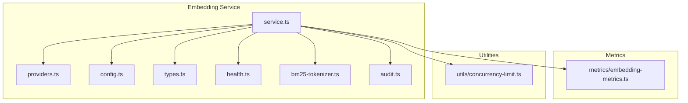
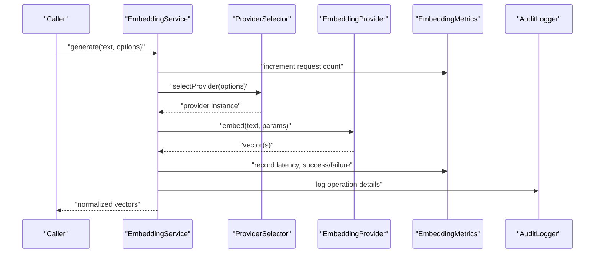
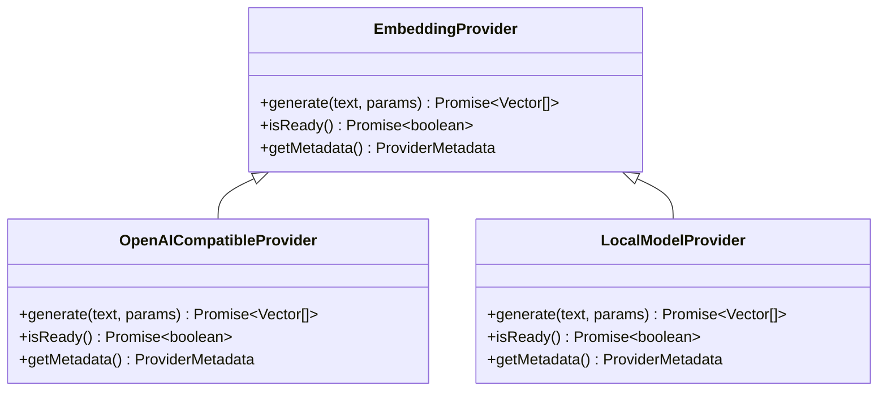
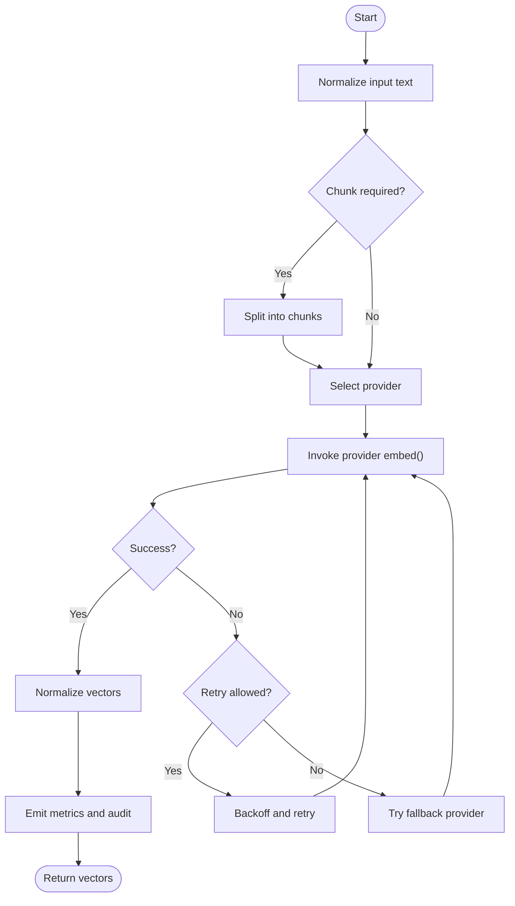
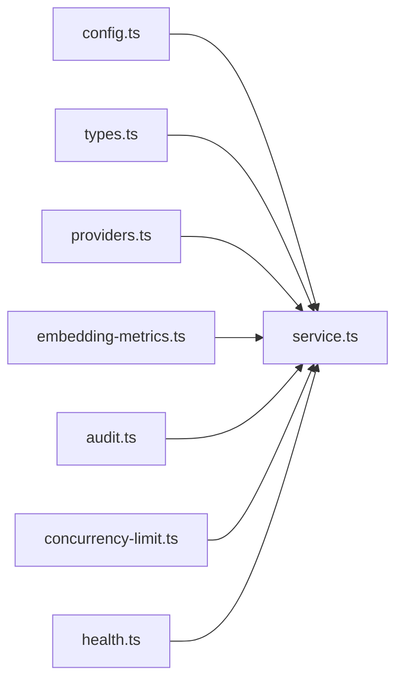

# Embedding Providers and Generation Pipeline

<cite>
**Referenced Files in This Document**
- [src/services/embedding/service.ts](file://src/services/embedding/service.ts)
- [src/services/embedding/providers.ts](file://src/services/embedding/providers.ts)
- [src/services/embedding/config.ts](file://src/services/embedding/config.ts)
- [src/services/embedding/types.ts](file://src/services/embedding/types.ts)
- [src/services/embedding/health.ts](file://src/services/embedding/health.ts)
- [src/services/embedding/bm25-tokenizer.ts](file://src/services/embedding/bm25-tokenizer.ts)
- [src/services/embedding/audit.ts](file://src/services/embedding/audit.ts)
- [src/services/metrics/embedding-metrics.ts](file://src/services/metrics/embedding-metrics.ts)
- [src/utils/concurrency-limit.ts](file://src/utils/concurrency-limit.ts)
- [tests/unit/embedding-rate-limit.test.ts](file://tests/unit/embedding-rate-limit.test.ts)
</cite>

## Table of Contents
1. [Introduction](#introduction)
2. [Project Structure](#project-structure)
3. [Core Components](#core-components)
4. [Architecture Overview](#architecture-overview)
5. [Detailed Component Analysis](#detailed-component-analysis)
6. [Dependency Analysis](#dependency-analysis)
7. [Performance Considerations](#performance-considerations)
8. [Troubleshooting Guide](#troubleshooting-guide)
9. [Conclusion](#conclusion)
10. [Appendices](#appendices)

## Introduction
This document explains the embedding providers abstraction layer and the generation pipeline that converts text inputs into vector embeddings. It covers provider selection logic, supported model types (including OpenAI-compatible and local models), configuration options, fallback mechanisms, rate limiting, error handling, retry strategies, monitoring, and guidance for implementing custom providers. The goal is to help developers integrate, configure, and operate embedding services reliably and efficiently.

## Project Structure
The embedding subsystem is implemented under src/services/embedding with supporting utilities and metrics:
- service.ts: Orchestrates embedding generation, provider selection, retries, and metrics.
- providers.ts: Defines the provider interface and built-in implementations.
- config.ts: Loads and validates embedding configuration from environment or files.
- types.ts: Shared type definitions for requests, responses, and provider contracts.
- health.ts: Health checks for embedding providers.
- bm25-tokenizer.ts: Tokenization utilities used by certain providers or fallbacks.
- audit.ts: Audit logging for embedding operations.
- metrics/embedding-metrics.ts: Prometheus-style metrics for embedding performance and errors.
- utils/concurrency-limit.ts: Concurrency control for embedding calls.
- tests/unit/embedding-rate-limit.test.ts: Unit tests validating rate limiting behavior.

**Diagram sources**
- [src/services/embedding/service.ts](file://src/services/embedding/service.ts)
- [src/services/embedding/providers.ts](file://src/services/embedding/providers.ts)
- [src/services/embedding/config.ts](file://src/services/embedding/config.ts)
- [src/services/embedding/types.ts](file://src/services/embedding/types.ts)
- [src/services/embedding/health.ts](file://src/services/embedding/health.ts)
- [src/services/embedding/bm25-tokenizer.ts](file://src/services/embedding/bm25-tokenizer.ts)
- [src/services/embedding/audit.ts](file://src/services/embedding/audit.ts)
- [src/services/metrics/embedding-metrics.ts](file://src/services/metrics/embedding-metrics.ts)
- [src/utils/concurrency-limit.ts](file://src/utils/concurrency-limit.ts)

**Section sources**
- [src/services/embedding/service.ts](file://src/services/embedding/service.ts)
- [src/services/embedding/providers.ts](file://src/services/embedding/providers.ts)
- [src/services/embedding/config.ts](file://src/services/embedding/config.ts)
- [src/services/embedding/types.ts](file://src/services/embedding/types.ts)
- [src/services/embedding/health.ts](file://src/services/embedding/health.ts)
- [src/services/embedding/bm25-tokenizer.ts](file://src/services/embedding/bm25-tokenizer.ts)
- [src/services/embedding/audit.ts](file://src/services/embedding/audit.ts)
- [src/services/metrics/embedding-metrics.ts](file://src/services/metrics/embedding-metrics.ts)
- [src/utils/concurrency-limit.ts](file://src/utils/concurrency-limit.ts)

## Core Components
- Provider Abstraction Layer: A typed interface defines how any embedding provider must behave, including methods for generating embeddings, checking readiness, and exposing metadata such as model capabilities and limits.
- Built-in Providers: Implementations for OpenAI-compatible APIs and local models are provided, each configured via environment variables and validated at startup.
- Configuration Manager: Centralized loading and validation of provider settings, defaults, and feature flags.
- Generation Service: High-level API that accepts text input, selects a provider based on configuration and availability, applies tokenization if needed, invokes the provider, handles retries and fallbacks, emits metrics, and returns normalized vectors.
- Health Checks: Readiness and liveness probes per provider to support orchestration and auto-recovery.
- Metrics and Audit: Detailed observability for latency, throughput, errors, and usage patterns; optional audit logs for compliance.

Key responsibilities:
- Normalize inputs across providers.
- Enforce concurrency and rate limits.
- Provide deterministic fallback chains.
- Emit structured metrics and audit events.

**Section sources**
- [src/services/embedding/providers.ts](file://src/services/embedding/providers.ts)
- [src/services/embedding/config.ts](file://src/services/embedding/config.ts)
- [src/services/embedding/service.ts](file://src/services/embedding/service.ts)
- [src/services/embedding/types.ts](file://src/services/embedding/types.ts)
- [src/services/embedding/health.ts](file://src/services/embedding/health.ts)
- [src/services/embedding/audit.ts](file://src/services/embedding/audit.ts)
- [src/services/metrics/embedding-metrics.ts](file://src/services/metrics/embedding-metrics.ts)

## Architecture Overview
The embedding pipeline follows a layered architecture:
- Input Normalization: Text preprocessing and chunking.
- Provider Selection: Chooses an active provider based on configuration, health, and load.
- Execution: Calls the selected provider with retry/backoff and concurrency controls.
- Output Normalization: Converts provider-specific responses into consistent vector outputs.
- Observability: Emits metrics and audit logs for every operation.

**Diagram sources**
- [src/services/embedding/service.ts](file://src/services/embedding/service.ts)
- [src/services/embedding/providers.ts](file://src/services/embedding/providers.ts)
- [src/services/metrics/embedding-metrics.ts](file://src/services/metrics/embedding-metrics.ts)
- [src/services/embedding/audit.ts](file://src/services/embedding/audit.ts)

## Detailed Component Analysis

### Provider Abstraction Layer
The provider interface standardizes embedding operations:
- Methods: generate embeddings, check readiness, expose model metadata.
- Contracts: Input/output shapes, error semantics, and capability flags.
- Extensibility: New providers implement the same interface, enabling plug-and-play integration.

**Diagram sources**
- [src/services/embedding/providers.ts](file://src/services/embedding/providers.ts)

**Section sources**
- [src/services/embedding/providers.ts](file://src/services/embedding/providers.ts)
- [src/services/embedding/types.ts](file://src/services/embedding/types.ts)

### Supported Models and Configuration
Supported model categories include:
- OpenAI-compatible REST APIs: Configured via base URL, model name, and authentication tokens.
- Local models: In-process or sidecar endpoints with configurable parameters.
- Fallback providers: Secondary providers activated when primary fails or is unavailable.

Configuration options typically cover:
- Provider selection and priority order.
- Model identifiers and dimensions.
- Authentication credentials and endpoint URLs.
- Rate limits, timeouts, and retry policies.
- Feature toggles for batching and chunking.

Validation ensures required fields are present and compatible before starting the service.

**Section sources**
- [src/services/embedding/config.ts](file://src/services/embedding/config.ts)
- [src/services/embedding/types.ts](file://src/services/embedding/types.ts)

### Generation Workflow
End-to-end flow from text input to vector output:
- Input normalization and optional chunking.
- Provider selection based on configuration and health.
- Invocation with concurrency and rate limiting.
- Retry/backoff on transient failures.
- Response normalization to consistent vector format.
- Emission of metrics and audit logs.

**Diagram sources**
- [src/services/embedding/service.ts](file://src/services/embedding/service.ts)
- [src/services/embedding/providers.ts](file://src/services/embedding/providers.ts)
- [src/services/embedding/bm25-tokenizer.ts](file://src/services/embedding/bm25-tokenizer.ts)
- [src/services/metrics/embedding-metrics.ts](file://src/services/metrics/embedding-metrics.ts)
- [src/services/embedding/audit.ts](file://src/services/embedding/audit.ts)

**Section sources**
- [src/services/embedding/service.ts](file://src/services/embedding/service.ts)
- [src/services/embedding/bm25-tokenizer.ts](file://src/services/embedding/bm25-tokenizer.ts)

### Provider Selection Logic and Fallback Mechanisms
Selection strategy:
- Primary provider chosen by configuration priority.
- Health checks gate availability; unhealthy providers are skipped.
- Load-aware routing may prefer less busy providers.

Fallback chain:
- On failure or timeout, attempt next configured provider.
- Respect per-provider retry limits and global backoff caps.
- Record detailed reasons for switching to aid diagnostics.

**Section sources**
- [src/services/embedding/service.ts](file://src/services/embedding/service.ts)
- [src/services/embedding/health.ts](file://src/services/embedding/health.ts)

### Rate Limiting and Concurrency Control
Rate limiting:
- Per-provider quotas enforced via sliding windows or token buckets.
- Global limits cap total concurrent embedding requests.
- Excess requests are queued or rejected with appropriate status codes.

Concurrency control:
- Limits parallelism to protect downstream services.
- Integrates with retry/backoff to avoid thundering herds.

**Section sources**
- [src/utils/concurrency-limit.ts](file://src/utils/concurrency-limit.ts)
- [tests/unit/embedding-rate-limit.test.ts](file://tests/unit/embedding-rate-limit.test.ts)

### Error Handling and Retry Strategies
Error taxonomy:
- Transient errors (network timeouts, 429 Too Many Requests, 5xx): trigger retries with exponential backoff.
- Permanent errors (invalid credentials, unsupported model): fail fast without retries.
- Validation errors: return immediately with actionable messages.

Strategies:
- Exponential backoff with jitter.
- Circuit breaker to prevent cascading failures.
- Fallback provider invocation after exhaustion of retries.

**Section sources**
- [src/services/embedding/service.ts](file://src/services/embedding/service.ts)
- [src/services/embedding/providers.ts](file://src/services/embedding/providers.ts)

### Monitoring and Observability
Metrics:
- Request counts, success rates, latency percentiles, and error breakdowns by provider and error code.
- Concurrency utilization and queue lengths.

Audit:
- Structured logs capturing provider, model, input size, duration, and outcome.

Health:
- Readiness probes per provider to signal operational status to orchestrators.

**Section sources**
- [src/services/metrics/embedding-metrics.ts](file://src/services/metrics/embedding-metrics.ts)
- [src/services/embedding/audit.ts](file://src/services/embedding/audit.ts)
- [src/services/embedding/health.ts](file://src/services/embedding/health.ts)

### Custom Provider Implementation
Steps to add a new provider:
- Implement the provider interface with generate, isReady, and getMetadata.
- Configure authentication and endpoint details via configuration.
- Register the provider in the provider registry and set selection priority.
- Add unit tests covering normal paths, errors, and edge cases.
- Validate health checks and ensure metrics are emitted.

Best practices:
- Normalize inputs and outputs to match shared types.
- Handle partial failures gracefully and report accurate metrics.
- Keep provider stateless where possible to improve scalability.

**Section sources**
- [src/services/embedding/providers.ts](file://src/services/embedding/providers.ts)
- [src/services/embedding/config.ts](file://src/services/embedding/config.ts)
- [src/services/embedding/types.ts](file://src/services/embedding/types.ts)

### Performance Optimization
Recommendations:
- Batch requests when supported by the provider to reduce overhead.
- Tune chunk sizes to balance accuracy and throughput.
- Use connection pooling and HTTP keep-alive for remote providers.
- Enable compression for large payloads if supported.
- Monitor and adjust concurrency limits based on provider capacity.

**Section sources**
- [src/services/embedding/service.ts](file://src/services/embedding/service.ts)
- [src/utils/concurrency-limit.ts](file://src/utils/concurrency-limit.ts)

## Dependency Analysis
The embedding service depends on configuration, provider implementations, metrics, audit, and concurrency utilities. Health checks provide external signals for orchestration.

**Diagram sources**
- [src/services/embedding/service.ts](file://src/services/embedding/service.ts)
- [src/services/embedding/config.ts](file://src/services/embedding/config.ts)
- [src/services/embedding/types.ts](file://src/services/embedding/types.ts)
- [src/services/embedding/providers.ts](file://src/services/embedding/providers.ts)
- [src/services/metrics/embedding-metrics.ts](file://src/services/metrics/embedding-metrics.ts)
- [src/services/embedding/audit.ts](file://src/services/embedding/audit.ts)
- [src/utils/concurrency-limit.ts](file://src/utils/concurrency-limit.ts)
- [src/services/embedding/health.ts](file://src/services/embedding/health.ts)

**Section sources**
- [src/services/embedding/service.ts](file://src/services/embedding/service.ts)
- [src/services/embedding/config.ts](file://src/services/embedding/config.ts)
- [src/services/embedding/providers.ts](file://src/services/embedding/providers.ts)
- [src/services/metrics/embedding-metrics.ts](file://src/services/metrics/embedding-metrics.ts)
- [src/services/embedding/audit.ts](file://src/services/embedding/audit.ts)
- [src/utils/concurrency-limit.ts](file://src/utils/concurrency-limit.ts)
- [src/services/embedding/health.ts](file://src/services/embedding/health.ts)

## Performance Considerations
- Throughput vs. Latency: Increase batch sizes cautiously; monitor p95/p99 latencies.
- Memory Usage: Avoid loading entire corpora into memory; stream or paginate when possible.
- Network Overhead: Prefer persistent connections and minimize round trips.
- Scaling: Horizontal scaling benefits from stateless providers and centralized rate limiters.

[No sources needed since this section provides general guidance]

## Troubleshooting Guide
Common issues and resolutions:
- Provider Unavailable: Check health endpoints and configuration; verify network reachability and credentials.
- Rate Limit Errors: Reduce concurrency, increase backoff, or upgrade provider tier.
- Invalid Model Dimensions: Ensure model identifier matches expected vector size; reconfigure accordingly.
- High Error Rates: Inspect metrics and audit logs for error codes and patterns; consider fallback activation.

Diagnostic steps:
- Review embedding metrics for spikes in latency or errors.
- Correlate audit logs with request IDs to trace failures.
- Validate configuration changes with health checks before deployment.

**Section sources**
- [src/services/metrics/embedding-metrics.ts](file://src/services/metrics/embedding-metrics.ts)
- [src/services/embedding/audit.ts](file://src/services/embedding/audit.ts)
- [src/services/embedding/health.ts](file://src/services/embedding/health.ts)

## Conclusion
The embedding subsystem provides a robust, extensible framework for generating vectors across multiple providers. Its clear abstraction layer, comprehensive configuration, resilient retry and fallback mechanisms, and rich observability enable reliable operation in diverse environments. By following the guidance for customization and performance tuning, teams can integrate new providers seamlessly and maintain high-quality embedding services.

[No sources needed since this section summarizes without analyzing specific files]

## Appendices

### Example Scenarios
- Switching Providers: Update configuration priority and validate health; observe metrics during transition.
- Adding a Local Model: Implement provider interface, register it, and set lower priority than cloud providers.
- Tuning Rate Limits: Adjust concurrency and per-provider quotas based on observed utilization and error rates.

[No sources needed since this section doesn't analyze specific files]