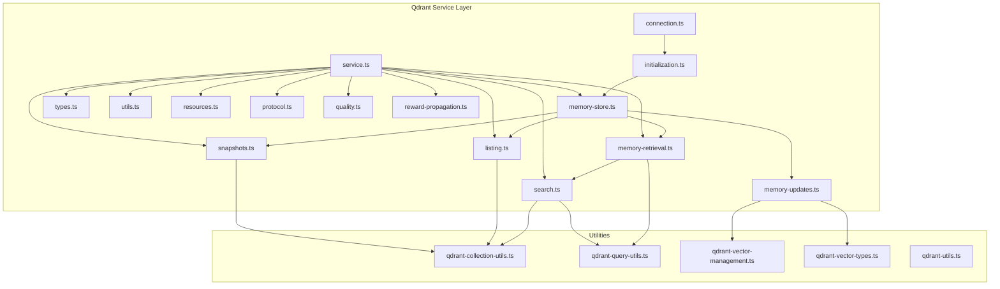
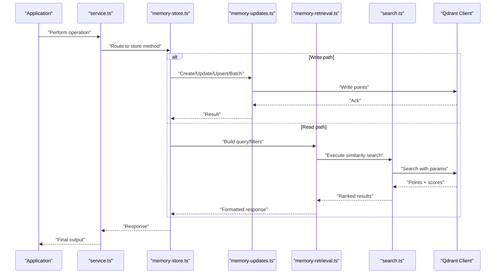
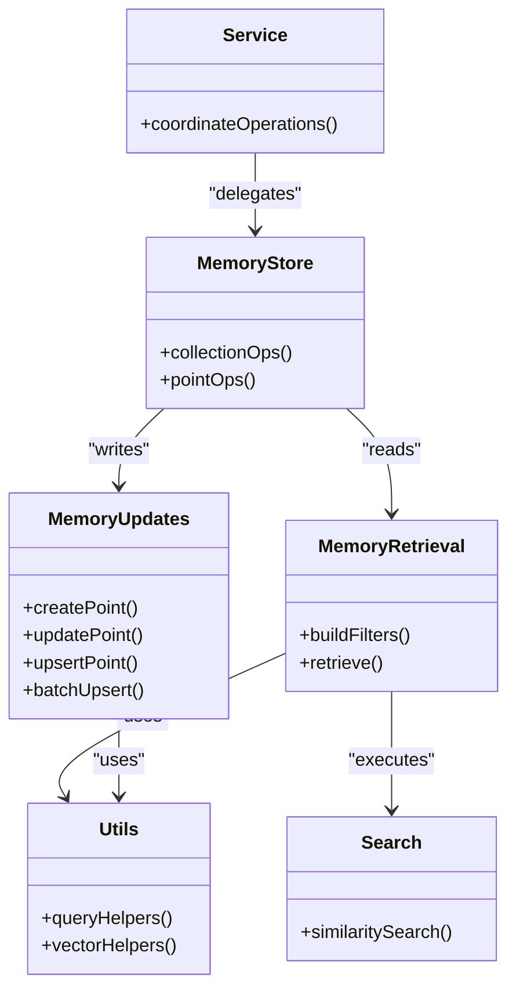
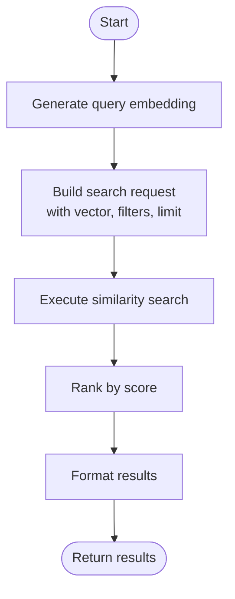
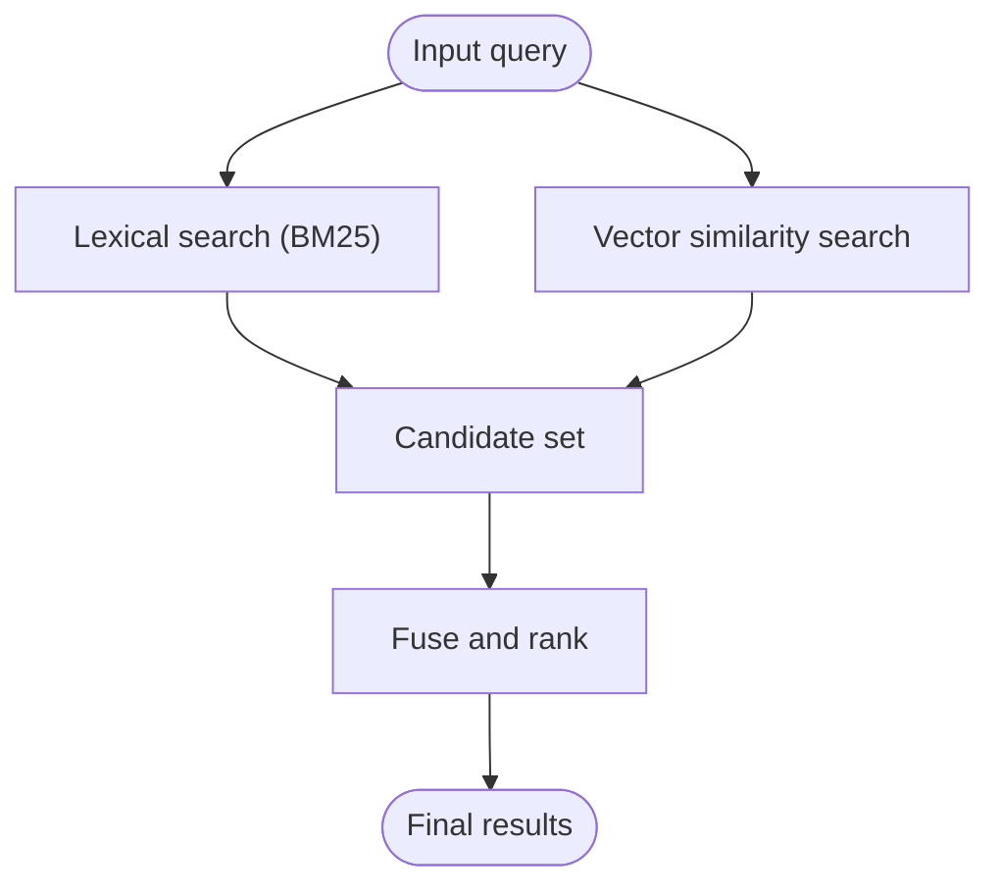

# Qdrant Vector Operations and Search

<cite>
**Referenced Files in This Document**
- [src/services/qdrant/connection.ts](file://src/services/qdrant/connection.ts)
- [src/services/qdrant/initialization.ts](file://src/services/qdrant/initialization.ts)
- [src/services/qdrant/memory-store.ts](file://src/services/qdrant/memory-store.ts)
- [src/services/qdrant/memory-updates.ts](file://src/services/qdrant/memory-updates.ts)
- [src/services/qdrant/memory-retrieval.ts](file://src/services/qdrant/memory-retrieval.ts)
- [src/services/qdrant/search.ts](file://src/services/qdrant/search.ts)
- [src/services/qdrant/listing.ts](file://src/services/qdrant/listing.ts)
- [src/services/qdrant/snapshots.ts](file://src/services/qdrant/snapshots.ts)
- [src/services/qdrant/service.ts](file://src/services/qdrant/service.ts)
- [src/services/qdrant/types.ts](file://src/services/qdrant/types.ts)
- [src/services/qdrant/utils.ts](file://src/services/qdrant/utils.ts)
- [src/services/qdrant/resources.ts](file://src/services/qdrant/resources.ts)
- [src/services/qdrant/protocol.ts](file://src/services/qdrant/protocol.ts)
- [src/services/qdrant/quality.ts](file://src/services/qdrant/quality.ts)
- [src/services/qdrant/reward-propagation.ts](file://src/services/qdrant/reward-propagation.ts)
- [src/utils/qdrant-collection-utils.ts](file://src/utils/qdrant-collection-utils.ts)
- [src/utils/qdrant-query-utils.ts](file://src/utils/qdrant-query-utils.ts)
- [src/utils/qdrant-vector-management.ts](file://src/utils/qdrant-vector-management.ts)
- [src/utils/qdrant-vector-types.ts](file://src/utils/qdrant-vector-types.ts)
- [src/utils/qdrant-utils.ts](file://src/utils/qdrant-utils.ts)
- [src/embed-docs/mem/bulk-insert-adapters-via-cli.md](file://src/embed-docs/mem/bulk-insert-adapters-via-cli.md)
- [scripts/deploy-raw-qdrant-search.mjs](file://scripts/deploy-raw-qdrant-search.mjs)
</cite>

## Table of Contents
1. [Introduction](#introduction)
2. [Project Structure](#project-structure)
3. [Core Components](#core-components)
4. [Architecture Overview](#architecture-overview)
5. [Detailed Component Analysis](#detailed-component-analysis)
6. [Dependency Analysis](#dependency-analysis)
7. [Performance Considerations](#performance-considerations)
8. [Troubleshooting Guide](#troubleshooting-guide)
9. [Conclusion](#conclusion)
10. [Appendices](#appendices)

## Introduction
This document explains how the application integrates with Qdrant for vector operations and search. It covers collection management, point lifecycle (create, update, delete), batch processing, indexing configuration, similarity search algorithms, filtering mechanisms, scoring and ranking, pagination, result formatting, query optimization techniques, hybrid search considerations, and performance tuning. The goal is to provide both a high-level understanding and actionable guidance for developers working with vector memory features.

## Project Structure
The Qdrant integration is implemented under services/qdrant with supporting utilities under utils. Key responsibilities:
- Connection and initialization to Qdrant
- Collection setup and lifecycle
- Point write/update/delete and batch operations
- Similarity search and retrieval workflows
- Listing, snapshots, metrics, and quality checks
- Utilities for queries, vectors, and collections

**Diagram sources**
- [src/services/qdrant/connection.ts](file://src/services/qdrant/connection.ts)
- [src/services/qdrant/initialization.ts](file://src/services/qdrant/initialization.ts)
- [src/services/qdrant/memory-store.ts](file://src/services/qdrant/memory-store.ts)
- [src/services/qdrant/memory-updates.ts](file://src/services/qdrant/memory-updates.ts)
- [src/services/qdrant/memory-retrieval.ts](file://src/services/qdrant/memory-retrieval.ts)
- [src/services/qdrant/search.ts](file://src/services/qdrant/search.ts)
- [src/services/qdrant/listing.ts](file://src/services/qdrant/listing.ts)
- [src/services/qdrant/snapshots.ts](file://src/services/qdrant/snapshots.ts)
- [src/services/qdrant/service.ts](file://src/services/qdrant/service.ts)
- [src/services/qdrant/types.ts](file://src/services/qdrant/types.ts)
- [src/services/qdrant/utils.ts](file://src/services/qdrant/utils.ts)
- [src/services/qdrant/resources.ts](file://src/services/qdrant/resources.ts)
- [src/services/qdrant/protocol.ts](file://src/services/qdrant/protocol.ts)
- [src/services/qdrant/quality.ts](file://src/services/qdrant/quality.ts)
- [src/services/qdrant/reward-propagation.ts](file://src/services/qdrant/reward-propagation.ts)
- [src/utils/qdrant-collection-utils.ts](file://src/utils/qdrant-collection-utils.ts)
- [src/utils/qdrant-query-utils.ts](file://src/utils/qdrant-query-utils.ts)
- [src/utils/qdrant-vector-management.ts](file://src/utils/qdrant-vector-management.ts)
- [src/utils/qdrant-vector-types.ts](file://src/utils/qdrant-vector-types.ts)
- [src/utils/qdrant-utils.ts](file://src/utils/qdrant-utils.ts)

**Section sources**
- [src/services/qdrant/service.ts](file://src/services/qdrant/service.ts)
- [src/services/qdrant/connection.ts](file://src/services/qdrant/connection.ts)
- [src/services/qdrant/initialization.ts](file://src/services/qdrant/initialization.ts)
- [src/services/qdrant/memory-store.ts](file://src/services/qdrant/memory-store.ts)
- [src/services/qdrant/memory-updates.ts](file://src/services/qdrant/memory-updates.ts)
- [src/services/qdrant/memory-retrieval.ts](file://src/services/qdrant/memory-retrieval.ts)
- [src/services/qdrant/search.ts](file://src/services/qdrant/search.ts)
- [src/services/qdrant/listing.ts](file://src/services/qdrant/listing.ts)
- [src/services/qdrant/snapshots.ts](file://src/services/qdrant/snapshots.ts)
- [src/utils/qdrant-collection-utils.ts](file://src/utils/qdrant-collection-utils.ts)
- [src/utils/qdrant-query-utils.ts](file://src/utils/qdrant-query-utils.ts)
- [src/utils/qdrant-vector-management.ts](file://src/utils/qdrant-vector-management.ts)
- [src/utils/qdrant-vector-types.ts](file://src/utils/qdrant-vector-types.ts)
- [src/utils/qdrant-utils.ts](file://src/utils/qdrant-utils.ts)

## Core Components
- Connection and Initialization: Establishes client connection to Qdrant and ensures required collections exist with appropriate vector configurations.
- Memory Store: Central entry point for collection and point operations; orchestrates reads/writes and delegates to specialized modules.
- Memory Updates: Implements create, update, upsert, and batch insert/update/delete flows.
- Memory Retrieval and Search: Builds filters, executes similarity searches, applies scoring/ranking, and formats results.
- Listing and Snapshots: Enumerates collections and manages snapshot operations for backup/restore.
- Utilities: Provide helpers for building Qdrant filters, payloads, vector shapes, and collection naming conventions.

Key responsibilities and interactions are mapped in the architecture diagram above.

**Section sources**
- [src/services/qdrant/connection.ts](file://src/services/qdrant/connection.ts)
- [src/services/qdrant/initialization.ts](file://src/services/qdrant/initialization.ts)
- [src/services/qdrant/memory-store.ts](file://src/services/qdrant/memory-store.ts)
- [src/services/qdrant/memory-updates.ts](file://src/services/qdrant/memory-updates.ts)
- [src/services/qdrant/memory-retrieval.ts](file://src/services/qdrant/memory-retrieval.ts)
- [src/services/qdrant/search.ts](file://src/services/qdrant/search.ts)
- [src/services/qdrant/listing.ts](file://src/services/qdrant/listing.ts)
- [src/services/qdrant/snapshots.ts](file://src/services/qdrant/snapshots.ts)
- [src/utils/qdrant-collection-utils.ts](file://src/utils/qdrant-collection-utils.ts)
- [src/utils/qdrant-query-utils.ts](file://src/utils/qdrant-query-utils.ts)
- [src/utils/qdrant-vector-management.ts](file://src/utils/qdrant-vector-management.ts)
- [src/utils/qdrant-vector-types.ts](file://src/utils/qdrant-vector-types.ts)
- [src/utils/qdrant-utils.ts](file://src/utils/qdrant-utils.ts)

## Architecture Overview
The system uses a layered approach:
- Application layer calls into service.ts which coordinates operations.
- memory-store.ts provides a unified API surface for collection and point operations.
- memory-updates.ts handles writes and batching.
- memory-retrieval.ts and search.ts handle read paths, including filter construction and similarity search.
- listing.ts and snapshots.ts manage metadata and backups.
- utils support consistent payload shaping, filter composition, and vector handling.

**Diagram sources**
- [src/services/qdrant/service.ts](file://src/services/qdrant/service.ts)
- [src/services/qdrant/memory-store.ts](file://src/services/qdrant/memory-store.ts)
- [src/services/qdrant/memory-updates.ts](file://src/services/qdrant/memory-updates.ts)
- [src/services/qdrant/memory-retrieval.ts](file://src/services/qdrant/memory-retrieval.ts)
- [src/services/qdrant/search.ts](file://src/services/qdrant/search.ts)

## Detailed Component Analysis

### Collection Management
Responsibilities:
- Ensure collections exist with correct vector size and distance metric.
- Create or migrate collections based on configuration.
- Manage resources and health checks tied to collections.

Key files:
- [src/services/qdrant/initialization.ts](file://src/services/qdrant/initialization.ts)
- [src/services/qdrant/resources.ts](file://src/services/qdrant/resources.ts)
- [src/utils/qdrant-collection-utils.ts](file://src/utils/qdrant-collection-utils.ts)

Operational notes:
- Collections are typically named per space or domain.
- Vector parameters include dimensionality and distance metric selection.
- Health and readiness checks validate connectivity and collection presence.

**Section sources**
- [src/services/qdrant/initialization.ts](file://src/services/qdrant/initialization.ts)
- [src/services/qdrant/resources.ts](file://src/services/qdrant/resources.ts)
- [src/utils/qdrant-collection-utils.ts](file://src/utils/qdrant-collection-utils.ts)

### Point Operations (Create, Update, Delete, Upsert)
Responsibilities:
- Create new points with vectors and payloads.
- Update existing points by ID.
- Upsert to insert or replace atomically.
- Batch operations for throughput.

Key files:
- [src/services/qdrant/memory-updates.ts](file://src/services/qdrant/memory-updates.ts)
- [src/services/qdrant/memory-store.ts](file://src/services/qdrant/memory-store.ts)
- [src/utils/qdrant-vector-management.ts](file://src/utils/qdrant-vector-management.ts)
- [src/utils/qdrant-vector-types.ts](file://src/utils/qdrant-vector-types.ts)

Batch processing:
- Use bulk upsert/write APIs to minimize round-trips.
- Split large batches to respect server-side limits and avoid timeouts.
- Prefer idempotent upserts when reprocessing data.

Error handling:
- Validate vector dimensions before submission.
- Handle partial failures in batch responses and retry selectively.

**Section sources**
- [src/services/qdrant/memory-updates.ts](file://src/services/qdrant/memory-updates.ts)
- [src/services/qdrant/memory-store.ts](file://src/services/qdrant/memory-store.ts)
- [src/utils/qdrant-vector-management.ts](file://src/utils/qdrant-vector-management.ts)
- [src/utils/qdrant-vector-types.ts](file://src/utils/qdrant-vector-types.ts)

### Filtering Mechanisms
Responsibilities:
- Build structured filters from application conditions.
- Combine multiple predicates (AND/OR).
- Support range, match, and nested payload filters.

Key files:
- [src/utils/qdrant-query-utils.ts](file://src/utils/qdrant-query-utils.ts)
- [src/services/qdrant/memory-retrieval.ts](file://src/services/qdrant/memory-retrieval.ts)

Best practices:
- Keep filter expressions minimal to reduce overhead.
- Prefer exact matches and bounded ranges where possible.
- Avoid deeply nested structures unless necessary.

**Section sources**
- [src/utils/qdrant-query-utils.ts](file://src/utils/qdrant-query-utils.ts)
- [src/services/qdrant/memory-retrieval.ts](file://src/services/qdrant/memory-retrieval.ts)

### Similarity Search Algorithms and Scoring
Responsibilities:
- Execute vector similarity search using configured distance metric.
- Apply optional pre-filtering via Qdrant filters.
- Return top-k results with scores.

Key files:
- [src/services/qdrant/search.ts](file://src/services/qdrant/search.ts)
- [src/services/qdrant/memory-retrieval.ts](file://src/services/qdrant/memory-retrieval.ts)

Scoring and ranking:
- Scores reflect proximity according to the chosen distance metric.
- Results are ranked by score descending by default.
- Optional post-processing can adjust scores based on business rules.

Pagination:
- Use limit and offset parameters to paginate through results.
- For stable ordering across pages, consider deterministic tie-breakers (e.g., point ID).

**Section sources**
- [src/services/qdrant/search.ts](file://src/services/qdrant/search.ts)
- [src/services/qdrant/memory-retrieval.ts](file://src/services/qdrant/memory-retrieval.ts)

### Result Formatting and Output
Responsibilities:
- Normalize Qdrant responses into application-specific result objects.
- Include metadata such as scores, IDs, and payload fields.
- Support selective field projection to reduce payload size.

Key files:
- [src/services/qdrant/memory-retrieval.ts](file://src/services/qdrant/memory-retrieval.ts)
- [src/services/qdrant/types.ts](file://src/services/qdrant/types.ts)

Guidance:
- Define clear schemas for returned results.
- Exclude heavy payload fields unless explicitly requested.

**Section sources**
- [src/services/qdrant/memory-retrieval.ts](file://src/services/qdrant/memory-retrieval.ts)
- [src/services/qdrant/types.ts](file://src/services/qdrant/types.ts)

### Listing and Snapshots
Responsibilities:
- List available collections and their status.
- Create and restore snapshots for backup and migration.

Key files:
- [src/services/qdrant/listing.ts](file://src/services/qdrant/listing.ts)
- [src/services/qdrant/snapshots.ts](file://src/services/qdrant/snapshots.ts)

Use cases:
- Operational dashboards showing collection health.
- Disaster recovery and cross-environment migrations.

**Section sources**
- [src/services/qdrant/listing.ts](file://src/services/qdrant/listing.ts)
- [src/services/qdrant/snapshots.ts](file://src/services/qdrant/snapshots.ts)

### Quality, Protocol, and Reward Propagation
Responsibilities:
- Enforce quality checks on stored content.
- Align with protocol definitions for interoperability.
- Propagate reward signals to influence future retrieval or ranking.

Key files:
- [src/services/qdrant/quality.ts](file://src/services/qdrant/quality.ts)
- [src/services/qdrant/protocol.ts](file://src/services/qdrant/protocol.ts)
- [src/services/qdrant/reward-propagation.ts](file://src/services/qdrant/reward-propagation.ts)

Integration:
- Quality gates may block low-quality embeddings from being indexed.
- Reward propagation can adjust metadata used in filtering or scoring.

**Section sources**
- [src/services/qdrant/quality.ts](file://src/services/qdrant/quality.ts)
- [src/services/qdrant/protocol.ts](file://src/services/qdrant/protocol.ts)
- [src/services/qdrant/reward-propagation.ts](file://src/services/qdrant/reward-propagation.ts)

### Utility Modules
Responsibilities:
- Common helpers for Qdrant interactions, vector shape validation, and collection naming.

Key files:
- [src/utils/qdrant-utils.ts](file://src/utils/qdrant-utils.ts)
- [src/utils/qdrant-collection-utils.ts](file://src/utils/qdrant-collection-utils.ts)
- [src/utils/qdrant-query-utils.ts](file://src/utils/qdrant-query-utils.ts)
- [src/utils/qdrant-vector-management.ts](file://src/utils/qdrant-vector-management.ts)
- [src/utils/qdrant-vector-types.ts](file://src/utils/qdrant-vector-types.ts)

**Section sources**
- [src/utils/qdrant-utils.ts](file://src/utils/qdrant-utils.ts)
- [src/utils/qdrant-collection-utils.ts](file://src/utils/qdrant-collection-utils.ts)
- [src/utils/qdrant-query-utils.ts](file://src/utils/qdrant-query-utils.ts)
- [src/utils/qdrant-vector-management.ts](file://src/utils/qdrant-vector-management.ts)
- [src/utils/qdrant-vector-types.ts](file://src/utils/qdrant-vector-types.ts)

## Dependency Analysis
High-level dependencies among core components:

**Diagram sources**
- [src/services/qdrant/service.ts](file://src/services/qdrant/service.ts)
- [src/services/qdrant/memory-store.ts](file://src/services/qdrant/memory-store.ts)
- [src/services/qdrant/memory-updates.ts](file://src/services/qdrant/memory-updates.ts)
- [src/services/qdrant/memory-retrieval.ts](file://src/services/qdrant/memory-retrieval.ts)
- [src/services/qdrant/search.ts](file://src/services/qdrant/search.ts)
- [src/utils/qdrant-query-utils.ts](file://src/utils/qdrant-query-utils.ts)
- [src/utils/qdrant-vector-management.ts](file://src/utils/qdrant-vector-management.ts)

**Section sources**
- [src/services/qdrant/service.ts](file://src/services/qdrant/service.ts)
- [src/services/qdrant/memory-store.ts](file://src/services/qdrant/memory-store.ts)
- [src/services/qdrant/memory-updates.ts](file://src/services/qdrant/memory-updates.ts)
- [src/services/qdrant/memory-retrieval.ts](file://src/services/qdrant/memory-retrieval.ts)
- [src/services/qdrant/search.ts](file://src/services/qdrant/search.ts)
- [src/utils/qdrant-query-utils.ts](file://src/utils/qdrant-query-utils.ts)
- [src/utils/qdrant-vector-management.ts](file://src/utils/qdrant-vector-management.ts)

## Performance Considerations
- Indexing and vector configuration:
  - Choose an appropriate distance metric for your use case.
  - Ensure vector dimensions match embedding model outputs.
- Query optimization:
  - Narrow filters early to reduce candidate set size.
  - Limit k (top-k) to only what is needed.
  - Use deterministic tie-breakers for stable pagination.
- Batching:
  - Group writes into batches sized to balance throughput and latency.
  - Retry failed items individually after partial failures.
- Payload design:
  - Keep payloads lean; project only required fields on read.
- Monitoring:
  - Track latency and error rates for search and write paths.
  - Observe Qdrant resource utilization during peak loads.

[No sources needed since this section provides general guidance]

## Troubleshooting Guide
Common issues and diagnostics:
- Connection failures:
  - Verify Qdrant endpoint and network reachability.
  - Check authentication and TLS settings if applicable.
- Collection mismatch:
  - Confirm collection exists and vector parameters match expected dimensions and metric.
- Filter errors:
  - Validate payload schema and key names used in filters.
  - Simplify complex filters to isolate problematic predicates.
- Partial batch failures:
  - Inspect per-item responses and retry failed entries.
  - Reduce batch size if encountering timeouts or memory pressure.
- Snapshot operations:
  - Ensure sufficient disk space and permissions for snapshot creation/restoration.

Relevant implementation areas:
- [src/services/qdrant/connection.ts](file://src/services/qdrant/connection.ts)
- [src/services/qdrant/initialization.ts](file://src/services/qdrant/initialization.ts)
- [src/services/qdrant/memory-updates.ts](file://src/services/qdrant/memory-updates.ts)
- [src/services/qdrant/memory-retrieval.ts](file://src/services/qdrant/memory-retrieval.ts)
- [src/services/qdrant/snapshots.ts](file://src/services/qdrant/snapshots.ts)

**Section sources**
- [src/services/qdrant/connection.ts](file://src/services/qdrant/connection.ts)
- [src/services/qdrant/initialization.ts](file://src/services/qdrant/initialization.ts)
- [src/services/qdrant/memory-updates.ts](file://src/services/qdrant/memory-updates.ts)
- [src/services/qdrant/memory-retrieval.ts](file://src/services/qdrant/memory-retrieval.ts)
- [src/services/qdrant/snapshots.ts](file://src/services/qdrant/snapshots.ts)

## Conclusion
The Qdrant integration provides a robust foundation for vector storage and similarity search within the application. By leveraging well-structured services and utilities, it supports efficient indexing, flexible filtering, scalable batch operations, and clear result formatting. Following the recommended practices for query optimization, payload design, and monitoring will help maintain high performance and reliability.

[No sources needed since this section summarizes without analyzing specific files]

## Appendices

### Semantic Search Implementation Example
Conceptual steps:
- Generate an embedding vector for the user query.
- Call similarity search with the vector, optional filters, and desired top-k.
- Format and return results with scores and relevant payload fields.

[No sources needed since this diagram shows conceptual workflow, not actual code structure]

### Hybrid Search with BM25
Conceptual approach:
- Run a lexical search (BM25) over text fields to produce candidate IDs.
- Optionally run a vector similarity search to refine relevance.
- Fuse results using a weighted combination or recency/reciprocal rank fusion.

[No sources needed since this diagram shows conceptual workflow, not actual code structure]

### Search Parameter Configuration
Recommended parameters:
- Vector: the query embedding.
- Filter: structured conditions to constrain search scope.
- Limit: number of results to return.
- Offset: pagination offset.
- Score threshold: minimum similarity score to include.
- With payload: whether to include full payload or selected fields.

Configuration tips:
- Tune limit and offset for UI pagination needs.
- Use filters to enforce tenant or space scoping.
- Adjust thresholds to balance precision and recall.

[No sources needed since this section provides general guidance]

### Bulk Insert Adapters via CLI
Reference documentation for bulk insertion workflows and best practices:
- [src/embed-docs/mem/bulk-insert-adapters-via-cli.md](file://src/embed-docs/mem/bulk-insert-adapters-via-cli.md)

**Section sources**
- [src/embed-docs/mem/bulk-insert-adapters-via-cli.md](file://src/embed-docs/mem/bulk-insert-adapters-via-cli.md)

### Raw Qdrant Search Script
Example script demonstrating direct interaction with Qdrant for search tasks:
- [scripts/deploy-raw-qdrant-search.mjs](file://scripts/deploy-raw-qdrant-search.mjs)

**Section sources**
- [scripts/deploy-raw-qdrant-search.mjs](file://scripts/deploy-raw-qdrant-search.mjs)