# Vector Embeddings and Qdrant Integration

<cite>
**Referenced Files in This Document**
- [src/services/embedding/service.ts](file://src/services/embedding/service.ts)
- [src/services/embedding/providers.ts](file://src/services/embedding/providers.ts)
- [src/services/embedding/config.ts](file://src/services/embedding/config.ts)
- [src/services/embedding/types.ts](file://src/services/embedding/types.ts)
- [src/services/qdrant/connection.ts](file://src/services/qdrant/connection.ts)
- [src/services/qdrant/initialization.ts](file://src/services/qdrant/initialization.ts)
- [src/services/qdrant/memory-store.ts](file://src/services/qdrant/memory-store.ts)
- [src/services/qdrant/search.ts](file://src/services/qdrant/search.ts)
- [src/services/qdrant/memory-retrieval.ts](file://src/services/qdrant/memory-retrieval.ts)
- [src/services/qdrant/utils.ts](file://src/services/qdrant/utils.ts)
- [src/services/qdrant/protocol.ts](file://src/services/qdrant/protocol.ts)
- [src/services/qdrant/snapshots.ts](file://src/services/qdrant/snapshots.ts)
- [src/services/qdrant/listing.ts](file://src/services/qdrant/listing.ts)
- [src/services/qdrant/resources.ts](file://src/services/qdrant/resources.ts)
- [src/services/qdrant/reward-propagation.ts](file://src/services/qdrant/reward-propagation.ts)
- [src/services/qdrant/quality.ts](file://src/services/qdrant/quality.ts)
- [src/utils/qdrant-collection-utils.ts](file://src/utils/qdrant-collection-utils.ts)
- [src/utils/qdrant-query-utils.ts](file://src/utils/qdrant-query-utils.ts)
- [src/utils/qdrant-vector-management.ts](file://src/utils/qdrant-vector-management.ts)
- [src/utils/qdrant-vector-types.ts](file://src/utils/qdrant-vector-types.ts)
- [src/utils/qdrant-utils.ts](file://src/utils/qdrant-utils.ts)
- [src/services/metrics/embedding-metrics.ts](file://src/services/metrics/embedding-metrics.ts)
- [src/services/metrics/qdrant-metrics.ts](file://src/services/metrics/qdrant-metrics.ts)
- [scripts/deploy-run-env.sh](file://scripts/deploy-run-env.sh)
- [scripts/deploy-raw-qdrant-search.mjs](file://scripts/deploy-raw-qdrant-search.mjs)
</cite>

## Table of Contents
1. [Introduction](#introduction)
2. [Project Structure](#project-structure)
3. [Core Components](#core-components)
4. [Architecture Overview](#architecture-overview)
5. [Detailed Component Analysis](#detailed-component-analysis)
6. [Dependency Analysis](#dependency-analysis)
7. [Performance Considerations](#performance-considerations)
8. [Troubleshooting Guide](#troubleshooting-guide)
9. [Conclusion](#conclusion)
10. [Appendices](#appendices)

## Introduction
This document explains the vector embeddings pipeline and its integration with Qdrant for storage and retrieval. It covers embedding generation, provider abstraction, vector indexing, similarity search, filtering, batch operations, client configuration, connection management, collection setup, model selection, dimensionality considerations, performance tuning, error handling, retry logic, and monitoring. The goal is to provide both a high-level understanding and actionable guidance for developers working with embeddings and Qdrant in this codebase.

## Project Structure
The embedding and Qdrant functionality is organized into focused modules:
- Embedding service: orchestrates embedding generation and provider selection
- Qdrant service: manages connections, collections, indexing, search, snapshots, and utilities
- Utilities: shared helpers for collections, queries, vectors, and general Qdrant operations
- Metrics: observability for embedding and Qdrant operations
- Scripts: environment setup and raw Qdrant search examples

```mermaid
graph TB
subgraph "Embedding Service"
EService["embedding/service.ts"]
EProviders["embedding/providers.ts"]
EConfig["embedding/config.ts"]
ETypes["embedding/types.ts"]
end
subgraph "Qdrant Service"
QConn["qdrant/connection.ts"]
QInit["qdrant/initialization.ts"]
QStore["qdrant/memory-store.ts"]
QSearch["qdrant/search.ts"]
QRetrieval["qdrant/memory-retrieval.ts"]
QUtils["qdrant/utils.ts"]
QProtocol["qdrant/protocol.ts"]
QSnapshots["qdrant/snapshots.ts"]
QListing["qdrant/listing.ts"]
QResources["qdrant/resources.ts"]
QReward["qdrant/reward-propagation.ts"]
QQuality["qdrant/quality.ts"]
end
subgraph "Utilities"
UColl["utils/qdrant-collection-utils.ts"]
UQuery["utils/qdrant-query-utils.ts"]
UVect["utils/qdrant-vector-management.ts"]
UVTypes["utils/qdrant-vector-types.ts"]
UQ["utils/qdrant-utils.ts"]
end
subgraph "Metrics"
MEmb["metrics/embedding-metrics.ts"]
MQ["metrics/qdrant-metrics.ts"]
end
EService --> EProviders
EService --> EConfig
EService --> ETypes
EService --> QStore
QStore --> QConn
QStore --> QInit
QStore --> QSearch
QStore --> QRetrieval
QStore --> QUtils
QStore --> QProtocol
QStore --> QSnapshots
QStore --> QListing
QStore --> QResources
QStore --> QReward
QStore --> QQuality
QStore --> UColl
QStore --> UQuery
QStore --> UVect
QStore --> UVTypes
QStore --> UQ
EService --> MEmb
QStore --> MQ
```

**Diagram sources**
- [src/services/embedding/service.ts](file://src/services/embedding/service.ts)
- [src/services/embedding/providers.ts](file://src/services/embedding/providers.ts)
- [src/services/embedding/config.ts](file://src/services/embedding/config.ts)
- [src/services/embedding/types.ts](file://src/services/embedding/types.ts)
- [src/services/qdrant/connection.ts](file://src/services/qdrant/connection.ts)
- [src/services/qdrant/initialization.ts](file://src/services/qdrant/initialization.ts)
- [src/services/qdrant/memory-store.ts](file://src/services/qdrant/memory-store.ts)
- [src/services/qdrant/search.ts](file://src/services/qdrant/search.ts)
- [src/services/qdrant/memory-retrieval.ts](file://src/services/qdrant/memory-retrieval.ts)
- [src/services/qdrant/utils.ts](file://src/services/qdrant/utils.ts)
- [src/services/qdrant/protocol.ts](file://src/services/qdrant/protocol.ts)
- [src/services/qdrant/snapshots.ts](file://src/services/qdrant/snapshots.ts)
- [src/services/qdrant/listing.ts](file://src/services/qdrant/listing.ts)
- [src/services/qdrant/resources.ts](file://src/services/qdrant/resources.ts)
- [src/services/qdrant/reward-propagation.ts](file://src/services/qdrant/reward-propagation.ts)
- [src/services/qdrant/quality.ts](file://src/services/qdrant/quality.ts)
- [src/utils/qdrant-collection-utils.ts](file://src/utils/qdrant-collection-utils.ts)
- [src/utils/qdrant-query-utils.ts](file://src/utils/qdrant-query-utils.ts)
- [src/utils/qdrant-vector-management.ts](file://src/utils/qdrant-vector-management.ts)
- [src/utils/qdrant-vector-types.ts](file://src/utils/qdrant-vector-types.ts)
- [src/utils/qdrant-utils.ts](file://src/utils/qdrant-utils.ts)
- [src/services/metrics/embedding-metrics.ts](file://src/services/metrics/embedding-metrics.ts)
- [src/services/metrics/qdrant-metrics.ts](file://src/services/metrics/qdrant-metrics.ts)

**Section sources**
- [src/services/embedding/service.ts](file://src/services/embedding/service.ts)
- [src/services/qdrant/memory-store.ts](file://src/services/qdrant/memory-store.ts)
- [src/utils/qdrant-collection-utils.ts](file://src/utils/qdrant-collection-utils.ts)
- [src/utils/qdrant-query-utils.ts](file://src/utils/qdrant-query-utils.ts)
- [src/utils/qdrant-vector-management.ts](file://src/utils/qdrant-vector-management.ts)
- [src/utils/qdrant-vector-types.ts](file://src/utils/qdrant-vector-types.ts)
- [src/utils/qdrant-utils.ts](file://src/utils/qdrant-utils.ts)
- [src/services/metrics/embedding-metrics.ts](file://src/services/metrics/embedding-metrics.ts)
- [src/services/metrics/qdrant-metrics.ts](file://src/services/metrics/qdrant-metrics.ts)

## Core Components
- Embedding Service: Coordinates embedding creation, selects providers based on configuration, and integrates with Qdrant for storage and retrieval.
- Qdrant Memory Store: Encapsulates all Qdrant interactions including connection lifecycle, collection initialization, upserts, searches, filters, and snapshots.
- Utilities: Provide reusable helpers for collection naming, query construction, vector formatting, and common Qdrant operations.
- Metrics: Emit metrics for embedding latency, throughput, and Qdrant operation success/failure rates.

Key responsibilities:
- Provider abstraction for different embedding backends
- Configuration-driven model selection and dimensions
- Connection pooling and health checks for Qdrant
- Collection schema and index setup
- Batch upserts and efficient similarity search
- Filtering by metadata and space scoping
- Observability via metrics and structured logging

**Section sources**
- [src/services/embedding/service.ts](file://src/services/embedding/service.ts)
- [src/services/embedding/providers.ts](file://src/services/embedding/providers.ts)
- [src/services/embedding/config.ts](file://src/services/embedding/config.ts)
- [src/services/qdrant/memory-store.ts](file://src/services/qdrant/memory-store.ts)
- [src/utils/qdrant-collection-utils.ts](file://src/utils/qdrant-collection-utils.ts)
- [src/utils/qdrant-query-utils.ts](file://src/utils/qdrant-query-utils.ts)
- [src/utils/qdrant-vector-management.ts](file://src/utils/qdrant-vector-management.ts)
- [src/utils/qdrant-vector-types.ts](file://src/utils/qdrant-vector-types.ts)
- [src/services/metrics/embedding-metrics.ts](file://src/services/metrics/embedding-metrics.ts)
- [src/services/metrics/qdrant-metrics.ts](file://src/services/metrics/qdrant-metrics.ts)

## Architecture Overview
The system follows a layered architecture:
- Application layer calls the Embedding Service to generate vectors and store them in Qdrant or perform similarity searches.
- Embedding Service delegates to configured Providers for text-to-vector conversion.
- Qdrant Memory Store handles all persistence and retrieval operations, using utilities for consistent collection and query patterns.
- Metrics capture performance and reliability signals across layers.

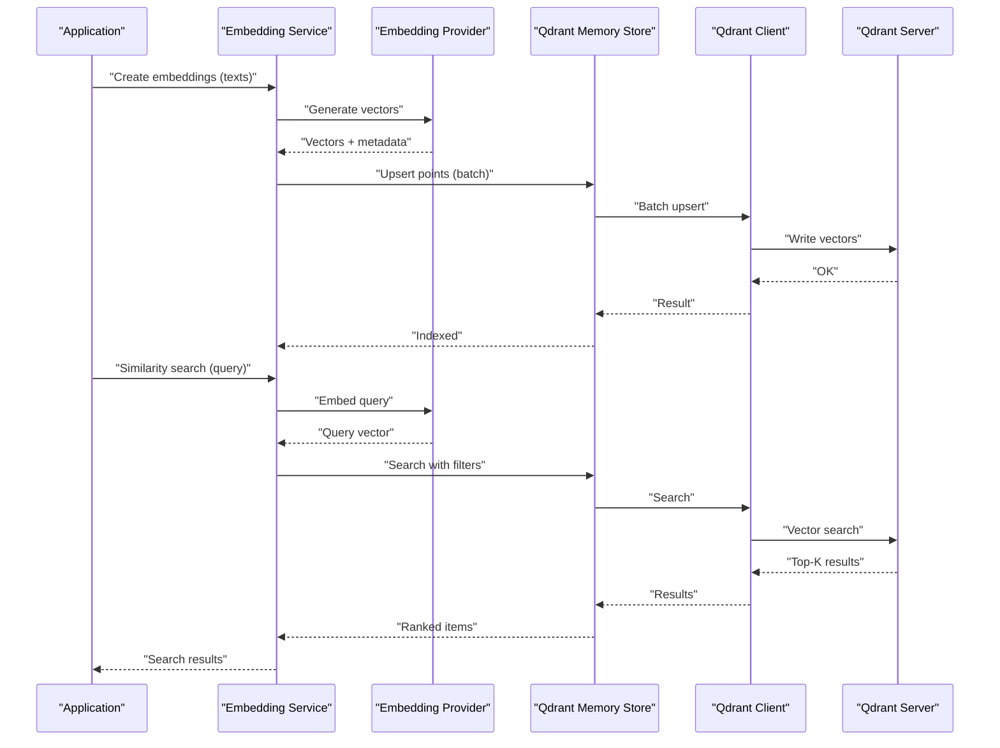

**Diagram sources**
- [src/services/embedding/service.ts](file://src/services/embedding/service.ts)
- [src/services/embedding/providers.ts](file://src/services/embedding/providers.ts)
- [src/services/qdrant/memory-store.ts](file://src/services/qdrant/memory-store.ts)
- [src/services/qdrant/search.ts](file://src/services/qdrant/search.ts)

## Detailed Component Analysis

### Embedding Generation Pipeline
- Provider Abstraction: The embedding service uses a provider registry to select an embedding backend based on configuration. Providers implement a common interface for generating vectors from text inputs.
- Model Selection: Configuration determines which model to use, including expected output dimensions. This ensures downstream components can validate vector shapes before storage.
- Dimensionality Validation: Before storing vectors, the service validates that generated vectors match the configured dimensionality to prevent schema mismatches.
- Error Handling: Embedding failures are captured and surfaced with context (provider name, model, input size). Retries may be applied at the provider level if supported.

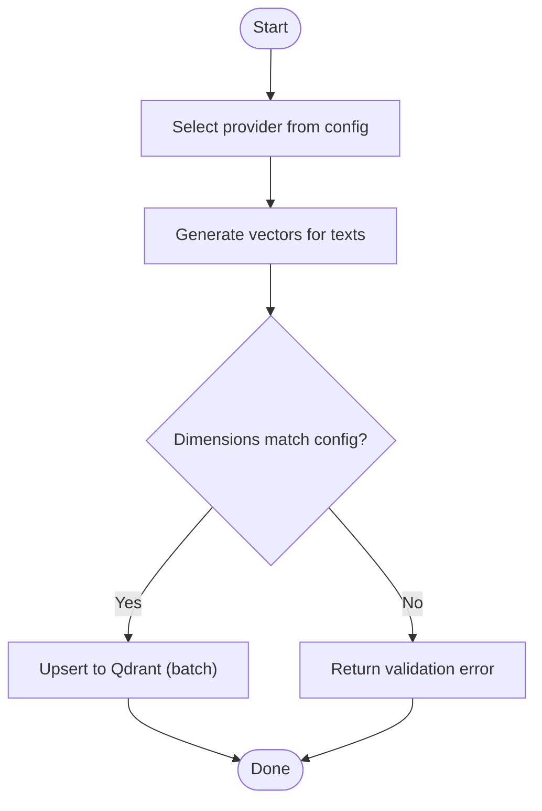

**Diagram sources**
- [src/services/embedding/service.ts](file://src/services/embedding/service.ts)
- [src/services/embedding/providers.ts](file://src/services/embedding/providers.ts)
- [src/services/embedding/config.ts](file://src/services/embedding/config.ts)
- [src/utils/qdrant-vector-types.ts](file://src/utils/qdrant-vector-types.ts)

**Section sources**
- [src/services/embedding/service.ts](file://src/services/embedding/service.ts)
- [src/services/embedding/providers.ts](file://src/services/embedding/providers.ts)
- [src/services/embedding/config.ts](file://src/services/embedding/config.ts)
- [src/services/embedding/types.ts](file://src/services/embedding/types.ts)
- [src/utils/qdrant-vector-types.ts](file://src/utils/qdrant-vector-types.ts)

### Qdrant Client Configuration and Connection Management
- Configuration: Connection parameters such as host, port, API key, and TLS settings are provided via environment variables and loaded at startup.
- Connection Lifecycle: The Qdrant client is initialized once and reused across requests. Health checks ensure connectivity before accepting operations.
- Retry Logic: Network errors and transient failures trigger retries with exponential backoff where appropriate.
- Monitoring: Metrics record connection attempts, successes, and failures.

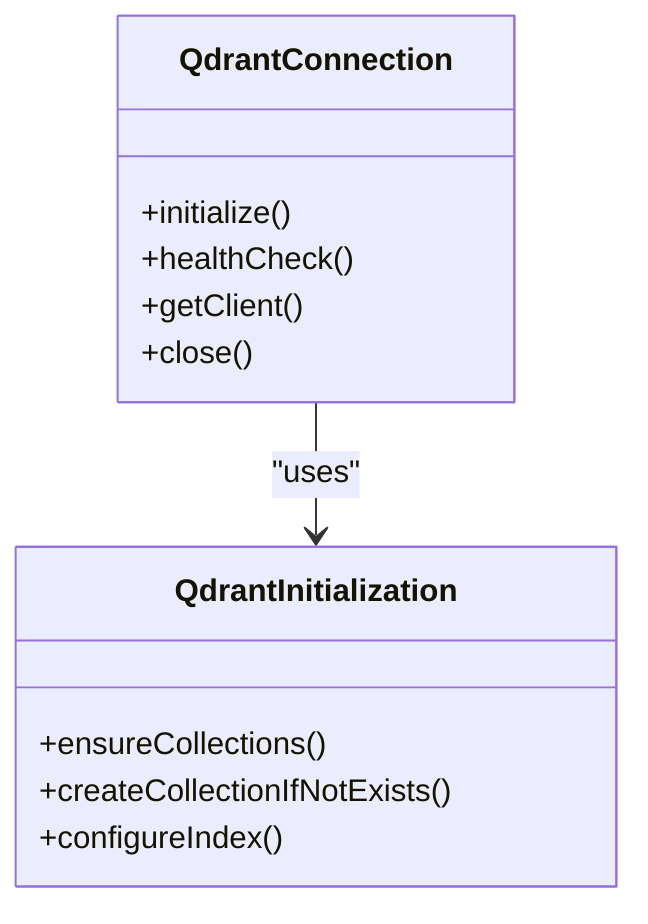

**Diagram sources**
- [src/services/qdrant/connection.ts](file://src/services/qdrant/connection.ts)
- [src/services/qdrant/initialization.ts](file://src/services/qdrant/initialization.ts)

**Section sources**
- [src/services/qdrant/connection.ts](file://src/services/qdrant/connection.ts)
- [src/services/qdrant/initialization.ts](file://src/services/qdrant/initialization.ts)
- [src/services/metrics/qdrant-metrics.ts](file://src/services/metrics/qdrant-metrics.ts)

### Collection Setup and Schema
- Collections: Each logical space or domain maps to a Qdrant collection. Utility functions standardize collection names and ensure consistent naming conventions.
- Schema: Vectors have fixed dimensions defined by the embedding model. Metadata fields include identifiers, content references, and scoping attributes.
- Indexing: Similarity indexes are configured during collection creation or migration. Index types and parameters are tuned for performance.

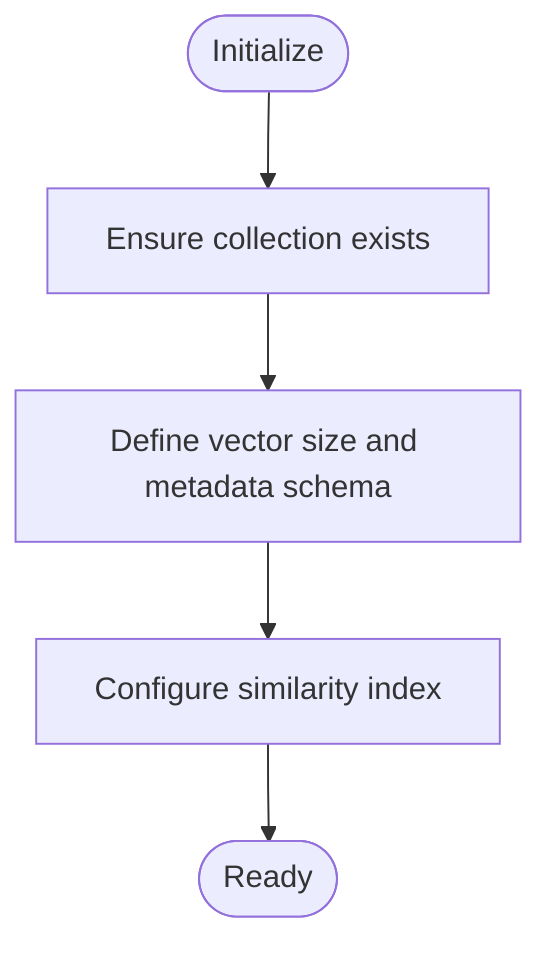

**Diagram sources**
- [src/utils/qdrant-collection-utils.ts](file://src/utils/qdrant-collection-utils.ts)
- [src/services/qdrant/initialization.ts](file://src/services/qdrant/initialization.ts)
- [src/utils/qdrant-vector-types.ts](file://src/utils/qdrant-vector-types.ts)

**Section sources**
- [src/utils/qdrant-collection-utils.ts](file://src/utils/qdrant-collection-utils.ts)
- [src/services/qdrant/initialization.ts](file://src/services/qdrant/initialization.ts)
- [src/utils/qdrant-vector-types.ts](file://src/utils/qdrant-vector-types.ts)

### Vector Storage Operations
- Upserts: Points are upserted in batches to optimize throughput. Each point includes a unique ID, vector, and metadata payload.
- Batch Operations: Large datasets are chunked and upserted concurrently with controlled concurrency limits to avoid overwhelming Qdrant.
- Data Integrity: Idempotent upserts rely on stable IDs. Duplicate detection is handled by Qdrant’s point semantics.

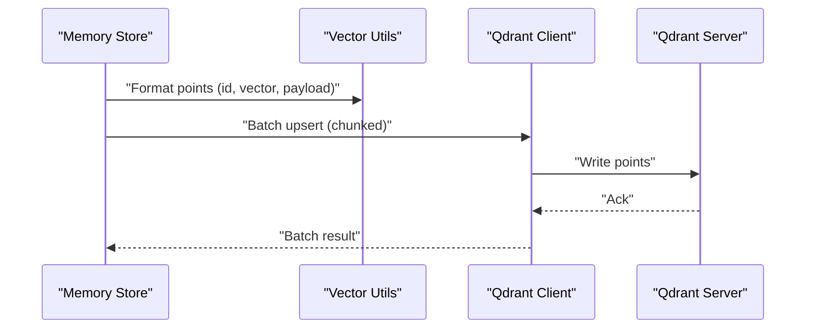

**Diagram sources**
- [src/services/qdrant/memory-store.ts](file://src/services/qdrant/memory-store.ts)
- [src/utils/qdrant-vector-management.ts](file://src/utils/qdrant-vector-management.ts)

**Section sources**
- [src/services/qdrant/memory-store.ts](file://src/services/qdrant/memory-store.ts)
- [src/utils/qdrant-vector-management.ts](file://src/utils/qdrant-vector-management.ts)
- [src/utils/qdrant-utils.ts](file://src/utils/qdrant-utils.ts)

### Similarity Search and Filtering
- Query Flow: Queries are embedded using the same provider and model used for indexing. The resulting vector is used to search the target collection.
- Filters: Metadata filters support scoping by space, resource type, and other attributes. Query utilities help construct filter expressions consistently.
- Top-K Results: Search returns ranked results with scores. Retrieval helpers map Qdrant points back to application entities.

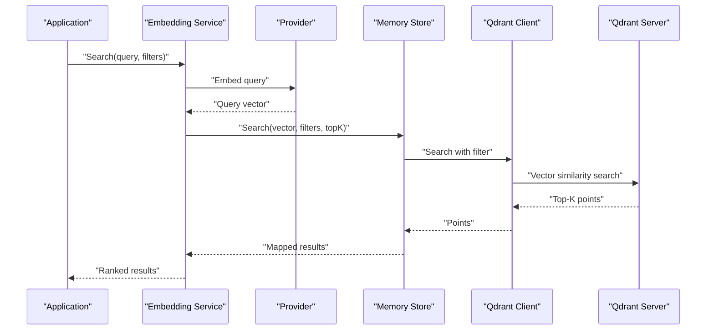

**Diagram sources**
- [src/services/qdrant/search.ts](file://src/services/qdrant/search.ts)
- [src/services/qdrant/memory-retrieval.ts](file://src/services/qdrant/memory-retrieval.ts)
- [src/utils/qdrant-query-utils.ts](file://src/utils/qdrant-query-utils.ts)

**Section sources**
- [src/services/qdrant/search.ts](file://src/services/qdrant/search.ts)
- [src/services/qdrant/memory-retrieval.ts](file://src/services/qdrant/memory-retrieval.ts)
- [src/utils/qdrant-query-utils.ts](file://src/utils/qdrant-query-utils.ts)

### Snapshots and Resource Management
- Snapshots: Periodic snapshots enable backup and restore workflows. Snapshot APIs are exposed through dedicated modules.
- Listing: Collection listing and inspection utilities assist in operational tasks like auditing and maintenance.
- Resources: Resource mapping utilities link stored points to application resources for traceability.

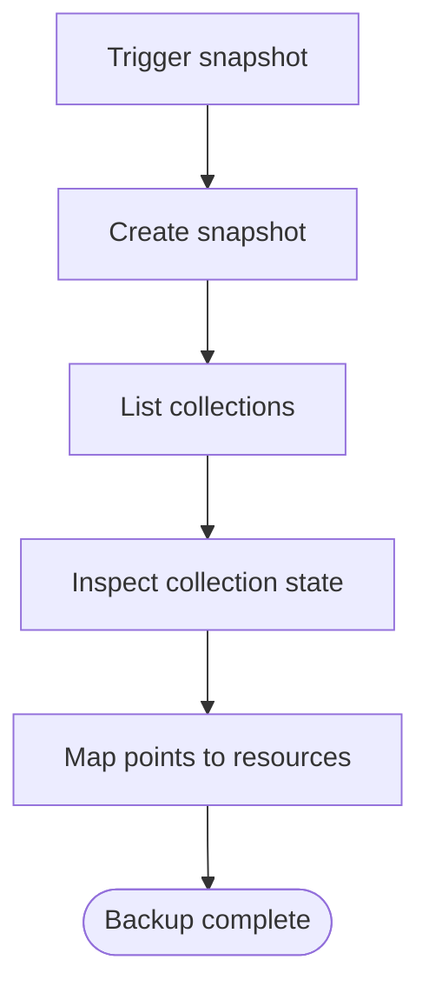

**Diagram sources**
- [src/services/qdrant/snapshots.ts](file://src/services/qdrant/snapshots.ts)
- [src/services/qdrant/listing.ts](file://src/services/qdrant/listing.ts)
- [src/services/qdrant/resources.ts](file://src/services/qdrant/resources.ts)

**Section sources**
- [src/services/qdrant/snapshots.ts](file://src/services/qdrant/snapshots.ts)
- [src/services/qdrant/listing.ts](file://src/services/qdrant/listing.ts)
- [src/services/qdrant/resources.ts](file://src/services/qdrant/resources.ts)

### Reward Propagation and Quality Signals
- Reward Propagation: Updates propagate reward signals to related points, enabling feedback loops for quality improvement.
- Quality Metrics: Quality assessment utilities compute relevance and consistency metrics over stored data.

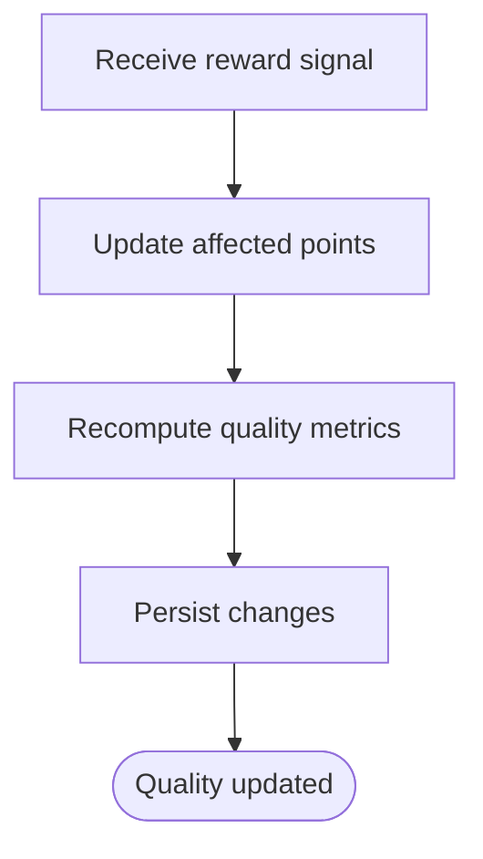

**Diagram sources**
- [src/services/qdrant/reward-propagation.ts](file://src/services/qdrant/reward-propagation.ts)
- [src/services/qdrant/quality.ts](file://src/services/qdrant/quality.ts)

**Section sources**
- [src/services/qdrant/reward-propagation.ts](file://src/services/qdrant/reward-propagation.ts)
- [src/services/qdrant/quality.ts](file://src/services/qdrant/quality.ts)

### Protocol and Types
- Protocol: Defines contracts between services and Qdrant payloads, ensuring compatibility across updates.
- Vector Types: Centralizes vector shape definitions and validation rules to maintain consistency.

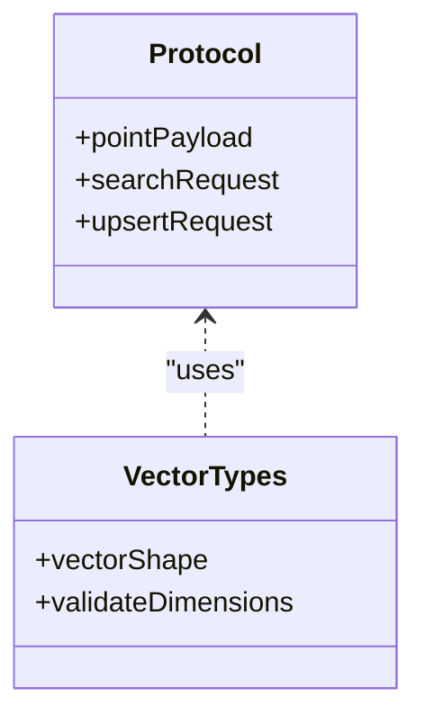

**Diagram sources**
- [src/services/qdrant/protocol.ts](file://src/services/qdrant/protocol.ts)
- [src/utils/qdrant-vector-types.ts](file://src/utils/qdrant-vector-types.ts)

**Section sources**
- [src/services/qdrant/protocol.ts](file://src/services/qdrant/protocol.ts)
- [src/utils/qdrant-vector-types.ts](file://src/utils/qdrant-vector-types.ts)

## Dependency Analysis
Embedding and Qdrant modules depend on shared utilities and metrics. The following diagram shows primary dependencies:

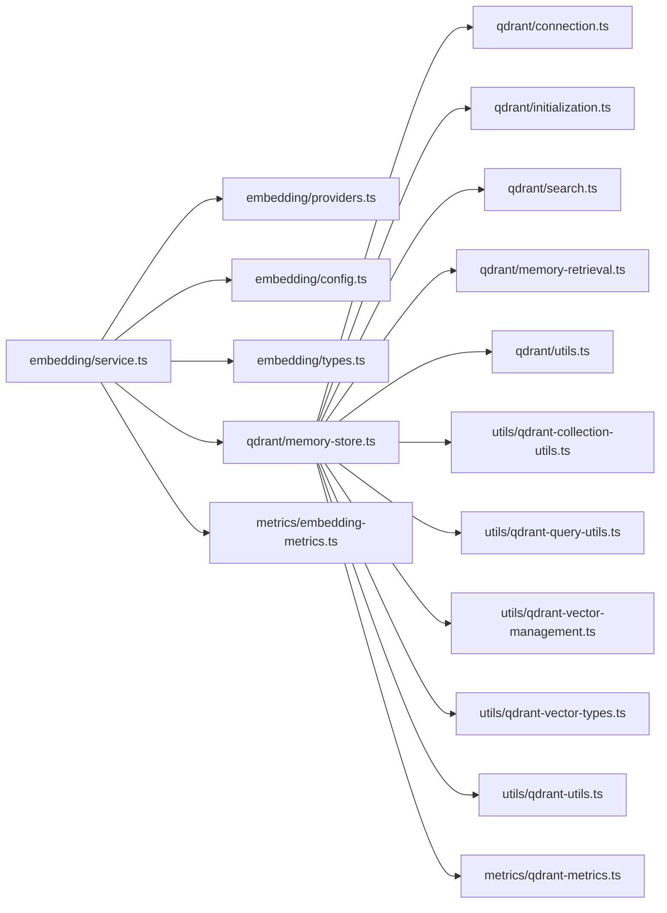

**Diagram sources**
- [src/services/embedding/service.ts](file://src/services/embedding/service.ts)
- [src/services/qdrant/memory-store.ts](file://src/services/qdrant/memory-store.ts)
- [src/utils/qdrant-collection-utils.ts](file://src/utils/qdrant-collection-utils.ts)
- [src/utils/qdrant-query-utils.ts](file://src/utils/qdrant-query-utils.ts)
- [src/utils/qdrant-vector-management.ts](file://src/utils/qdrant-vector-management.ts)
- [src/utils/qdrant-vector-types.ts](file://src/utils/qdrant-vector-types.ts)
- [src/utils/qdrant-utils.ts](file://src/utils/qdrant-utils.ts)
- [src/services/metrics/embedding-metrics.ts](file://src/services/metrics/embedding-metrics.ts)
- [src/services/metrics/qdrant-metrics.ts](file://src/services/metrics/qdrant-metrics.ts)

**Section sources**
- [src/services/embedding/service.ts](file://src/services/embedding/service.ts)
- [src/services/qdrant/memory-store.ts](file://src/services/qdrant/memory-store.ts)
- [src/utils/qdrant-collection-utils.ts](file://src/utils/qdrant-collection-utils.ts)
- [src/utils/qdrant-query-utils.ts](file://src/utils/qdrant-query-utils.ts)
- [src/utils/qdrant-vector-management.ts](file://src/utils/qdrant-vector-management.ts)
- [src/utils/qdrant-vector-types.ts](file://src/utils/qdrant-vector-types.ts)
- [src/utils/qdrant-utils.ts](file://src/utils/qdrant-utils.ts)
- [src/services/metrics/embedding-metrics.ts](file://src/services/metrics/embedding-metrics.ts)
- [src/services/metrics/qdrant-metrics.ts](file://src/services/metrics/qdrant-metrics.ts)

## Performance Considerations
- Embedding Model Selection: Choose models balancing accuracy and latency. Higher-dimensional vectors improve recall but increase storage and search cost.
- Dimensionality Tuning: Align vector dimensions with model outputs; avoid unnecessary truncation or padding.
- Batch Size and Concurrency: Tune batch sizes and concurrency limits for upserts to maximize throughput without saturating Qdrant.
- Index Configuration: Optimize index parameters (e.g., m, ef) for your workload characteristics. Larger ef improves recall at higher latency.
- Filtering Efficiency: Use selective metadata filters to reduce search scope and improve response times.
- Caching: Cache frequent query embeddings when safe to do so.
- Monitoring: Track embedding latency, Qdrant request latency, and error rates to identify bottlenecks.

[No sources needed since this section provides general guidance]

## Troubleshooting Guide
Common issues and resolutions:
- Connection Failures: Verify Qdrant host, port, API key, and TLS settings. Check health endpoints and logs for connection errors.
- Dimensionality Mismatch: Ensure embedding model output matches configured vector dimensions. Validate vectors before upsert.
- Filter Errors: Review metadata schema and filter syntax. Confirm field names and value types align with collection schema.
- Rate Limiting: Implement retries with backoff for embedding providers and Qdrant rate-limited responses.
- Observability: Inspect metrics for embedding and Qdrant operations. Correlate spikes in latency or errors with recent deployments.

Operational scripts:
- Environment Setup: Use deployment scripts to configure runtime environment variables for Qdrant and embedding providers.
- Raw Search Examples: Use example scripts to run direct Qdrant searches for diagnostics and benchmarking.

**Section sources**
- [src/services/qdrant/connection.ts](file://src/services/qdrant/connection.ts)
- [src/services/qdrant/initialization.ts](file://src/services/qdrant/initialization.ts)
- [src/services/metrics/qdrant-metrics.ts](file://src/services/metrics/qdrant-metrics.ts)
- [src/services/metrics/embedding-metrics.ts](file://src/services/metrics/embedding-metrics.ts)
- [scripts/deploy-run-env.sh](file://scripts/deploy-run-env.sh)
- [scripts/deploy-raw-qdrant-search.mjs](file://scripts/deploy-raw-qdrant-search.mjs)

## Conclusion
The embedding and Qdrant integration provides a robust pipeline for generating, storing, and retrieving vector representations. By leveraging provider abstraction, standardized collection schemas, and optimized search flows, the system supports scalable similarity search with strong observability. Careful attention to model selection, dimensionality, batching, and index tuning yields reliable performance. Operational scripts and metrics facilitate troubleshooting and continuous improvement.

[No sources needed since this section summarizes without analyzing specific files]

## Appendices

### Example Workflows
- Embedding Creation:
  - Configure provider and model in embedding configuration.
  - Generate vectors for documents or artifacts.
  - Validate dimensions and upsert to Qdrant in batches.
- Vector Indexing:
  - Initialize collections with correct vector dimensions.
  - Configure similarity indexes for desired recall-latency trade-offs.
- Query Optimization:
  - Embed queries using the same provider/model.
  - Apply precise metadata filters to narrow search scope.
  - Tune top-K and index parameters for performance.

[No sources needed since this section provides conceptual guidance]