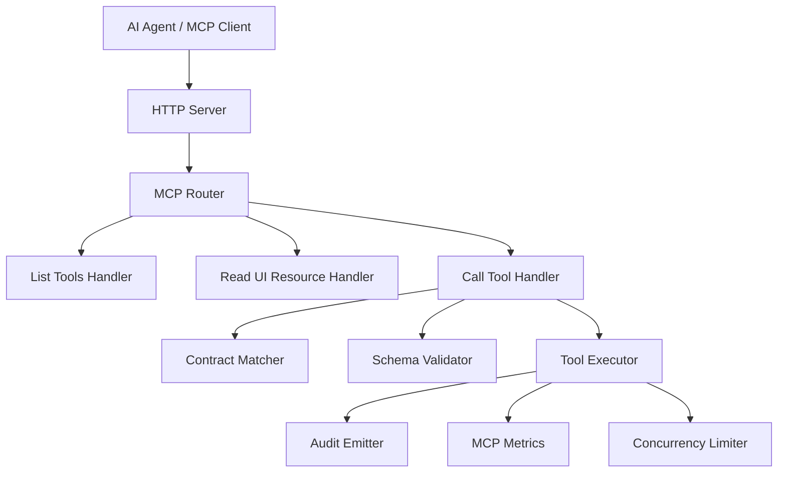
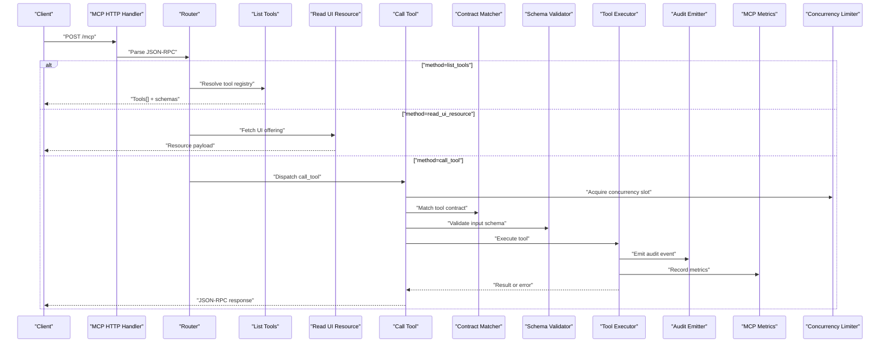
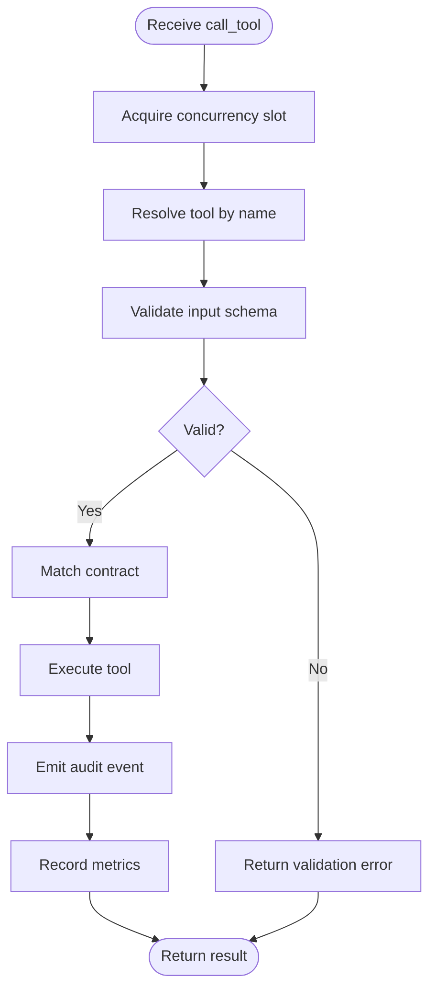
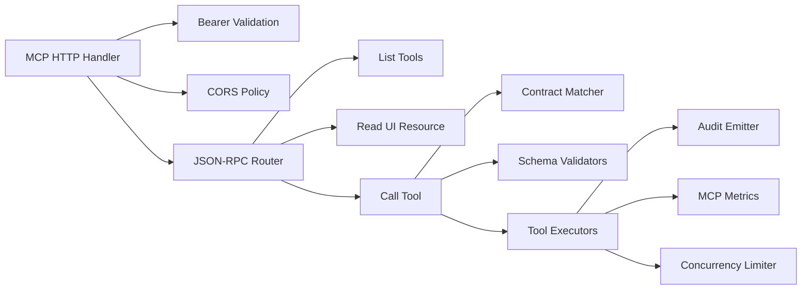
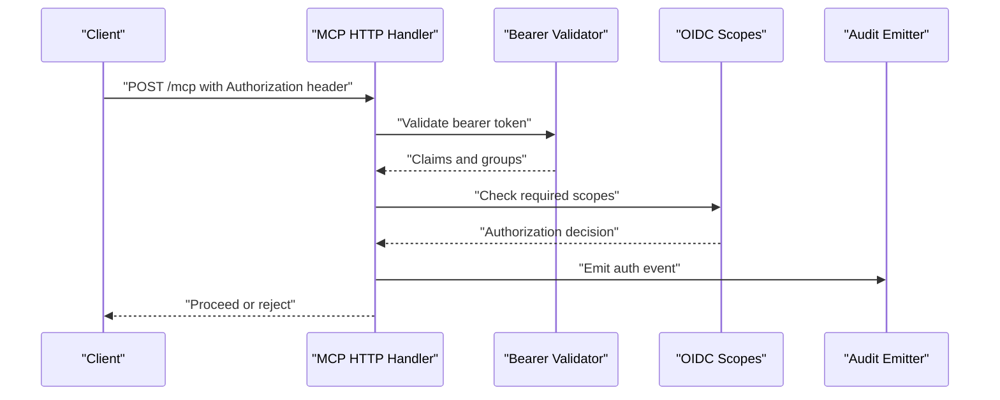

# Model Context Protocol (MCP) Fundamentals

<cite>
**Referenced Files in This Document**
- [http-mcp-handler.ts](file://src/http/http-mcp-handler.ts)
- [mcp-contract-match.ts](file://src/tools/mcp-contract-match.ts)
- [mcp-tool-input-teaching.ts](file://src/tools/mcp-tool-input-teaching.ts)
- [mcp-runtime-error.ts](file://src/tools/mcp-runtime-error.ts)
- [forward-register.ts](file://src/tools/forward-register.ts)
- [forward.ts](file://src/tools/forward.ts)
- [forward_schema.ts](file://src/tools/forward_schema.ts)
- [activate_schema.ts](file://src/tools/activate_schema.ts)
- [search_schema.ts](file://src/tools/search_schema.ts)
- [train_schema.ts](file://src/tools/train_schema.ts)
- [tune_schema.ts](file://src/tools/tune_schema.ts)
- [export_schema.ts](file://src/tools/export_schema.ts)
- [delete_schema.ts](file://src/tools/delete_schema.ts)
- [dump_schema.ts](file://src/tools/dump_schema.ts)
- [spaces_schema.ts](file://src/tools/spaces_schema.ts)
- [update_schema.ts](file://src/tools/update_schema.ts)
- [mcp-ui-offerings-auth-jsonrpc.ts](file://src/http/mcp-ui-offerings-auth-jsonrpc.ts)
- [http-mcp-cors.ts](file://src/http/http-mcp-cors.ts)
- [mcp-audit-emit.ts](file://src/http/mcp-audit-emit.ts)
- [mcp-metrics.ts](file://src/services/metrics/mcp-metrics.ts)
- [concurrency-limit.ts](file://src/utils/concurrency-limit.ts)
- [bearer-validate.ts](file://src/http/bearer-validate.ts)
- [oidc-scopes.ts](file://src/http/oidc-scopes.ts)
- [mcp-list-tools.test.ts](file://tests/integration/mcp-list-tools.test.ts)
- [mcp-client-connection.test.ts](file://tests/integration/mcp-client-connection.test.ts)
- [mcp-host-client-groups.test.ts](file://tests/integration/mcp-host-client-groups.test.ts)
- [mcp-ui-resource-read.test.ts](file://tests/integration/mcp-ui-resource-read.test.ts)
- [mcp-auth-jsonrpc-error.test.ts](file://tests/integration/mcp-auth-jsonrpc-error.test.ts)
- [http-mcp-concurrency.test.ts](file://tests/integration/http-mcp-concurrency.test.ts)
- [http-mcp-error-response.test.ts](file://tests/integration/http-mcp-error-response.test.ts)
- [v4-kairos-forward-v2-solution.test.ts](file://tests/integration/v4-kairos-forward-v2-solution.test.ts)
- [v4-kairos-forward-mcp-contract-args.test.ts](file://tests/integration/v4-kairos-forward-mcp-contract-args.test.ts)
</cite>

## Table of Contents
1. [Introduction](#introduction)
2. [Project Structure](#project-structure)
3. [Core Components](#core-components)
4. [Architecture Overview](#architecture-overview)
5. [Detailed Component Analysis](#detailed-component-analysis)
6. [Dependency Analysis](#dependency-analysis)
7. [Performance Considerations](#performance-considerations)
8. [Security and Authentication](#security-and-authentication)
9. [Troubleshooting Guide](#troubleshooting-guide)
10. [Conclusion](#conclusion)

## Introduction
This document explains the fundamentals of the Model Context Protocol (MCP) as implemented by Kairos, focusing on how MCP standardizes communication between AI agents and external tools. It covers tool registration, schema validation, request/response patterns, error handling, and the protocol lifecycle from discovery to execution completion. It also details contract matching for tool invocation, message formats, security considerations, authentication integration, and rate limiting within the MCP context.

## Project Structure
Kairos implements MCP over HTTP with JSON-RPC semantics. The HTTP layer exposes endpoints for listing tools, reading UI resources, and executing tools. Tool definitions are registered via schemas, and runtime behavior is orchestrated through a handler that validates inputs, matches contracts, executes tools, and returns standardized responses.

**Diagram sources**
- [http-mcp-handler.ts](file://src/http/http-mcp-handler.ts)
- [mcp-contract-match.ts](file://src/tools/mcp-contract-match.ts)
- [mcp-audit-emit.ts](file://src/http/mcp-audit-emit.ts)
- [mcp-metrics.ts](file://src/services/metrics/mcp-metrics.ts)
- [concurrency-limit.ts](file://src/utils/concurrency-limit.ts)

**Section sources**
- [http-mcp-handler.ts](file://src/http/http-mcp-handler.ts)
- [mcp-ui-offerings-auth-jsonrpc.ts](file://src/http/mcp-ui-offerings-auth-jsonrpc.ts)
- [http-mcp-cors.ts](file://src/http/http-mcp-cors.ts)

## Core Components
- MCP HTTP Handler: Routes JSON-RPC requests to appropriate handlers for tool listing, resource reading, and tool execution.
- Contract Matcher: Validates that incoming arguments match the declared tool contract.
- Schema Validators: Define and enforce input/output shapes for each tool using JSON Schema.
- Tool Executors: Implement business logic for specific operations (e.g., forward, activate, search, train).
- Security Middleware: Validates bearer tokens and integrates OIDC scopes.
- Observability: Emits audit events and metrics for MCP calls.
- Concurrency Control: Limits concurrent MCP executions to protect system stability.

**Section sources**
- [http-mcp-handler.ts](file://src/http/http-mcp-handler.ts)
- [mcp-contract-match.ts](file://src/tools/mcp-contract-match.ts)
- [forward_schema.ts](file://src/tools/forward_schema.ts)
- [activate_schema.ts](file://src/tools/activate_schema.ts)
- [search_schema.ts](file://src/tools/search_schema.ts)
- [train_schema.ts](file://src/tools/train_schema.ts)
- [tune_schema.ts](file://src/tools/tune_schema.ts)
- [export_schema.ts](file://src/tools/export_schema.ts)
- [delete_schema.ts](file://src/tools/delete_schema.ts)
- [dump_schema.ts](file://src/tools/dump_schema.ts)
- [spaces_schema.ts](file://src/tools/spaces_schema.ts)
- [update_schema.ts](file://src/tools/update_schema.ts)
- [bearer-validate.ts](file://src/http/bearer-validate.ts)
- [oidc-scopes.ts](file://src/http/oidc-scopes.ts)
- [mcp-audit-emit.ts](file://src/http/mcp-audit-emit.ts)
- [mcp-metrics.ts](file://src/services/metrics/mcp-metrics.ts)
- [concurrency-limit.ts](file://src/utils/concurrency-limit.ts)

## Architecture Overview
The MCP architecture centers around a JSON-RPC server exposing three primary capabilities:
- list_tools: Discover available tools and their schemas.
- read_ui_resource: Retrieve UI offerings or embedded resources for client-side rendering.
- call_tool: Execute a named tool with validated parameters and return results or errors.

**Diagram sources**
- [http-mcp-handler.ts](file://src/http/http-mcp-handler.ts)
- [mcp-contract-match.ts](file://src/tools/mcp-contract-match.ts)
- [mcp-audit-emit.ts](file://src/http/mcp-audit-emit.ts)
- [mcp-metrics.ts](file://src/services/metrics/mcp-metrics.ts)
- [concurrency-limit.ts](file://src/utils/concurrency-limit.ts)

## Detailed Component Analysis

### MCP HTTP Handler and Routing
Responsibilities:
- Parse JSON-RPC envelopes and route to handlers.
- Enforce CORS policies for browser-based clients.
- Integrate authentication middleware for protected endpoints.

Key behaviors:
- Supports methods: list_tools, read_ui_resource, call_tool.
- Returns structured JSON-RPC responses with consistent error codes.

**Section sources**
- [http-mcp-handler.ts](file://src/http/http-mcp-handler.ts)
- [http-mcp-cors.ts](file://src/http/http-mcp-cors.ts)
- [mcp-ui-offerings-auth-jsonrpc.ts](file://src/http/mcp-ui-offerings-auth-jsonrpc.ts)

### Tool Registration and Schemas
Each tool declares its input and output schemas using JSON Schema files. These schemas drive validation and provide discoverable metadata for clients.

Examples of schema modules:
- Forward tool schema
- Activate tool schema
- Search tool schema
- Train tool schema
- Tune tool schema
- Export tool schema
- Delete tool schema
- Dump tool schema
- Spaces tool schema
- Update tool schema

Validation flow:
- On call_tool, the handler resolves the target tool’s schema.
- Input parameters are validated against the schema.
- If invalid, a structured error is returned without invoking the executor.

**Section sources**
- [forward_schema.ts](file://src/tools/forward_schema.ts)
- [activate_schema.ts](file://src/tools/activate_schema.ts)
- [search_schema.ts](file://src/tools/search_schema.ts)
- [train_schema.ts](file://src/tools/train_schema.ts)
- [tune_schema.ts](file://src/tools/tune_schema.ts)
- [export_schema.ts](file://src/tools/export_schema.ts)
- [delete_schema.ts](file://src/tools/delete_schema.ts)
- [dump_schema.ts](file://src/tools/dump_schema.ts)
- [spaces_schema.ts](file://src/tools/spaces_schema.ts)
- [update_schema.ts](file://src/tools/update_schema.ts)

### Contract Matching and Loose Inputs
Contract matching ensures that the caller’s intent aligns with the tool’s expected interface. Kairos supports strict and loose modes:
- Strict mode enforces exact field presence and types.
- Loose mode allows flexible inputs while still validating core requirements.

Teaching utilities assist in generating helpful guidance when inputs do not match expectations.

**Section sources**
- [mcp-contract-match.ts](file://src/tools/mcp-contract-match.ts)
- [mcp-tool-input-teaching.ts](file://src/tools/mcp-tool-input-teaching.ts)

### Tool Execution Lifecycle
End-to-end flow for call_tool:
1. Receive JSON-RPC call_tool request.
2. Acquire concurrency slot to limit parallelism.
3. Resolve tool by name and validate input schema.
4. Match contract to ensure compatibility.
5. Execute tool logic.
6. Emit audit event and record metrics.
7. Return result or error in JSON-RPC format.

**Diagram sources**
- [http-mcp-handler.ts](file://src/http/http-mcp-handler.ts)
- [mcp-contract-match.ts](file://src/tools/mcp-contract-match.ts)
- [mcp-audit-emit.ts](file://src/http/mcp-audit-emit.ts)
- [mcp-metrics.ts](file://src/services/metrics/mcp-metrics.ts)
- [concurrency-limit.ts](file://src/utils/concurrency-limit.ts)

**Section sources**
- [forward-register.ts](file://src/tools/forward-register.ts)
- [forward.ts](file://src/tools/forward.ts)
- [mcp-runtime-error.ts](file://src/tools/mcp-runtime-error.ts)

### Message Formats and Examples
MCP uses JSON-RPC envelopes with method names and parameter objects. Typical methods:
- list_tools: Returns an array of tool descriptors including names and schemas.
- read_ui_resource: Returns UI offerings or embedded resources for client rendering.
- call_tool: Executes a named tool with validated parameters.

Example references:
- Tool listing and schema structure can be observed in integration tests.
- UI resource retrieval is covered by dedicated tests.
- Error responses follow JSON-RPC conventions with structured error codes.

**Section sources**
- [mcp-list-tools.test.ts](file://tests/integration/mcp-list-tools.test.ts)
- [mcp-ui-resource-read.test.ts](file://tests/integration/mcp-ui-resource-read.test.ts)
- [http-mcp-error-response.test.ts](file://tests/integration/http-mcp-error-response.test.ts)

### Contract Matching Examples
Contract matching examples demonstrate how tool invocations align with declared schemas:
- Exact field matches succeed under strict mode.
- Flexible fields are accepted under loose mode.
- Mismatched types or missing required fields produce validation errors.

References:
- Integration tests cover contract argument matching and v2 solution flows.

**Section sources**
- [v4-kairos-forward-mcp-contract-args.test.ts](file://tests/integration/v4-kairos-forward-mcp-contract-args.test.ts)
- [v4-kairos-forward-v2-solution.test.ts](file://tests/integration/v4-kairos-forward-v2-solution.test.ts)

## Dependency Analysis
MCP components depend on shared services for authentication, auditing, metrics, and concurrency control.

**Diagram sources**
- [http-mcp-handler.ts](file://src/http/http-mcp-handler.ts)
- [bearer-validate.ts](file://src/http/bearer-validate.ts)
- [http-mcp-cors.ts](file://src/http/http-mcp-cors.ts)
- [mcp-contract-match.ts](file://src/tools/mcp-contract-match.ts)
- [mcp-audit-emit.ts](file://src/http/mcp-audit-emit.ts)
- [mcp-metrics.ts](file://src/services/metrics/mcp-metrics.ts)
- [concurrency-limit.ts](file://src/utils/concurrency-limit.ts)

**Section sources**
- [bearer-validate.ts](file://src/http/bearer-validate.ts)
- [oidc-scopes.ts](file://src/http/oidc-scopes.ts)
- [mcp-audit-emit.ts](file://src/http/mcp-audit-emit.ts)
- [mcp-metrics.ts](file://src/services/metrics/mcp-metrics.ts)
- [concurrency-limit.ts](file://src/utils/concurrency-limit.ts)

## Performance Considerations
- Concurrency Limiting: Use a limiter to cap concurrent MCP executions, preventing overload during high load.
- Schema Validation: Early validation reduces unnecessary processing and improves error feedback.
- Metrics and Auditing: Record performance counters and audit events to monitor throughput and latency.
- Resource Caching: Cache UI resources where appropriate to reduce repeated reads.

[No sources needed since this section provides general guidance]

## Security and Authentication
Authentication and authorization are integrated into MCP endpoints:
- Bearer token validation ensures only authorized clients invoke protected tools.
- OIDC scopes define permissions for different operations.
- CORS configuration secures cross-origin access for browser-based clients.
- Audit logging captures MCP activity for compliance and troubleshooting.

**Diagram sources**
- [bearer-validate.ts](file://src/http/bearer-validate.ts)
- [oidc-scopes.ts](file://src/http/oidc-scopes.ts)
- [mcp-audit-emit.ts](file://src/http/mcp-audit-emit.ts)

**Section sources**
- [bearer-validate.ts](file://src/http/bearer-validate.ts)
- [oidc-scopes.ts](file://src/http/oidc-scopes.ts)
- [mcp-auth-jsonrpc-error.test.ts](file://tests/integration/mcp-auth-jsonrpc-error.test.ts)
- [mcp-host-client-groups.test.ts](file://tests/integration/mcp-host-client-groups.test.ts)

## Troubleshooting Guide
Common issues and diagnostics:
- Authentication failures: Check bearer token validity and OIDC scope alignment.
- Schema validation errors: Review tool input schemas and ensure parameters conform.
- Contract mismatches: Verify tool name and argument shape match the contract.
- Concurrency limits: Monitor metrics and adjust limits if necessary.
- Error responses: Inspect JSON-RPC error codes and messages for precise causes.

Relevant tests:
- MCP client connection and host/client group behavior.
- Concurrency and error response patterns.

**Section sources**
- [mcp-client-connection.test.ts](file://tests/integration/mcp-client-connection.test.ts)
- [http-mcp-concurrency.test.ts](file://tests/integration/http-mcp-concurrency.test.ts)
- [http-mcp-error-response.test.ts](file://tests/integration/http-mcp-error-response.test.ts)
- [mcp-runtime-error.ts](file://src/tools/mcp-runtime-error.ts)

## Conclusion
Kairos implements MCP over HTTP with JSON-RPC to standardize AI agent interactions with external tools. By combining robust schema validation, contract matching, secure authentication, observability, and concurrency control, Kairos provides a reliable and extensible foundation for orchestrating AI workflows. The documented components and flows enable developers to register new tools, integrate security policies, and maintain high performance and safety in production environments.