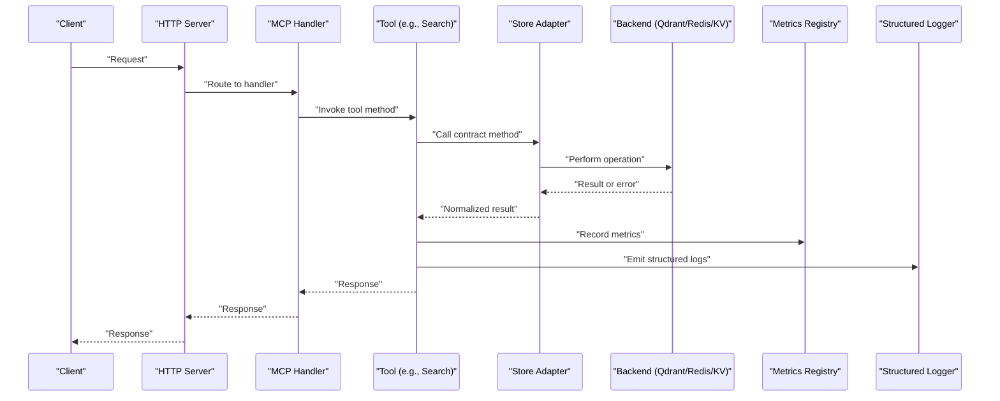
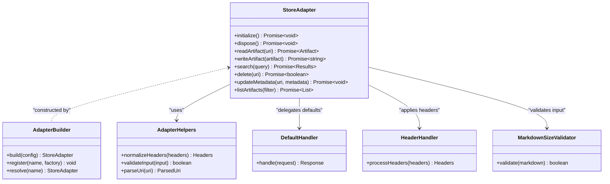
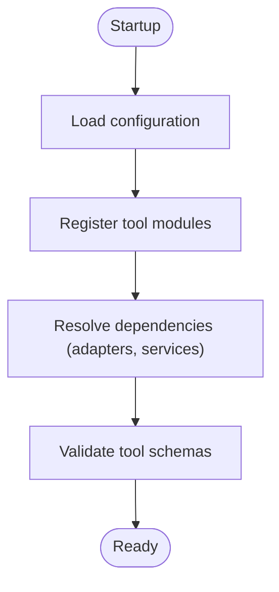
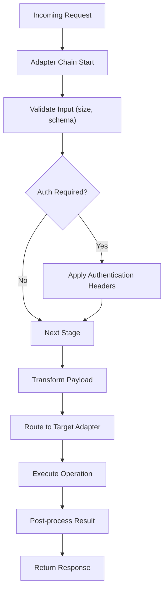
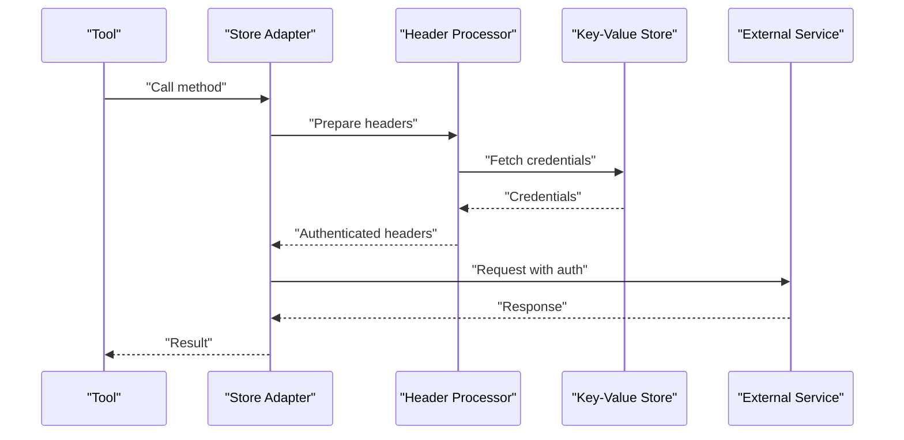
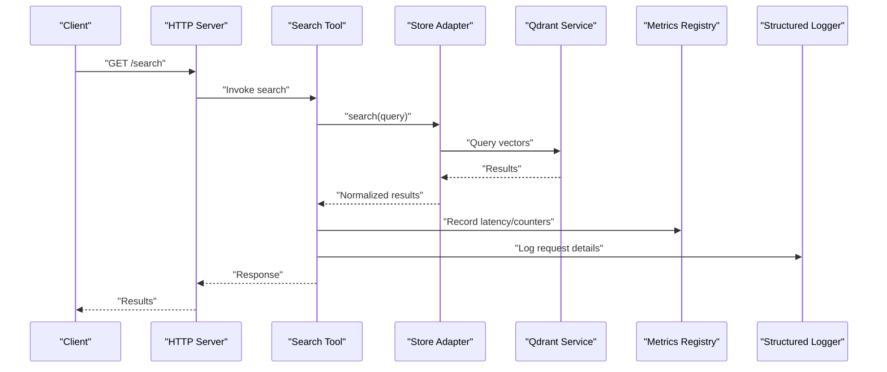
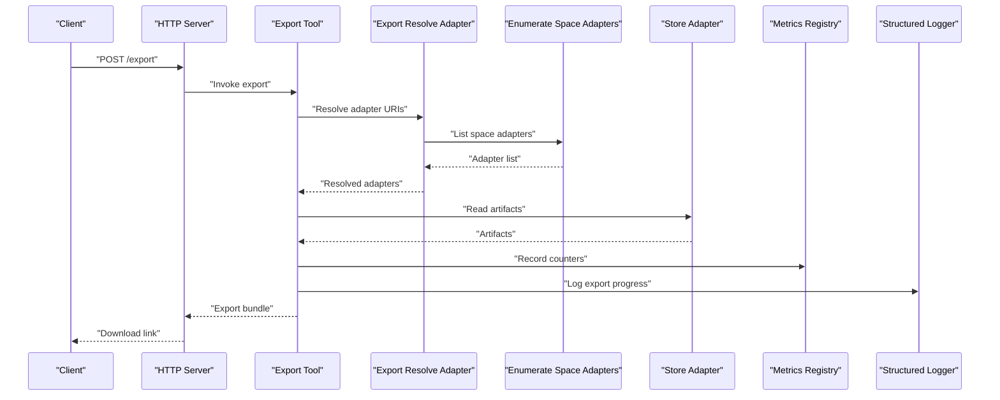
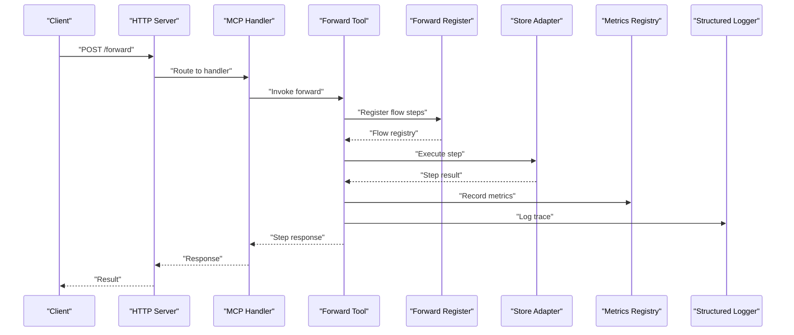
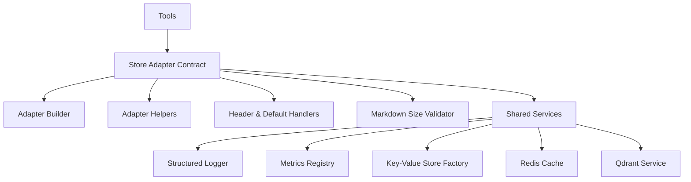

# Tool and Adapter System

<cite>
**Referenced Files in This Document**
- [src/services/memory/store-adapter.ts](file://src/services/memory/store-adapter.ts)
- [src/services/memory/adapter-builder.ts](file://src/services/memory/adapter-builder.ts)
- [src/services/memory/store-adapter-helpers.ts](file://src/services/memory/store-adapter-helpers.ts)
- [src/services/memory/store-adapter-default-handler.ts](file://src/services/memory/store-adapter-default-handler.ts)
- [src/services/memory/store-adapter-header-handler.ts](file://src/services/memory/store-adapter-header-handler.ts)
- [src/services/memory/validate-adapter-markdown-size.ts](file://src/services/memory/validate-adapter-markdown-size.ts)
- [src/tools/export-resolve-adapter.ts](file://src/tools/export-resolve-adapter.ts)
- [src/tools/train-artifact-adapter-uri.ts](file://src/tools/train-artifact-adapter-uri.ts)
- [src/tools/train-output-adapter-uri.ts](file://src/tools/train-output-adapter-uri.ts)
- [src/tools/skill-export/enumerate-space-adapters.ts](file://src/tools/skill-export/enumerate-space-adapters.ts)
- [src/tools/search.ts](file://src/tools/search.ts)
- [src/tools/export-source.ts](file://src/tools/export-source.ts)
- [src/tools/export-selection.ts](file://src/tools/export-selection.ts)
- [src/tools/forward-register.ts](file://src/tools/forward-register.ts)
- [src/tools/forward-tool-error.ts](file://src/tools/forward-tool-error.ts)
- [src/tools/forward-trace.ts](file://src/tools/forward-trace.ts)
- [src/tools/forward-view.ts](file://src/tools/forward-view.ts)
- [src/tools/forward.ts](file://src/tools/forward.ts)
- [src/tools/activate.ts](file://src/tools/activate.ts)
- [src/tools/reward.ts](file://src/tools/reward.ts)
- [src/tools/delete.ts](file://src/tools/delete.ts)
- [src/tools/dump.ts](file://src/tools/dump.ts)
- [src/tools/update.ts](file://src/tools/update.ts)
- [src/tools/tune.ts](file://src/tools/tune.ts)
- [src/tools/train.ts](file://src/tools/train.ts)
- [src/tools/spaces.ts](file://src/tools/spaces.ts)
- [src/tools/kairos-challenge-display.ts](file://src/tools/kairos-challenge-display.ts)
- [src/tools/mcp-contract-match.ts](file://src/tools/mcp-contract-match.ts)
- [src/tools/mcp-runtime-error.ts](file://src/tools/mcp-runtime-error.ts)
- [src/tools/mcp-tool-input-teaching.ts](file://src/tools/mcp-tool-input-teaching.ts)
- [src/http/http-mcp-handler.ts](file://src/http/http-mcp-handler.ts)
- [src/http/http-api-routes.ts](file://src/http/http-api-routes.ts)
- [src/bootstrap.ts](file://src/bootstrap.ts)
- [src/server.ts](file://src/server.ts)
- [src/config.ts](file://src/config.ts)
- [src/utils/structured-logger.ts](file://src/utils/structured-logger.ts)
- [src/services/metrics/registry.ts](file://src/services/metrics/registry.ts)
- [src/services/metrics/memory-metrics.ts](file://src/services/metrics/memory-metrics.ts)
- [src/services/qdrant/service.ts](file://src/services/qdrant/service.ts)
- [src/services/key-value-store-factory.ts](file://src/services/key-value-store-factory.ts)
- [src/services/redis-cache.ts](file://src/services/redis-cache.ts)
- [tests/unit/adapter-builder.test.ts](file://tests/unit/adapter-builder.test.ts)
- [tests/unit/store-adapter-helpers.test.ts](file://tests/unit/store-adapter-helpers.test.ts)
- [tests/integration/kairos-qdrant-storage.test.ts](file://tests/integration/kairos-qdrant-storage.test.ts)
- [tests/integration/http-api-test-helpers.ts](file://tests/integration/http-api-test-helpers.ts)
</cite>

## Table of Contents
1. [Introduction](#introduction)
2. [Project Structure](#project-structure)
3. [Core Components](#core-components)
4. [Architecture Overview](#architecture-overview)
5. [Detailed Component Analysis](#detailed-component-analysis)
6. [Dependency Analysis](#dependency-analysis)
7. [Performance Considerations](#performance-considerations)
8. [Troubleshooting Guide](#troubleshooting-guide)
9. [Conclusion](#conclusion)
10. [Appendices](#appendices)

## Introduction
This document explains the tool and adapter system used to integrate external services and data sources behind unified interfaces. It focuses on:
- The adapter pattern implementation for external service integration
- Tool registration mechanisms and dynamic loading
- The adapter contract, lifecycle management, and error handling strategies
- How adapters abstract different data sources and services
- Examples of creating custom adapters, configuring adapter chains, and handling authentication
- The relationship between tools, adapters, and protocols
- Testing, debugging, and performance monitoring capabilities

The goal is to provide both a conceptual overview and code-level guidance so that developers can extend the system with new adapters and tools confidently.

## Project Structure
At a high level, the system organizes functionality into:
- Tools: user-facing operations (search, export, train, forward, activate, etc.)
- Adapters: pluggable implementations that abstract storage or external services
- HTTP/MCP handlers: entry points that route requests to tools
- Services: shared infrastructure (metrics, logging, key-value store, Redis cache, Qdrant client)
- Configuration and bootstrap: wiring and startup logic

```mermaid
graph TB
subgraph "Entry Points"
HTTP["HTTP Server"]
MCP["MCP Handler"]
end
subgraph "Tools Layer"
TSearch["Search Tool"]
TExport["Export Tool"]
TTrain["Train Tool"]
TForward["Forward Tool"]
TActivate["Activate Tool"]
TReward["Reward Tool"]
TDelete["Delete Tool"]
TDump["Dump Tool"]
TUpdate["Update Tool"]
TTune["Tune Tool"]
TSpaces["Spaces Tool"]
end
subgraph "Adapter Layer"
AContract["Store Adapter Contract"]
ABuilder["Adapter Builder"]
AHelpers["Adapter Helpers"]
ADefaultHandler["Default Header Handler"]
AHeaderHandler["Header Handler"]
AValidateSize["Markdown Size Validator"]
end
subgraph "Services"
SLogger["Structured Logger"]
SMetrics["Metrics Registry"]
SKV["Key-Value Store Factory"]
SRedis["Redis Cache"]
SQdrant["Qdrant Service"]
end
HTTP --> TSearch
HTTP --> TExport
HTTP --> TTrain
HTTP --> TForward
HTTP --> TActivate
HTTP --> TReward
HTTP --> TDelete
HTTP --> TDump
HTTP --> TUpdate
HTTP --> TTune
HTTP --> TSpaces
MCP --> TSearch
MCP --> TExport
MCP --> TTrain
MCP --> TForward
MCP --> TActivate
MCP --> TReward
MCP --> TDelete
MCP --> TDump
MCP --> TUpdate
MCP --> TTune
MCP --> TSpaces
TSearch --> AContract
TExport --> AContract
TTrain --> AContract
TForward --> AContract
TActivate --> AContract
TReward --> AContract
TDelete --> AContract
TDump --> AContract
TUpdate --> AContract
TTune --> AContract
TSpaces --> AContract
AContract --> ABuilder
AContract --> AHelpers
AContract --> ADefaultHandler
AContract --> AHeaderHandler
AContract --> AValidateSize
AContract --> SQdrant
AContract --> SRedis
AContract --> SKV
TSearch --> SLogger
TExport --> SLogger
TTrain --> SLogger
TForward --> SLogger
TActivate --> SLogger
TReward --> SLogger
TDelete --> SLogger
TDump --> SLogger
TUpdate --> SLogger
TTune --> SLogger
TSpaces --> SLogger
SLogger --> SMetrics
```

**Diagram sources**
- [src/http/http-mcp-handler.ts](file://src/http/http-mcp-handler.ts)
- [src/http/http-api-routes.ts](file://src/http/http-api-routes.ts)
- [src/tools/search.ts](file://src/tools/search.ts)
- [src/tools/export-source.ts](file://src/tools/export-source.ts)
- [src/tools/train.ts](file://src/tools/train.ts)
- [src/tools/forward.ts](file://src/tools/forward.ts)
- [src/tools/activate.ts](file://src/tools/activate.ts)
- [src/tools/reward.ts](file://src/tools/reward.ts)
- [src/tools/delete.ts](file://src/tools/delete.ts)
- [src/tools/dump.ts](file://src/tools/dump.ts)
- [src/tools/update.ts](file://src/tools/update.ts)
- [src/tools/tune.ts](file://src/tools/tune.ts)
- [src/tools/spaces.ts](file://src/tools/spaces.ts)
- [src/services/memory/store-adapter.ts](file://src/services/memory/store-adapter.ts)
- [src/services/memory/adapter-builder.ts](file://src/services/memory/adapter-builder.ts)
- [src/services/memory/store-adapter-helpers.ts](file://src/services/memory/store-adapter-helpers.ts)
- [src/services/memory/store-adapter-default-handler.ts](file://src/services/memory/store-adapter-default-handler.ts)
- [src/services/memory/store-adapter-header-handler.ts](file://src/services/memory/store-adapter-header-handler.ts)
- [src/services/memory/validate-adapter-markdown-size.ts](file://src/services/memory/validate-adapter-markdown-size.ts)
- [src/services/qdrant/service.ts](file://src/services/qdrant/service.ts)
- [src/services/redis-cache.ts](file://src/services/redis-cache.ts)
- [src/services/key-value-store-factory.ts](file://src/services/key-value-store-factory.ts)
- [src/utils/structured-logger.ts](file://src/utils/structured-logger.ts)
- [src/services/metrics/registry.ts](file://src/services/metrics/registry.ts)

**Section sources**
- [src/bootstrap.ts](file://src/bootstrap.ts)
- [src/server.ts](file://src/server.ts)
- [src/config.ts](file://src/config.ts)

## Core Components
- Store Adapter Contract: Defines the unified interface that all adapters implement, enabling tools to interact with diverse backends uniformly.
- Adapter Builder: Constructs and configures adapter instances at runtime, supporting dynamic loading and chaining.
- Adapter Helpers: Utility functions for common adapter behaviors such as header processing, validation, and normalization.
- Default and Header Handlers: Provide default behavior and header-based configuration for adapters.
- Markdown Size Validator: Enforces size constraints for adapter inputs to protect downstream systems.
- Tools: Implement business operations and delegate persistence and retrieval to adapters via the contract.

Key responsibilities:
- Abstraction: Hide backend specifics behind a consistent API.
- Composition: Allow multiple adapters to be chained or selected based on context.
- Lifecycle: Initialize, configure, and dispose resources safely.
- Error Handling: Normalize errors across adapters and propagate meaningful diagnostics.

**Section sources**
- [src/services/memory/store-adapter.ts](file://src/services/memory/store-adapter.ts)
- [src/services/memory/adapter-builder.ts](file://src/services/memory/adapter-builder.ts)
- [src/services/memory/store-adapter-helpers.ts](file://src/services/memory/store-adapter-helpers.ts)
- [src/services/memory/store-adapter-default-handler.ts](file://src/services/memory/store-adapter-default-handler.ts)
- [src/services/memory/store-adapter-header-handler.ts](file://src/services/memory/store-adapter-header-handler.ts)
- [src/services/memory/validate-adapter-markdown-size.ts](file://src/services/memory/validate-adapter-markdown-size.ts)

## Architecture Overview
The architecture separates concerns across layers:
- Entry points (HTTP and MCP) receive requests and map them to tools.
- Tools orchestrate workflows and call adapters through the contract.
- Adapters encapsulate storage and external service interactions.
- Shared services provide cross-cutting concerns like logging, metrics, caching, and persistence.

**Diagram sources**
- [src/http/http-mcp-handler.ts](file://src/http/http-mcp-handler.ts)
- [src/http/http-api-routes.ts](file://src/http/http-api-routes.ts)
- [src/tools/search.ts](file://src/tools/search.ts)
- [src/services/memory/store-adapter.ts](file://src/services/memory/store-adapter.ts)
- [src/services/qdrant/service.ts](file://src/services/qdrant/service.ts)
- [src/services/redis-cache.ts](file://src/services/redis-cache.ts)
- [src/services/key-value-store-factory.ts](file://src/services/key-value-store-factory.ts)
- [src/services/metrics/registry.ts](file://src/services/metrics/registry.ts)
- [src/utils/structured-logger.ts](file://src/utils/structured-logger.ts)

## Detailed Component Analysis

### Store Adapter Contract and Implementation
The adapter contract defines a stable interface for reading, writing, searching, and managing artifacts and metadata. Implementations may target different backends (e.g., Qdrant, local stores, remote APIs). The contract ensures tools remain decoupled from storage specifics.

**Diagram sources**
- [src/services/memory/store-adapter.ts](file://src/services/memory/store-adapter.ts)
- [src/services/memory/adapter-builder.ts](file://src/services/memory/adapter-builder.ts)
- [src/services/memory/store-adapter-helpers.ts](file://src/services/memory/store-adapter-helpers.ts)
- [src/services/memory/store-adapter-default-handler.ts](file://src/services/memory/store-adapter-default-handler.ts)
- [src/services/memory/store-adapter-header-handler.ts](file://src/services/memory/store-adapter-header-handler.ts)
- [src/services/memory/validate-adapter-markdown-size.ts](file://src/services/memory/validate-adapter-markdown-size.ts)

**Section sources**
- [src/services/memory/store-adapter.ts](file://src/services/memory/store-adapter.ts)
- [src/services/memory/adapter-builder.ts](file://src/services/memory/adapter-builder.ts)
- [src/services/memory/store-adapter-helpers.ts](file://src/services/memory/store-adapter-helpers.ts)
- [src/services/memory/store-adapter-default-handler.ts](file://src/services/memory/store-adapter-default-handler.ts)
- [src/services/memory/store-adapter-header-handler.ts](file://src/services/memory/store-adapter-header-handler.ts)
- [src/services/memory/validate-adapter-markdown-size.ts](file://src/services/memory/validate-adapter-markdown-size.ts)

### Tool Registration and Dynamic Loading
Tools are registered centrally and dynamically loaded at runtime. The registration mechanism allows:
- Discoverability of available tools
- Conditional activation based on configuration
- Injection of dependencies (adapters, services)
- Schema-driven validation for tool inputs

Dynamic loading supports hot-reloading scenarios and environment-specific tool sets.

**Diagram sources**
- [src/bootstrap.ts](file://src/bootstrap.ts)
- [src/server.ts](file://src/server.ts)
- [src/config.ts](file://src/config.ts)
- [src/tools/forward-register.ts](file://src/tools/forward-register.ts)

**Section sources**
- [src/bootstrap.ts](file://src/bootstrap.ts)
- [src/server.ts](file://src/server.ts)
- [src/config.ts](file://src/config.ts)
- [src/tools/forward-register.ts](file://src/tools/forward-register.ts)

### Adapter Chains and Configuration
Adapters can be composed into chains where each stage performs transformations, validations, or routing decisions. Configuration typically includes:
- Adapter selection strategy (by name, slug, or protocol)
- Header injection and authentication parameters
- Size limits and feature flags
- Fallback adapters and retry policies

**Diagram sources**
- [src/services/memory/store-adapter-helpers.ts](file://src/services/memory/store-adapter-helpers.ts)
- [src/services/memory/store-adapter-header-handler.ts](file://src/services/memory/store-adapter-header-handler.ts)
- [src/services/memory/validate-adapter-markdown-size.ts](file://src/services/memory/validate-adapter-markdown-size.ts)

**Section sources**
- [src/services/memory/store-adapter-helpers.ts](file://src/services/memory/store-adapter-helpers.ts)
- [src/services/memory/store-adapter-header-handler.ts](file://src/services/memory/store-adapter-header-handler.ts)
- [src/services/memory/validate-adapter-markdown-size.ts](file://src/services/memory/validate-adapter-markdown-size.ts)

### Authentication Integration
Authentication is handled at the adapter layer using header processors and helper utilities. Common patterns include:
- Injecting bearer tokens or API keys
- Resolving credentials from secure stores
- Applying tenant-scoped headers
- Refreshing tokens when necessary

**Diagram sources**
- [src/services/memory/store-adapter-header-handler.ts](file://src/services/memory/store-adapter-header-handler.ts)
- [src/services/key-value-store-factory.ts](file://src/services/key-value-store-factory.ts)
- [src/services/redis-cache.ts](file://src/services/redis-cache.ts)

**Section sources**
- [src/services/memory/store-adapter-header-handler.ts](file://src/services/memory/store-adapter-header-handler.ts)
- [src/services/key-value-store-factory.ts](file://src/services/key-value-store-factory.ts)
- [src/services/redis-cache.ts](file://src/services/redis-cache.ts)

### Relationship Between Tools, Adapters, and Protocols
- Tools define user-facing operations and orchestrate workflows.
- Adapters implement the storage and service abstraction behind a unified contract.
- Protocols describe the shape of data and interactions; tools validate against these schemas.

Examples of tool-to-adapter usage:
- Export resolution uses adapter URIs to locate data sources.
- Train and output adapters specify artifact formats and destinations.
- Forward operations register and execute protocol-driven flows.

**Section sources**
- [src/tools/export-resolve-adapter.ts](file://src/tools/export-resolve-adapter.ts)
- [src/tools/train-artifact-adapter-uri.ts](file://src/tools/train-artifact-adapter-uri.ts)
- [src/tools/train-output-adapter-uri.ts](file://src/tools/train-output-adapter-uri.ts)
- [src/tools/forward-register.ts](file://src/tools/forward-register.ts)
- [src/tools/mcp-contract-match.ts](file://src/tools/mcp-contract-match.ts)

### Creating Custom Adapters
To create a custom adapter:
- Implement the store adapter contract methods.
- Use helpers for header processing and input validation.
- Integrate with credential stores for authentication.
- Register the adapter via the builder for dynamic loading.
- Add tests covering lifecycle, error paths, and edge cases.

Best practices:
- Keep adapters stateless where possible.
- Normalize errors and return structured results.
- Respect size limits and timeouts.
- Emit structured logs and metrics.

**Section sources**
- [src/services/memory/store-adapter.ts](file://src/services/memory/store-adapter.ts)
- [src/services/memory/adapter-builder.ts](file://src/services/memory/adapter-builder.ts)
- [src/services/memory/store-adapter-helpers.ts](file://src/services/memory/store-adapter-helpers.ts)
- [src/services/memory/store-adapter-header-handler.ts](file://src/services/memory/store-adapter-header-handler.ts)
- [src/services/memory/validate-adapter-markdown-size.ts](file://src/services/memory/validate-adapter-markdown-size.ts)

### Configuring Adapter Chains
Configuration typically involves:
- Selecting adapters by name or slug
- Defining header templates and token sources
- Setting fallbacks and retry policies
- Enabling features like markdown size validation

Use the builder to compose stages and resolve dependencies at runtime.

**Section sources**
- [src/services/memory/adapter-builder.ts](file://src/services/memory/adapter-builder.ts)
- [src/services/memory/store-adapter-helpers.ts](file://src/services/memory/store-adapter-helpers.ts)
- [src/services/memory/store-adapter-header-handler.ts](file://src/services/memory/store-adapter-header-handler.ts)
- [src/services/memory/validate-adapter-markdown-size.ts](file://src/services/memory/validate-adapter-markdown-size.ts)

### Handling Authentication
Authentication strategies include:
- Bearer tokens resolved from secure stores
- API keys injected via headers
- Tenant-scoped contexts propagated through headers
- Token refresh and rotation managed by credential services

Ensure sensitive values are never logged and are retrieved securely.

**Section sources**
- [src/services/memory/store-adapter-header-handler.ts](file://src/services/memory/store-adapter-header-handler.ts)
- [src/services/key-value-store-factory.ts](file://src/services/key-value-store-factory.ts)
- [src/services/redis-cache.ts](file://src/services/redis-cache.ts)

### Example Tool Workflows

#### Search Workflow

**Diagram sources**
- [src/tools/search.ts](file://src/tools/search.ts)
- [src/services/memory/store-adapter.ts](file://src/services/memory/store-adapter.ts)
- [src/services/qdrant/service.ts](file://src/services/qdrant/service.ts)
- [src/services/metrics/registry.ts](file://src/services/metrics/registry.ts)
- [src/utils/structured-logger.ts](file://src/utils/structured-logger.ts)

**Section sources**
- [src/tools/search.ts](file://src/tools/search.ts)
- [src/services/memory/store-adapter.ts](file://src/services/memory/store-adapter.ts)
- [src/services/qdrant/service.ts](file://src/services/qdrant/service.ts)
- [src/services/metrics/registry.ts](file://src/services/metrics/registry.ts)
- [src/utils/structured-logger.ts](file://src/utils/structured-logger.ts)

#### Export Workflow

**Diagram sources**
- [src/tools/export-source.ts](file://src/tools/export-source.ts)
- [src/tools/export-resolve-adapter.ts](file://src/tools/export-resolve-adapter.ts)
- [src/tools/skill-export/enumerate-space-adapters.ts](file://src/tools/skill-export/enumerate-space-adapters.ts)
- [src/services/memory/store-adapter.ts](file://src/services/memory/store-adapter.ts)
- [src/services/metrics/registry.ts](file://src/services/metrics/registry.ts)
- [src/utils/structured-logger.ts](file://src/utils/structured-logger.ts)

**Section sources**
- [src/tools/export-source.ts](file://src/tools/export-source.ts)
- [src/tools/export-resolve-adapter.ts](file://src/tools/export-resolve-adapter.ts)
- [src/tools/skill-export/enumerate-space-adapters.ts](file://src/tools/skill-export/enumerate-space-adapters.ts)
- [src/services/memory/store-adapter.ts](file://src/services/memory/store-adapter.ts)
- [src/services/metrics/registry.ts](file://src/services/metrics/registry.ts)
- [src/utils/structured-logger.ts](file://src/utils/structured-logger.ts)

#### Forward Workflow

**Diagram sources**
- [src/tools/forward.ts](file://src/tools/forward.ts)
- [src/tools/forward-register.ts](file://src/tools/forward-register.ts)
- [src/tools/forward-trace.ts](file://src/tools/forward-trace.ts)
- [src/tools/forward-view.ts](file://src/tools/forward-view.ts)
- [src/services/memory/store-adapter.ts](file://src/services/memory/store-adapter.ts)
- [src/services/metrics/registry.ts](file://src/services/metrics/registry.ts)
- [src/utils/structured-logger.ts](file://src/utils/structured-logger.ts)

**Section sources**
- [src/tools/forward.ts](file://src/tools/forward.ts)
- [src/tools/forward-register.ts](file://src/tools/forward-register.ts)
- [src/tools/forward-trace.ts](file://src/tools/forward-trace.ts)
- [src/tools/forward-view.ts](file://src/tools/forward-view.ts)
- [src/services/memory/store-adapter.ts](file://src/services/memory/store-adapter.ts)
- [src/services/metrics/registry.ts](file://src/services/metrics/registry.ts)
- [src/utils/structured-logger.ts](file://src/utils/structured-logger.ts)

#### Activate, Reward, Delete, Dump, Update, Tune, Spaces
These tools follow similar patterns:
- Receive validated inputs
- Delegate to adapters via the contract
- Record metrics and logs
- Return standardized responses

**Section sources**
- [src/tools/activate.ts](file://src/tools/activate.ts)
- [src/tools/reward.ts](file://src/tools/reward.ts)
- [src/tools/delete.ts](file://src/tools/delete.ts)
- [src/tools/dump.ts](file://src/tools/dump.ts)
- [src/tools/update.ts](file://src/tools/update.ts)
- [src/tools/tune.ts](file://src/tools/tune.ts)
- [src/tools/spaces.ts](file://src/tools/spaces.ts)

## Dependency Analysis
The system exhibits clear separation of concerns:
- Tools depend on the adapter contract but not on specific backends.
- Adapters depend on shared services (logging, metrics, key-value store, Redis, Qdrant).
- HTTP and MCP handlers depend on tool registrations and middleware.

**Diagram sources**
- [src/tools/search.ts](file://src/tools/search.ts)
- [src/tools/export-source.ts](file://src/tools/export-source.ts)
- [src/tools/train.ts](file://src/tools/train.ts)
- [src/tools/forward.ts](file://src/tools/forward.ts)
- [src/services/memory/store-adapter.ts](file://src/services/memory/store-adapter.ts)
- [src/services/memory/adapter-builder.ts](file://src/services/memory/adapter-builder.ts)
- [src/services/memory/store-adapter-helpers.ts](file://src/services/memory/store-adapter-helpers.ts)
- [src/services/memory/store-adapter-default-handler.ts](file://src/services/memory/store-adapter-default-handler.ts)
- [src/services/memory/store-adapter-header-handler.ts](file://src/services/memory/store-adapter-header-handler.ts)
- [src/services/memory/validate-adapter-markdown-size.ts](file://src/services/memory/validate-adapter-markdown-size.ts)
- [src/utils/structured-logger.ts](file://src/utils/structured-logger.ts)
- [src/services/metrics/registry.ts](file://src/services/metrics/registry.ts)
- [src/services/key-value-store-factory.ts](file://src/services/key-value-store-factory.ts)
- [src/services/redis-cache.ts](file://src/services/redis-cache.ts)
- [src/services/qdrant/service.ts](file://src/services/qdrant/service.ts)

**Section sources**
- [src/tools/search.ts](file://src/tools/search.ts)
- [src/tools/export-source.ts](file://src/tools/export-source.ts)
- [src/tools/train.ts](file://src/tools/train.ts)
- [src/tools/forward.ts](file://src/tools/forward.ts)
- [src/services/memory/store-adapter.ts](file://src/services/memory/store-adapter.ts)
- [src/services/memory/adapter-builder.ts](file://src/services/memory/adapter-builder.ts)
- [src/services/memory/store-adapter-helpers.ts](file://src/services/memory/store-adapter-helpers.ts)
- [src/services/memory/store-adapter-default-handler.ts](file://src/services/memory/store-adapter-default-handler.ts)
- [src/services/memory/store-adapter-header-handler.ts](file://src/services/memory/store-adapter-header-handler.ts)
- [src/services/memory/validate-adapter-markdown-size.ts](file://src/services/memory/validate-adapter-markdown-size.ts)
- [src/utils/structured-logger.ts](file://src/utils/structured-logger.ts)
- [src/services/metrics/registry.ts](file://src/services/metrics/registry.ts)
- [src/services/key-value-store-factory.ts](file://src/services/key-value-store-factory.ts)
- [src/services/redis-cache.ts](file://src/services/redis-cache.ts)
- [src/services/qdrant/service.ts](file://src/services/qdrant/service.ts)

## Performance Considerations
- Prefer streaming large exports to avoid memory spikes.
- Use caching (Redis) for frequently accessed metadata and tokens.
- Batch operations where supported by backends (e.g., bulk inserts).
- Monitor latency and throughput via metrics registry.
- Enforce size limits to prevent oversized payloads.
- Leverage connection pooling for external services.

[No sources needed since this section provides general guidance]

## Troubleshooting Guide
Common issues and strategies:
- Authentication failures: Verify credential sources and header injection.
- Validation errors: Check input schemas and markdown size limits.
- Adapter resolution: Ensure correct adapter names and URIs.
- Metrics and logs: Inspect structured logs and metric counters for anomalies.
- MCP contract mismatches: Validate tool schemas and contracts.

Debugging tips:
- Enable detailed tracing for forward flows.
- Use test helpers to simulate external services.
- Run unit tests for adapter builders and helpers.
- Validate integration paths with Qdrant and Redis.

**Section sources**
- [src/tools/forward-tool-error.ts](file://src/tools/forward-tool-error.ts)
- [src/tools/mcp-runtime-error.ts](file://src/tools/mcp-runtime-error.ts)
- [src/tools/mcp-tool-input-teaching.ts](file://src/tools/mcp-tool-input-teaching.ts)
- [src/tools/kairos-challenge-display.ts](file://src/tools/kairos-challenge-display.ts)
- [tests/unit/adapter-builder.test.ts](file://tests/unit/adapter-builder.test.ts)
- [tests/unit/store-adapter-helpers.test.ts](file://tests/unit/store-adapter-helpers.test.ts)
- [tests/integration/kairos-qdrant-storage.test.ts](file://tests/integration/kairos-qdrant-storage.test.ts)
- [tests/integration/http-api-test-helpers.ts](file://tests/integration/http-api-test-helpers.ts)

## Conclusion
The tool and adapter system provides a robust, extensible foundation for integrating diverse data sources and services. By adhering to the adapter contract, leveraging dynamic loading, and applying consistent error handling and observability, teams can rapidly develop new tools and adapters while maintaining reliability and performance.

[No sources needed since this section summarizes without analyzing specific files]

## Appendices

### Appendix A: Key Tool Files
- Search: [src/tools/search.ts](file://src/tools/search.ts)
- Export: [src/tools/export-source.ts](file://src/tools/export-source.ts), [src/tools/export-resolve-adapter.ts](file://src/tools/export-resolve-adapter.ts), [src/tools/skill-export/enumerate-space-adapters.ts](file://src/tools/skill-export/enumerate-space-adapters.ts)
- Train: [src/tools/train.ts](file://src/tools/train.ts), [src/tools/train-artifact-adapter-uri.ts](file://src/tools/train-artifact-adapter-uri.ts), [src/tools/train-output-adapter-uri.ts](file://src/tools/train-output-adapter-uri.ts)
- Forward: [src/tools/forward.ts](file://src/tools/forward.ts), [src/tools/forward-register.ts](file://src/tools/forward-register.ts), [src/tools/forward-trace.ts](file://src/tools/forward-trace.ts), [src/tools/forward-view.ts](file://src/tools/forward-view.ts)
- Activate/Reward/Delete/Dump/Update/Tune/Spaces: [src/tools/activate.ts](file://src/tools/activate.ts), [src/tools/reward.ts](file://src/tools/reward.ts), [src/tools/delete.ts](file://src/tools/delete.ts), [src/tools/dump.ts](file://src/tools/dump.ts), [src/tools/update.ts](file://src/tools/update.ts), [src/tools/tune.ts](file://src/tools/tune.ts), [src/tools/spaces.ts](file://src/tools/spaces.ts)

### Appendix B: Adapter Infrastructure Files
- Contract and Builder: [src/services/memory/store-adapter.ts](file://src/services/memory/store-adapter.ts), [src/services/memory/adapter-builder.ts](file://src/services/memory/adapter-builder.ts)
- Helpers and Handlers: [src/services/memory/store-adapter-helpers.ts](file://src/services/memory/store-adapter-helpers.ts), [src/services/memory/store-adapter-default-handler.ts](file://src/services/memory/store-adapter-default-handler.ts), [src/services/memory/store-adapter-header-handler.ts](file://src/services/memory/store-adapter-header-handler.ts)
- Validation: [src/services/memory/validate-adapter-markdown-size.ts](file://src/services/memory/validate-adapter-markdown-size.ts)

### Appendix C: Shared Services
- Logging: [src/utils/structured-logger.ts](file://src/utils/structured-logger.ts)
- Metrics: [src/services/metrics/registry.ts](file://src/services/metrics/registry.ts), [src/services/metrics/memory-metrics.ts](file://src/services/metrics/memory-metrics.ts)
- Storage: [src/services/qdrant/service.ts](file://src/services/qdrant/service.ts), [src/services/key-value-store-factory.ts](file://src/services/key-value-store-factory.ts), [src/services/redis-cache.ts](file://src/services/redis-cache.ts)