# Error Handling and Recovery

<cite>
**Referenced Files in This Document**
- [http-error-handlers.ts](file://src/http/http-error-handlers.ts)
- [http-route-errors.ts](file://src/http/http-route-errors.ts)
- [mcp-tool-input-teaching.ts](file://src/tools/mcp-tool-input-teaching.ts)
- [forward-tool-error.ts](file://src/tools/forward-tool-error.ts)
- [mcp-runtime-error.ts](file://src/tools/mcp-runtime-error.ts)
- [global-error-handlers.ts](file://src/utils/global-error-handlers.ts)
- [structured-logger.ts](file://src/utils/structured-logger.ts)
- [log-core.ts](file://src/utils/log-core.ts)
- [http-metrics-middleware.ts](file://src/http/http-metrics-middleware.ts)
- [agent-metrics.ts](file://src/services/metrics/agent-metrics.ts)
- [memory-store.ts](file://src/services/memory-store.ts)
- [execution-trace-store.ts](file://src/services/execution-trace-store.ts)
- [redis-cache.ts](file://src/services/redis-cache.ts)
- [qdrant/service.ts](file://src/services/qdrant/service.ts)
- [embedding/service.ts](file://src/services/embedding/service.ts)
- [v4-kairos-forward-first-call.test.ts](file://tests/integration/v4-kairos-forward-first-call.test.ts)
- [http-api-test-helpers.ts](file://tests/integration/http-api-test-helpers.ts)
</cite>

## Table of Contents
1. [Introduction](#introduction)
2. [Project Structure](#project-structure)
3. [Core Components](#core-components)
4. [Architecture Overview](#architecture-overview)
5. [Detailed Component Analysis](#detailed-component-analysis)
6. [Dependency Analysis](#dependency-analysis)
7. [Performance Considerations](#performance-considerations)
8. [Troubleshooting Guide](#troubleshooting-guide)
9. [Conclusion](#conclusion)

## Introduction
This document explains how the engine handles errors across workflows, including tool failures, network timeouts, and validation errors. It covers error propagation patterns, retry strategies with exponential backoff, circuit breaker behavior, fallback strategies, and recovery mechanisms such as automatic retries, manual intervention points, and workflow resumption. It also provides examples of error scenarios, custom error handlers, and monitoring integration for tracking and alerting.

## Project Structure
Error handling spans HTTP layer routing, MCP tool execution, structured logging, metrics, and persistence layers. The key areas are:
- HTTP error mapping and route-level error normalization
- Tool runtime error classification and user-facing guidance
- Global unhandled exception handling
- Structured logging and metrics emission
- Persistence and cache interactions during error flows

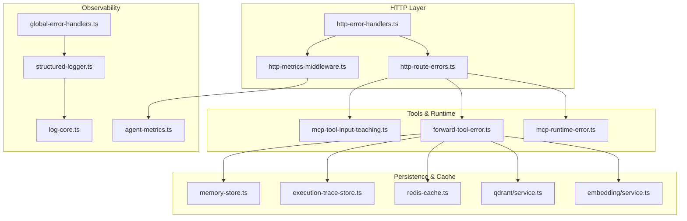

**Diagram sources**
- [http-error-handlers.ts](file://src/http/http-error-handlers.ts)
- [http-route-errors.ts](file://src/http/http-route-errors.ts)
- [http-metrics-middleware.ts](file://src/http/http-metrics-middleware.ts)
- [mcp-tool-input-teaching.ts](file://src/tools/mcp-tool-input-teaching.ts)
- [forward-tool-error.ts](file://src/tools/forward-tool-error.ts)
- [mcp-runtime-error.ts](file://src/tools/mcp-runtime-error.ts)
- [global-error-handlers.ts](file://src/utils/global-error-handlers.ts)
- [structured-logger.ts](file://src/utils/structured-logger.ts)
- [log-core.ts](file://src/utils/log-core.ts)
- [agent-metrics.ts](file://src/services/metrics/agent-metrics.ts)
- [memory-store.ts](file://src/services/memory-store.ts)
- [execution-trace-store.ts](file://src/services/execution-trace-store.ts)
- [redis-cache.ts](file://src/services/redis-cache.ts)
- [qdrant/service.ts](file://src/services/qdrant/service.ts)
- [embedding/service.ts](file://src/services/embedding/service.ts)

**Section sources**
- [http-error-handlers.ts](file://src/http/http-error-handlers.ts)
- [http-route-errors.ts](file://src/http/http-route-errors.ts)
- [mcp-tool-input-teaching.ts](file://src/tools/mcp-tool-input-teaching.ts)
- [forward-tool-error.ts](file://src/tools/forward-tool-error.ts)
- [mcp-runtime-error.ts](file://src/tools/mcp-runtime-error.ts)
- [global-error-handlers.ts](file://src/utils/global-error-handlers.ts)
- [structured-logger.ts](file://src/utils/structured-logger.ts)
- [log-core.ts](file://src/utils/log-core.ts)
- [http-metrics-middleware.ts](file://src/http/http-metrics-middleware.ts)
- [agent-metrics.ts](file://src/services/metrics/agent-metrics.ts)
- [memory-store.ts](file://src/services/memory-store.ts)
- [execution-trace-store.ts](file://src/services/execution-trace-store.ts)
- [redis-cache.ts](file://src/services/redis-cache.ts)
- [qdrant/service.ts](file://src/services/qdrant/service.ts)
- [embedding/service.ts](file://src/services/embedding/service.ts)

## Core Components
- HTTP error mapping and normalization: Centralizes conversion of internal errors to consistent HTTP responses and ensures route-level consistency.
- Tool runtime error classification: Distinguishes input validation errors from runtime failures (e.g., MCP tool invocation), providing actionable messages and codes.
- Global error handling: Catches unhandled exceptions, logs them, and emits metrics to avoid process crashes.
- Structured logging and metrics: Emits contextual logs and counters/gauges for error types, enabling observability and alerting.
- Persistence and cache interactions: Stores execution traces and state to support resumption; interacts with Redis and Qdrant/embedding services with error-aware logic.

**Section sources**
- [http-error-handlers.ts](file://src/http/http-error-handlers.ts)
- [http-route-errors.ts](file://src/http/http-route-errors.ts)
- [mcp-tool-input-teaching.ts](file://src/tools/mcp-tool-input-teaching.ts)
- [forward-tool-error.ts](file://src/tools/forward-tool-error.ts)
- [mcp-runtime-error.ts](file://src/tools/mcp-runtime-error.ts)
- [global-error-handlers.ts](file://src/utils/global-error-handlers.ts)
- [structured-logger.ts](file://src/utils/structured-logger.ts)
- [log-core.ts](file://src/utils/log-core.ts)
- [http-metrics-middleware.ts](file://src/http/http-metrics-middleware.ts)
- [agent-metrics.ts](file://src/services/metrics/agent-metrics.ts)
- [memory-store.ts](file://src/services/memory-store.ts)
- [execution-trace-store.ts](file://src/services/execution-trace-store.ts)
- [redis-cache.ts](file://src/services/redis-cache.ts)
- [qdrant/service.ts](file://src/services/qdrant/service.ts)
- [embedding/service.ts](file://src/services/embedding/service.ts)

## Architecture Overview
The error handling architecture follows a layered approach:
- HTTP layer normalizes errors and records metrics.
- Tool layer classifies errors and enriches context for users.
- Global handlers capture unexpected failures.
- Observability components log and emit metrics consistently.
- Persistence/cache layers record traces and state to enable recovery.

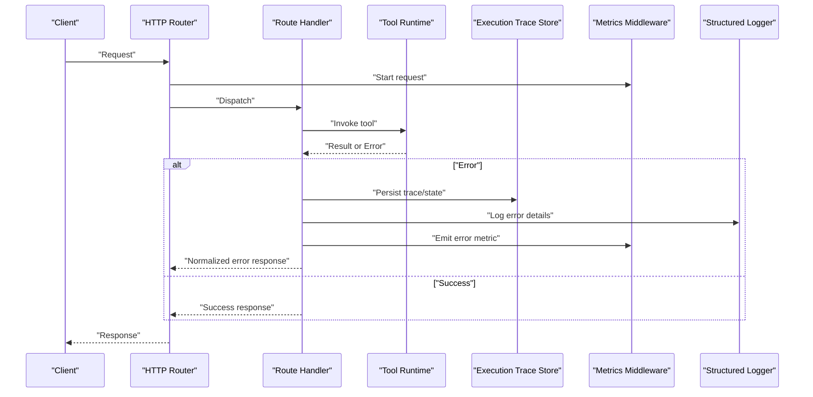

**Diagram sources**
- [http-route-errors.ts](file://src/http/http-route-errors.ts)
- [http-error-handlers.ts](file://src/http/http-error-handlers.ts)
- [http-metrics-middleware.ts](file://src/http/http-metrics-middleware.ts)
- [forward-tool-error.ts](file://src/tools/forward-tool-error.ts)
- [execution-trace-store.ts](file://src/services/execution-trace-store.ts)
- [structured-logger.ts](file://src/utils/structured-logger.ts)

## Detailed Component Analysis

### HTTP Error Mapping and Route-Level Normalization
- Purpose: Convert internal errors into standardized HTTP responses with consistent status codes, error codes, and messages.
- Behavior:
  - Validates incoming requests and maps known error categories to appropriate HTTP statuses.
  - Ensures sensitive details are not leaked while preserving enough context for debugging.
  - Integrates with metrics middleware to count error types per route.

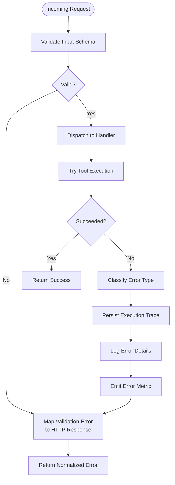

**Diagram sources**
- [http-route-errors.ts](file://src/http/http-route-errors.ts)
- [http-error-handlers.ts](file://src/http/http-error-handlers.ts)
- [http-metrics-middleware.ts](file://src/http/http-metrics-middleware.ts)
- [forward-tool-error.ts](file://src/tools/forward-tool-error.ts)
- [execution-trace-store.ts](file://src/services/execution-trace-store.ts)
- [structured-logger.ts](file://src/utils/structured-logger.ts)

**Section sources**
- [http-route-errors.ts](file://src/http/http-route-errors.ts)
- [http-error-handlers.ts](file://src/http/http-error-handlers.ts)
- [http-metrics-middleware.ts](file://src/http/http-metrics-middleware.ts)

### Tool Runtime Error Classification and Guidance
- Purpose: Differentiate between client-side validation errors and server/tool runtime errors, providing clear guidance and stable error codes.
- Behavior:
  - Input validation errors are surfaced early with precise field-level feedback.
  - Runtime errors (e.g., MCP tool invocation failures) include actionable hints and stable error identifiers.
  - Errors are persisted to execution traces for later inspection and resumption.

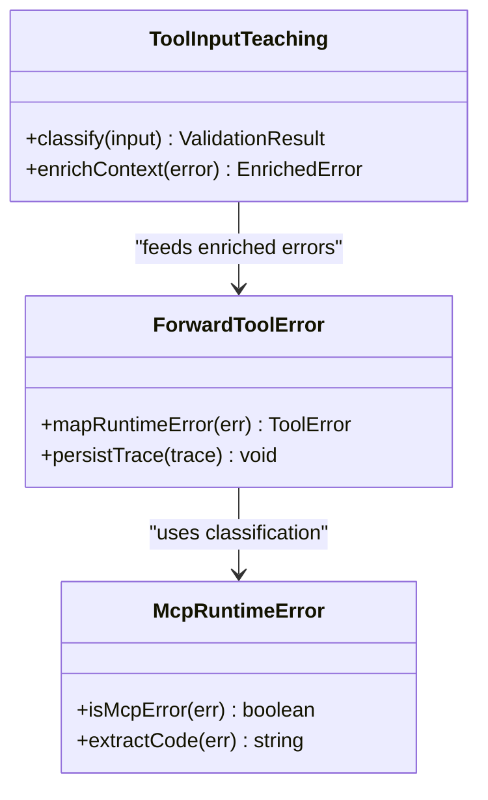

**Diagram sources**
- [mcp-tool-input-teaching.ts](file://src/tools/mcp-tool-input-teaching.ts)
- [forward-tool-error.ts](file://src/tools/forward-tool-error.ts)
- [mcp-runtime-error.ts](file://src/tools/mcp-runtime-error.ts)

**Section sources**
- [mcp-tool-input-teaching.ts](file://src/tools/mcp-tool-input-teaching.ts)
- [forward-tool-error.ts](file://src/tools/forward-tool-error.ts)
- [mcp-runtime-error.ts](file://src/tools/mcp-runtime-error.ts)

### Global Unhandled Exception Handling
- Purpose: Prevent process crashes by catching unhandled exceptions, logging them, and emitting metrics.
- Behavior:
  - Registers global handlers for uncaught exceptions and promise rejections.
  - Logs full stack traces and contextual metadata.
  - Emits failure metrics to ensure visibility even when expected paths fail.

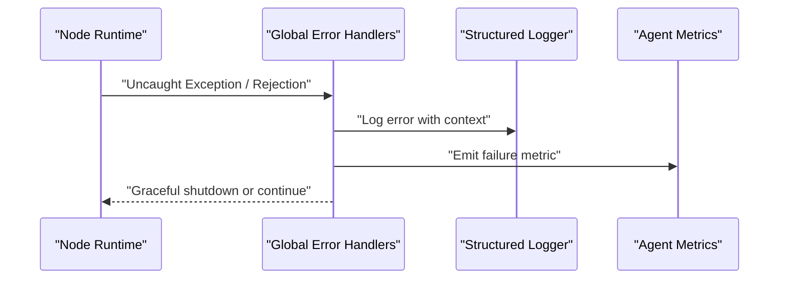

**Diagram sources**
- [global-error-handlers.ts](file://src/utils/global-error-handlers.ts)
- [structured-logger.ts](file://src/utils/structured-logger.ts)
- [log-core.ts](file://src/utils/log-core.ts)
- [agent-metrics.ts](file://src/services/metrics/agent-metrics.ts)

**Section sources**
- [global-error-handlers.ts](file://src/utils/global-error-handlers.ts)
- [structured-logger.ts](file://src/utils/structured-logger.ts)
- [log-core.ts](file://src/utils/log-core.ts)
- [agent-metrics.ts](file://src/services/metrics/agent-metrics.ts)

### Retry Logic with Exponential Backoff
- Purpose: Improve resilience against transient failures (network timeouts, rate limits).
- Behavior:
  - Retries are applied around external calls (e.g., embedding service, Qdrant) with configurable maximum attempts and backoff parameters.
  - Only transient errors trigger retries; permanent errors (validation, authorization) are not retried.
  - Each attempt is logged and counted via metrics.

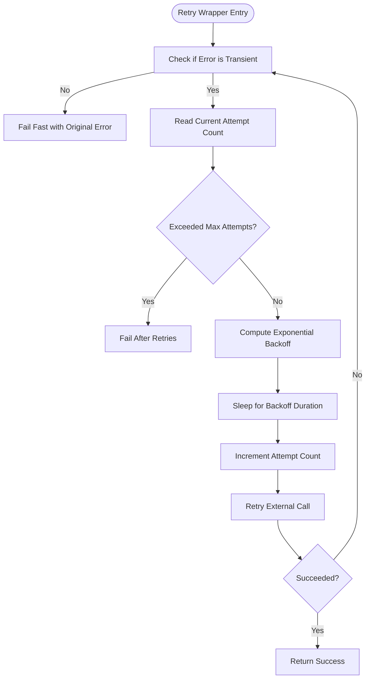

[No diagram sources since this flowchart illustrates a conceptual retry pattern]

**Section sources**
- [embedding/service.ts](file://src/services/embedding/service.ts)
- [qdrant/service.ts](file://src/services/qdrant/service.ts)
- [http-metrics-middleware.ts](file://src/http/http-metrics-middleware.ts)
- [agent-metrics.ts](file://src/services/metrics/agent-metrics.ts)

### Circuit Breaker Implementation
- Purpose: Protect downstream services from cascading failures by short-circuiting calls after repeated failures.
- Behavior:
  - Tracks failure rates over a sliding window.
  - Opens the circuit when thresholds are exceeded, returning immediate failures without calling the downstream service.
  - Allows periodic probes to half-open the circuit and validate recovery.

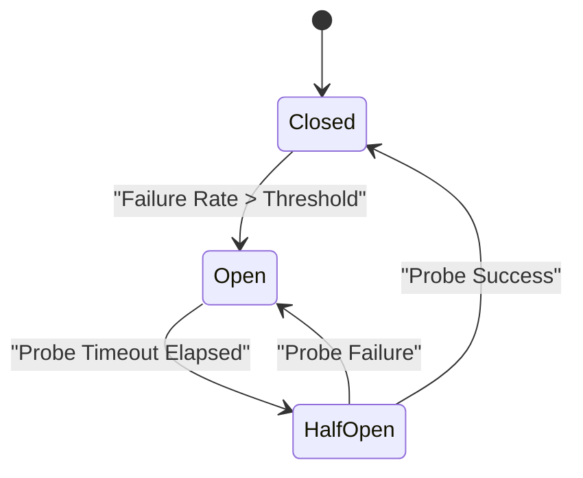

[No diagram sources since this state diagram shows conceptual circuit breaker behavior]

**Section sources**
- [embedding/service.ts](file://src/services/embedding/service.ts)
- [qdrant/service.ts](file://src/services/qdrant/service.ts)
- [http-metrics-middleware.ts](file://src/http/http-metrics-middleware.ts)
- [agent-metrics.ts](file://src/services/metrics/agent-metrics.ts)

### Fallback Strategies
- Purpose: Maintain partial functionality when primary operations fail.
- Behavior:
  - For read-heavy operations, fall back to cached results or stale data when primary stores are unavailable.
  - For write operations, queue or defer processing and persist an execution trace for later replay.
  - Provide degraded responses with explicit indicators to clients.

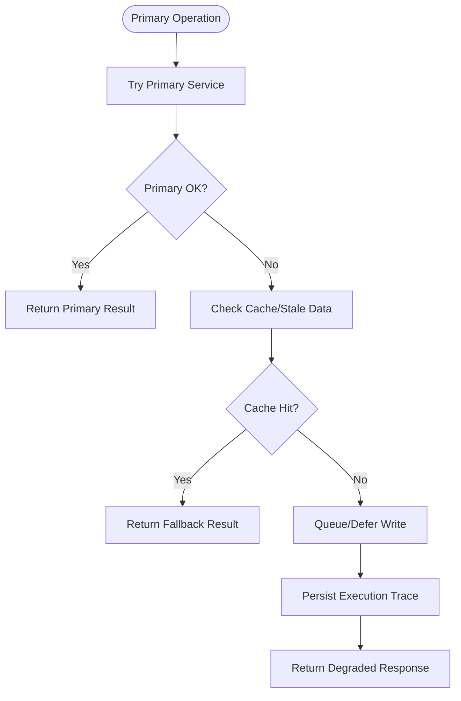

[No diagram sources since this flowchart illustrates conceptual fallback behavior]

**Section sources**
- [redis-cache.ts](file://src/services/redis-cache.ts)
- [execution-trace-store.ts](file://src/services/execution-trace-store.ts)
- [memory-store.ts](file://src/services/memory-store.ts)

### Recovery Mechanisms: Automatic Retries, Manual Intervention, and Resumption
- Automatic retries: Applied to transient errors with exponential backoff and bounded attempts.
- Manual intervention points:
  - Execution traces provide detailed context for operators to inspect and decide on remediation.
  - UI/API surfaces can expose “retry” actions for specific failed steps.
- Workflow resumption:
  - State and traces are persisted to allow restarting from the last successful step.
  - Idempotent operations are preferred to avoid side effects on retries.

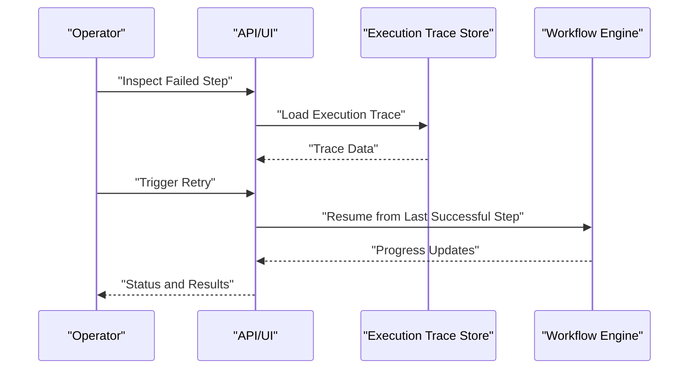

**Diagram sources**
- [execution-trace-store.ts](file://src/services/execution-trace-store.ts)
- [memory-store.ts](file://src/services/memory-store.ts)

**Section sources**
- [execution-trace-store.ts](file://src/services/execution-trace-store.ts)
- [memory-store.ts](file://src/services/memory-store.ts)

### Examples of Error Scenarios
- Tool failures:
  - MCP tool invocation errors are classified and mapped to user-friendly messages with stable error codes.
  - Execution traces capture inputs and outputs for post-mortem analysis.
- Network timeouts:
  - Timeouts are treated as transient and subject to retry with exponential backoff.
  - Circuit breaker opens if timeout rates exceed thresholds.
- Validation errors:
  - Input schema validation errors are returned immediately without retries.
  - Field-level guidance helps clients correct inputs.

**Section sources**
- [mcp-tool-input-teaching.ts](file://src/tools/mcp-tool-input-teaching.ts)
- [forward-tool-error.ts](file://src/tools/forward-tool-error.ts)
- [mcp-runtime-error.ts](file://src/tools/mcp-runtime-error.ts)
- [http-route-errors.ts](file://src/http/http-route-errors.ts)
- [http-error-handlers.ts](file://src/http/http-error-handlers.ts)

### Custom Error Handlers
- Implementations:
  - Route-level handlers normalize errors and attach metrics.
  - Tool-layer handlers classify and enrich errors before persistence and logging.
- Usage:
  - Wrap external calls with retry wrappers that respect transient vs. permanent errors.
  - Use circuit breakers around long-running or flaky dependencies.

**Section sources**
- [http-error-handlers.ts](file://src/http/http-error-handlers.ts)
- [http-route-errors.ts](file://src/http/http-route-errors.ts)
- [forward-tool-error.ts](file://src/tools/forward-tool-error.ts)
- [mcp-tool-input-teaching.ts](file://src/tools/mcp-tool-input-teaching.ts)

### Monitoring Integration for Error Tracking and Alerting
- Logging:
  - Structured logger emits contextual logs for all error paths.
- Metrics:
  - HTTP metrics middleware counts errors by type and route.
  - Agent metrics track tool failures, retries, and circuit breaker states.
- Traces:
  - Execution traces store detailed context for failed steps, enabling resumption and debugging.

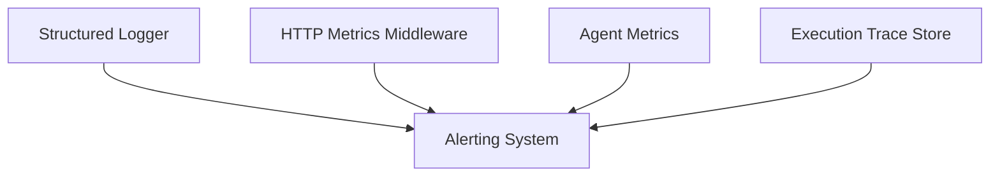

**Diagram sources**
- [structured-logger.ts](file://src/utils/structured-logger.ts)
- [http-metrics-middleware.ts](file://src/http/http-metrics-middleware.ts)
- [agent-metrics.ts](file://src/services/metrics/agent-metrics.ts)
- [execution-trace-store.ts](file://src/services/execution-trace-store.ts)

**Section sources**
- [structured-logger.ts](file://src/utils/structured-logger.ts)
- [http-metrics-middleware.ts](file://src/http/http-metrics-middleware.ts)
- [agent-metrics.ts](file://src/services/metrics/agent-metrics.ts)
- [execution-trace-store.ts](file://src/services/execution-trace-store.ts)

## Dependency Analysis
Error handling depends on several subsystems:
- HTTP layer depends on error mappers and metrics middleware.
- Tool layer depends on runtime error classification and persistence.
- Global handlers depend on logging and metrics.
- Persistence and cache layers support recovery and resumption.

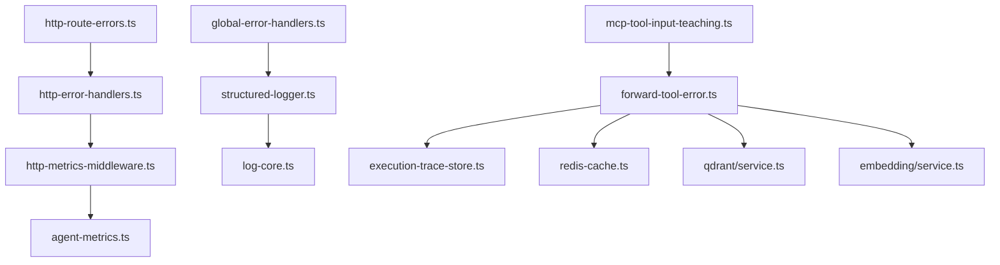

**Diagram sources**
- [http-error-handlers.ts](file://src/http/http-error-handlers.ts)
- [http-route-errors.ts](file://src/http/http-route-errors.ts)
- [http-metrics-middleware.ts](file://src/http/http-metrics-middleware.ts)
- [forward-tool-error.ts](file://src/tools/forward-tool-error.ts)
- [mcp-tool-input-teaching.ts](file://src/tools/mcp-tool-input-teaching.ts)
- [global-error-handlers.ts](file://src/utils/global-error-handlers.ts)
- [structured-logger.ts](file://src/utils/structured-logger.ts)
- [log-core.ts](file://src/utils/log-core.ts)
- [agent-metrics.ts](file://src/services/metrics/agent-metrics.ts)
- [execution-trace-store.ts](file://src/services/execution-trace-store.ts)
- [redis-cache.ts](file://src/services/redis-cache.ts)
- [qdrant/service.ts](file://src/services/qdrant/service.ts)
- [embedding/service.ts](file://src/services/embedding/service.ts)

**Section sources**
- [http-error-handlers.ts](file://src/http/http-error-handlers.ts)
- [http-route-errors.ts](file://src/http/http-route-errors.ts)
- [http-metrics-middleware.ts](file://src/http/http-metrics-middleware.ts)
- [forward-tool-error.ts](file://src/tools/forward-tool-error.ts)
- [mcp-tool-input-teaching.ts](file://src/tools/mcp-tool-input-teaching.ts)
- [global-error-handlers.ts](file://src/utils/global-error-handlers.ts)
- [structured-logger.ts](file://src/utils/structured-logger.ts)
- [log-core.ts](file://src/utils/log-core.ts)
- [agent-metrics.ts](file://src/services/metrics/agent-metrics.ts)
- [execution-trace-store.ts](file://src/services/execution-trace-store.ts)
- [redis-cache.ts](file://src/services/redis-cache.ts)
- [qdrant/service.ts](file://src/services/qdrant/service.ts)
- [embedding/service.ts](file://src/services/embedding/service.ts)

## Performance Considerations
- Avoid excessive retries: Configure max attempts and backoff caps to prevent amplification under load.
- Prefer idempotent operations: Ensure retries do not cause duplicate side effects.
- Use caching strategically: Serve stale data for reads when primary stores are down to maintain responsiveness.
- Monitor metrics closely: Track error rates, retry counts, and circuit breaker states to tune thresholds.

[No sources needed since this section provides general guidance]

## Troubleshooting Guide
- Symptom: Frequent tool invocation failures
  - Check execution traces for inputs and outputs.
  - Verify MCP tool contracts and environment connectivity.
- Symptom: High timeout rates
  - Inspect circuit breaker state and adjust thresholds.
  - Review retry configuration and backoff settings.
- Symptom: Validation errors
  - Correct client payloads based on field-level guidance.
  - Update schemas if requirements change.

**Section sources**
- [execution-trace-store.ts](file://src/services/execution-trace-store.ts)
- [mcp-tool-input-teaching.ts](file://src/tools/mcp-tool-input-teaching.ts)
- [forward-tool-error.ts](file://src/tools/forward-tool-error.ts)

## Conclusion
The engine’s error handling strategy combines robust classification, normalized HTTP responses, structured logging, and comprehensive metrics. Transient failures are mitigated through retries with exponential backoff and circuit breakers, while persistent issues are surfaced with actionable guidance. Execution traces and caches enable recovery and resumption, ensuring workflows remain resilient and observable.