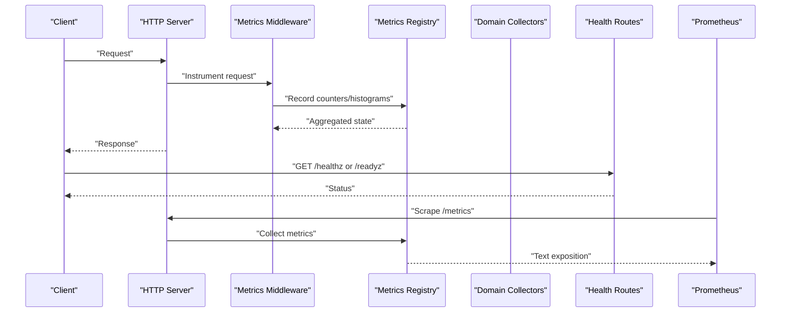
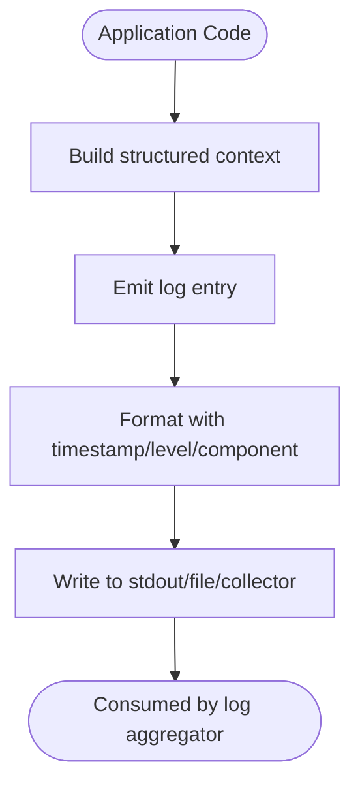
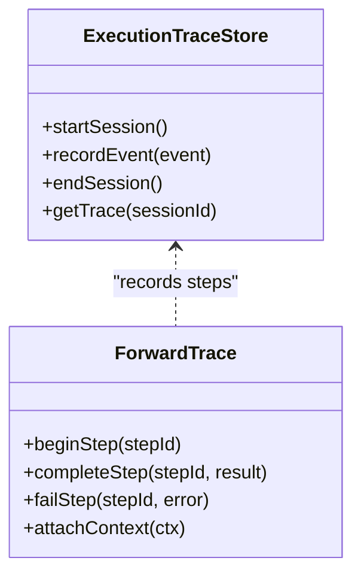
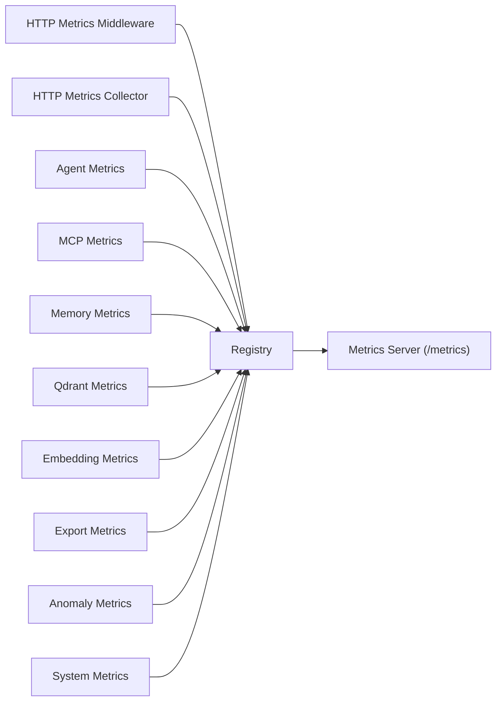
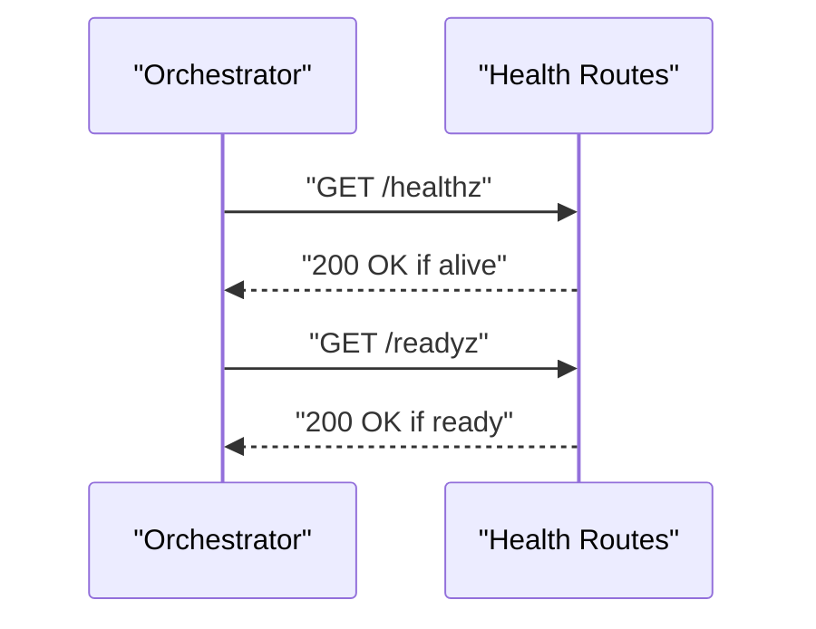
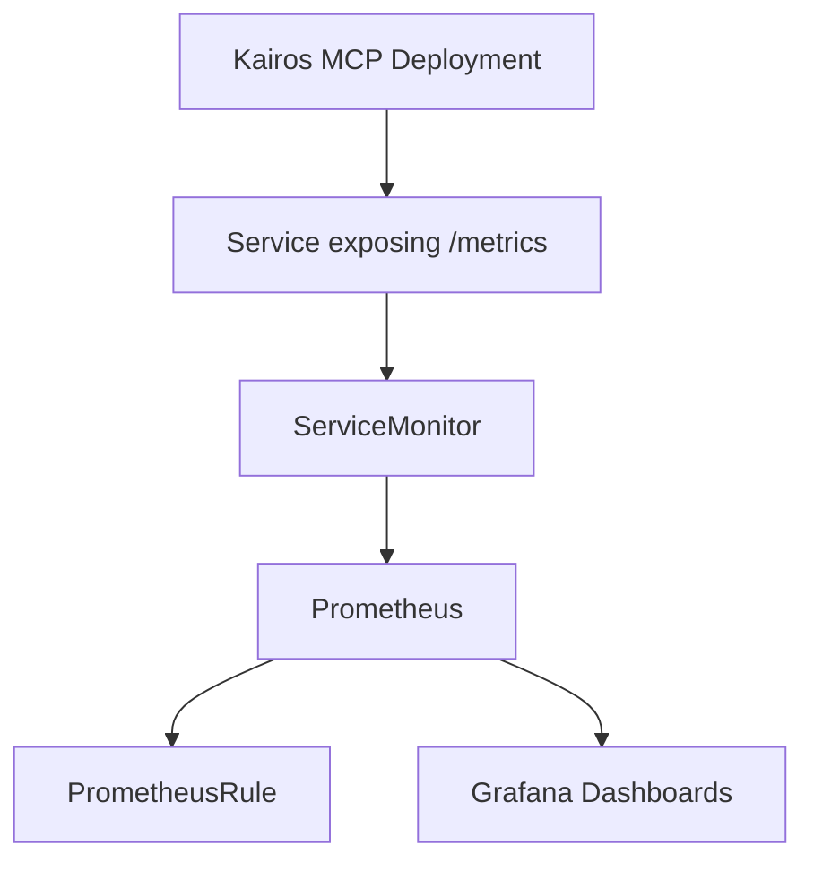
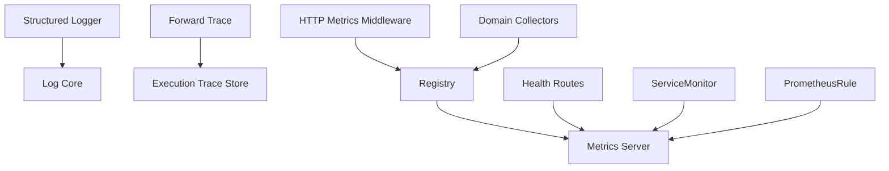

# Monitoring and Debugging

<cite>
**Referenced Files in This Document**
- [structured-logger.ts](file://src/utils/structured-logger.ts)
- [log-core.ts](file://src/utils/log-core.ts)
- [execution-trace-store.ts](file://src/services/execution-trace-store.ts)
- [forward-trace.ts](file://src/tools/forward-trace.ts)
- [http-metrics-middleware.ts](file://src/http/http-metrics-middleware.ts)
- [metrics-server.ts](file://src/metrics-server.ts)
- [registry.ts](file://src/services/metrics/registry.ts)
- [http-metrics.ts](file://src/services/metrics/http-metrics.ts)
- [agent-metrics.ts](file://src/services/metrics/agent-metrics.ts)
- [mcp-metrics.ts](file://src/services/metrics/mcp-metrics.ts)
- [memory-metrics.ts](file://src/services/metrics/memory-metrics.ts)
- [qdrant-metrics.ts](file://src/services/metrics/qdrant-metrics.ts)
- [embedding-metrics.ts](file://src/services/metrics/embedding-metrics.ts)
- [export-metrics.ts](file://src/services/metrics/export-metrics.ts)
- [anomaly-metrics.ts](file://src/services/metrics/anomaly-metrics.ts)
- [system-metrics.ts](file://src/services/metrics/system-metrics.ts)
- [http-health-routes.ts](file://src/http/http-health-routes.ts)
- [prometheusrule.yaml](file://helm/kairos-mcp/templates/prometheusrule.yaml)
- [app-servicemonitor.yaml](file://helm/kairos-mcp/templates/app-servicemonitor.yaml)
- [kairos-mcp-deployment.yaml](file://helm/kairos-mcp/templates/kairos-mcp-deployment.yaml)
- [values.yaml](file://helm/kairos-mcp/values.yaml)
- [metrics-endpoint.test.ts](file://tests/integration/metrics-endpoint.test.ts)
- [prometheus-scrape.test.ts](file://tests/integration/prometheus-scrape.test.ts)
</cite>

## Table of Contents
1. [Introduction](#introduction)
2. [Project Structure](#project-structure)
3. [Core Components](#core-components)
4. [Architecture Overview](#architecture-overview)
5. [Detailed Component Analysis](#detailed-component-analysis)
6. [Dependency Analysis](#dependency-analysis)
7. [Performance Considerations](#performance-considerations)
8. [Troubleshooting Guide](#troubleshooting-guide)
9. [Conclusion](#conclusion)
10. [Appendices](#appendices)

## Introduction
This document explains the monitoring and debugging capabilities of the system with a focus on:
- Execution trace system for workflow progress, tool invocations, and performance metrics
- Logging framework and structured logging patterns
- Metrics collection system including custom metrics, performance indicators, and health checks
- Debugging workflows, tracing execution paths, analyzing performance bottlenecks
- Integration with external monitoring systems like Prometheus and Grafana

The goal is to provide both high-level understanding and actionable guidance for operators and developers.

## Project Structure
Monitoring and debugging features are implemented across utilities, services, HTTP layer, Helm charts, and tests:
- Structured logging utilities under utils
- Execution trace storage and forward tracing under services and tools
- Metrics registry and domain-specific metric collectors under services/metrics
- HTTP middleware for request-level metrics and health endpoints under http
- Prometheus integration via ServiceMonitor and PrometheusRule in helm templates
- Tests validating metrics exposure and scraping behavior

```mermaid
graph TB
subgraph "Logging"
SL["Structured Logger<br/>utils/structured-logger.ts"]
LC["Log Core<br/>utils/log-core.ts"]
end
subgraph "Tracing"
ETS["Execution Trace Store<br/>services/execution-trace-store.ts"]
FT["Forward Trace<br/>tools/forward-trace.ts"]
end
subgraph "Metrics"
REG["Registry<br/>services/metrics/registry.ts"]
HMW["HTTP Metrics Middleware<br/>http/http-metrics-middleware.ts"]
MS["Metrics Server<br/>metrics-server.ts"]
HMM["HTTP Metrics Collector<br/>services/metrics/http-metrics.ts"]
AM["Agent Metrics<br/>services/metrics/agent-metrics.ts"]
MCM["MCP Metrics<br/>services/metrics/mcp-metrics.ts"]
MEMM["Memory Metrics<br/>services/metrics/memory-metrics.ts"]
QDM["Qdrant Metrics<br/>services/metrics/qdrant-metrics.ts"]
EMM["Embedding Metrics<br/>services/metrics/embedding-metrics.ts"]
EXM["Export Metrics<br/>services/metrics/export-metrics.ts"]
ANM["Anomaly Metrics<br/>services/metrics/anomaly-metrics.ts"]
SYM["System Metrics<br/>services/metrics/system-metrics.ts"]
end
subgraph "Health"
HR["Health Routes<br/>http/http-health-routes.ts"]
end
subgraph "Prometheus Integration"
SM["ServiceMonitor<br/>helm/.../app-servicemonitor.yaml"]
PR["PrometheusRule<br/>helm/.../prometheusrule.yaml"]
end
SL --> LC
FT --> ETS
HMW --> REG
MS --> REG
HMM --> REG
AM --> REG
MCM --> REG
MEMM --> REG
QDM --> REG
EMM --> REG
EXM --> REG
ANM --> REG
SYM --> REG
HR --> MS
SM --> MS
PR --> MS
```

**Diagram sources**
- [structured-logger.ts](file://src/utils/structured-logger.ts)
- [log-core.ts](file://src/utils/log-core.ts)
- [execution-trace-store.ts](file://src/services/execution-trace-store.ts)
- [forward-trace.ts](file://src/tools/forward-trace.ts)
- [http-metrics-middleware.ts](file://src/http/http-metrics-middleware.ts)
- [metrics-server.ts](file://src/metrics-server.ts)
- [registry.ts](file://src/services/metrics/registry.ts)
- [http-metrics.ts](file://src/services/metrics/http-metrics.ts)
- [agent-metrics.ts](file://src/services/metrics/agent-metrics.ts)
- [mcp-metrics.ts](file://src/services/metrics/mcp-metrics.ts)
- [memory-metrics.ts](file://src/services/metrics/memory-metrics.ts)
- [qdrant-metrics.ts](file://src/services/metrics/qdrant-metrics.ts)
- [embedding-metrics.ts](file://src/services/metrics/embedding-metrics.ts)
- [export-metrics.ts](file://src/services/metrics/export-metrics.ts)
- [anomaly-metrics.ts](file://src/services/metrics/anomaly-metrics.ts)
- [system-metrics.ts](file://src/services/metrics/system-metrics.ts)
- [http-health-routes.ts](file://src/http/http-health-routes.ts)
- [app-servicemonitor.yaml](file://helm/kairos-mcp/templates/app-servicemonitor.yaml)
- [prometheusrule.yaml](file://helm/kairos-mcp/templates/prometheusrule.yaml)

**Section sources**
- [structured-logger.ts](file://src/utils/structured-logger.ts)
- [log-core.ts](file://src/utils/log-core.ts)
- [execution-trace-store.ts](file://src/services/execution-trace-store.ts)
- [forward-trace.ts](file://src/tools/forward-trace.ts)
- [http-metrics-middleware.ts](file://src/http/http-metrics-middleware.ts)
- [metrics-server.ts](file://src/metrics-server.ts)
- [registry.ts](file://src/services/metrics/registry.ts)
- [http-metrics.ts](file://src/services/metrics/http-metrics.ts)
- [agent-metrics.ts](file://src/services/metrics/agent-metrics.ts)
- [mcp-metrics.ts](file://src/services/metrics/mcp-metrics.ts)
- [memory-metrics.ts](file://src/services/metrics/memory-metrics.ts)
- [qdrant-metrics.ts](file://src/services/metrics/qdrant-metrics.ts)
- [embedding-metrics.ts](file://src/services/metrics/embedding-metrics.ts)
- [export-metrics.ts](file://src/services/metrics/export-metrics.ts)
- [anomaly-metrics.ts](file://src/services/metrics/anomaly-metrics.ts)
- [system-metrics.ts](file://src/services/metrics/system-metrics.ts)
- [http-health-routes.ts](file://src/http/http-health-routes.ts)
- [app-servicemonitor.yaml](file://helm/kairos-mcp/templates/app-servicemonitor.yaml)
- [prometheusrule.yaml](file://helm/kairos-mcp/templates/prometheusrule.yaml)

## Core Components
- Structured logging framework provides consistent log formats and context propagation across components.
- Execution trace store captures workflow lifecycle events, tool calls, and timing data for post-run analysis.
- Forward tracing integrates into the forward workflow to record step-by-step progress and outcomes.
- Metrics registry centralizes metric definitions and exposes them via an HTTP endpoint.
- Domain-specific collectors instrument HTTP requests, agent operations, MCP interactions, memory/Qdrant operations, embeddings, exports, anomalies, and system resources.
- Health routes expose readiness/liveness probes for orchestration platforms.
- Prometheus integration is configured through Kubernetes ServiceMonitor and PrometheusRule resources.

**Section sources**
- [structured-logger.ts](file://src/utils/structured-logger.ts)
- [log-core.ts](file://src/utils/log-core.ts)
- [execution-trace-store.ts](file://src/services/execution-trace-store.ts)
- [forward-trace.ts](file://src/tools/forward-trace.ts)
- [registry.ts](file://src/services/metrics/registry.ts)
- [http-metrics-middleware.ts](file://src/http/http-metrics-middleware.ts)
- [metrics-server.ts](file://src/metrics-server.ts)
- [http-health-routes.ts](file://src/http/http-health-routes.ts)
- [app-servicemonitor.yaml](file://helm/kairos-mcp/templates/app-servicemonitor.yaml)
- [prometheusrule.yaml](file://helm/kairos-mcp/templates/prometheusrule.yaml)

## Architecture Overview
The monitoring stack combines structured logs, execution traces, and Prometheus-compatible metrics. The HTTP server exposes metrics and health endpoints. Prometheus scrapes the metrics endpoint using a ServiceMonitor, and alerting rules are defined via PrometheusRule.

**Diagram sources**
- [http-metrics-middleware.ts](file://src/http/http-metrics-middleware.ts)
- [registry.ts](file://src/services/metrics/registry.ts)
- [metrics-server.ts](file://src/metrics-server.ts)
- [http-health-routes.ts](file://src/http/http-health-routes.ts)
- [app-servicemonitor.yaml](file://helm/kairos-mcp/templates/app-servicemonitor.yaml)

## Detailed Component Analysis

### Logging Framework and Structured Logging Patterns
- Centralized logger abstraction ensures consistent fields (timestamp, level, component, correlation IDs).
- Log core handles output formatting and transport configuration.
- Recommended patterns:
  - Include stable identifiers (workflow ID, step ID, tool name) for cross-correlation.
  - Use structured fields instead of string interpolation for machine readability.
  - Avoid logging sensitive data; sanitize inputs before emission.

**Section sources**
- [structured-logger.ts](file://src/utils/structured-logger.ts)
- [log-core.ts](file://src/utils/log-core.ts)

### Execution Trace System
- Execution trace store persists workflow lifecycle events, enabling replay and inspection after completion.
- Forward tracing records per-step details during runtime, capturing inputs, outputs, errors, and durations.
- Typical usage:
  - Initialize a trace session at workflow start.
  - Record tool invocations with parameters and results.
  - Attach timing metadata for performance analysis.
  - Persist final trace for export or UI visualization.

**Diagram sources**
- [execution-trace-store.ts](file://src/services/execution-trace-store.ts)
- [forward-trace.ts](file://src/tools/forward-trace.ts)

**Section sources**
- [execution-trace-store.ts](file://src/services/execution-trace-store.ts)
- [forward-trace.ts](file://src/tools/forward-trace.ts)

### Metrics Collection System
- Registry centralizes metric definitions and provides APIs for counters, gauges, histograms, and summaries.
- Domain collectors instrument specific subsystems:
  - HTTP metrics: request counts, latencies, status codes
  - Agent metrics: agent actions, success/failure rates
  - MCP metrics: tool call volumes, latency distributions
  - Memory metrics: cache hits/misses, indexing throughput
  - Qdrant metrics: vector operations, query latency
  - Embedding metrics: embedding generation counts and durations
  - Export metrics: export job lifecycle and sizes
  - Anomaly metrics: detected anomalies and severity
  - System metrics: resource utilization and process stats
- HTTP metrics middleware automatically instruments incoming requests and responses.
- Metrics server exposes a Prometheus-compatible endpoint.

**Diagram sources**
- [http-metrics-middleware.ts](file://src/http/http-metrics-middleware.ts)
- [registry.ts](file://src/services/metrics/registry.ts)
- [http-metrics.ts](file://src/services/metrics/http-metrics.ts)
- [agent-metrics.ts](file://src/services/metrics/agent-metrics.ts)
- [mcp-metrics.ts](file://src/services/metrics/mcp-metrics.ts)
- [memory-metrics.ts](file://src/services/metrics/memory-metrics.ts)
- [qdrant-metrics.ts](file://src/services/metrics/qdrant-metrics.ts)
- [embedding-metrics.ts](file://src/services/metrics/embedding-metrics.ts)
- [export-metrics.ts](file://src/services/metrics/export-metrics.ts)
- [anomaly-metrics.ts](file://src/services/metrics/anomaly-metrics.ts)
- [system-metrics.ts](file://src/services/metrics/system-metrics.ts)
- [metrics-server.ts](file://src/metrics-server.ts)

**Section sources**
- [registry.ts](file://src/services/metrics/registry.ts)
- [http-metrics-middleware.ts](file://src/http/http-metrics-middleware.ts)
- [metrics-server.ts](file://src/metrics-server.ts)
- [http-metrics.ts](file://src/services/metrics/http-metrics.ts)
- [agent-metrics.ts](file://src/services/metrics/agent-metrics.ts)
- [mcp-metrics.ts](file://src/services/metrics/mcp-metrics.ts)
- [memory-metrics.ts](file://src/services/metrics/memory-metrics.ts)
- [qdrant-metrics.ts](file://src/services/metrics/qdrant-metrics.ts)
- [embedding-metrics.ts](file://src/services/metrics/embedding-metrics.ts)
- [export-metrics.ts](file://src/services/metrics/export-metrics.ts)
- [anomaly-metrics.ts](file://src/services/metrics/anomaly-metrics.ts)
- [system-metrics.ts](file://src/services/metrics/system-metrics.ts)

### Health Checks
- Health routes provide liveness and readiness endpoints used by orchestrators.
- Liveness indicates process health; readiness indicates service readiness (dependencies available).
- Integrate with container orchestration probes to enable auto-restarts and traffic routing decisions.

**Diagram sources**
- [http-health-routes.ts](file://src/http/http-health-routes.ts)

**Section sources**
- [http-health-routes.ts](file://src/http/http-health-routes.ts)

### Prometheus and Grafana Integration
- ServiceMonitor configures Prometheus to scrape the application’s metrics endpoint.
- PrometheusRule defines alerting conditions based on collected metrics.
- Deployment values control whether metrics and health endpoints are exposed.

**Diagram sources**
- [app-servicemonitor.yaml](file://helm/kairos-mcp/templates/app-servicemonitor.yaml)
- [prometheusrule.yaml](file://helm/kairos-mcp/templates/prometheusrule.yaml)
- [kairos-mcp-deployment.yaml](file://helm/kairos-mcp/templates/kairos-mcp-deployment.yaml)
- [values.yaml](file://helm/kairos-mcp/values.yaml)

**Section sources**
- [app-servicemonitor.yaml](file://helm/kairos-mcp/templates/app-servicemonitor.yaml)
- [prometheusrule.yaml](file://helm/kairos-mcp/templates/prometheusrule.yaml)
- [kairos-mcp-deployment.yaml](file://helm/kairos-mcp/templates/kairos-mcp-deployment.yaml)
- [values.yaml](file://helm/kairos-mcp/values.yaml)

## Dependency Analysis
- Logging depends on a core formatter and transport abstraction.
- Tracing depends on the execution trace store and forward tracing utilities.
- Metrics depend on a central registry and multiple domain collectors.
- HTTP middleware depends on the registry to record request-level metrics.
- Health routes operate independently but may rely on dependency checks internally.
- Prometheus integration depends on deployment configuration and ServiceMonitor/PrometheusRule resources.

**Diagram sources**
- [structured-logger.ts](file://src/utils/structured-logger.ts)
- [log-core.ts](file://src/utils/log-core.ts)
- [forward-trace.ts](file://src/tools/forward-trace.ts)
- [execution-trace-store.ts](file://src/services/execution-trace-store.ts)
- [http-metrics-middleware.ts](file://src/http/http-metrics-middleware.ts)
- [registry.ts](file://src/services/metrics/registry.ts)
- [metrics-server.ts](file://src/metrics-server.ts)
- [http-health-routes.ts](file://src/http/http-health-routes.ts)
- [app-servicemonitor.yaml](file://helm/kairos-mcp/templates/app-servicemonitor.yaml)
- [prometheusrule.yaml](file://helm/kairos-mcp/templates/prometheusrule.yaml)

**Section sources**
- [structured-logger.ts](file://src/utils/structured-logger.ts)
- [log-core.ts](file://src/utils/log-core.ts)
- [forward-trace.ts](file://src/tools/forward-trace.ts)
- [execution-trace-store.ts](file://src/services/execution-trace-store.ts)
- [http-metrics-middleware.ts](file://src/http/http-metrics-middleware.ts)
- [registry.ts](file://src/services/metrics/registry.ts)
- [metrics-server.ts](file://src/metrics-server.ts)
- [http-health-routes.ts](file://src/http/http-health-routes.ts)
- [app-servicemonitor.yaml](file://helm/kairos-mcp/templates/app-servicemonitor.yaml)
- [prometheusrule.yaml](file://helm/kairos-mcp/templates/prometheusrule.yaml)

## Performance Considerations
- Prefer histograms over summaries for quantile-based latency metrics when using Prometheus.
- Limit cardinality of labels to avoid high memory usage and slow queries.
- Batch or sample expensive instrumentation where appropriate.
- Use structured logging to reduce parsing overhead downstream.
- Ensure health endpoints are lightweight and fast to respond.

[No sources needed since this section provides general guidance]

## Troubleshooting Guide
Common issues and resolutions:
- Metrics not scraped:
  - Verify ServiceMonitor targets the correct port and path.
  - Confirm deployment exposes the metrics endpoint and network policies allow scraping.
  - Check Prometheus logs for connection errors.
- High cardinality causing slow queries:
  - Review label choices in custom metrics; remove unstable identifiers.
- Health checks failing:
  - Inspect dependency readiness (database, vector store, cache).
  - Validate internal timeouts and retry logic.
- Logs missing or unstructured:
  - Ensure structured logger is initialized and context fields are attached consistently.
- Traces incomplete:
  - Confirm trace sessions are started and ended around full workflow lifecycles.
  - Validate that forward tracing hooks are invoked for each step.

**Section sources**
- [app-servicemonitor.yaml](file://helm/kairos-mcp/templates/app-servicemonitor.yaml)
- [kairos-mcp-deployment.yaml](file://helm/kairos-mcp/templates/kairos-mcp-deployment.yaml)
- [http-health-routes.ts](file://src/http/http-health-routes.ts)
- [structured-logger.ts](file://src/utils/structured-logger.ts)
- [execution-trace-store.ts](file://src/services/execution-trace-store.ts)
- [forward-trace.ts](file://src/tools/forward-trace.ts)

## Conclusion
The system provides a comprehensive monitoring and debugging foundation:
- Structured logging for consistent observability
- Execution traces for detailed workflow introspection
- Rich metrics across domains with Prometheus compatibility
- Health endpoints for orchestration integration
- Clear paths to integrate with Grafana dashboards and alerting rules

Adopting these practices enables effective troubleshooting, performance tuning, and operational reliability.

[No sources needed since this section summarizes without analyzing specific files]

## Appendices

### Example Debugging Workflows
- Reproduce an issue and capture logs with correlation IDs.
- Retrieve the execution trace for the failed workflow and inspect step timings and payloads.
- Correlate HTTP request metrics with backend processing times.
- Query Prometheus for relevant counters and histograms to identify spikes or regressions.
- Create or update Grafana panels to visualize key KPIs and set alerts.

[No sources needed since this section doesn't analyze specific files]

### Validating Metrics Exposure and Scraping
- Run integration tests to verify metrics endpoint availability and content format.
- Use Prometheus scraping tests to ensure ServiceMonitor configuration works end-to-end.

**Section sources**
- [metrics-endpoint.test.ts](file://tests/integration/metrics-endpoint.test.ts)
- [prometheus-scrape.test.ts](file://tests/integration/prometheus-scrape.test.ts)