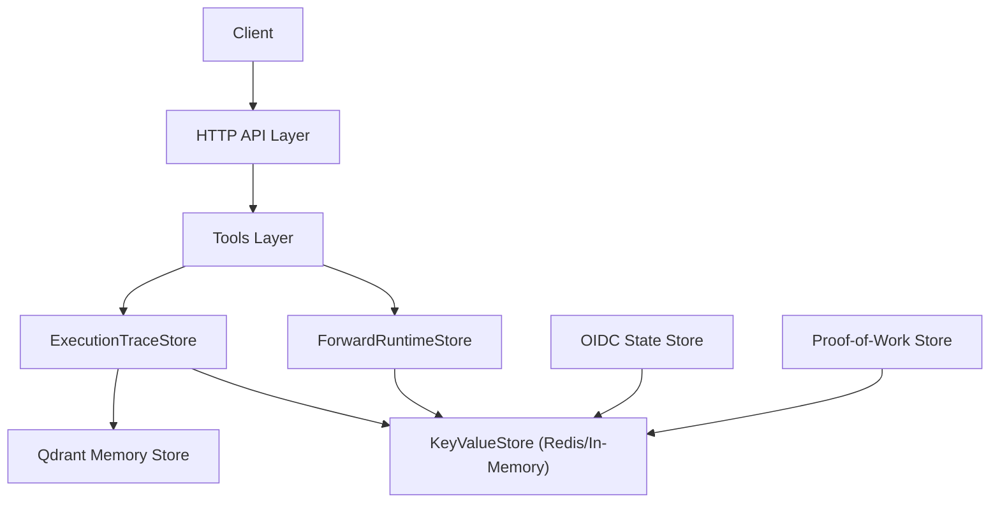
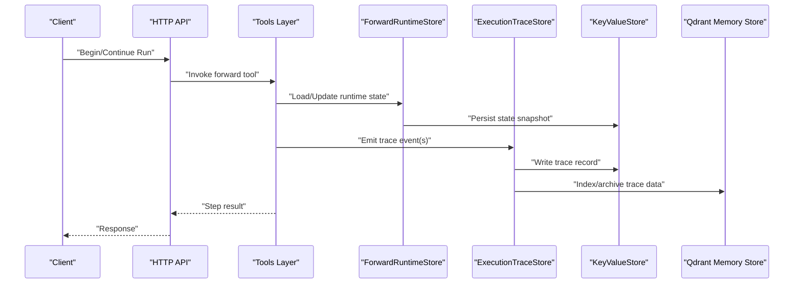
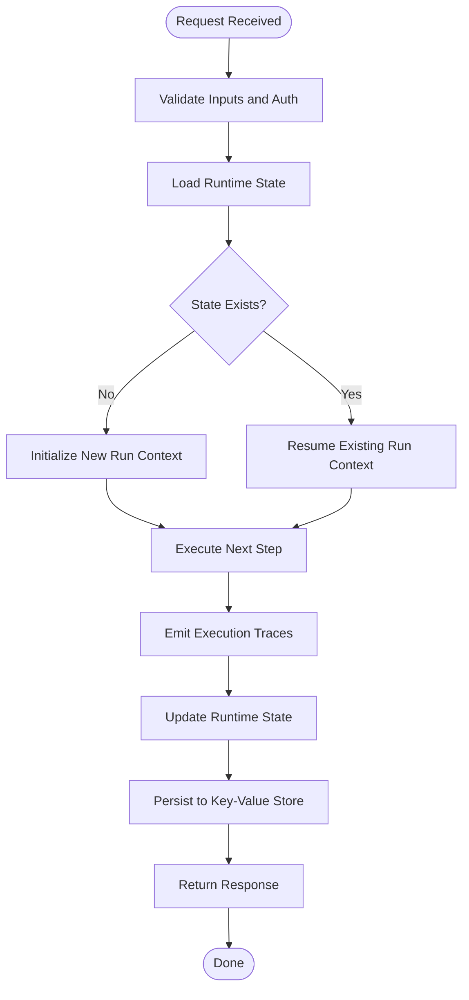
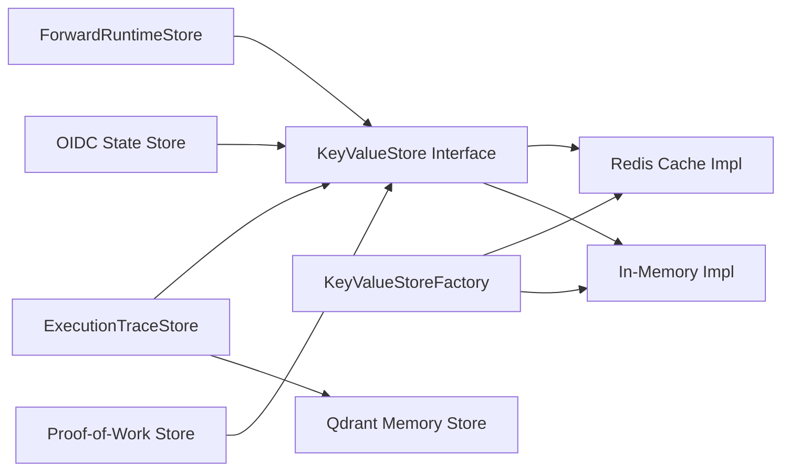

# State Management and Persistence

<cite>
**Referenced Files in This Document**
- [execution-trace-store.ts](file://src/services/execution-trace-store.ts)
- [forward-runtime-store.ts](file://src/services/forward-runtime-store.ts)
- [key-value-store-factory.ts](file://src/services/key-value-store-factory.ts)
- [key-value-store.ts](file://src/services/key-value-store.ts)
- [redis-cache.ts](file://src/services/redis-cache.ts)
- [qdrant-memory-store.ts](file://src/services/qdrant/memory-store.ts)
- [memory-store.ts](file://src/services/memory-store.ts)
- [http-api-forward.ts](file://src/http/http-api-forward.ts)
- [tools-forward.ts](file://src/tools/forward.ts)
- [tools-forward-trace.ts](file://src/tools/forward-trace.ts)
- [tools-next.ts](file://src/tools/next.ts)
- [oidc-state-store.ts](file://src/services/oidc-state-store.ts)
- [proof-of-work-store.ts](file://src/services/proof-of-work-store.ts)
</cite>

## Table of Contents
1. [Introduction](#introduction)
2. [Project Structure](#project-structure)
3. [Core Components](#core-components)
4. [Architecture Overview](#architecture-overview)
5. [Detailed Component Analysis](#detailed-component-analysis)
6. [Dependency Analysis](#dependency-analysis)
7. [Performance Considerations](#performance-considerations)
8. [Troubleshooting Guide](#troubleshooting-guide)
9. [Conclusion](#conclusion)

## Introduction
This document explains how workflow state is tracked, stored, and retrieved during execution, with a focus on the execution trace system, persistence backends, serialization formats, snapshots, rollback strategies, migration approaches, and concurrency guarantees for distributed runs. It covers both the runtime forward pipeline and auxiliary state stores used by the application.

## Project Structure
The state management and persistence logic spans several layers:
- HTTP API layer that orchestrates workflow operations
- Tooling layer that executes steps and emits traces
- Runtime store that maintains per-run context
- Execution trace store that persists step-level progress and tool invocations
- Key-value abstraction over Redis or in-memory storage
- Specialized stores for OIDC state and proof-of-work artifacts

**Diagram sources**
- [http-api-forward.ts](file://src/http/http-api-forward.ts)
- [tools-forward.ts](file://src/tools/forward.ts)
- [forward-runtime-store.ts](file://src/services/forward-runtime-store.ts)
- [execution-trace-store.ts](file://src/services/execution-trace-store.ts)
- [key-value-store-factory.ts](file://src/services/key-value-store-factory.ts)
- [key-value-store.ts](file://src/services/key-value-store.ts)
- [redis-cache.ts](file://src/services/redis-cache.ts)
- [qdrant-memory-store.ts](file://src/services/qdrant/memory-store.ts)
- [oidc-state-store.ts](file://src/services/oidc-state-store.ts)
- [proof-of-work-store.ts](file://src/services/proof-of-work-store.ts)

**Section sources**
- [http-api-forward.ts](file://src/http/http-api-forward.ts)
- [tools-forward.ts](file://src/tools/forward.ts)
- [forward-runtime-store.ts](file://src/services/forward-runtime-store.ts)
- [execution-trace-store.ts](file://src/services/execution-trace-store.ts)
- [key-value-store-factory.ts](file://src/services/key-value-store-factory.ts)
- [key-value-store.ts](file://src/services/key-value-store.ts)
- [redis-cache.ts](file://src/services/redis-cache.ts)
- [qdrant-memory-store.ts](file://src/services/qdrant/memory-store.ts)
- [oidc-state-store.ts](file://src/services/oidc-state-store.ts)
- [proof-of-work-store.ts](file://src/services/proof-of-work-store.ts)

## Core Components
- ForwardRuntimeStore: Holds transient per-run context such as current step, inputs, outputs, and control flags. It is persisted to key-value storage to survive restarts and enable continuation.
- ExecutionTraceStore: Records detailed execution events including step transitions, tool calls, arguments, results, errors, and timestamps. It also integrates with Qdrant for long-term archival and searchability.
- KeyValueStore abstraction: A pluggable backend interface implemented by Redis-backed cache and an in-memory fallback. Provides atomic get/set/delete and optional TTL semantics.
- OIDC State Store and Proof-of-Work Store: Domain-specific stores using the same key-value abstraction for short-lived or cryptographic artifacts.

Key responsibilities:
- Track workflow lifecycle states (begin, running, completed, failed)
- Persist intermediate results and metadata
- Provide consistent reads/writes under concurrent access
- Support snapshots and recovery points
- Enable auditability via execution traces

**Section sources**
- [forward-runtime-store.ts](file://src/services/forward-runtime-store.ts)
- [execution-trace-store.ts](file://src/services/execution-trace-store.ts)
- [key-value-store-factory.ts](file://src/services/key-value-store-factory.ts)
- [key-value-store.ts](file://src/services/key-value-store.ts)
- [redis-cache.ts](file://src/services/redis-cache.ts)
- [qdrant-memory-store.ts](file://src/services/qdrant/memory-store.ts)
- [oidc-state-store.ts](file://src/services/oidc-state-store.ts)
- [proof-of-work-store.ts](file://src/services/proof-of-work-store.ts)

## Architecture Overview
The end-to-end flow for a forward step involves:
- The HTTP API receiving a request to begin or continue a workflow run
- The tools layer invoking the forward executor
- The forward runtime store updating per-run state
- The execution trace store recording each action and outcome
- The key-value store persisting durable state
- Optional integration with Qdrant for archival and retrieval

**Diagram sources**
- [http-api-forward.ts](file://src/http/http-api-forward.ts)
- [tools-forward.ts](file://src/tools/forward.ts)
- [forward-runtime-store.ts](file://src/services/forward-runtime-store.ts)
- [execution-trace-store.ts](file://src/services/execution-trace-store.ts)
- [key-value-store-factory.ts](file://src/services/key-value-store-factory.ts)
- [key-value-store.ts](file://src/services/key-value-store.ts)
- [redis-cache.ts](file://src/services/redis-cache.ts)
- [qdrant-memory-store.ts](file://src/services/qdrant/memory-store.ts)

## Detailed Component Analysis

### Forward Runtime Store
Responsibilities:
- Maintain per-run context: identifiers, current step, input/output envelopes, flags
- Provide atomic updates to avoid partial writes
- Expose methods to load, update, and delete runtime state
- Integrate with TTL-based expiration where appropriate

Concurrency and consistency:
- Uses key-value store primitives to ensure atomicity
- Applies optimistic checks when necessary to prevent overwriting newer state

Serialization:
- Stores structured JSON payloads representing the runtime envelope
- Keys are namespaced by run ID and component

Recovery:
- On server restart, the store can reload state from key-value storage
- Enables resuming workflows from last known good snapshot

**Section sources**
- [forward-runtime-store.ts](file://src/services/forward-runtime-store.ts)
- [key-value-store-factory.ts](file://src/services/key-value-store-factory.ts)
- [key-value-store.ts](file://src/services/key-value-store.ts)
- [redis-cache.ts](file://src/services/redis-cache.ts)

### Execution Trace Store
Responsibilities:
- Record granular events: step start/end, tool invocation, arguments, outputs, errors, timing
- Persist traces to key-value store for durability
- Index or archive traces into Qdrant for search and analytics
- Provide query APIs to retrieve traces by run ID, step, or filters

Schema and format:
- Each trace event includes identifiers, timestamp, type, payload, and correlation IDs
- Payloads capture tool name, input schema validation results, output shape, and error details

Archival strategy:
- Hot path writes to key-value store
- Asynchronous indexing to Qdrant for long-term retention and search

Rollback and snapshots:
- Traces provide an immutable history enabling post-mortem analysis
- Combined with runtime snapshots, supports replay and debugging

**Section sources**
- [execution-trace-store.ts](file://src/services/execution-trace-store.ts)
- [qdrant-memory-store.ts](file://src/services/qdrant/memory-store.ts)
- [key-value-store-factory.ts](file://src/services/key-value-store-factory.ts)
- [key-value-store.ts](file://src/services/key-value-store.ts)
- [redis-cache.ts](file://src/services/redis-cache.ts)

### Key-Value Store Abstraction and Backends
Abstraction:
- Defines a minimal interface for get, set, delete, and optional TTL operations
- Ensures uniform behavior across backends

Backends:
- Redis-backed implementation for distributed deployments with atomic operations and TTL support
- In-memory implementation for local development and tests

Consistency guarantees:
- Atomic set/get within a single key
- TTL-based expiration for ephemeral state
- No cross-key transactions; applications must design around single-key atomicity

**Section sources**
- [key-value-store.ts](file://src/services/key-value-store.ts)
- [key-value-store-factory.ts](file://src/services/key-value-store-factory.ts)
- [redis-cache.ts](file://src/services/redis-cache.ts)

### OIDC State Store and Proof-of-Work Store
OIDC State Store:
- Manages short-lived state required for OpenID Connect flows
- Persists state to key-value store with TTL to mitigate leakage

Proof-of-Work Store:
- Stores challenge-response artifacts tied to specific runs or sessions
- Uses key-value store for durability and cleanup via TTL

**Section sources**
- [oidc-state-store.ts](file://src/services/oidc-state-store.ts)
- [proof-of-work-store.ts](file://src/services/proof-of-work-store.ts)
- [key-value-store-factory.ts](file://src/services/key-value-store-factory.ts)
- [key-value-store.ts](file://src/services/key-value-store.ts)
- [redis-cache.ts](file://src/services/redis-cache.ts)

### Workflow Execution Flow (Begin and Continue)
The HTTP API exposes endpoints to begin and continue workflows. The tools layer coordinates runtime state and tracing.

**Diagram sources**
- [http-api-forward.ts](file://src/http/http-api-forward.ts)
- [tools-forward.ts](file://src/tools/forward.ts)
- [tools-next.ts](file://src/tools/next.ts)
- [forward-runtime-store.ts](file://src/services/forward-runtime-store.ts)
- [execution-trace-store.ts](file://src/services/execution-trace-store.ts)
- [key-value-store-factory.ts](file://src/services/key-value-store-factory.ts)
- [key-value-store.ts](file://src/services/key-value-store.ts)
- [redis-cache.ts](file://src/services/redis-cache.ts)

**Section sources**
- [http-api-forward.ts](file://src/http/http-api-forward.ts)
- [tools-forward.ts](file://src/tools/forward.ts)
- [tools-next.ts](file://src/tools/next.ts)
- [forward-runtime-store.ts](file://src/services/forward-runtime-store.ts)
- [execution-trace-store.ts](file://src/services/execution-trace-store.ts)
- [key-value-store-factory.ts](file://src/services/key-value-store-factory.ts)
- [key-value-store.ts](file://src/services/key-value-store.ts)
- [redis-cache.ts](file://src/services/redis-cache.ts)

### State Schema and Serialization
- Runtime state is represented as a structured object containing identifiers, step pointers, input/output envelopes, and status flags.
- Serialization uses JSON for compatibility and human readability.
- Keys are namespaced to isolate runs and components.
- TTL values are applied to ephemeral state to ensure automatic cleanup.

Examples of state snapshots:
- Initial snapshot created at run start with baseline inputs and step index
- Intermediate snapshot after successful step completion with updated outputs
- Error snapshot capturing failure reason and last executed step

**Section sources**
- [forward-runtime-store.ts](file://src/services/forward-runtime-store.ts)
- [key-value-store.ts](file://src/services/key-value-store.ts)
- [redis-cache.ts](file://src/services/redis-cache.ts)

### Rollback Mechanisms
- Rollback is achieved by restoring a prior snapshot from key-value storage.
- The runtime store provides methods to revert to a previous state version identified by a snapshot key.
- Traces remain immutable, preserving the full history even after rollback.

Best practices:
- Create explicit checkpoints before destructive operations
- Use deterministic step IDs to ensure reproducible rollbacks
- Validate state integrity before applying rollback

**Section sources**
- [forward-runtime-store.ts](file://src/services/forward-runtime-store.ts)
- [execution-trace-store.ts](file://src/services/execution-trace-store.ts)
- [key-value-store-factory.ts](file://src/services/key-value-store-factory.ts)
- [key-value-store.ts](file://src/services/key-value-store.ts)
- [redis-cache.ts](file://src/services/redis-cache.ts)

### State Migration Strategies
- Versioned schemas: Include a schema version field in serialized state to detect incompatibilities.
- Upgraders: Apply incremental transformations when loading older versions.
- Backward compatibility: Ensure new code can read old formats while writing new ones.
- Dry-run migrations: Validate transformations against sample snapshots before applying.

Operational guidance:
- Migrate state lazily on read/write paths
- Log migration events for observability
- Keep migration functions idempotent

**Section sources**
- [forward-runtime-store.ts](file://src/services/forward-runtime-store.ts)
- [key-value-store.ts](file://src/services/key-value-store.ts)
- [redis-cache.ts](file://src/services/redis-cache.ts)

### Concurrent Access Patterns and Locking
- Single-key atomicity: All critical updates target a single key to leverage atomic set operations.
- Optimistic concurrency: Compare-and-set patterns can be implemented using existing primitives to avoid overwrites.
- TTL-based leases: Short-lived locks can be modeled with TTL keys to coordinate distributed workers.
- Idempotency: Design operations to be safe under retries and duplicates.

Consistency guarantees:
- Strong consistency for single-key operations
- Eventual consistency across multiple keys; applications should reconcile via traces and snapshots

**Section sources**
- [key-value-store.ts](file://src/services/key-value-store.ts)
- [redis-cache.ts](file://src/services/redis-cache.ts)
- [forward-runtime-store.ts](file://src/services/forward-runtime-store.ts)

### Execution Trace System Details
- Events include step lifecycle, tool invocations, argument validation, outputs, and errors.
- Timestamps and correlation IDs enable precise reconstruction of execution timelines.
- Integration with Qdrant allows searching traces by attributes like tool name, error codes, or time windows.

Data transformation logging:
- Input and output shapes are captured to validate contract adherence
- Transformation metadata aids debugging and performance profiling

**Section sources**
- [execution-trace-store.ts](file://src/services/execution-trace-store.ts)
- [qdrant-memory-store.ts](file://src/services/qdrant/memory-store.ts)
- [tools-forward-trace.ts](file://src/tools/forward-trace.ts)

## Dependency Analysis
The following diagram shows core dependencies among state management components:

**Diagram sources**
- [key-value-store.ts](file://src/services/key-value-store.ts)
- [redis-cache.ts](file://src/services/redis-cache.ts)
- [key-value-store-factory.ts](file://src/services/key-value-store-factory.ts)
- [forward-runtime-store.ts](file://src/services/forward-runtime-store.ts)
- [execution-trace-store.ts](file://src/services/execution-trace-store.ts)
- [qdrant-memory-store.ts](file://src/services/qdrant/memory-store.ts)
- [oidc-state-store.ts](file://src/services/oidc-state-store.ts)
- [proof-of-work-store.ts](file://src/services/proof-of-work-store.ts)

**Section sources**
- [key-value-store.ts](file://src/services/key-value-store.ts)
- [redis-cache.ts](file://src/services/redis-cache.ts)
- [key-value-store-factory.ts](file://src/services/key-value-store-factory.ts)
- [forward-runtime-store.ts](file://src/services/forward-runtime-store.ts)
- [execution-trace-store.ts](file://src/services/execution-trace-store.ts)
- [qdrant-memory-store.ts](file://src/services/qdrant/memory-store.ts)
- [oidc-state-store.ts](file://src/services/oidc-state-store.ts)
- [proof-of-work-store.ts](file://src/services/proof-of-work-store.ts)

## Performance Considerations
- Prefer single-key atomic operations to minimize contention
- Use TTL judiciously to balance memory usage and availability
- Batch trace writes where possible to reduce overhead
- Archive heavy payloads to Qdrant while keeping lightweight summaries in key-value store
- Monitor latency and throughput of Redis operations; tune connection pools and timeouts

[No sources needed since this section provides general guidance]

## Troubleshooting Guide
Common issues and resolutions:
- Missing runtime state: Verify initialization path and key naming conventions
- Stale state due to TTL: Adjust TTL settings for long-running workflows
- Trace gaps: Check emission points and error handling in tools layer
- Qdrant indexing delays: Inspect async pipelines and retry policies
- Concurrency conflicts: Implement compare-and-set or lease-based locking

Diagnostic resources:
- Execution traces for step-by-step inspection
- Runtime snapshots for state reconciliation
- Metrics and logs for performance anomalies

**Section sources**
- [execution-trace-store.ts](file://src/services/execution-trace-store.ts)
- [forward-runtime-store.ts](file://src/services/forward-runtime-store.ts)
- [key-value-store-factory.ts](file://src/services/key-value-store-factory.ts)
- [key-value-store.ts](file://src/services/key-value-store.ts)
- [redis-cache.ts](file://src/services/redis-cache.ts)

## Conclusion
Workflow state management combines a robust runtime store, comprehensive execution traces, and a flexible key-value abstraction backed by Redis or in-memory storage. By leveraging atomic single-key operations, TTL-based leases, and archival to Qdrant, the system achieves durability, observability, and scalability. Snapshotting, rollback, and migration strategies further enhance reliability and maintainability across distributed executions.