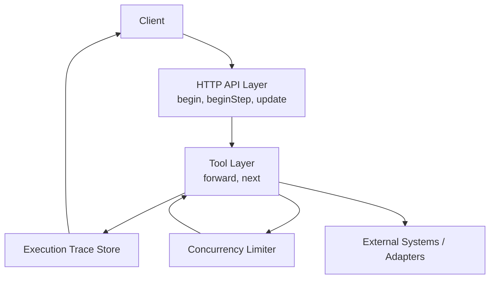
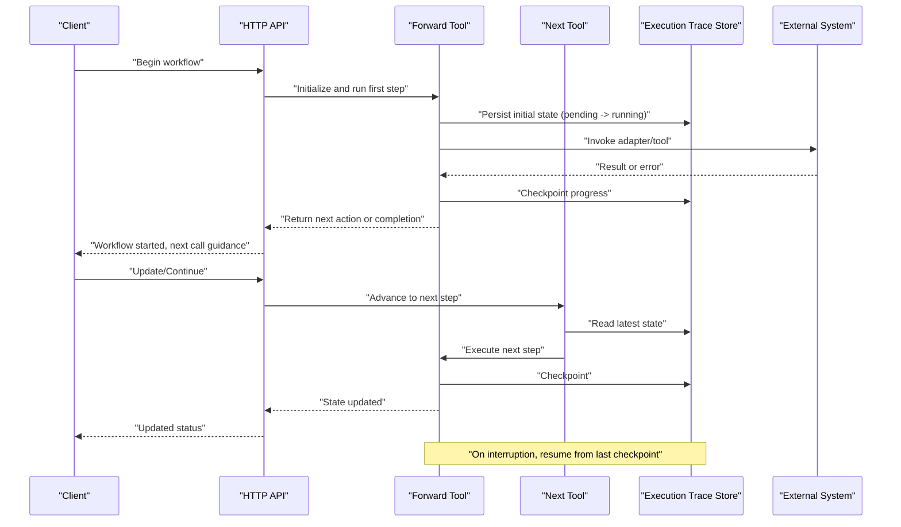
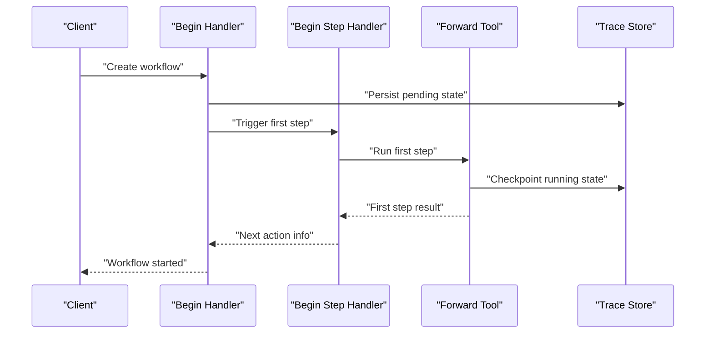
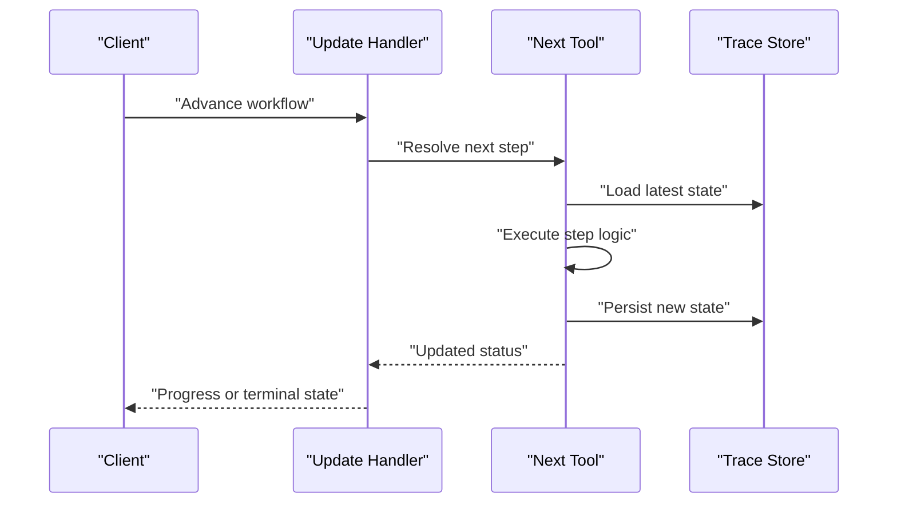
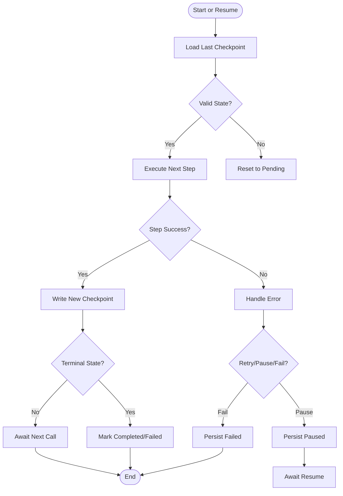
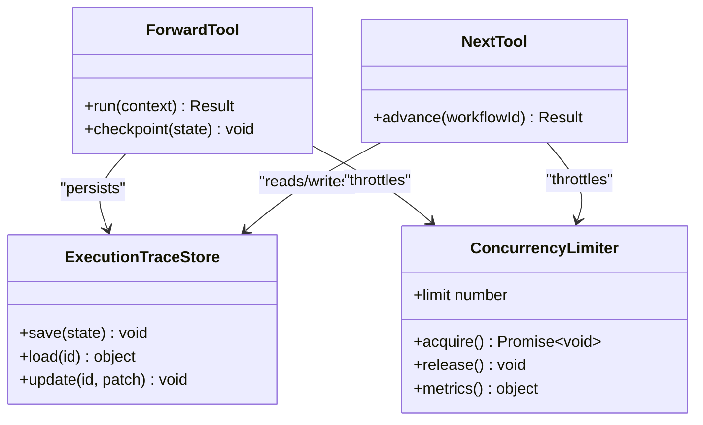
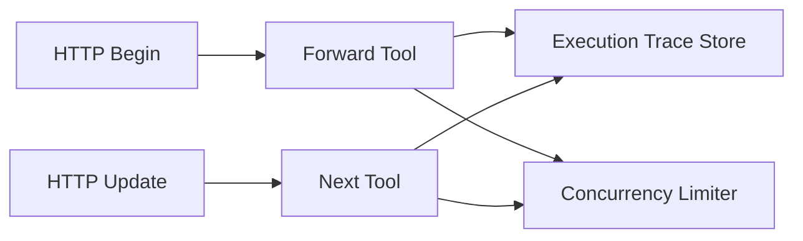

# Workflow Lifecycle Management

<cite>
**Referenced Files in This Document**
- [workflow-full-execution.md](file://docs/architecture/workflow-full-execution.md)
- [workflow-activate.md](file://docs/architecture/workflow-activate.md)
- [workflow-forward-first-call.md](file://docs/architecture/workflow-forward-first-call.md)
- [workflow-forward-continue.md](file://docs/architecture/workflow-forward-continue.md)
- [http-api-begin.ts](file://src/http/http-api-begin.ts)
- [http-api-begin-step.ts](file://src/http/http-api-begin-step.ts)
- [http-api-update.ts](file://src/http/http-api-update.ts)
- [forward.ts](file://src/tools/forward.ts)
- [next.ts](file://src/tools/next.ts)
- [execution-trace-store.ts](file://src/services/execution-trace-store.ts)
- [concurrency-limit.ts](file://src/utils/concurrency-limit.ts)
</cite>

## Table of Contents
1. [Introduction](#introduction)
2. [Project Structure](#project-structure)
3. [Core Components](#core-components)
4. [Architecture Overview](#architecture-overview)
5. [Detailed Component Analysis](#detailed-component-analysis)
6. [Dependency Analysis](#dependency-analysis)
7. [Performance Considerations](#performance-considerations)
8. [Troubleshooting Guide](#troubleshooting-guide)
9. [Conclusion](#conclusion)

## Introduction
This document explains the complete workflow lifecycle management for the system, covering initiation through completion. It details state transitions, checkpointing and recovery mechanisms, creation and termination flows, monitoring, concurrency control, resource allocation, and cleanup procedures. The content is grounded in the architecture documentation and HTTP/tool implementations that drive workflows end-to-end.

## Project Structure
The workflow lifecycle spans multiple layers:
- HTTP API layer exposes endpoints to begin, step, update, and terminate workflows.
- Tool layer orchestrates execution steps and persistence.
- Services provide execution tracing and concurrency controls.
- Architecture docs describe end-to-end flows and patterns.

[No sources needed since this diagram shows conceptual workflow, not actual code structure]

## Core Components
- HTTP API handlers:
  - Begin workflow entry points (initialization and first step).
  - Update endpoint for resuming or advancing workflows.
- Tool orchestration:
  - Forward tool manages multi-step execution with checkpoints.
  - Next tool advances to the subsequent step based on current state.
- Execution trace store:
  - Persists workflow state, inputs, outputs, and progress for recovery.
- Concurrency limiter:
  - Controls parallelism to protect resources and ensure stable throughput.

Key responsibilities:
- State machine transitions between pending, running, completed, failed, paused.
- Checkpointing at safe boundaries to enable recovery after interruptions.
- Monitoring via persisted traces and metrics.
- Cleanup upon completion or failure.

**Section sources**
- [http-api-begin.ts](file://src/http/http-api-begin.ts)
- [http-api-begin-step.ts](file://src/http/http-api-begin-step.ts)
- [http-api-update.ts](file://src/http/http-api-update.ts)
- [forward.ts](file://src/tools/forward.ts)
- [next.ts](file://src/tools/next.ts)
- [execution-trace-store.ts](file://src/services/execution-trace-store.ts)
- [concurrency-limit.ts](file://src/utils/concurrency-limit.ts)

## Architecture Overview
End-to-end flow from initiation to completion:

**Diagram sources**
- [http-api-begin.ts](file://src/http/http-api-begin.ts)
- [http-api-update.ts](file://src/http/http-api-update.ts)
- [forward.ts](file://src/tools/forward.ts)
- [next.ts](file://src/tools/next.ts)
- [execution-trace-store.ts](file://src/services/execution-trace-store.ts)

## Detailed Component Analysis

### Workflow States and Transitions
States:
- Pending: Created but not yet executed.
- Running: Actively executing one or more steps.
- Completed: Successfully finished all steps.
- Failed: Terminated due to unrecoverable errors.
- Paused: Temporarily halted; can be resumed.

Transition rules:
- Pending → Running: On successful initialization and first step start.
- Running → Completed: When all steps succeed and finalization completes.
- Running → Failed: On unrecoverable errors or validation failures.
- Running ↔ Paused: On explicit pause/resume actions or external signals.
- Any terminal state (Completed/Failed): No further transitions except re-initiation by client.

Conditions:
- Successful adapter/tool responses advance the workflow.
- Errors trigger either retry logic, pause, or failure depending on severity and configuration.
- Timeouts and resource constraints may cause pauses or failures.

**Section sources**
- [workflow-full-execution.md](file://docs/architecture/workflow-full-execution.md)
- [workflow-activate.md](file://docs/architecture/workflow-activate.md)
- [workflow-forward-first-call.md](file://docs/architecture/workflow-forward-first-call.md)
- [workflow-forward-continue.md](file://docs/architecture/workflow-forward-continue.md)

### Initiation Flow (Begin and First Step)
- Client calls the begin endpoint to create a workflow instance.
- The system initializes context, validates inputs, and persists an initial state.
- The first step is executed, transitioning the workflow to running.
- The response includes guidance for the next call (e.g., forward or next).

**Diagram sources**
- [http-api-begin.ts](file://src/http/http-api-begin.ts)
- [http-api-begin-step.ts](file://src/http/http-api-begin-step.ts)
- [forward.ts](file://src/tools/forward.ts)
- [execution-trace-store.ts](file://src/services/execution-trace-store.ts)

**Section sources**
- [http-api-begin.ts](file://src/http/http-api-begin.ts)
- [http-api-begin-step.ts](file://src/http/http-api-begin-step.ts)
- [workflow-forward-first-call.md](file://docs/architecture/workflow-forward-first-call.md)

### Continuation and Advancement (Update and Next)
- Clients use update or next to advance the workflow after receiving next-action guidance.
- The system reads the latest persisted state, executes the next step, and updates checkpoints.
- If the workflow reaches completion or fails, the terminal state is recorded.

**Diagram sources**
- [http-api-update.ts](file://src/http/http-api-update.ts)
- [next.ts](file://src/tools/next.ts)
- [execution-trace-store.ts](file://src/services/execution-trace-store.ts)

**Section sources**
- [http-api-update.ts](file://src/http/http-api-update.ts)
- [next.ts](file://src/tools/next.ts)
- [workflow-forward-continue.md](file://docs/architecture/workflow-forward-continue.md)

### Checkpointing and Recovery
- Checkpoints are written at safe boundaries during execution.
- On restart or interruption, the engine loads the last checkpoint to resume.
- Recovery ensures idempotent advancement and avoids duplicate work.

**Diagram sources**
- [forward.ts](file://src/tools/forward.ts)
- [execution-trace-store.ts](file://src/services/execution-trace-store.ts)

**Section sources**
- [forward.ts](file://src/tools/forward.ts)
- [execution-trace-store.ts](file://src/services/execution-trace-store.ts)

### Termination and Cleanup
- Completion: Finalize artifacts, release locks, and mark the workflow as completed.
- Failure: Record diagnostics, release locks, and mark as failed.
- Pause: Keep resources allocated per policy; allow resume without full re-initialization.
- Cleanup: Remove temporary files, close connections, and free memory.

**Section sources**
- [workflow-full-execution.md](file://docs/architecture/workflow-full-execution.md)
- [workflow-activate.md](file://docs/architecture/workflow-activate.md)

### Concurrent Executions and Resource Allocation
- Concurrency limiter controls how many workflows can execute simultaneously.
- Resource allocation strategies include:
  - Rate limiting external calls.
  - Batching where possible.
  - Backoff and retry policies for transient errors.
- Monitoring tracks active workflows, queue depth, and latency.

**Diagram sources**
- [concurrency-limit.ts](file://src/utils/concurrency-limit.ts)
- [execution-trace-store.ts](file://src/services/execution-trace-store.ts)
- [forward.ts](file://src/tools/forward.ts)
- [next.ts](file://src/tools/next.ts)

**Section sources**
- [concurrency-limit.ts](file://src/utils/concurrency-limit.ts)
- [execution-trace-store.ts](file://src/services/execution-trace-store.ts)

## Dependency Analysis
High-level dependencies among components:

**Diagram sources**
- [http-api-begin.ts](file://src/http/http-api-begin.ts)
- [http-api-update.ts](file://src/http/http-api-update.ts)
- [forward.ts](file://src/tools/forward.ts)
- [next.ts](file://src/tools/next.ts)
- [execution-trace-store.ts](file://src/services/execution-trace-store.ts)
- [concurrency-limit.ts](file://src/utils/concurrency-limit.ts)

**Section sources**
- [http-api-begin.ts](file://src/http/http-api-begin.ts)
- [http-api-update.ts](file://src/http/http-api-update.ts)
- [forward.ts](file://src/tools/forward.ts)
- [next.ts](file://src/tools/next.ts)
- [execution-trace-store.ts](file://src/services/execution-trace-store.ts)
- [concurrency-limit.ts](file://src/utils/concurrency-limit.ts)

## Performance Considerations
- Use concurrency limits to prevent overload and maintain predictable latency.
- Batch operations when possible to reduce external system pressure.
- Prefer idempotent operations to support retries safely.
- Monitor key metrics: active workflows, step duration, error rates, and checkpoint frequency.
- Tune timeouts and backoff strategies based on external service characteristics.

[No sources needed since this section provides general guidance]

## Troubleshooting Guide
Common issues and resolutions:
- Stuck in running state: Verify checkpoints and ensure next calls are being made.
- Frequent failures: Inspect error diagnostics and adjust retry/backoff settings.
- Resource exhaustion: Reduce concurrency limit or optimize external calls.
- Inconsistent state: Confirm idempotency and atomicity of state updates.

Operational checks:
- Review execution traces for the latest state and step history.
- Validate concurrency limiter metrics and queue depths.
- Ensure external systems are healthy and within rate limits.

**Section sources**
- [execution-trace-store.ts](file://src/services/execution-trace-store.ts)
- [concurrency-limit.ts](file://src/utils/concurrency-limit.ts)

## Conclusion
The workflow lifecycle is designed around robust state management, checkpointing, and controlled concurrency. By leveraging clear initiation, continuation, and termination flows, the system supports reliable execution, recovery, and monitoring across diverse workloads. Proper tuning of concurrency and external integrations ensures stability and performance under load.