# Workflow Orchestration Engine

<cite>
**Referenced Files in This Document**
- [src/services/execution-trace-store.ts](file://src/services/execution-trace-store.ts)
- [src/tools/forward.ts](file://src/tools/forward.ts)
- [src/tools/next.ts](file://src/tools/next.ts)
- [src/tools/activate.ts](file://src/tools/activate.ts)
- [src/tools/reward.ts](file://src/tools/reward.ts)
- [src/http/http-api-begin.ts](file://src/http/http-api-begin.ts)
- [src/http/http-api-forward.ts](file://src/http/http-api-forward.ts)
- [src/http/http-api-update.ts](file://src/http/http-api-update.ts)
- [src/utils/concurrency-limit.ts](file://src/utils/concurrency-limit.ts)
- [src/utils/audit-log-events.ts](file://src/utils/audit-log-events.ts)
- [src/utils/version-compare.ts](file://src/utils/version-compare.ts)
- [src/services/key-value-store-factory.ts](file://src/services/key-value-store-factory.ts)
- [src/services/key-value-store.ts](file://src/services/key-value-store.ts)
- [src/services/memory-store.ts](file://src/services/memory-store.ts)
- [src/services/qdrant/service.ts](file://src/services/qdrant/service.ts)
- [src/services/redis-cache.ts](file://src/services/redis-cache.ts)
- [src/services/oidc-state-store.ts](file://src/services/oidc-state-store.ts)
- [src/tools/forward-tool-error.ts](file://src/tools/forward-tool-error.ts)
- [src/tools/forward-trace.ts](file://src/tools/forward-trace.ts)
- [src/tools/forward-register.ts](file://src/tools/forward-register.ts)
- [src/tools/forward-helpers.ts](file://src/tools/forward-helpers.ts)
- [src/tools/forward-view.ts](file://src/tools/forward-view.ts)
- [src/tools/next-pow-helpers.ts](file://src/tools/next-pow-helpers.ts)
- [src/tools/next-proof-types.ts](file://src/tools/next-proof-types.ts)
- [src/tools/next-missing-proof-payload.ts](file://src/tools/next-missing-proof-payload.ts)
- [src/tools/next-previous-step.ts](file://src/tools/next-previous-step.ts)
- [src/tools/kairos-genesis-proof-hash.ts](file://src/tools/kairos-genesis-proof-hash.ts)
- [src/tools/kairos-challenge-display.ts](file://src/tools/kairos-challenge-display.ts)
- [src/tools/mcp-runtime-error.ts](file://src/tools/mcp-runtime-error.ts)
- [src/tools/mcp-contract-match.ts](file://src/tools/mcp-contract-match.ts)
- [src/tools/mcp-loose-input-schema.ts](file://src/tools/mcp-loose-input-schema.ts)
- [src/tools/mcp-tool-input-teaching.ts](file://src/tools/mcp-tool-input-teaching.ts)
- [src/tools/export-telemetry.ts](file://src/tools/export-telemetry.ts)
- [src/tools/export-artifact-download-capability.ts](file://src/tools/export-artifact-download-capability.ts)
- [src/tools/export-download-capability.ts](file://src/tools/export-download-capability.ts)
- [src/tools/export-selection.ts](file://src/tools/export-selection.ts)
- [src/tools/export-source.ts](file://src/tools/export-source.ts)
- [src/tools/export-resolve-adapter.ts](file://src/tools/export-resolve-adapter.ts)
- [src/tools/export-skill-items.ts](file://src/tools/export-skill-items.ts)
- [src/tools/export.ts](file://src/tools/export.ts)
- [src/tools/train.ts](file://src/tools/train.ts)
- [src/tools/tune.ts](file://src/tools/tune.ts)
- [src/tools/update.ts](file://src/tools/update.ts)
- [src/tools/delete.ts](file://src/tools/delete.ts)
- [src/tools/spaces.ts](file://src/tools/spaces.ts)
- [src/tools/search.ts](file://src/tools/search.ts)
- [src/tools/dump.ts](file://src/tools/dump.ts)
- [src/tools/artifact-catalog.ts](file://src/tools/artifact-catalog.ts)
- [src/tools/artifact-relative-path.ts](file://src/tools/artifact-relative-path.ts)
- [src/tools/artifact-mime.ts](file://src/tools/artifact-mime.ts)
- [src/tools/local-artifact-dir-contract.ts](file://src/tools/local-artifact-dir-contract.ts)
- [src/tools/kairos-uri.ts](file://src/tools/kairos-uri.ts)
- [src/tools/review-evidence-check.ts](file://src/tools/review-evidence-check.ts)
- [src/tools/shell-challenge-invocation.ts](file://src/tools/shell-challenge-invocation.ts)
- [src/tools/kairos-genesis-proof-hash.ts](file://src/tools/kairos-genesis-proof-hash.ts)
- [src/tools/kairos-challenge-display.ts](file://src/tools/kairos-challenge-display.ts)
- [src/tools/mcp-runtime-error.ts](file://src/tools/mcp-runtime-error.ts)
- [src/tools/mcp-contract-match.ts](file://src/tools/mcp-contract-match.ts)
- [src/tools/mcp-loose-input-schema.ts](file://src/tools/mcp-loose-input-schema.ts)
- [src/tools/mcp-tool-input-teaching.ts](file://src/tools/mcp-tool-input-teaching.ts)
- [src/tools/export-telemetry.ts](file://src/tools/export-telemetry.ts)
- [src/tools/export-artifact-download-capability.ts](file://src/tools/export-artifact-download-capability.ts)
- [src/tools/export-download-capability.ts](file://src/tools/export-download-capability.ts)
- [src/tools/export-selection.ts](file://src/tools/export-selection.ts)
- [src/tools/export-source.ts](file://src/tools/export-source.ts)
- [src/tools/export-resolve-adapter.ts](file://src/tools/export-resolve-adapter.ts)
- [src/tools/export-skill-items.ts](file://src/tools/export-skill-items.ts)
- [src/tools/export.ts](file://src/tools/export.ts)
- [src/tools/train.ts](file://src/tools/train.ts)
- [src/tools/tune.ts](file://src/tools/tune.ts)
- [src/tools/update.ts](file://src/tools/update.ts)
- [src/tools/delete.ts](file://src/tools/delete.ts)
- [src/tools/spaces.ts](file://src/tools/spaces.ts)
- [src/tools/search.ts](file://src/tools/search.ts)
- [src/tools/dump.ts](file://src/tools/dump.ts)
- [src/tools/artifact-catalog.ts](file://src/tools/artifact-catalog.ts)
- [src/tools/artifact-relative-path.ts](file://src/tools/artifact-relative-path.ts)
- [src/tools/artifact-mime.ts](file://src/tools/artifact-mime.ts)
- [src/tools/local-artifact-dir-contract.ts](file://src/tools/local-artifact-dir-contract.ts)
- [src/tools/kairos-uri.ts](file://src/tools/kairos-uri.ts)
- [src/tools/review-evidence-check.ts](file://src/tools/review-evidence-check.ts)
- [src/tools/shell-challenge-invocation.ts](file://src/tools/shell-challenge-invocation.ts)
</cite>

## Table of Contents
1. [Introduction](#introduction)
2. [Project Structure](#project-structure)
3. [Core Components](#core-components)
4. [Architecture Overview](#architecture-overview)
5. [Detailed Component Analysis](#detailed-component-analysis)
6. [Dependency Analysis](#dependency-analysis)
7. [Performance Considerations](#performance-considerations)
8. [Troubleshooting Guide](#troubleshooting-guide)
9. [Conclusion](#conclusion)
10. [Appendices](#appendices)

## Introduction
This document explains the workflow orchestration engine with a focus on stateful execution, conditional branching, step management, lifecycle, and observability. It covers how workflows are initiated, advanced through steps, coordinated across tools and services, persisted for context, and executed concurrently. It also documents the execution trace system for monitoring and debugging, as well as versioning, rollback strategies, and audit logging for compliance.

## Project Structure
The workflow orchestration spans HTTP endpoints, tool implementations, persistence layers, concurrency control, and telemetry:
- HTTP entry points expose begin, forward (step advancement), update, and other operations.
- Tool modules implement business logic for activation, progression, rewards, training, tuning, export, search, and more.
- Persistence includes key-value stores, memory store, Qdrant vector store, Redis cache, and OIDC state store.
- Concurrency limiting controls parallelism at runtime.
- Execution traces capture detailed run metadata for monitoring and debugging.
- Audit logging records events for compliance.

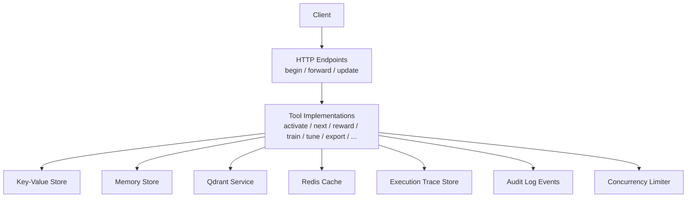

[No sources needed since this diagram shows conceptual workflow, not actual code structure]

## Core Components
- Stateful workflow execution: Workflows are represented as sessions with explicit states and transitions. The begin operation initializes a session; forward advances it based on current state and inputs; update modifies or resumes state; reward records outcomes.
- Conditional branching: Next action selection is driven by protocol definitions and runtime context. Missing proofs or validation failures route to specific branches (e.g., proof generation, user input).
- Step management: Each step has an identifier, schema, and output shape. The engine validates inputs against schemas, executes tool calls, and persists outputs.
- Lifecycle: Initiation (begin) -> Step execution (forward) -> Completion or error recovery (update, retry, or terminate).
- Execution trace system: A dedicated store captures per-run metadata, including timestamps, inputs, outputs, errors, and tool interactions.
- Coordination between tools and services: Tools call into adapters, MCP contracts, shell challenges, and external services via typed interfaces.
- Context persistence: Key-value and memory stores persist workflow state and artifacts.
- Concurrent executions: A concurrency limiter gates parallel runs to protect downstream resources.

**Section sources**
- [src/http/http-api-begin.ts](file://src/http/http-api-begin.ts)
- [src/http/http-api-forward.ts](file://src/http/http-api-forward.ts)
- [src/http/http-api-update.ts](file://src/http/http-api-update.ts)
- [src/tools/activate.ts](file://src/tools/activate.ts)
- [src/tools/next.ts](file://src/tools/next.ts)
- [src/tools/reward.ts](file://src/tools/reward.ts)
- [src/services/execution-trace-store.ts](file://src/services/execution-trace-store.ts)
- [src/utils/concurrency-limit.ts](file://src/utils/concurrency-limit.ts)

## Architecture Overview
The orchestration architecture centers around HTTP endpoints that delegate to tool implementations, which coordinate with persistence and external services while emitting traces and audit logs.

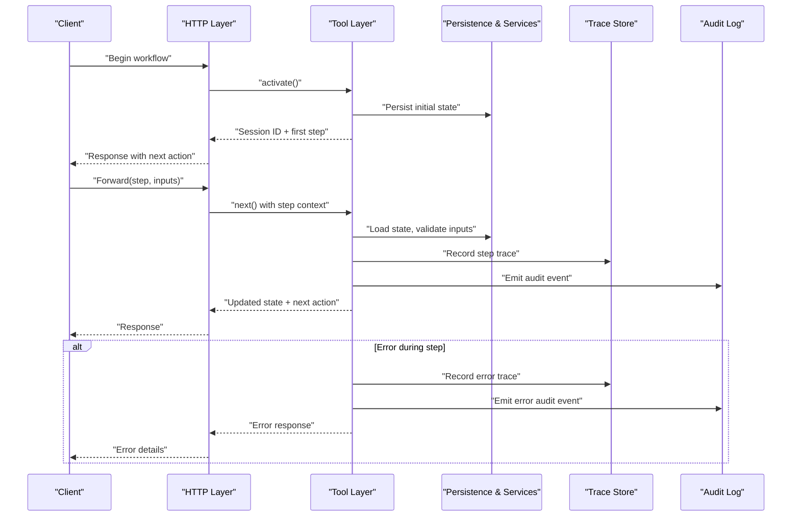

**Diagram sources**
- [src/http/http-api-begin.ts](file://src/http/http-api-begin.ts)
- [src/http/http-api-forward.ts](file://src/http/http-api-forward.ts)
- [src/tools/activate.ts](file://src/tools/activate.ts)
- [src/tools/next.ts](file://src/tools/next.ts)
- [src/services/execution-trace-store.ts](file://src/services/execution-trace-store.ts)
- [src/utils/audit-log-events.ts](file://src/utils/audit-log-events.ts)

## Detailed Component Analysis

### Workflow Lifecycle: Begin, Forward, Update, Reward
- Begin: Initializes a new workflow session, sets up initial state, and returns the first actionable step.
- Forward: Advances the workflow by validating inputs, executing the current step, updating state, and determining the next action.
- Update: Allows resuming or modifying a workflow’s state (e.g., correcting inputs, skipping steps).
- Reward: Records evaluation signals or feedback for the completed workflow.

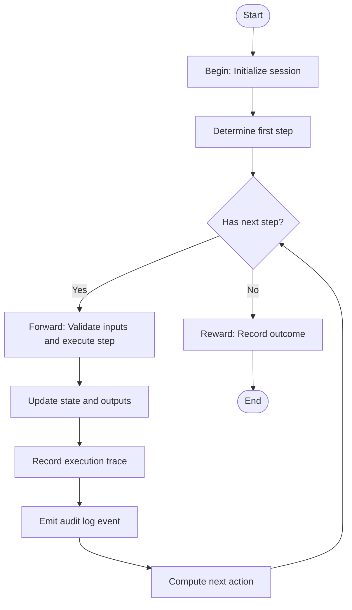

**Diagram sources**
- [src/http/http-api-begin.ts](file://src/http/http-api-begin.ts)
- [src/http/http-api-forward.ts](file://src/http/http-api-forward.ts)
- [src/http/http-api-update.ts](file://src/http/http-api-update.ts)
- [src/tools/activate.ts](file://src/tools/activate.ts)
- [src/tools/next.ts](file://src/tools/next.ts)
- [src/tools/reward.ts](file://src/tools/reward.ts)
- [src/services/execution-trace-store.ts](file://src/services/execution-trace-store.ts)
- [src/utils/audit-log-events.ts](file://src/utils/audit-log-events.ts)

**Section sources**
- [src/http/http-api-begin.ts](file://src/http/http-api-begin.ts)
- [src/http/http-api-forward.ts](file://src/http/http-api-forward.ts)
- [src/http/http-api-update.ts](file://src/http/http-api-update.ts)
- [src/tools/activate.ts](file://src/tools/activate.ts)
- [src/tools/next.ts](file://src/tools/next.ts)
- [src/tools/reward.ts](file://src/tools/reward.ts)

### Conditional Branching and Step Management
- Branching logic depends on protocol definitions and runtime checks (e.g., missing proofs, validation failures).
- Step management ensures each step has a clear contract: input schema, processing logic, and output shape.
- Proof-of-work and challenge flows integrate specialized helpers to guide users through required actions.

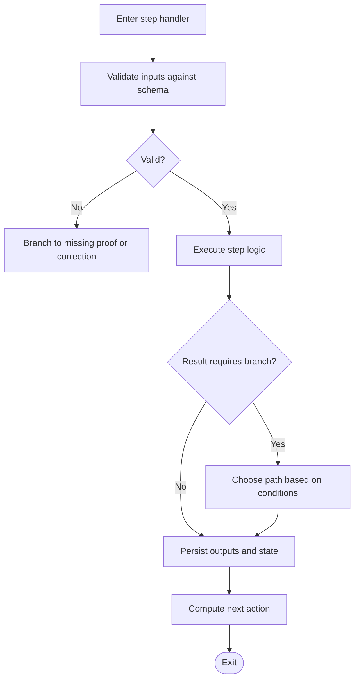

**Diagram sources**
- [src/tools/next.ts](file://src/tools/next.ts)
- [src/tools/next-missing-proof-payload.ts](file://src/tools/next-missing-proof-payload.ts)
- [src/tools/next-pow-helpers.ts](file://src/tools/next-pow-helpers.ts)
- [src/tools/next-proof-types.ts](file://src/tools/next-proof-types.ts)
- [src/tools/next-previous-step.ts](file://src/tools/next-previous-step.ts)
- [src/tools/kairos-challenge-display.ts](file://src/tools/kairos-challenge-display.ts)

**Section sources**
- [src/tools/next.ts](file://src/tools/next.ts)
- [src/tools/next-missing-proof-payload.ts](file://src/tools/next-missing-proof-payload.ts)
- [src/tools/next-pow-helpers.ts](file://src/tools/next-pow-helpers.ts)
- [src/tools/next-proof-types.ts](file://src/tools/next-proof-types.ts)
- [src/tools/next-previous-step.ts](file://src/tools/next-previous-step.ts)
- [src/tools/kairos-challenge-display.ts](file://src/tools/kairos-challenge-display.ts)

### Execution Trace System
- Captures per-run metadata: timestamps, inputs, outputs, errors, tool interactions, and state snapshots.
- Provides queryable history for monitoring and debugging.
- Integrates with audit logging for compliance.

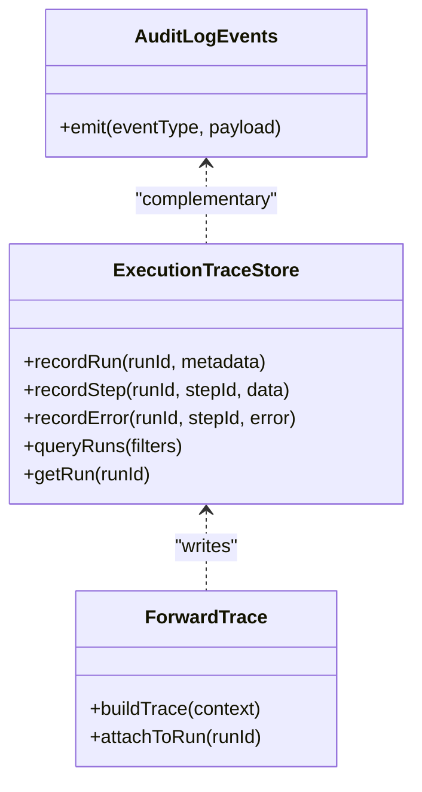

**Diagram sources**
- [src/services/execution-trace-store.ts](file://src/services/execution-trace-store.ts)
- [src/utils/audit-log-events.ts](file://src/utils/audit-log-events.ts)
- [src/tools/forward-trace.ts](file://src/tools/forward-trace.ts)

**Section sources**
- [src/services/execution-trace-store.ts](file://src/services/execution-trace-store.ts)
- [src/tools/forward-trace.ts](file://src/tools/forward-trace.ts)
- [src/utils/audit-log-events.ts](file://src/utils/audit-log-events.ts)

### Coordination Between Tools and Services
- Tools encapsulate domain logic and interact with persistence and external services.
- MCP integration supports dynamic tool discovery and contract matching.
- Shell challenges invoke external processes safely.
- Export and artifact utilities manage file handling and metadata.

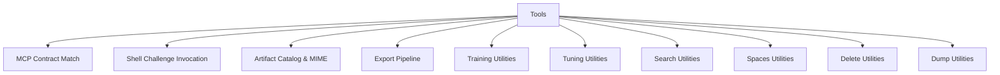

**Diagram sources**
- [src/tools/mcp-contract-match.ts](file://src/tools/mcp-contract-match.ts)
- [src/tools/shell-challenge-invocation.ts](file://src/tools/shell-challenge-invocation.ts)
- [src/tools/artifact-catalog.ts](file://src/tools/artifact-catalog.ts)
- [src/tools/export.ts](file://src/tools/export.ts)
- [src/tools/train.ts](file://src/tools/train.ts)
- [src/tools/tune.ts](file://src/tools/tune.ts)
- [src/tools/search.ts](file://src/tools/search.ts)
- [src/tools/spaces.ts](file://src/tools/spaces.ts)
- [src/tools/delete.ts](file://src/tools/delete.ts)
- [src/tools/dump.ts](file://src/tools/dump.ts)

**Section sources**
- [src/tools/mcp-contract-match.ts](file://src/tools/mcp-contract-match.ts)
- [src/tools/shell-challenge-invocation.ts](file://src/tools/shell-challenge-invocation.ts)
- [src/tools/artifact-catalog.ts](file://src/tools/artifact-catalog.ts)
- [src/tools/export.ts](file://src/tools/export.ts)
- [src/tools/train.ts](file://src/tools/train.ts)
- [src/tools/tune.ts](file://src/tools/tune.ts)
- [src/tools/search.ts](file://src/tools/search.ts)
- [src/tools/spaces.ts](file://src/tools/spaces.ts)
- [src/tools/delete.ts](file://src/tools/delete.ts)
- [src/tools/dump.ts](file://src/tools/dump.ts)

### Context Persistence and State Management
- Key-value store provides durable session state and configuration.
- Memory store offers in-memory access patterns for fast lookups.
- Qdrant service manages vectorized content and retrieval.
- Redis cache accelerates repeated operations and pub/sub signaling.
- OIDC state store maintains authentication-related state.

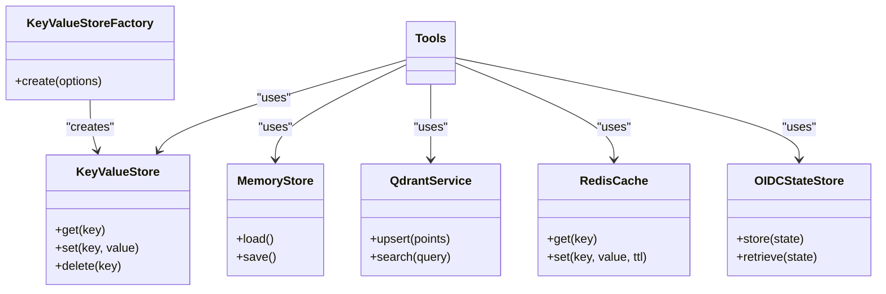

**Diagram sources**
- [src/services/key-value-store-factory.ts](file://src/services/key-value-store-factory.ts)
- [src/services/key-value-store.ts](file://src/services/key-value-store.ts)
- [src/services/memory-store.ts](file://src/services/memory-store.ts)
- [src/services/qdrant/service.ts](file://src/services/qdrant/service.ts)
- [src/services/redis-cache.ts](file://src/services/redis-cache.ts)
- [src/services/oidc-state-store.ts](file://src/services/oidc-state-store.ts)

**Section sources**
- [src/services/key-value-store-factory.ts](file://src/services/key-value-store-factory.ts)
- [src/services/key-value-store.ts](file://src/services/key-value-store.ts)
- [src/services/memory-store.ts](file://src/services/memory-store.ts)
- [src/services/qdrant/service.ts](file://src/services/qdrant/service.ts)
- [src/services/redis-cache.ts](file://src/services/redis-cache.ts)
- [src/services/oidc-state-store.ts](file://src/services/oidc-state-store.ts)

### Concurrency Control
- A concurrency limiter regulates parallel workflow executions to prevent resource exhaustion.
- Useful when multiple clients trigger simultaneous forwards or updates.

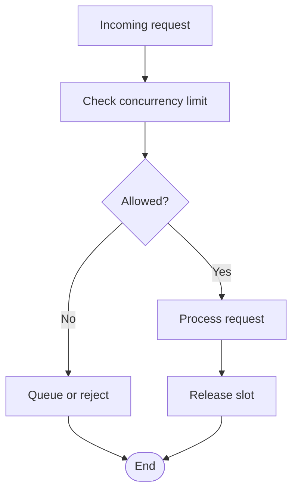

**Diagram sources**
- [src/utils/concurrency-limit.ts](file://src/utils/concurrency-limit.ts)

**Section sources**
- [src/utils/concurrency-limit.ts](file://src/utils/concurrency-limit.ts)

### Versioning, Rollback, and Audit Logging
- Version comparison utilities support protocol and schema evolution.
- Rollback strategies can leverage previous state snapshots stored in key-value or memory stores.
- Audit log events record critical operations for compliance and forensics.

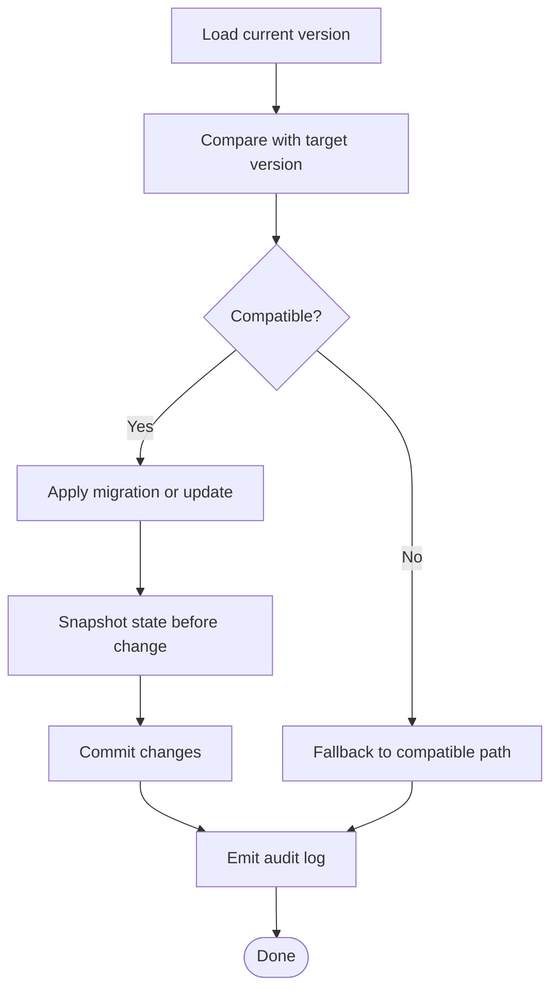

**Diagram sources**
- [src/utils/version-compare.ts](file://src/utils/version-compare.ts)
- [src/utils/audit-log-events.ts](file://src/utils/audit-log-events.ts)
- [src/services/key-value-store.ts](file://src/services/key-value-store.ts)
- [src/services/memory-store.ts](file://src/services/memory-store.ts)

**Section sources**
- [src/utils/version-compare.ts](file://src/utils/version-compare.ts)
- [src/utils/audit-log-events.ts](file://src/utils/audit-log-events.ts)
- [src/services/key-value-store.ts](file://src/services/key-value-store.ts)
- [src/services/memory-store.ts](file://src/services/memory-store.ts)

### Error Handling Patterns
- Tool-level errors are normalized and surfaced consistently.
- MCP runtime errors are captured and reported with context.
- Forward tool error utilities provide structured responses for client consumption.

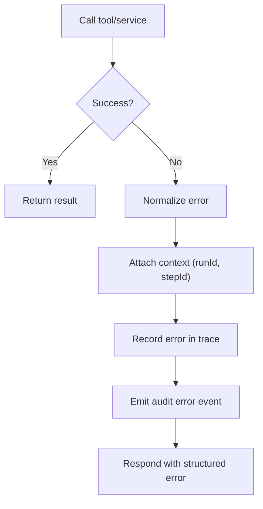

**Diagram sources**
- [src/tools/forward-tool-error.ts](file://src/tools/forward-tool-error.ts)
- [src/tools/mcp-runtime-error.ts](file://src/tools/mcp-runtime-error.ts)
- [src/services/execution-trace-store.ts](file://src/services/execution-trace-store.ts)
- [src/utils/audit-log-events.ts](file://src/utils/audit-log-events.ts)

**Section sources**
- [src/tools/forward-tool-error.ts](file://src/tools/forward-tool-error.ts)
- [src/tools/mcp-runtime-error.ts](file://src/tools/mcp-runtime-error.ts)
- [src/services/execution-trace-store.ts](file://src/services/execution-trace-store.ts)
- [src/utils/audit-log-events.ts](file://src/utils/audit-log-events.ts)

## Dependency Analysis
The orchestration layer depends on tool implementations, persistence services, concurrency control, tracing, and audit logging.

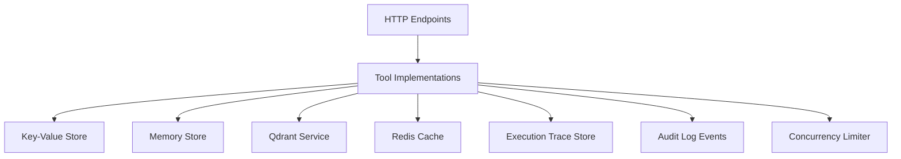

**Diagram sources**
- [src/http/http-api-begin.ts](file://src/http/http-api-begin.ts)
- [src/http/http-api-forward.ts](file://src/http/http-api-forward.ts)
- [src/http/http-api-update.ts](file://src/http/http-api-update.ts)
- [src/tools/activate.ts](file://src/tools/activate.ts)
- [src/tools/next.ts](file://src/tools/next.ts)
- [src/services/execution-trace-store.ts](file://src/services/execution-trace-store.ts)
- [src/utils/concurrency-limit.ts](file://src/utils/concurrency-limit.ts)
- [src/utils/audit-log-events.ts](file://src/utils/audit-log-events.ts)
- [src/services/key-value-store.ts](file://src/services/key-value-store.ts)
- [src/services/memory-store.ts](file://src/services/memory-store.ts)
- [src/services/qdrant/service.ts](file://src/services/qdrant/service.ts)
- [src/services/redis-cache.ts](file://src/services/redis-cache.ts)

**Section sources**
- [src/http/http-api-begin.ts](file://src/http/http-api-begin.ts)
- [src/http/http-api-forward.ts](file://src/http/http-api-forward.ts)
- [src/http/http-api-update.ts](file://src/http/http-api-update.ts)
- [src/tools/activate.ts](file://src/tools/activate.ts)
- [src/tools/next.ts](file://src/tools/next.ts)
- [src/services/execution-trace-store.ts](file://src/services/execution-trace-store.ts)
- [src/utils/concurrency-limit.ts](file://src/utils/concurrency-limit.ts)
- [src/utils/audit-log-events.ts](file://src/utils/audit-log-events.ts)
- [src/services/key-value-store.ts](file://src/services/key-value-store.ts)
- [src/services/memory-store.ts](file://src/services/memory-store.ts)
- [src/services/qdrant/service.ts](file://src/services/qdrant/service.ts)
- [src/services/redis-cache.ts](file://src/services/redis-cache.ts)

## Performance Considerations
- Use Redis caching for frequently accessed data to reduce latency.
- Batch writes to persistence where possible to minimize I/O overhead.
- Enforce concurrency limits to avoid overloading downstream services.
- Optimize trace recording by sampling or filtering low-value events under load.
- Leverage memory store for hot paths and fall back to durable stores for durability.

[No sources needed since this section provides general guidance]

## Troubleshooting Guide
- Inspect execution traces to identify failing steps and their inputs/outputs.
- Review audit logs for compliance and forensic analysis.
- Check concurrency metrics to detect throttling or queueing behavior.
- Validate MCP contract matches and input schemas to resolve integration issues.
- Verify persistence connectivity (key-value, memory, Qdrant, Redis) and OIDC state consistency.

**Section sources**
- [src/services/execution-trace-store.ts](file://src/services/execution-trace-store.ts)
- [src/utils/audit-log-events.ts](file://src/utils/audit-log-events.ts)
- [src/utils/concurrency-limit.ts](file://src/utils/concurrency-limit.ts)
- [src/tools/mcp-contract-match.ts](file://src/tools/mcp-contract-match.ts)
- [src/services/key-value-store.ts](file://src/services/key-value-store.ts)
- [src/services/memory-store.ts](file://src/services/memory-store.ts)
- [src/services/qdrant/service.ts](file://src/services/qdrant/service.ts)
- [src/services/redis-cache.ts](file://src/services/redis-cache.ts)
- [src/services/oidc-state-store.ts](file://src/services/oidc-state-store.ts)

## Conclusion
The workflow orchestration engine provides robust stateful execution, conditional branching, and comprehensive observability. By integrating persistence, concurrency control, tracing, and audit logging, it supports reliable, auditable, and scalable workflows across diverse tools and services.

[No sources needed since this section summarizes without analyzing specific files]

## Appendices
- Example workflow definitions: Refer to tool schemas and protocol specifications for step contracts and output shapes.
- State transition examples: See begin/forward/update flows and branching logic in next handlers.
- Error handling patterns: Consult forward tool error utilities and MCP runtime error handling.

[No sources needed since this section doesn't analyze specific files]