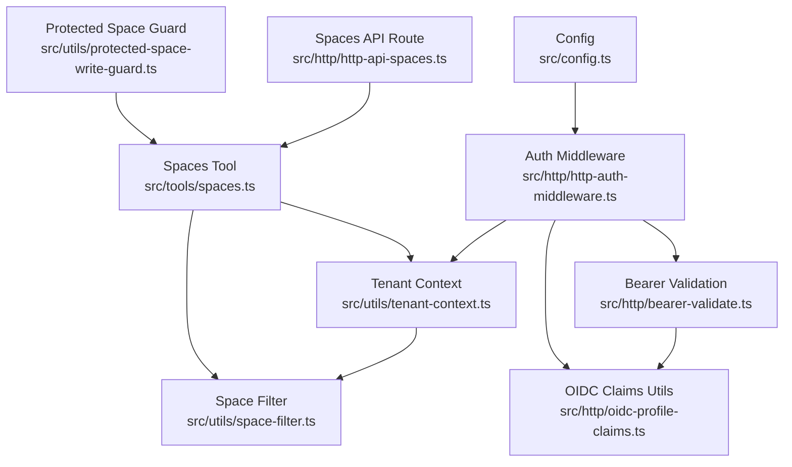
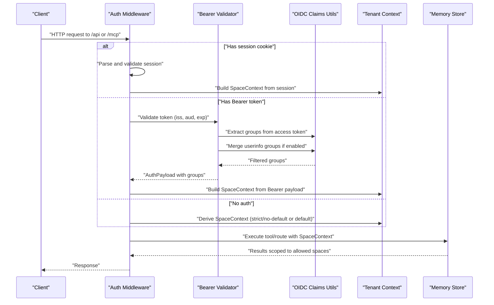
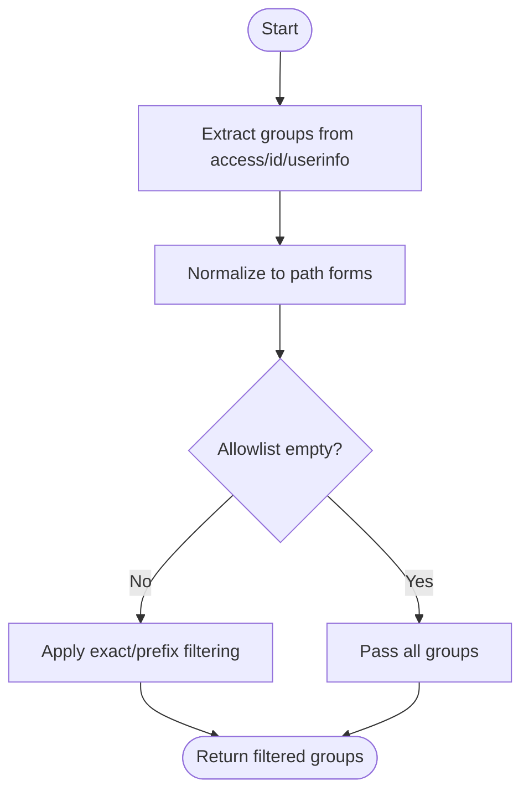
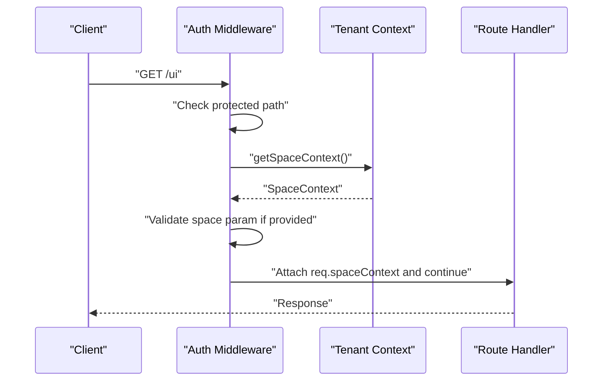
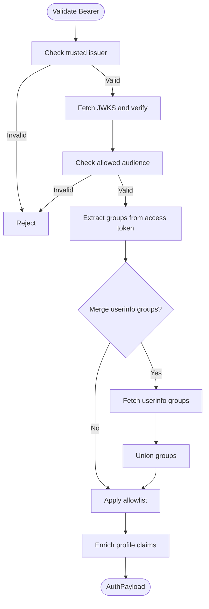
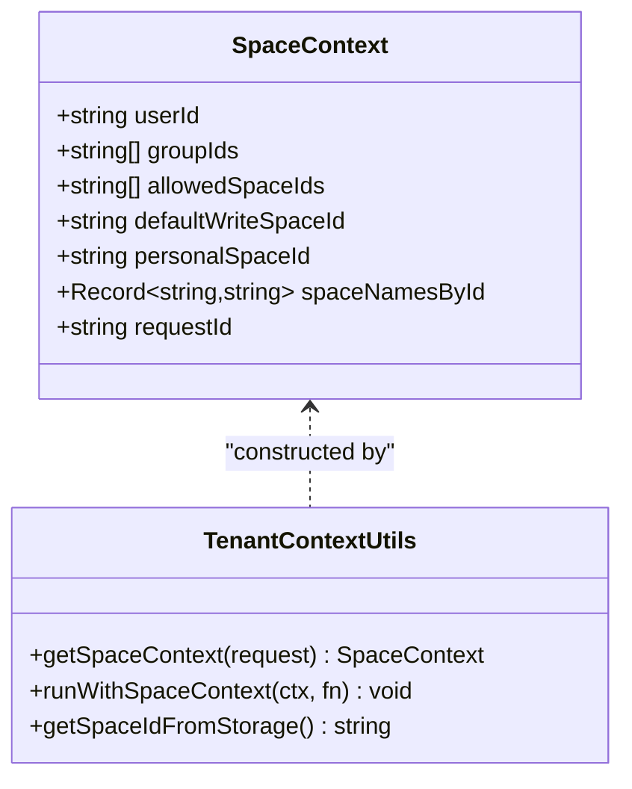
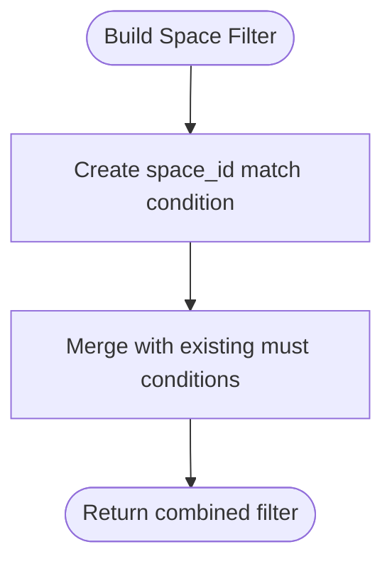
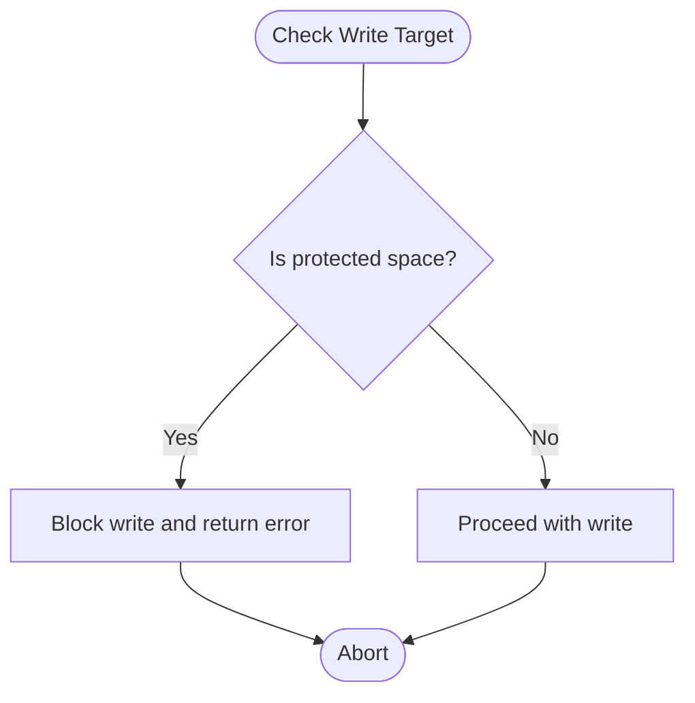
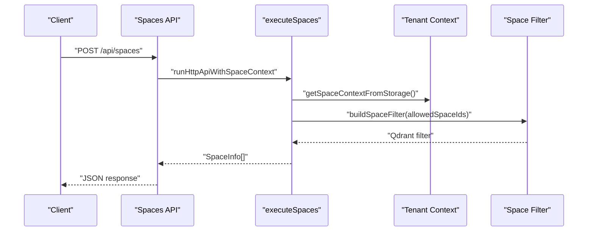
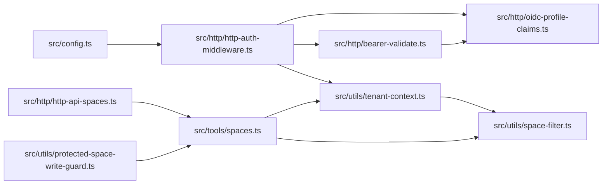

# Access Control

<cite>
**Referenced Files in This Document**
- [src/config.ts](file://src/config.ts)
- [src/http/http-auth-middleware.ts](file://src/http/http-auth-middleware.ts)
- [src/http/bearer-validate.ts](file://src/http/bearer-validate.ts)
- [src/http/oidc-profile-claims.ts](file://src/http/oidc-profile-claims.ts)
- [src/utils/tenant-context.ts](file://src/utils/tenant-context.ts)
- [src/utils/space-filter.ts](file://src/utils/space-filter.ts)
- [src/utils/protected-space-write-guard.ts](file://src/utils/protected-space-write-guard.ts)
- [src/http/http-api-spaces.ts](file://src/http/http-api-spaces.ts)
- [src/tools/spaces.ts](file://src/tools/spaces.ts)
- [src/utils/structured-logger.ts](file://src/utils/structured-logger.ts)
- [src/utils/audit-log-events.ts](file://src/utils/audit-log-events.ts)
- [scripts/deploy-configure-keycloak-realms.py](file://scripts/deploy-configure-keycloak-realms.py)
- [tests/unit/oidc-profile-claims.test.ts](file://tests/unit/oidc-profile-claims.test.ts)
- [tests/unit/tenant-context-auth.test.ts](file://tests/unit/tenant-context-auth.test.ts)
- [tests/unit/tenant-context-noauth.test.ts](file://tests/unit/tenant-context-noauth.test.ts)
- [tests/unit/resolve-space-param.test.ts](file://tests/unit/resolve-space-param.test.ts)
</cite>

## Table of Contents
1. [Introduction](#introduction)
2. [Project Structure](#project-structure)
3. [Core Components](#core-components)
4. [Architecture Overview](#architecture-overview)
5. [Detailed Component Analysis](#detailed-component-analysis)
6. [Dependency Analysis](#dependency-analysis)
7. [Performance Considerations](#performance-considerations)
8. [Troubleshooting Guide](#troubleshooting-guide)
9. [Conclusion](#conclusion)
10. [Appendices](#appendices)

## Introduction
This document explains the access control and authorization system built on group-based access control and OIDC integration. It covers OIDC group filtering, allowlists, permission enforcement, space scoping, tenant isolation, multi-tenant access patterns, and write permission management. It also documents how OIDC groups map to internal spaces, how the system enforces allowed spaces during requests, and how to configure and troubleshoot authorization.

## Project Structure
The access control system spans configuration, HTTP middleware, OIDC utilities, tenant context, space scoping, and protection guards. The following diagram maps the primary modules involved in authorization and space scoping.

**Diagram sources**
- [src/config.ts:113-171](file://src/config.ts#L113-L171)
- [src/http/http-auth-middleware.ts:167-313](file://src/http/http-auth-middleware.ts#L167-L313)
- [src/http/bearer-validate.ts:120-208](file://src/http/bearer-validate.ts#L120-L208)
- [src/http/oidc-profile-claims.ts:119-153](file://src/http/oidc-profile-claims.ts#L119-L153)
- [src/utils/tenant-context.ts:212-243](file://src/utils/tenant-context.ts#L212-L243)
- [src/utils/space-filter.ts:14-26](file://src/utils/space-filter.ts#L14-L26)
- [src/utils/protected-space-write-guard.ts:5-16](file://src/utils/protected-space-write-guard.ts#L5-L16)
- [src/http/http-api-spaces.ts:11-31](file://src/http/http-api-spaces.ts#L11-L31)
- [src/tools/spaces.ts:190-207](file://src/tools/spaces.ts#L190-L207)

**Section sources**
- [src/config.ts:113-171](file://src/config.ts#L113-L171)
- [src/http/http-auth-middleware.ts:167-313](file://src/http/http-auth-middleware.ts#L167-L313)
- [src/http/bearer-validate.ts:120-208](file://src/http/bearer-validate.ts#L120-L208)
- [src/http/oidc-profile-claims.ts:119-153](file://src/http/oidc-profile-claims.ts#L119-L153)
- [src/utils/tenant-context.ts:212-243](file://src/utils/tenant-context.ts#L212-L243)
- [src/utils/space-filter.ts:14-26](file://src/utils/space-filter.ts#L14-L26)
- [src/utils/protected-space-write-guard.ts:5-16](file://src/utils/protected-space-write-guard.ts#L5-L16)
- [src/http/http-api-spaces.ts:11-31](file://src/http/http-api-spaces.ts#L11-L31)
- [src/tools/spaces.ts:190-207](file://src/tools/spaces.ts#L190-L207)

## Core Components
- OIDC group allowlist and normalization: Filters and normalizes groups from OIDC tokens and userinfo, enabling precise control over which groups become KAIROS spaces.
- Auth middleware: Enforces authentication and authorization for protected routes, derives space context, and validates Bearer tokens when configured.
- Bearer token validation: Validates issuer, audience, expiration, and signature; merges groups from access token and userinfo; applies allowlist filtering.
- Tenant context: Derives allowed spaces, default write space, and personal space from OIDC claims; supports strict isolation when authentication is enabled.
- Space scoping: Builds Qdrant filters to enforce space boundaries across reads and writes.
- Protected write guard: Prevents writes to protected app/system spaces.
- Spaces API/tool: Lists spaces and adapters scoped to the current context.

**Section sources**
- [src/http/oidc-profile-claims.ts:78-153](file://src/http/oidc-profile-claims.ts#L78-L153)
- [src/http/http-auth-middleware.ts:167-313](file://src/http/http-auth-middleware.ts#L167-L313)
- [src/http/bearer-validate.ts:120-208](file://src/http/bearer-validate.ts#L120-L208)
- [src/utils/tenant-context.ts:212-243](file://src/utils/tenant-context.ts#L212-L243)
- [src/utils/space-filter.ts:14-26](file://src/utils/space-filter.ts#L14-L26)
- [src/utils/protected-space-write-guard.ts:5-16](file://src/utils/protected-space-write-guard.ts#L5-L16)
- [src/http/http-api-spaces.ts:11-31](file://src/http/http-api-spaces.ts#L11-L31)
- [src/tools/spaces.ts:190-207](file://src/tools/spaces.ts#L190-L207)

## Architecture Overview
The authorization pipeline integrates OIDC, middleware, and tenant context to scope access to spaces and enforce write protections.

**Diagram sources**
- [src/http/http-auth-middleware.ts:167-313](file://src/http/http-auth-middleware.ts#L167-L313)
- [src/http/bearer-validate.ts:120-208](file://src/http/bearer-validate.ts#L120-L208)
- [src/http/oidc-profile-claims.ts:119-153](file://src/http/oidc-profile-claims.ts#L119-L153)
- [src/utils/tenant-context.ts:251-285](file://src/utils/tenant-context.ts#L251-L285)

## Detailed Component Analysis

### OIDC Group Allowlist and Normalization
- Groups are extracted from OIDC tokens and userinfo, normalized to consistent path forms, and filtered by an allowlist.
- Allowlist supports exact matches and prefix-based matches (case-insensitive), enabling flexible mapping of group paths to spaces.
- When userinfo groups are missing or empty, the system logs guidance to add a Group Membership protocol mapper.

**Diagram sources**
- [src/http/oidc-profile-claims.ts:78-153](file://src/http/oidc-profile-claims.ts#L78-L153)
- [src/http/bearer-validate.ts:182-190](file://src/http/bearer-validate.ts#L182-L190)

**Section sources**
- [src/http/oidc-profile-claims.ts:78-153](file://src/http/oidc-profile-claims.ts#L78-L153)
- [src/http/bearer-validate.ts:182-190](file://src/http/bearer-validate.ts#L182-L190)
- [tests/unit/oidc-profile-claims.test.ts:103-136](file://tests/unit/oidc-profile-claims.test.ts#L103-L136)

### Auth Middleware and Space Context
- Enforces authentication for protected paths (/api, /mcp, /ui). Supports session and Bearer auth.
- When Bearer auth is enabled and properly configured, validates tokens and builds an AuthPayload.
- Derives SpaceContext from session or Bearer payload, applying allowlist filtering and mapping groups to spaces.
- Supports overriding the requested space via query parameter, enforcing it is within allowed spaces.

**Diagram sources**
- [src/http/http-auth-middleware.ts:167-215](file://src/http/http-auth-middleware.ts#L167-L215)
- [src/utils/tenant-context.ts:251-285](file://src/utils/tenant-context.ts#L251-L285)

**Section sources**
- [src/http/http-auth-middleware.ts:167-215](file://src/http/http-auth-middleware.ts#L167-L215)
- [src/utils/tenant-context.ts:251-285](file://src/utils/tenant-context.ts#L251-L285)

### Bearer Token Validation
- Validates issuer against trusted list, audience against allowed list, expiration, and signature via JWKS.
- Extracts groups from access token; if missing, attempts to fetch groups from userinfo and merges them when configured.
- Applies allowlist filtering and enriches profile claims for downstream use.

**Diagram sources**
- [src/http/bearer-validate.ts:120-208](file://src/http/bearer-validate.ts#L120-L208)

**Section sources**
- [src/http/bearer-validate.ts:120-208](file://src/http/bearer-validate.ts#L120-L208)

### Tenant Context and Space Scoping
- Derives allowed spaces from OIDC sub, groups, realm, and issuer; ensures deterministic, collision-resistant space IDs.
- Personal space is derived from user identity; group spaces are derived from normalized group paths.
- Provides helpers to run operations with a specific SpaceContext and to resolve a requested space parameter to an allowed space.

**Diagram sources**
- [src/utils/tenant-context.ts:251-285](file://src/utils/tenant-context.ts#L251-L285)

**Section sources**
- [src/utils/tenant-context.ts:212-243](file://src/utils/tenant-context.ts#L212-L243)
- [src/utils/tenant-context.ts:251-285](file://src/utils/tenant-context.ts#L251-L285)
- [tests/unit/tenant-context-auth.test.ts:6-32](file://tests/unit/tenant-context-auth.test.ts#L6-L32)
- [tests/unit/tenant-context-noauth.test.ts:5-16](file://tests/unit/tenant-context-noauth.test.ts#L5-L16)

### Space Scoping and Multi-Tenant Access Patterns
- Builds Qdrant filters to constrain queries to allowed spaces, merging with existing filters.
- Ensures that reads and writes remain isolated to permitted spaces, preventing cross-tenant leakage.

**Diagram sources**
- [src/utils/space-filter.ts:14-26](file://src/utils/space-filter.ts#L14-L26)

**Section sources**
- [src/utils/space-filter.ts:14-26](file://src/utils/space-filter.ts#L14-L26)

### Write Permission Management and Protected Spaces
- Prevents writes to protected spaces (e.g., app/system), returning a clear error message when attempted.
- Integrates with tool execution to guard write operations.

**Diagram sources**
- [src/utils/protected-space-write-guard.ts:5-16](file://src/utils/protected-space-write-guard.ts#L5-L16)

**Section sources**
- [src/utils/protected-space-write-guard.ts:5-16](file://src/utils/protected-space-write-guard.ts#L5-L16)
- [tests/unit/resolve-space-param.test.ts:89-97](file://tests/unit/resolve-space-param.test.ts#L89-L97)

### Spaces API and Tool Execution
- The spaces API and tool list available spaces and adapter counts, scoped to the current SpaceContext.
- Integrates with space scoping utilities to ensure isolation.

**Diagram sources**
- [src/http/http-api-spaces.ts:11-31](file://src/http/http-api-spaces.ts#L11-L31)
- [src/tools/spaces.ts:190-207](file://src/tools/spaces.ts#L190-L207)
- [src/utils/space-filter.ts:14-26](file://src/utils/space-filter.ts#L14-L26)

**Section sources**
- [src/http/http-api-spaces.ts:11-31](file://src/http/http-api-spaces.ts#L11-L31)
- [src/tools/spaces.ts:190-207](file://src/tools/spaces.ts#L190-L207)

## Dependency Analysis
The following diagram highlights key dependencies among authorization and space-scoping modules.

**Diagram sources**
- [src/config.ts:113-171](file://src/config.ts#L113-L171)
- [src/http/http-auth-middleware.ts:167-313](file://src/http/http-auth-middleware.ts#L167-L313)
- [src/http/bearer-validate.ts:120-208](file://src/http/bearer-validate.ts#L120-L208)
- [src/http/oidc-profile-claims.ts:119-153](file://src/http/oidc-profile-claims.ts#L119-L153)
- [src/utils/tenant-context.ts:251-285](file://src/utils/tenant-context.ts#L251-L285)
- [src/utils/space-filter.ts:14-26](file://src/utils/space-filter.ts#L14-L26)
- [src/http/http-api-spaces.ts:11-31](file://src/http/http-api-spaces.ts#L11-L31)
- [src/tools/spaces.ts:190-207](file://src/tools/spaces.ts#L190-L207)
- [src/utils/protected-space-write-guard.ts:5-16](file://src/utils/protected-space-write-guard.ts#L5-L16)

**Section sources**
- [src/config.ts:113-171](file://src/config.ts#L113-L171)
- [src/http/http-auth-middleware.ts:167-313](file://src/http/http-auth-middleware.ts#L167-L313)
- [src/http/bearer-validate.ts:120-208](file://src/http/bearer-validate.ts#L120-L208)
- [src/http/oidc-profile-claims.ts:119-153](file://src/http/oidc-profile-claims.ts#L119-L153)
- [src/utils/tenant-context.ts:251-285](file://src/utils/tenant-context.ts#L251-L285)
- [src/utils/space-filter.ts:14-26](file://src/utils/space-filter.ts#L14-L26)
- [src/http/http-api-spaces.ts:11-31](file://src/http/http-api-spaces.ts#L11-L31)
- [src/tools/spaces.ts:190-207](file://src/tools/spaces.ts#L190-L207)
- [src/utils/protected-space-write-guard.ts:5-16](file://src/utils/protected-space-write-guard.ts#L5-L16)

## Performance Considerations
- Bearer token validation uses JWKS caching keyed by issuer to avoid repeated network calls.
- Group extraction and filtering are lightweight operations; ensure allowlists are concise to minimize overhead.
- Space scoping filters are applied at query time to limit result sets early.

[No sources needed since this section provides general guidance]

## Troubleshooting Guide
- Bearer tokens not validated: Ensure trusted issuers and allowed audiences are configured; when AUTH_MODE is oidc_bearer or AUTH_ENABLED is true, Bearer validation requires these settings.
- No groups in userinfo: The system logs guidance to add a Group Membership protocol mapper to the realm’s default client scope or the specific client.
- Space not found or read-only: When requesting a space via query parameter, ensure it is in the allowed spaces; protected spaces (e.g., app/system) cannot be written to directly.
- Strict isolation: When AUTH_ENABLED is true and no auth context is present, a sentinel space prevents tenant data sharing.

**Section sources**
- [src/http/http-auth-middleware.ts:232-247](file://src/http/http-auth-middleware.ts#L232-L247)
- [src/http/bearer-validate.ts:87-93](file://src/http/bearer-validate.ts#L87-L93)
- [src/http/http-auth-middleware.ts:194-212](file://src/http/http-auth-middleware.ts#L194-L212)
- [src/utils/protected-space-write-guard.ts:5-16](file://src/utils/protected-space-write-guard.ts#L5-L16)
- [src/utils/tenant-context.ts:115-119](file://src/utils/tenant-context.ts#L115-L119)

## Conclusion
The system implements robust group-based access control integrated with OIDC. It enforces tenant isolation via space scoping, supports flexible group allowlists, and protects critical app/system spaces from unintended writes. The middleware, validation, and context utilities work together to ensure secure, predictable access patterns across HTTP and MCP tooling.

[No sources needed since this section summarizes without analyzing specific files]

## Appendices

### Practical Configuration Examples
- OIDC group allowlist: Configure a comma-separated list of group names or paths; exact matches and prefix-based entries are supported. Case-insensitive matching is applied for both.
- Bearer auth: Enable oidc_bearer mode and set trusted issuers and allowed audiences to validate Bearer tokens.
- Keycloak integration: Ensure a Group Membership protocol mapper is present in the realm’s default client scope or the specific client to expose groups in userinfo.

**Section sources**
- [src/config.ts:145-171](file://src/config.ts#L145-L171)
- [src/http/bearer-validate.ts:120-208](file://src/http/bearer-validate.ts#L120-L208)
- [scripts/deploy-configure-keycloak-realms.py:428-436](file://scripts/deploy-configure-keycloak-realms.py#L428-L436)

### Security Considerations
- Always validate Bearer tokens when AUTH_MODE is oidc_bearer or AUTH_ENABLED is true.
- Use OIDC groups allowlists to restrict which groups become usable spaces.
- Protect app/system spaces from writes using the protected space guard.
- Audit access patterns via structured logging and the audit log stream.

**Section sources**
- [src/http/http-auth-middleware.ts:232-247](file://src/http/http-auth-middleware.ts#L232-L247)
- [src/utils/protected-space-write-guard.ts:5-16](file://src/utils/protected-space-write-guard.ts#L5-L16)
- [src/utils/structured-logger.ts:134-142](file://src/utils/structured-logger.ts#L134-L142)
- [src/utils/audit-log-events.ts:56-70](file://src/utils/audit-log-events.ts#L56-L70)