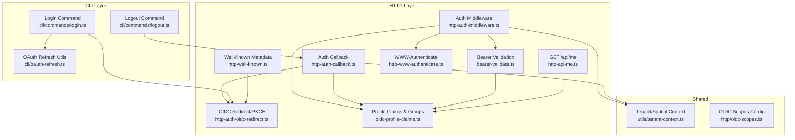
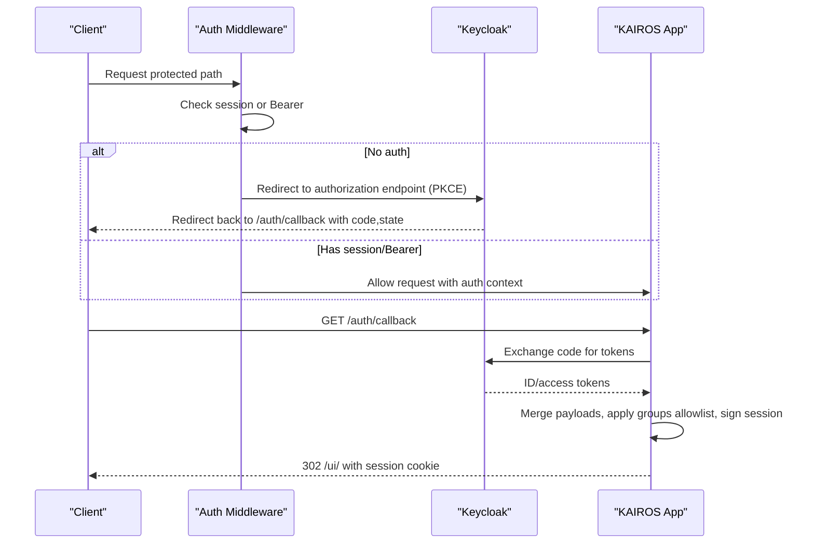
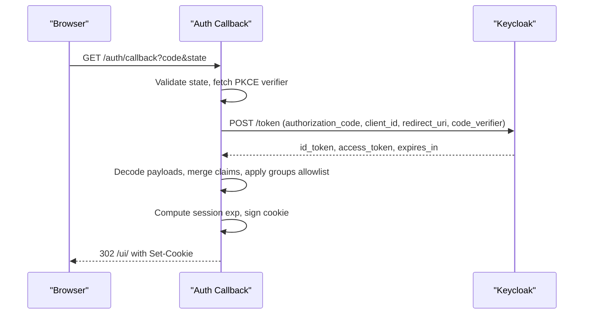
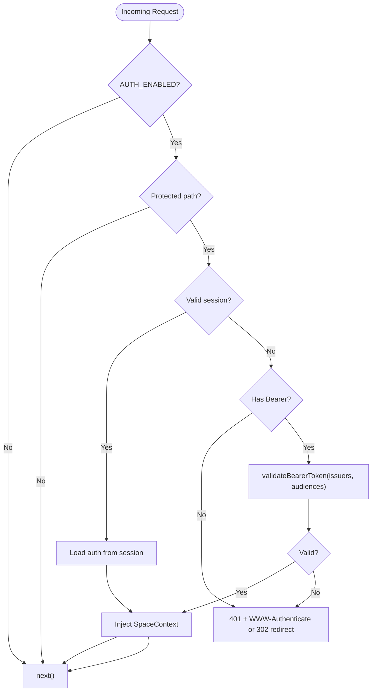
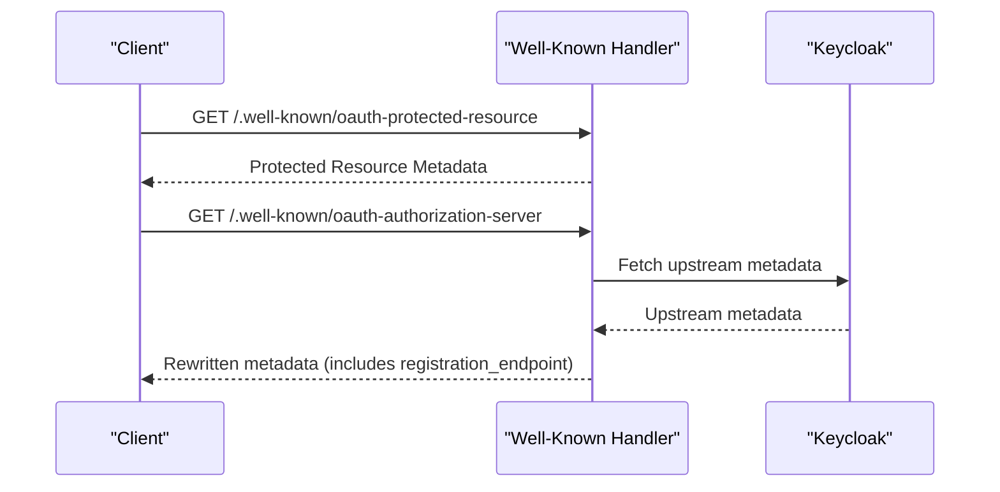
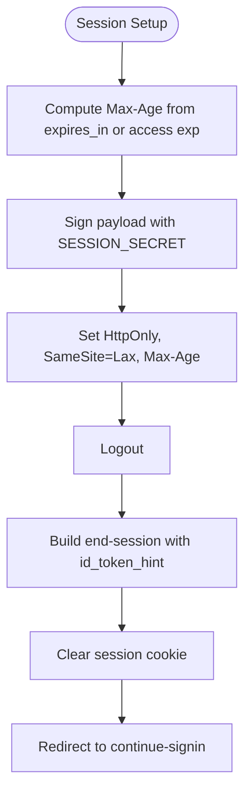
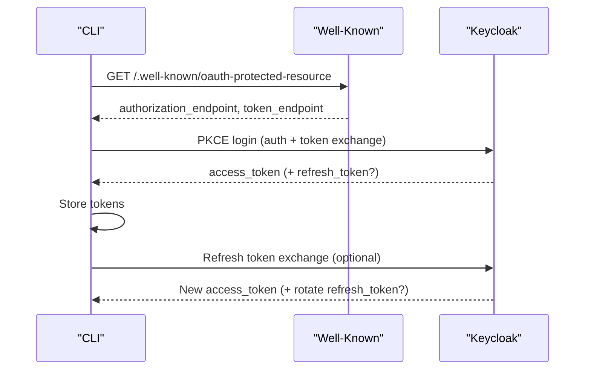
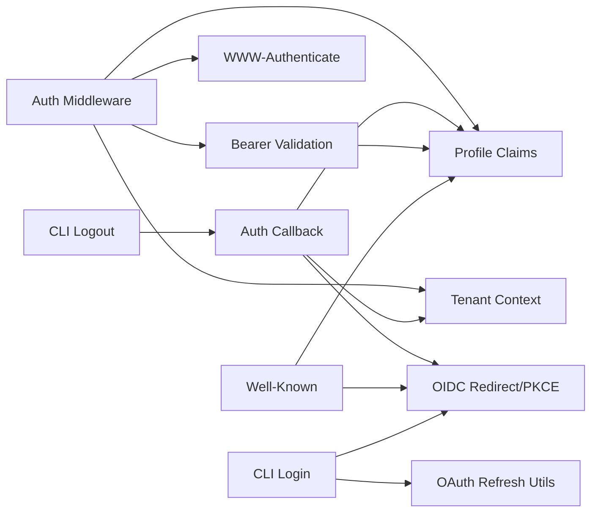

# Authentication & Authorization

<cite>
**Referenced Files in This Document**
- [src/http/http-auth-middleware.ts](file://src/http/http-auth-middleware.ts)
- [src/http/bearer-validate.ts](file://src/http/bearer-validate.ts)
- [src/http/http-auth-callback.ts](file://src/http/http-auth-callback.ts)
- [src/http/http-auth-oidc-redirect.ts](file://src/http/http-auth-oidc-redirect.ts)
- [src/http/oidc-profile-claims.ts](file://src/http/oidc-profile-claims.ts)
- [src/http/oidc-scopes.ts](file://src/http/oidc-scopes.ts)
- [src/http/http-well-known.ts](file://src/http/http-well-known.ts)
- [src/http/http-www-authenticate.ts](file://src/http/http-www-authenticate.ts)
- [src/http/http-api-me.ts](file://src/http/http-api-me.ts)
- [src/utils/tenant-context.ts](file://src/utils/tenant-context.ts)
- [src/cli/oauth-refresh.ts](file://src/cli/oauth-refresh.ts)
- [src/cli/commands/login.ts](file://src/cli/commands/login.ts)
- [src/cli/commands/logout.ts](file://src/cli/commands/logout.ts)
</cite>

## Table of Contents
1. [Introduction](#introduction)
2. [Project Structure](#project-structure)
3. [Core Components](#core-components)
4. [Architecture Overview](#architecture-overview)
5. [Detailed Component Analysis](#detailed-component-analysis)
6. [Dependency Analysis](#dependency-analysis)
7. [Performance Considerations](#performance-considerations)
8. [Troubleshooting Guide](#troubleshooting-guide)
9. [Conclusion](#conclusion)
10. [Appendices](#appendices)

## Introduction
This document describes the KAIROS MCP authentication and authorization system built on Keycloak via OIDC. It covers client configuration, redirect flows, callback handling, bearer token validation, group-based access control, scope management, middleware protection of API endpoints, profile claims processing, session management, token refresh mechanisms, and logout procedures. Practical examples and security considerations are included to help operators configure authentication providers, set up groups and roles, and implement custom authorization logic.

## Project Structure
The authentication stack is implemented primarily under src/http and src/utils, with CLI support under src/cli. Key areas:
- OIDC redirect and PKCE state management
- Callback handler exchanging authorization code for tokens and setting session cookies
- Middleware enforcing auth on protected paths and deriving space contexts
- Bearer token validation against trusted issuers and audiences
- Profile claims processing and group allowlisting
- Well-known endpoints for OAuth discovery and authorization server metadata proxy
- Session cookie signing and logout with RP-initiated logout
- CLI login and refresh flows

**Diagram sources**
- [src/http/http-auth-middleware.ts:167-313](file://src/http/http-auth-middleware.ts#L167-L313)
- [src/http/http-auth-callback.ts:122-231](file://src/http/http-auth-callback.ts#L122-L231)
- [src/http/http-auth-oidc-redirect.ts:28-100](file://src/http/http-auth-oidc-redirect.ts#L28-L100)
- [src/http/bearer-validate.ts:120-208](file://src/http/bearer-validate.ts#L120-L208)
- [src/http/oidc-profile-claims.ts:192-256](file://src/http/oidc-profile-claims.ts#L192-L256)
- [src/http/http-well-known.ts:56-92](file://src/http/http-well-known.ts#L56-L92)
- [src/http/http-www-authenticate.ts:18-47](file://src/http/http-www-authenticate.ts#L18-L47)
- [src/http/http-api-me.ts:31-40](file://src/http/http-api-me.ts#L31-L40)
- [src/utils/tenant-context.ts:251-286](file://src/utils/tenant-context.ts#L251-L286)
- [src/http/oidc-scopes.ts:1-31](file://src/http/oidc-scopes.ts#L1-L31)
- [src/cli/oauth-refresh.ts:26-86](file://src/cli/oauth-refresh.ts#L26-L86)
- [src/cli/commands/login.ts:69-196](file://src/cli/commands/login.ts#L69-L196)
- [src/cli/commands/logout.ts:10-19](file://src/cli/commands/logout.ts#L10-L19)

**Section sources**
- [src/http/http-auth-middleware.ts:167-313](file://src/http/http-auth-middleware.ts#L167-L313)
- [src/http/http-auth-callback.ts:84-231](file://src/http/http-auth-callback.ts#L84-L231)
- [src/http/http-auth-oidc-redirect.ts:28-100](file://src/http/http-auth-oidc-redirect.ts#L28-L100)
- [src/http/bearer-validate.ts:120-208](file://src/http/bearer-validate.ts#L120-L208)
- [src/http/oidc-profile-claims.ts:192-256](file://src/http/oidc-profile-claims.ts#L192-L256)
- [src/http/http-well-known.ts:56-92](file://src/http/http-well-known.ts#L56-L92)
- [src/http/http-www-authenticate.ts:18-47](file://src/http/http-www-authenticate.ts#L18-L47)
- [src/http/http-api-me.ts:31-40](file://src/http/http-api-me.ts#L31-L40)
- [src/utils/tenant-context.ts:251-286](file://src/utils/tenant-context.ts#L251-L286)
- [src/http/oidc-scopes.ts:1-31](file://src/http/oidc-scopes.ts#L1-L31)
- [src/cli/oauth-refresh.ts:26-86](file://src/cli/oauth-refresh.ts#L26-L86)
- [src/cli/commands/login.ts:69-196](file://src/cli/commands/login.ts#L69-L196)
- [src/cli/commands/logout.ts:10-19](file://src/cli/commands/logout.ts#L10-L19)

## Core Components
- OIDC Redirect and PKCE: Generates state and code challenge, stores state for CSRF protection, builds authorization URL, and constructs RP-initiated logout URL.
- Auth Callback: Exchanges authorization code for tokens, merges payloads from ID and access tokens, applies group allowlist, signs session cookie, and sets session max age.
- Auth Middleware: Enforces auth on protected paths, supports session and Bearer auth, validates issuer/audience for Bearer tokens, derives space context, and injects auth info into requests.
- Bearer Validation: Validates JWT signatures and claims using JWKS, resolves issuer base for internal Docker environments, optionally fetches groups from userinfo, and enriches profile claims.
- Profile Claims and Groups: Normalizes groups, applies allowlist filtering, merges callback payloads, and enriches auth payload with whitelisted profile fields.
- Well-Known Metadata: Exposes protected resource metadata and proxies authorization server metadata while preserving registration endpoints for Dynamic Client Registration.
- WWW-Authenticate: Builds standardized WWW-Authenticate headers for 401 responses to guide clients through re-authentication.
- Tenant/Spatial Context: Derives allowed spaces from auth payload, computes personal and group spaces deterministically, and manages AsyncLocalStorage for cross-service context.
- CLI Login and Refresh: Implements PKCE login flow and refresh_token grant for CLI, discovers endpoints from well-known metadata, and stores tokens.

**Section sources**
- [src/http/http-auth-oidc-redirect.ts:28-100](file://src/http/http-auth-oidc-redirect.ts#L28-L100)
- [src/http/http-auth-callback.ts:122-231](file://src/http/http-auth-callback.ts#L122-L231)
- [src/http/http-auth-middleware.ts:167-313](file://src/http/http-auth-middleware.ts#L167-L313)
- [src/http/bearer-validate.ts:120-208](file://src/http/bearer-validate.ts#L120-L208)
- [src/http/oidc-profile-claims.ts:192-256](file://src/http/oidc-profile-claims.ts#L192-L256)
- [src/http/http-well-known.ts:31-54](file://src/http/http-well-known.ts#L31-L54)
- [src/http/http-www-authenticate.ts:18-47](file://src/http/http-www-authenticate.ts#L18-L47)
- [src/utils/tenant-context.ts:251-286](file://src/utils/tenant-context.ts#L251-L286)
- [src/cli/commands/login.ts:69-196](file://src/cli/commands/login.ts#L69-L196)
- [src/cli/oauth-refresh.ts:26-86](file://src/cli/oauth-refresh.ts#L26-L86)

## Architecture Overview
The system integrates browser and API clients with Keycloak via OIDC. Protected paths enforce authentication; browsers are redirected to Keycloak for login; API clients use Bearer tokens validated against trusted issuers and audiences. Sessions are stored as signed cookies and used for RP-initiated logout. Group membership controls access to spaces; scopes define capabilities; well-known endpoints enable discovery and Dynamic Client Registration.

**Diagram sources**
- [src/http/http-auth-middleware.ts:167-313](file://src/http/http-auth-middleware.ts#L167-L313)
- [src/http/http-auth-oidc-redirect.ts:28-100](file://src/http/http-auth-oidc-redirect.ts#L28-L100)
- [src/http/http-auth-callback.ts:122-231](file://src/http/http-auth-callback.ts#L122-L231)

## Detailed Component Analysis

### OIDC Redirect and PKCE
- Generates state and PKCE code verifier/challenge.
- Stores state with TTL to guard against CSRF.
- Builds authorization URL with openid/profile/email scopes and prompt=login.
- Supports RP-initiated logout with id_token_hint when available.

**Diagram sources**
- [src/http/http-auth-oidc-redirect.ts:28-100](file://src/http/http-auth-oidc-redirect.ts#L28-L100)

**Section sources**
- [src/http/http-auth-oidc-redirect.ts:28-100](file://src/http/http-auth-oidc-redirect.ts#L28-L100)

### Auth Callback: Exchange Code and Set Session
- Validates AUTH_ENABLED and required environment variables.
- Exchanges authorization code for tokens using PKCE.
- Merges ID and access token payloads, normalizes groups, applies allowlist.
- Resolves session max age from token lifetimes; signs session cookie; redirects to UI.
- Supports RP-initiated logout via end-session with id_token_hint.

**Diagram sources**
- [src/http/http-auth-callback.ts:122-231](file://src/http/http-auth-callback.ts#L122-L231)

**Section sources**
- [src/http/http-auth-callback.ts:122-231](file://src/http/http-auth-callback.ts#L122-L231)

### Auth Middleware: Protecting Endpoints and Space Context
- Protects /api, /mcp, /ui, and subpaths.
- Supports session auth (signed cookie) and Bearer auth (JWT).
- For Bearer, validates issuer against trusted list and audience against allowed list.
- Derives SpaceContext from auth payload; enforces allowed space selection via query param.
- Injects auth and space context into request; sets WWW-Authenticate on 401.

**Diagram sources**
- [src/http/http-auth-middleware.ts:167-313](file://src/http/http-auth-middleware.ts#L167-L313)

**Section sources**
- [src/http/http-auth-middleware.ts:167-313](file://src/http/http-auth-middleware.ts#L167-L313)

### Bearer Token Validation
- Decodes JWT without verification to check issuer.
- Uses JWKS to verify signature and claims.
- Resolves issuer base for internal Docker connectivity.
- Accepts Keycloak special audiences ("account", empty aud for realm issuer).
- Extracts groups from access token or nested id_token; optionally fetches from userinfo.
- Applies groups allowlist and enriches profile claims.

**Diagram sources**
- [src/http/bearer-validate.ts:120-208](file://src/http/bearer-validate.ts#L120-L208)

**Section sources**
- [src/http/bearer-validate.ts:120-208](file://src/http/bearer-validate.ts#L120-L208)

### Profile Claims Processing and Group Allowlist
- Extracts whitelisted profile fields from ID/access tokens.
- Merges callback payloads ensuring consistent sub and issuer/realm derivation.
- Normalizes groups to canonical paths and applies allowlist rules:
  - Exact match (with or without leading slash variants)
  - Prefix matching (ending with "/")
- Derives account kind and label from identity provider.

**Diagram sources**
- [src/http/oidc-profile-claims.ts:192-256](file://src/http/oidc-profile-claims.ts#L192-L256)

**Section sources**
- [src/http/oidc-profile-claims.ts:192-256](file://src/http/oidc-profile-claims.ts#L192-L256)

### Well-Known Metadata and Authorization Server Proxy
- Exposes protected resource metadata including resource, authorization servers, scopes, and bearer methods.
- Proxies authorization server metadata from Keycloak, rewriting internal URLs for containerized deployments.
- Preserves registration_endpoint to support Dynamic Client Registration.

**Diagram sources**
- [src/http/http-well-known.ts:56-92](file://src/http/http-well-known.ts#L56-L92)
- [src/http/http-well-known.ts:188-220](file://src/http/http-well-known.ts#L188-L220)

**Section sources**
- [src/http/http-well-known.ts:31-54](file://src/http/http-well-known.ts#L31-L54)
- [src/http/http-well-known.ts:188-220](file://src/http/http-well-known.ts#L188-L220)

### Session Management and Logout
- Session cookie is signed with SHA256-HMAC and carries exp, groups, realm, and profile fields.
- Session max age computed from token lifetimes with safety margins.
- RP-initiated logout builds end-session URL with id_token_hint when available; clears session cookie.
- Continue-sign-in path triggers immediate re-login flow.

**Diagram sources**
- [src/http/http-auth-callback.ts:34-82](file://src/http/http-auth-callback.ts#L34-L82)
- [src/http/http-auth-callback.ts:99-115](file://src/http/http-auth-callback.ts#L99-L115)

**Section sources**
- [src/http/http-auth-callback.ts:34-82](file://src/http/http-auth-callback.ts#L34-L82)
- [src/http/http-auth-callback.ts:99-115](file://src/http/http-auth-callback.ts#L99-L115)

### Scope Management
- Default supported scopes include openid, profile, email, kairos-groups, offline_access.
- Operator-defined scopes are parsed and validated; empty input falls back to defaults.

**Section sources**
- [src/http/oidc-scopes.ts:1-31](file://src/http/oidc-scopes.ts#L1-L31)

### GET /api/me
- Returns whitelisted profile and authorization fields derived from auth context.
- Uses account kind/label derivation from identity provider.

**Section sources**
- [src/http/http-api-me.ts:31-40](file://src/http/http-api-me.ts#L31-L40)

### CLI Login and Refresh
- CLI discovers endpoints from well-known metadata and performs PKCE login.
- Stores access and refresh tokens; refresh_token grant exchanges refresh_token for new access token.
- Provides token validity check via GET /api/me.

**Diagram sources**
- [src/cli/commands/login.ts:69-196](file://src/cli/commands/login.ts#L69-L196)
- [src/cli/oauth-refresh.ts:26-86](file://src/cli/oauth-refresh.ts#L26-L86)

**Section sources**
- [src/cli/commands/login.ts:69-196](file://src/cli/commands/login.ts#L69-L196)
- [src/cli/oauth-refresh.ts:26-86](file://src/cli/oauth-refresh.ts#L26-L86)

## Dependency Analysis
- Auth Middleware depends on:
  - Bearer validation for JWT verification
  - OIDC profile claims for group allowlist and merging
  - Tenant context for space resolution
  - WWW-Authenticate for 401 responses
- Auth Callback depends on:
  - OIDC redirect for PKCE and logout URL building
  - OIDC profile claims for merging and allowlisting
  - Tenant context for space computation
- Bearer validation depends on:
  - OIDC profile claims for group extraction and enrichment
- Well-known metadata depends on:
  - OIDC redirect for issuer base resolution
  - OIDC profile claims for account labeling
- CLI login and refresh depend on:
  - Well-known metadata for endpoint discovery

**Diagram sources**
- [src/http/http-auth-middleware.ts:167-313](file://src/http/http-auth-middleware.ts#L167-L313)
- [src/http/http-auth-callback.ts:122-231](file://src/http/http-auth-callback.ts#L122-L231)
- [src/http/http-auth-oidc-redirect.ts:28-100](file://src/http/http-auth-oidc-redirect.ts#L28-L100)
- [src/http/bearer-validate.ts:120-208](file://src/http/bearer-validate.ts#L120-L208)
- [src/http/oidc-profile-claims.ts:192-256](file://src/http/oidc-profile-claims.ts#L192-L256)
- [src/http/http-well-known.ts:56-92](file://src/http/http-well-known.ts#L56-L92)
- [src/http/http-www-authenticate.ts:18-47](file://src/http/http-www-authenticate.ts#L18-L47)
- [src/utils/tenant-context.ts:251-286](file://src/utils/tenant-context.ts#L251-L286)
- [src/cli/oauth-refresh.ts:26-86](file://src/cli/oauth-refresh.ts#L26-L86)
- [src/cli/commands/login.ts:69-196](file://src/cli/commands/login.ts#L69-L196)
- [src/cli/commands/logout.ts:10-19](file://src/cli/commands/logout.ts#L10-L19)

**Section sources**
- [src/http/http-auth-middleware.ts:167-313](file://src/http/http-auth-middleware.ts#L167-L313)
- [src/http/http-auth-callback.ts:122-231](file://src/http/http-auth-callback.ts#L122-L231)
- [src/http/http-auth-oidc-redirect.ts:28-100](file://src/http/http-auth-oidc-redirect.ts#L28-L100)
- [src/http/bearer-validate.ts:120-208](file://src/http/bearer-validate.ts#L120-L208)
- [src/http/oidc-profile-claims.ts:192-256](file://src/http/oidc-profile-claims.ts#L192-L256)
- [src/http/http-well-known.ts:56-92](file://src/http/http-well-known.ts#L56-L92)
- [src/http/http-www-authenticate.ts:18-47](file://src/http/http-www-authenticate.ts#L18-L47)
- [src/utils/tenant-context.ts:251-286](file://src/utils/tenant-context.ts#L251-L286)
- [src/cli/oauth-refresh.ts:26-86](file://src/cli/oauth-refresh.ts#L26-L86)
- [src/cli/commands/login.ts:69-196](file://src/cli/commands/login.ts#L69-L196)
- [src/cli/commands/logout.ts:10-19](file://src/cli/commands/logout.ts#L10-L19)

## Performance Considerations
- JWKS caching: Remote JWKS is cached per issuer to avoid repeated network fetches during validation.
- State store pruning: OIDC state entries are pruned after TTL to limit memory growth.
- Session max age: Derived conservatively from token lifetimes to balance usability and security.
- Async context propagation: Tenant context uses AsyncLocalStorage to avoid passing context through deep call stacks.

**Section sources**
- [src/http/bearer-validate.ts:41-109](file://src/http/bearer-validate.ts#L41-L109)
- [src/http/http-auth-oidc-redirect.ts:17-26](file://src/http/http-auth-oidc-redirect.ts#L17-L26)
- [src/http/http-auth-callback.ts:34-55](file://src/http/http-auth-callback.ts#L34-L55)
- [src/utils/tenant-context.ts:90-108](file://src/utils/tenant-context.ts#L90-L108)

## Troubleshooting Guide
Common issues and resolutions:
- Missing AUTH_TRUSTED_ISSUERS or AUTH_ALLOWED_AUDIENCES:
  - Bearer auth requires both configured; otherwise a 401 is returned with guidance.
- Invalid or expired Bearer token:
  - Validation rejects tokens with wrong issuer, audience mismatch, or expired/expired signature; clients should trigger re-authentication via WWW-Authenticate.
- Missing id_token or access_token in callback:
  - Callback exchanges code for tokens; absence leads to redirect with error; verify client credentials and redirect URI.
- State mismatch or expired state:
  - Callback validates state against stored PKCE state; mismatch or expiry triggers error redirect.
- Token request failures:
  - Network errors or HTTP errors during token exchange cause redirect with error; inspect logs for details.
- Group membership not reflected:
  - If groups are missing from access token, userinfo is queried; ensure the client has a Group Membership mapper or enable merging userinfo groups.
- Logout not clearing SSO:
  - RP-initiated logout uses id_token_hint when present; ensure post_logout_redirect_uri is registered and HTTPS is used for secure cookies.

Operational checks:
- Verify AUTH_CALLBACK_BASE_URL is set for production to ensure compliant well-known metadata and secure cookies.
- Confirm OIDC groups allowlist aligns with intended spaces; use exact matches or prefix rules.
- Monitor 401 responses with WWW-Authenticate headers to diagnose client re-auth needs.

**Section sources**
- [src/http/http-auth-middleware.ts:232-282](file://src/http/http-auth-middleware.ts#L232-L282)
- [src/http/bearer-validate.ts:132-164](file://src/http/bearer-validate.ts#L132-L164)
- [src/http/http-auth-callback.ts:122-201](file://src/http/http-auth-callback.ts#L122-L201)
- [src/http/http-auth-callback.ts:135-142](file://src/http/http-auth-callback.ts#L135-L142)
- [src/http/http-auth-callback.ts:170-189](file://src/http/http-auth-callback.ts#L170-L189)
- [src/http/oidc-profile-claims.ts:119-153](file://src/http/oidc-profile-claims.ts#L119-L153)
- [src/http/http-auth-callback.ts:99-115](file://src/http/http-auth-callback.ts#L99-L115)

## Conclusion
KAIROS MCP’s authentication and authorization system provides robust OIDC integration with Keycloak, supporting both browser and API clients. It enforces strict group-based access control, derives spatial contexts deterministically, and offers standardized discovery and logout flows. Operators can tailor group allowlists, scopes, and session policies to meet organizational requirements while maintaining security and operability.

## Appendices

### Practical Configuration Examples
- Configure OIDC client in Keycloak:
  - Client ID and secret for browser and CLI.
  - Redirect URIs: AUTH_CALLBACK_BASE_URL with /auth/callback for browser; localhost callback for CLI login.
  - Scopes: openid, profile, email, kairos-groups, offline_access.
  - Group Membership mapper to include groups in ID token or userinfo.
- Environment variables:
  - AUTH_ENABLED, KEYCLOAK_URL, KEYCLOAK_REALM, KEYCLOAK_CLIENT_ID, AUTH_CALLBACK_BASE_URL, SESSION_SECRET, SESSION_MAX_AGE_SEC, AUTH_TRUSTED_ISSUERS, AUTH_ALLOWED_AUDIENCES, OIDC_GROUPS_ALLOWLIST, OIDC_SCOPES_SUPPORTED.
- Set up groups and roles:
  - Create groups in Keycloak; assign users to groups; ensure Group Membership mapper is configured.
  - Use OIDC_GROUPS_ALLOWLIST to restrict which groups become KAIROS spaces.
- Implement custom authorization logic:
  - Extend tenant context derivation or group allowlist rules to reflect domain-specific policies.
  - Use SpaceContext in services to enforce write/read scoping per request.

[No sources needed since this section provides general guidance]