# Authentication & Authorization

<cite>
**Referenced Files in This Document**
- [src/http/http-auth-middleware.ts](file://src/http/http-auth-middleware.ts)
- [src/http/bearer-validate.ts](file://src/http/bearer-validate.ts)
- [src/http/http-auth-callback.ts](file://src/http/http-auth-callback.ts)
- [src/http/http-auth-oidc-redirect.ts](file://src/http/http-auth-oidc-redirect.ts)
- [src/http/oidc-profile-claims.ts](file://src/http/oidc-profile-claims.ts)
- [src/http/oidc-scopes.ts](file://src/http/oidc-scopes.ts)
- [src/http/http-well-known.ts](file://src/http/http-well-known.ts)
- [src/http/http-www-authenticate.ts](file://src/http/http-www-authenticate.ts)
- [src/http/http-api-me.ts](file://src/http/http-api-me.ts)
- [src/http/http-mcp-cors.ts](file://src/http/http-mcp-cors.ts)
- [src/http/http-client-registration-proxy.ts](file://src/http/http-client-registration-proxy.ts)
- [src/http/http-mcp-handler.ts](file://src/http/http-mcp-handler.ts)
- [src/http/mcp-ui-offerings-auth-jsonrpc.ts](file://src/http/mcp-ui-offerings-auth-jsonrpc.ts)
- [src/http/http-error-handlers.ts](file://src/http/http-error-handlers.ts)
- [src/utils/tenant-context.ts](file://src/utils/tenant-context.ts)
- [src/cli/oauth-refresh.ts](file://src/cli/oauth-refresh.ts)
- [src/cli/commands/login.ts](file://src/cli/commands/login.ts)
- [src/cli/commands/logout.ts](file://src/cli/commands/logout.ts)
- [scripts/deploy-configure-keycloak-realms.py](file://scripts/deploy-configure-keycloak-realms.py)
- [helm/kairos-mcp/files/kairos-realm.json](file://helm/kairos-mcp/files/kairos-realm.json)
</cite>

## Update Summary
**Changes Made**
- Enhanced Keycloak OAuth configuration with new optional client scopes support
- Added ensure_client_optional_scope() and list_client_optional_scopes() functions to manage optional scopes
- Updated CLIENT_OPTIONAL_SCOPES constant to include profile, email, and offline_access
- Updated Helm chart configuration to resolve invalid_scope errors
- Improved client scope management for dynamic registration and token issuance
- Enhanced scope validation and error handling for OAuth 2.0 compliance

## Table of Contents
1. [Introduction](#introduction)
2. [Project Structure](#project-structure)
3. [Core Components](#core-components)
4. [Architecture Overview](#architecture-overview)
5. [Detailed Component Analysis](#detailed-component-analysis)
6. [Enhanced JSON-RPC Authentication](#enhanced-json-rpc-authentication)
7. [Dynamic Client Registration Proxy](#dynamic-client-registration-proxy)
8. [CORS and Preflight Handling](#cors-and-preflight-handling)
9. [Client Scope Management](#client-scope-management)
10. [Dependency Analysis](#dependency-analysis)
11. [Performance Considerations](#performance-considerations)
12. [Troubleshooting Guide](#troubleshooting-guide)
13. [Conclusion](#conclusion)
14. [Appendices](#appendices)

## Introduction
This document describes the KAIROS MCP authentication and authorization system built on Keycloak via OIDC. It covers client configuration, redirect flows, callback handling, bearer token validation, group-based access control, scope management, middleware protection of API endpoints, profile claims processing, session management, token refresh mechanisms, and logout procedures. The system now includes enhanced JSON-RPC authentication error handling, comprehensive WWW-Authenticate header implementation, CORS preflight bypass, Dynamic Client Registration proxy functionality, and advanced client scope management for improved OAuth 2.0 compliance and operational reliability.

## Project Structure
The authentication stack is implemented primarily under src/http and src/utils, with CLI support under src/cli. Key areas:
- OIDC redirect and PKCE state management
- Callback handler exchanging authorization code for tokens and setting session cookies
- Middleware enforcing auth on protected paths and deriving space contexts
- Bearer token validation against trusted issuers and audiences
- Profile claims processing and group allowlisting
- Well-known endpoints for OAuth discovery and authorization server metadata proxy
- Session cookie signing and logout with RP-initiated logout
- CLI login and refresh flows
- **Enhanced**: JSON-RPC error envelope handling for MCP clients
- **Enhanced**: Comprehensive WWW-Authenticate header implementation
- **Enhanced**: CORS preflight bypass for proper header exposure
- **Enhanced**: Dynamic Client Registration proxy for OIDC client management
- **Enhanced**: Advanced client scope management with optional scopes support

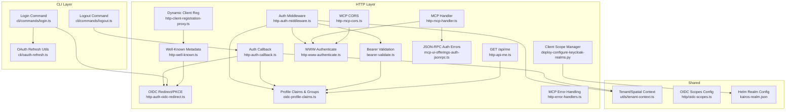

**Diagram sources**
- [src/http/http-auth-middleware.ts:168-326](file://src/http/http-auth-middleware.ts#L168-L326)
- [src/http/http-auth-callback.ts:122-231](file://src/http/http-auth-callback.ts#L122-L231)
- [src/http/http-auth-oidc-redirect.ts:28-100](file://src/http/http-auth-oidc-redirect.ts#L28-L100)
- [src/http/bearer-validate.ts:120-208](file://src/http/bearer-validate.ts#L120-L208)
- [src/http/oidc-profile-claims.ts:192-256](file://src/http/oidc-profile-claims.ts#L192-L256)
- [src/http/http-well-known.ts:56-92](file://src/http/http-well-known.ts#L56-L92)
- [src/http/http-www-authenticate.ts:18-47](file://src/http/http-www-authenticate.ts#L18-L47)
- [src/http/http-api-me.ts:31-40](file://src/http/http-api-me.ts#L31-L40)
- [src/http/http-mcp-handler.ts:128-344](file://src/http/http-mcp-handler.ts#L128-L344)
- [src/http/http-error-handlers.ts:9-53](file://src/http/http-error-handlers.ts#L9-L53)
- [src/http/mcp-ui-offerings-auth-jsonrpc.ts:10-35](file://src/http/mcp-ui-offerings-auth-jsonrpc.ts#L10-L35)
- [src/http/http-mcp-cors.ts:3-29](file://src/http/http-mcp-cors.ts#L3-L29)
- [src/http/http-client-registration-proxy.ts:140-175](file://src/http/http-client-registration-proxy.ts#L140-L175)
- [src/utils/tenant-context.ts:251-286](file://src/utils/tenant-context.ts#L251-L286)
- [src/http/oidc-scopes.ts:1-31](file://src/http/oidc-scopes.ts#L1-L31)
- [src/cli/oauth-refresh.ts:26-86](file://src/cli/oauth-refresh.ts#L26-L86)
- [src/cli/commands/login.ts:69-196](file://src/cli/commands/login.ts#L69-L196)
- [src/cli/commands/logout.ts:10-19](file://src/cli/commands/logout.ts#L10-L19)
- [scripts/deploy-configure-keycloak-realms.py:716-753](file://scripts/deploy-configure-keycloak-realms.py#L716-L753)
- [helm/kairos-mcp/files/kairos-realm.json:145-176](file://helm/kairos-mcp/files/kairos-realm.json#L145-L176)

**Section sources**
- [src/http/http-auth-middleware.ts:168-326](file://src/http/http-auth-middleware.ts#L168-L326)
- [src/http/http-auth-callback.ts:84-231](file://src/http/http-auth-callback.ts#L84-L231)
- [src/http/http-auth-oidc-redirect.ts:28-100](file://src/http/http-auth-oidc-redirect.ts#L28-L100)
- [src/http/bearer-validate.ts:120-208](file://src/http/bearer-validate.ts#L120-L208)
- [src/http/oidc-profile-claims.ts:192-256](file://src/http/oidc-profile-claims.ts#L192-L256)
- [src/http/http-well-known.ts:56-92](file://src/http/http-well-known.ts#L56-L92)
- [src/http/http-www-authenticate.ts:18-47](file://src/http/http-www-authenticate.ts#L18-L47)
- [src/http/http-api-me.ts:31-40](file://src/http/http-api-me.ts#L31-L40)
- [src/http/http-mcp-handler.ts:128-344](file://src/http/http-mcp-handler.ts#L128-L344)
- [src/http/http-error-handlers.ts:9-53](file://src/http/http-error-handlers.ts#L9-L53)
- [src/http/mcp-ui-offerings-auth-jsonrpc.ts:10-35](file://src/http/mcp-ui-offerings-auth-jsonrpc.ts#L10-L35)
- [src/http/http-mcp-cors.ts:3-29](file://src/http/http-mcp-cors.ts#L3-L29)
- [src/http/http-client-registration-proxy.ts:140-175](file://src/http/http-client-registration-proxy.ts#L140-L175)
- [src/utils/tenant-context.ts:251-286](file://src/utils/tenant-context.ts#L251-L286)
- [src/http/oidc-scopes.ts:1-31](file://src/http/oidc-scopes.ts#L1-L31)
- [src/cli/oauth-refresh.ts:26-86](file://src/cli/oauth-refresh.ts#L26-L86)
- [src/cli/commands/login.ts:69-196](file://src/cli/commands/login.ts#L69-L196)
- [src/cli/commands/logout.ts:10-19](file://src/cli/commands/logout.ts#L10-L19)
- [scripts/deploy-configure-keycloak-realms.py:716-753](file://scripts/deploy-configure-keycloak-realms.py#L716-L753)
- [helm/kairos-mcp/files/kairos-realm.json:145-176](file://helm/kairos-mcp/files/kairos-realm.json#L145-L176)

## Core Components
- OIDC Redirect and PKCE: Generates state and code challenge, stores state for CSRF protection, builds authorization URL, and constructs RP-initiated logout URL.
- Auth Callback: Exchanges authorization code for tokens, merges payloads from ID and access tokens, applies group allowlist, signs session cookie, and sets session max age.
- Auth Middleware: Enforces auth on protected paths, supports session and Bearer auth, validates issuer/audience for Bearer tokens, derives space context, and injects auth info into requests.
- Bearer Validation: Validates JWT signatures and claims using JWKS, resolves issuer base for internal Docker environments, optionally fetches groups from userinfo, and enriches profile claims.
- Profile Claims and Groups: Normalizes groups, applies allowlist filtering, merges callback payloads, and enriches auth payload with whitelisted profile fields.
- Well-Known Metadata: Exposes protected resource metadata and proxies authorization server metadata while preserving registration endpoints for Dynamic Client Registration.
- **Enhanced**: WWW-Authenticate: Builds standardized WWW-Authenticate headers for 401 responses to guide clients through re-authentication, including error signaling for token invalidation.
- Tenant/Spatial Context: Derives allowed spaces from auth payload, computes personal and group spaces deterministically, and manages AsyncLocalStorage for cross-service context.
- CLI Login and Refresh: Implements PKCE login flow and refresh_token grant for CLI, discovers endpoints from well-known metadata, and stores tokens.
- **Enhanced**: JSON-RPC Authentication: Provides proper error envelopes for MCP clients with actionable error codes and login URLs.
- **Enhanced**: Dynamic Client Registration: Proxies OIDC client registration endpoints with URL rewriting for public accessibility.
- **Enhanced**: CORS Handling: Implements preflight bypass and proper header exposure for MCP endpoints.
- **Enhanced**: Client Scope Management: Manages optional client scopes including profile, email, and offline_access to resolve invalid_scope errors and improve OAuth 2.0 compliance.

**Section sources**
- [src/http/http-auth-oidc-redirect.ts:28-100](file://src/http/http-auth-oidc-redirect.ts#L28-L100)
- [src/http/http-auth-callback.ts:122-231](file://src/http/http-auth-callback.ts#L122-L231)
- [src/http/http-auth-middleware.ts:168-326](file://src/http/http-auth-middleware.ts#L168-L326)
- [src/http/bearer-validate.ts:120-208](file://src/http/bearer-validate.ts#L120-L208)
- [src/http/oidc-profile-claims.ts:192-256](file://src/http/oidc-profile-claims.ts#L192-L256)
- [src/http/http-well-known.ts:31-54](file://src/http/http-well-known.ts#L31-L54)
- [src/http/http-www-authenticate.ts:18-47](file://src/http/http-www-authenticate.ts#L18-L47)
- [src/utils/tenant-context.ts:251-286](file://src/utils/tenant-context.ts#L251-L286)
- [src/cli/commands/login.ts:69-196](file://src/cli/commands/login.ts#L69-L196)
- [src/cli/oauth-refresh.ts:26-86](file://src/cli/oauth-refresh.ts#L26-L86)
- [src/http/http-mcp-handler.ts:87-118](file://src/http/http-mcp-handler.ts#L87-L118)
- [src/http/http-client-registration-proxy.ts:140-175](file://src/http/http-client-registration-proxy.ts#L140-L175)
- [src/http/http-mcp-cors.ts:3-29](file://src/http/http-mcp-cors.ts#L3-L29)
- [scripts/deploy-configure-keycloak-realms.py:716-753](file://scripts/deploy-configure-keycloak-realms.py#L716-L753)
- [helm/kairos-mcp/files/kairos-realm.json:145-176](file://helm/kairos-mcp/files/kairos-realm.json#L145-L176)

## Architecture Overview
The system integrates browser and API clients with Keycloak via OIDC. Protected paths enforce authentication; browsers are redirected to Keycloak for login; API clients use Bearer tokens validated against trusted issuers and audiences. Sessions are stored as signed cookies and used for RP-initiated logout. Group membership controls access to spaces; scopes define capabilities; well-known endpoints enable discovery and Dynamic Client Registration. **Enhanced** MCP clients now receive structured JSON-RPC error envelopes with proper WWW-Authenticate headers for seamless re-authentication. **Enhanced** Client scope management ensures proper handling of optional scopes to prevent invalid_scope errors during token issuance and dynamic registration.

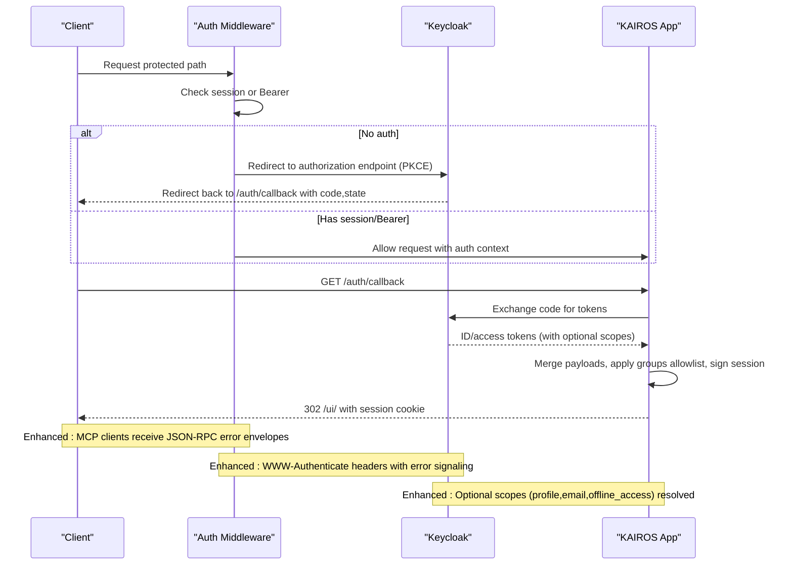

**Diagram sources**
- [src/http/http-auth-middleware.ts:168-326](file://src/http/http-auth-middleware.ts#L168-L326)
- [src/http/http-auth-oidc-redirect.ts:28-100](file://src/http/http-auth-oidc-redirect.ts#L28-L100)
- [src/http/http-auth-callback.ts:122-231](file://src/http/http-auth-callback.ts#L122-L231)

## Detailed Component Analysis

### OIDC Redirect and PKCE
- Generates state and PKCE code verifier/challenge.
- Stores state with TTL to guard against CSRF.
- Builds authorization URL with openid/profile/email scopes and prompt=login.
- Supports RP-initiated logout with id_token_hint when available.

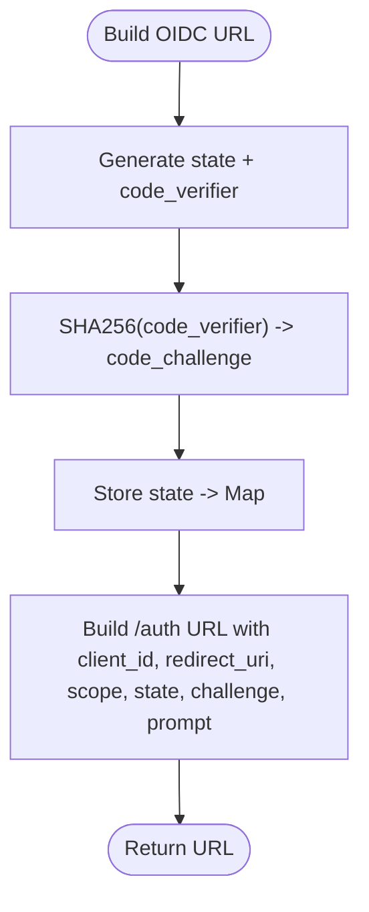

**Diagram sources**
- [src/http/http-auth-oidc-redirect.ts:28-100](file://src/http/http-auth-oidc-redirect.ts#L28-L100)

**Section sources**
- [src/http/http-auth-oidc-redirect.ts:28-100](file://src/http/http-auth-oidc-redirect.ts#L28-L100)

### Auth Callback: Exchange Code and Set Session
- Validates AUTH_ENABLED and required environment variables.
- Exchanges authorization code for tokens using PKCE.
- Merges ID and access token payloads, normalizes groups, applies allowlist.
- Resolves session max age from token lifetimes; signs session cookie; redirects to UI.
- Supports RP-initiated logout via end-session with id_token_hint.

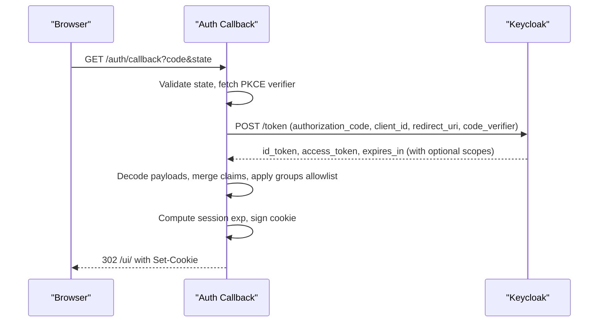

**Diagram sources**
- [src/http/http-auth-callback.ts:122-231](file://src/http/http-auth-callback.ts#L122-L231)

**Section sources**
- [src/http/http-auth-callback.ts:122-231](file://src/http/http-auth-callback.ts#L122-L231)

### Auth Middleware: Protecting Endpoints and Space Context
- Protects /api, /mcp, /ui, and subpaths.
- Supports session auth (signed cookie) and Bearer auth (JWT).
- For Bearer, validates issuer against trusted list and audience against allowed list.
- Derives SpaceContext from auth payload; enforces allowed space selection via query param.
- Injects auth and space context into request; sets WWW-Authenticate on 401.
- **Enhanced**: Returns JSON-RPC error envelopes for MCP clients instead of generic 401 bodies.

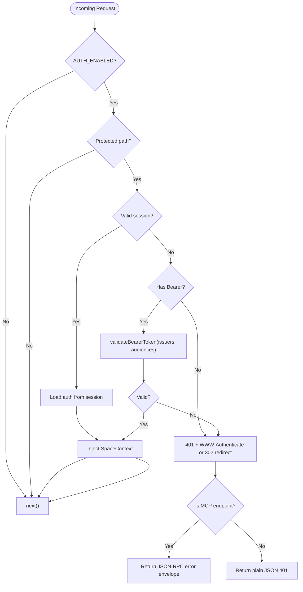

**Diagram sources**
- [src/http/http-auth-middleware.ts:168-326](file://src/http/http-auth-middleware.ts#L168-L326)

**Section sources**
- [src/http/http-auth-middleware.ts:168-326](file://src/http/http-auth-middleware.ts#L168-L326)

### Bearer Token Validation
- Decodes JWT without verification to check issuer.
- Uses JWKS to verify signature and claims.
- Resolves issuer base for internal Docker connectivity.
- Accepts Keycloak special audiences ("account", empty aud for realm issuer).
- Extracts groups from access token or nested id_token; optionally fetches from userinfo.
- Applies groups allowlist and enriches profile claims.

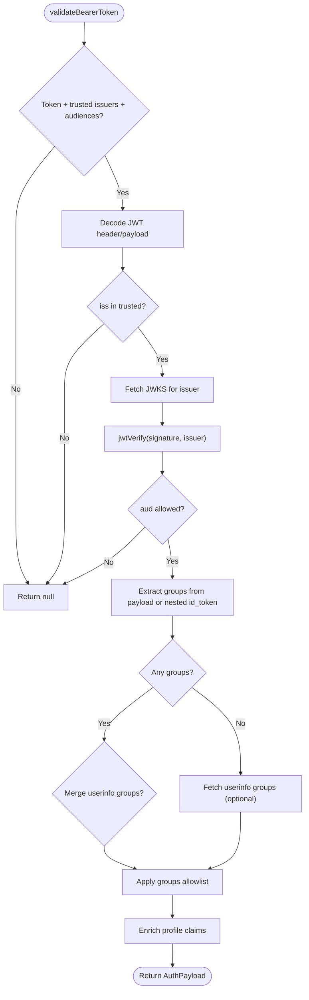

**Diagram sources**
- [src/http/bearer-validate.ts:120-208](file://src/http/bearer-validate.ts#L120-L208)

**Section sources**
- [src/http/bearer-validate.ts:120-208](file://src/http/bearer-validate.ts#L120-L208)

### Profile Claims Processing and Group Allowlist
- Extracts whitelisted profile fields from ID/access tokens.
- Merges callback payloads ensuring consistent sub and issuer/realm derivation.
- Normalizes groups to canonical paths and applies allowlist rules:
  - Exact match (with or without leading slash variants)
  - Prefix matching (ending with "/")
- Derives account kind and label from identity provider.

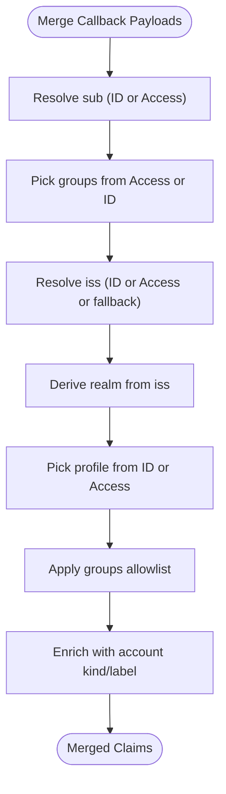

**Diagram sources**
- [src/http/oidc-profile-claims.ts:192-256](file://src/http/oidc-profile-claims.ts#L192-L256)

**Section sources**
- [src/http/oidc-profile-claims.ts:192-256](file://src/http/oidc-profile-claims.ts#L192-L256)

### Well-Known Metadata and Authorization Server Proxy
- Exposes protected resource metadata including resource, authorization servers, scopes, and bearer methods.
- Proxies authorization server metadata from Keycloak, rewriting internal URLs for containerized deployments.
- Preserves registration_endpoint to support Dynamic Client Registration.
- **Enhanced**: Integrates Dynamic Client Registration proxy for seamless client management.

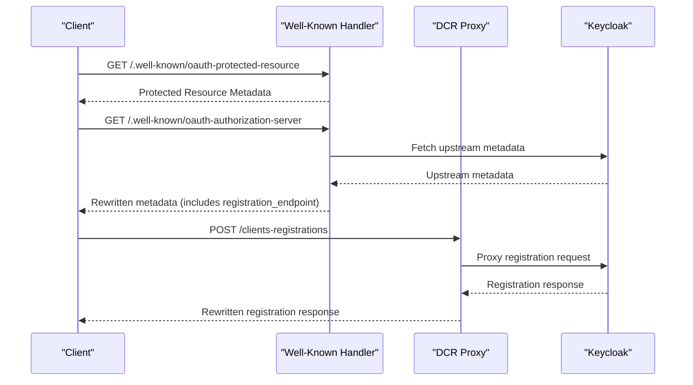

**Diagram sources**
- [src/http/http-well-known.ts:56-92](file://src/http/http-well-known.ts#L56-L92)
- [src/http/http-well-known.ts:188-220](file://src/http/http-well-known.ts#L188-L220)
- [src/http/http-client-registration-proxy.ts:140-175](file://src/http/http-client-registration-proxy.ts#L140-L175)

**Section sources**
- [src/http/http-well-known.ts:31-54](file://src/http/http-well-known.ts#L31-L54)
- [src/http/http-well-known.ts:188-220](file://src/http/http-well-known.ts#L188-L220)
- [src/http/http-client-registration-proxy.ts:140-175](file://src/http/http-client-registration-proxy.ts#L140-L175)

### Session Management and Logout
- Session cookie is signed with SHA256-HMAC and carries exp, groups, realm, and profile fields.
- Session max age computed from token lifetimes with safety margins.
- RP-initiated logout builds end-session URL with id_token_hint when available; clears session cookie.
- Continue-sign-in path triggers immediate re-login flow.

**Diagram sources**
- [src/http/http-auth-callback.ts:34-82](file://src/http/http-auth-callback.ts#L34-L82)
- [src/http/http-auth-callback.ts:99-115](file://src/http/http-auth-callback.ts#L99-L115)

**Section sources**
- [src/http/http-auth-callback.ts:34-82](file://src/http/http-auth-callback.ts#L34-L82)
- [src/http/http-auth-callback.ts:99-115](file://src/http/http-auth-callback.ts#L99-L115)

### Scope Management
- Default supported scopes include openid, profile, email, kairos-groups, offline_access.
- Operator-defined scopes are parsed and validated; empty input falls back to defaults.
- **Enhanced**: Client scope management now handles optional scopes to prevent invalid_scope errors.

**Section sources**
- [src/http/oidc-scopes.ts:1-31](file://src/http/oidc-scopes.ts#L1-L31)

### GET /api/me
- Returns whitelisted profile and authorization fields derived from auth context.
- Uses account kind/label derivation from identity provider.

**Section sources**
- [src/http/http-api-me.ts:31-40](file://src/http/http-api-me.ts#L31-L40)

### CLI Login and Refresh
- CLI discovers endpoints from well-known metadata and performs PKCE login.
- Stores access and refresh tokens; refresh_token grant exchanges refresh_token for new access token.
- Provides token validity check via GET /api/me.

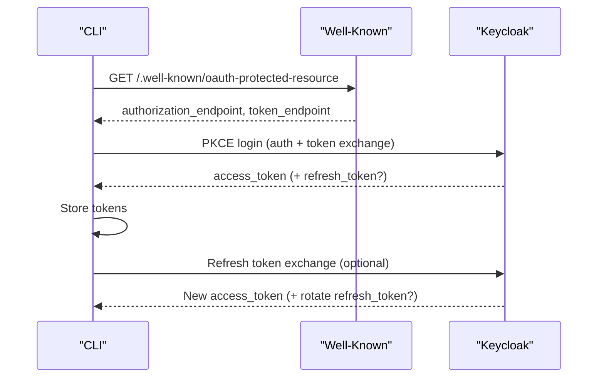

**Diagram sources**
- [src/cli/commands/login.ts:69-196](file://src/cli/commands/login.ts#L69-L196)
- [src/cli/oauth-refresh.ts:26-86](file://src/cli/oauth-refresh.ts#L26-L86)

**Section sources**
- [src/cli/commands/login.ts:69-196](file://src/cli/commands/login.ts#L69-L196)
- [src/cli/oauth-refresh.ts:26-86](file://src/cli/oauth-refresh.ts#L26-L86)

## Enhanced JSON-RPC Authentication

**Updated** The system now provides comprehensive JSON-RPC error handling for MCP clients, ensuring they receive structured error envelopes instead of generic HTTP responses.

### JSON-RPC Error Envelope Implementation
- MCP clients receive JSON-RPC 2.0 error envelopes with proper error codes (-32001 for auth required).
- Includes actionable data fields: error type, reauth requirement, and login URL.
- Maintains backward compatibility for non-JSON-RPC requests.
- **Enhanced**: Proper error signaling with WWW-Authenticate headers for token invalidation scenarios.

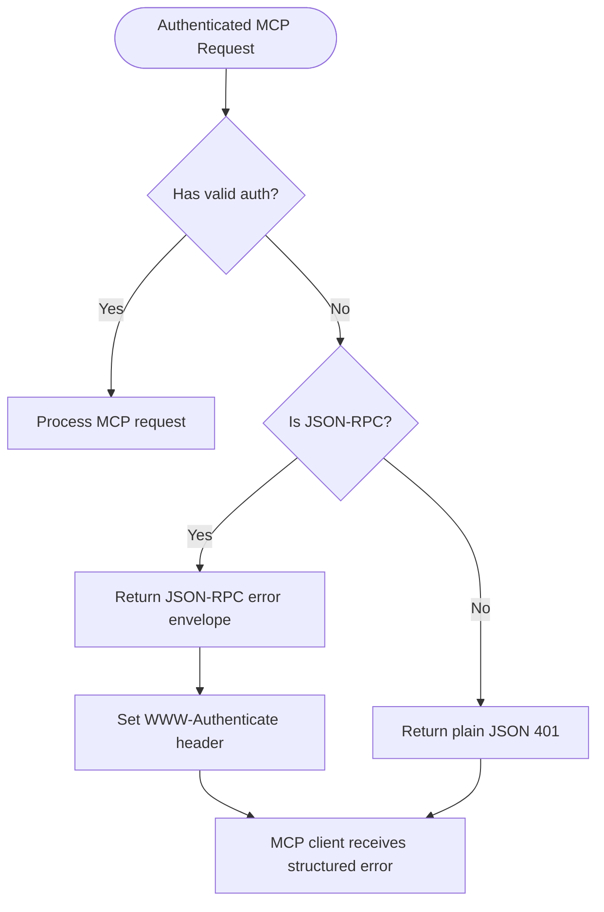

**Diagram sources**
- [src/http/http-auth-middleware.ts:310-323](file://src/http/http-auth-middleware.ts#L310-L323)
- [src/http/mcp-ui-offerings-auth-jsonrpc.ts:10-35](file://src/http/mcp-ui-offerings-auth-jsonrpc.ts#L10-L35)

**Section sources**
- [src/http/http-auth-middleware.ts:310-323](file://src/http/http-auth-middleware.ts#L310-L323)
- [src/http/mcp-ui-offerings-auth-jsonrpc.ts:10-35](file://src/http/mcp-ui-offerings-auth-jsonrpc.ts#L10-L35)

### MCP Handler Error Processing
- Converts internal errors to user-friendly JSON-RPC error envelopes.
- Provides error codes, retry hints, and sanitized details.
- Handles concurrent request conflicts with specific error codes.
- **Enhanced**: Proper error handling for MCP-specific scenarios.

**Section sources**
- [src/http/http-mcp-handler.ts:87-118](file://src/http/http-mcp-handler.ts#L87-L118)
- [src/http/http-mcp-handler.ts:308-340](file://src/http/http-mcp-handler.ts#L308-L340)

## Dynamic Client Registration Proxy

**Updated** The system now includes a comprehensive Dynamic Client Registration (DCR) proxy for seamless OIDC client management.

### DCR Proxy Architecture
- Proxies Keycloak's OIDC client registration endpoints transparently.
- Rewrites registration_client_uri URLs to use public base URL.
- Supports all standard DCR operations: POST, GET, PUT, DELETE.
- Implements proper CORS handling for client registration workflows.
- **Enhanced**: Automatic URL rewriting preserves client identity across environments.

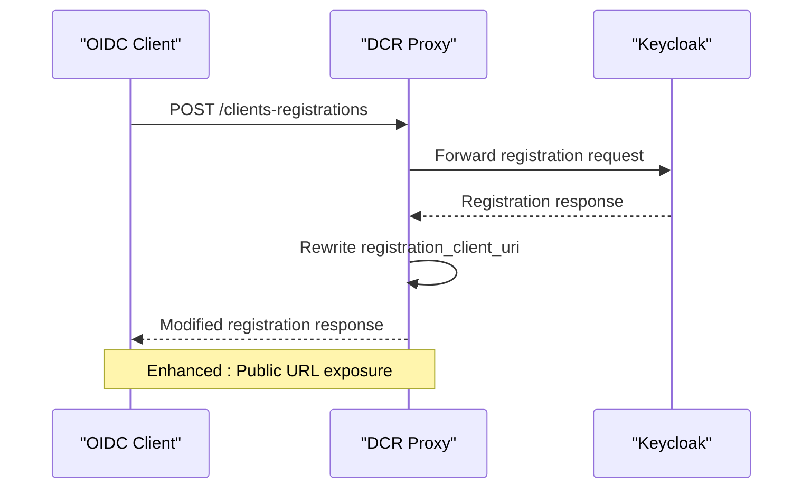

**Diagram sources**
- [src/http/http-client-registration-proxy.ts:140-175](file://src/http/http-client-registration-proxy.ts#L140-L175)
- [src/http/http-client-registration-proxy.ts:56-138](file://src/http/http-client-registration-proxy.ts#L56-L138)

**Section sources**
- [src/http/http-client-registration-proxy.ts:140-175](file://src/http/http-client-registration-proxy.ts#L140-L175)
- [src/http/http-client-registration-proxy.ts:56-138](file://src/http/http-client-registration-proxy.ts#L56-L138)

### Well-Known Endpoint Integration
- Exposes registration_endpoint in authorization server metadata.
- Integrates DCR proxy with well-known endpoints for discovery.
- Supports both GET and OPTIONS requests for preflight handling.
- **Enhanced**: Seamless integration with OIDC discovery protocols.

**Section sources**
- [src/http/http-well-known.ts:179-186](file://src/http/http-well-known.ts#L179-L186)
- [src/http/http-well-known.ts:89-89](file://src/http/http-well-known.ts#L89-L89)

## CORS and Preflight Handling

**Updated** The system now implements comprehensive CORS handling specifically designed for MCP endpoints to ensure proper header exposure and preflight bypass.

### MCP CORS Configuration
- Implements dedicated CORS handling for /mcp endpoints.
- Exposes WWW-Authenticate header to MCP clients.
- Supports preflight bypass for optimal performance.
- Handles both authenticated and unauthenticated requests.
- **Enhanced**: Proper header exposure for MCP-specific authentication flows.

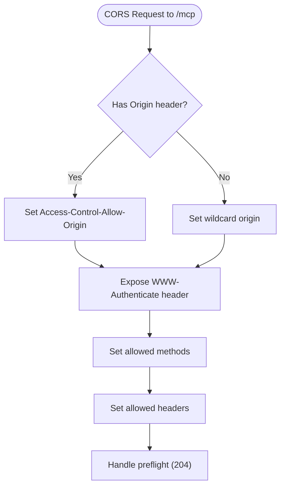

**Diagram sources**
- [src/http/http-mcp-cors.ts:3-29](file://src/http/http-mcp-cors.ts#L3-L29)

**Section sources**
- [src/http/http-mcp-cors.ts:3-29](file://src/http/http-mcp-cors.ts#L3-L29)

### Global Error Handling Enhancement
- Provides structured error logging for all HTTP errors.
- Handles payload too large errors with appropriate JSON responses.
- Implements catch-all 404 handler for undefined routes.
- **Enhanced**: Consistent error handling across all HTTP endpoints.

**Section sources**
- [src/http/http-error-handlers.ts:9-53](file://src/http/http-error-handlers.ts#L9-L53)

## Client Scope Management

**Updated** The system now includes comprehensive client scope management to handle optional scopes and resolve invalid_scope errors during OAuth 2.0 flows.

### Optional Client Scopes Support
- **Enhanced**: Added ensure_client_optional_scope() function to manage optional client scopes
- **Enhanced**: Added list_client_optional_scopes() function to enumerate current optional scopes
- **Enhanced**: CLIENT_OPTIONAL_SCOPES constant now includes "profile", "email", and "offline_access"
- **Enhanced**: Deployment script ensures optional scopes are properly configured for clients

### Client Scope Functions
- list_client_optional_scopes(): Retrieves current optional scopes for a given client
- ensure_client_optional_scope(): Ensures a specific scope is configured as optional for a client
- Integration with Helm chart configuration for automatic scope provisioning

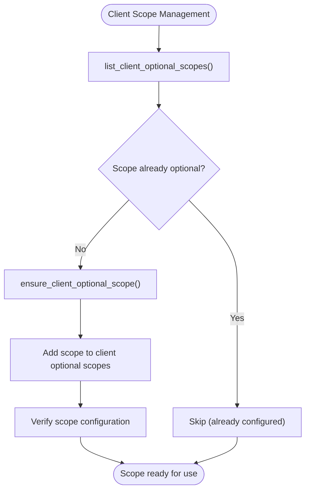

**Diagram sources**
- [scripts/deploy-configure-keycloak-realms.py:716-753](file://scripts/deploy-configure-keycloak-realms.py#L716-L753)

### Helm Chart Configuration
- **Enhanced**: Updated kairos-realm.json to include optionalClientScopes for kairos-mcp and kairos-cli clients
- **Enhanced**: Configured optional scopes: ["openid", "profile", "email", "offline_access"]
- **Enhanced**: Resolves invalid_scope errors by ensuring proper scope availability
- **Enhanced**: Maintains compatibility with existing default scopes

**Section sources**
- [scripts/deploy-configure-keycloak-realms.py:716-753](file://scripts/deploy-configure-keycloak-realms.py#L716-L753)
- [scripts/deploy-configure-keycloak-realms.py:1790-1800](file://scripts/deploy-configure-keycloak-realms.py#L1790-L1800)
- [helm/kairos-mcp/files/kairos-realm.json:145-176](file://helm/kairos-mcp/files/kairos-realm.json#L145-L176)

### Deployment Script Integration
- **Enhanced**: Automated scope configuration during realm setup
- **Enhanced**: Verifies optional scopes are properly linked to clients
- **Enhanced**: Handles scope validation and error reporting
- **Enhanced**: Ensures backward compatibility with existing clients

**Section sources**
- [scripts/deploy-configure-keycloak-realms.py:1790-1800](file://scripts/deploy-configure-keycloak-realms.py#L1790-L1800)

## Dependency Analysis
- Auth Middleware depends on:
  - Bearer validation for JWT verification
  - OIDC profile claims for group allowlist and merging
  - Tenant context for space resolution
  - WWW-Authenticate for 401 responses
  - **Enhanced**: JSON-RPC error handling for MCP clients
- Auth Callback depends on:
  - OIDC redirect for PKCE and logout URL building
  - OIDC profile claims for merging and allowlisting
  - Tenant context for space computation
  - **Enhanced**: Client scope management for proper token issuance
- Bearer validation depends on:
  - OIDC profile claims for group extraction and enrichment
  - **Enhanced**: Client scope configuration for scope validation
- Well-known metadata depends on:
  - OIDC redirect for issuer base resolution
  - OIDC profile claims for account labeling
  - **Enhanced**: Dynamic Client Registration proxy integration
  - **Enhanced**: Client scope management for scope discovery
- **Enhanced**: MCP Handler depends on:
  - Auth middleware for authentication
  - JSON-RPC error handling utilities
  - **Enhanced**: CORS handling for proper header exposure
  - **Enhanced**: Client scope validation for MCP clients
- CLI login and refresh depend on:
  - Well-known metadata for endpoint discovery
  - **Enhanced**: Client scope configuration for proper token issuance
- **Enhanced**: Client Scope Manager depends on:
  - Keycloak Admin API for scope management
  - Helm chart configuration for scope provisioning
  - Deployment automation for scope synchronization

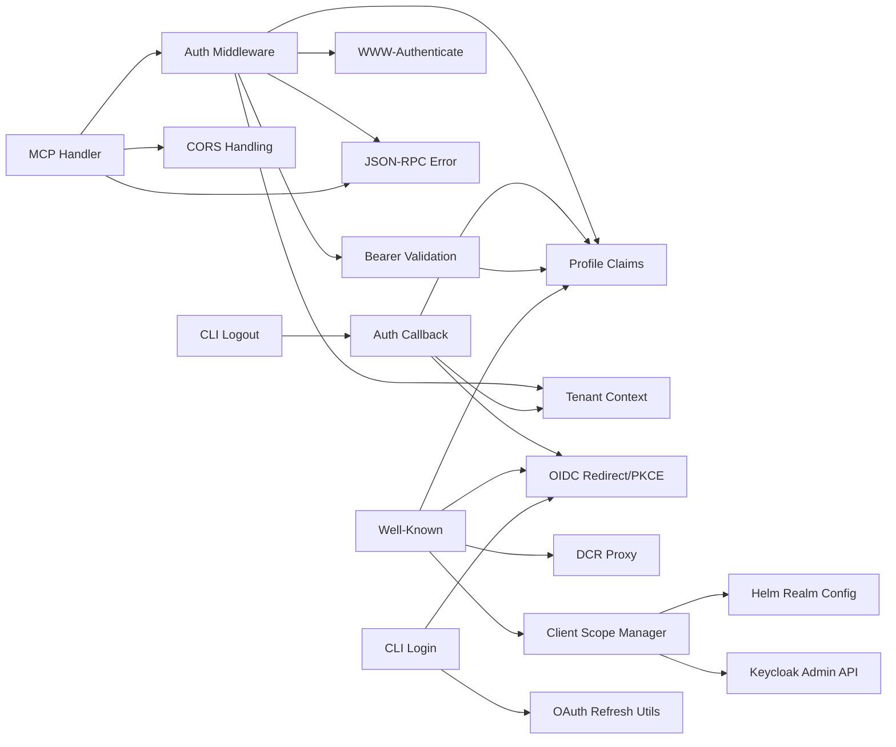

**Diagram sources**
- [src/http/http-auth-middleware.ts:168-326](file://src/http/http-auth-middleware.ts#L168-L326)
- [src/http/http-auth-callback.ts:122-231](file://src/http/http-auth-callback.ts#L122-L231)
- [src/http/http-auth-oidc-redirect.ts:28-100](file://src/http/http-auth-oidc-redirect.ts#L28-L100)
- [src/http/bearer-validate.ts:120-208](file://src/http/bearer-validate.ts#L120-L208)
- [src/http/oidc-profile-claims.ts:192-256](file://src/http/oidc-profile-claims.ts#L192-L256)
- [src/http/http-well-known.ts:56-92](file://src/http/http-well-known.ts#L56-L92)
- [src/http/http-www-authenticate.ts:18-47](file://src/http/http-www-authenticate.ts#L18-L47)
- [src/http/http-mcp-handler.ts:128-344](file://src/http/http-mcp-handler.ts#L128-L344)
- [src/http/mcp-ui-offerings-auth-jsonrpc.ts:10-35](file://src/http/mcp-ui-offerings-auth-jsonrpc.ts#L10-L35)
- [src/http/http-mcp-cors.ts:3-29](file://src/http/http-mcp-cors.ts#L3-L29)
- [src/http/http-client-registration-proxy.ts:140-175](file://src/http/http-client-registration-proxy.ts#L140-L175)
- [src/utils/tenant-context.ts:251-286](file://src/utils/tenant-context.ts#L251-L286)
- [src/cli/oauth-refresh.ts:26-86](file://src/cli/oauth-refresh.ts#L26-L86)
- [src/cli/commands/login.ts:69-196](file://src/cli/commands/login.ts#L69-L196)
- [src/cli/commands/logout.ts:10-19](file://src/cli/commands/logout.ts#L10-L19)
- [scripts/deploy-configure-keycloak-realms.py:716-753](file://scripts/deploy-configure-keycloak-realms.py#L716-L753)
- [helm/kairos-mcp/files/kairos-realm.json:145-176](file://helm/kairos-mcp/files/kairos-realm.json#L145-L176)

**Section sources**
- [src/http/http-auth-middleware.ts:168-326](file://src/http/http-auth-middleware.ts#L168-L326)
- [src/http/http-auth-callback.ts:122-231](file://src/http/http-auth-callback.ts#L122-L231)
- [src/http/http-auth-oidc-redirect.ts:28-100](file://src/http/http-auth-oidc-redirect.ts#L28-L100)
- [src/http/bearer-validate.ts:120-208](file://src/http/bearer-validate.ts#L120-L208)
- [src/http/oidc-profile-claims.ts:192-256](file://src/http/oidc-profile-claims.ts#L192-L256)
- [src/http/http-well-known.ts:56-92](file://src/http/http-well-known.ts#L56-L92)
- [src/http/http-www-authenticate.ts:18-47](file://src/http/http-www-authenticate.ts#L18-L47)
- [src/http/http-mcp-handler.ts:128-344](file://src/http/http-mcp-handler.ts#L128-L344)
- [src/http/mcp-ui-offerings-auth-jsonrpc.ts:10-35](file://src/http/mcp-ui-offerings-auth-jsonrpc.ts#L10-L35)
- [src/http/http-mcp-cors.ts:3-29](file://src/http/http-mcp-cors.ts#L3-L29)
- [src/http/http-client-registration-proxy.ts:140-175](file://src/http/http-client-registration-proxy.ts#L140-L175)
- [src/utils/tenant-context.ts:251-286](file://src/utils/tenant-context.ts#L251-L286)
- [src/cli/oauth-refresh.ts:26-86](file://src/cli/oauth-refresh.ts#L26-L86)
- [src/cli/commands/login.ts:69-196](file://src/cli/commands/login.ts#L69-L196)
- [src/cli/commands/logout.ts:10-19](file://src/cli/commands/logout.ts#L10-L19)
- [scripts/deploy-configure-keycloak-realms.py:716-753](file://scripts/deploy-configure-keycloak-realms.py#L716-L753)
- [helm/kairos-mcp/files/kairos-realm.json:145-176](file://helm/kairos-mcp/files/kairos-realm.json#L145-L176)

## Performance Considerations
- JWKS caching: Remote JWKS is cached per issuer to avoid repeated network fetches during validation.
- State store pruning: OIDC state entries are pruned after TTL to limit memory growth.
- Session max age: Derived conservatively from token lifetimes to balance usability and security.
- Async context propagation: Tenant context uses AsyncLocalStorage to avoid passing context through deep call stacks.
- **Enhanced**: MCP request concurrency limiting prevents overload during peak usage.
- **Enhanced**: Structured error handling reduces overhead from generic error responses.
- **Enhanced**: CORS preflight bypass minimizes latency for MCP endpoints.
- **Enhanced**: Client scope caching reduces repeated Keycloak API calls for scope validation.

**Section sources**
- [src/http/bearer-validate.ts:41-109](file://src/http/bearer-validate.ts#L41-L109)
- [src/http/http-auth-oidc-redirect.ts:17-26](file://src/http/http-auth-oidc-redirect.ts#L17-L26)
- [src/http/http-auth-callback.ts:34-55](file://src/http/http-auth-callback.ts#L34-L55)
- [src/http/http-mcp-handler.ts:44-45](file://src/http/http-mcp-handler.ts#L44-L45)
- [src/http/http-error-handlers.ts:9-33](file://src/http/http-error-handlers.ts#L9-L33)
- [src/http/http-mcp-cors.ts:3-29](file://src/http/http-mcp-cors.ts#L3-L29)

## Troubleshooting Guide
Common issues and resolutions:
- Missing AUTH_TRUSTED_ISSUERS or AUTH_ALLOWED_AUDIENCES:
  - Bearer auth requires both configured; otherwise a 401 is returned with guidance.
- Invalid or expired Bearer token:
  - Validation rejects tokens with wrong issuer, audience mismatch, or expired/expired signature; clients should trigger re-authentication via WWW-Authenticate.
- Missing id_token or access_token in callback:
  - Callback exchanges code for tokens; absence leads to redirect with error; verify client credentials and redirect URI.
- State mismatch or expired state:
  - Callback validates state against stored PKCE state; mismatch or expiry triggers error redirect.
- Token request failures:
  - Network errors or HTTP errors during token exchange cause redirect with error; inspect logs for details.
- Group membership not reflected:
  - If groups are missing from access token, userinfo is queried; ensure the client has a Group Membership mapper or enable merging userinfo groups.
- Logout not clearing SSO:
  - RP-initiated logout uses id_token_hint when present; ensure post_logout_redirect_uri is registered and HTTPS is used for secure cookies.
- **Enhanced**: MCP client authentication failures:
  - Check that WWW-Authenticate headers are exposed (CORS configuration) and that clients handle JSON-RPC error envelopes properly.
- **Enhanced**: Dynamic Client Registration issues:
  - Verify that registration_endpoint is accessible and that URL rewriting works correctly for public base URLs.
- **Enhanced**: CORS preflight problems:
  - Ensure Access-Control-Expose-Headers includes WWW-Authenticate for MCP endpoints.
- **Enhanced**: Invalid scope errors during token issuance:
  - Verify that optional scopes (profile, email, offline_access) are properly configured for the client; check client optional scopes configuration.
- **Enhanced**: Client scope synchronization issues:
  - Ensure deployment script successfully configures optional scopes; verify Keycloak Admin API connectivity and permissions.
- **Enhanced**: Scope validation failures:
  - Check that optional scopes are properly linked to clients in Keycloak Admin UI; verify scope IDs and names match configuration.
- **Enhanced**: OAuth 2.0 compliance issues:
  - Ensure openid scope is properly configured as both default and optional scope; verify scope inheritance for dynamic clients.

Operational checks:
- Verify AUTH_CALLBACK_BASE_URL is set for production to ensure compliant well-known metadata and secure cookies.
- Confirm OIDC groups allowlist aligns with intended spaces; use exact matches or prefix rules.
- Monitor 401 responses with WWW-Authenticate headers to diagnose client re-auth needs.
- **Enhanced**: Test MCP authentication flows with both JSON-RPC and non-JSON-RPC requests.
- **Enhanced**: Validate Dynamic Client Registration proxy functionality with actual OIDC client creation.
- **Enhanced**: Verify optional client scopes are properly configured in Keycloak Admin UI.
- **Enhanced**: Test token issuance with various scope combinations to ensure proper scope handling.
- **Enhanced**: Validate scope configuration using Keycloak Admin API endpoints for optional scopes.

**Section sources**
- [src/http/http-auth-middleware.ts:232-282](file://src/http/http-auth-middleware.ts#L232-L282)
- [src/http/bearer-validate.ts:132-164](file://src/http/bearer-validate.ts#L132-L164)
- [src/http/http-auth-callback.ts:122-201](file://src/http/http-auth-callback.ts#L122-L201)
- [src/http/http-auth-callback.ts:135-142](file://src/http/http-auth-callback.ts#L135-L142)
- [src/http/http-auth-callback.ts:170-189](file://src/http/http-auth-callback.ts#L170-L189)
- [src/http/oidc-profile-claims.ts:119-153](file://src/http/oidc-profile-claims.ts#L119-L153)
- [src/http/http-auth-callback.ts:99-115](file://src/http/http-auth-callback.ts#L99-L115)
- [src/http/http-mcp-cors.ts:3-29](file://src/http/http-mcp-cors.ts#L3-L29)
- [src/http/http-client-registration-proxy.ts:140-175](file://src/http/http-client-registration-proxy.ts#L140-L175)
- [scripts/deploy-configure-keycloak-realms.py:716-753](file://scripts/deploy-configure-keycloak-realms.py#L716-L753)
- [helm/kairos-mcp/files/kairos-realm.json:145-176](file://helm/kairos-mcp/files/kairos-realm.json#L145-L176)

## Conclusion
KAIROS MCP's authentication and authorization system provides robust OIDC integration with Keycloak, supporting both browser and API clients. It enforces strict group-based access control, derives spatial contexts deterministically, and offers standardized discovery and logout flows. **Enhanced** features include comprehensive JSON-RPC error handling for MCP clients, proper WWW-Authenticate header implementation for OAuth 2.0 compliance, CORS preflight bypass for optimal performance, Dynamic Client Registration proxy functionality for seamless OIDC client management, and advanced client scope management to resolve invalid_scope errors. These improvements significantly enhance the developer experience while maintaining security and operability.

## Appendices

### Practical Configuration Examples
- Configure OIDC client in Keycloak:
  - Client ID and secret for browser and CLI.
  - Redirect URIs: AUTH_CALLBACK_BASE_URL with /auth/callback for browser; localhost callback for CLI login.
  - Scopes: openid, profile, email, kairos-groups, offline_access.
  - Group Membership mapper to include groups in ID token or userinfo.
  - **Enhanced**: Ensure optional scopes (profile, email, offline_access) are configured as optional client scopes.
- Environment variables:
  - AUTH_ENABLED, KEYCLOAK_URL, KEYCLOAK_REALM, KEYCLOAK_CLIENT_ID, AUTH_CALLBACK_BASE_URL, SESSION_SECRET, SESSION_MAX_AGE_SEC, AUTH_TRUSTED_ISSUERS, AUTH_ALLOWED_AUDIENCES, OIDC_GROUPS_ALLOWLIST, OIDC_SCOPES_SUPPORTED.
- Set up groups and roles:
  - Create groups in Keycloak; assign users to groups; ensure Group Membership mapper is configured.
  - Use OIDC_GROUPS_ALLOWLIST to restrict which groups become KAIROS spaces.
- Implement custom authorization logic:
  - Extend tenant context derivation or group allowlist rules to reflect domain-specific policies.
  - Use SpaceContext in services to enforce write/read scoping per request.
- **Enhanced**: Configure Dynamic Client Registration:
  - Ensure registration_endpoint is accessible via well-known discovery.
  - Test client registration workflows with the proxy functionality.
  - Verify URL rewriting preserves client identity across environments.
- **Enhanced**: Optimize MCP Authentication:
  - Configure CORS properly to expose WWW-Authenticate headers.
  - Test both JSON-RPC and non-JSON-RPC authentication flows.
  - Validate error handling for concurrent request scenarios.
- **Enhanced**: Manage Client Scopes:
  - Use ensure_client_optional_scope() to add optional scopes to clients.
  - Verify optional scopes are properly configured in Helm chart configuration.
  - Test token issuance with various scope combinations to ensure proper scope handling.
- **Enhanced**: Resolve Invalid Scope Errors:
  - Ensure optionalClientScopes includes profile, email, and offline_access for kairos-mcp and kairos-cli clients.
  - Verify deployment script successfully configures optional scopes during realm setup.
  - Test OAuth flows to ensure invalid_scope errors are resolved.
- **Enhanced**: Validate Scope Configuration:
  - Use Keycloak Admin API to verify optional scopes are properly linked to clients.
  - Check scope inheritance for dynamic clients created via DCR.
  - Monitor OAuth 2.0 compliance with proper scope validation.