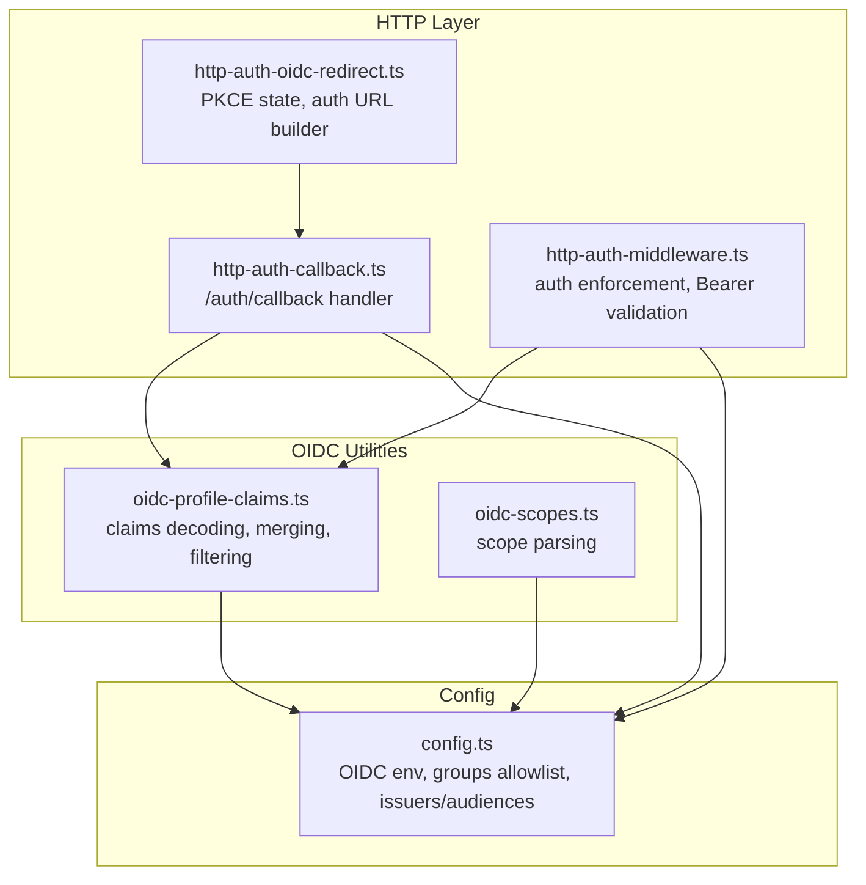
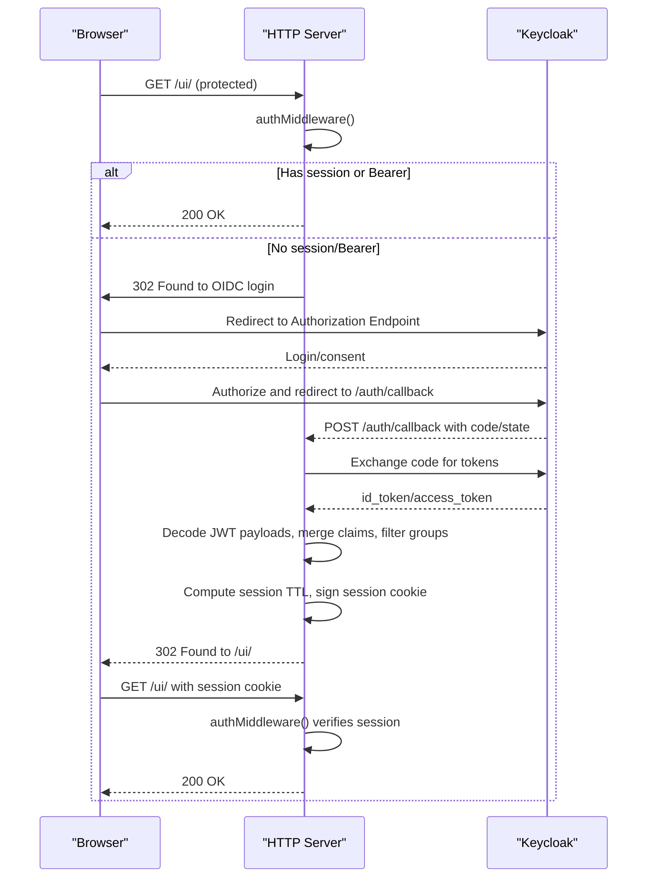
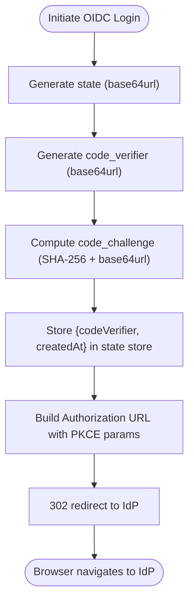
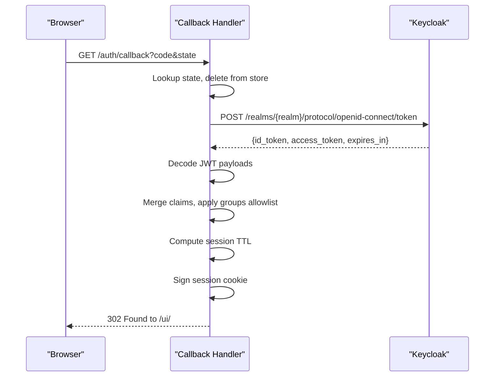
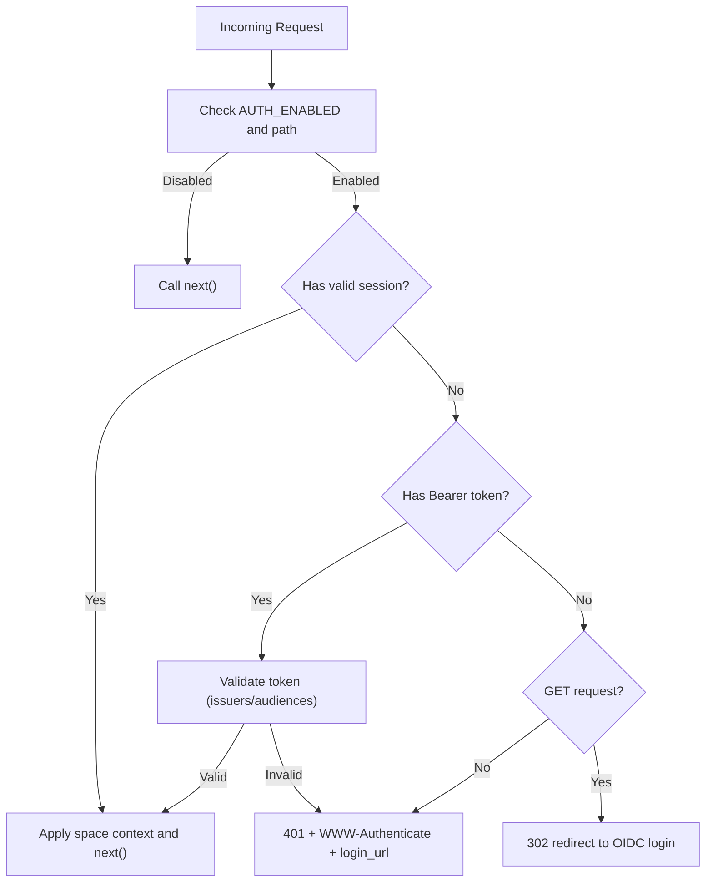
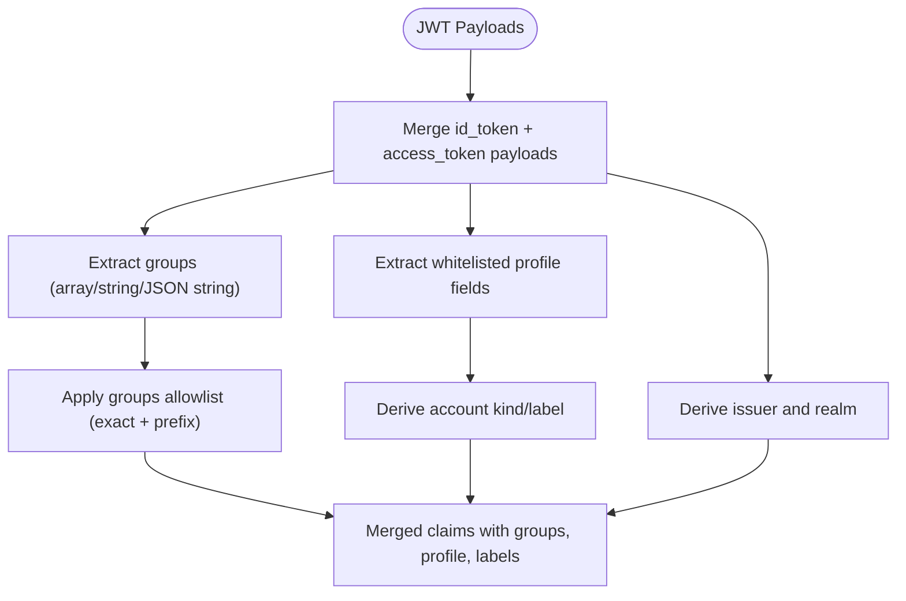
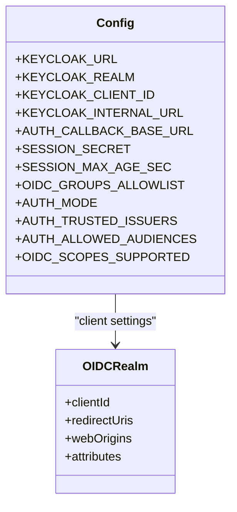
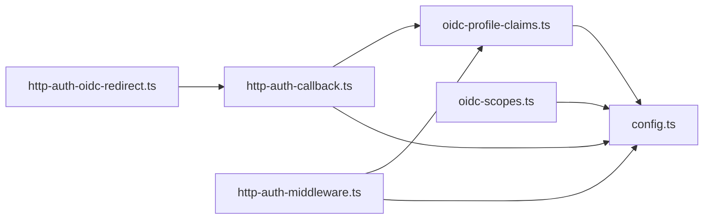

# OIDC Integration

<cite>
**Referenced Files in This Document**
- [http-auth-oidc-redirect.ts](file://src/http/http-auth-oidc-redirect.ts)
- [http-auth-callback.ts](file://src/http/http-auth-callback.ts)
- [oidc-profile-claims.ts](file://src/http/oidc-profile-claims.ts)
- [oidc-scopes.ts](file://src/http/oidc-scopes.ts)
- [http-auth-middleware.ts](file://src/http/http-auth-middleware.ts)
- [config.ts](file://src/config.ts)
- [oidc-profile-claims.test.ts](file://tests/unit/oidc-profile-claims.test.ts)
- [kairos-dev-realm.json](file://scripts/keycloak/import/kairos-dev-realm.json)
- [README.md](file://docs/install/README.md)
- [README.md](file://docs/keycloak/README.md)
- [values.yaml](file://helm/kairos-mcp/values.yaml)
- [compose.yaml](file://compose.yaml)
</cite>

## Table of Contents
1. [Introduction](#introduction)
2. [Project Structure](#project-structure)
3. [Core Components](#core-components)
4. [Architecture Overview](#architecture-overview)
5. [Detailed Component Analysis](#detailed-component-analysis)
6. [Dependency Analysis](#dependency-analysis)
7. [Performance Considerations](#performance-considerations)
8. [Troubleshooting Guide](#troubleshooting-guide)
9. [Conclusion](#conclusion)
10. [Appendices](#appendices)

## Introduction
This document explains the OIDC (OpenID Connect) integration used by the application, focusing on the browser login flow, callback handling, token exchange, and profile claims processing. It covers redirect URL construction, PKCE state management, session cookie signing, group filtering, user attribute mapping, scope management, provider configuration, and operational best practices for production deployments.

## Project Structure
The OIDC integration spans several modules:
- Redirect and PKCE utilities for initiating browser login and constructing authorization URLs
- Callback handler that exchanges the authorization code for tokens, validates them, and sets a signed session cookie
- Middleware that enforces authentication for protected routes and supports Bearer token validation
- Profile claims processing for group filtering and user attribute mapping
- Scope parsing and configuration
- Environment-driven configuration for Keycloak and session behavior

**Diagram sources**
- [http-auth-oidc-redirect.ts:1-101](file://src/http/http-auth-oidc-redirect.ts#L1-L101)
- [http-auth-callback.ts:1-233](file://src/http/http-auth-callback.ts#L1-L233)
- [http-auth-middleware.ts:1-316](file://src/http/http-auth-middleware.ts#L1-L316)
- [oidc-profile-claims.ts:1-288](file://src/http/oidc-profile-claims.ts#L1-L288)
- [oidc-scopes.ts:1-31](file://src/http/oidc-scopes.ts#L1-L31)
- [config.ts:113-171](file://src/config.ts#L113-L171)

**Section sources**
- [http-auth-oidc-redirect.ts:1-101](file://src/http/http-auth-oidc-redirect.ts#L1-L101)
- [http-auth-callback.ts:1-233](file://src/http/http-auth-callback.ts#L1-L233)
- [http-auth-middleware.ts:1-316](file://src/http/http-auth-middleware.ts#L1-L316)
- [oidc-profile-claims.ts:1-288](file://src/http/oidc-profile-claims.ts#L1-L288)
- [oidc-scopes.ts:1-31](file://src/http/oidc-scopes.ts#L1-L31)
- [config.ts:113-171](file://src/config.ts#L113-L171)

## Core Components
- OIDC redirect and PKCE state management: generates state and code verifier, builds authorization URL with PKCE challenge, and maintains an in-memory state store with TTL pruning
- Callback handler: validates state, exchanges authorization code for tokens, decodes JWT payloads, merges claims, filters groups, computes session TTL, signs session cookie, and redirects to UI
- Authentication middleware: enforces auth for protected paths, supports session-based auth and Bearer token validation, and constructs login URLs for API clients
- Profile claims processing: whitelists profile fields, normalizes groups, applies allowlist filtering, derives account kind/label, and merges token payloads
- Scopes management: parses supported scopes from environment and falls back to defaults
- Configuration: reads OIDC settings, groups allowlist, trusted issuers, audiences, and session parameters

**Section sources**
- [http-auth-oidc-redirect.ts:1-101](file://src/http/http-auth-oidc-redirect.ts#L1-L101)
- [http-auth-callback.ts:122-231](file://src/http/http-auth-callback.ts#L122-L231)
- [http-auth-middleware.ts:167-313](file://src/http/http-auth-middleware.ts#L167-L313)
- [oidc-profile-claims.ts:163-256](file://src/http/oidc-profile-claims.ts#L163-L256)
- [oidc-scopes.ts:9-30](file://src/http/oidc-scopes.ts#L9-L30)
- [config.ts:113-171](file://src/config.ts#L113-L171)

## Architecture Overview
The OIDC flow integrates browser login, server-side token exchange, and session management. The following sequence illustrates the end-to-end flow.

**Diagram sources**
- [http-auth-middleware.ts:167-313](file://src/http/http-auth-middleware.ts#L167-L313)
- [http-auth-oidc-redirect.ts:66-87](file://src/http/http-auth-oidc-redirect.ts#L66-L87)
- [http-auth-callback.ts:122-231](file://src/http/http-auth-callback.ts#L122-L231)
- [oidc-profile-claims.ts:192-256](file://src/http/oidc-profile-claims.ts#L192-L256)

## Detailed Component Analysis

### Redirect and PKCE State Management
- Generates random state and PKCE code verifier
- Computes code challenge via SHA-256 and base64url encoding
- Stores state with creation timestamp in an in-memory Map
- Builds authorization URL with client_id, redirect_uri, response_type=code, scope, state, code_challenge, challenge method, and prompt=login
- Provides functions to safely construct login URLs for API responses and to prune expired state entries

**Diagram sources**
- [http-auth-oidc-redirect.ts:66-87](file://src/http/http-auth-oidc-redirect.ts#L66-L87)

**Section sources**
- [http-auth-oidc-redirect.ts:10-26](file://src/http/http-auth-oidc-redirect.ts#L10-L26)
- [http-auth-oidc-redirect.ts:28-45](file://src/http/http-auth-oidc-redirect.ts#L28-L45)
- [http-auth-oidc-redirect.ts:66-87](file://src/http/http-auth-oidc-redirect.ts#L66-L87)

### Callback Handler: Token Exchange and Session Creation
- Validates AUTH_ENABLED, Keycloak URL, session secret, and callback base URL
- Reads code and state from query parameters
- Retrieves code_verifier from state store and deletes the state entry
- Exchanges authorization code for tokens using PKCE code_verifier
- Decodes JWT payloads from id_token and access_token
- Merges claims from both tokens, deriving sub, groups, issuer, realm, and profile fields
- Applies groups allowlist filtering
- Computes session TTL from expires_in or access token exp, with safety margins
- Signs session cookie with HMAC-SHA256 and sets HttpOnly/Lax cookie with SameSite and Secure when appropriate
- Redirects to UI

**Diagram sources**
- [http-auth-callback.ts:122-231](file://src/http/http-auth-callback.ts#L122-L231)
- [oidc-profile-claims.ts:192-256](file://src/http/oidc-profile-claims.ts#L192-L256)

**Section sources**
- [http-auth-callback.ts:122-231](file://src/http/http-auth-callback.ts#L122-L231)
- [oidc-profile-claims.ts:192-256](file://src/http/oidc-profile-claims.ts#L192-L256)

### Authentication Middleware: Protected Routes and Bearer Validation
- Enforces auth for protected paths (/api, /mcp, /ui)
- Supports session-based auth and Bearer token validation
- For GET requests to protected paths without session/Bearer, redirects to OIDC login
- For non-GET requests, returns 401 with WWW-Authenticate and a login_url for API clients
- When AUTH_MODE=oidc_bearer or AUTH_ENABLED, validates Bearer tokens against trusted issuers and allowed audiences
- Applies groups allowlist to session-derived groups
- Injects space context and request ID into the request object

**Diagram sources**
- [http-auth-middleware.ts:167-313](file://src/http/http-auth-middleware.ts#L167-L313)

**Section sources**
- [http-auth-middleware.ts:167-313](file://src/http/http-auth-middleware.ts#L167-L313)

### Profile Claims Processing: Groups, Attributes, and Account Labels
- Whitelists profile fields (preferred_username, name, given_name, family_name, email, email_verified, identity_provider)
- Extracts groups from JWT payload, handling arrays, single strings, and JSON array strings
- Applies allowlist filtering supporting exact matches and prefix-based inclusion (case-insensitive for paths)
- Merges id_token and access_token payloads, preferring id token for profile and access token for groups
- Derives account kind and label based on identity_provider, treating empty or local IdPs as local
- Provides helpers to decode JWT payload segments and derive realm from issuer

**Diagram sources**
- [oidc-profile-claims.ts:78-153](file://src/http/oidc-profile-claims.ts#L78-L153)
- [oidc-profile-claims.ts:192-256](file://src/http/oidc-profile-claims.ts#L192-L256)
- [oidc-profile-claims.ts:182-190](file://src/http/oidc-profile-claims.ts#L182-L190)

**Section sources**
- [oidc-profile-claims.ts:163-256](file://src/http/oidc-profile-claims.ts#L163-L256)
- [oidc-profile-claims.test.ts:10-155](file://tests/unit/oidc-profile-claims.test.ts#L10-L155)

### Scope Management
- Defines default OIDC scopes including openid, profile, email, kairos-groups, offline_access
- Parses supported scopes from environment, deduplicates, trims, and falls back to defaults if empty
- Emits a warning when the parsed list is empty

**Section sources**
- [oidc-scopes.ts:1-31](file://src/http/oidc-scopes.ts#L1-L31)
- [config.ts:130-137](file://src/config.ts#L130-L137)

### Configuration Requirements and Provider Setup
- Keycloak configuration: KEYCLOAK_URL, KEYCLOAK_REALM, KEYCLOAK_CLIENT_ID, KEYCLOAK_INTERNAL_URL (optional), AUTH_CALLBACK_BASE_URL, SESSION_SECRET, SESSION_MAX_AGE_SEC
- OIDC groups allowlist: OIDC_GROUPS_ALLOWLIST (comma-separated, supports exact and prefix matching)
- Bearer validation: AUTH_MODE=oidc_bearer, AUTH_TRUSTED_ISSUERS, AUTH_ALLOWED_AUDIENCES
- Scopes: KAIROS_OIDC_SCOPES_SUPPORTED
- Example client configuration for Keycloak realms includes redirect URIs and web origins for local development

**Diagram sources**
- [config.ts:113-171](file://src/config.ts#L113-L171)
- [kairos-dev-realm.json:25-66](file://scripts/keycloak/import/kairos-dev-realm.json#L25-L66)

**Section sources**
- [config.ts:113-171](file://src/config.ts#L113-L171)
- [kairos-dev-realm.json:25-66](file://scripts/keycloak/import/kairos-dev-realm.json#L25-L66)

## Dependency Analysis
- The callback handler depends on redirect utilities for PKCE state retrieval and on profile claims utilities for JWT decoding and merging
- The middleware depends on redirect utilities for login redirection and on profile claims utilities for group filtering
- Configuration drives both redirect/build flows and middleware behavior
- Scope parsing is consumed by configuration and discovery endpoints

**Diagram sources**
- [http-auth-oidc-redirect.ts:1-101](file://src/http/http-auth-oidc-redirect.ts#L1-L101)
- [http-auth-callback.ts:1-233](file://src/http/http-auth-callback.ts#L1-L233)
- [http-auth-middleware.ts:1-316](file://src/http/http-auth-middleware.ts#L1-L316)
- [oidc-profile-claims.ts:1-288](file://src/http/oidc-profile-claims.ts#L1-L288)
- [oidc-scopes.ts:1-31](file://src/http/oidc-scopes.ts#L1-L31)
- [config.ts:113-171](file://src/config.ts#L113-L171)

**Section sources**
- [http-auth-callback.ts:19-32](file://src/http/http-auth-callback.ts#L19-L32)
- [http-auth-middleware.ts:9-28](file://src/http/http-auth-middleware.ts#L9-L28)
- [config.ts:8-16](file://src/config.ts#L8-L16)

## Performance Considerations
- State store pruning: periodic cleanup of expired PKCE state entries prevents unbounded growth
- Session TTL computation: prefers expires_in from token exchange and access token exp to minimize clock skew and ensure timely renewal
- Cookie signing: HMAC-SHA256 over base64url-encoded JSON payload ensures integrity without storing secrets in cookies
- Redirect and callback base URLs: ensure HTTPS for Secure cookie flag to avoid mixed-content issues

[No sources needed since this section provides general guidance]

## Troubleshooting Guide
Common issues and resolutions:
- Missing or invalid state: ensure AUTH_CALLBACK_BASE_URL is set and matches Keycloak client redirect URIs; verify state store pruning does not remove entries prematurely
- Token exchange failures: check KEYCLOAK_URL vs KEYCLOAK_INTERNAL_URL for server-side calls; confirm realm and client credentials
- Invalid or missing tokens: verify that both id_token and access_token are present and that JWT payloads decode correctly
- Mismatched sub between id_token and access_token: indicates token mismatch; reject and prompt re-authentication
- Insufficient groups: verify OIDC_GROUPS_ALLOWLIST configuration and ensure IdP groups mapper emits expected values
- Bearer token validation errors: confirm AUTH_TRUSTED_ISSUERS and AUTH_ALLOWED_AUDIENCES are set and aligned with Keycloak configuration
- Logout flow: RP-initiated logout uses post_logout_redirect_uri; ensure client attributes include post-logout URIs

**Section sources**
- [http-auth-callback.ts:122-200](file://src/http/http-auth-callback.ts#L122-L200)
- [http-auth-middleware.ts:232-281](file://src/http/http-auth-middleware.ts#L232-L281)
- [oidc-profile-claims.test.ts:69-78](file://tests/unit/oidc-profile-claims.test.ts#L69-L78)

## Conclusion
The OIDC integration provides a robust, standards-compliant authentication mechanism with PKCE, secure session handling, and configurable group filtering. By aligning environment configuration with Keycloak client settings and leveraging the middleware and callback handlers, teams can deploy secure and maintainable SSO flows across development and production environments.

[No sources needed since this section summarizes without analyzing specific files]

## Appendices

### Practical Configuration Examples
- Local development with Docker Compose:
  - Set AUTH_CALLBACK_BASE_URL to match exposed port (e.g., http://localhost:3300)
  - Ensure redirect URIs and web origins in Keycloak client include localhost and 127.0.0.1 variants
  - Confirm SESSION_SECRET and KEYCLOAK_* variables are present in .env
- Kubernetes with Helm:
  - Configure app.auth.callbackBaseUrl and OIDC groups allowlist in values.yaml
  - Enable keycloakRealmImport to provision realm and client automatically
  - Set OIDC_SCOPES_SUPPORTED to align with your IdP policies

**Section sources**
- [compose.yaml:108-137](file://compose.yaml#L108-L137)
- [values.yaml:54-61](file://helm/kairos-mcp/values.yaml#L54-L61)
- [kairos-dev-realm.json:33-51](file://scripts/keycloak/import/kairos-dev-realm.json#L33-L51)

### Security Best Practices
- Always use HTTPS for AUTH_CALLBACK_BASE_URL to enable Secure cookies
- Limit OIDC_GROUPS_ALLOWLIST to reduce surface area of accessible spaces
- Validate AUTH_TRUSTED_ISSUERS and AUTH_ALLOWED_AUDIENCES for Bearer auth
- Regularly rotate SESSION_SECRET and review token lifetimes
- Monitor token exchange logs and enforce rate limiting for auth endpoints

[No sources needed since this section provides general guidance]