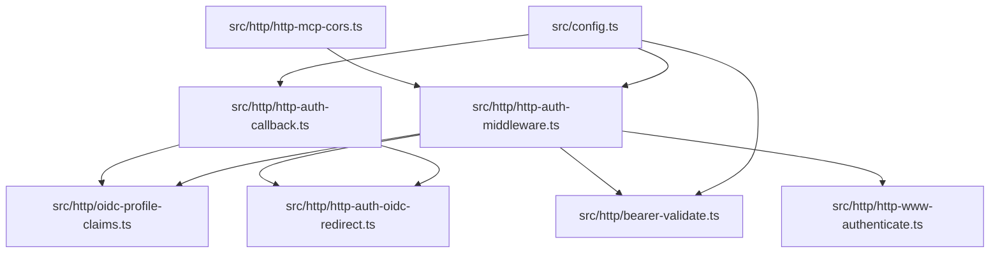
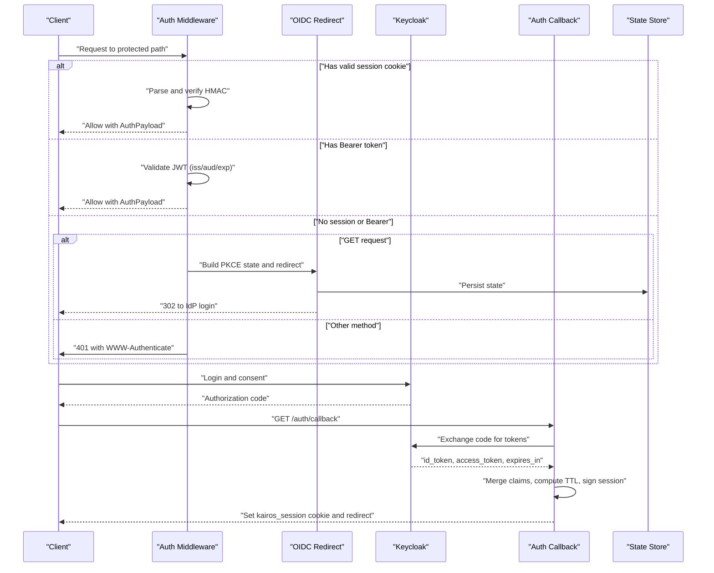
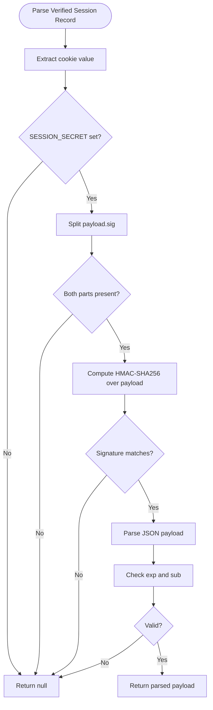
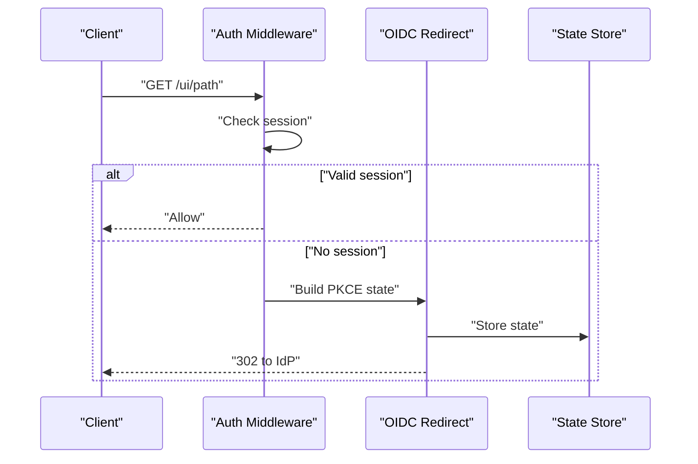
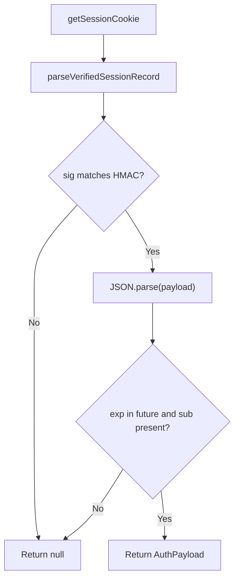
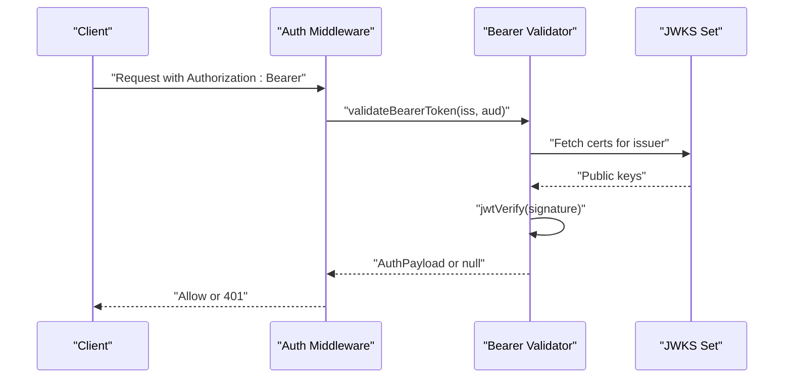
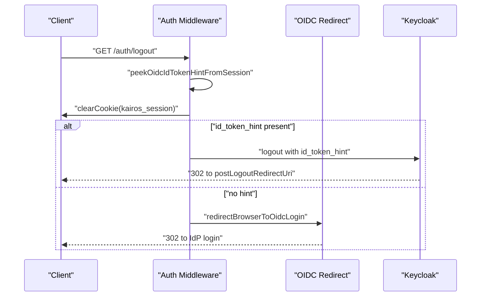
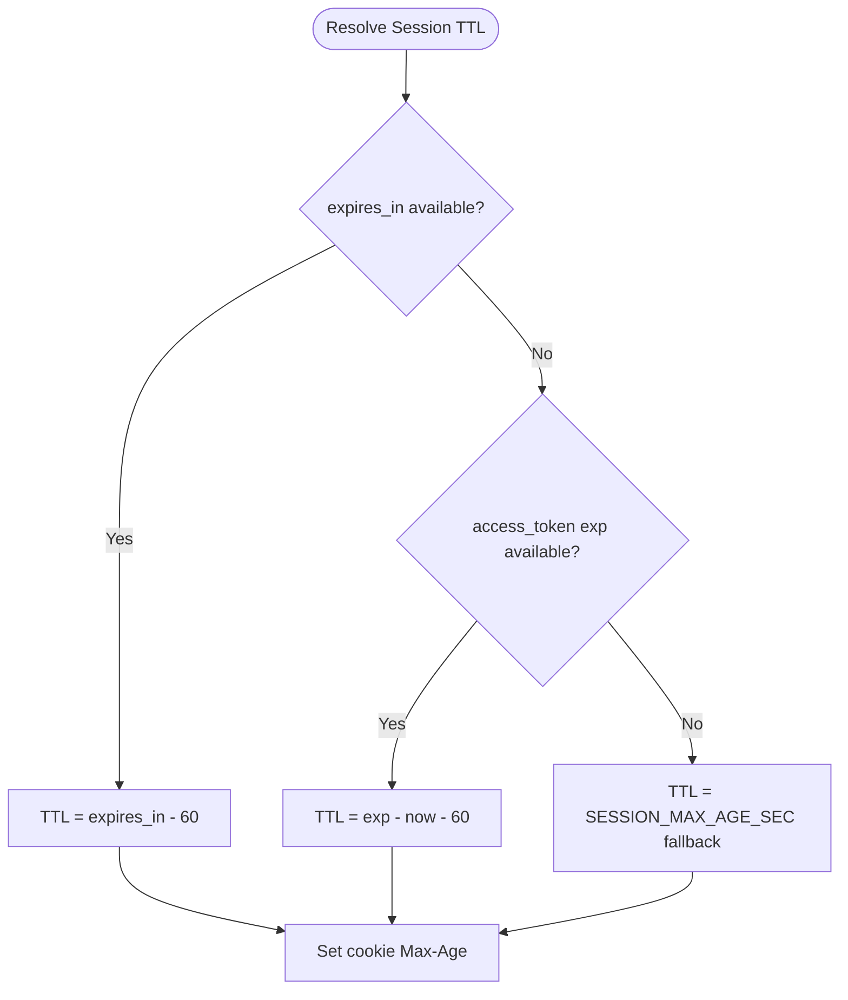
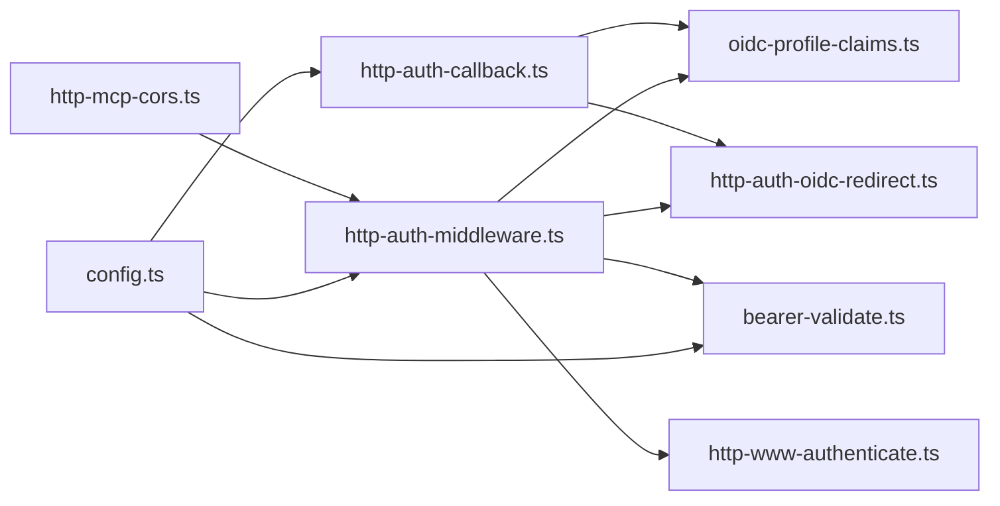

# Session Management

<cite>
**Referenced Files in This Document**
- [src/config.ts](file://src/config.ts)
- [src/http/http-auth-middleware.ts](file://src/http/http-auth-middleware.ts)
- [src/http/http-auth-callback.ts](file://src/http/http-auth-callback.ts)
- [src/http/http-auth-oidc-redirect.ts](file://src/http/http-auth-oidc-redirect.ts)
- [src/http/oidc-profile-claims.ts](file://src/http/oidc-profile-claims.ts)
- [src/http/bearer-validate.ts](file://src/http/bearer-validate.ts)
- [src/http/http-www-authenticate.ts](file://src/http/http-www-authenticate.ts)
- [src/http/http-mcp-cors.ts](file://src/http/http-mcp-cors.ts)
- [tests/integration/session-ttl-alignment.test.ts](file://tests/integration/session-ttl-alignment.test.ts)
</cite>

## Table of Contents
1. [Introduction](#introduction)
2. [Project Structure](#project-structure)
3. [Core Components](#core-components)
4. [Architecture Overview](#architecture-overview)
5. [Detailed Component Analysis](#detailed-component-analysis)
6. [Dependency Analysis](#dependency-analysis)
7. [Performance Considerations](#performance-considerations)
8. [Troubleshooting Guide](#troubleshooting-guide)
9. [Conclusion](#conclusion)
10. [Appendices](#appendices)

## Introduction
This document explains the session management system used by the application. It covers the session cookie implementation (HMAC signing, payload encoding, and expiration handling), the session-based authentication flow, cookie parsing and validation, integration with bearer tokens (including dual authentication support), RP-initiated logout with id_token_hint, session TTL alignment, and security considerations such as XSS protection and secure transmission.

## Project Structure
The session management spans several modules:
- Configuration defines environment-driven behavior (e.g., session secret, max age, OIDC allowlists).
- Middleware enforces authentication for protected paths and supports both session and bearer authentication.
- Callback handles the OIDC authorization code exchange and sets the signed session cookie.
- OIDC redirect utilities manage PKCE state and build RP-initiated logout URLs.
- Bearer validation verifies JWTs for clients that use Authorization: Bearer.
- WWW-Authenticate and CORS utilities support MCP client integration.

**Diagram sources**
- [src/config.ts:116-128](file://src/config.ts#L116-L128)
- [src/http/http-auth-middleware.ts:167-313](file://src/http/http-auth-middleware.ts#L167-L313)
- [src/http/http-auth-callback.ts:84-232](file://src/http/http-auth-callback.ts#L84-L232)
- [src/http/http-auth-oidc-redirect.ts:28-77](file://src/http/http-auth-oidc-redirect.ts#L28-L77)
- [src/http/oidc-profile-claims.ts:200-256](file://src/http/oidc-profile-claims.ts#L200-L256)
- [src/http/bearer-validate.ts:120-208](file://src/http/bearer-validate.ts#L120-L208)
- [src/http/http-www-authenticate.ts:18-47](file://src/http/http-www-authenticate.ts#L18-L47)
- [src/http/http-mcp-cors.ts:3-27](file://src/http/http-mcp-cors.ts#L3-L27)

**Section sources**
- [src/config.ts:116-128](file://src/config.ts#L116-L128)
- [src/http/http-auth-middleware.ts:167-313](file://src/http/http-auth-middleware.ts#L167-L313)
- [src/http/http-auth-callback.ts:84-232](file://src/http/http-auth-callback.ts#L84-L232)
- [src/http/http-auth-oidc-redirect.ts:28-77](file://src/http/http-auth-oidc-redirect.ts#L28-L77)
- [src/http/oidc-profile-claims.ts:200-256](file://src/http/oidc-profile-claims.ts#L200-L256)
- [src/http/bearer-validate.ts:120-208](file://src/http/bearer-validate.ts#L120-L208)
- [src/http/http-www-authenticate.ts:18-47](file://src/http/http-www-authenticate.ts#L18-L47)
- [src/http/http-mcp-cors.ts:3-27](file://src/http/http-mcp-cors.ts#L3-L27)

## Core Components
- Session cookie format: base64url-encoded JSON payload concatenated with a dot and HMAC-SHA256 signature over the payload using the configured session secret. The cookie is HttpOnly, SameSite=Lax, and optionally Secure depending on the callback base URL scheme.
- Session payload fields include subject, groups, realm, issuer, and whitelisted profile claims. Expiration is enforced during parsing.
- Authentication middleware supports dual authentication modes:
  - Session-based: validated via HMAC signature and expiration.
  - Bearer-based: validated via JWKS and issuer/audience checks when configured.
- OIDC callback exchanges the authorization code for tokens, merges claims, computes session TTL from token lifetimes, signs the session cookie, and stores an id_token hint for RP-initiated logout.
- RP-initiated logout builds the logout URL with id_token_hint when present in the session.

**Section sources**
- [src/http/http-auth-middleware.ts:47-128](file://src/http/http-auth-middleware.ts#L47-L128)
- [src/http/http-auth-callback.ts:57-67](file://src/http/http-auth-callback.ts#L57-L67)
- [src/http/http-auth-callback.ts:226-229](file://src/http/http-auth-callback.ts#L226-L229)
- [src/http/http-auth-middleware.ts:167-313](file://src/http/http-auth-middleware.ts#L167-L313)
- [src/http/bearer-validate.ts:120-208](file://src/http/bearer-validate.ts#L120-L208)
- [src/http/http-auth-oidc-redirect.ts:51-62](file://src/http/http-auth-oidc-redirect.ts#L51-L62)

## Architecture Overview
The session management architecture integrates OIDC, cookie signing, and dual authentication.

**Diagram sources**
- [src/http/http-auth-middleware.ts:167-313](file://src/http/http-auth-middleware.ts#L167-L313)
- [src/http/http-auth-oidc-redirect.ts:66-77](file://src/http/http-auth-oidc-redirect.ts#L66-L77)
- [src/http/http-auth-callback.ts:122-232](file://src/http/http-auth-callback.ts#L122-L232)

## Detailed Component Analysis

### Session Cookie Implementation
- Payload encoding: JSON payload serialized and base64url-encoded.
- Signature: HMAC-SHA256 over the payload using SESSION_SECRET, base64url-encoded and appended after a dot.
- Cookie attributes: HttpOnly, SameSite=Lax, Path=/, Max-Age aligned with session TTL, Secure when callback base URL is HTTPS.
- Parsing and validation: Split by dot, verify HMAC signature, parse JSON, enforce exp and sub presence.

**Diagram sources**
- [src/http/http-auth-middleware.ts:61-75](file://src/http/http-auth-middleware.ts#L61-L75)
- [src/http/http-auth-middleware.ts:91-98](file://src/http/http-auth-middleware.ts#L91-L98)

**Section sources**
- [src/http/http-auth-middleware.ts:47-75](file://src/http/http-auth-middleware.ts#L47-L75)
- [src/http/http-auth-middleware.ts:91-128](file://src/http/http-auth-middleware.ts#L91-L128)
- [src/http/http-auth-callback.ts:57-67](file://src/http/http-auth-callback.ts#L57-L67)
- [src/http/http-auth-callback.ts:226-229](file://src/http/http-auth-callback.ts#L226-L229)

### Session-Based Authentication Flow
- Protected paths: /api, /mcp, and /ui are guarded.
- Session check: Middleware extracts the cookie, validates HMAC, checks expiration, and populates req.auth.
- Redirect vs. 401: GET requests without session are redirected to IdP; other methods return 401 with WWW-Authenticate.

**Diagram sources**
- [src/http/http-auth-middleware.ts:167-313](file://src/http/http-auth-middleware.ts#L167-L313)
- [src/http/http-auth-oidc-redirect.ts:66-77](file://src/http/http-auth-oidc-redirect.ts#L66-L77)

**Section sources**
- [src/http/http-auth-middleware.ts:167-313](file://src/http/http-auth-middleware.ts#L167-L313)

### Cookie Parsing and Validation
- Cookie extraction: Find kairos_session in the Cookie header.
- Verification: Split payload.sig, compute expected HMAC, compare signatures.
- Expiration and subject enforcement: exp must be in the future and sub must be present.

**Diagram sources**
- [src/http/http-auth-middleware.ts:47-75](file://src/http/http-auth-middleware.ts#L47-L75)
- [src/http/http-auth-middleware.ts:91-128](file://src/http/http-auth-middleware.ts#L91-L128)

**Section sources**
- [src/http/http-auth-middleware.ts:47-128](file://src/http/http-auth-middleware.ts#L47-L128)

### Integration Between Sessions and Bearer Tokens
- Dual authentication: If no valid session, middleware attempts Bearer validation when AUTH_MODE or AUTH_ENABLED is set and trusted issuers/audiences are configured.
- Bearer validation: Uses JWKS to verify signature and checks issuer, audience, and expiration.
- Groups enrichment: When access token lacks groups, groups are fetched from OIDC userinfo and merged if enabled.

**Diagram sources**
- [src/http/http-auth-middleware.ts:225-282](file://src/http/http-auth-middleware.ts#L225-L282)
- [src/http/bearer-validate.ts:120-208](file://src/http/bearer-validate.ts#L120-L208)

**Section sources**
- [src/http/http-auth-middleware.ts:225-282](file://src/http/http-auth-middleware.ts#L225-L282)
- [src/http/bearer-validate.ts:120-208](file://src/http/bearer-validate.ts#L120-L208)

### RP-Initiated Logout with id_token_hint
- The callback stores the id_token in the session payload for RP-initiated logout.
- Logout handler reads the id_token hint from the session, clears the session cookie, and redirects to Keycloak logout with id_token_hint when available.

**Diagram sources**
- [src/http/http-auth-callback.ts:99-115](file://src/http/http-auth-callback.ts#L99-L115)
- [src/http/http-auth-middleware.ts:81-88](file://src/http/http-auth-middleware.ts#L81-L88)
- [src/http/http-auth-oidc-redirect.ts:51-62](file://src/http/http-auth-oidc-redirect.ts#L51-L62)

**Section sources**
- [src/http/http-auth-callback.ts:99-115](file://src/http/http-auth-callback.ts#L99-L115)
- [src/http/http-auth-middleware.ts:81-88](file://src/http/http-auth-middleware.ts#L81-L88)
- [src/http/http-auth-oidc-redirect.ts:51-62](file://src/http/http-auth-oidc-redirect.ts#L51-L62)

### Session TTL Alignment and Expiration Handling
- TTL resolution: Prefer token expires_in minus padding, else access token exp minus padding, else fallback from configuration.
- Cookie Max-Age: Derived from TTL resolution and applied to the session cookie.
- Expiration enforcement: During parsing, exp must be in the future; otherwise the session is considered invalid.

**Diagram sources**
- [src/http/http-auth-callback.ts:34-55](file://src/http/http-auth-callback.ts#L34-L55)
- [src/config.ts:127-128](file://src/config.ts#L127-L128)
- [src/http/http-auth-middleware.ts:94-95](file://src/http/http-auth-middleware.ts#L94-L95)

**Section sources**
- [src/http/http-auth-callback.ts:34-55](file://src/http/http-auth-callback.ts#L34-L55)
- [src/config.ts:127-128](file://src/config.ts#L127-L128)
- [src/http/http-auth-middleware.ts:94-95](file://src/http/http-auth-middleware.ts#L94-L95)
- [tests/integration/session-ttl-alignment.test.ts:46-73](file://tests/integration/session-ttl-alignment.test.ts#L46-L73)

### Practical Examples

- Session configuration
  - Required environment variables include AUTH_ENABLED, KEYCLOAK_URL, KEYCLOAK_REALM, KEYCLOAK_CLIENT_ID, AUTH_CALLBACK_BASE_URL, SESSION_SECRET, and SESSION_MAX_AGE_SEC.
  - OIDC allowlists and bearer validation settings influence session and Bearer behavior.

  **Section sources**
  - [src/config.ts:116-128](file://src/config.ts#L116-L128)
  - [src/config.ts:139-171](file://src/config.ts#L139-L171)

- Custom session handling
  - Adjust OIDC_GROUPS_ALLOWLIST to filter groups forwarded to the application.
  - Configure OIDC_BEARER_MERGE_USERINFO_GROUPS to merge groups from userinfo when access token lacks groups.

  **Section sources**
  - [src/http/oidc-profile-claims.ts:119-153](file://src/http/oidc-profile-claims.ts#L119-L153)
  - [src/http/bearer-validate.ts:182-189](file://src/http/bearer-validate.ts#L182-L189)

- Logout procedure
  - GET /auth/logout clears the session cookie and initiates RP-initiated logout with id_token_hint if present.

  **Section sources**
  - [src/http/http-auth-callback.ts:99-115](file://src/http/http-auth-callback.ts#L99-L115)

- RP-initiated logout with id_token_hint
  - The callback stores id_token in the session payload; the logout handler reads it to build the logout URL.

  **Section sources**
  - [src/http/http-auth-callback.ts:221-225](file://src/http/http-auth-callback.ts#L221-L225)
  - [src/http/http-auth-oidc-redirect.ts:51-62](file://src/http/http-auth-oidc-redirect.ts#L51-L62)

### Security Considerations
- XSS protection: The session cookie is HttpOnly, preventing client-side script access.
- CSRF resilience: SameSite=Lax reduces cross-site request forgery risks for interactive flows; consider SameSite=Strict for higher risk contexts if compatible with deployment.
- Secure transport: The cookie is marked Secure when the callback base URL scheme is HTTPS.
- Token hygiene: Bearer tokens are validated against trusted issuers and audiences; the system prefers JWKS verification and rejects tokens with mismatched or untrusted metadata.
- Session integrity: HMAC signing ensures tamper detection; the payload is parsed only after signature verification.

**Section sources**
- [src/http/http-auth-callback.ts:226-229](file://src/http/http-auth-callback.ts#L226-L229)
- [src/http/http-auth-middleware.ts:61-75](file://src/http/http-auth-middleware.ts#L61-L75)
- [src/http/bearer-validate.ts:120-150](file://src/http/bearer-validate.ts#L120-L150)

## Dependency Analysis
The session management module depends on configuration, OIDC utilities, and validation helpers. The middleware coordinates with bearer validation and OIDC redirect utilities.

**Diagram sources**
- [src/config.ts:116-128](file://src/config.ts#L116-L128)
- [src/http/http-auth-middleware.ts:16-29](file://src/http/http-auth-middleware.ts#L16-L29)
- [src/http/http-auth-callback.ts:10-32](file://src/http/http-auth-callback.ts#L10-L32)
- [src/http/bearer-validate.ts:1-20](file://src/http/bearer-validate.ts#L1-L20)
- [src/http/http-auth-oidc-redirect.ts:1-6](file://src/http/http-auth-oidc-redirect.ts#L1-L6)
- [src/http/http-www-authenticate.ts:1-7](file://src/http/http-www-authenticate.ts#L1-L7)
- [src/http/http-mcp-cors.ts:1-3](file://src/http/http-mcp-cors.ts#L1-L3)

**Section sources**
- [src/http/http-auth-middleware.ts:16-29](file://src/http/http-auth-middleware.ts#L16-L29)
- [src/http/http-auth-callback.ts:10-32](file://src/http/http-auth-callback.ts#L10-L32)
- [src/http/bearer-validate.ts:1-20](file://src/http/bearer-validate.ts#L1-L20)
- [src/http/http-auth-oidc-redirect.ts:1-6](file://src/http/http-auth-oidc-redirect.ts#L1-L6)
- [src/http/http-www-authenticate.ts:1-7](file://src/http/http-www-authenticate.ts#L1-L7)
- [src/http/http-mcp-cors.ts:1-3](file://src/http/http-mcp-cors.ts#L1-L3)

## Performance Considerations
- Session parsing is O(1) with constant-time HMAC verification and small JSON parse overhead.
- Bearer validation fetches JWKS and performs signature verification; caching minimizes repeated fetches.
- TTL computation prefers token lifetimes to align session duration with upstream token validity, reducing unnecessary re-authentication.

[No sources needed since this section provides general guidance]

## Troubleshooting Guide
- Session cookie not set or rejected
  - Ensure SESSION_SECRET is configured and valid.
  - Confirm AUTH_CALLBACK_BASE_URL scheme for Secure flag and that the cookie domain/path matches the application.
  - Check that the callback route receives a valid authorization code and state.

  **Section sources**
  - [src/config.ts:126-128](file://src/config.ts#L126-L128)
  - [src/http/http-auth-callback.ts:122-134](file://src/http/http-auth-callback.ts#L122-L134)
  - [src/http/http-auth-callback.ts:226-229](file://src/http/http-auth-callback.ts#L226-L229)

- RP-initiated logout does not skip confirmation
  - Verify that id_token_hint is present in the session and passed to the logout URL builder.
  - Ensure post_logout_redirect_uri is registered in Keycloak.

  **Section sources**
  - [src/http/http-auth-callback.ts:221-225](file://src/http/http-auth-callback.ts#L221-L225)
  - [src/http/http-auth-oidc-redirect.ts:51-62](file://src/http/http-auth-oidc-redirect.ts#L51-L62)

- Bearer token rejected
  - Confirm AUTH_TRUSTED_ISSUERS and AUTH_ALLOWED_AUDIENCES are set and include the token’s issuer and audience.
  - Check that the token is not expired and that JWKS is reachable.

  **Section sources**
  - [src/http/bearer-validate.ts:120-150](file://src/http/bearer-validate.ts#L120-L150)
  - [src/http/http-www-authenticate.ts:18-47](file://src/http/http-www-authenticate.ts#L18-L47)

- 401 Unauthorized with WWW-Authenticate
  - For MCP clients, ensure CORS exposes WWW-Authenticate and that the client respects the Bearer realm and authorization URI.

  **Section sources**
  - [src/http/http-www-authenticate.ts:18-47](file://src/http/http-www-authenticate.ts#L18-L47)
  - [src/http/http-mcp-cors.ts:3-27](file://src/http/http-mcp-cors.ts#L3-L27)

## Conclusion
The session management system combines a signed, HttpOnly session cookie with optional bearer token validation to support both browser and programmatic authentication. It integrates OIDC flows, aligns session TTL with token lifetimes, and enables RP-initiated logout with id_token_hint. Proper configuration of secrets, issuers, audiences, and callback base URLs is essential for secure and reliable operation.

[No sources needed since this section summarizes without analyzing specific files]

## Appendices

### Appendix A: Environment Variables Influencing Session Management
- AUTH_ENABLED: Enables authentication enforcement.
- KEYCLOAK_URL, KEYCLOAK_REALM, KEYCLOAK_CLIENT_ID: OIDC provider configuration.
- AUTH_CALLBACK_BASE_URL: Public callback base URL used to construct redirect URIs and cookie Secure flag.
- SESSION_SECRET: Secret key for HMAC signing session payloads.
- SESSION_MAX_AGE_SEC: Default session lifetime when token TTL cannot be determined.
- OIDC_GROUPS_ALLOWLIST: Filters groups forwarded to the application.
- AUTH_MODE: Controls whether Bearer tokens are validated.
- AUTH_TRUSTED_ISSUERS, AUTH_ALLOWED_AUDIENCES: Required for Bearer validation.

**Section sources**
- [src/config.ts:116-171](file://src/config.ts#L116-L171)