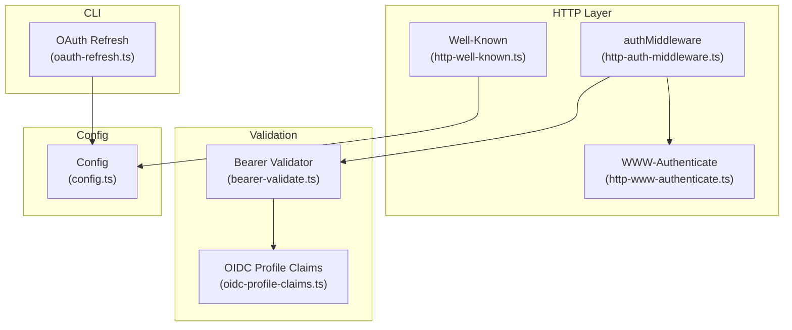
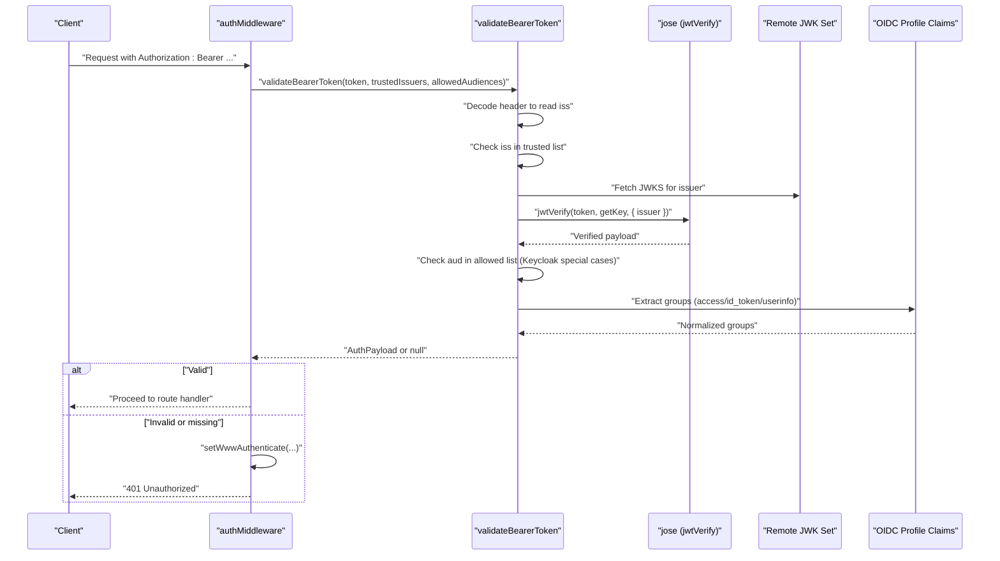
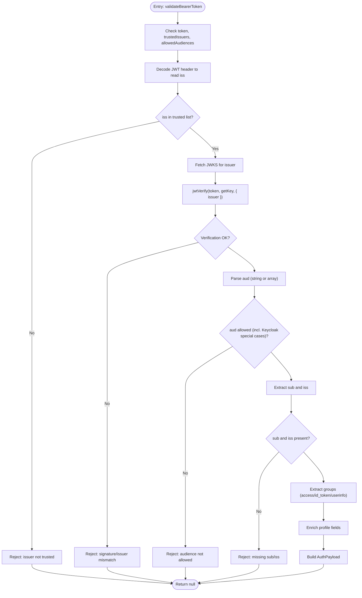
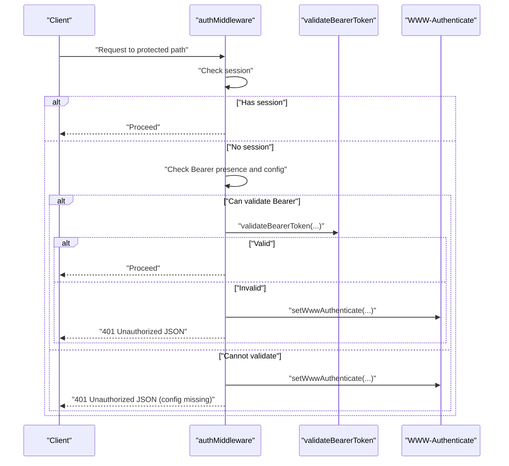
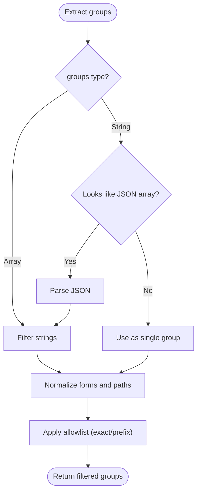
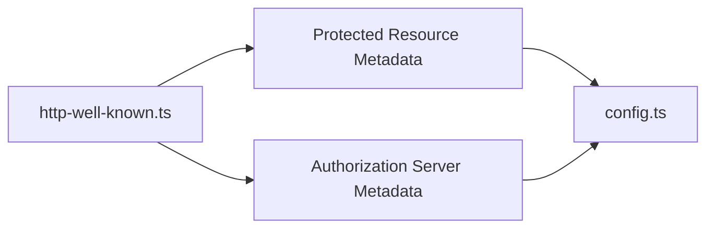
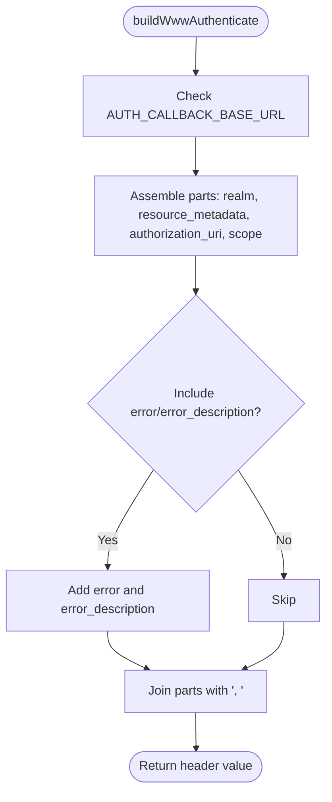
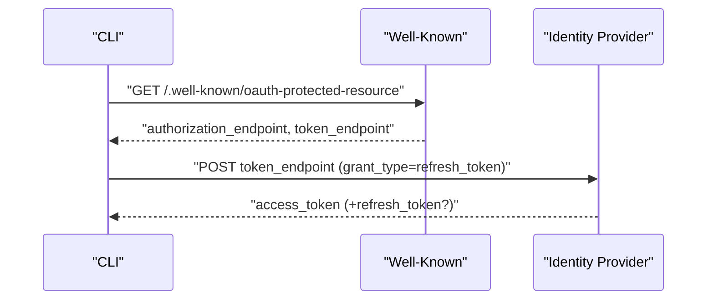
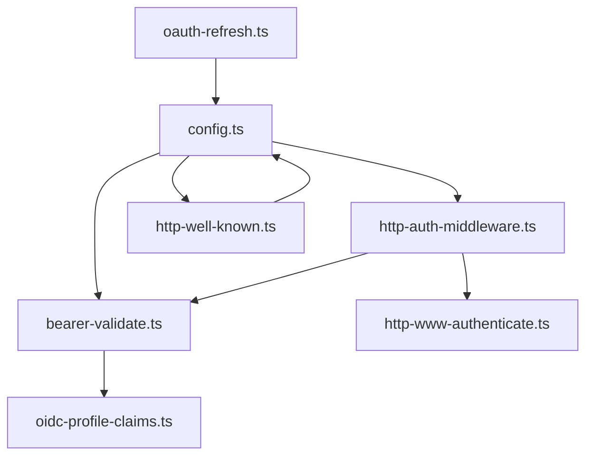

# Token Validation

<cite>
**Referenced Files in This Document**
- [bearer-validate.ts](file://src/http/bearer-validate.ts)
- [http-auth-middleware.ts](file://src/http/http-auth-middleware.ts)
- [http-www-authenticate.ts](file://src/http/http-www-authenticate.ts)
- [oidc-profile-claims.ts](file://src/http/oidc-profile-claims.ts)
- [config.ts](file://src/config.ts)
- [oauth-refresh.ts](file://src/cli/oauth-refresh.ts)
- [http-well-known.ts](file://src/http/http-well-known.ts)
- [bearer-validate-group-fallback.test.ts](file://tests/unit/bearer-validate-group-fallback.test.ts)
- [auth-keycloak.test.ts](file://tests/integration/auth-keycloak.test.ts)
- [structured-logger.ts](file://src/utils/structured-logger.ts)
</cite>

## Table of Contents
1. [Introduction](#introduction)
2. [Project Structure](#project-structure)
3. [Core Components](#core-components)
4. [Architecture Overview](#architecture-overview)
5. [Detailed Component Analysis](#detailed-component-analysis)
6. [Dependency Analysis](#dependency-analysis)
7. [Performance Considerations](#performance-considerations)
8. [Troubleshooting Guide](#troubleshooting-guide)
9. [Conclusion](#conclusion)
10. [Appendices](#appendices)

## Introduction
This document explains the token validation system used by the server for bearer JWTs issued by an OpenID Connect provider (Keycloak). It covers issuer verification, audience checking, expiration validation, signature verification, and how validated tokens are transformed into authentication contexts. It also documents the WWW-Authenticate header implementation for OAuth 2.0 compliance, token refresh mechanisms, error handling, security considerations, and practical configuration examples.

## Project Structure
The token validation pipeline spans several modules:
- HTTP middleware validates incoming requests and delegates bearer token validation when present.
- Bearer validator performs issuer, audience, and signature checks, and enriches the payload with profile and group information.
- OIDC profile claims utilities extract and normalize groups, derive realms, and enrich profile fields.
- Well-known endpoints expose OAuth 2.0 discovery metadata for clients.
- WWW-Authenticate utilities construct compliant headers for 401 responses.
- CLI refresh utilities implement OAuth refresh flows for offline access.

**Diagram sources**
- [http-auth-middleware.ts:167-313](file://src/http/http-auth-middleware.ts#L167-L313)
- [bearer-validate.ts:120-208](file://src/http/bearer-validate.ts#L120-L208)
- [oidc-profile-claims.ts:68-95](file://src/http/oidc-profile-claims.ts#L68-L95)
- [http-www-authenticate.ts:18-47](file://src/http/http-www-authenticate.ts#L18-L47)
- [http-well-known.ts:31-54](file://src/http/http-well-known.ts#L31-L54)
- [config.ts:113-171](file://src/config.ts#L113-L171)
- [oauth-refresh.ts:26-86](file://src/cli/oauth-refresh.ts#L26-L86)

**Section sources**
- [http-auth-middleware.ts:167-313](file://src/http/http-auth-middleware.ts#L167-L313)
- [bearer-validate.ts:120-208](file://src/http/bearer-validate.ts#L120-L208)
- [oidc-profile-claims.ts:68-95](file://src/http/oidc-profile-claims.ts#L68-L95)
- [http-www-authenticate.ts:18-47](file://src/http/http-www-authenticate.ts#L18-L47)
- [http-well-known.ts:31-54](file://src/http/http-well-known.ts#L31-L54)
- [config.ts:113-171](file://src/config.ts#L113-L171)
- [oauth-refresh.ts:26-86](file://src/cli/oauth-refresh.ts#L26-L86)

## Core Components
- AuthPayload: The normalized authentication context produced from a validated token, including subject, groups, issuer, realm, and whitelisted profile fields.
- validateBearerToken: Performs issuer trust, audience acceptance, signature verification, and group enrichment.
- authMiddleware: Enforces authentication for protected paths, supports session and bearer auth, and emits WWW-Authenticate on 401.
- OIDC profile utilities: Extract groups, derive realm, and enrich profile claims.
- Well-known endpoints: Expose OAuth 2.0 discovery metadata and authorization server metadata.
- WWW-Authenticate builder: Produces compliant headers for OAuth 2.0 clients.
- OAuth refresh: Implements refresh_token grant for CLI flows.

**Section sources**
- [bearer-validate.ts:22-39](file://src/http/bearer-validate.ts#L22-L39)
- [bearer-validate.ts:120-208](file://src/http/bearer-validate.ts#L120-L208)
- [http-auth-middleware.ts:167-313](file://src/http/http-auth-middleware.ts#L167-L313)
- [oidc-profile-claims.ts:68-95](file://src/http/oidc-profile-claims.ts#L68-L95)
- [http-well-known.ts:31-54](file://src/http/http-well-known.ts#L31-L54)
- [http-www-authenticate.ts:18-47](file://src/http/http-www-authenticate.ts#L18-L47)
- [oauth-refresh.ts:26-86](file://src/cli/oauth-refresh.ts#L26-L86)

## Architecture Overview
The system validates bearer tokens by:
- Confirming the issuer is in a trusted list.
- Ensuring the audience is allowed (with special handling for Keycloak "account" and empty audiences).
- Verifying the JWT signature using JWKS fetched from the issuer.
- Enriching the payload with groups from the access token, nested id_token, or OIDC userinfo.
- Constructing a normalized AuthPayload and attaching it to the request for downstream handlers.

**Diagram sources**
- [http-auth-middleware.ts:225-282](file://src/http/http-auth-middleware.ts#L225-L282)
- [bearer-validate.ts:120-208](file://src/http/bearer-validate.ts#L120-L208)
- [oidc-profile-claims.ts:78-95](file://src/http/oidc-profile-claims.ts#L78-L95)
- [http-www-authenticate.ts:44-47](file://src/http/http-www-authenticate.ts#L44-L47)

## Detailed Component Analysis

### Bearer Token Validation
- Issuer verification: The unverified header is decoded to extract the issuer, which must be present and included in the trusted issuers list. The trusted list is expanded to include localhost ↔ 127.0.0.1 aliases for convenience.
- Audience checking: Allowed audiences include configured values plus "account" when the issuer is a Keycloak realm. Empty audiences for Keycloak realms are also accepted.
- Signature verification: Uses JWKS fetched from the issuer’s certificate endpoint. The verification is performed with the matching issuer to ensure the token was signed by that authority.
- Group enrichment: Groups are taken from the access token; if missing, they are extracted from a nested id_token if present; otherwise, they are fetched from OIDC userinfo. Optional merging with userinfo groups is controlled by configuration.
- Profile enrichment: Non-empty profile fields are attached to the AuthPayload after verification.

**Diagram sources**
- [bearer-validate.ts:120-208](file://src/http/bearer-validate.ts#L120-L208)
- [bearer-validate.ts:102-109](file://src/http/bearer-validate.ts#L102-L109)
- [oidc-profile-claims.ts:78-95](file://src/http/oidc-profile-claims.ts#L78-L95)

**Section sources**
- [bearer-validate.ts:120-208](file://src/http/bearer-validate.ts#L120-L208)
- [config.ts:284-323](file://src/config.ts#L284-L323)

### Auth Middleware and WWW-Authenticate
- Protected paths: Authentication is enforced for /api, /api/*, /mcp, and /ui routes.
- Session vs Bearer: If a valid session exists, the request proceeds; otherwise, if a Bearer token is present, it is validated according to configuration.
- Configuration gating: Bearer validation is only performed when trusted issuers and allowed audiences are configured and AUTH_MODE indicates OIDC bearer mode or AUTH_ENABLED is true.
- 401 handling: When authentication fails, the server sets a WWW-Authenticate header and returns a JSON error with a login URL when available.

**Diagram sources**
- [http-auth-middleware.ts:167-313](file://src/http/http-auth-middleware.ts#L167-L313)
- [http-www-authenticate.ts:44-47](file://src/http/http-www-authenticate.ts#L44-L47)

**Section sources**
- [http-auth-middleware.ts:167-313](file://src/http/http-auth-middleware.ts#L167-L313)
- [http-www-authenticate.ts:18-47](file://src/http/http-www-authenticate.ts#L18-L47)

### OIDC Profile Claims and Group Allowlisting
- Groups extraction: Supports arrays, single strings, and JSON-encoded strings. Normalizes group forms and path forms.
- Allowlist filtering: Applies exact match or prefix rules (ending with "/") to restrict which groups become spaces.
- Realm derivation: Extracts realm from issuer URL; falls back to a default if not found.
- Profile enrichment: Whitelists selected fields and derives account kind and label based on identity provider.

**Diagram sources**
- [oidc-profile-claims.ts:78-153](file://src/http/oidc-profile-claims.ts#L78-L153)

**Section sources**
- [oidc-profile-claims.ts:78-153](file://src/http/oidc-profile-claims.ts#L78-L153)

### Well-Known Discovery and Authorization Server Metadata
- Protected Resource Metadata: Exposes resource, authorization servers, supported scopes, bearer methods, and authorization endpoints derived from configuration.
- Authorization Server Metadata: Proxies Keycloak’s openid-configuration with caching and URL rewriting for internal Docker environments.
- CORS and options: Handles preflight and cross-origin headers for discovery endpoints.

**Diagram sources**
- [http-well-known.ts:31-54](file://src/http/http-well-known.ts#L31-L54)
- [http-well-known.ts:171-186](file://src/http/http-well-known.ts#L171-L186)
- [config.ts:113-137](file://src/config.ts#L113-L137)

**Section sources**
- [http-well-known.ts:31-54](file://src/http/http-well-known.ts#L31-L54)
- [http-well-known.ts:171-186](file://src/http/http-well-known.ts#L171-L186)
- [config.ts:113-137](file://src/config.ts#L113-L137)

### WWW-Authenticate Header Implementation
- Compliance: Builds a Bearer realm header with resource metadata, optional authorization URI, and scopes.
- Error signaling: Can include error and error_description to instruct clients to clear stored tokens and restart OAuth.
- Integration: Used by middleware to ensure clients receive proper OAuth 2.0 signals on 401 responses.

**Diagram sources**
- [http-www-authenticate.ts:18-42](file://src/http/http-www-authenticate.ts#L18-L42)

**Section sources**
- [http-www-authenticate.ts:18-47](file://src/http/http-www-authenticate.ts#L18-L47)

### Token Refresh Mechanisms
- Discovery: Clients discover token endpoints via well-known metadata.
- Exchange: The refresh_token grant exchanges a refresh token for a new access token (and optionally a rotated refresh token).
- CLI usage: The CLI uses a fixed client ID and interacts with the discovered endpoints.

**Diagram sources**
- [oauth-refresh.ts:26-86](file://src/cli/oauth-refresh.ts#L26-L86)
- [http-well-known.ts:31-54](file://src/http/http-well-known.ts#L31-L54)

**Section sources**
- [oauth-refresh.ts:26-86](file://src/cli/oauth-refresh.ts#L26-L86)
- [http-well-known.ts:31-54](file://src/http/http-well-known.ts#L31-L54)

## Dependency Analysis
- Configuration-driven behavior: Trusted issuers and allowed audiences are derived from environment variables and expanded to include localhost ↔ 127.0.0.1 aliases. OIDC scopes and group allowlists influence discovery and group filtering.
- External dependencies: Remote JWKS fetching and OIDC userinfo retrieval rely on HTTP endpoints exposed by the issuer.
- Cohesion and coupling: Validation logic is cohesive within the bearer validator; middleware coordinates with validation and discovery utilities. There is minimal coupling to external systems via well-known endpoints.

**Diagram sources**
- [config.ts:284-323](file://src/config.ts#L284-L323)
- [bearer-validate.ts:102-109](file://src/http/bearer-validate.ts#L102-L109)
- [http-auth-middleware.ts:225-282](file://src/http/http-auth-middleware.ts#L225-L282)
- [http-www-authenticate.ts:44-47](file://src/http/http-www-authenticate.ts#L44-L47)
- [http-well-known.ts:31-54](file://src/http/http-well-known.ts#L31-L54)
- [oauth-refresh.ts:26-86](file://src/cli/oauth-refresh.ts#L26-L86)

**Section sources**
- [config.ts:284-323](file://src/config.ts#L284-L323)
- [bearer-validate.ts:102-109](file://src/http/bearer-validate.ts#L102-L109)
- [http-auth-middleware.ts:225-282](file://src/http/http-auth-middleware.ts#L225-L282)
- [http-www-authenticate.ts:44-47](file://src/http/http-www-authenticate.ts#L44-L47)
- [http-well-known.ts:31-54](file://src/http/http-well-known.ts#L31-L54)
- [oauth-refresh.ts:26-86](file://src/cli/oauth-refresh.ts#L26-L86)

## Performance Considerations
- JWKS caching: The validator caches JWKS per issuer to avoid repeated network fetches.
- Minimal decoding: The issuer check decodes only the header to minimize overhead before full verification.
- Group retrieval: UserInfo fetch is optional and only invoked when groups are missing from the access token and nested id_token.
- Logging overhead: Optional trace logs can be enabled via environment variables for diagnostics but should be used sparingly in production.

**Section sources**
- [bearer-validate.ts:41-109](file://src/http/bearer-validate.ts#L41-L109)
- [bearer-validate.ts:128-145](file://src/http/bearer-validate.ts#L128-L145)

## Troubleshooting Guide
Common validation failures and resolutions:
- Missing or empty token: Ensure the Authorization header is present and formatted as "Bearer ..." for protected routes.
- Issuer not trusted: Verify AUTH_TRUSTED_ISSUERS includes the token’s issuer (including localhost ↔ 127.0.0.1 aliases).
- Audience not allowed: Ensure AUTH_ALLOWED_AUDIENCES includes the token’s audience; for Keycloak realms, "account" and empty audiences are accepted.
- Signature verification failure: Confirm the issuer’s JWKS endpoint is reachable and the token was signed by that issuer.
- Missing sub or iss: Tokens must include both subject and issuer claims.
- Groups missing: If groups are absent, ensure the client has a Group Membership mapper configured in Keycloak or enable merging with userinfo groups.
- 401 responses: Inspect WWW-Authenticate header for guidance; clients should clear stored tokens and restart OAuth when instructed.

Debugging techniques:
- Enable trace logging: Set AUTH_TRACE or LOG_LEVEL to "trace" to observe decoded payloads and validation steps.
- Review middleware logs: The auth middleware logs detailed decisions around session, bearer presence, and validation outcomes.
- Use integration tests: The test suite demonstrates expected behavior for authenticated and unauthenticated requests.

**Section sources**
- [bearer-validate.ts:132-168](file://src/http/bearer-validate.ts#L132-L168)
- [http-auth-middleware.ts:225-282](file://src/http/http-auth-middleware.ts#L225-L282)
- [http-www-authenticate.ts:18-47](file://src/http/http-www-authenticate.ts#L18-L47)
- [bearer-validate-group-fallback.test.ts:46-111](file://tests/unit/bearer-validate-group-fallback.test.ts#L46-L111)
- [auth-keycloak.test.ts:27-131](file://tests/integration/auth-keycloak.test.ts#L27-L131)
- [structured-logger.ts:206-331](file://src/utils/structured-logger.ts#L206-L331)

## Conclusion
The token validation system provides robust OIDC-compliant bearer authentication with configurable issuer trust, audience enforcement, and signature verification. It normalizes user identity and group memberships, integrates with discovery endpoints, and emits standardized WWW-Authenticate headers. The design balances security, flexibility, and operational simplicity, with clear pathways for diagnostics and refresh flows.

## Appendices

### Practical Configuration Examples
- Trusted issuers: Set AUTH_TRUSTED_ISSUERS to a comma-separated list of issuer URLs (e.g., https://keycloak.example/realms/myrealm). The system expands localhost ↔ 127.0.0.1 automatically.
- Allowed audiences: Set AUTH_ALLOWED_AUDIENCES to a comma-separated list of audiences (e.g., kairos-mcp, kairos-cli). For Keycloak realms, "account" is added automatically when missing.
- Mode selection: Set AUTH_MODE=oidc_bearer to enforce strict bearer validation; leave AUTH_ENABLED=true to allow backward compatibility.
- Group allowlist: Set OIDC_GROUPS_ALLOWLIST to restrict which groups become spaces (exact match or prefix ending with "/").
- Merge userinfo groups: Set OIDC_BEARER_MERGE_USERINFO_GROUPS=true to union groups from access token and userinfo.

**Section sources**
- [config.ts:139-171](file://src/config.ts#L139-L171)
- [config.ts:284-323](file://src/config.ts#L284-L323)

### Security Considerations
- Always validate issuer and audience against configured lists.
- Ensure JWKS endpoints are reachable and TLS is properly configured.
- Limit group allowlist to reduce surface area for group-based spaces.
- Use HTTPS for AUTH_CALLBACK_BASE_URL and Keycloak endpoints.
- Monitor logs for rejection reasons and investigate suspicious patterns.

**Section sources**
- [bearer-validate.ts:132-168](file://src/http/bearer-validate.ts#L132-L168)
- [http-www-authenticate.ts:18-47](file://src/http/http-www-authenticate.ts#L18-L47)
- [config.ts:113-171](file://src/config.ts#L113-L171)