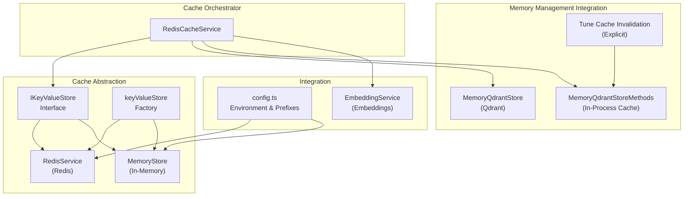
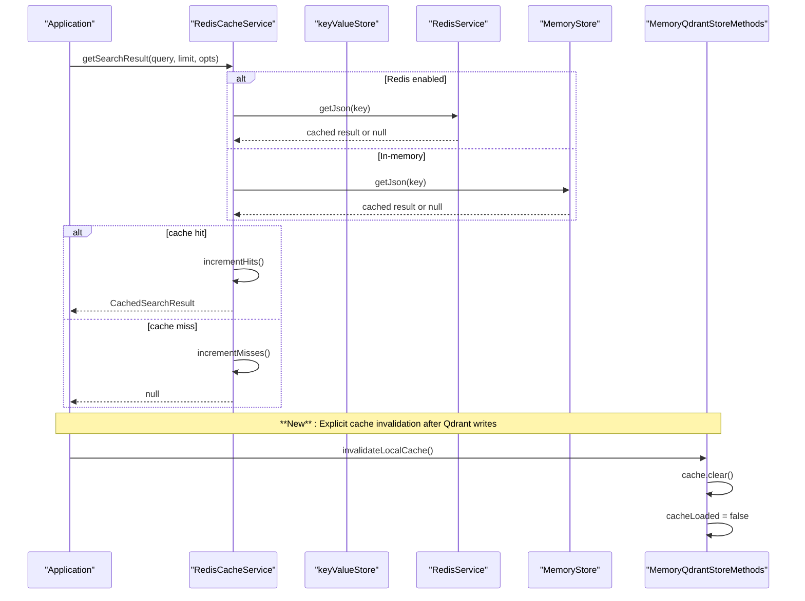
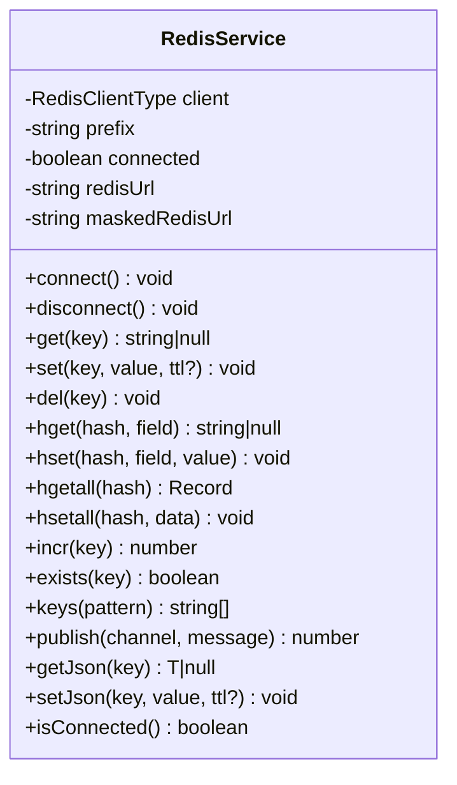
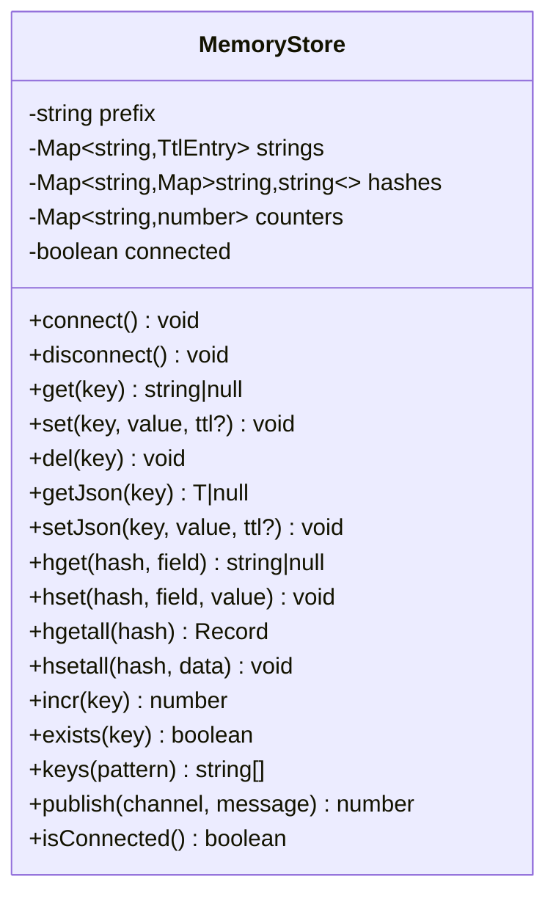
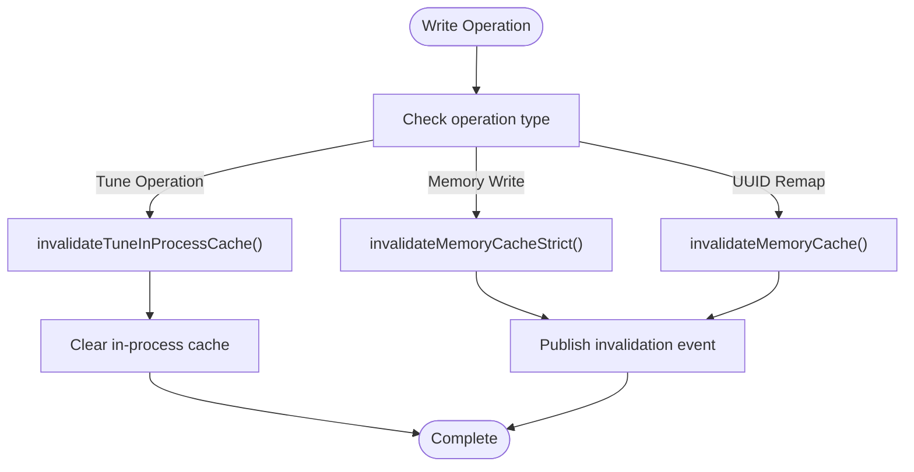
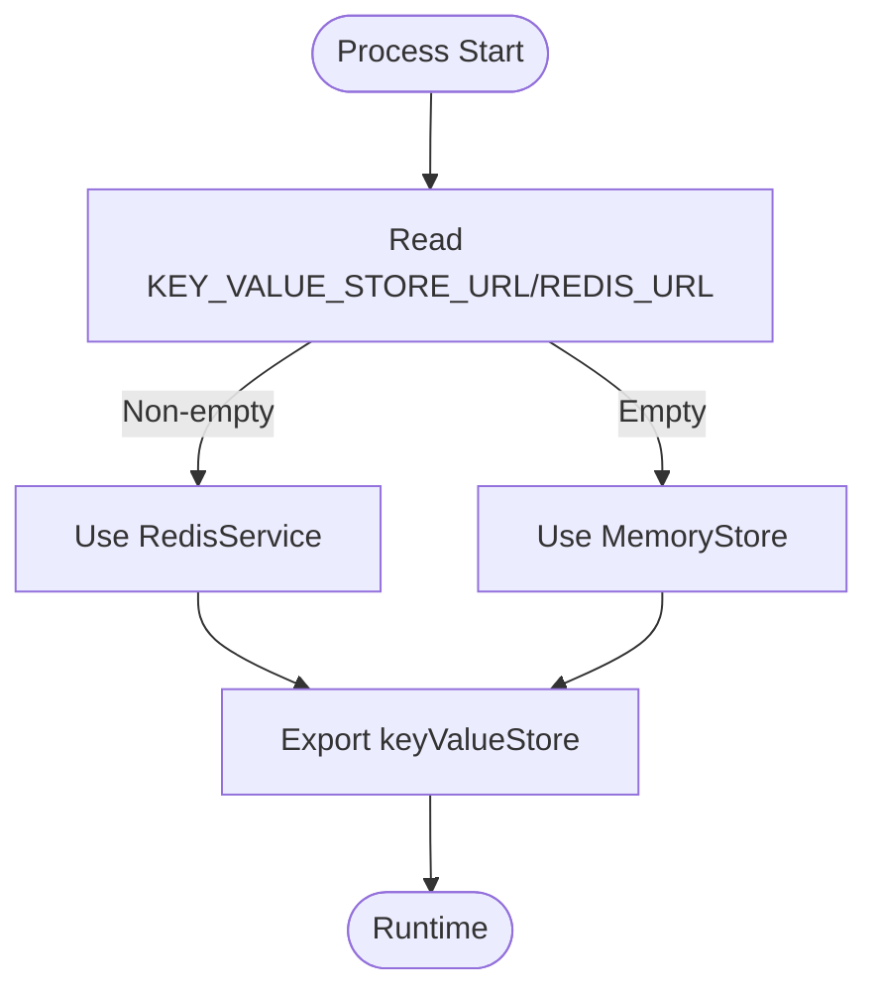
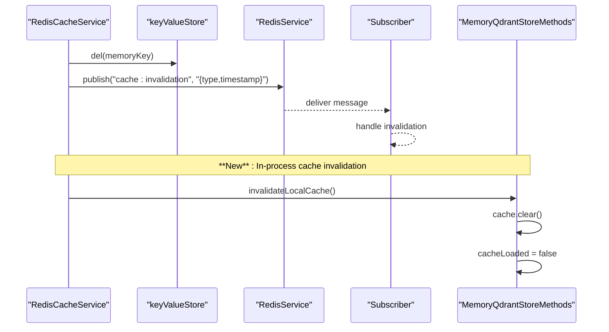
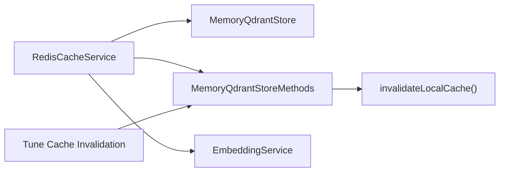
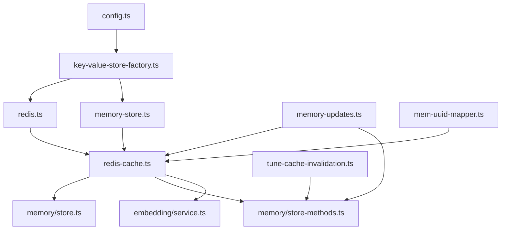

# Cache Layer

<cite>
**Referenced Files in This Document**
- [redis-cache.ts](file://src/services/redis-cache.ts)
- [redis.ts](file://src/services/redis.ts)
- [key-value-store.ts](file://src/services/key-value-store.ts)
- [key-value-store-factory.ts](file://src/services/key-value-store-factory.ts)
- [memory-store.ts](file://src/services/memory-store.ts)
- [config.ts](file://src/config.ts)
- [redis-pubsub-integration.test.ts](file://tests/integration/redis-pubsub-integration.test.ts)
- [values.yaml](file://helm/kairos-mcp/values.yaml)
- [system-metrics.ts](file://src/services/metrics/system-metrics.ts)
- [registry.ts](file://src/services/metrics/registry.ts)
- [store.ts](file://src/services/memory/store.ts)
- [service.ts](file://src/services/embedding/service.ts)
- [health.ts](file://src/services/embedding/health.ts)
- [store-methods.ts](file://src/services/memory/store-methods.ts)
- [memory-updates.ts](file://src/services/qdrant/memory-updates.ts)
- [tune-cache-invalidation.ts](file://src/tools/tune-cache-invalidation.ts)
- [mem-uuid-mapper.ts](file://src/resources/mem-uuid-mapper.ts)
</cite>

## Update Summary
**Changes Made**
- Updated cache invalidation section to reflect the new comprehensive cache invalidation system
- Added documentation for explicit cache invalidation process addressing stale data scenarios
- Enhanced memory management integration section with new in-process cache invalidation methods
- Updated cache consistency documentation to cover both Redis and in-process cache invalidation
- Added new section on explicit cache invalidation strategies for different write operations

## Table of Contents
1. [Introduction](#introduction)
2. [Project Structure](#project-structure)
3. [Core Components](#core-components)
4. [Architecture Overview](#architecture-overview)
5. [Detailed Component Analysis](#detailed-component-analysis)
6. [Dependency Analysis](#dependency-analysis)
7. [Performance Considerations](#performance-considerations)
8. [Troubleshooting Guide](#troubleshooting-guide)
9. [Conclusion](#conclusion)
10. [Appendices](#appendices)

## Introduction
This document explains the KAIROS MCP cache layer architecture with a focus on Redis integration for performance optimization. It covers connection handling, key-value operations, comprehensive cache invalidation strategies, the key-value store factory pattern, cache tiering approaches, configuration, TTL management, eviction policies, memory management integration, and embedding services. The cache layer now implements a dual-layer invalidation system addressing both distributed Redis cache and in-process MemoryQdrantStore cache consistency. Practical examples demonstrate cache configuration, monitoring hit rates, and troubleshooting performance issues. Distributed caching considerations and cache warming strategies are also addressed.

## Project Structure
The cache layer is implemented as a thin abstraction over Redis or an in-memory store. The key-value store interface is implemented by RedisService and MemoryStore. A factory selects the appropriate implementation at runtime based on environment configuration. RedisCacheService orchestrates cache reads/writes, TTLs, and comprehensive invalidation events across both Redis and in-process caches. The system now includes explicit cache invalidation methods to address stale data scenarios in both distributed and in-process contexts.



**Diagram sources**
- [redis-cache.ts:21-243](file://src/services/redis-cache.ts#L21-L243)
- [redis.ts:26-273](file://src/services/redis.ts#L26-L273)
- [memory-store.ts:23-178](file://src/services/memory-store.ts#L23-L178)
- [key-value-store.ts:7-24](file://src/services/key-value-store.ts#L7-L24)
- [key-value-store-factory.ts:12-19](file://src/services/key-value-store-factory.ts#L12-L19)
- [config.ts:54-66](file://src/config.ts#L54-L66)
- [store.ts:20-152](file://src/services/memory/store.ts#L20-L152)
- [store-methods.ts:25-297](file://src/services/memory/store-methods.ts#L25-L297)
- [tune-cache-invalidation.ts:1-15](file://src/tools/tune-cache-invalidation.ts#L1-L15)
- [service.ts:254-287](file://src/services/embedding/service.ts#L254-L287)

**Section sources**
- [redis-cache.ts:1-243](file://src/services/redis-cache.ts#L1-L243)
- [redis.ts:1-273](file://src/services/redis.ts#L1-L273)
- [memory-store.ts:1-178](file://src/services/memory-store.ts#L1-L178)
- [key-value-store.ts:1-25](file://src/services/key-value-store.ts#L1-L25)
- [key-value-store-factory.ts:1-20](file://src/services/key-value-store-factory.ts#L1-L20)
- [config.ts:54-66](file://src/config.ts#L54-L66)

## Core Components
- IKeyValueStore: Defines the cache API used by RedisCacheService, including get/set/del, JSON helpers, hash ops, counters, existence checks, key enumeration, pub/sub, and lifecycle methods.
- RedisService: Implements IKeyValueStore against Redis, applying a configurable prefix and per-space namespacing. It supports TTL, JSON serialization, and pub/sub channels.
- MemoryStore: Provides an in-memory implementation for development without Redis, mirroring RedisService behavior including TTL and glob-based key enumeration.
- RedisCacheService: Orchestrates cache keys for search results and memory resources, manages TTLs, increments hit/miss counters, and publishes invalidation events. **Updated**: Now includes explicit cache invalidation methods for both distributed and in-process cache layers.
- MemoryQdrantStoreMethods: Manages in-process cache with explicit invalidation capabilities to ensure fresh reads after Qdrant updates. **New**: Provides invalidateLocalCache() method for clearing in-memory cache state.
- Factory: keyValueStore selects RedisService when a Redis URL is configured; otherwise, MemoryStore is used.

Key-value operations:
- Namespacing: Keys are prefixed with a configurable prefix and, for non-memory keys, further namespaced by the current space identifier.
- JSON: Convenience methods serialize/deserialize cached values.
- TTL: Search results are cached with a fixed TTL; memory resources are stored without TTL but with bounded TTL in Redis for safety.
- Pub/Sub: Invalidations are broadcast on a dedicated channel for distributed invalidation awareness.
- Explicit Invalidation: **New**: Methods for strict cache invalidation that propagate errors to prevent stale data scenarios.

**Section sources**
- [key-value-store.ts:7-24](file://src/services/key-value-store.ts#L7-L24)
- [redis.ts:111-117](file://src/services/redis.ts#L111-L117)
- [memory-store.ts:36-42](file://src/services/memory-store.ts#L36-L42)
- [redis-cache.ts:31-34](file://src/services/redis-cache.ts#L31-L34)
- [redis-cache.ts:54-66](file://src/services/redis-cache.ts#L54-L66)
- [redis-cache.ts:175-184](file://src/services/redis-cache.ts#L175-L184)
- [redis-cache.ts:114-125](file://src/services/redis-cache.ts#L114-L125)
- [store-methods.ts:40-44](file://src/services/memory/store-methods.ts#L40-L44)
- [key-value-store-factory.ts:12-19](file://src/services/key-value-store-factory.ts#L12-L19)

## Architecture Overview
The cache layer sits between application logic and persistent stores. RedisCacheService uses keyValueStore to read/write cache entries. RedisService handles connection lifecycle and command execution, while MemoryStore provides a dev-friendly alternative. **Updated**: The architecture now includes explicit cache invalidation flows that address both distributed Redis cache and in-process MemoryQdrantStore cache consistency.



**Diagram sources**
- [redis-cache.ts:36-52](file://src/services/redis-cache.ts#L36-L52)
- [redis.ts:119-126](file://src/services/redis.ts#L119-L126)
- [memory-store.ts:49-58](file://src/services/memory-store.ts#L49-L58)
- [store-methods.ts:40-44](file://src/services/memory/store-methods.ts#L40-L44)

**Section sources**
- [redis-cache.ts:36-70](file://src/services/redis-cache.ts#L36-L70)
- [redis.ts:119-126](file://src/services/redis.ts#L119-L126)
- [memory-store.ts:49-58](file://src/services/memory-store.ts#L49-L58)

## Detailed Component Analysis

### RedisCacheService
**Updated**: Responsibilities now include comprehensive cache invalidation across both Redis and in-process cache layers:
- Build cache keys for search queries with mode and limit.
- Retrieve and store search results with TTL.
- Manage hit/miss counters and expose statistics.
- **Enhanced**: Invalidate caches for search, begin/activate, and memory resources with explicit error propagation.
- **New**: Support both standard and strict invalidation methods to handle different stale data scenarios.
- Publish invalidation events to a pub/sub channel for distributed systems.

Key behaviors:
- Search cache key composition includes mode (collapsed/natural), query, and limit.
- Search results are cached with a fixed TTL.
- Memory resources are cached without TTL in Redis but with bounded TTL for safety.
- **Enhanced**: Invalidation methods include both standard (logged and non-propagating) and strict (error-throwing) variants.
- **New**: Strict invalidation throws errors to prevent false-success responses when cache staleness could cause issues.

```mermaid
classDiagram
class RedisCacheService {
-string cachePrefix
-string invalidationChannel
-string statsPrefix
-string memoryPrefix
+getSearchResult(query, limit, opts) CachedSearchResult|null
+setSearchResult(query, limit, result, opts) void
+invalidateSearchCache() void
+invalidateMemoryCache(uuid) void
+invalidateMemoryCacheStrict(uuid) void
+invalidateBeginCache() void
+invalidateAfterUpdate() void
+publishInvalidation(type) void
+incrementHits() void
+incrementMisses() void
+getCacheStats() {hits, misses}
+get(key) string|null
+set(key, value, ttl?) void
}
```

**Diagram sources**
- [redis-cache.ts:21-243](file://src/services/redis-cache.ts#L21-L243)

**Section sources**
- [redis-cache.ts:31-70](file://src/services/redis-cache.ts#L31-L70)
- [redis-cache.ts:72-95](file://src/services/redis-cache.ts#L72-L95)
- [redis-cache.ts:97-125](file://src/services/redis-cache.ts#L97-L125)
- [redis-cache.ts:186-211](file://src/services/redis-cache.ts#L186-L211)
- [redis-cache.ts:214-221](file://src/services/redis-cache.ts#L214-L221)
- [redis-cache.ts:127-157](file://src/services/redis-cache.ts#L127-L157)
- [redis-cache.ts:223-240](file://src/services/redis-cache.ts#L223-L240)

### RedisService
Responsibilities:
- Implement IKeyValueStore against Redis.
- Apply key prefixing and per-space namespacing.
- Support TTL, JSON serialization, hash operations, counters, key enumeration, and pub/sub.
- Manage connection lifecycle and emit logs for connection events.

Key behaviors:
- Namespaces keys by prefix and current space; memory cache keys bypass space namespacing.
- Uses EX variant for TTL on SET; JSON helpers wrap stringify/parse.
- Publishes to channels without prefixing to enable cross-instance communication.



**Diagram sources**
- [redis.ts:26-273](file://src/services/redis.ts#L26-L273)

**Section sources**
- [redis.ts:111-117](file://src/services/redis.ts#L111-L117)
- [redis.ts:128-138](file://src/services/redis.ts#L128-L138)
- [redis.ts:229-247](file://src/services/redis.ts#L229-L247)
- [redis.ts:217-226](file://src/services/redis.ts#L217-L226)
- [redis.ts:269-272](file://src/services/redis.ts#L269-L272)

### MemoryStore
Responsibilities:
- Provide an in-memory implementation of IKeyValueStore for development.
- Mirror RedisService behavior including TTL, JSON, hashes, counters, and key enumeration.
- No cross-process invalidation via pub/sub.

Key behaviors:
- Namespaces keys similarly to RedisService, except memory cache keys are global.
- TTL entries expire based on absolute timestamps.
- Glob-based key enumeration supports pattern matching.



**Diagram sources**
- [memory-store.ts:23-178](file://src/services/memory-store.ts#L23-L178)

**Section sources**
- [memory-store.ts:36-42](file://src/services/memory-store.ts#L36-L42)
- [memory-store.ts:60-64](file://src/services/memory-store.ts#L60-L64)
- [memory-store.ts:73-91](file://src/services/memory-store.ts#L73-L91)
- [memory-store.ts:146-160](file://src/services/memory-store.ts#L146-L160)
- [memory-store.ts:162-164](file://src/services/memory-store.ts#L162-L164)

### MemoryQdrantStoreMethods
**New**: In-process cache management for MemoryQdrantStore:
- Maintains an in-memory cache keyed by memory_uuid using a Map structure.
- Provides explicit invalidation through invalidateLocalCache() method.
- Supports both cached and fresh retrieval modes for different use cases.
- Ensures cache consistency by clearing state after Qdrant updates.

Key behaviors:
- Cache storage: Map<string, Memory> with lazy loading and explicit invalidation.
- Cache control: invalidateLocalCache() clears cache and marks as unloaded.
- Fresh retrieval: getMemoryFresh() bypasses cache for guaranteed freshness.
- Hybrid search: Integrates with Redis cache for search results while managing in-process memory cache.

```mermaid
classDiagram
class MemoryQdrantStoreMethods {
-private Map~string,Memory~ cache
-private boolean cacheLoaded
+invalidateLocalCache() void
+getMemory(memory_uuid) Memory|null
+getMemoryFresh(memory_uuid) Memory|null
+searchMemories(query, limit) {memories, scores}
+invalidateLocalCache() void
}
```

**Diagram sources**
- [store-methods.ts:25-297](file://src/services/memory/store-methods.ts#L25-L297)

**Section sources**
- [store-methods.ts:28-44](file://src/services/memory/store-methods.ts#L28-L44)
- [store-methods.ts:40-44](file://src/services/memory/store-methods.ts#L40-L44)
- [store-methods.ts:46-97](file://src/services/memory/store-methods.ts#L46-L97)
- [store-methods.ts:80-97](file://src/services/memory/store-methods.ts#L80-L97)

### Explicit Cache Invalidation System
**New**: Comprehensive cache invalidation system addressing stale data scenarios:
- **Standard Invalidation**: invalidateMemoryCache() - catches and logs errors, continues operation.
- **Strict Invalidation**: invalidateMemoryCacheStrict() - throws errors to prevent stale data responses.
- **In-Process Invalidation**: invalidateLocalCache() - clears MemoryQdrantStoreMethods cache state.
- **Tune Operation Invalidation**: invalidateTuneInProcessCache() - specifically handles tune operation cache clearing.



**Diagram sources**
- [memory-updates.ts:212-214](file://src/services/qdrant/memory-updates.ts#L212-L214)
- [tune-cache-invalidation.ts:9-15](file://src/tools/tune-cache-invalidation.ts#L9-L15)
- [mem-uuid-mapper.ts:105-109](file://src/resources/mem-uuid-mapper.ts#L105-L109)

**Section sources**
- [redis-cache.ts:99-129](file://src/services/redis-cache.ts#L99-L129)
- [memory-updates.ts:212-214](file://src/services/qdrant/memory-updates.ts#L212-L214)
- [tune-cache-invalidation.ts:9-15](file://src/tools/tune-cache-invalidation.ts#L9-L15)
- [mem-uuid-mapper.ts:105-109](file://src/resources/mem-uuid-mapper.ts#L105-L109)

### Key-Value Store Factory Pattern
The factory chooses the implementation at runtime:
- If a Redis URL is configured, RedisService is used.
- Otherwise, MemoryStore is used for local development.



**Diagram sources**
- [key-value-store-factory.ts:12-19](file://src/services/key-value-store-factory.ts#L12-L19)
- [config.ts:52-54](file://src/config.ts#L52-L54)

**Section sources**
- [key-value-store-factory.ts:12-19](file://src/services/key-value-store-factory.ts#L12-L19)
- [config.ts:52-54](file://src/config.ts#L52-L54)

### Cache Invalidation Strategies
**Updated**: Comprehensive invalidation system addressing multiple cache layers:
RedisCacheService publishes invalidation events to a channel for distributed systems. **Enhanced**: Now includes explicit invalidation methods for different stale data scenarios. MemoryQdrantStoreMethods provides in-process cache invalidation to ensure fresh reads after Qdrant updates.



**Diagram sources**
- [redis-cache.ts:97-125](file://src/services/redis-cache.ts#L97-L125)
- [redis.ts:217-226](file://src/services/redis.ts#L217-L226)
- [redis-pubsub-integration.test.ts:118-147](file://tests/integration/redis-pubsub-integration.test.ts#L118-L147)
- [store-methods.ts:40-44](file://src/services/memory/store-methods.ts#L40-L44)

**Section sources**
- [redis-cache.ts:97-125](file://src/services/redis-cache.ts#L97-L125)
- [redis.ts:217-226](file://src/services/redis.ts#L217-L226)
- [redis-pubsub-integration.test.ts:118-147](file://tests/integration/redis-pubsub-integration.test.ts#L118-L147)
- [store-methods.ts:40-44](file://src/services/memory/store-methods.ts#L40-L44)

### Cache Tiering Approaches
- Hot cache: Search results cached with TTL.
- Warm cache: Memory resources cached without TTL in Redis but with bounded TTL for safety.
- **New**: Cold cache: In-process MemoryQdrantStoreMethods cache with explicit invalidation.
- Cold cache: Not explicitly modeled; consider using Redis with TTL for transient data if needed.

Implementation notes:
- Search results: TTL enforced by RedisService.
- Memory resources: Stored without TTL in Redis but with bounded TTL for safety; cleared immediately in in-process cache.
- **New**: In-process cache: Managed by MemoryQdrantStoreMethods with explicit invalidation methods.

**Section sources**
- [redis-cache.ts:54-70](file://src/services/redis-cache.ts#L54-L70)
- [redis-cache.ts:175-184](file://src/services/redis-cache.ts#L175-L184)
- [redis.ts:128-138](file://src/services/redis.ts#L128-L138)
- [store-methods.ts:28-44](file://src/services/memory/store-methods.ts#L28-L44)

### Cache Configuration, TTL Management, and Eviction Policies
- Prefix and memory cache key prefix are controlled by environment variables.
- Search results TTL is fixed at a compile-time constant in RedisCacheService.
- Memory resources are stored without TTL in Redis but with bounded TTL for safety.
- **New**: In-process cache has no TTL - relies on explicit invalidation methods.
- RedisService applies TTL via EX variant; MemoryStore tracks expiration via timestamps.

Operational guidance:
- Adjust TTL for search results by modifying the constant in RedisCacheService.
- For MemoryStore, TTL is enforced by checking expiration timestamps on access.
- **New**: Use invalidateLocalCache() after Qdrant writes to ensure fresh reads.

**Section sources**
- [config.ts:54-66](file://src/config.ts#L54-L66)
- [redis-cache.ts:54-70](file://src/services/redis-cache.ts#L54-L70)
- [redis-cache.ts:175-184](file://src/services/redis-cache.ts#L175-L184)
- [redis.ts:128-138](file://src/services/redis.ts#L128-L138)
- [memory-store.ts:44-47](file://src/services/memory-store.ts#L44-L47)
- [memory-store.ts:60-64](file://src/services/memory-store.ts#L60-L64)
- [store-methods.ts:28-44](file://src/services/memory/store-methods.ts#L28-L44)

### Integration with Memory Management and Embedding Services
**Updated**: Enhanced integration with comprehensive cache invalidation:
- Memory management: RedisCacheService interacts with MemoryQdrantStore for retrieval and updates. **Enhanced**: Invalidation is triggered after updates using strict invalidation methods to prevent stale data responses.
- **New**: MemoryQdrantStoreMethods provides explicit cache invalidation for in-process cache consistency.
- **New**: Tune operations trigger explicit cache invalidation through invalidateTuneInProcessCache().
- Embedding services: Health checks and configuration inform embedding dimension probing and readiness, indirectly supporting cache warming and performance.



**Diagram sources**
- [redis-cache.ts:214-221](file://src/services/redis-cache.ts#L214-L221)
- [store.ts:135-144](file://src/services/memory/store.ts#L135-L144)
- [store-methods.ts:40-44](file://src/services/memory/store-methods.ts#L40-L44)
- [tune-cache-invalidation.ts:9-15](file://src/tools/tune-cache-invalidation.ts#L9-L15)
- [service.ts:254-287](file://src/services/embedding/service.ts#L254-L287)
- [health.ts:35-58](file://src/services/embedding/health.ts#L35-L58)

**Section sources**
- [redis-cache.ts:214-221](file://src/services/redis-cache.ts#L214-L221)
- [store.ts:135-144](file://src/services/memory/store.ts#L135-L144)
- [store-methods.ts:40-44](file://src/services/memory/store-methods.ts#L40-L44)
- [tune-cache-invalidation.ts:9-15](file://src/tools/tune-cache-invalidation.ts#L9-L15)
- [service.ts:254-287](file://src/services/embedding/service.ts#L254-L287)
- [health.ts:35-58](file://src/services/embedding/health.ts#L35-L58)

## Dependency Analysis
**Updated**: Enhanced dependency graph reflecting comprehensive cache invalidation system:
The cache layer depends on configuration for prefixes and backend selection, and integrates with memory and embedding services. **Enhanced**: Now includes explicit cache invalidation dependencies for different operation types.



**Diagram sources**
- [config.ts:54-66](file://src/config.ts#L54-L66)
- [key-value-store-factory.ts:12-19](file://src/services/key-value-store-factory.ts#L12-L19)
- [redis.ts:26-273](file://src/services/redis.ts#L26-L273)
- [memory-store.ts:23-178](file://src/services/memory-store.ts#L23-L178)
- [redis-cache.ts:1-243](file://src/services/redis-cache.ts#L1-L243)
- [store.ts:20-152](file://src/services/memory/store.ts#L20-L152)
- [store-methods.ts:25-297](file://src/services/memory/store-methods.ts#L25-L297)
- [service.ts:254-287](file://src/services/embedding/service.ts#L254-L287)
- [tune-cache-invalidation.ts:1-15](file://src/tools/tune-cache-invalidation.ts#L1-L15)
- [memory-updates.ts:176-214](file://src/services/qdrant/memory-updates.ts#L176-L214)
- [mem-uuid-mapper.ts:105-109](file://src/resources/mem-uuid-mapper.ts#L105-L109)

**Section sources**
- [config.ts:54-66](file://src/config.ts#L54-L66)
- [key-value-store-factory.ts:12-19](file://src/services/key-value-store-factory.ts#L12-L19)
- [redis-cache.ts:1-243](file://src/services/redis-cache.ts#L1-L243)

## Performance Considerations
- Connection handling: RedisService emits connection lifecycle logs and exposes isConnected for monitoring.
- Namespacing: Per-space keys prevent collisions across tenants; memory cache keys remain global for UUID-based access.
- TTL and eviction: Redis manages eviction policies; MemoryStore relies on TTL checks on access.
- Pub/Sub invalidation: Enables distributed invalidation across instances.
- **New**: Explicit cache invalidation overhead: Additional method calls for strict invalidation but prevents stale data scenarios.
- **New**: In-process cache management: MemoryQdrantStoreMethods provides efficient in-memory caching with explicit invalidation control.

## Troubleshooting Guide
**Updated**: Enhanced troubleshooting guide for comprehensive cache invalidation system:
Common issues and remedies:
- Redis connectivity failures: Inspect connection logs and error events emitted by RedisService.
- Cache invalidation not observed: Verify pub/sub channel subscriptions and that publish is invoked on invalidation.
- Memory cache misses: Confirm global memory cache keys and absence of TTL for memory resources.
- **New**: Stale data after writes: Check that strict invalidation methods are being used for critical write operations.
- **New**: In-process cache not refreshing: Verify invalidateLocalCache() is called after Qdrant updates.
- Monitoring cache hit rates: Use RedisCacheService statistics and Prometheus metrics.

Practical references:
- Connection lifecycle and error logging in RedisService.
- Invalidation event publishing and consumption in tests.
- **New**: Explicit invalidation method usage in memory operations.
- Prometheus metrics registry and system metrics.

**Section sources**
- [redis.ts:47-84](file://src/services/redis.ts#L47-L84)
- [redis-cache.ts:114-125](file://src/services/redis-cache.ts#L114-L125)
- [redis-pubsub-integration.test.ts:118-147](file://tests/integration/redis-pubsub-integration.test.ts#L118-L147)
- [registry.ts:11-21](file://src/services/metrics/registry.ts#L11-L21)
- [system-metrics.ts:1-41](file://src/services/metrics/system-metrics.ts#L1-L41)
- [memory-updates.ts:176-214](file://src/services/qdrant/memory-updates.ts#L176-L214)
- [store-methods.ts:40-44](file://src/services/memory/store-methods.ts#L40-L44)

## Conclusion
**Updated**: The cache layer now provides comprehensive cache invalidation across both distributed Redis cache and in-process MemoryQdrantStore cache. The architecture maintains clean abstraction over Redis or an in-memory store while adding explicit invalidation methods to address stale data scenarios. RedisCacheService centralizes cache orchestration, TTL management, and invalidation events. **Enhanced**: MemoryQdrantStoreMethods provides explicit in-process cache management with invalidateLocalCache() for ensuring fresh reads after Qdrant updates. Configuration controls backend selection and key prefixes, while integration with memory and embedding services ensures coherent performance characteristics. The design supports distributed invalidation via pub/sub and offers practical mechanisms for monitoring and troubleshooting. The new explicit cache invalidation system addresses stale data concerns that could arise from concurrent updates and provides both standard and strict invalidation methods for different operational requirements.

## Appendices

### Practical Examples

- Cache configuration
  - Backend selection: Set KEY_VALUE_STORE_URL (or REDIS_URL) to enable Redis; leave unset for in-memory store.
  - Prefix: Configure KAIROS_KEY_VALUE_PREFIX (or KAIROS_REDIS_PREFIX) to isolate keys.
  - Memory cache prefix: MEMORY_CACHE_KEY_PREFIX defines global memory cache keys.

  **Section sources**
  - [config.ts:52-55](file://src/config.ts#L52-L55)
  - [config.ts:65-66](file://src/config.ts#L65-L66)
  - [key-value-store-factory.ts:12-19](file://src/services/key-value-store-factory.ts#L12-L19)

- Monitoring cache hit rates
  - Use RedisCacheService.getCacheStats to retrieve hits and misses counters.
  - Expose metrics via Prometheus using the registry and system metrics.

  **Section sources**
  - [redis-cache.ts:143-157](file://src/services/redis-cache.ts#L143-L157)
  - [registry.ts:11-21](file://src/services/metrics/registry.ts#L11-L21)
  - [system-metrics.ts:10-41](file://src/services/metrics/system-metrics.ts#L10-L41)

- Troubleshooting cache-related performance issues
  - Validate Redis connectivity and error logs.
  - Confirm TTL behavior for search results and absence of TTL for memory resources.
  - Verify pub/sub invalidation delivery in distributed deployments.
  - **New**: Check strict invalidation usage for critical write operations.
  - **New**: Verify in-process cache invalidation after Qdrant updates.

  **Section sources**
  - [redis.ts:47-84](file://src/services/redis.ts#L47-L84)
  - [redis-cache.ts:54-70](file://src/services/redis-cache.ts#L54-L70)
  - [redis-cache.ts:175-184](file://src/services/redis-cache.ts#L175-L184)
  - [redis-pubsub-integration.test.ts:118-147](file://tests/integration/redis-pubsub-integration.test.ts#L118-L147)
  - [memory-updates.ts:176-214](file://src/services/qdrant/memory-updates.ts#L176-L214)
  - [store-methods.ts:40-44](file://src/services/memory/store-methods.ts#L40-L44)

- Cache consistency and distributed caching
  - Use Redis pub/sub channel "cache:invalidation" for cross-instance invalidation.
  - Helm values support multi-replica deployments; ensure Redis availability for consistent invalidation.
  - **New**: Use strict invalidation methods (invalidateMemoryCacheStrict) for critical write operations to prevent stale data.

  **Section sources**
  - [redis-cache.ts:114-125](file://src/services/redis-cache.ts#L114-L125)
  - [values.yaml:42-42](file://helm/kairos-mcp/values.yaml#L42-L42)
  - [memory-updates.ts:176-214](file://src/services/qdrant/memory-updates.ts#L176-L214)

- Cache warming strategies
  - Preload frequently accessed memory resources by calling setMemoryResource with representative data.
  - Warm search cache by proactively invoking setSearchResult with common queries and limits.
  - **New**: Use invalidateLocalCache() after bulk Qdrant updates to refresh in-process cache.

  **Section sources**
  - [redis-cache.ts:175-184](file://src/services/redis-cache.ts#L175-L184)
  - [redis-cache.ts:54-70](file://src/services/redis-cache.ts#L54-L70)
  - [store-methods.ts:40-44](file://src/services/memory/store-methods.ts#L40-L44)

- Explicit cache invalidation patterns
  - **New**: Use invalidateMemoryCacheStrict() for critical write operations where stale data could cause false-success responses.
  - **New**: Use invalidateLocalCache() after Qdrant writes to ensure fresh reads in MemoryQdrantStoreMethods.
  - **New**: Use invalidateTuneInProcessCache() for tune operation cache clearing.
  - **New**: Use invalidateMemoryCache() for standard invalidation that logs and continues on errors.

  **Section sources**
  - [redis-cache.ts:99-129](file://src/services/redis-cache.ts#L99-L129)
  - [store-methods.ts:40-44](file://src/services/memory/store-methods.ts#L40-L44)
  - [tune-cache-invalidation.ts:9-15](file://src/tools/tune-cache-invalidation.ts#L9-L15)
  - [memory-updates.ts:176-214](file://src/services/qdrant/memory-updates.ts#L176-L214)