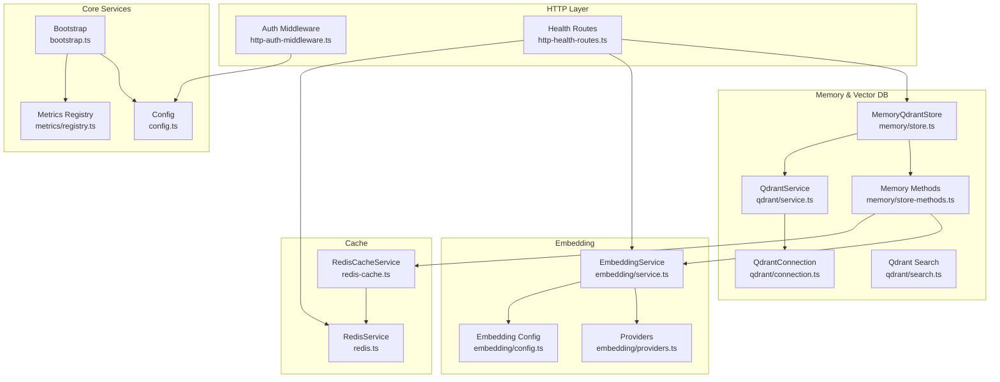
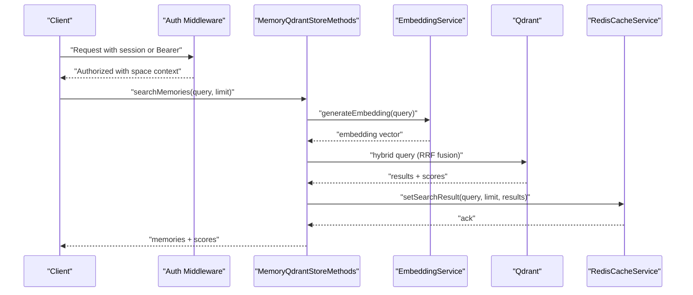
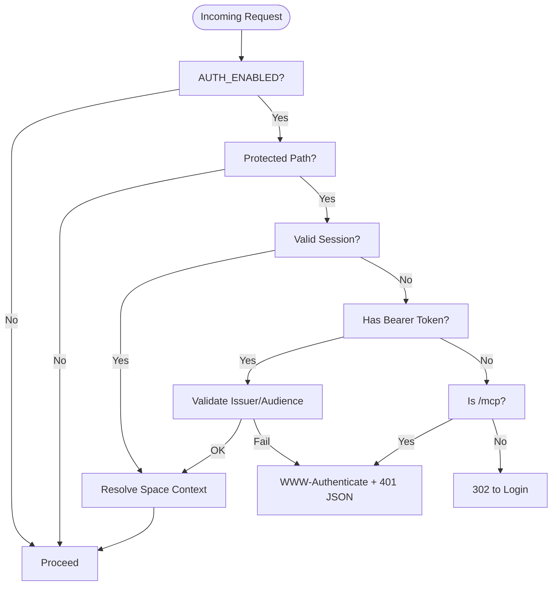
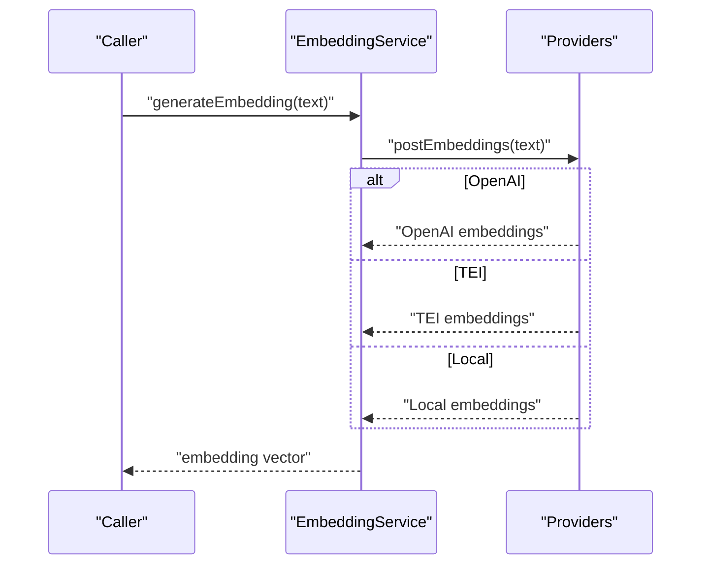
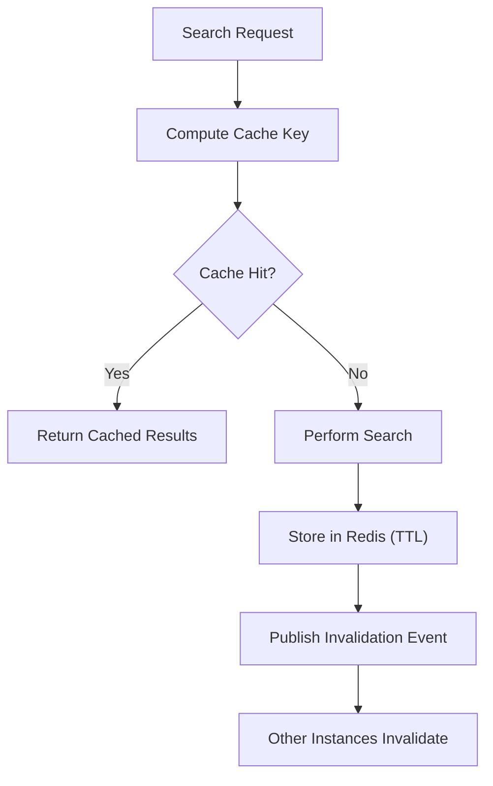
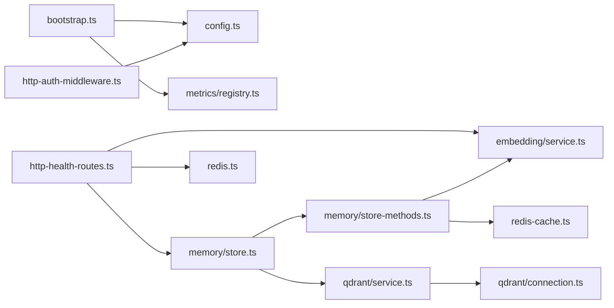
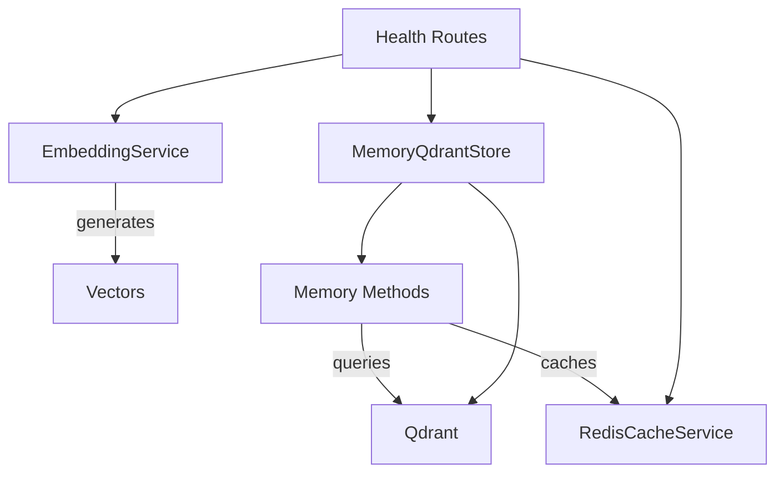

# Core Services

<cite>
**Referenced Files in This Document**
- [src/services/memory/store.ts](file://src/services/memory/store.ts)
- [src/services/memory/store-methods.ts](file://src/services/memory/store-methods.ts)
- [src/services/qdrant/service.ts](file://src/services/qdrant/service.ts)
- [src/services/qdrant/connection.ts](file://src/services/qdrant/connection.ts)
- [src/services/qdrant/search.ts](file://src/services/qdrant/search.ts)
- [src/services/embedding/service.ts](file://src/services/embedding/service.ts)
- [src/services/embedding/providers.ts](file://src/services/embedding/providers.ts)
- [src/services/embedding/config.ts](file://src/services/embedding/config.ts)
- [src/services/redis-cache.ts](file://src/services/redis-cache.ts)
- [src/services/redis.ts](file://src/services/redis.ts)
- [src/http/http-auth-middleware.ts](file://src/http/http-auth-middleware.ts)
- [src/http/http-health-routes.ts](file://src/http/http-health-routes.ts)
- [src/config.ts](file://src/config.ts)
- [src/services/metrics/registry.ts](file://src/services/metrics/registry.ts)
- [src/bootstrap.ts](file://src/bootstrap.ts)
</cite>

## Table of Contents
1. [Introduction](#introduction)
2. [Project Structure](#project-structure)
3. [Core Components](#core-components)
4. [Architecture Overview](#architecture-overview)
5. [Detailed Component Analysis](#detailed-component-analysis)
6. [Dependency Analysis](#dependency-analysis)
7. [Performance Considerations](#performance-considerations)
8. [Troubleshooting Guide](#troubleshooting-guide)
9. [Conclusion](#conclusion)

## Introduction
This document describes the KAIROS MCP core services that power memory management, semantic search, authentication and authorization, embedding generation, and caching. It explains how Qdrant vector storage is initialized and queried, how Keycloak OIDC integrates with group-based access control, how embedding providers (OpenAI, TEI, and local fallback) are selected and used, and how Redis-backed caching accelerates reads and search. It also covers service initialization, configuration options, inter-service dependencies, practical usage patterns, and monitoring and troubleshooting.

## Project Structure
The core services are organized by domain:
- Memory and Qdrant: memory store, hybrid search, and Qdrant connection orchestration
- Embedding: provider selection, health checks, and dimension probing
- Caching: Redis-backed cache for search and memory resources
- Authentication: OIDC middleware enforcing session or Bearer tokens and group-based access
- Metrics: Prometheus registry and labeled metrics
- Health: readiness and service health endpoints



**Diagram sources**
- [src/bootstrap.ts:1-55](file://src/bootstrap.ts#L1-L55)
- [src/config.ts:1-330](file://src/config.ts#L1-L330)
- [src/services/metrics/registry.ts:1-23](file://src/services/metrics/registry.ts#L1-L23)
- [src/http/http-health-routes.ts:1-116](file://src/http/http-health-routes.ts#L1-L116)
- [src/http/http-auth-middleware.ts:1-316](file://src/http/http-auth-middleware.ts#L1-L316)
- [src/services/memory/store.ts:1-152](file://src/services/memory/store.ts#L1-L152)
- [src/services/memory/store-methods.ts:1-298](file://src/services/memory/store-methods.ts#L1-L298)
- [src/services/qdrant/service.ts:1-152](file://src/services/qdrant/service.ts#L1-L152)
- [src/services/qdrant/connection.ts:1-131](file://src/services/qdrant/connection.ts#L1-L131)
- [src/services/qdrant/search.ts:1-82](file://src/services/qdrant/search.ts#L1-L82)
- [src/services/embedding/service.ts:1-293](file://src/services/embedding/service.ts#L1-L293)
- [src/services/embedding/providers.ts:1-280](file://src/services/embedding/providers.ts#L1-L280)
- [src/services/embedding/config.ts:1-40](file://src/services/embedding/config.ts#L1-L40)
- [src/services/redis-cache.ts:1-243](file://src/services/redis-cache.ts#L1-L243)
- [src/services/redis.ts:1-273](file://src/services/redis.ts#L1-L273)

**Section sources**
- [src/bootstrap.ts:1-55](file://src/bootstrap.ts#L1-L55)
- [src/config.ts:1-330](file://src/config.ts#L1-L330)
- [src/http/http-health-routes.ts:1-116](file://src/http/http-health-routes.ts#L1-L116)
- [src/http/http-auth-middleware.ts:1-316](file://src/http/http-auth-middleware.ts#L1-L316)

## Core Components
- Memory and Qdrant
  - MemoryQdrantStore: initializes Qdrant client, resolves collection alias, exposes store and search APIs, and health checks
  - MemoryQdrantStoreMethods: performs hybrid vector/BM25 search, retrieves memories, and builds adapters
  - QdrantService and QdrantConnection: encapsulate client lifecycle, TLS, health checks, and resilient execution with reconnect
  - Qdrant search utilities: vector search wrapper with tenant-aware filters and metrics
- Embedding
  - EmbeddingService: selects provider (OpenAI, TEI, or local), generates embeddings, validates dimension, tracks metrics, and health checks
  - Providers: OpenAI and TEI embedding endpoints with retries and robust error handling
  - Embedding config: resolves and caches embedding dimension
- Cache
  - RedisCacheService: search result caching, memory resource caching, invalidation channels, and stats
  - RedisService: generic key-value store with JSON helpers, pub/sub, and namespacing
- Authentication and Authorization
  - OIDC middleware: enforces session or Bearer tokens, merges groups, applies allowlist filtering, and scopes requests by spaces
- Metrics
  - Prometheus registry with default labels and tenant-scoped metrics for embedding, Qdrant, and HTTP

**Section sources**
- [src/services/memory/store.ts:1-152](file://src/services/memory/store.ts#L1-L152)
- [src/services/memory/store-methods.ts:1-298](file://src/services/memory/store-methods.ts#L1-L298)
- [src/services/qdrant/service.ts:1-152](file://src/services/qdrant/service.ts#L1-L152)
- [src/services/qdrant/connection.ts:1-131](file://src/services/qdrant/connection.ts#L1-L131)
- [src/services/qdrant/search.ts:1-82](file://src/services/qdrant/search.ts#L1-L82)
- [src/services/embedding/service.ts:1-293](file://src/services/embedding/service.ts#L1-L293)
- [src/services/embedding/providers.ts:1-280](file://src/services/embedding/providers.ts#L1-L280)
- [src/services/embedding/config.ts:1-40](file://src/services/embedding/config.ts#L1-L40)
- [src/services/redis-cache.ts:1-243](file://src/services/redis-cache.ts#L1-L243)
- [src/services/redis.ts:1-273](file://src/services/redis.ts#L1-L273)
- [src/http/http-auth-middleware.ts:1-316](file://src/http/http-auth-middleware.ts#L1-L316)
- [src/services/metrics/registry.ts:1-23](file://src/services/metrics/registry.ts#L1-L23)

## Architecture Overview
The system orchestrates three pillars:
- Vector search pipeline: embedding generation → hybrid Qdrant search → cache and tenant filtering
- OIDC-based authorization: session or Bearer validation, group filtering, and space scoping
- Caching: Redis-backed search and memory caches with invalidation pub/sub



**Diagram sources**
- [src/http/http-auth-middleware.ts:167-316](file://src/http/http-auth-middleware.ts#L167-L316)
- [src/services/memory/store-methods.ts:99-264](file://src/services/memory/store-methods.ts#L99-L264)
- [src/services/embedding/service.ts:47-127](file://src/services/embedding/service.ts#L47-L127)
- [src/services/qdrant/search.ts:11-82](file://src/services/qdrant/search.ts#L11-L82)
- [src/services/redis-cache.ts:54-70](file://src/services/redis-cache.ts#L54-L70)

## Detailed Component Analysis

### Memory Management with Qdrant Vector Storage and Semantic Search
- Initialization and health
  - MemoryQdrantStore constructs a Qdrant client with optional API key, resolves collection alias, and exposes init and health checks
  - QdrantConnection manages TLS, health checks, and resilient execution with exponential backoff and reconnect
- Hybrid search
  - MemoryQdrantStoreMethods builds a vector query using the primary, title, and activation pattern vector names, augments with BM25 and text match boosts, and applies space filters
  - Fallback to dense search if hybrid query fails
- Tenant and space scoping
  - Space filters are built from the current tenant context; reads enforce allowed space IDs
- Caching integration
  - Search results are cached in Redis with TTL and invalidation events; memory resources are cached without TTL

```mermaid
classDiagram
class MemoryQdrantStore {
+init() Promise~void~
+checkHealth(timeoutMs) Promise~boolean~
+storeAdapter(docs,llmModelId,options) Promise~Memory[]~
+storeArtifact(content,options) Promise~Memory[]~
+getMemory(uuid,options?) Promise~Memory|null~
+searchMemories(query,limit,collapse) Promise~Result~
+getQdrantAccess() {client,collection}
}
class MemoryQdrantStoreMethods {
+getMemory(uuid) Promise~Memory|null~
+getMemoryFresh(uuid) Promise~Memory|null~
+searchMemories(query,limit,collapse) Promise~Result~
-vectorSearch(query,limit) Promise~Result~
}
class QdrantConnection {
+executeWithReconnect(op) Promise~T~
+checkHealth() Promise~boolean~
}
class RedisCacheService {
+getSearchResult(query,limit,opts?) Promise~CachedResult|null~
+setSearchResult(query,limit,result,opts?) Promise~void~
+invalidateSearchCache() Promise~void~
+invalidateMemoryCache(uuid) Promise~void~
}
MemoryQdrantStore --> MemoryQdrantStoreMethods : "delegates"
MemoryQdrantStore --> QdrantConnection : "uses"
MemoryQdrantStoreMethods --> RedisCacheService : "caches results"
```

**Diagram sources**
- [src/services/memory/store.ts:20-152](file://src/services/memory/store.ts#L20-L152)
- [src/services/memory/store-methods.ts:25-298](file://src/services/memory/store-methods.ts#L25-L298)
- [src/services/qdrant/connection.ts:11-131](file://src/services/qdrant/connection.ts#L11-L131)
- [src/services/redis-cache.ts:21-243](file://src/services/redis-cache.ts#L21-L243)

**Section sources**
- [src/services/memory/store.ts:1-152](file://src/services/memory/store.ts#L1-L152)
- [src/services/memory/store-methods.ts:1-298](file://src/services/memory/store-methods.ts#L1-L298)
- [src/services/qdrant/connection.ts:1-131](file://src/services/qdrant/connection.ts#L1-L131)
- [src/services/redis-cache.ts:1-243](file://src/services/redis-cache.ts#L1-L243)

### Authentication and Authorization with Keycloak OIDC and Group-Based Access Control
- Modes
  - Session cookie-based for browser flows; Bearer token validation supported when issuer/audience configured
- Group filtering
  - Groups from OIDC tokens are filtered by allowlist; merging with userinfo groups for Bearer clients
- Space scoping
  - Requests can specify a space; middleware validates it against allowed spaces and narrows context
- Redirect and 401 handling
  - GET requests redirect to Keycloak; MCP endpoints return 401 with login_url for discovery



**Diagram sources**
- [src/http/http-auth-middleware.ts:167-316](file://src/http/http-auth-middleware.ts#L167-L316)

**Section sources**
- [src/http/http-auth-middleware.ts:1-316](file://src/http/http-auth-middleware.ts#L1-L316)
- [src/config.ts:113-222](file://src/config.ts#L113-L222)

### Embedding Services: OpenAI, TEI, and Local Provider Support
- Provider selection
  - Explicit preference or auto-detection: OpenAI preferred when both API key and model are set; TEI used otherwise; falls back to local if configured
- Reliability
  - Retries for transient network errors and HTTP 429/502/503/504; audit logs and metrics
- Dimension probing
  - First embedding response determines vector dimension; subsequent calls validate consistency
- Health checks
  - EmbeddingService exposes healthCheck; health route bounds provider checks with a timeout



**Diagram sources**
- [src/services/embedding/service.ts:38-284](file://src/services/embedding/service.ts#L38-L284)
- [src/services/embedding/providers.ts:251-280](file://src/services/embedding/providers.ts#L251-L280)
- [src/services/embedding/config.ts:12-40](file://src/services/embedding/config.ts#L12-L40)

**Section sources**
- [src/services/embedding/service.ts:1-293](file://src/services/embedding/service.ts#L1-L293)
- [src/services/embedding/providers.ts:1-280](file://src/services/embedding/providers.ts#L1-L280)
- [src/services/embedding/config.ts:1-40](file://src/services/embedding/config.ts#L1-L40)
- [src/http/http-health-routes.ts:13-89](file://src/http/http-health-routes.ts#L13-L89)

### Cache Layer with Redis Integration
- Search caching
  - Keys are constructed from query, limit, and collapse mode; TTL set to 5 minutes; cache miss increments misses counter
- Memory resource caching
  - Permanent caching of memory objects by UUID; global prefix avoids space scoping
- Invalidation
  - Pub/Sub channel publishes invalidation events; services invalidate search and begin caches after updates
- RedisService
  - Namespaces keys by space except global memory keys; supports JSON get/set helpers and pub/sub



**Diagram sources**
- [src/services/redis-cache.ts:31-125](file://src/services/redis-cache.ts#L31-L125)
- [src/services/redis.ts:110-117](file://src/services/redis.ts#L110-L117)

**Section sources**
- [src/services/redis-cache.ts:1-243](file://src/services/redis-cache.ts#L1-L243)
- [src/services/redis.ts:1-273](file://src/services/redis.ts#L1-L273)

### Service Initialization, Configuration, and Interdependencies
- Initialization order
  - Bootstrap registers error handlers and starts the server
  - Config centralizes environment parsing and defaults
  - Metrics registry sets default labels
- Interdependencies
  - Memory store depends on Qdrant connection and embedding service
  - Search methods depend on embedding service and Redis cache
  - Health routes depend on memory store, embedding service, and Redis connectivity
  - Auth middleware depends on OIDC configuration and tenant context



**Diagram sources**
- [src/bootstrap.ts:1-55](file://src/bootstrap.ts#L1-L55)
- [src/config.ts:1-330](file://src/config.ts#L1-L330)
- [src/services/metrics/registry.ts:1-23](file://src/services/metrics/registry.ts#L1-L23)
- [src/http/http-health-routes.ts:1-116](file://src/http/http-health-routes.ts#L1-L116)
- [src/services/memory/store.ts:1-152](file://src/services/memory/store.ts#L1-L152)
- [src/services/memory/store-methods.ts:1-298](file://src/services/memory/store-methods.ts#L1-L298)
- [src/services/qdrant/service.ts:1-152](file://src/services/qdrant/service.ts#L1-L152)
- [src/services/qdrant/connection.ts:1-131](file://src/services/qdrant/connection.ts#L1-L131)
- [src/services/embedding/service.ts:1-293](file://src/services/embedding/service.ts#L1-L293)
- [src/services/redis-cache.ts:1-243](file://src/services/redis-cache.ts#L1-L243)
- [src/services/redis.ts:1-273](file://src/services/redis.ts#L1-L273)
- [src/http/http-auth-middleware.ts:1-316](file://src/http/http-auth-middleware.ts#L1-L316)

**Section sources**
- [src/bootstrap.ts:1-55](file://src/bootstrap.ts#L1-L55)
- [src/config.ts:1-330](file://src/config.ts#L1-L330)
- [src/http/http-health-routes.ts:1-116](file://src/http/http-health-routes.ts#L1-L116)

## Dependency Analysis
- Coupling
  - Memory store methods depend on embedding service and Redis cache
  - Qdrant service depends on Qdrant connection for resilience
  - Health routes depend on memory store, embedding service, and Redis connectivity
- Cohesion
  - Each service module encapsulates a single responsibility (e.g., embedding provider selection, cache operations)
- External dependencies
  - Qdrant REST client, Redis client, OpenAI/TEI endpoints, and Prometheus metrics



**Diagram sources**
- [src/services/embedding/service.ts:1-293](file://src/services/embedding/service.ts#L1-L293)
- [src/services/memory/store-methods.ts:1-298](file://src/services/memory/store-methods.ts#L1-L298)
- [src/services/redis-cache.ts:1-243](file://src/services/redis-cache.ts#L1-L243)
- [src/services/memory/store.ts:1-152](file://src/services/memory/store.ts#L1-L152)
- [src/http/http-health-routes.ts:1-116](file://src/http/http-health-routes.ts#L1-L116)

**Section sources**
- [src/services/memory/store-methods.ts:1-298](file://src/services/memory/store-methods.ts#L1-L298)
- [src/services/qdrant/search.ts:1-82](file://src/services/qdrant/search.ts#L1-L82)
- [src/http/http-health-routes.ts:1-116](file://src/http/http-health-routes.ts#L1-L116)

## Performance Considerations
- Embedding
  - Dimension probing at startup prevents runtime mismatches; retries reduce transient failures
  - Batch embedding tracks input counts and sizes; vector size observations help capacity planning
- Qdrant
  - Hybrid search uses Reciprocal Rank Fusion with BM25 and dense vectors; quantization rescore improves accuracy
  - Prefetch reduces repeated scans; space filters minimize result sets
- Cache
  - Search results cached with TTL; memory resources cached permanently to reduce Qdrant reads
  - Invalidation via pub/sub ensures consistency across instances
- Metrics
  - Tenant-scoped counters and histograms enable SLI/SLO tracking and alerting

[No sources needed since this section provides general guidance]

## Troubleshooting Guide
- Authentication
  - 401 with login_url indicates missing or invalid session/Bearer; verify AUTH_ENABLED, AUTH_TRUSTED_ISSUERS, AUTH_ALLOWED_AUDIENCES, and session secret
  - Group allowlist filtering may restrict spaces; confirm OIDC_GROUPS_ALLOWLIST configuration
- Qdrant
  - Health check failures: verify QDRANT_URL, API key, and collection alias resolution; check TLS settings and CA certificate path
  - Reconnection attempts: inspect logs for exponential backoff and final failure messages
- Embedding
  - Provider misconfiguration: ensure OPENAI_API_KEY and OPENAI_EMBEDDING_MODEL or TEI_BASE_URL and TEI_MODEL are set appropriately
  - Dimension mismatch: run probeEmbeddingDimension at startup; ensure consistent model and endpoint
- Cache
  - Redis connectivity: confirm REDIS_URL and prefix; check pub/sub channel publishing
  - Cache invalidation: ensure invalidation events are published and consumed by other instances
- Health Endpoint
  - /health aggregates Qdrant, Redis, and embedding provider health; investigate failing dependency and timeouts

**Section sources**
- [src/http/http-auth-middleware.ts:167-316](file://src/http/http-auth-middleware.ts#L167-L316)
- [src/services/qdrant/connection.ts:63-131](file://src/services/qdrant/connection.ts#L63-L131)
- [src/services/embedding/providers.ts:77-175](file://src/services/embedding/providers.ts#L77-L175)
- [src/services/redis.ts:33-108](file://src/services/redis.ts#L33-L108)
- [src/http/http-health-routes.ts:13-89](file://src/http/http-health-routes.ts#L13-L89)

## Conclusion
KAIROS MCP’s core services integrate Qdrant vector storage, OIDC-based authorization, flexible embedding providers, and Redis caching to deliver a robust, scalable memory and search platform. Proper configuration of environment variables, careful attention to provider selection and dimension probing, and resilient Qdrant connections ensure reliable operation. Monitoring via Prometheus and health endpoints, combined with cache invalidation and space scoping, provides observability and consistency across deployments.