# Embedding Processing & Operations

<cite>
**Referenced Files in This Document**
- [service.ts](file://src/services/embedding/service.ts)
- [providers.ts](file://src/services/embedding/providers.ts)
- [config.ts](file://src/services/embedding/config.ts)
- [audit.ts](file://src/services/embedding/audit.ts)
- [health.ts](file://src/services/embedding/health.ts)
- [types.ts](file://src/services/embedding/types.ts)
- [embedding-metrics.ts](file://src/services/metrics/embedding-metrics.ts)
- [config.ts](file://src/config.ts)
- [store-adapter-default-handler.ts](file://src/services/memory/store-adapter-default-handler.ts)
- [store-adapter-header-handler.ts](file://src/services/memory/store-adapter-header-handler.ts)
- [memory-store.ts](file://src/services/qdrant/memory-store.ts)
- [memory-updates.ts](file://src/services/qdrant/memory-updates.ts)
- [bm25-tokenizer.ts](file://src/services/embedding/bm25-tokenizer.ts)
</cite>

## Table of Contents
1. [Introduction](#introduction)
2. [Project Structure](#project-structure)
3. [Core Components](#core-components)
4. [Architecture Overview](#architecture-overview)
5. [Detailed Component Analysis](#detailed-component-analysis)
6. [Dependency Analysis](#dependency-analysis)
7. [Performance Considerations](#performance-considerations)
8. [Troubleshooting Guide](#troubleshooting-guide)
9. [Conclusion](#conclusion)

## Introduction
This document explains the embedding processing pipeline and core service functionality for generating dense vector embeddings. It covers the EmbeddingService class methods for single and batch embedding generation, text normalization and validation, error handling, cosine similarity computation, memory embedding creation, and vector dimension validation. It also documents integration points with Qdrant for storage and retrieval, performance metrics, latency measurement, and embedding quality assurance techniques.

## Project Structure
The embedding subsystem is organized around a central service that orchestrates provider selection, normalization, validation, and telemetry. Supporting modules handle provider-specific HTTP calls, dimension caching, anomaly detection, health checks, and metrics.

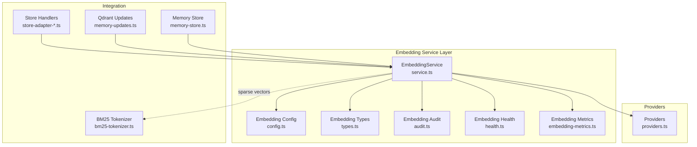

**Diagram sources**
- [service.ts:38-286](file://src/services/embedding/service.ts#L38-L286)
- [providers.ts:251-278](file://src/services/embedding/providers.ts#L251-L278)
- [config.ts:12-36](file://src/services/embedding/config.ts#L12-L36)
- [audit.ts:94-157](file://src/services/embedding/audit.ts#L94-L157)
- [health.ts:16-119](file://src/services/embedding/health.ts#L16-L119)
- [embedding-metrics.ts:11-47](file://src/services/metrics/embedding-metrics.ts#L11-L47)
- [store-adapter-default-handler.ts:108-142](file://src/services/memory/store-adapter-default-handler.ts#L108-L142)
- [store-adapter-header-handler.ts:53-77](file://src/services/memory/store-adapter-header-handler.ts#L53-L77)
- [memory-store.ts:14-25](file://src/services/qdrant/memory-store.ts#L14-L25)
- [memory-updates.ts:51-77](file://src/services/qdrant/memory-updates.ts#L51-L77)
- [bm25-tokenizer.ts:37-52](file://src/services/embedding/bm25-tokenizer.ts#L37-L52)

**Section sources**
- [service.ts:1-293](file://src/services/embedding/service.ts#L1-L293)
- [providers.ts:1-280](file://src/services/embedding/providers.ts#L1-L280)
- [config.ts:1-40](file://src/services/embedding/config.ts#L1-L40)
- [audit.ts:1-197](file://src/services/embedding/audit.ts#L1-L197)
- [health.ts:1-121](file://src/services/embedding/health.ts#L1-L121)
- [embedding-metrics.ts:1-51](file://src/services/metrics/embedding-metrics.ts#L1-L51)

## Core Components
- EmbeddingService: Central orchestration class providing generateEmbedding, generateBatchEmbeddings, calculateCosineSimilarity, generateMemoryEmbedding, healthCheck, provider selection, and configuration inspection.
- Providers: Provider-agnostic embedding calls to OpenAI and TEI, with retry logic and response parsing.
- Config: Embedding dimension caching and resolution, plus endpoint construction.
- Audit: Anomaly detection and audit logging for embedding requests.
- Health: Operational health checks for configured providers.
- Metrics: Prometheus counters and histograms for embedding requests, durations, errors, vector sizes, and batch sizes.

Key responsibilities:
- Text normalization and validation for single and batch inputs.
- Dimension validation against a cached expected dimension.
- Latency measurement and anomaly detection.
- Cosine similarity computation for similarity scoring.
- Memory embedding generation by concatenating content and metadata fields.
- Integration with Qdrant for storing and retrieving embeddings.

**Section sources**
- [service.ts:38-286](file://src/services/embedding/service.ts#L38-L286)
- [providers.ts:251-278](file://src/services/embedding/providers.ts#L251-L278)
- [config.ts:12-36](file://src/services/embedding/config.ts#L12-L36)
- [audit.ts:94-157](file://src/services/embedding/audit.ts#L94-L157)
- [health.ts:16-119](file://src/services/embedding/health.ts#L16-L119)
- [embedding-metrics.ts:11-47](file://src/services/metrics/embedding-metrics.ts#L11-L47)

## Architecture Overview
The embedding pipeline follows a layered design:
- Input normalization and validation occur in the service layer.
- Provider selection and HTTP calls are delegated to providers.
- Responses are parsed, dimension cached, and anomalies detected.
- Metrics and audit logs capture performance and quality signals.
- Qdrant integration stores and retrieves vectors with proper vector naming.

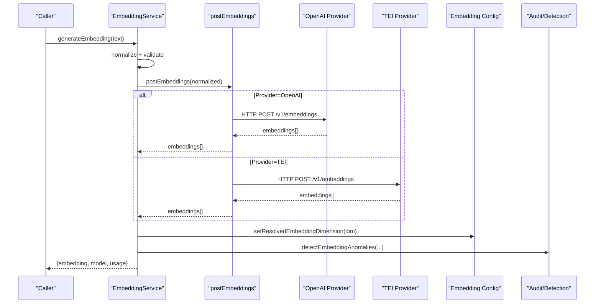

**Diagram sources**
- [service.ts:47-127](file://src/services/embedding/service.ts#L47-L127)
- [providers.ts:251-278](file://src/services/embedding/providers.ts#L251-L278)
- [config.ts:16-31](file://src/services/embedding/config.ts#L16-L31)
- [audit.ts:94-157](file://src/services/embedding/audit.ts#L94-L157)

## Detailed Component Analysis

### EmbeddingService Methods and Workflows
- generateEmbedding(text: string): Normalizes input, validates non-empty, delegates to provider, validates returned embedding shape, detects anomalies, records metrics, and returns embedding result.
- generateBatchEmbeddings(texts: string[]): Filters empty/whitespace inputs, validates non-empty batch, tracks batch size, validates dimensions, detects anomalies, and returns batch result.
- calculateCosineSimilarity(embedding1, embedding2): Computes cosine similarity with dimensionality check.
- generateMemoryEmbedding(memory): Concatenates content and metadata fields into a single text, then generates a single embedding.
- healthCheck(): Runs provider health checks with timeouts and appropriate status messages.
- getProvider()/getConfig(): Determines provider preference and exposes configuration.

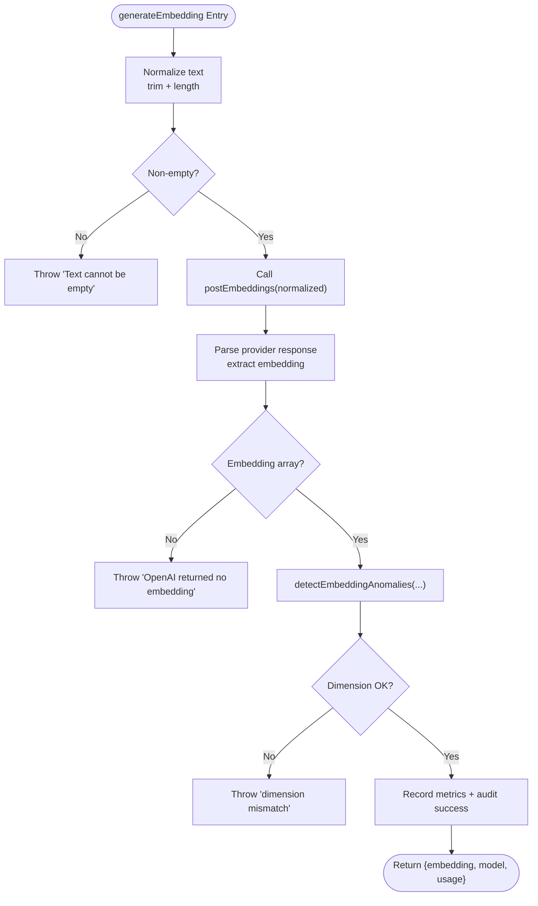

**Diagram sources**
- [service.ts:47-127](file://src/services/embedding/service.ts#L47-L127)
- [audit.ts:94-157](file://src/services/embedding/audit.ts#L94-L157)

**Section sources**
- [service.ts:47-127](file://src/services/embedding/service.ts#L47-L127)
- [service.ts:129-221](file://src/services/embedding/service.ts#L129-L221)
- [service.ts:223-247](file://src/services/embedding/service.ts#L223-L247)
- [service.ts:254-283](file://src/services/embedding/service.ts#L254-L283)

### Text Normalization, Validation, and Error Handling
- Single embedding: Trims input; rejects empty strings; validates returned embedding is an array; throws descriptive errors for malformed responses or authentication failures.
- Batch embedding: Filters out empty/whitespace inputs; validates non-zero valid count; ensures all embeddings match the cached dimension; logs dimension mismatches.
- Provider-level error handling: Retries transient network errors and specific HTTP statuses; parses JSON safely; audits provider calls with status, latency, and dimensions.

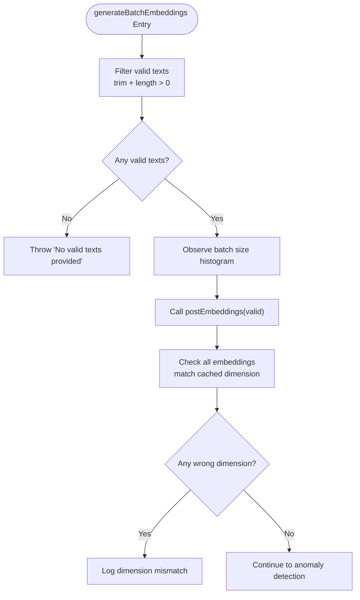

**Diagram sources**
- [service.ts:129-153](file://src/services/embedding/service.ts#L129-L153)
- [providers.ts:31-47](file://src/services/embedding/providers.ts#L31-L47)
- [providers.ts:116-143](file://src/services/embedding/providers.ts#L116-L143)

**Section sources**
- [service.ts:129-153](file://src/services/embedding/service.ts#L129-L153)
- [providers.ts:77-175](file://src/services/embedding/providers.ts#L77-L175)
- [providers.ts:177-249](file://src/services/embedding/providers.ts#L177-L249)

### Cosine Similarity Implementation
- Validates both embeddings are provided and have equal dimensions.
- Computes dot product and magnitudes; returns 0 if magnitude is zero; otherwise returns dot/(||a||*||b||).

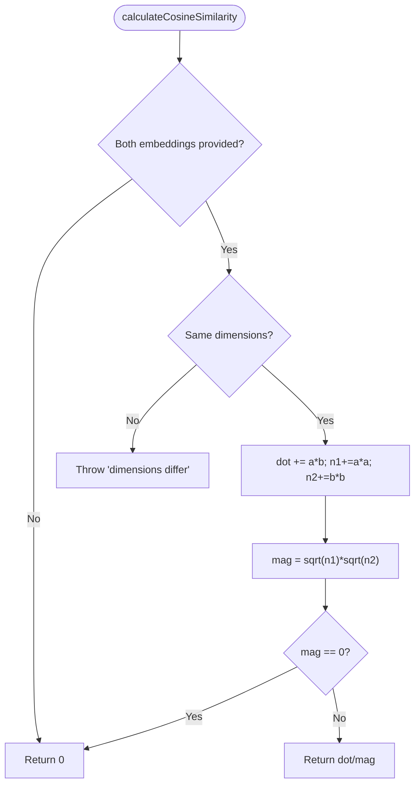

**Diagram sources**
- [service.ts:223-234](file://src/services/embedding/service.ts#L223-L234)

**Section sources**
- [service.ts:223-234](file://src/services/embedding/service.ts#L223-L234)

### Memory Embedding Generation
- Combines content, resource, task, tags, and type into a single normalized string separated by newlines.
- Generates a single embedding from the concatenated text.

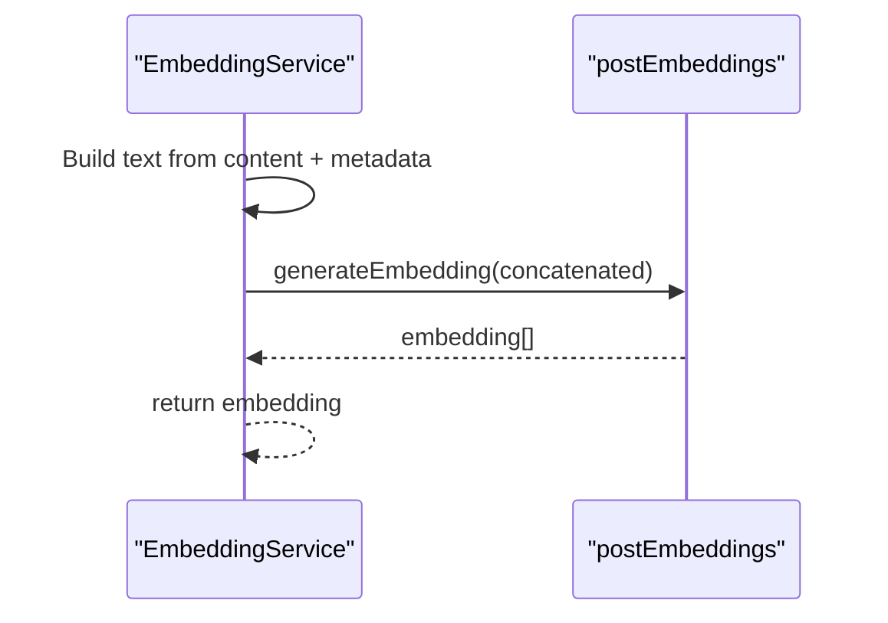

**Diagram sources**
- [service.ts:236-247](file://src/services/embedding/service.ts#L236-L247)

**Section sources**
- [service.ts:236-247](file://src/services/embedding/service.ts#L236-L247)

### Vector Dimension Validation and Caching
- First successful embedding determines the dimension; subsequent calls assert the cached dimension remains constant.
- EmbeddingService validates returned embeddings against the cached dimension and throws on mismatch.
- Health checks probe the provider to resolve dimension early.

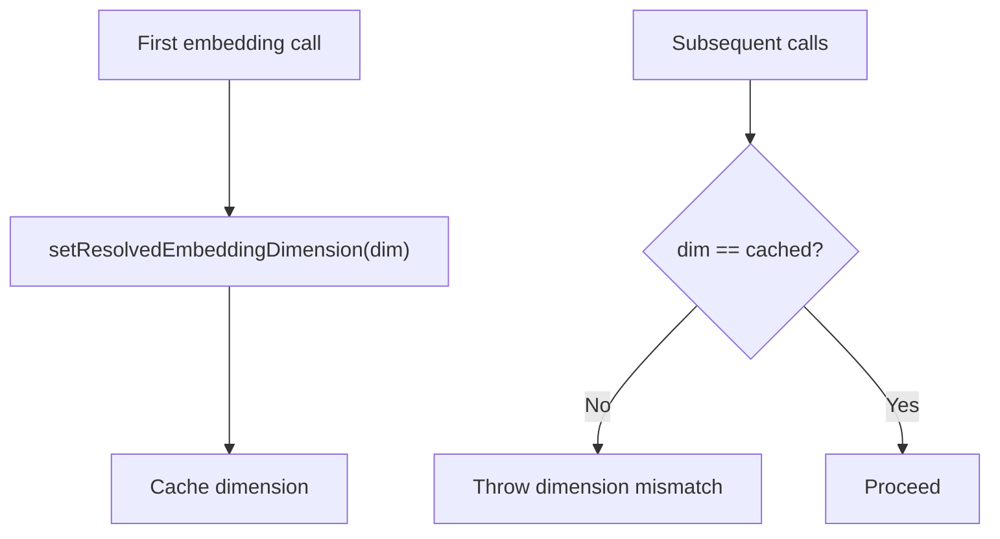

**Diagram sources**
- [config.ts:16-31](file://src/services/embedding/config.ts#L16-L31)
- [service.ts:63-73](file://src/services/embedding/service.ts#L63-L73)
- [service.ts:153-163](file://src/services/embedding/service.ts#L153-L163)

**Section sources**
- [config.ts:12-36](file://src/services/embedding/config.ts#L12-L36)
- [service.ts:39-41](file://src/services/embedding/service.ts#L39-L41)
- [service.ts:148-152](file://src/services/embedding/service.ts#L148-L152)

### Provider Selection and Retry Logic
- Provider preference is controlled by environment variables; auto-detection prefers OpenAI when available, with TEI fallback.
- Retries are applied to transient network errors and specific HTTP statuses; JSON parsing errors are retried when appropriate.

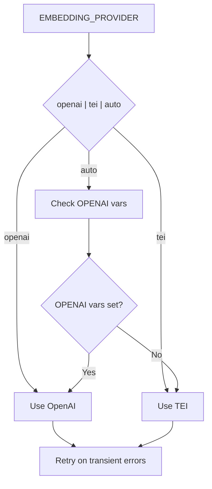

**Diagram sources**
- [providers.ts:251-278](file://src/services/embedding/providers.ts#L251-L278)
- [providers.ts:31-47](file://src/services/embedding/providers.ts#L31-L47)

**Section sources**
- [providers.ts:251-278](file://src/services/embedding/providers.ts#L251-L278)
- [providers.ts:31-47](file://src/services/embedding/providers.ts#L31-L47)

### Integration with Qdrant and Memory Storage
- Batch embedding generation is used to produce primary, title, and activation pattern vectors for adapter memories.
- Individual text updates trigger embedding generation and vector upsert with proper vector naming.
- Memory store upserts points with vector fields named by dimension.

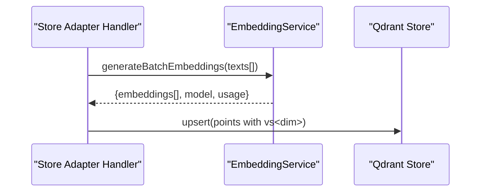

**Diagram sources**
- [store-adapter-default-handler.ts:108-142](file://src/services/memory/store-adapter-default-handler.ts#L108-L142)
- [store-adapter-header-handler.ts:53-77](file://src/services/memory/store-adapter-header-handler.ts#L53-L77)
- [memory-store.ts:57-97](file://src/services/qdrant/memory-store.ts#L57-L97)

**Section sources**
- [store-adapter-default-handler.ts:108-142](file://src/services/memory/store-adapter-default-handler.ts#L108-L142)
- [store-adapter-header-handler.ts:53-77](file://src/services/memory/store-adapter-header-handler.ts#L53-L77)
- [memory-store.ts:57-97](file://src/services/qdrant/memory-store.ts#L57-L97)
- [memory-updates.ts:51-77](file://src/services/qdrant/memory-updates.ts#L51-L77)

### Sparse Vector Tokenization (BM25-style)
- Tokenizes text into sparse vectors using FNV-1a hashing modulo 30000 and sublinear term frequency values.
- Useful for BM25-like retrieval alongside dense embeddings.

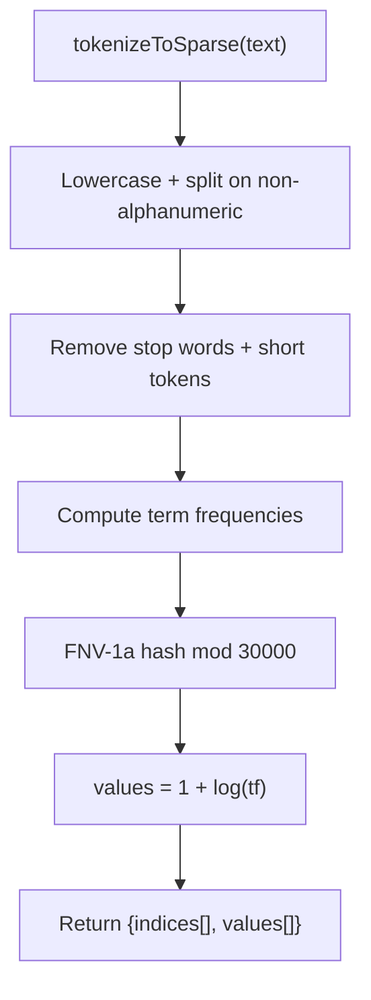

**Diagram sources**
- [bm25-tokenizer.ts:37-52](file://src/services/embedding/bm25-tokenizer.ts#L37-L52)

**Section sources**
- [bm25-tokenizer.ts:1-57](file://src/services/embedding/bm25-tokenizer.ts#L1-L57)

## Dependency Analysis
- EmbeddingService depends on providers for HTTP calls, config for dimension caching, audit for anomaly detection, and metrics for observability.
- Memory store handlers depend on EmbeddingService for batch embeddings and on Qdrant for persistence.
- Health checks depend on providers and config to validate operational status.

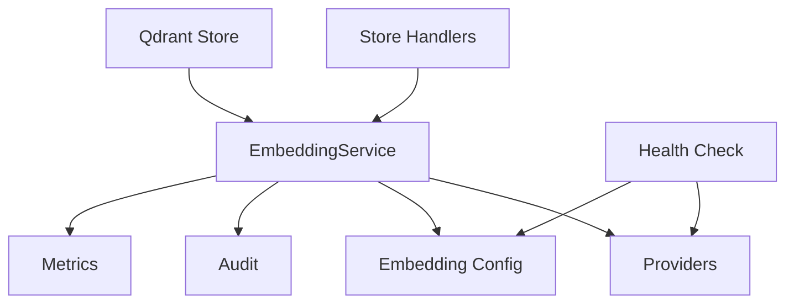

**Diagram sources**
- [service.ts:15-36](file://src/services/embedding/service.ts#L15-L36)
- [providers.ts:1-6](file://src/services/embedding/providers.ts#L1-L6)
- [config.ts:1-6](file://src/services/embedding/config.ts#L1-L6)
- [embedding-metrics.ts:1-6](file://src/services/metrics/embedding-metrics.ts#L1-L6)
- [store-adapter-default-handler.ts:108-142](file://src/services/memory/store-adapter-default-handler.ts#L108-L142)
- [memory-store.ts:1-11](file://src/services/qdrant/memory-store.ts#L1-L11)
- [health.ts:16-119](file://src/services/embedding/health.ts#L16-L119)

**Section sources**
- [service.ts:15-36](file://src/services/embedding/service.ts#L15-L36)
- [providers.ts:1-6](file://src/services/embedding/providers.ts#L1-L6)
- [config.ts:1-6](file://src/services/embedding/config.ts#L1-L6)
- [embedding-metrics.ts:1-6](file://src/services/metrics/embedding-metrics.ts#L1-L6)
- [store-adapter-default-handler.ts:108-142](file://src/services/memory/store-adapter-default-handler.ts#L108-L142)
- [memory-store.ts:1-11](file://src/services/qdrant/memory-store.ts#L1-L11)
- [health.ts:16-119](file://src/services/embedding/health.ts#L16-L119)

## Performance Considerations
- Latency measurement: Each embedding call measures elapsed time and records a histogram with provider and tenant labels.
- Batch optimization: Batch embeddings reduce overhead; batch size is tracked to identify throughput patterns.
- Vector size tracking: Records vector size in bytes for each embedding to monitor memory footprint.
- Retry strategy: Controlled retries for transient network errors and specific HTTP statuses minimize failures.
- Health checks: Bound health checks prevent slow provider probes from blocking system readiness.

Recommendations:
- Prefer batch embeddings for bulk operations to reduce per-request overhead.
- Monitor embedding_duration_seconds and embedding_batch_size histograms to identify saturation points.
- Tune EMBEDDING_LATENCY_WARN_MS and EMBEDDING_NORM_MIN/MAX thresholds to balance anomaly detection sensitivity.
- Ensure probeEmbeddingDimension runs at startup to avoid runtime dimension mismatches.

**Section sources**
- [embedding-metrics.ts:11-47](file://src/services/metrics/embedding-metrics.ts#L11-L47)
- [service.ts:52-56](file://src/services/embedding/service.ts#L52-L56)
- [service.ts:134-146](file://src/services/embedding/service.ts#L134-L146)
- [providers.ts:31-47](file://src/services/embedding/providers.ts#L31-L47)
- [health.ts:23-44](file://src/services/embedding/health.ts#L23-L44)

## Troubleshooting Guide
Common issues and resolutions:
- Authentication failures: Verify OPENAI_API_KEY or TEI API key configuration; provider health checks distinguish 401 scenarios.
- Rate limiting: Provider health checks detect 429 responses; consider backoff or switching providers.
- Non-JSON responses: Provider code retries on specific transient HTTP statuses and logs parse failures.
- Dimension mismatches: Ensure probeEmbeddingDimension is called at startup; EmbeddingService validates returned embeddings against cached dimension.
- Empty or whitespace inputs: Both single and batch methods filter invalid inputs; ensure meaningful content is provided.

Operational checks:
- Use EmbeddingService.healthCheck() to validate provider availability and configuration.
- Review audit logs for embedding_high_latency, embedding_unusual_norm, and embedding_dimension_mismatch anomalies.
- Confirm vector naming in Qdrant uses the correct dimension key (e.g., vs<dim>) to avoid retrieval issues.

**Section sources**
- [health.ts:16-119](file://src/services/embedding/health.ts#L16-L119)
- [providers.ts:116-143](file://src/services/embedding/providers.ts#L116-L143)
- [audit.ts:94-157](file://src/services/embedding/audit.ts#L94-L157)
- [config.ts:16-31](file://src/services/embedding/config.ts#L16-L31)
- [memory-store.ts:57-97](file://src/services/qdrant/memory-store.ts#L57-L97)

## Conclusion
The embedding subsystem provides a robust, observable, and resilient pipeline for generating dense embeddings. It normalizes inputs, validates dimensions, detects anomalies, and integrates seamlessly with Qdrant for memory storage and retrieval. By leveraging batch processing, bounded health checks, and comprehensive metrics, the system supports high-throughput, low-latency operations while maintaining quality and reliability.