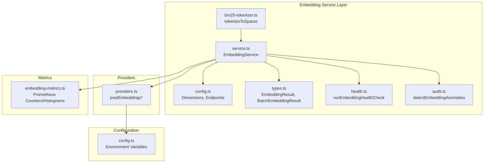
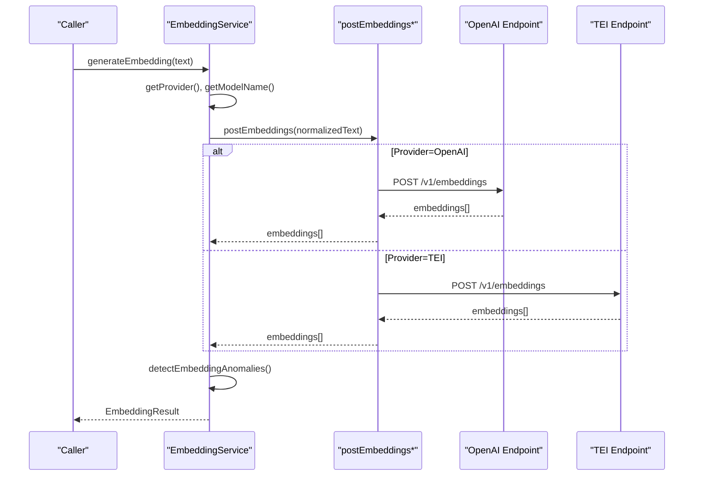
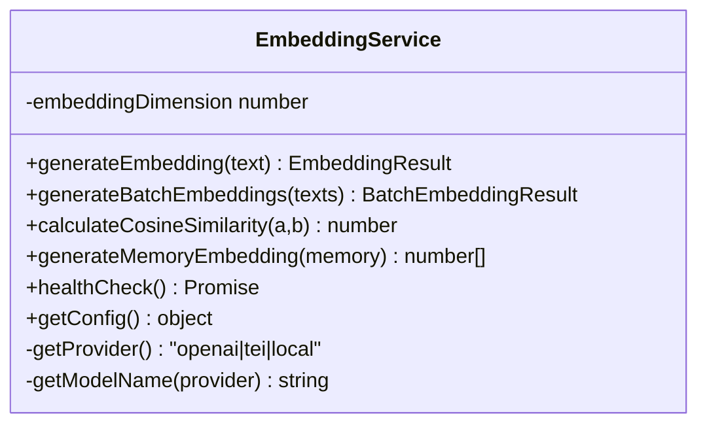
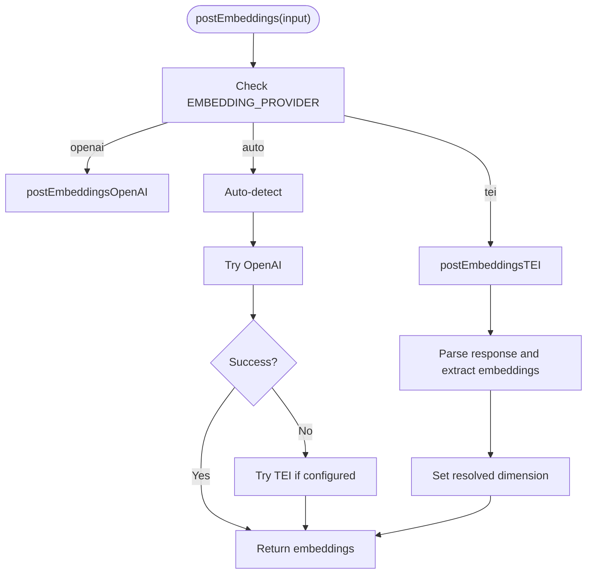
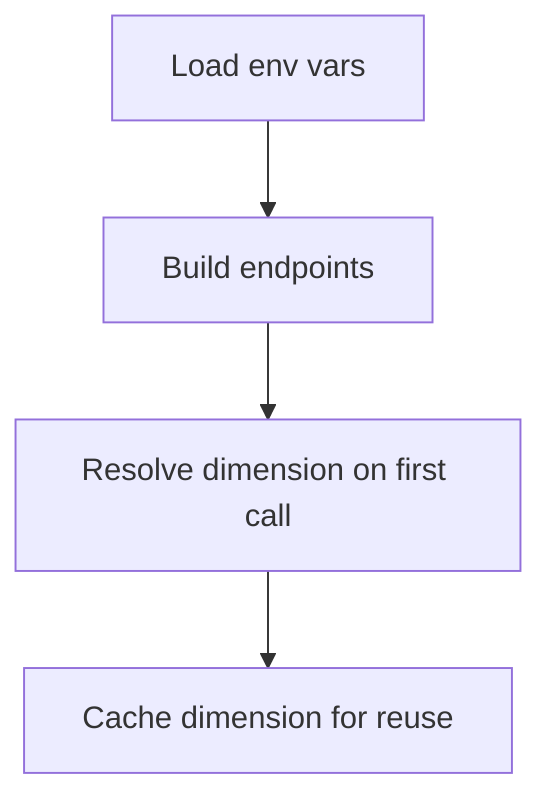
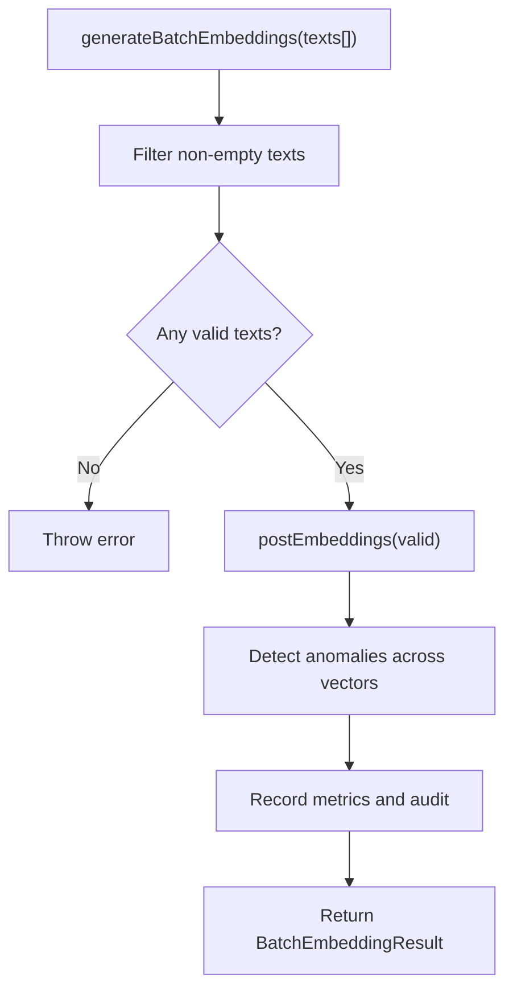
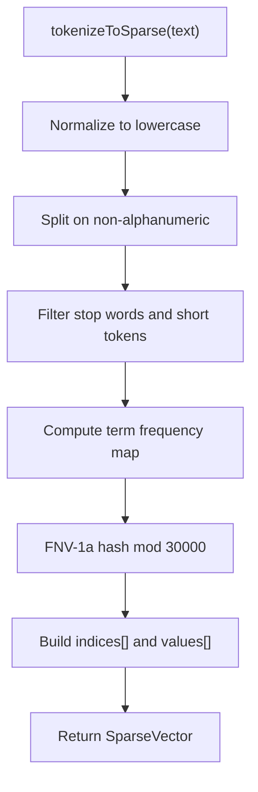
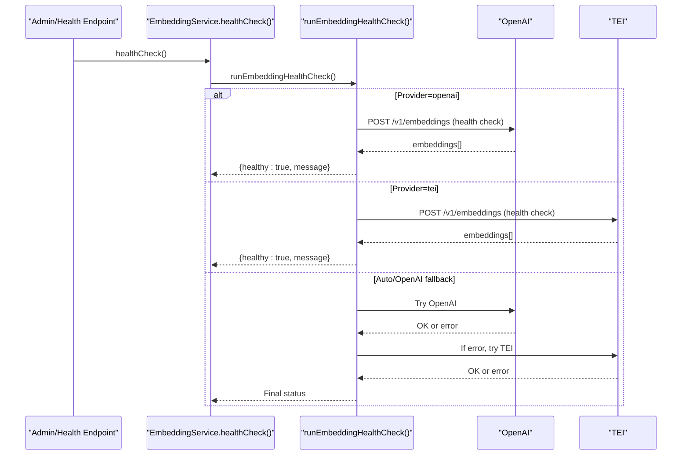
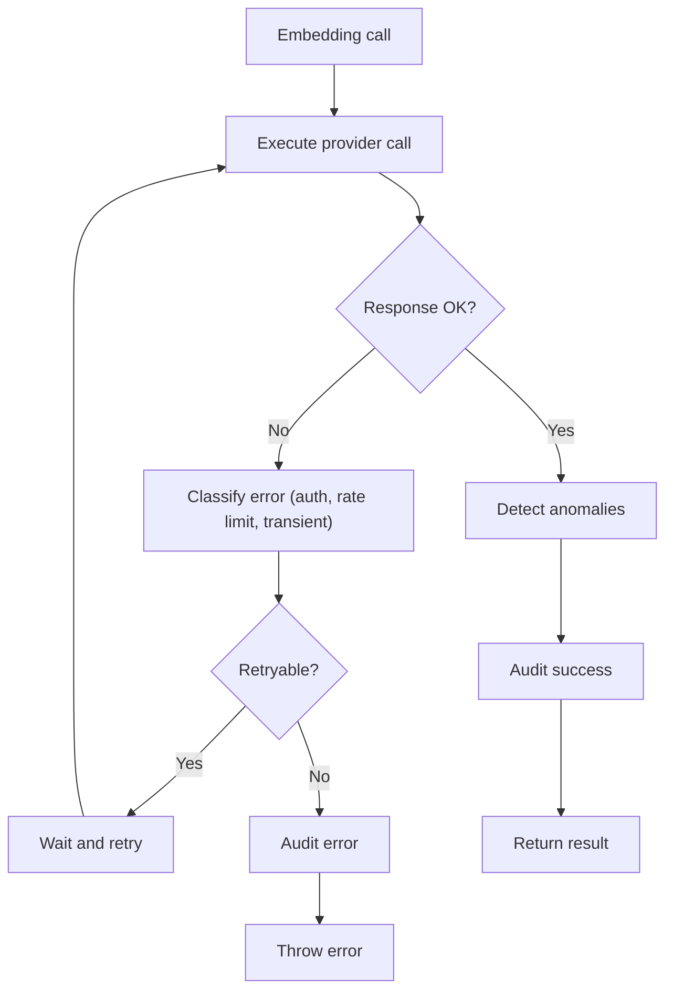
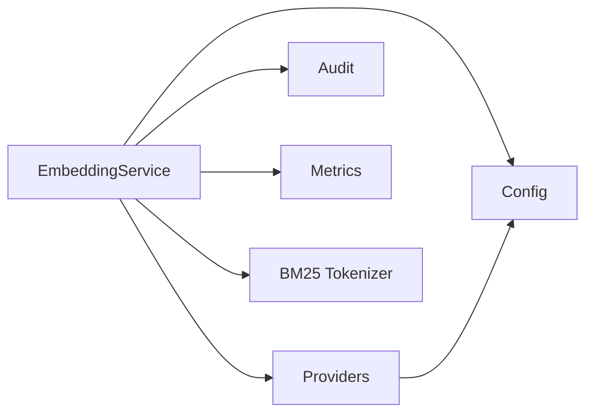

# Embedding Services

<cite>
**Referenced Files in This Document**
- [service.ts](file://src/services/embedding/service.ts)
- [providers.ts](file://src/services/embedding/providers.ts)
- [config.ts](file://src/services/embedding/config.ts)
- [types.ts](file://src/services/embedding/types.ts)
- [bm25-tokenizer.ts](file://src/services/embedding/bm25-tokenizer.ts)
- [health.ts](file://src/services/embedding/health.ts)
- [audit.ts](file://src/services/embedding/audit.ts)
- [config.ts](file://src/config.ts)
- [embedding-metrics.ts](file://src/services/metrics/embedding-metrics.ts)
</cite>

## Table of Contents
1. [Introduction](#introduction)
2. [Project Structure](#project-structure)
3. [Core Components](#core-components)
4. [Architecture Overview](#architecture-overview)
5. [Detailed Component Analysis](#detailed-component-analysis)
6. [Dependency Analysis](#dependency-analysis)
7. [Performance Considerations](#performance-considerations)
8. [Troubleshooting Guide](#troubleshooting-guide)
9. [Conclusion](#conclusion)
10. [Appendices](#appendices)

## Introduction
This document describes the KAIROS MCP embedding services, focusing on the embedding provider architecture that supports multiple backends (OpenAI, TEI), configuration and model selection, batch processing, BM25 tokenizer for sparse vectors, and hybrid search readiness. It also covers service initialization, health monitoring, error handling, embedding quality assessment, provider fallback strategies, and practical configuration examples.

## Project Structure
The embedding subsystem resides under src/services/embedding and integrates with configuration, metrics, and audit/logging utilities.

**Diagram sources**
- [service.ts:38-286](file://src/services/embedding/service.ts#L38-L286)
- [providers.ts:251-278](file://src/services/embedding/providers.ts#L251-L278)
- [config.ts:1-40](file://src/services/embedding/config.ts#L1-L40)
- [types.ts:1-17](file://src/services/embedding/types.ts#L1-L17)
- [health.ts:16-119](file://src/services/embedding/health.ts#L16-L119)
- [audit.ts:94-157](file://src/services/embedding/audit.ts#L94-L157)
- [bm25-tokenizer.ts:37-56](file://src/services/embedding/bm25-tokenizer.ts#L37-L56)
- [config.ts:67-74](file://src/config.ts#L67-L74)
- [embedding-metrics.ts:11-47](file://src/services/metrics/embedding-metrics.ts#L11-L47)

**Section sources**
- [service.ts:1-293](file://src/services/embedding/service.ts#L1-L293)
- [providers.ts:1-280](file://src/services/embedding/providers.ts#L1-L280)
- [config.ts:1-40](file://src/services/embedding/config.ts#L1-L40)
- [types.ts:1-17](file://src/services/embedding/types.ts#L1-L17)
- [bm25-tokenizer.ts:1-57](file://src/services/embedding/bm25-tokenizer.ts#L1-L57)
- [health.ts:1-121](file://src/services/embedding/health.ts#L1-L121)
- [audit.ts:1-197](file://src/services/embedding/audit.ts#L1-L197)
- [config.ts:67-74](file://src/config.ts#L67-L74)
- [embedding-metrics.ts:1-51](file://src/services/metrics/embedding-metrics.ts#L1-L51)

## Core Components
- EmbeddingService: Orchestrates single and batch embedding generation, provider selection, dimension probing, cosine similarity computation, memory embedding composition, health checks, and configuration reporting.
- Providers: Encapsulate OpenAI and TEI embedding endpoints, request retries, error classification, and response normalization.
- Config: Resolves endpoints, caches embedding dimension, and validates runtime expectations.
- Types: Defines standardized result structures for single and batch embeddings.
- BM25 Tokenizer: Produces sparse vectors for BM25-style retrieval compatible with Qdrant sparse vectors.
- Health: Performs runtime health checks for configured providers.
- Audit: Detects anomalies (latency, norm, dimension mismatch) and logs structured audit events.
- Metrics: Exposes counters and histograms for embedding requests, durations, errors, vector sizes, and batch sizes.

**Section sources**
- [service.ts:38-286](file://src/services/embedding/service.ts#L38-L286)
- [providers.ts:77-278](file://src/services/embedding/providers.ts#L77-L278)
- [config.ts:12-36](file://src/services/embedding/config.ts#L12-L36)
- [types.ts:1-17](file://src/services/embedding/types.ts#L1-L17)
- [bm25-tokenizer.ts:27-56](file://src/services/embedding/bm25-tokenizer.ts#L27-L56)
- [health.ts:16-119](file://src/services/embedding/health.ts#L16-L119)
- [audit.ts:94-157](file://src/services/embedding/audit.ts#L94-L157)
- [embedding-metrics.ts:11-47](file://src/services/metrics/embedding-metrics.ts#L11-L47)

## Architecture Overview
The embedding service selects a provider based on configuration and availability, normalizes responses, validates dimensions, and emits metrics and audit logs. Batch processing aggregates statistics and applies anomaly detection.

**Diagram sources**
- [service.ts:47-127](file://src/services/embedding/service.ts#L47-L127)
- [providers.ts:251-278](file://src/services/embedding/providers.ts#L251-L278)
- [config.ts:5-10](file://src/services/embedding/config.ts#L5-L10)

**Section sources**
- [service.ts:47-127](file://src/services/embedding/service.ts#L47-L127)
- [providers.ts:251-278](file://src/services/embedding/providers.ts#L251-L278)

## Detailed Component Analysis

### EmbeddingService
- Responsibilities:
  - Single and batch embedding generation with input validation and trimming.
  - Provider selection via explicit preference or auto-detection.
  - Dimension probing and caching to ensure consistent vector sizes.
  - Cosine similarity calculation and memory embedding composition.
  - Health checks and configuration introspection.
- Notable behaviors:
  - Throws on empty inputs and malformed responses.
  - Enforces dimension consistency across calls.
  - Emits metrics and audit logs for success and error paths.
  - Provides a probe function to resolve dimension at startup.

**Diagram sources**
- [service.ts:38-286](file://src/services/embedding/service.ts#L38-L286)

**Section sources**
- [service.ts:38-286](file://src/services/embedding/service.ts#L38-L286)

### Providers
- Responsibilities:
  - Implement OpenAI and TEI embedding endpoints.
  - Normalize diverse response shapes into a consistent embeddings array.
  - Apply retry logic for transient network errors and specific HTTP statuses.
  - Audit provider calls with structured logs and metrics.
- Notable behaviors:
  - OpenAI: Validates JSON parsing and response shape; handles 401, 429, 502–504 gracefully with retries.
  - TEI: Attempts multiple response layouts; supports optional API key header.
  - Auto-detection: Prefers OpenAI when both are configured, falls back to TEI if configured.

**Diagram sources**
- [providers.ts:251-278](file://src/services/embedding/providers.ts#L251-L278)
- [providers.ts:77-175](file://src/services/embedding/providers.ts#L77-L175)
- [providers.ts:177-249](file://src/services/embedding/providers.ts#L177-L249)

**Section sources**
- [providers.ts:77-278](file://src/services/embedding/providers.ts#L77-L278)

### Configuration and Model Selection
- Environment variables:
  - OPENAI_API_KEY, OPENAI_EMBEDDING_MODEL, OPENAI_API_URL
  - EMBEDDING_PROVIDER: auto | openai | tei
  - TEI_BASE_URL, TEI_MODEL, TEI_API_KEY
- Endpoint construction:
  - OpenAI: OPENAI_API_URL/v1/embeddings
  - TEI: TEI_BASE_URL/v1/embeddings (trailing slash normalized)
- Dimension resolution:
  - First successful embedding sets the resolved dimension; subsequent calls assert consistency.

**Diagram sources**
- [config.ts:67-74](file://src/config.ts#L67-L74)
- [config.ts:5-10](file://src/services/embedding/config.ts#L5-L10)
- [config.ts:12-36](file://src/services/embedding/config.ts#L12-L36)

**Section sources**
- [config.ts:67-74](file://src/config.ts#L67-L74)
- [config.ts:5-10](file://src/services/embedding/config.ts#L5-L10)
- [config.ts:12-36](file://src/services/embedding/config.ts#L12-L36)

### Batch Processing
- Validates inputs, trims empty strings, and computes aggregate statistics.
- Observes batch size distribution and per-vector sizes.
- Applies anomaly detection for dimension mismatches across the batch.

**Diagram sources**
- [service.ts:129-221](file://src/services/embedding/service.ts#L129-L221)
- [embedding-metrics.ts:41-47](file://src/services/metrics/embedding-metrics.ts#L41-L47)

**Section sources**
- [service.ts:129-221](file://src/services/embedding/service.ts#L129-L221)
- [embedding-metrics.ts:41-47](file://src/services/metrics/embedding-metrics.ts#L41-L47)

### BM25 Tokenizer and Hybrid Search
- Tokenizer:
  - Lowercases, splits on non-alphanumeric, removes stop words and short tokens.
  - Hashes tokens with FNV-1a modulo 30000 to produce sparse indices.
  - Computes sublinear term frequencies as 1 + log(tf) for values.
- Output:
  - Returns { indices[], values[] } suitable for Qdrant sparse vector search.
- Hybrid search:
  - The tokenizer enables BM25-style sparse vectors; hybrid search with dense embeddings and sparse text is supported conceptually and aligns with Qdrant’s universal query capabilities.

**Diagram sources**
- [bm25-tokenizer.ts:37-56](file://src/services/embedding/bm25-tokenizer.ts#L37-L56)

**Section sources**
- [bm25-tokenizer.ts:1-57](file://src/services/embedding/bm25-tokenizer.ts#L1-L57)

### Health Monitoring
- Determines provider configuration and attempts health checks against the selected provider(s).
- Distinguishes between authentication failures, throttling (429), and other errors.
- Auto mode tries OpenAI first, then falls back to TEI if configured.

**Diagram sources**
- [service.ts:254-256](file://src/services/embedding/service.ts#L254-L256)
- [health.ts:16-119](file://src/services/embedding/health.ts#L16-L119)

**Section sources**
- [service.ts:254-256](file://src/services/embedding/service.ts#L254-L256)
- [health.ts:16-119](file://src/services/embedding/health.ts#L16-L119)

### Error Handling and Audit
- Anomaly detection:
  - Latency exceeding threshold.
  - Vector norm outside configured bounds.
  - Dimension mismatch between expected and actual.
- Structured audit logs:
  - Success and error payloads include provider, model, input counts, character lengths, output dimensions, and latency.
- Retries:
  - Network-level transient errors and specific HTTP statuses (429, 502–504 for OpenAI) are retried with exponential backoff-like delays.

**Diagram sources**
- [providers.ts:31-47](file://src/services/embedding/providers.ts#L31-L47)
- [audit.ts:94-157](file://src/services/embedding/audit.ts#L94-L157)
- [audit.ts:60-92](file://src/services/embedding/audit.ts#L60-L92)

**Section sources**
- [providers.ts:31-47](file://src/services/embedding/providers.ts#L31-L47)
- [audit.ts:94-157](file://src/services/embedding/audit.ts#L94-L157)
- [audit.ts:60-92](file://src/services/embedding/audit.ts#L60-L92)

## Dependency Analysis
- EmbeddingService depends on:
  - Providers for external API calls.
  - Config for endpoints and dimension resolution.
  - Audit for anomaly detection and structured logging.
  - Metrics for observability.
- Providers depend on:
  - Environment configuration for endpoints and credentials.
  - Tenant/request context for audit labeling.
- BM25 tokenizer is independent and intended for downstream sparse vector usage.

**Diagram sources**
- [service.ts:15-33](file://src/services/embedding/service.ts#L15-L33)
- [providers.ts:2-6](file://src/services/embedding/providers.ts#L2-L6)
- [config.ts:1-6](file://src/services/embedding/config.ts#L1-L6)
- [audit.ts:1-8](file://src/services/embedding/audit.ts#L1-L8)
- [embedding-metrics.ts:1-3](file://src/services/metrics/embedding-metrics.ts#L1-L3)

**Section sources**
- [service.ts:15-33](file://src/services/embedding/service.ts#L15-L33)
- [providers.ts:2-6](file://src/services/embedding/providers.ts#L2-L6)
- [config.ts:1-6](file://src/services/embedding/config.ts#L1-L6)
- [audit.ts:1-8](file://src/services/embedding/audit.ts#L1-L8)
- [embedding-metrics.ts:1-3](file://src/services/metrics/embedding-metrics.ts#L1-L3)

## Performance Considerations
- Dimension probing:
  - Run a minimal embedding at startup to resolve and cache the vector dimension before using dependent systems.
- Batch sizing:
  - Monitor embeddingBatchSize histogram to optimize throughput and cost.
- Vector size tracking:
  - embeddingVectorSize histogram helps assess memory footprint and potential compression strategies.
- Latency thresholds:
  - Tune EMBEDDING_LATENCY_WARN_MS to balance responsiveness and alert fatigue.
- Provider selection:
  - Prefer OpenAI when credentials are available; otherwise rely on TEI. Configure EMBEDDING_PROVIDER to enforce a specific backend for predictable performance.

[No sources needed since this section provides general guidance]

## Troubleshooting Guide
Common issues and resolutions:
- Authentication failures:
  - OpenAI: Verify OPENAI_API_KEY and model permissions; see health check messages for 401.
  - TEI: Confirm TEI_API_KEY if required and endpoint reachability.
- Rate limiting:
  - Both providers may return 429; health checks distinguish throttling vs. unreachability.
- Non-JSON or unexpected response shapes:
  - OpenAI: Parser errors lead to retriable transient handling; inspect audit logs for HTTP status.
  - TEI: Multiple response layouts are normalized; ensure model compatibility.
- Dimension mismatch:
  - If a provider unexpectedly changes vector size, the service throws; re-probe dimension and ensure consistent model configuration.
- Provider fallback:
  - Auto mode tries OpenAI first; if unavailable, falls back to TEI if configured.

Operational steps:
- Run health check to confirm provider availability and error classification.
- Inspect audit logs for embedding requests and anomalies.
- Review Prometheus metrics for embedding requests, durations, errors, and vector sizes.

**Section sources**
- [health.ts:16-119](file://src/services/embedding/health.ts#L16-L119)
- [providers.ts:107-143](file://src/services/embedding/providers.ts#L107-L143)
- [providers.ts:198-216](file://src/services/embedding/providers.ts#L198-L216)
- [audit.ts:139-154](file://src/services/embedding/audit.ts#L139-L154)

## Conclusion
The embedding service provides a robust, configurable, and observable foundation for vector embeddings across OpenAI and TEI. It enforces dimension consistency, supports batch processing, offers health monitoring, and integrates structured auditing and metrics. The BM25 tokenizer enables sparse vector usage for hybrid search scenarios. Proper configuration, dimension probing, and monitoring are essential for reliable performance and quality.

[No sources needed since this section summarizes without analyzing specific files]

## Appendices

### Practical Configuration Examples
- OpenAI only:
  - Set OPENAI_API_KEY, OPENAI_EMBEDDING_MODEL, OPENAI_API_URL.
  - Optionally set EMBEDDING_PROVIDER=openai to enforce.
- TEI only:
  - Set TEI_BASE_URL, TEI_MODEL; optionally TEI_API_KEY.
  - Optionally set EMBEDDING_PROVIDER=tei to enforce.
- Auto mode:
  - Provide both OpenAI and TEI variables; auto mode prefers OpenAI and falls back to TEI if configured.

**Section sources**
- [config.ts:67-74](file://src/config.ts#L67-L74)
- [providers.ts:251-278](file://src/services/embedding/providers.ts#L251-L278)

### Embedding Quality Assessment
- Anomaly detection:
  - Latency threshold crossing.
  - Vector norm outside configured bounds.
  - Dimension mismatch across embeddings.
- Audit logs:
  - Capture provider, model, input/output characteristics, and latency for manual review.
- Metrics:
  - Track request volume, error rates, and vector sizes to identify regressions.

**Section sources**
- [audit.ts:94-157](file://src/services/embedding/audit.ts#L94-L157)
- [embedding-metrics.ts:11-47](file://src/services/metrics/embedding-metrics.ts#L11-L47)

### Model Versioning and Fallback Mechanisms
- Model versioning:
  - Use OPENAI_EMBEDDING_MODEL and TEI_MODEL to pin versions; change these variables to upgrade/downgrade models.
- Fallback:
  - Auto mode prioritizes OpenAI; if unavailable, attempts TEI if configured.
  - Dimension consistency is enforced; mismatch triggers immediate failure to prevent silent degradation.

**Section sources**
- [config.ts:67-74](file://src/config.ts#L67-L74)
- [providers.ts:262-277](file://src/services/embedding/providers.ts#L262-L277)
- [config.ts:16-31](file://src/services/embedding/config.ts#L16-L31)