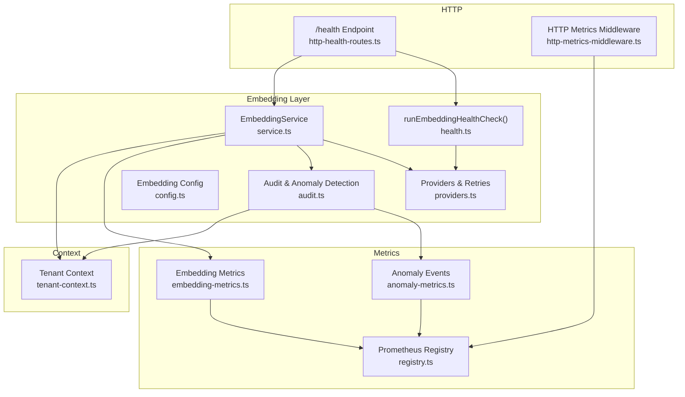
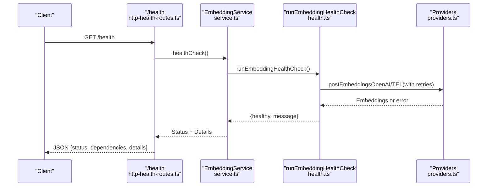
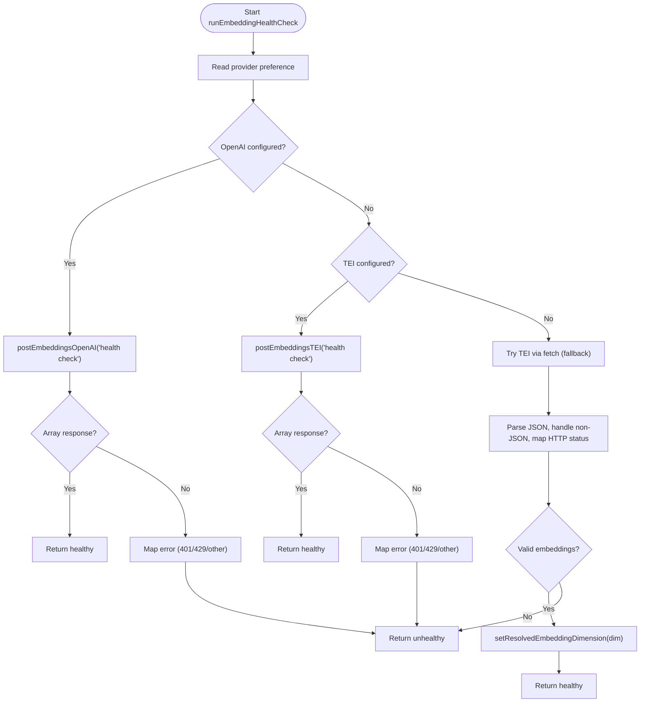
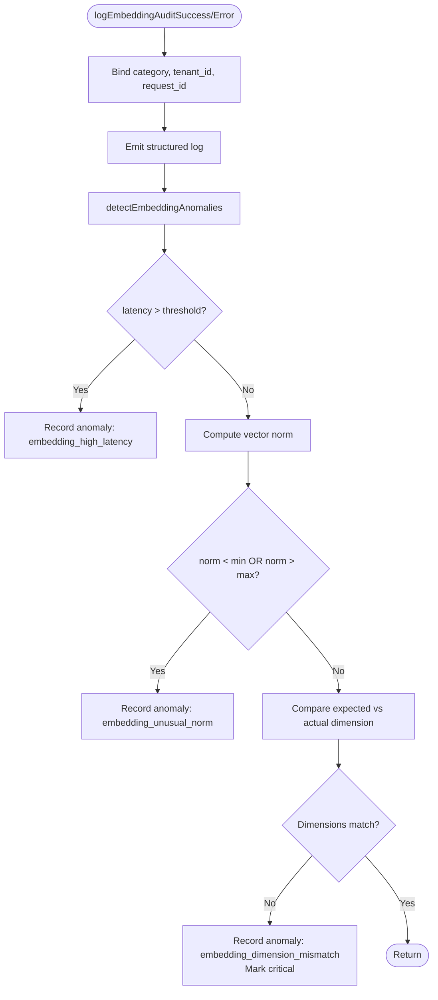
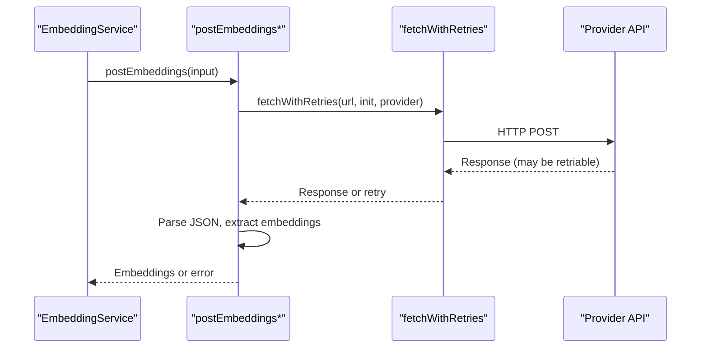
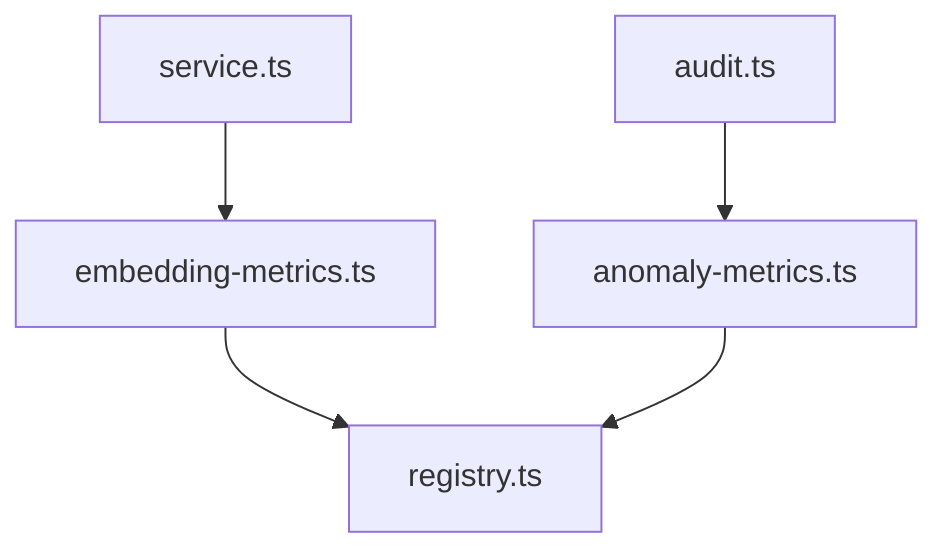
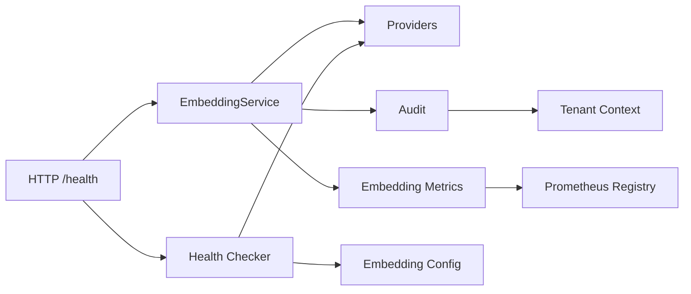

# Health Monitoring & Auditing

<cite>
**Referenced Files in This Document**
- [health.ts](file://src/services/embedding/health.ts)
- [audit.ts](file://src/services/embedding/audit.ts)
- [service.ts](file://src/services/embedding/service.ts)
- [providers.ts](file://src/services/embedding/providers.ts)
- [config.ts](file://src/services/embedding/config.ts)
- [embedding-metrics.ts](file://src/services/metrics/embedding-metrics.ts)
- [anomaly-metrics.ts](file://src/services/metrics/anomaly-metrics.ts)
- [registry.ts](file://src/services/metrics/registry.ts)
- [tenant-context.ts](file://src/utils/tenant-context.ts)
- [http-health-routes.ts](file://src/http/http-health-routes.ts)
- [http-metrics-middleware.ts](file://src/http/http-metrics-middleware.ts)
- [config.ts](file://src/config.ts)
- [README.md](file://README.md)
</cite>

## Table of Contents
1. [Introduction](#introduction)
2. [Project Structure](#project-structure)
3. [Core Components](#core-components)
4. [Architecture Overview](#architecture-overview)
5. [Detailed Component Analysis](#detailed-component-analysis)
6. [Dependency Analysis](#dependency-analysis)
7. [Performance Considerations](#performance-considerations)
8. [Troubleshooting Guide](#troubleshooting-guide)
9. [Conclusion](#conclusion)
10. [Appendices](#appendices)

## Introduction
This document explains the embedding service health monitoring and auditing capabilities implemented in the project. It focuses on:
- The runEmbeddingHealthCheck function that validates provider connectivity and service availability
- The embedding audit system including success and error logging with tenant context, request tracing, and anomaly detection
- Prometheus metrics integration covering embedding requests, duration, errors, vector sizes, and batch sizes
- Practical examples for monitoring embedding service health, setting up alerts for provider failures, and analyzing embedding performance trends
- Embedding anomaly detection algorithms, critical dimension mismatches, and automated recovery mechanisms

## Project Structure
The embedding health and auditing system spans several modules:
- Embedding service orchestration and telemetry
- Provider-specific embedding calls with retry logic
- Audit logging and anomaly detection
- Prometheus metrics exposure and labeling
- Tenant context propagation for multi-tenant observability
- HTTP health endpoints integrating embedding checks



**Diagram sources**
- [service.ts:38-286](file://src/services/embedding/service.ts#L38-L286)
- [health.ts:16-119](file://src/services/embedding/health.ts#L16-L119)
- [audit.ts:60-157](file://src/services/embedding/audit.ts#L60-L157)
- [providers.ts:251-278](file://src/services/embedding/providers.ts#L251-L278)
- [config.ts:12-36](file://src/services/embedding/config.ts#L12-L36)
- [embedding-metrics.ts:11-47](file://src/services/metrics/embedding-metrics.ts#L11-L47)
- [anomaly-metrics.ts:4-11](file://src/services/metrics/anomaly-metrics.ts#L4-L11)
- [registry.ts:11-23](file://src/services/metrics/registry.ts#L11-L23)
- [http-health-routes.ts:13-89](file://src/http/http-health-routes.ts#L13-L89)
- [http-metrics-middleware.ts:15-71](file://src/http/http-metrics-middleware.ts#L15-L71)
- [tenant-context.ts:303-306](file://src/utils/tenant-context.ts#L303-L306)

**Section sources**
- [service.ts:1-293](file://src/services/embedding/service.ts#L1-L293)
- [health.ts:1-121](file://src/services/embedding/health.ts#L1-L121)
- [audit.ts:1-197](file://src/services/embedding/audit.ts#L1-L197)
- [providers.ts:1-280](file://src/services/embedding/providers.ts#L1-L280)
- [embedding-metrics.ts:1-51](file://src/services/metrics/embedding-metrics.ts#L1-L51)
- [anomaly-metrics.ts:1-11](file://src/services/metrics/anomaly-metrics.ts#L1-L11)
- [registry.ts:1-23](file://src/services/metrics/registry.ts#L1-L23)
- [http-health-routes.ts:1-116](file://src/http/http-health-routes.ts#L1-L116)
- [http-metrics-middleware.ts:1-73](file://src/http/http-metrics-middleware.ts#L1-L73)
- [tenant-context.ts:1-307](file://src/utils/tenant-context.ts#L1-L307)

## Core Components
- EmbeddingService orchestrates embedding generation, tracks metrics, performs anomaly detection, and emits audit logs. It selects providers based on configuration and ensures dimension consistency.
- Providers module encapsulates OpenAI and TEI calls with retry logic for transient network and HTTP errors, and extracts embeddings robustly across different server shapes.
- Health checker validates provider connectivity and reports operational status with provider-specific nuances (rate limits, authentication).
- Audit and anomaly detection capture success/error logs with tenant/request context and flag anomalies such as latency thresholds, vector norms, dimension mismatches, and search anomalies.
- Metrics expose embedding requests, durations, errors, vector sizes, and batch sizes via Prometheus with tenant labels and default service labels.

**Section sources**
- [service.ts:38-286](file://src/services/embedding/service.ts#L38-L286)
- [providers.ts:77-278](file://src/services/embedding/providers.ts#L77-L278)
- [health.ts:16-119](file://src/services/embedding/health.ts#L16-L119)
- [audit.ts:60-157](file://src/services/embedding/audit.ts#L60-L157)
- [embedding-metrics.ts:11-47](file://src/services/metrics/embedding-metrics.ts#L11-L47)

## Architecture Overview
The embedding health and auditing architecture integrates provider selection, telemetry, and observability:



**Diagram sources**
- [http-health-routes.ts:13-89](file://src/http/http-health-routes.ts#L13-L89)
- [service.ts:254-256](file://src/services/embedding/service.ts#L254-L256)
- [health.ts:16-119](file://src/services/embedding/health.ts#L16-L119)
- [providers.ts:251-278](file://src/services/embedding/providers.ts#L251-L278)

## Detailed Component Analysis

### runEmbeddingHealthCheck Function
The health checker evaluates embedding provider availability and configuration:
- Validates required environment variables for OpenAI and TEI
- Attempts provider-specific health probes and interprets HTTP status codes (e.g., 401 authentication, 429 throttling)
- Performs a fallback strategy: tries OpenAI first if configured, then falls back to TEI if available
- Extracts and caches the resolved embedding dimension from the first successful TEI response



**Diagram sources**
- [health.ts:16-119](file://src/services/embedding/health.ts#L16-L119)
- [providers.ts:251-278](file://src/services/embedding/providers.ts#L251-L278)
- [config.ts:16-31](file://src/services/embedding/config.ts#L16-L31)

**Section sources**
- [health.ts:16-119](file://src/services/embedding/health.ts#L16-L119)
- [providers.ts:251-278](file://src/services/embedding/providers.ts#L251-L278)
- [config.ts:16-31](file://src/services/embedding/config.ts#L16-L31)

### Embedding Audit System
The audit system records embedding operations with tenant context and request tracing:
- Success logging captures provider, model, input counts, character length, output dimension, and latency
- Error logging captures the same fields plus error messages
- Anomaly detection includes:
  - Latency exceeding a configurable threshold
  - Vector norm outside configured bounds
  - Critical dimension mismatch between expected and actual
- Anomaly events increment a counter with type, severity, and tenant_id for alerting



**Diagram sources**
- [audit.ts:60-157](file://src/services/embedding/audit.ts#L60-L157)
- [anomaly-metrics.ts:4-11](file://src/services/metrics/anomaly-metrics.ts#L4-L11)
- [tenant-context.ts:303-306](file://src/utils/tenant-context.ts#L303-L306)

**Section sources**
- [audit.ts:60-157](file://src/services/embedding/audit.ts#L60-L157)
- [anomaly-metrics.ts:4-11](file://src/services/metrics/anomaly-metrics.ts#L4-L11)
- [tenant-context.ts:303-306](file://src/utils/tenant-context.ts#L303-L306)

### EmbeddingService Orchestration
EmbeddingService coordinates provider calls, metrics, audit logging, and anomaly detection:
- Generates single and batch embeddings, tracks latency, and validates dimensions
- Emits counters and histograms for requests, duration, errors, vector size, and batch size
- Propagates tenant and request IDs for correlation
- Provides healthCheck and getConfig for external consumers

```mermaid
classDiagram
class EmbeddingService {
+generateEmbedding(text) EmbeddingResult
+generateBatchEmbeddings(texts) BatchEmbeddingResult
+calculateCosineSimilarity(a,b) number
+generateMemoryEmbedding(memory) number[]
+healthCheck() Promise~{healthy,message}~
+getConfig() object
-getProvider() "openai|tei|local"
-embeddingDimension number
}
class Providers {
+postEmbeddings(input) number[][]
+postEmbeddingsOpenAI(input) number[][]
+postEmbeddingsTEI(input) number[][]
}
class Audit {
+logEmbeddingAuditSuccess(payload) void
+logEmbeddingAuditError(payload) void
+detectEmbeddingAnomalies(params) {hasCritical}
}
class Metrics {
+embeddingRequests
+embeddingDuration
+embeddingErrors
+embeddingVectorSize
+embeddingBatchSize
}
EmbeddingService --> Providers : "calls"
EmbeddingService --> Audit : "logs & detects"
EmbeddingService --> Metrics : "exposes"
```

**Diagram sources**
- [service.ts:38-286](file://src/services/embedding/service.ts#L38-L286)
- [providers.ts:251-278](file://src/services/embedding/providers.ts#L251-L278)
- [audit.ts:60-157](file://src/services/embedding/audit.ts#L60-L157)
- [embedding-metrics.ts:11-47](file://src/services/metrics/embedding-metrics.ts#L11-L47)

**Section sources**
- [service.ts:38-286](file://src/services/embedding/service.ts#L38-L286)

### Provider Calls and Retry Logic
Provider functions encapsulate:
- Network retry for transient errors (connection reset, timeouts, DNS failures)
- HTTP retry for specific transient statuses (429, 502, 503, 504)
- Robust extraction of embeddings from diverse server response shapes
- Audit logging of provider calls with status, dimensions, and latency



**Diagram sources**
- [providers.ts:31-47](file://src/services/embedding/providers.ts#L31-L47)
- [providers.ts:77-175](file://src/services/embedding/providers.ts#L77-L175)
- [providers.ts:177-249](file://src/services/embedding/providers.ts#L177-L249)

**Section sources**
- [providers.ts:31-47](file://src/services/embedding/providers.ts#L31-L47)
- [providers.ts:77-175](file://src/services/embedding/providers.ts#L77-L175)
- [providers.ts:177-249](file://src/services/embedding/providers.ts#L177-L249)

### Prometheus Metrics Integration
Embedding metrics are defined and registered:
- kairos_embedding_requests_total: counters for provider, status, tenant_id
- kairos_embedding_duration_seconds: histogram for provider, tenant_id
- kairos_embedding_errors_total: counters for provider, status, tenant_id
- kairos_embedding_vector_size_bytes: histogram for provider, tenant_id
- kairos_embedding_batch_size: histogram for tenant_id
- anomaly events tracked via kairos_anomaly_events_total with type, severity, tenant_id
- Default labels include service, kairos_version, and instance



**Diagram sources**
- [embedding-metrics.ts:11-47](file://src/services/metrics/embedding-metrics.ts#L11-L47)
- [anomaly-metrics.ts:4-11](file://src/services/metrics/anomaly-metrics.ts#L4-L11)
- [registry.ts:11-23](file://src/services/metrics/registry.ts#L11-L23)
- [service.ts:75-219](file://src/services/embedding/service.ts#L75-L219)
- [audit.ts:40-58](file://src/services/embedding/audit.ts#L40-L58)

**Section sources**
- [embedding-metrics.ts:11-47](file://src/services/metrics/embedding-metrics.ts#L11-L47)
- [anomaly-metrics.ts:4-11](file://src/services/metrics/anomaly-metrics.ts#L4-L11)
- [registry.ts:11-23](file://src/services/metrics/registry.ts#L11-L23)
- [service.ts:75-219](file://src/services/embedding/service.ts#L75-L219)
- [audit.ts:40-58](file://src/services/embedding/audit.ts#L40-L58)

## Dependency Analysis
- EmbeddingService depends on providers for actual embedding calls, on audit for logging and anomaly detection, and on metrics for telemetry
- Health checker depends on providers and configuration to validate connectivity and dimension resolution
- HTTP health route integrates EmbeddingService health checks with timeouts to maintain responsiveness
- Tenant context is propagated across services to label metrics and enrich audit logs



**Diagram sources**
- [service.ts:38-286](file://src/services/embedding/service.ts#L38-L286)
- [health.ts:16-119](file://src/services/embedding/health.ts#L16-L119)
- [providers.ts:251-278](file://src/services/embedding/providers.ts#L251-L278)
- [config.ts:12-36](file://src/services/embedding/config.ts#L12-L36)
- [http-health-routes.ts:13-89](file://src/http/http-health-routes.ts#L13-L89)
- [tenant-context.ts:303-306](file://src/utils/tenant-context.ts#L303-L306)
- [registry.ts:11-23](file://src/services/metrics/registry.ts#L11-L23)

**Section sources**
- [service.ts:38-286](file://src/services/embedding/service.ts#L38-L286)
- [health.ts:16-119](file://src/services/embedding/health.ts#L16-L119)
- [providers.ts:251-278](file://src/services/embedding/providers.ts#L251-L278)
- [http-health-routes.ts:13-89](file://src/http/http-health-routes.ts#L13-L89)
- [tenant-context.ts:303-306](file://src/utils/tenant-context.ts#L303-L306)
- [registry.ts:11-23](file://src/services/metrics/registry.ts#L11-L23)

## Performance Considerations
- Provider selection and fallback reduce downtime by attempting OpenAI first when both providers are configured, then falling back to TEI
- Retry logic mitigates transient network and provider errors, reducing false negatives in health checks
- Histogram buckets for duration and vector size are tuned to capture realistic distributions; adjust buckets if needed for your workload
- Tenant_id is required for metric labels to ensure proper isolation; ensure context is propagated in all request paths

[No sources needed since this section provides general guidance]

## Troubleshooting Guide
Common issues and resolutions:
- Authentication failures: 401 indicates incorrect or missing API keys; verify OPENAI_API_KEY and TEI_API_KEY
- Rate limiting: 429 signals throttling; consider backoff or switching providers
- Non-JSON responses: provider returned non-JSON; inspect provider logs and network connectivity
- Dimension mismatches: cached dimension differs from provider response; restart after confirming provider model consistency
- Health endpoint timeouts: embedding health checks are bounded; if slow, investigate provider latency or network

Operational checks:
- Use the health endpoint to verify embedding provider status and configuration
- Monitor Prometheus metrics for sustained errors, increased latency, or unusual vector sizes
- Review audit logs for anomaly events and tenant/request correlation

**Section sources**
- [health.ts:20-48](file://src/services/embedding/health.ts#L20-L48)
- [providers.ts:116-143](file://src/services/embedding/providers.ts#L116-L143)
- [http-health-routes.ts:23-44](file://src/http/http-health-routes.ts#L23-L44)
- [audit.ts:139-154](file://src/services/embedding/audit.ts#L139-L154)

## Conclusion
The embedding health monitoring and auditing system provides:
- Reliable provider health validation with clear status and messages
- Comprehensive audit logging with tenant and request context
- Heuristic-based anomaly detection for latency, vector norms, and critical dimension mismatches
- Rich Prometheus metrics for embedding usage, performance, and reliability
- Practical guidance for monitoring, alerting, and recovery

[No sources needed since this section summarizes without analyzing specific files]

## Appendices

### Practical Examples

- Monitoring embedding service health
  - Use the health endpoint to check embedding provider status and configuration details
  - Example invocation: curl http://localhost:3000/health

- Setting up alerts for provider failures
  - Alert on sustained increases in kairos_embedding_errors_total
  - Alert on kairos_anomaly_events_total with type embedding_high_latency or embedding_unusual_norm
  - Alert on embedding dimension mismatch events

- Analyzing embedding performance trends
  - Track kairos_embedding_duration_seconds histogram quantiles over time
  - Monitor kairos_embedding_vector_size_bytes to detect model changes
  - Observe kairos_embedding_batch_size distribution for batching strategies

- Automated recovery mechanisms
  - Provider fallback: OpenAI first, then TEI when configured
  - Retry logic for transient network and HTTP errors
  - Dimension mismatch triggers immediate failure to prevent downstream issues

**Section sources**
- [README.md:127-136](file://README.md#L127-L136)
- [http-health-routes.ts:13-89](file://src/http/http-health-routes.ts#L13-L89)
- [embedding-metrics.ts:11-47](file://src/services/metrics/embedding-metrics.ts#L11-L47)
- [anomaly-metrics.ts:4-11](file://src/services/metrics/anomaly-metrics.ts#L4-L11)
- [providers.ts:31-47](file://src/services/embedding/providers.ts#L31-L47)
- [config.ts:16-31](file://src/services/embedding/config.ts#L16-L31)