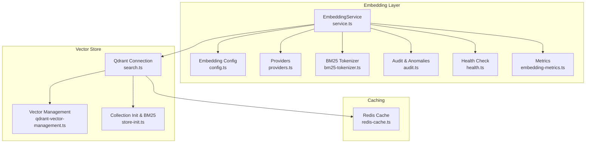
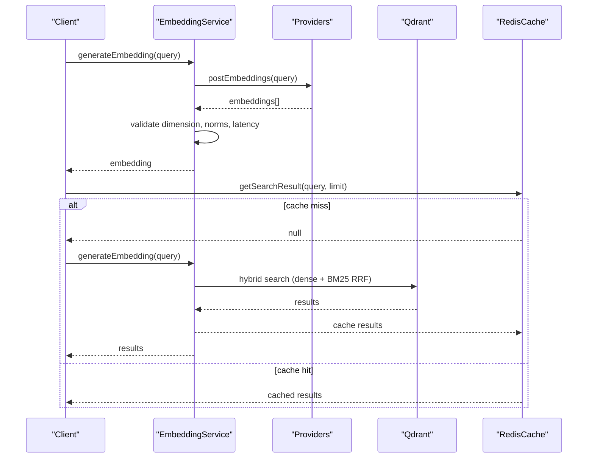
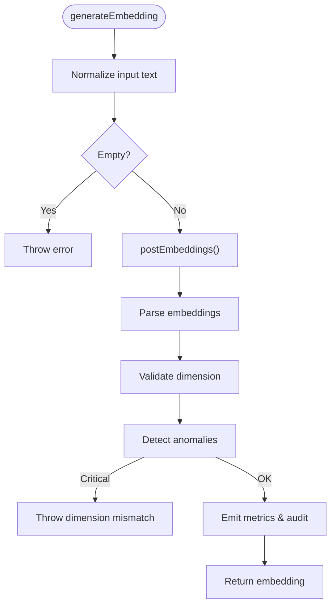
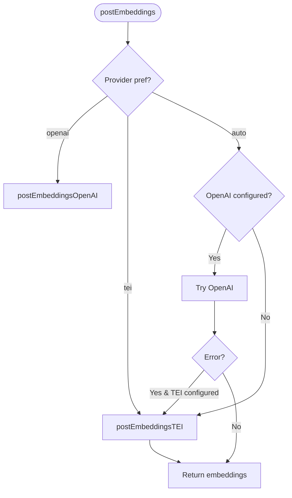
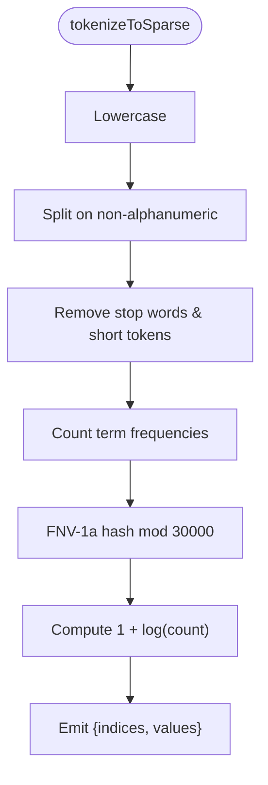
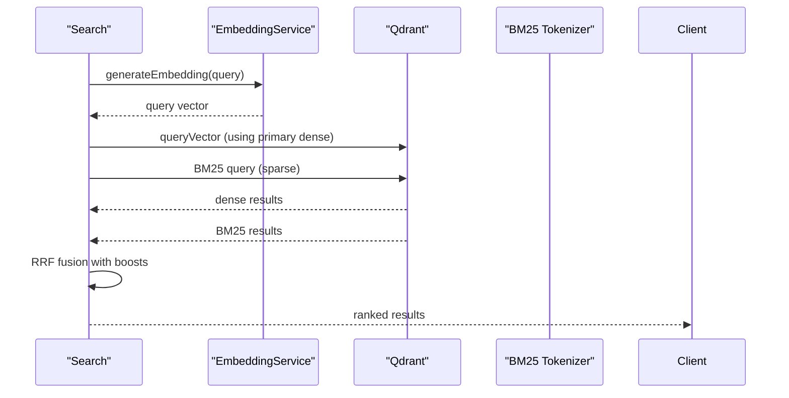
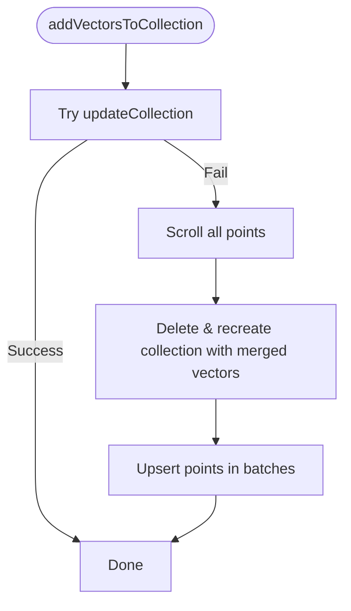
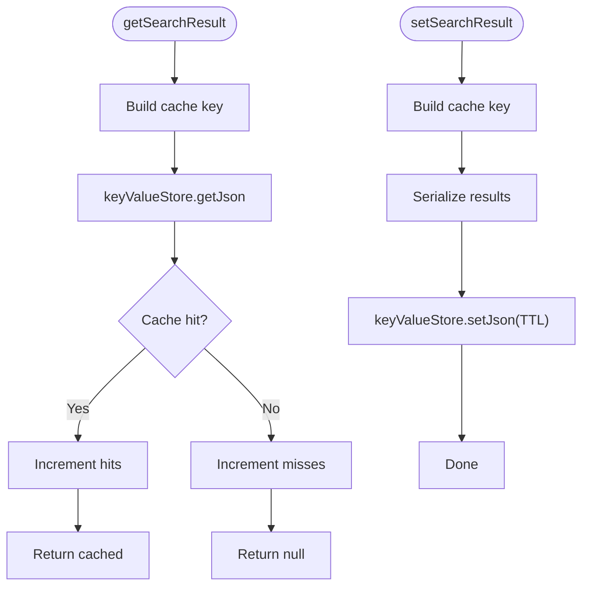
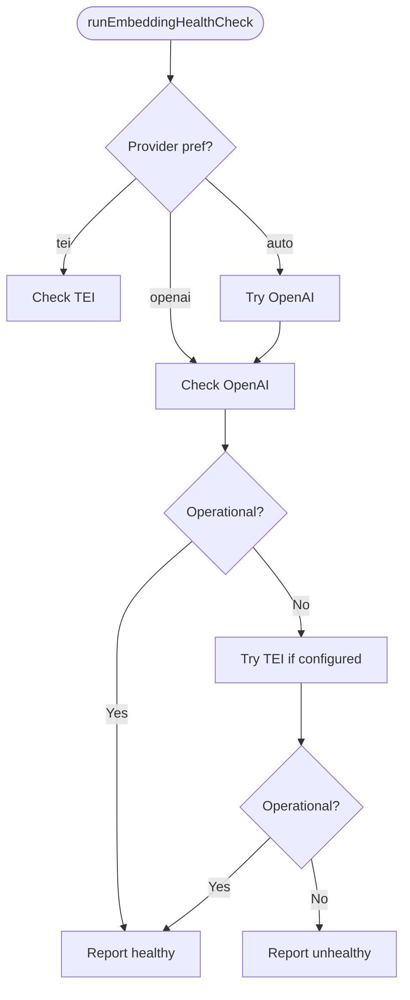
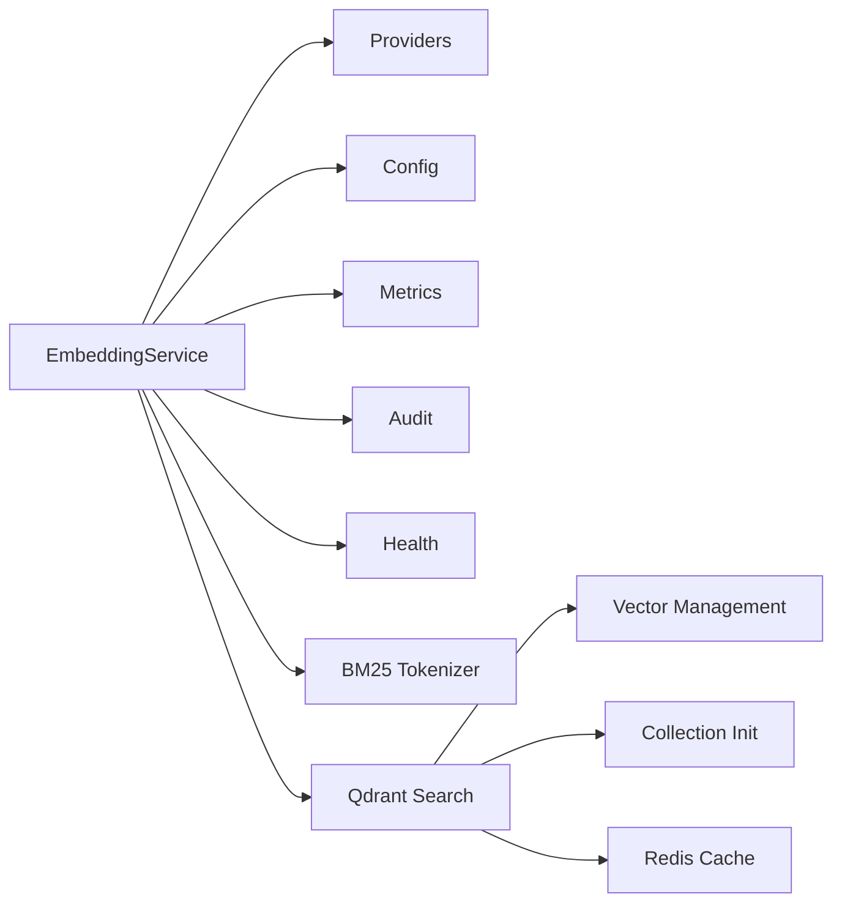

# Optimization & Best Practices

<cite>
**Referenced Files in This Document**
- [service.ts](file://src/services/embedding/service.ts)
- [bm25-tokenizer.ts](file://src/services/embedding/bm25-tokenizer.ts)
- [providers.ts](file://src/services/embedding/providers.ts)
- [config.ts](file://src/services/embedding/config.ts)
- [types.ts](file://src/services/embedding/types.ts)
- [embedding-metrics.ts](file://src/services/metrics/embedding-metrics.ts)
- [audit.ts](file://src/services/embedding/audit.ts)
- [health.ts](file://src/services/embedding/health.ts)
- [store-init.ts](file://src/services/memory/store-init.ts)
- [search.ts](file://src/services/qdrant/search.ts)
- [memory-retrieval.ts](file://src/services/qdrant/memory-retrieval.ts)
- [qdrant-vector-management.ts](file://src/utils/qdrant-vector-management.ts)
- [redis-cache.ts](file://src/services/redis-cache.ts)
- [http-health-routes.ts](file://src/http/http-health-routes.ts)
- [kairos-search-scores.test.ts](file://tests/integration/kairos-search-scores.test.ts)
</cite>

## Table of Contents
1. [Introduction](#introduction)
2. [Project Structure](#project-structure)
3. [Core Components](#core-components)
4. [Architecture Overview](#architecture-overview)
5. [Detailed Component Analysis](#detailed-component-analysis)
6. [Dependency Analysis](#dependency-analysis)
7. [Performance Considerations](#performance-considerations)
8. [Troubleshooting Guide](#troubleshooting-guide)
9. [Conclusion](#conclusion)
10. [Appendices](#appendices)

## Introduction
This document provides comprehensive optimization and best practices for embedding systems in the repository. It covers BM25 tokenizer implementation for keyword-based search enhancement, hybrid search strategies combining dense and sparse vectors, embedding dimension optimization, batch sizing, provider selection, cost optimization, caching, performance benchmarking, quality assessment, model comparison, troubleshooting, storage optimization, retrieval tuning, and scalability for high-volume workloads.

## Project Structure
The embedding optimization spans several modules:
- Embedding service orchestrates provider selection, batching, anomaly detection, and metrics.
- Provider implementations support OpenAI and TEI with retry logic and robust error handling.
- BM25 tokenizer enables keyword-based sparse vector search for hybrid retrieval.
- Qdrant integration supports hybrid search, vector management, and pagination.
- Redis cache accelerates search results and integrates with invalidation channels.
- Health checks and audit/logging provide observability and anomaly detection.

**Diagram sources**
- [service.ts:38-284](file://src/services/embedding/service.ts#L38-L284)
- [providers.ts:251-278](file://src/services/embedding/providers.ts#L251-L278)
- [config.ts:12-36](file://src/services/embedding/config.ts#L12-L36)
- [bm25-tokenizer.ts:37-56](file://src/services/embedding/bm25-tokenizer.ts#L37-L56)
- [audit.ts:94-157](file://src/services/embedding/audit.ts#L94-L157)
- [health.ts:16-119](file://src/services/embedding/health.ts#L16-L119)
- [embedding-metrics.ts:11-47](file://src/services/metrics/embedding-metrics.ts#L11-L47)
- [search.ts:11-82](file://src/services/qdrant/search.ts#L11-L82)
- [qdrant-vector-management.ts:13-114](file://src/utils/qdrant-vector-management.ts#L13-L114)
- [store-init.ts:130-148](file://src/services/memory/store-init.ts#L130-L148)
- [redis-cache.ts:21-211](file://src/services/redis-cache.ts#L21-L211)

**Section sources**
- [service.ts:14-284](file://src/services/embedding/service.ts#L14-L284)
- [providers.ts:1-280](file://src/services/embedding/providers.ts#L1-L280)
- [bm25-tokenizer.ts:1-57](file://src/services/embedding/bm25-tokenizer.ts#L1-L57)
- [config.ts:1-40](file://src/services/embedding/config.ts#L1-L40)
- [embedding-metrics.ts:1-51](file://src/services/metrics/embedding-metrics.ts#L1-L51)
- [audit.ts:1-197](file://src/services/embedding/audit.ts#L1-L197)
- [health.ts:1-121](file://src/services/embedding/health.ts#L1-L121)
- [search.ts:1-82](file://src/services/qdrant/search.ts#L1-L82)
- [qdrant-vector-management.ts:1-301](file://src/utils/qdrant-vector-management.ts#L1-L301)
- [store-init.ts:1-155](file://src/services/memory/store-init.ts#L1-L155)
- [redis-cache.ts:1-211](file://src/services/redis-cache.ts#L1-L211)

## Core Components
- EmbeddingService: Central orchestration for generating single and batch embeddings, selecting providers, validating dimensions, emitting metrics, and logging anomalies.
- Providers: OpenAI and TEI implementations with retry/backoff, error categorization, and audit logging.
- BM25 Tokenizer: Lightweight tokenizer producing sparse vectors for Qdrant BM25 search.
- Qdrant Hybrid Search: Dense similarity search combined with BM25 sparse retrieval and reciprocal rank fusion.
- Vector Management: Named vector creation, migration between dimensions, and safe recreation strategies.
- Redis Cache: Search result caching with TTL and invalidation patterns.
- Metrics and Audit: Embedding request counters, durations, vector sizes, batch sizes, and anomaly detection.

**Section sources**
- [service.ts:38-284](file://src/services/embedding/service.ts#L38-L284)
- [providers.ts:77-278](file://src/services/embedding/providers.ts#L77-L278)
- [bm25-tokenizer.ts:37-56](file://src/services/embedding/bm25-tokenizer.ts#L37-L56)
- [search.ts:11-82](file://src/services/qdrant/search.ts#L11-L82)
- [qdrant-vector-management.ts:13-202](file://src/utils/qdrant-vector-management.ts#L13-L202)
- [redis-cache.ts:21-211](file://src/services/redis-cache.ts#L21-L211)
- [embedding-metrics.ts:11-47](file://src/services/metrics/embedding-metrics.ts#L11-L47)
- [audit.ts:94-157](file://src/services/embedding/audit.ts#L94-L157)

## Architecture Overview
The embedding pipeline integrates with Qdrant for hybrid retrieval and caches hot queries in Redis. Health checks and audit trails ensure reliability and observability.

**Diagram sources**
- [service.ts:47-127](file://src/services/embedding/service.ts#L47-L127)
- [providers.ts:251-278](file://src/services/embedding/providers.ts#L251-L278)
- [search.ts:11-82](file://src/services/qdrant/search.ts#L11-L82)
- [redis-cache.ts:36-70](file://src/services/redis-cache.ts#L36-L70)

## Detailed Component Analysis

### EmbeddingService: Dimension, Batching, Metrics, and Anomalies
- Dimension resolution: Resolved at first successful call and enforced on subsequent calls to prevent mismatches.
- Batch processing: Validates inputs, tracks batch size, and ensures consistent dimensions across vectors.
- Metrics: Tracks request counts, durations, vector sizes, and batch sizes with tenant/provider labels.
- Anomaly detection: Flags high latency, unusual vector norms, and dimension mismatches.

**Diagram sources**
- [service.ts:47-127](file://src/services/embedding/service.ts#L47-L127)
- [audit.ts:94-157](file://src/services/embedding/audit.ts#L94-L157)
- [embedding-metrics.ts:11-47](file://src/services/metrics/embedding-metrics.ts#L11-L47)

**Section sources**
- [service.ts:38-284](file://src/services/embedding/service.ts#L38-L284)
- [audit.ts:94-157](file://src/services/embedding/audit.ts#L94-L157)
- [embedding-metrics.ts:11-47](file://src/services/metrics/embedding-metrics.ts#L11-L47)

### Providers: OpenAI and TEI with Retry and Audit
- Provider selection: Explicit preference or auto-detection with fallback.
- Retry/backoff: Network transient errors and specific HTTP statuses retried with bounded attempts.
- Audit logging: Captures provider calls with status, dimensions, latency, and optional HTTP status/error messages.

**Diagram sources**
- [providers.ts:251-278](file://src/services/embedding/providers.ts#L251-L278)
- [providers.ts:77-175](file://src/services/embedding/providers.ts#L77-L175)
- [providers.ts:177-249](file://src/services/embedding/providers.ts#L177-L249)

**Section sources**
- [providers.ts:14-47](file://src/services/embedding/providers.ts#L14-L47)
- [providers.ts:77-249](file://src/services/embedding/providers.ts#L77-L249)

### BM25 Tokenizer: Sparse Vectors for Keyword Search
- Tokenization: Lowercase, non-alphanumeric split, stop word removal, minimum token length.
- Indexing: FNV-1a hash modulo sparse dimension.
- Values: Sublinear term frequency 1 + log(count).
- Output: Indices and values arrays for Qdrant sparse vector search.

**Diagram sources**
- [bm25-tokenizer.ts:37-56](file://src/services/embedding/bm25-tokenizer.ts#L37-L56)

**Section sources**
- [bm25-tokenizer.ts:1-57](file://src/services/embedding/bm25-tokenizer.ts#L1-L57)

### Hybrid Search: Dense + BM25 with Reciprocal Rank Fusion
- Dense search: Vector similarity using the primary dense vector.
- BM25 sparse search: Keyword matching using BM25 sparse vectors.
- Fusion: Reciprocal rank fusion (RRF) combines results from multiple prefetch queries.
- Scoring: Boosts for title, activation patterns, labels, and tags.

**Diagram sources**
- [search.ts:11-82](file://src/services/qdrant/search.ts#L11-L82)
- [bm25-tokenizer.ts:37-56](file://src/services/embedding/bm25-tokenizer.ts#L37-L56)

**Section sources**
- [search.ts:11-82](file://src/services/qdrant/search.ts#L11-L82)
- [store-init.ts:130-148](file://src/services/memory/store-init.ts#L130-L148)

### Vector Management: Adding Named Vectors, Migration, and Safe Recreation
- Add named vectors: Attempts updateCollection; falls back to safe recreation preserving data.
- Migrate vector space: Scrolls points with old vector, re-embeds content, and upserts new vectors in batches.
- Remove vector: Recreates collection without the target vector and restores data.

**Diagram sources**
- [qdrant-vector-management.ts:13-114](file://src/utils/qdrant-vector-management.ts#L13-L114)
- [qdrant-vector-management.ts:126-202](file://src/utils/qdrant-vector-management.ts#L126-L202)
- [qdrant-vector-management.ts:208-301](file://src/utils/qdrant-vector-management.ts#L208-L301)

**Section sources**
- [qdrant-vector-management.ts:13-114](file://src/utils/qdrant-vector-management.ts#L13-L114)
- [qdrant-vector-management.ts:126-202](file://src/utils/qdrant-vector-management.ts#L126-L202)
- [qdrant-vector-management.ts:208-301](file://src/utils/qdrant-vector-management.ts#L208-L301)

### Redis Cache: Search Result Caching and Invalidation
- Caching: Stores search results with TTL and distinguishes collapsed vs natural modes.
- Invalidation: Provides targeted invalidation for begin/activate caches and a pub/sub channel for broader invalidation.
- Integration: Used by higher-level search flows to accelerate repeated queries.

**Diagram sources**
- [redis-cache.ts:36-70](file://src/services/redis-cache.ts#L36-L70)
- [redis-cache.ts:186-211](file://src/services/redis-cache.ts#L186-L211)

**Section sources**
- [redis-cache.ts:21-211](file://src/services/redis-cache.ts#L21-L211)

### Health Checks and Observability
- Health: Determines provider availability, handles rate limits and auth failures, and probes endpoint readiness.
- Audit: Emits structured logs for successes and errors, including dimensions, latency, and error messages.
- Metrics: Exposes counters and histograms for embedding requests, durations, errors, vector sizes, and batch sizes.

**Diagram sources**
- [health.ts:16-119](file://src/services/embedding/health.ts#L16-L119)
- [audit.ts:60-92](file://src/services/embedding/audit.ts#L60-L92)
- [embedding-metrics.ts:11-47](file://src/services/metrics/embedding-metrics.ts#L11-L47)

**Section sources**
- [health.ts:16-119](file://src/services/embedding/health.ts#L16-L119)
- [audit.ts:60-92](file://src/services/embedding/audit.ts#L60-L92)
- [embedding-metrics.ts:11-47](file://src/services/metrics/embedding-metrics.ts#L11-L47)

## Dependency Analysis
- EmbeddingService depends on provider implementations, config, metrics, audit, and health modules.
- Qdrant search depends on EmbeddingService for query vectors and BM25 tokenizer for sparse queries.
- Vector management utilities depend on Qdrant client APIs and collection metadata.
- Redis cache integrates with the key-value store abstraction and invalidation patterns.

**Diagram sources**
- [service.ts:38-284](file://src/services/embedding/service.ts#L38-L284)
- [providers.ts:251-278](file://src/services/embedding/providers.ts#L251-L278)
- [config.ts:12-36](file://src/services/embedding/config.ts#L12-L36)
- [embedding-metrics.ts:11-47](file://src/services/metrics/embedding-metrics.ts#L11-L47)
- [audit.ts:94-157](file://src/services/embedding/audit.ts#L94-L157)
- [health.ts:16-119](file://src/services/embedding/health.ts#L16-L119)
- [bm25-tokenizer.ts:37-56](file://src/services/embedding/bm25-tokenizer.ts#L37-L56)
- [search.ts:11-82](file://src/services/qdrant/search.ts#L11-L82)
- [qdrant-vector-management.ts:13-114](file://src/utils/qdrant-vector-management.ts#L13-L114)
- [store-init.ts:130-148](file://src/services/memory/store-init.ts#L130-L148)
- [redis-cache.ts:21-211](file://src/services/redis-cache.ts#L21-L211)

**Section sources**
- [service.ts:38-284](file://src/services/embedding/service.ts#L38-L284)
- [providers.ts:251-278](file://src/services/embedding/providers.ts#L251-L278)
- [search.ts:11-82](file://src/services/qdrant/search.ts#L11-L82)
- [qdrant-vector-management.ts:13-114](file://src/utils/qdrant-vector-management.ts#L13-L114)
- [redis-cache.ts:21-211](file://src/services/redis-cache.ts#L21-L211)

## Performance Considerations
- Embedding dimension optimization
  - Resolve dimension at startup via a minimal embedding probe to cache and enforce consistent dimensions across requests.
  - Ensure vector size metrics reflect float32 size (4 bytes per float) to estimate storage and network overhead.
- Batch size tuning
  - Track batch sizes with histograms to identify optimal throughput vs latency trade-offs.
  - Filter out empty inputs and compute character lengths for cost-aware batching.
- Provider selection strategies
  - Prefer explicit provider configuration for predictable behavior; auto-detection with OpenAI preferred when both are configured.
  - Use health checks to detect rate limits and authentication failures and adjust fallbacks accordingly.
- Hybrid search tuning
  - Adjust prefetch limits per vector type and combine with RRF to balance precision and recall.
  - Apply boost weights for title, activation patterns, labels, and tags to align with domain semantics.
- Caching and storage
  - Use Redis cache for frequent queries with TTL; invalidate on memory updates to maintain freshness.
  - For vector migrations, batch upserts and preserve payload to minimize downtime and memory pressure.
- Cost optimization
  - Monitor embedding vector sizes and request counts; reduce dimensionality or query frequency where appropriate.
  - Use BM25 sparse vectors to improve keyword recall without increasing dense vector costs.
- Benchmarking and quality assessment
  - Maintain baselines for top scores and query performance; compare current results against historical baselines to detect regressions.
  - Use anomaly detection for latency and vector norms to flag potential provider or model issues.

[No sources needed since this section provides general guidance]

## Troubleshooting Guide
Common issues and resolutions:
- Provider misconfiguration
  - Symptoms: Authentication failures, rate limits, or missing endpoints.
  - Actions: Verify API keys and model names; use health checks to confirm connectivity and status codes.
- Dimension mismatch
  - Symptoms: Errors indicating unexpected embedding dimensions.
  - Actions: Ensure a startup probe resolves the dimension; enforce dimension validation on all subsequent calls.
- Latency spikes and anomalies
  - Symptoms: High-latency requests or unusual vector norms.
  - Actions: Review audit logs and anomaly events; adjust provider selection or retry policies.
- Cache invalidation
  - Symptoms: Stale search results after memory updates.
  - Actions: Trigger invalidation for begin/activate caches and ensure pub/sub invalidation is enabled.
- Vector migration failures
  - Symptoms: Partial migrations or inconsistencies after dimension changes.
  - Actions: Use safe recreation strategy and batch upserts; monitor progress and handle partial failures gracefully.

**Section sources**
- [health.ts:16-119](file://src/services/embedding/health.ts#L16-L119)
- [audit.ts:94-157](file://src/services/embedding/audit.ts#L94-L157)
- [redis-cache.ts:186-211](file://src/services/redis-cache.ts#L186-L211)
- [qdrant-vector-management.ts:13-114](file://src/utils/qdrant-vector-management.ts#L13-L114)

## Conclusion
This repository implements a robust, observable, and scalable embedding system with hybrid dense/sparse retrieval, provider flexibility, and strong operational controls. By leveraging BM25 tokenization, vector management utilities, Redis caching, and comprehensive metrics and audit logging, teams can optimize embedding quality, performance, and cost while maintaining reliability at scale.

[No sources needed since this section summarizes without analyzing specific files]

## Appendices

### Practical Examples and Techniques
- Embedding quality assessment
  - Compare vector norms and latencies over time; flag anomalies exceeding thresholds.
  - Validate embedding dimensions across batches and reject inconsistent results.
- Model comparison
  - Run health checks and measure latency distributions for different providers/models.
  - Benchmark hybrid search top scores against historical baselines to detect regressions.
- Benchmarking methods
  - Use histogram metrics for embedding durations and batch sizes to identify bottlenecks.
  - Track embedding vector sizes to estimate storage and bandwidth needs.

**Section sources**
- [audit.ts:94-157](file://src/services/embedding/audit.ts#L94-L157)
- [embedding-metrics.ts:11-47](file://src/services/metrics/embedding-metrics.ts#L11-L47)
- [kairos-search-scores.test.ts:103-134](file://tests/integration/kairos-search-scores.test.ts#L103-L134)