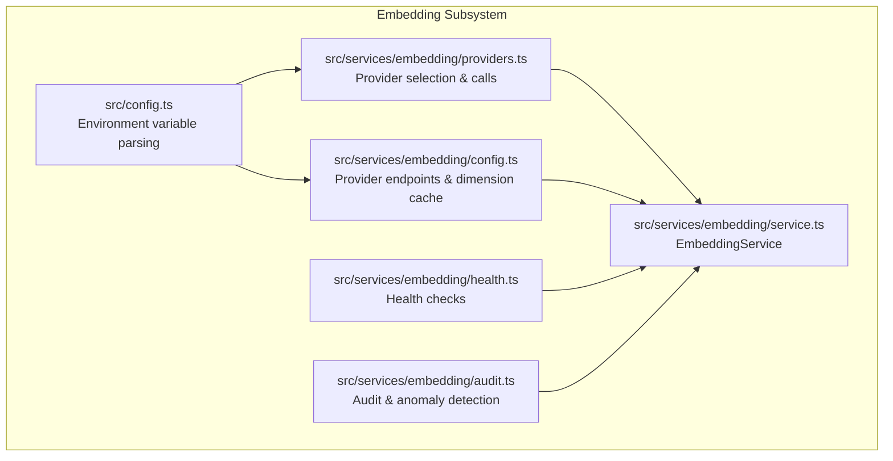
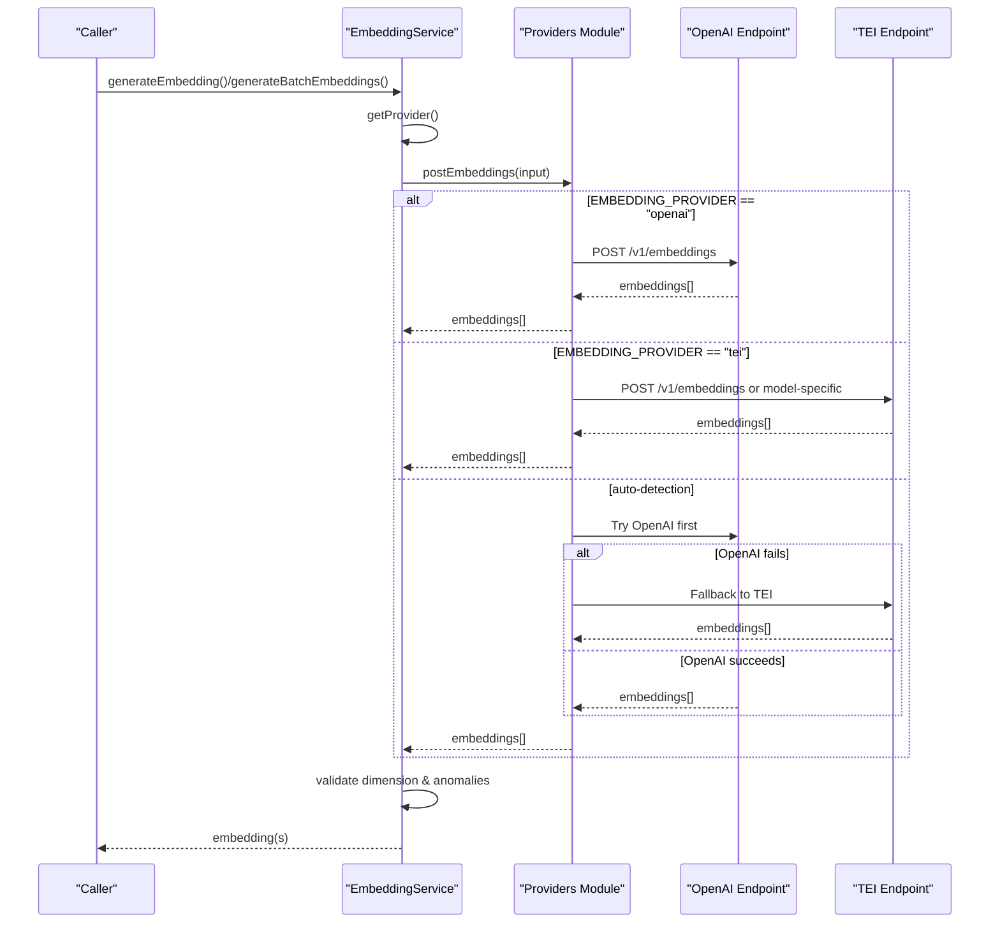
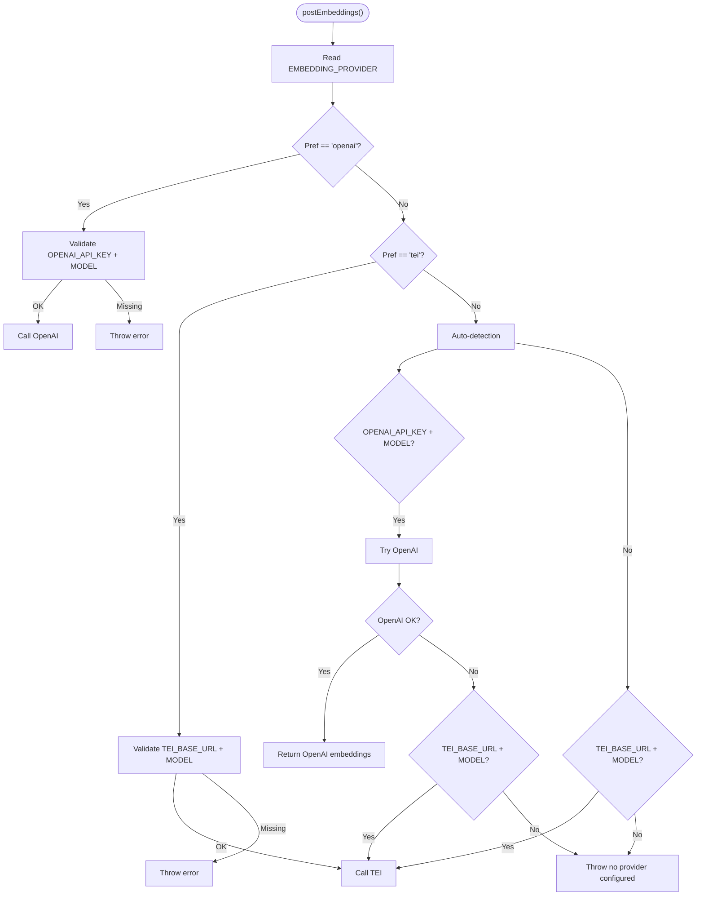
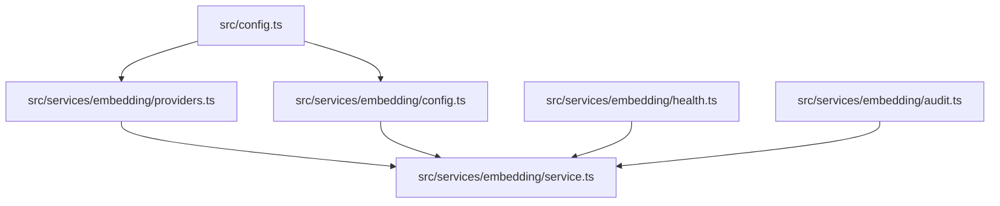

# Provider Configuration & Selection

<cite>
**Referenced Files in This Document**
- [config.ts](file://src/config.ts)
- [providers.ts](file://src/services/embedding/providers.ts)
- [service.ts](file://src/services/embedding/service.ts)
- [config.ts](file://src/services/embedding/config.ts)
- [health.ts](file://src/services/embedding/health.ts)
- [audit.ts](file://src/services/embedding/audit.ts)
- [README.md](file://README.md)
- [docs/install/prerequisites.md](file://docs/install/prerequisites.md)
</cite>

## Table of Contents
1. [Introduction](#introduction)
2. [Project Structure](#project-structure)
3. [Core Components](#core-components)
4. [Architecture Overview](#architecture-overview)
5. [Detailed Component Analysis](#detailed-component-analysis)
6. [Dependency Analysis](#dependency-analysis)
7. [Performance Considerations](#performance-considerations)
8. [Troubleshooting Guide](#troubleshooting-guide)
9. [Conclusion](#conclusion)

## Introduction
This document explains how the embedding provider configuration and selection mechanism works in the system. It covers automatic provider detection logic that chooses between OpenAI, TEI, and local providers based on environment variables, the EMBEDDING_PROVIDER preference setting and fallback behavior, configuration parameters, practical configuration examples, environment variable precedence rules, troubleshooting provider selection issues, provider-specific settings, model name resolution, and runtime provider switching capabilities.

## Project Structure
The embedding subsystem is organized around three main modules:
- Configuration parsing and defaults for environment variables
- Provider selection and invocation logic
- Service wrapper that exposes embedding generation and health checks

**Diagram sources**
- [config.ts:67-74](file://src/config.ts#L67-L74)
- [providers.ts:1-280](file://src/services/embedding/providers.ts#L1-L280)
- [service.ts:1-293](file://src/services/embedding/service.ts#L1-L293)
- [config.ts:1-40](file://src/services/embedding/config.ts#L1-L40)
- [health.ts:1-121](file://src/services/embedding/health.ts#L1-L121)
- [audit.ts:1-197](file://src/services/embedding/audit.ts#L1-L197)

**Section sources**
- [config.ts:67-74](file://src/config.ts#L67-L74)
- [providers.ts:251-278](file://src/services/embedding/providers.ts#L251-L278)
- [service.ts:38-284](file://src/services/embedding/service.ts#L38-L284)

## Core Components
- Environment configuration: centralizes all environment variable parsing and defaults for embedding-related settings.
- Provider selection: encapsulates provider detection logic and invokes the appropriate provider implementation.
- Service wrapper: exposes embedding generation APIs, dimension probing, health checks, and runtime provider switching.

Key configuration parameters:
- OPENAI_API_KEY: OpenAI API key
- OPENAI_EMBEDDING_MODEL: OpenAI embedding model name
- OPENAI_API_URL: Base URL for OpenAI-compatible endpoints (e.g., Azure or Ollama)
- EMBEDDING_PROVIDER: Provider preference ('auto', 'openai', 'tei')
- TEI_BASE_URL: Base URL for TEI endpoint
- TEI_MODEL: TEI model name
- TEI_API_KEY: Optional API key header for TEI

**Section sources**
- [config.ts:67-74](file://src/config.ts#L67-L74)
- [providers.ts:251-278](file://src/services/embedding/providers.ts#L251-L278)
- [service.ts:258-265](file://src/services/embedding/service.ts#L258-L265)

## Architecture Overview
The provider selection and invocation flow is centralized in the provider module and consumed by the service wrapper. The service also manages dimension probing and runtime provider switching.

**Diagram sources**
- [providers.ts:251-278](file://src/services/embedding/providers.ts#L251-L278)
- [service.ts:47-221](file://src/services/embedding/service.ts#L47-L221)
- [config.ts:5-10](file://src/services/embedding/config.ts#L5-L10)

## Detailed Component Analysis

### Provider Detection and Selection Logic
The selection logic prioritizes explicit preference over auto-detection:
- If EMBEDDING_PROVIDER is set to 'openai' or 'tei', the system uses that provider exclusively.
- In auto mode, the system prefers OpenAI when both OPENAI_API_KEY and OPENAI_EMBEDDING_MODEL are present; otherwise it falls back to TEI if TEI_BASE_URL and TEI_MODEL are configured.
- If both providers are unavailable, the system returns a local provider type for compatibility.

**Diagram sources**
- [providers.ts:251-278](file://src/services/embedding/providers.ts#L251-L278)
- [service.ts:258-265](file://src/services/embedding/service.ts#L258-L265)

**Section sources**
- [providers.ts:251-278](file://src/services/embedding/providers.ts#L251-L278)
- [service.ts:258-265](file://src/services/embedding/service.ts#L258-L265)

### Configuration Parameters and Defaults
- OPENAI_API_KEY: Required for OpenAI; empty disables OpenAI usage.
- OPENAI_EMBEDDING_MODEL: Defaults to a common small model when unset.
- OPENAI_API_URL: Defaults to the public OpenAI base URL; trailing slash is normalized.
- EMBEDDING_PROVIDER: Defaults to 'auto'.
- TEI_BASE_URL: Base URL for TEI; endpoint is constructed as BASE_URL + '/v1/embeddings' if provided.
- TEI_MODEL: TEI model name; defaults to a commonly used model when unset.
- TEI_API_KEY: Optional; if present, sent as 'x-api-key' header.

Provider endpoint construction:
- OpenAI: OPENAI_API_URL + '/v1/embeddings'
- TEI: TEI_BASE_URL + '/v1/embeddings' if TEI_BASE_URL ends with '/', the trailing slash is removed before appending the path.

**Section sources**
- [config.ts:67-74](file://src/config.ts#L67-L74)
- [config.ts:5-10](file://src/services/embedding/config.ts#L5-L10)

### Practical Configuration Examples
- OpenAI
  - Set OPENAI_API_KEY and optionally OPENAI_EMBEDDING_MODEL.
  - Example values:
    - OPENAI_API_KEY=sk-...
    - OPENAI_EMBEDDING_MODEL=text-embedding-3-small

- Ollama (OpenAI-compatible)
  - Set OPENAI_API_URL to the base URL (without /v1), OPENAI_EMBEDDING_MODEL to the local model, and OPENAI_API_KEY to 'ollama'.
  - Example values:
    - OPENAI_API_URL=http://host.docker.internal:11434
    - OPENAI_EMBEDDING_MODEL=nomic-embed-text
    - OPENAI_API_KEY=ollama

- TEI
  - Set TEI_BASE_URL and optionally TEI_MODEL; TEI_API_KEY is optional.
  - Example values:
    - TEI_BASE_URL=http://your-tei:8080
    - TEI_MODEL=Alibaba-NLP/gte-large-en-v1.5
    - TEI_API_KEY=secret

- Preference override
  - Set EMBEDDING_PROVIDER to 'openai' or 'tei' to force a specific provider regardless of environment variables.

**Section sources**
- [docs/install/prerequisites.md:101-107](file://docs/install/prerequisites.md#L101-L107)
- [docs/install/prerequisites.md:144-150](file://docs/install/prerequisites.md#L144-L150)
- [docs/install/prerequisites.md:177-182](file://docs/install/prerequisites.md#L177-L182)
- [config.ts:67-74](file://src/config.ts#L67-L74)

### Environment Variable Precedence Rules
- Explicit preference takes precedence:
  - If EMBEDDING_PROVIDER is set to 'openai' or 'tei', the system uses that provider regardless of other variables.
- Auto-detection rules:
  - Prefer OpenAI when OPENAI_API_KEY and OPENAI_EMBEDDING_MODEL are both present.
  - Otherwise, prefer TEI when TEI_BASE_URL and TEI_MODEL are both present.
  - If neither is available, the system falls back to a local provider type for compatibility.
- Provider-specific validation:
  - OpenAI: requires both OPENAI_API_KEY and OPENAI_EMBEDDING_MODEL.
  - TEI: requires both TEI_BASE_URL and TEI_MODEL.

**Section sources**
- [providers.ts:251-278](file://src/services/embedding/providers.ts#L251-L278)
- [service.ts:258-265](file://src/services/embedding/service.ts#L258-L265)

### Model Name Resolution
- The service resolves the effective model name based on the selected provider:
  - For TEI, the model is taken from TEI_MODEL.
  - For OpenAI, the model is taken from OPENAI_EMBEDDING_MODEL.
- The service also validates that the returned embedding dimension matches the previously resolved dimension, ensuring consistency across provider switches.

**Section sources**
- [service.ts:43-45](file://src/services/embedding/service.ts#L43-L45)
- [config.ts:12-36](file://src/services/embedding/config.ts#L12-L36)

### Runtime Provider Switching Capabilities
- The service exposes a runtime method to determine the current provider:
  - getProvider() evaluates EMBEDDING_PROVIDER and environment variables to decide between 'openai', 'tei', or 'local'.
- The service also exposes a configuration inspection method:
  - getConfig() returns the current provider, model, dimension, and configuration status for diagnostics.

**Section sources**
- [service.ts:258-283](file://src/services/embedding/service.ts#L258-L283)

### Health Checks and Audit
- Health checks:
  - runEmbeddingHealthCheck() validates the current provider configuration and performs a minimal embedding call to verify operation.
  - It returns a structured result indicating whether the provider is healthy and a human-readable message.
- Audit and anomaly detection:
  - Embedding requests are audited with details such as provider, model, input counts, output dimensions, and latency.
  - Anomaly detection flags unusual latencies, vector norms, and dimension mismatches.

**Section sources**
- [health.ts:16-119](file://src/services/embedding/health.ts#L16-L119)
- [audit.ts:60-157](file://src/services/embedding/audit.ts#L60-L157)

## Dependency Analysis
The embedding subsystem depends on configuration parsing and exposes a clean service interface. The provider module encapsulates network calls and retry logic, while the service module orchestrates dimension probing, validation, and diagnostics.

**Diagram sources**
- [config.ts:67-74](file://src/config.ts#L67-L74)
- [providers.ts:1-280](file://src/services/embedding/providers.ts#L1-L280)
- [service.ts:1-293](file://src/services/embedding/service.ts#L1-L293)
- [health.ts:1-121](file://src/services/embedding/health.ts#L1-L121)
- [audit.ts:1-197](file://src/services/embedding/audit.ts#L1-L197)

**Section sources**
- [config.ts:67-74](file://src/config.ts#L67-L74)
- [providers.ts:1-280](file://src/services/embedding/providers.ts#L1-L280)
- [service.ts:1-293](file://src/services/embedding/service.ts#L1-L293)

## Performance Considerations
- Retry strategy: The provider module implements a bounded retry mechanism for transient network errors and specific HTTP statuses (rate limits, gateway timeouts).
- Latency monitoring: Embedding requests are timed and logged as part of audit events.
- Vector size tracking: The service observes vector sizes for telemetry and anomaly detection.
- Dimension caching: The system caches the resolved embedding dimension after the first successful embedding call to avoid repeated probing.

**Section sources**
- [providers.ts:31-47](file://src/services/embedding/providers.ts#L31-L47)
- [service.ts:75-95](file://src/services/embedding/service.ts#L75-L95)
- [audit.ts:105-157](file://src/services/embedding/audit.ts#L105-L157)
- [config.ts:12-36](file://src/services/embedding/config.ts#L12-L36)

## Troubleshooting Guide
Common issues and resolutions:
- No embedding provider configured
  - Symptom: Error indicating that no provider is configured.
  - Resolution: Set OPENAI_API_KEY and OPENAI_EMBEDDING_MODEL for OpenAI, or TEI_BASE_URL and TEI_MODEL for TEI.
- OpenAI authentication failure
  - Symptom: Authentication error or 401.
  - Resolution: Verify OPENAI_API_KEY and ensure the key has permissions for embeddings.
- OpenAI rate limit or gateway errors
  - Symptom: 429, 502, 503, or 504 responses.
  - Resolution: The system retries transient errors; if persistent, reduce request rate or switch providers.
- TEI authentication or rate limit
  - Symptom: 401 or 429.
  - Resolution: Verify TEI_API_KEY and endpoint availability; retry logic applies similarly.
- Dimension mismatch
  - Symptom: Embedding dimension mismatch error.
  - Resolution: Ensure consistent model selection across the deployment; re-run dimension probing if switching models.
- Health check failures
  - Symptom: Health endpoint indicates unhealthy provider.
  - Resolution: Use runEmbeddingHealthCheck() to diagnose; verify endpoint URLs, keys, and model names.

**Section sources**
- [providers.ts:77-175](file://src/services/embedding/providers.ts#L77-L175)
- [providers.ts:177-249](file://src/services/embedding/providers.ts#L177-L249)
- [health.ts:16-119](file://src/services/embedding/health.ts#L16-L119)
- [README.md:372-378](file://README.md#L372-L378)

## Conclusion
The embedding subsystem provides a robust, configurable, and observable mechanism for selecting and invoking embedding providers. By combining explicit preferences with sensible auto-detection, it ensures reliable operation across diverse environments. The service layer adds dimension validation, audit logging, and health checks to improve reliability and observability. Proper configuration of environment variables and adherence to the precedence rules will minimize provider selection issues and enable smooth runtime switching when needed.