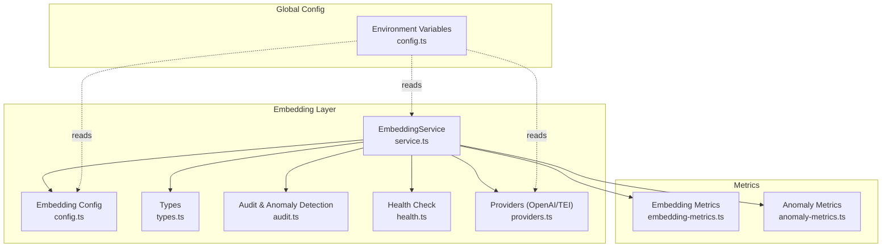
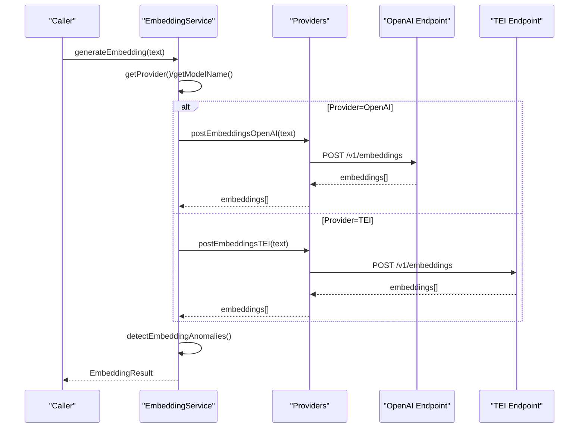
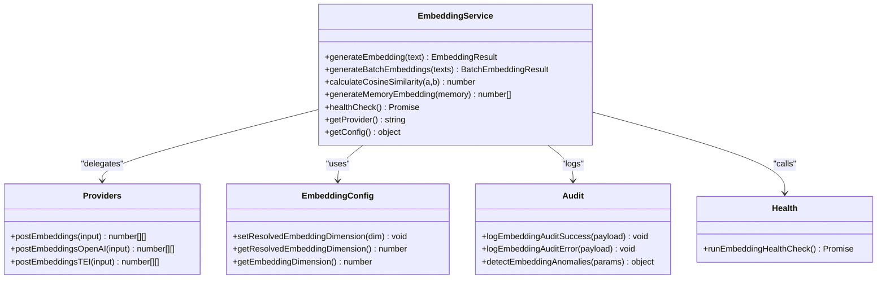
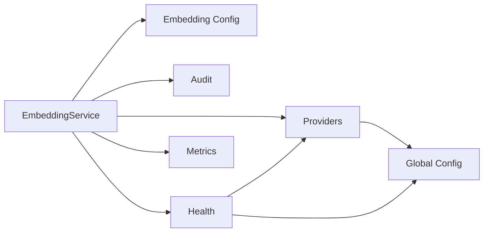

# Custom Provider Development

<cite>
**Referenced Files in This Document**
- [providers.ts](file://src/services/embedding/providers.ts)
- [service.ts](file://src/services/embedding/service.ts)
- [config.ts](file://src/services/embedding/config.ts)
- [types.ts](file://src/services/embedding/types.ts)
- [health.ts](file://src/services/embedding/health.ts)
- [audit.ts](file://src/services/embedding/audit.ts)
- [config.ts](file://src/config.ts)
- [embedding-metrics.ts](file://src/services/metrics/embedding-metrics.ts)
- [anomaly-metrics.ts](file://src/services/metrics/anomaly-metrics.ts)
- [http-health-routes.ts](file://src/http/http-health-routes.ts)
</cite>

## Table of Contents
1. [Introduction](#introduction)
2. [Project Structure](#project-structure)
3. [Core Components](#core-components)
4. [Architecture Overview](#architecture-overview)
5. [Detailed Component Analysis](#detailed-component-analysis)
6. [Dependency Analysis](#dependency-analysis)
7. [Performance Considerations](#performance-considerations)
8. [Troubleshooting Guide](#troubleshooting-guide)
9. [Conclusion](#conclusion)
10. [Appendices](#appendices)

## Introduction
This document explains how to develop custom embedding providers for the system’s pluggable embedding backend. It covers the provider interface contract, configuration patterns, registration mechanisms, environment variable conventions, validation, error handling, and performance optimization. It also provides step-by-step guidance to implement a new provider, integrate it, and validate it through unit and integration tests.

## Project Structure
The embedding subsystem is organized around a small set of cohesive modules:
- A service class that exposes a uniform API for generating embeddings and managing provider selection.
- A provider module that encapsulates provider-specific logic and retry/backoff behavior.
- A configuration module that resolves runtime dimensions and validates provider readiness.
- Health, audit, and metrics modules that monitor and report provider behavior.
- Global configuration that defines environment variables and defaults.

**Diagram sources**
- [service.ts:38-284](file://src/services/embedding/service.ts#L38-L284)
- [providers.ts:251-278](file://src/services/embedding/providers.ts#L251-L278)
- [config.ts:1-40](file://src/services/embedding/config.ts#L1-L40)
- [types.ts:1-17](file://src/services/embedding/types.ts#L1-L17)
- [audit.ts:10-157](file://src/services/embedding/audit.ts#L10-L157)
- [health.ts:16-119](file://src/services/embedding/health.ts#L16-L119)
- [embedding-metrics.ts:1-51](file://src/services/metrics/embedding-metrics.ts#L1-L51)
- [anomaly-metrics.ts:1-11](file://src/services/metrics/anomaly-metrics.ts#L1-L11)
- [config.ts:67-74](file://src/config.ts#L67-L74)

**Section sources**
- [service.ts:1-293](file://src/services/embedding/service.ts#L1-L293)
- [providers.ts:1-280](file://src/services/embedding/providers.ts#L1-L280)
- [config.ts:1-40](file://src/services/embedding/config.ts#L1-L40)
- [types.ts:1-17](file://src/services/embedding/types.ts#L1-L17)
- [audit.ts:1-197](file://src/services/embedding/audit.ts#L1-L197)
- [health.ts:1-121](file://src/services/embedding/health.ts#L1-L121)
- [embedding-metrics.ts:1-51](file://src/services/metrics/embedding-metrics.ts#L1-L51)
- [anomaly-metrics.ts:1-11](file://src/services/metrics/anomaly-metrics.ts#L1-L11)
- [config.ts:67-74](file://src/config.ts#L67-L74)

## Core Components
- EmbeddingService: Provides generateEmbedding, generateBatchEmbeddings, cosine similarity, memory embedding composition, health checks, provider selection, and configuration introspection. It centralizes metrics, auditing, and anomaly detection.
- Providers: Encapsulate provider-specific HTTP calls, response parsing, and retry/backoff logic. They expose postEmbeddings, postEmbeddingsOpenAI, and postEmbeddingsTEI.
- Config: Resolves and caches embedding dimension, validates dimension consistency, and exposes endpoints and defaults.
- Types: Defines EmbeddingResult and BatchEmbeddingResult contracts.
- Audit & Anomaly Detection: Logs structured audit events and detects anomalies (latency, norm, dimension mismatch).
- Health: Performs provider readiness checks and reports status.
- Metrics: Exposes counters and histograms for embedding requests, durations, errors, vector sizes, and batch sizes.

Key responsibilities:
- Provider selection: Explicit preference via environment variable or auto-discovery based on configured variables.
- Validation: Ensures required environment variables are present and consistent with the chosen provider.
- Retry/backoff: Implements exponential backoff for transient network errors and specific HTTP statuses.
- Observability: Emits metrics and audit logs for all embedding operations.

**Section sources**
- [service.ts:38-284](file://src/services/embedding/service.ts#L38-L284)
- [providers.ts:251-278](file://src/services/embedding/providers.ts#L251-L278)
- [config.ts:12-36](file://src/services/embedding/config.ts#L12-L36)
- [types.ts:1-17](file://src/services/embedding/types.ts#L1-L17)
- [audit.ts:94-157](file://src/services/embedding/audit.ts#L94-L157)
- [health.ts:16-119](file://src/services/embedding/health.ts#L16-L119)
- [embedding-metrics.ts:11-47](file://src/services/metrics/embedding-metrics.ts#L11-L47)

## Architecture Overview
The embedding subsystem follows a layered architecture:
- Service layer: Orchestrates operations, metrics, audit, and anomaly detection.
- Provider layer: Encapsulates external provider specifics and error handling.
- Config layer: Centralizes provider endpoints and runtime dimension caching.
- Global configuration: Supplies environment variables and defaults.

**Diagram sources**
- [service.ts:47-127](file://src/services/embedding/service.ts#L47-L127)
- [providers.ts:77-175](file://src/services/embedding/providers.ts#L77-L175)
- [providers.ts:177-249](file://src/services/embedding/providers.ts#L177-L249)
- [config.ts:5-10](file://src/services/embedding/config.ts#L5-L10)

## Detailed Component Analysis

### Provider Interface Contract
A custom provider must implement a function that accepts a string or string array and returns a Promise resolving to number[][] (batch of embeddings). The function should:
- Validate provider-specific configuration.
- Perform HTTP requests to the provider’s embeddings endpoint.
- Parse provider-specific response shapes into a consistent embeddings array.
- Respect retry/backoff semantics for transient failures.
- Emit audit logs and metrics consistently with existing providers.

Existing providers:
- postEmbeddingsOpenAI: Validates OPENAI_API_KEY and OPENAI_EMBEDDING_MODEL, constructs Authorization header, handles JSON parsing, and retries on retriable HTTP statuses.
- postEmbeddingsTEI: Validates TEI_BASE_URL and TEI_MODEL, supports optional x-api-key header, and normalizes various response shapes into embeddings.

Provider selection logic:
- postEmbeddings chooses provider based on EMBEDDING_PROVIDER or auto-detection preferring OpenAI when both providers are configured.

**Section sources**
- [providers.ts:77-175](file://src/services/embedding/providers.ts#L77-L175)
- [providers.ts:177-249](file://src/services/embedding/providers.ts#L177-L249)
- [providers.ts:251-278](file://src/services/embedding/providers.ts#L251-L278)
- [config.ts:5-10](file://src/services/embedding/config.ts#L5-L10)

### Configuration Patterns and Environment Variables
Provider configuration is driven by environment variables:
- EMBEDDING_PROVIDER: Controls provider preference ('auto' | 'openai' | 'tei').
- OPENAI_API_KEY, OPENAI_EMBEDDING_MODEL, OPENAI_API_URL: Configure OpenAI provider.
- TEI_BASE_URL, TEI_MODEL, TEI_API_KEY: Configure TEI provider.
- EMBEDDING_LATENCY_WARN_MS, EMBEDDING_NORM_MIN, EMBEDDING_NORM_MAX, SEARCH_SCORE_WARN_THRESHOLD: Tune anomaly detection thresholds.

Endpoints:
- OPENAI_ENDPOINT: Derived from OPENAI_API_URL plus '/v1/embeddings'.
- TEI_EMBEDDING_ENDPOINT: Derived from TEI_BASE_URL plus '/v1/embeddings'.

Runtime dimension:
- setResolvedEmbeddingDimension caches the first observed embedding dimension and enforces consistency on subsequent calls.
- getResolvedEmbeddingDimension/getEmbeddingDimension provide access to the cached dimension.

**Section sources**
- [config.ts:67-74](file://src/config.ts#L67-L74)
- [config.ts:5-10](file://src/services/embedding/config.ts#L5-L10)
- [config.ts:12-36](file://src/services/embedding/config.ts#L12-L36)

### Provider Registration Mechanism
Registration is implicit: the EmbeddingService delegates to postEmbeddings, which selects the provider based on environment variables. To add a new provider:
- Implement a new postEmbeddingsXxx function following the pattern of postEmbeddingsOpenAI/postEmbeddingsTEI.
- Extend postEmbeddings to route to the new function based on EMBEDDING_PROVIDER or auto-detection.
- Ensure the function validates required environment variables and emits audit logs and metrics.

Integration points:
- EmbeddingService.generateEmbedding/generateBatchEmbeddings call postEmbeddings.
- Health checks call provider-specific functions or endpoints directly.
- Metrics and audit are handled centrally.

**Section sources**
- [providers.ts:251-278](file://src/services/embedding/providers.ts#L251-L278)
- [service.ts:47-221](file://src/services/embedding/service.ts#L47-L221)
- [health.ts:16-119](file://src/services/embedding/health.ts#L16-L119)

### Configuration Validation
Validation occurs at multiple layers:
- Environment variable presence: postEmbeddingsOpenAI and postEmbeddingsTEI throw if required variables are missing.
- HTTP-level validation: Responses are checked for JSON validity and expected shapes; non-OK statuses trigger appropriate errors.
- Dimension consistency: setResolvedEmbeddingDimension enforces that all embeddings share the same dimension.
- Health checks: runEmbeddingHealthCheck verifies provider readiness and reports status messages.

**Section sources**
- [providers.ts:77-175](file://src/services/embedding/providers.ts#L77-L175)
- [providers.ts:177-249](file://src/services/embedding/providers.ts#L177-L249)
- [config.ts:12-36](file://src/services/embedding/config.ts#L12-L36)
- [health.ts:16-119](file://src/services/embedding/health.ts#L16-L119)

### Error Handling Patterns
- Retries: fetchWithRetries implements exponential backoff for transient network errors and specific HTTP statuses (429, 502, 503, 504 for OpenAI).
- Structured audit: auditProviderCall and logEmbeddingAuditSuccess/logEmbeddingAuditError emit structured logs with tenant/request IDs.
- Anomaly detection: detectEmbeddingAnomalies flags high latency, unusual vector norms, and dimension mismatches.
- Health reporting: runEmbeddingHealthCheck distinguishes between authentication failures, rate limits, and other errors.

**Section sources**
- [providers.ts:31-47](file://src/services/embedding/providers.ts#L31-L47)
- [providers.ts:49-75](file://src/services/embedding/providers.ts#L49-L75)
- [audit.ts:94-157](file://src/services/embedding/audit.ts#L94-L157)
- [health.ts:16-119](file://src/services/embedding/health.ts#L16-L119)

### Performance Optimization Techniques
- Dimension probing: Call probeEmbeddingDimension at startup to cache the embedding dimension and avoid repeated inference.
- Vector size tracking: Track vector sizes in bytes to estimate memory footprint and optimize storage.
- Batch processing: Use generateBatchEmbeddings to reduce overhead when processing multiple texts.
- Metrics-driven tuning: Monitor embeddingDuration, embeddingRequests, embeddingErrors, embeddingVectorSize, and embeddingBatchSize to identify bottlenecks.

**Section sources**
- [service.ts:288-292](file://src/services/embedding/service.ts#L288-L292)
- [embedding-metrics.ts:11-47](file://src/services/metrics/embedding-metrics.ts#L11-L47)

### Provider-Specific Considerations
- Authentication:
  - OpenAI: Requires OPENAI_API_KEY; unauthorized requests return 401.
  - TEI: Optional TEI_API_KEY via x-api-key header; unauthorized requests return 401.
- Rate limiting:
  - OpenAI: 429 indicates throttling; handled with retries and logged in health checks.
  - TEI: 429 indicates throttling; handled similarly.
- Retry logic:
  - Network-level retries for transient errors.
  - HTTP-level retries for specific statuses (OpenAI).
- Response shape normalization:
  - TEI supports multiple response shapes; the provider normalizes them to embeddings[].

**Section sources**
- [providers.ts:77-175](file://src/services/embedding/providers.ts#L77-L175)
- [providers.ts:177-249](file://src/services/embedding/providers.ts#L177-L249)
- [health.ts:20-47](file://src/services/embedding/health.ts#L20-L47)

### Step-by-Step Implementation Guide
1. Define environment variables for the new provider in the global configuration module.
2. Implement a new postEmbeddingsXxx function that:
   - Validates required environment variables.
   - Constructs the provider endpoint and headers.
   - Sends HTTP requests and parses the response into embeddings[].
   - Handles JSON parsing errors and non-OK HTTP statuses.
   - Emits audit logs and metrics.
3. Extend postEmbeddings to route to the new provider based on EMBEDDING_PROVIDER or auto-detection.
4. Integrate with EmbeddingService:
   - Ensure generateEmbedding/generateBatchEmbeddings work seamlessly.
   - Add provider to getProvider() and getConfig() logic.
5. Add health check support:
   - Implement or reuse a health routine that validates connectivity and returns a structured status.
6. Add metrics and audit:
   - Increment embeddingRequests and embeddingErrors appropriately.
   - Log audit events with provider, model, input counts, dimensions, and latency.
7. Testing:
   - Unit tests: Mock HTTP responses, simulate errors, and verify retry/backoff behavior.
   - Integration tests: Verify dimension consistency, anomaly detection, and health checks.
8. Documentation:
   - Update README or provider-specific docs with configuration steps and environment variable names.

**Section sources**
- [config.ts:67-74](file://src/config.ts#L67-L74)
- [providers.ts:251-278](file://src/services/embedding/providers.ts#L251-L278)
- [service.ts:258-283](file://src/services/embedding/service.ts#L258-L283)
- [health.ts:16-119](file://src/services/embedding/health.ts#L16-L119)
- [embedding-metrics.ts:11-47](file://src/services/metrics/embedding-metrics.ts#L11-L47)
- [audit.ts:60-92](file://src/services/embedding/audit.ts#L60-L92)

### Class and Module Relationships

**Diagram sources**
- [service.ts:38-284](file://src/services/embedding/service.ts#L38-L284)
- [providers.ts:251-278](file://src/services/embedding/providers.ts#L251-L278)
- [config.ts:12-36](file://src/services/embedding/config.ts#L12-L36)
- [audit.ts:60-157](file://src/services/embedding/audit.ts#L60-L157)
- [health.ts:16-119](file://src/services/embedding/health.ts#L16-L119)

## Dependency Analysis
- EmbeddingService depends on:
  - Providers for actual embedding computation.
  - EmbeddingConfig for dimension resolution.
  - Audit for anomaly detection and structured logging.
  - Health for readiness checks.
  - Metrics for observability.
- Providers depend on:
  - Global configuration for endpoints and environment variables.
  - Structured logger for audit events.
- Health depends on:
  - Providers for direct endpoint checks.
  - Global configuration for environment variables.

**Diagram sources**
- [service.ts:15-33](file://src/services/embedding/service.ts#L15-L33)
- [providers.ts:1-12](file://src/services/embedding/providers.ts#L1-L12)
- [health.ts:2-14](file://src/services/embedding/health.ts#L2-L14)
- [config.ts:67-74](file://src/config.ts#L67-L74)

**Section sources**
- [service.ts:15-33](file://src/services/embedding/service.ts#L15-L33)
- [providers.ts:1-12](file://src/services/embedding/providers.ts#L1-L12)
- [health.ts:2-14](file://src/services/embedding/health.ts#L2-L14)
- [config.ts:67-74](file://src/config.ts#L67-L74)

## Performance Considerations
- Pre-warm embeddings: Call probeEmbeddingDimension at startup to cache the embedding dimension and avoid repeated inference.
- Batch embeddings: Prefer generateBatchEmbeddings for multiple inputs to reduce overhead.
- Monitor latency and vector sizes: Use embeddingDuration and embeddingVectorSize histograms to identify slow providers or large vectors.
- Anomaly detection: Tune EMBEDDING_LATENCY_WARN_MS, EMBEDDING_NORM_MIN, EMBEDDING_NORM_MAX to balance sensitivity and false positives.

**Section sources**
- [service.ts:288-292](file://src/services/embedding/service.ts#L288-L292)
- [embedding-metrics.ts:18-47](file://src/services/metrics/embedding-metrics.ts#L18-L47)
- [config.ts:75-77](file://src/config.ts#L75-L77)

## Troubleshooting Guide
Common issues and resolutions:
- Missing configuration:
  - Ensure OPENAI_API_KEY and OPENAI_EMBEDDING_MODEL are set for OpenAI, or TEI_BASE_URL and TEI_MODEL for TEI.
- Authentication failures:
  - 401 errors indicate incorrect or missing API keys; verify OPENAI_API_KEY and TEI_API_KEY.
- Rate limiting:
  - 429 indicates throttling; reduce request frequency or adjust provider quotas.
- Dimension mismatch:
  - setResolvedEmbeddingDimension enforces consistent dimensions; ensure the provider returns embeddings with the expected dimension.
- Health check failures:
  - Use runEmbeddingHealthCheck to diagnose provider readiness and error messages.

Health check integration:
- The health endpoint bounds provider checks to avoid blocking; it reports timeouts and provider-specific statuses.

**Section sources**
- [providers.ts:77-175](file://src/services/embedding/providers.ts#L77-L175)
- [providers.ts:177-249](file://src/services/embedding/providers.ts#L177-L249)
- [config.ts:12-36](file://src/services/embedding/config.ts#L12-L36)
- [health.ts:16-119](file://src/services/embedding/health.ts#L16-L119)
- [http-health-routes.ts:23-44](file://src/http/http-health-routes.ts#L23-L44)

## Conclusion
The embedding subsystem provides a clean, extensible abstraction for pluggable embedding backends. By following the established patterns—configuration validation, robust error handling, structured audit and metrics, and health checks—you can implement a new provider with minimal integration effort. Use the provided hooks and utilities to ensure reliability, performance, and observability.

## Appendices

### Environment Variables Reference
- EMBEDDING_PROVIDER: 'auto' | 'openai' | 'tei'
- OPENAI_API_KEY, OPENAI_EMBEDDING_MODEL, OPENAI_API_URL
- TEI_BASE_URL, TEI_MODEL, TEI_API_KEY
- EMBEDDING_LATENCY_WARN_MS, EMBEDDING_NORM_MIN, EMBEDDING_NORM_MAX, SEARCH_SCORE_WARN_THRESHOLD

**Section sources**
- [config.ts:67-77](file://src/config.ts#L67-L77)

### Metrics Reference
- kairos_embedding_requests_total: Count of embedding requests by provider and status.
- kairos_embedding_duration_seconds: Histogram of embedding generation duration.
- kairos_embedding_errors_total: Count of embedding errors by provider and status.
- kairos_embedding_vector_size_bytes: Histogram of vector sizes in bytes.
- kairos_embedding_batch_size: Histogram of batch sizes.

**Section sources**
- [embedding-metrics.ts:11-47](file://src/services/metrics/embedding-metrics.ts#L11-L47)