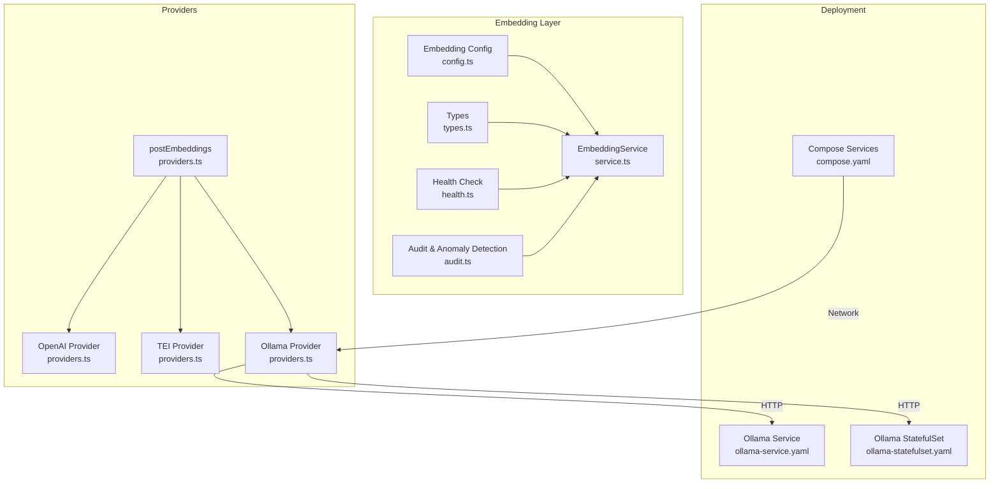
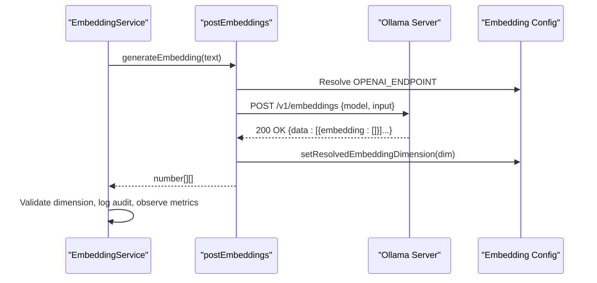
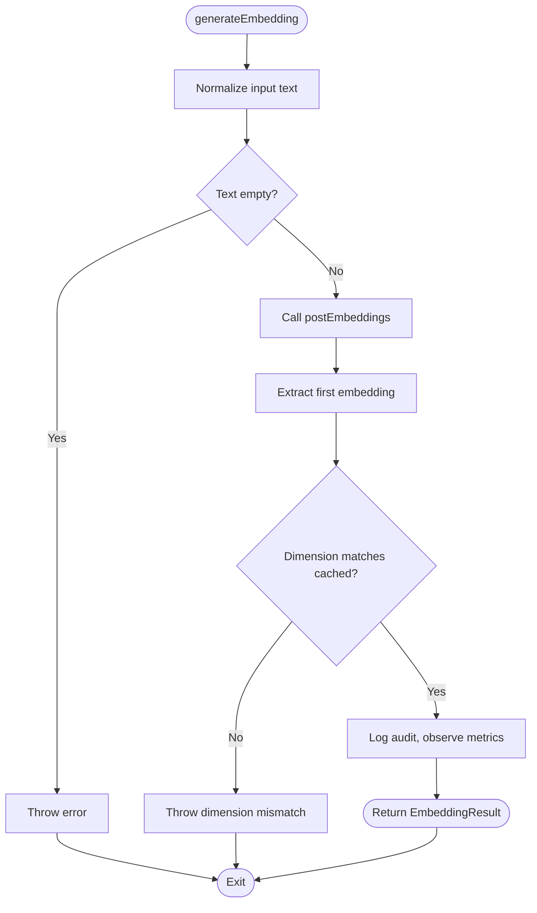
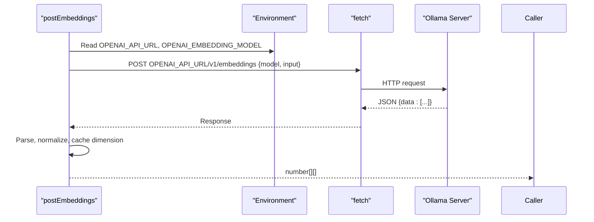
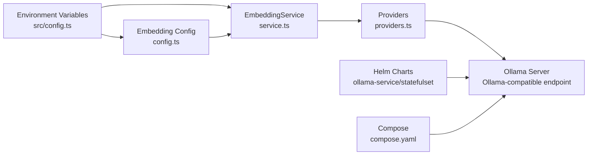

# Ollama Provider

<cite>
**Referenced Files in This Document**
- [src/services/embedding/service.ts](file://src/services/embedding/service.ts)
- [src/services/embedding/providers.ts](file://src/services/embedding/providers.ts)
- [src/services/embedding/config.ts](file://src/services/embedding/config.ts)
- [src/services/embedding/health.ts](file://src/services/embedding/health.ts)
- [src/services/embedding/types.ts](file://src/services/embedding/types.ts)
- [src/services/embedding/audit.ts](file://src/services/embedding/audit.ts)
- [src/config.ts](file://src/config.ts)
- [helm/kairos-mcp/templates/ollama-service.yaml](file://helm/kairos-mcp/templates/ollama-service.yaml)
- [helm/kairos-mcp/templates/ollama-statefulset.yaml](file://helm/kairos-mcp/templates/ollama-statefulset.yaml)
- [compose.yaml](file://compose.yaml)
- [skills/.system/kairos-install/SKILL.md](file://skills/.system/kairos-install/SKILL.md)
</cite>

## Table of Contents
1. [Introduction](#introduction)
2. [Project Structure](#project-structure)
3. [Core Components](#core-components)
4. [Architecture Overview](#architecture-overview)
5. [Detailed Component Analysis](#detailed-component-analysis)
6. [Dependency Analysis](#dependency-analysis)
7. [Performance Considerations](#performance-considerations)
8. [Troubleshooting Guide](#troubleshooting-guide)
9. [Conclusion](#conclusion)

## Introduction
This document explains the Ollama embedding provider implementation in the project. It covers how the system integrates a local LLM serving stack via Ollama to produce embeddings, how environment variables configure the provider, and how the HTTP API communicates with Ollama. It also documents model selection, request formatting, response parsing, practical setup examples, performance optimization tips, privacy and latency benefits, and troubleshooting for common deployment issues.

## Project Structure
The Ollama provider is part of the embedding subsystem. The relevant components are organized as follows:
- Embedding service orchestrates embedding generation and validates dimensions.
- Providers encapsulate HTTP calls to external embedding backends (OpenAI, TEI, and Ollama via OpenAI-compatible endpoint).
- Configuration resolves runtime dimensions and endpoint URLs.
- Health checks validate connectivity and response shape.
- Types define the contract for embedding results.
- Audit and anomaly detection capture metrics and guardrails.
- Helm charts and Compose provide deployment scaffolding for Ollama.

**Diagram sources**
- [src/services/embedding/service.ts:38-284](file://src/services/embedding/service.ts#L38-L284)
- [src/services/embedding/providers.ts:251-278](file://src/services/embedding/providers.ts#L251-L278)
- [src/services/embedding/config.ts:1-40](file://src/services/embedding/config.ts#L1-L40)
- [src/services/embedding/health.ts:16-119](file://src/services/embedding/health.ts#L16-L119)
- [src/services/embedding/types.ts:1-17](file://src/services/embedding/types.ts#L1-L17)
- [src/services/embedding/audit.ts:94-157](file://src/services/embedding/audit.ts#L94-L157)
- [helm/kairos-mcp/templates/ollama-service.yaml:1-35](file://helm/kairos-mcp/templates/ollama-service.yaml#L1-L35)
- [helm/kairos-mcp/templates/ollama-statefulset.yaml:1-112](file://helm/kairos-mcp/templates/ollama-statefulset.yaml#L1-L112)
- [compose.yaml:10-183](file://compose.yaml#L10-L183)

**Section sources**
- [src/services/embedding/service.ts:1-293](file://src/services/embedding/service.ts#L1-L293)
- [src/services/embedding/providers.ts:1-280](file://src/services/embedding/providers.ts#L1-L280)
- [src/services/embedding/config.ts:1-40](file://src/services/embedding/config.ts#L1-L40)
- [src/services/embedding/health.ts:1-121](file://src/services/embedding/health.ts#L1-L121)
- [src/services/embedding/types.ts:1-17](file://src/services/embedding/types.ts#L1-L17)
- [src/services/embedding/audit.ts:1-197](file://src/services/embedding/audit.ts#L1-L197)
- [helm/kairos-mcp/templates/ollama-service.yaml:1-35](file://helm/kairos-mcp/templates/ollama-service.yaml#L1-L35)
- [helm/kairos-mcp/templates/ollama-statefulset.yaml:1-112](file://helm/kairos-mcp/templates/ollama-statefulset.yaml#L1-L112)
- [compose.yaml:10-183](file://compose.yaml#L10-L183)

## Core Components
- EmbeddingService: Orchestrates embedding generation, validates dimensions, tracks metrics, and performs anomaly detection. It selects the provider based on environment variables and delegates to the provider layer.
- Providers: Encapsulates HTTP calls to OpenAI, TEI, and Ollama. For Ollama, the system uses an OpenAI-compatible endpoint (OPENAI_API_URL) and model (OPENAI_EMBEDDING_MODEL) to communicate with the local Ollama server.
- Config: Resolves the embedding endpoint URL and caches the embedding dimension after the first successful call.
- Health: Validates provider availability and response shape.
- Types: Defines the shape of embedding results.
- Audit: Logs embedding requests and detects anomalies such as high latency, unusual vector norms, and dimension mismatches.

**Section sources**
- [src/services/embedding/service.ts:38-284](file://src/services/embedding/service.ts#L38-L284)
- [src/services/embedding/providers.ts:251-278](file://src/services/embedding/providers.ts#L251-L278)
- [src/services/embedding/config.ts:5-36](file://src/services/embedding/config.ts#L5-L36)
- [src/services/embedding/health.ts:16-119](file://src/services/embedding/health.ts#L16-L119)
- [src/services/embedding/types.ts:1-17](file://src/services/embedding/types.ts#L1-L17)
- [src/services/embedding/audit.ts:94-157](file://src/services/embedding/audit.ts#L94-L157)

## Architecture Overview
The Ollama provider leverages an OpenAI-compatible embeddings endpoint exposed by Ollama. The application sends HTTP requests to the local Ollama server using the OPENAI_API_URL and OPENAI_EMBEDDING_MODEL environment variables. The provider layer handles retries, error parsing, and response normalization. The embedding service validates dimensions and records metrics and audits.

**Diagram sources**
- [src/services/embedding/service.ts:47-127](file://src/services/embedding/service.ts#L47-L127)
- [src/services/embedding/providers.ts:251-278](file://src/services/embedding/providers.ts#L251-L278)
- [src/services/embedding/config.ts:5-36](file://src/services/embedding/config.ts#L5-L36)

## Detailed Component Analysis

### EmbeddingService
- Purpose: Central orchestration for generating embeddings, validating dimensions, and recording metrics.
- Provider selection: Chooses provider based on EMBEDDING_PROVIDER or falls back to local when OPENAI variables are present.
- Validation: Ensures non-empty input, validates embedding dimension against cached value, and computes cosine similarity for comparisons.
- Metrics and audit: Increments request counters, observes latency and vector sizes, and logs successes and failures.

**Diagram sources**
- [src/services/embedding/service.ts:47-127](file://src/services/embedding/service.ts#L47-L127)

**Section sources**
- [src/services/embedding/service.ts:38-284](file://src/services/embedding/service.ts#L38-L284)

### Providers: Ollama via OpenAI-Compatible Endpoint
- Endpoint resolution: Uses OPENAI_API_URL to construct the embeddings endpoint path (/v1/embeddings).
- Request format: Sends a JSON body containing model and input array.
- Authentication: Uses OPENAI_API_KEY as a bearer token placeholder for Ollama compatibility.
- Response parsing: Normalizes various response shapes into a consistent number[][] format and caches the embedding dimension.

**Diagram sources**
- [src/services/embedding/providers.ts:77-175](file://src/services/embedding/providers.ts#L77-L175)
- [src/services/embedding/config.ts:5-10](file://src/services/embedding/config.ts#L5-L10)

**Section sources**
- [src/services/embedding/providers.ts:77-175](file://src/services/embedding/providers.ts#L77-L175)
- [src/services/embedding/config.ts:5-10](file://src/services/embedding/config.ts#L5-L10)

### Configuration and Dimension Caching
- OPENAI_ENDPOINT: Constructed from OPENAI_API_URL plus /v1/embeddings.
- Dimension caching: First successful response determines the embedding dimension, which is enforced on subsequent calls.
- Runtime dimension retrieval: Exposed via getResolvedEmbeddingDimension().

**Section sources**
- [src/services/embedding/config.ts:5-36](file://src/services/embedding/config.ts#L5-L36)

### Health Checks
- Validates provider availability and response shape.
- For Ollama, the health check targets the OpenAI-compatible endpoint and verifies that embeddings are returned with the expected shape.

**Section sources**
- [src/services/embedding/health.ts:16-119](file://src/services/embedding/health.ts#L16-L119)

### Types and Audit
- EmbeddingResult and BatchEmbeddingResult define the shape of returned embeddings and usage metadata.
- Audit captures latency, input length, output dimension, and logs anomalies such as high latency, unusual vector norms, and dimension mismatches.

**Section sources**
- [src/services/embedding/types.ts:1-17](file://src/services/embedding/types.ts#L1-L17)
- [src/services/embedding/audit.ts:94-157](file://src/services/embedding/audit.ts#L94-L157)

## Dependency Analysis
The embedding subsystem depends on environment variables and the provider layer. The provider layer depends on configuration for endpoint construction and on the Ollama server for responses. Deployment artifacts (Helm and Compose) expose and manage the Ollama service.

**Diagram sources**
- [src/config.ts:67-74](file://src/config.ts#L67-L74)
- [src/services/embedding/config.ts:5-10](file://src/services/embedding/config.ts#L5-L10)
- [src/services/embedding/service.ts:38-284](file://src/services/embedding/service.ts#L38-L284)
- [src/services/embedding/providers.ts:251-278](file://src/services/embedding/providers.ts#L251-L278)
- [helm/kairos-mcp/templates/ollama-service.yaml:1-35](file://helm/kairos-mcp/templates/ollama-service.yaml#L1-L35)
- [helm/kairos-mcp/templates/ollama-statefulset.yaml:1-112](file://helm/kairos-mcp/templates/ollama-statefulset.yaml#L1-L112)
- [compose.yaml:10-183](file://compose.yaml#L10-L183)

**Section sources**
- [src/config.ts:67-74](file://src/config.ts#L67-L74)
- [src/services/embedding/config.ts:5-36](file://src/services/embedding/config.ts#L5-L36)
- [src/services/embedding/service.ts:38-284](file://src/services/embedding/service.ts#L38-L284)
- [src/services/embedding/providers.ts:251-278](file://src/services/embedding/providers.ts#L251-L278)
- [helm/kairos-mcp/templates/ollama-service.yaml:1-35](file://helm/kairos-mcp/templates/ollama-service.yaml#L1-L35)
- [helm/kairos-mcp/templates/ollama-statefulset.yaml:1-112](file://helm/kairos-mcp/templates/ollama-statefulset.yaml#L1-L112)
- [compose.yaml:10-183](file://compose.yaml#L10-L183)

## Performance Considerations
- Local execution: Running embeddings locally via Ollama reduces network latency compared to cloud APIs, especially for high-throughput workloads.
- Resource planning: Allocate CPU and memory to the Ollama container and ensure sufficient disk for model storage. The Helm StatefulSet supports configurable resources and persistent storage.
- Model selection: Choose a model appropriate for your workload. The installation guide recommends a suitable model for Ollama.
- Throughput batching: Use batch embedding APIs to reduce overhead when processing multiple texts.
- Monitoring: Enable metrics and health checks to track latency and detect anomalies early.

[No sources needed since this section provides general guidance]

## Troubleshooting Guide
Common deployment and integration issues:

- Ollama URL and model configuration
  - Ensure OPENAI_API_URL points to the local Ollama server and OPENAI_EMBEDDING_MODEL specifies a pulled model.
  - The installation skill outlines URL rules for different environments and provides example .env snippets for Ollama.

- Connectivity and reachability
  - Verify the Ollama service is reachable from the application container or host. Use the health check endpoint to confirm readiness.
  - Helm charts expose Ollama on port 11434; ensure no port conflicts and that the service selector matches the pod labels.

- Model availability
  - The Helm StatefulSet pulls a model during initialization. Confirm the model was downloaded and is listed by the Ollama server.

- Response shape and dimension mismatches
  - The provider normalizes responses into number[][]. If the response shape is unexpected, the system logs an error and stops further processing.
  - The embedding service caches the dimension after the first successful call; mismatches trigger an error.

- Authentication and API key
  - OPENAI_API_KEY is used as a bearer token placeholder for Ollama compatibility. Ensure it is set appropriately for your environment.

- Environment variable precedence
  - EMBEDDING_PROVIDER can force a provider. If set to auto, the system prefers OpenAI when both OpenAI and TEI variables are present.

**Section sources**
- [skills/.system/kairos-install/SKILL.md:288-352](file://skills/.system/kairos-install/SKILL.md#L288-L352)
- [helm/kairos-mcp/templates/ollama-service.yaml:1-35](file://helm/kairos-mcp/templates/ollama-service.yaml#L1-L35)
- [helm/kairos-mcp/templates/ollama-statefulset.yaml:28-48](file://helm/kairos-mcp/templates/ollama-statefulset.yaml#L28-L48)
- [src/services/embedding/providers.ts:145-175](file://src/services/embedding/providers.ts#L145-L175)
- [src/services/embedding/service.ts:58-73](file://src/services/embedding/service.ts#L58-L73)
- [src/config.ts:67-74](file://src/config.ts#L67-L74)

## Conclusion
The Ollama provider integrates seamlessly with the embedding pipeline by leveraging an OpenAI-compatible endpoint. Environment variables control the base URL and model, while the provider layer manages HTTP communication, retries, and response normalization. Deployment artifacts in Helm and Compose simplify running Ollama locally, enabling reduced latency and improved privacy. Robust health checks, dimension caching, and audit logging help maintain reliability and observability.