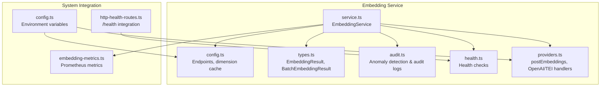
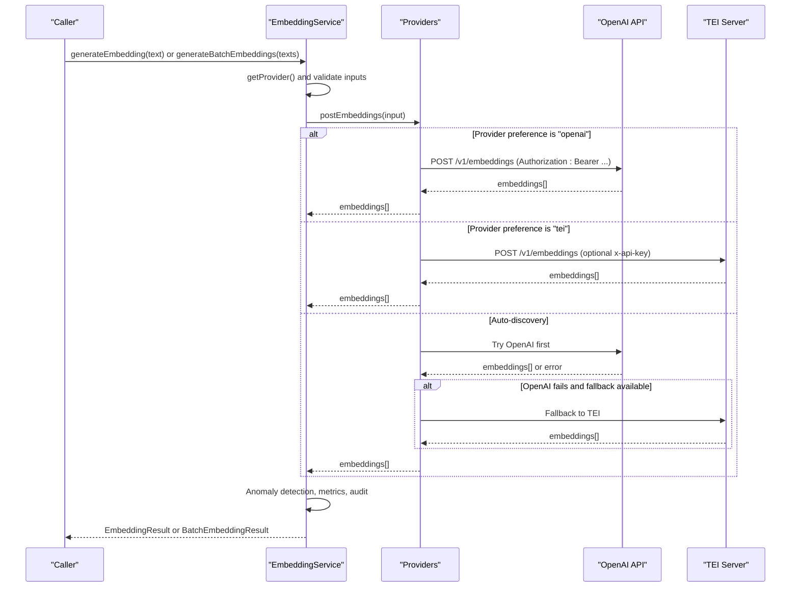
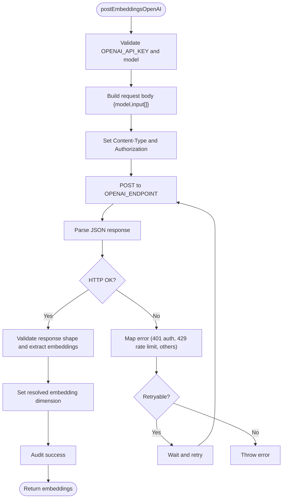
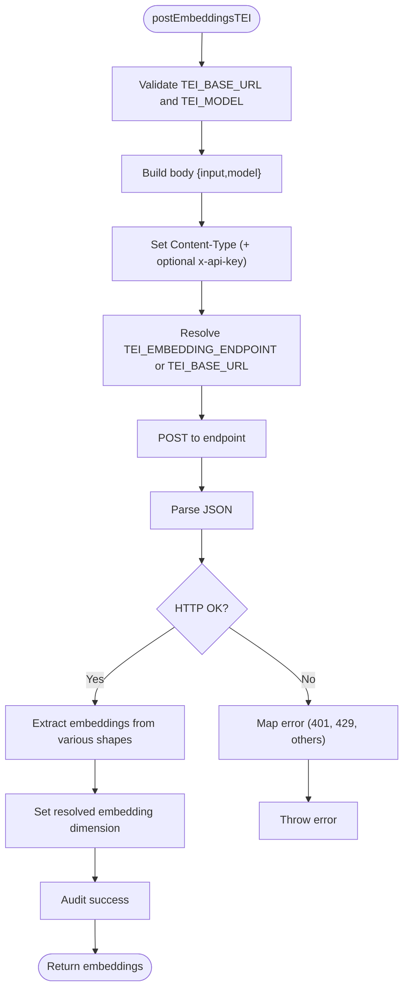
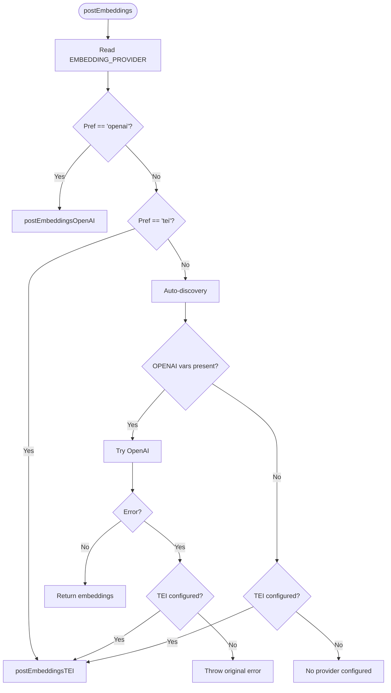
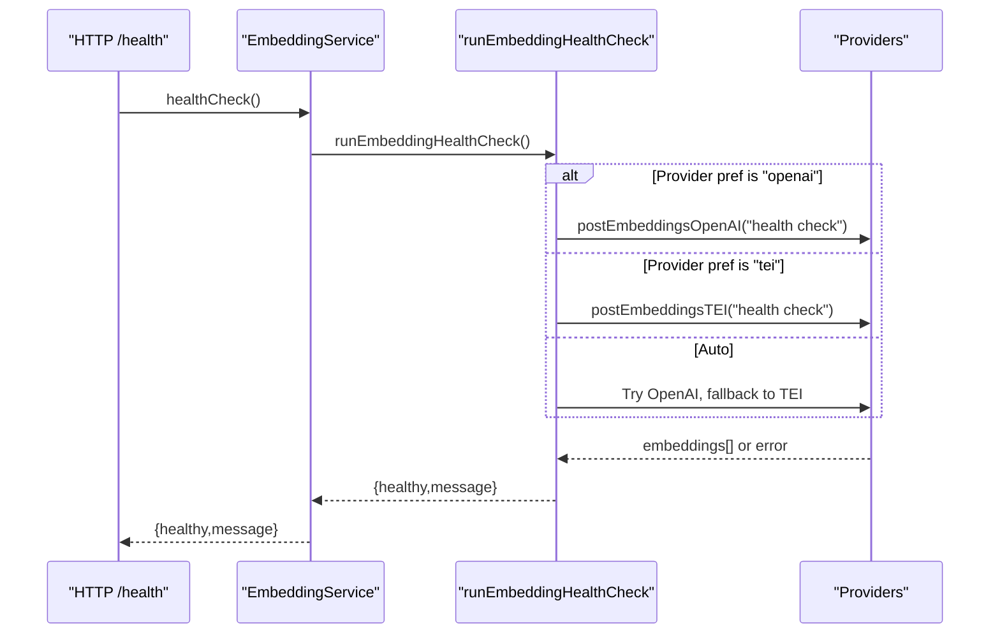
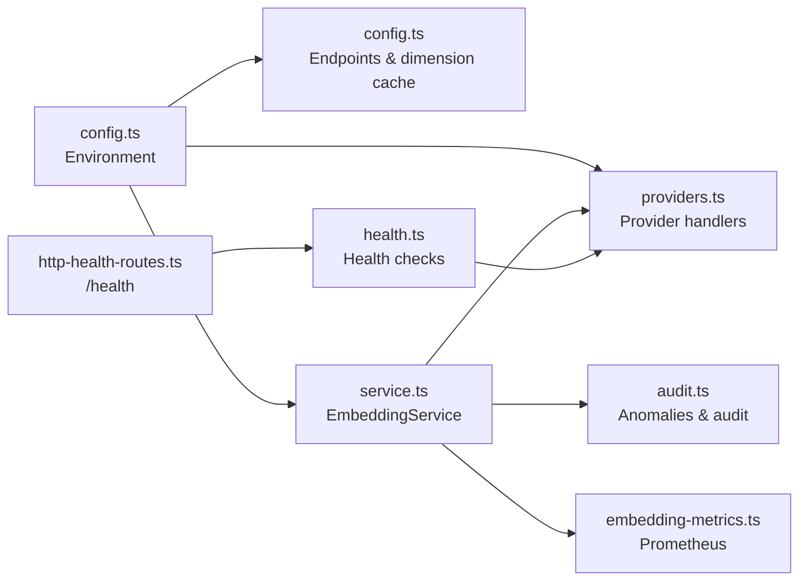

# Provider Implementations

<cite>
**Referenced Files in This Document**
- [providers.ts](file://src/services/embedding/providers.ts)
- [config.ts](file://src/services/embedding/config.ts)
- [service.ts](file://src/services/embedding/service.ts)
- [types.ts](file://src/services/embedding/types.ts)
- [audit.ts](file://src/services/embedding/audit.ts)
- [health.ts](file://src/services/embedding/health.ts)
- [config.ts](file://src/config.ts)
- [embedding-metrics.ts](file://src/services/metrics/embedding-metrics.ts)
- [http-health-routes.ts](file://src/http/http-health-routes.ts)
- [mem-resources-boot-dedupe-regression.test.ts](file://tests/integration/mem-resources-boot-dedupe-regression.test.ts)
- [metrics-endpoint.test.ts](file://tests/integration/metrics-endpoint.test.ts)
</cite>

## Table of Contents
1. [Introduction](#introduction)
2. [Project Structure](#project-structure)
3. [Core Components](#core-components)
4. [Architecture Overview](#architecture-overview)
5. [Detailed Component Analysis](#detailed-component-analysis)
6. [Dependency Analysis](#dependency-analysis)
7. [Performance Considerations](#performance-considerations)
8. [Troubleshooting Guide](#troubleshooting-guide)
9. [Conclusion](#conclusion)
10. [Appendices](#appendices)

## Introduction
This document explains the embedding provider implementations and the abstraction layer that enables pluggable backends. It covers:
- OpenAI embeddings integration: API key authentication, model selection, request formatting, and error handling
- TEI (Text Embeddings Inference) provider: local model serving, HTTP API communication, and model endpoint configuration
- The provider abstraction layer that selects and routes requests to the appropriate backend
- The postEmbeddings function and its role in normalizing provider differences
- Provider-specific optimizations, batch processing, and performance characteristics
- Error responses, rate limiting, and resilience patterns

## Project Structure
The embedding subsystem resides under src/services/embedding and integrates with configuration, metrics, and health endpoints.



**Diagram sources**
- [service.ts:1-293](file://src/services/embedding/service.ts#L1-L293)
- [config.ts:1-40](file://src/services/embedding/config.ts#L1-L40)
- [types.ts:1-17](file://src/services/embedding/types.ts#L1-L17)
- [audit.ts:1-197](file://src/services/embedding/audit.ts#L1-L197)
- [health.ts:1-121](file://src/services/embedding/health.ts#L1-L121)
- [providers.ts:1-280](file://src/services/embedding/providers.ts#L1-L280)
- [config.ts:67-74](file://src/config.ts#L67-L74)
- [embedding-metrics.ts:1-51](file://src/services/metrics/embedding-metrics.ts#L1-L51)
- [http-health-routes.ts:23-44](file://src/http/http-health-routes.ts#L23-L44)

**Section sources**
- [service.ts:1-40](file://src/services/embedding/service.ts#L1-L40)
- [providers.ts:1-20](file://src/services/embedding/providers.ts#L1-L20)
- [config.ts:1-20](file://src/services/embedding/config.ts#L1-L20)

## Core Components
- EmbeddingService: Orchestrates embedding generation, batching, anomaly detection, metrics, and health checks. Exposes generateEmbedding, generateBatchEmbeddings, and helper utilities.
- Providers: Encapsulates provider-specific logic for OpenAI and TEI, including authentication, request formatting, response parsing, and retries.
- Config: Defines endpoints, runtime dimension caching, and environment-driven settings.
- Audit: Provides anomaly detection and structured audit logging for embedding operations.
- Health: Performs provider health checks and reports operational status.
- Types: Defines standardized result structures for single and batch embeddings.

**Section sources**
- [service.ts:38-284](file://src/services/embedding/service.ts#L38-L284)
- [providers.ts:77-278](file://src/services/embedding/providers.ts#L77-L278)
- [config.ts:5-40](file://src/services/embedding/config.ts#L5-L40)
- [audit.ts:94-157](file://src/services/embedding/audit.ts#L94-L157)
- [health.ts:16-119](file://src/services/embedding/health.ts#L16-L119)
- [types.ts:1-17](file://src/services/embedding/types.ts#L1-L17)

## Architecture Overview
The provider abstraction layer centralizes embedding generation behind a single entry point that selects the backend based on configuration and availability.



**Diagram sources**
- [service.ts:47-221](file://src/services/embedding/service.ts#L47-L221)
- [providers.ts:251-278](file://src/services/embedding/providers.ts#L251-L278)
- [config.ts:5-10](file://src/services/embedding/config.ts#L5-L10)
- [config.ts:67-74](file://src/config.ts#L67-L74)

## Detailed Component Analysis

### OpenAI Provider Implementation
- Authentication: Uses Authorization header with Bearer token from OPENAI_API_KEY.
- Model selection: Uses OPENAI_EMBEDDING_MODEL; defaults to a commonly supported model when not set.
- Endpoint: POST to OPENAI_ENDPOINT (/v1/embeddings).
- Request formatting: Sends model and input array; supports both single string and array of strings.
- Error handling: Parses JSON responses, handles non-JSON bodies, and maps HTTP statuses to meaningful errors. Includes retry logic for transient network errors and specific HTTP statuses (429, 502, 503, 504).
- Rate limiting: Detects 429 and surfaces a clear error message.
- Resilience: Uses exponential backoff-like delays between retries and logs warnings.



**Diagram sources**
- [providers.ts:77-175](file://src/services/embedding/providers.ts#L77-L175)
- [config.ts:5-6](file://src/services/embedding/config.ts#L5-L6)
- [config.ts:67-70](file://src/config.ts#L67-L70)

**Section sources**
- [providers.ts:77-175](file://src/services/embedding/providers.ts#L77-L175)
- [config.ts:5-6](file://src/services/embedding/config.ts#L5-L6)
- [config.ts:67-70](file://src/config.ts#L67-L70)

### TEI Provider Implementation
- Authentication: Optional x-api-key header when TEI_API_KEY is configured.
- Endpoint: Uses TEI_EMBEDDING_ENDPOINT derived from TEI_BASE_URL; falls back to TEI_BASE_URL if endpoint is not set.
- Model selection: Uses TEI_MODEL; required for TEI provider.
- Request formatting: Sends input array and model; supports both single string and array of strings.
- Response parsing: Handles multiple TEI server response shapes by attempting to extract embeddings from embeddings, data.embedding, result, or direct arrays.
- Error handling: Logs non-JSON responses, maps HTTP statuses to errors, and detects 401 and 429 conditions.
- Resilience: Uses the same retry mechanism as OpenAI for transient failures.



**Diagram sources**
- [providers.ts:177-249](file://src/services/embedding/providers.ts#L177-L249)
- [config.ts:8-10](file://src/services/embedding/config.ts#L8-L10)
- [config.ts:73-74](file://src/config.ts#L73-L74)

**Section sources**
- [providers.ts:177-249](file://src/services/embedding/providers.ts#L177-L249)
- [config.ts:8-10](file://src/services/embedding/config.ts#L8-L10)
- [config.ts:73-74](file://src/config.ts#L73-L74)

### Provider Abstraction Layer and postEmbeddings
- Selection logic: EMBEDDING_PROVIDER controls explicit provider choice ("openai", "tei"). When set to "auto", the system prefers OpenAI if both OPENAI_API_KEY and OPENAI_EMBEDDING_MODEL are present; otherwise falls back to TEI if configured.
- Fallback behavior: If OpenAI fails and TEI is configured, the system attempts TEI as a fallback.
- Error propagation: Throws descriptive errors when required environment variables are missing or when provider returns unexpected shapes.



**Diagram sources**
- [providers.ts:251-278](file://src/services/embedding/providers.ts#L251-L278)
- [config.ts:71-71](file://src/config.ts#L71-L71)

**Section sources**
- [providers.ts:251-278](file://src/services/embedding/providers.ts#L251-L278)
- [config.ts:71-71](file://src/config.ts#L71-L71)

### EmbeddingService: Provider-Agnostic API
- Single embedding: generateEmbedding validates input, delegates to postEmbeddings, performs anomaly detection, updates metrics, and audits success/error.
- Batch embedding: generateBatchEmbeddings filters empty inputs, tracks batch size, validates dimensions, and records metrics.
- Provider selection: getProvider returns the selected provider based on configuration and environment.
- Configuration inspection: getConfig returns current model, dimension, provider status, and preferences.
- Health: healthCheck delegates to runEmbeddingHealthCheck and is integrated into /health.

```mermaid
classDiagram
class EmbeddingService {
+generateEmbedding(text) EmbeddingResult
+generateBatchEmbeddings(texts) BatchEmbeddingResult
+calculateCosineSimilarity(a,b) number
+generateMemoryEmbedding(memory) number[]
+healthCheck() Promise~{healthy,message}~
+getProvider() "openai|tei|local"
+getConfig() object
-embeddingDimension number
-getModelName(provider) string
}
class Providers {
+postEmbeddings(input) number[][]
+postEmbeddingsOpenAI(input) number[][]
+postEmbeddingsTEI(input) number[][]
}
class Audit {
+logEmbeddingAuditSuccess(payload) void
+logEmbeddingAuditError(payload) void
+detectEmbeddingAnomalies(params) {hasCritical}
}
EmbeddingService --> Providers : "delegates"
EmbeddingService --> Audit : "audits"
```

**Diagram sources**
- [service.ts:38-284](file://src/services/embedding/service.ts#L38-L284)
- [providers.ts:251-278](file://src/services/embedding/providers.ts#L251-L278)
- [audit.ts:60-92](file://src/services/embedding/audit.ts#L60-L92)

**Section sources**
- [service.ts:47-221](file://src/services/embedding/service.ts#L47-L221)
- [service.ts:254-283](file://src/services/embedding/service.ts#L254-L283)
- [audit.ts:60-92](file://src/services/embedding/audit.ts#L60-L92)

### Health Checks and Integration
- runEmbeddingHealthCheck: Validates provider configuration, attempts a small embedding request, and returns a health status with a message. Distinguishes between authentication failures, rate limits, and other errors.
- /health integration: The health route bounds embedding health checks with a timeout to keep the endpoint responsive.



**Diagram sources**
- [health.ts:16-119](file://src/services/embedding/health.ts#L16-L119)
- [http-health-routes.ts:23-44](file://src/http/http-health-routes.ts#L23-L44)

**Section sources**
- [health.ts:16-119](file://src/services/embedding/health.ts#L16-L119)
- [http-health-routes.ts:23-44](file://src/http/http-health-routes.ts#L23-L44)

## Dependency Analysis
- Environment configuration drives provider selection and endpoints.
- EmbeddingService depends on Providers for actual embedding calls and on Audit/Metrics for observability.
- Health checks depend on Providers to validate connectivity and basic operation.



**Diagram sources**
- [config.ts:67-74](file://src/config.ts#L67-L74)
- [config.ts:5-10](file://src/services/embedding/config.ts#L5-L10)
- [providers.ts:251-278](file://src/services/embedding/providers.ts#L251-L278)
- [service.ts:38-284](file://src/services/embedding/service.ts#L38-L284)
- [audit.ts:94-157](file://src/services/embedding/audit.ts#L94-L157)
- [embedding-metrics.ts:11-47](file://src/services/metrics/embedding-metrics.ts#L11-L47)
- [health.ts:16-119](file://src/services/embedding/health.ts#L16-L119)
- [http-health-routes.ts:23-44](file://src/http/http-health-routes.ts#L23-L44)

**Section sources**
- [config.ts:67-74](file://src/config.ts#L67-L74)
- [providers.ts:251-278](file://src/services/embedding/providers.ts#L251-L278)
- [service.ts:38-284](file://src/services/embedding/service.ts#L38-L284)

## Performance Considerations
- Batch processing: generateBatchEmbeddings accepts arrays of strings, reducing overhead and enabling throughput scaling.
- Vector size tracking: Metrics record vector sizes in bytes, useful for capacity planning.
- Latency monitoring: Histograms track embedding durations per provider and tenant.
- Dimension caching: setResolvedEmbeddingDimension caches the first resolved dimension and validates subsequent calls, preventing mismatches and redundant work.
- Retries and timeouts: Built-in retry logic for transient network errors and bounded health checks prevent cascading failures.

**Section sources**
- [service.ts:129-221](file://src/services/embedding/service.ts#L129-L221)
- [embedding-metrics.ts:11-47](file://src/services/metrics/embedding-metrics.ts#L11-L47)
- [config.ts:12-31](file://src/services/embedding/config.ts#L12-L31)
- [http-health-routes.ts:23-44](file://src/http/http-health-routes.ts#L23-L44)

## Troubleshooting Guide
Common issues and resolutions:
- Missing configuration
  - Symptom: Errors indicating missing OPENAI_API_KEY/OPENAI_EMBEDDING_MODEL or TEI_BASE_URL/TEI_MODEL.
  - Resolution: Set required environment variables according to configuration.
- Authentication failures
  - Symptom: 401 errors from OpenAI or TEI.
  - Resolution: Verify OPENAI_API_KEY or TEI_API_KEY and ensure correct model names.
- Rate limiting
  - Symptom: 429 errors.
  - Resolution: Implement client-side backoff or reduce request frequency; consider switching providers.
- Non-JSON responses
  - Symptom: Errors indicating non-JSON responses.
  - Resolution: Check provider endpoint configuration and network stability.
- Unexpected response shape
  - Symptom: Errors indicating unexpected embedding shape.
  - Resolution: Confirm TEI response compatibility; the provider handler attempts multiple shapes but may require server adjustments.
- Dimension mismatch
  - Symptom: Errors about embedding dimension mismatch.
  - Resolution: Ensure consistent model usage and call probeEmbeddingDimension at startup to cache the dimension.

Operational checks:
- Use EmbeddingService.getConfig to inspect current provider and dimension.
- Use EmbeddingService.healthCheck to validate connectivity and status.
- Review audit logs for anomaly events and error messages.

**Section sources**
- [providers.ts:77-175](file://src/services/embedding/providers.ts#L77-L175)
- [providers.ts:177-249](file://src/services/embedding/providers.ts#L177-L249)
- [audit.ts:94-157](file://src/services/embedding/audit.ts#L94-L157)
- [health.ts:16-119](file://src/services/embedding/health.ts#L16-L119)
- [service.ts:267-283](file://src/services/embedding/service.ts#L267-L283)

## Conclusion
The embedding subsystem provides a robust, pluggable abstraction over OpenAI and TEI. It centralizes provider selection, authentication, request formatting, error handling, and observability. The postEmbeddings function ensures provider differences are hidden behind a consistent interface, while EmbeddingService adds batching, anomaly detection, metrics, and health checks. Proper configuration and dimension probing are essential for reliable operation.

## Appendices

### Environment Variables and Settings
- OPENAI_API_KEY: OpenAI API key for authentication.
- OPENAI_EMBEDDING_MODEL: Model identifier for OpenAI embeddings.
- OPENAI_API_URL: Base URL for OpenAI API (no trailing slash).
- EMBEDDING_PROVIDER: Provider preference ("auto", "openai", "tei").
- TEI_BASE_URL: Base URL for TEI server.
- TEI_MODEL: Model identifier for TEI.
- TEI_API_KEY: Optional API key for TEI.
- EMBEDDING_LATENCY_WARN_MS: Threshold for embedding latency warnings.
- EMBEDDING_NORM_MIN, EMBEDDING_NORM_MAX: Expected vector norm bounds.
- SEARCH_SCORE_WARN_THRESHOLD: Threshold for search score warnings.

**Section sources**
- [config.ts:67-83](file://src/config.ts#L67-L83)

### Startup Dimension Probing
- Call probeEmbeddingDimension at application startup to resolve and cache the embedding dimension before initializing dependent components like Qdrant stores.

**Section sources**
- [service.ts:288-292](file://src/services/embedding/service.ts#L288-L292)
- [mem-resources-boot-dedupe-regression.test.ts:29-29](file://tests/integration/mem-resources-boot-dedupe-regression.test.ts#L29-L29)

### Metrics Exposure
- Embedding metrics are exposed via the metrics endpoint and include counters and histograms for requests, duration, errors, vector sizes, and batch sizes.

**Section sources**
- [embedding-metrics.ts:11-47](file://src/services/metrics/embedding-metrics.ts#L11-L47)
- [metrics-endpoint.test.ts:70-78](file://tests/integration/metrics-endpoint.test.ts#L70-L78)