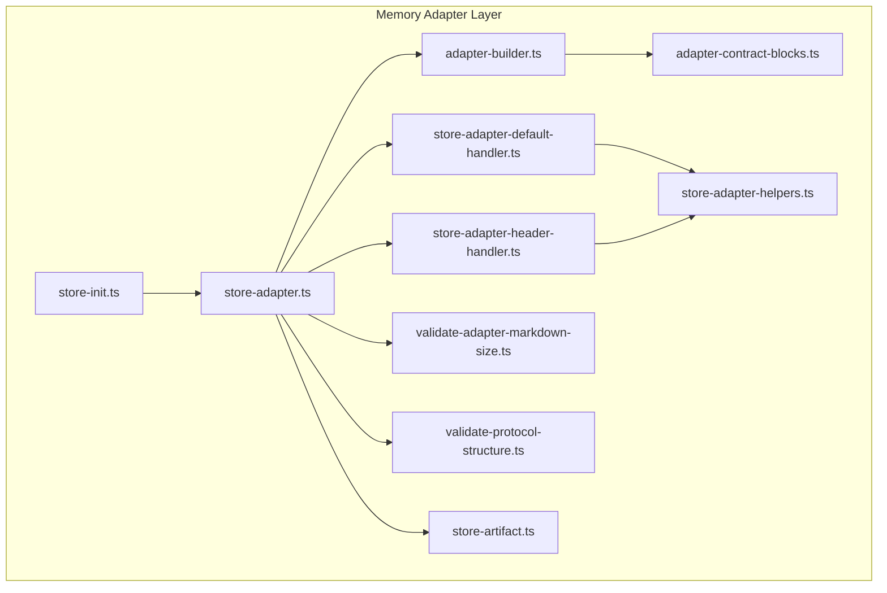
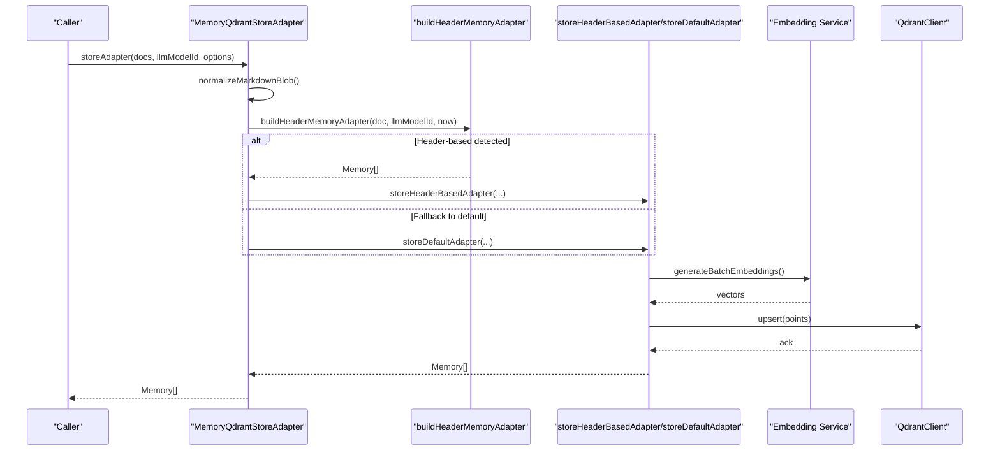
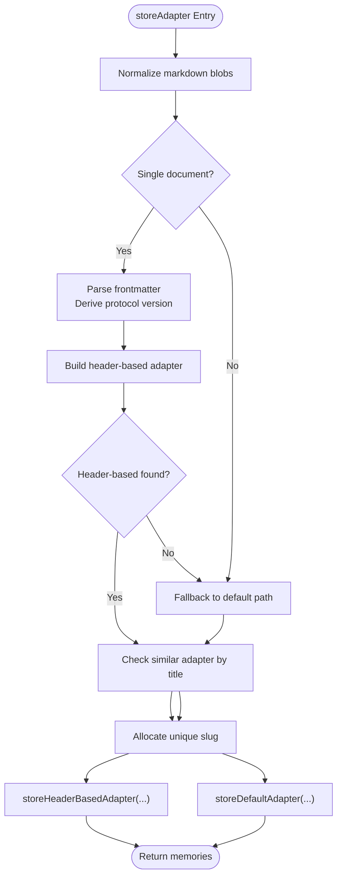
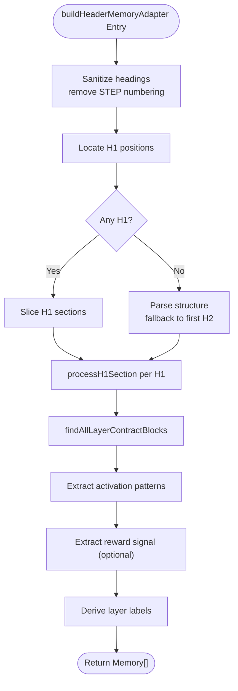
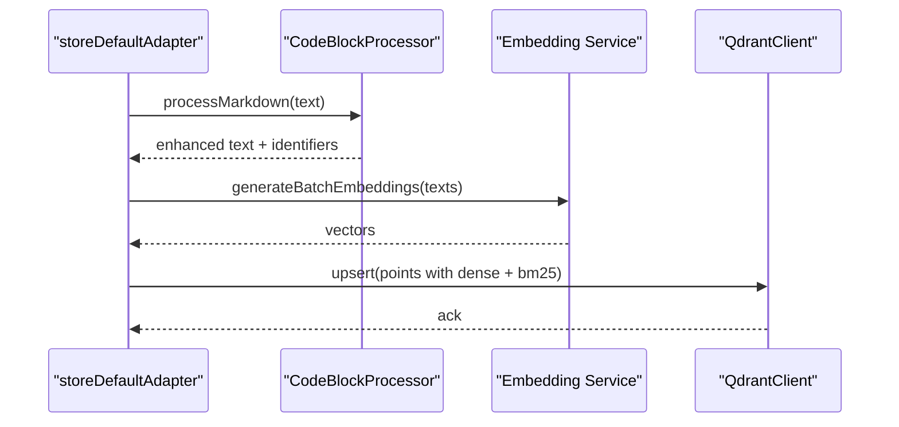
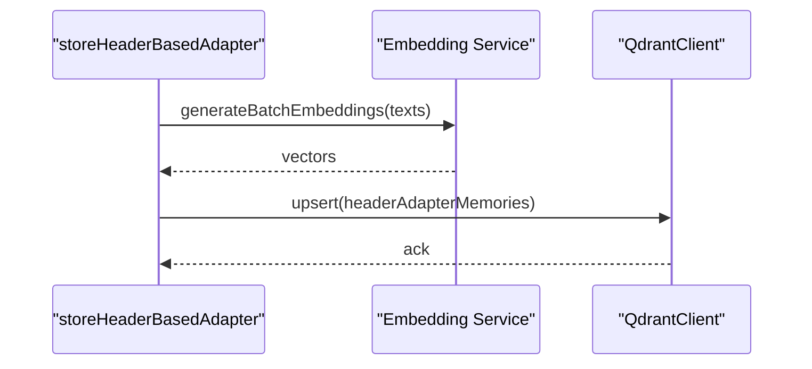
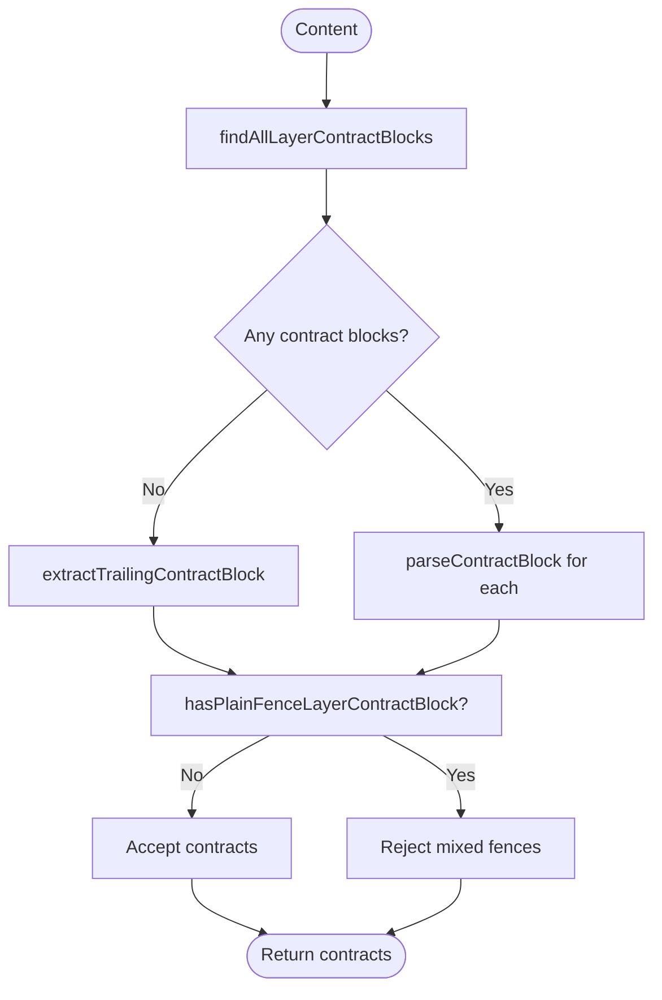
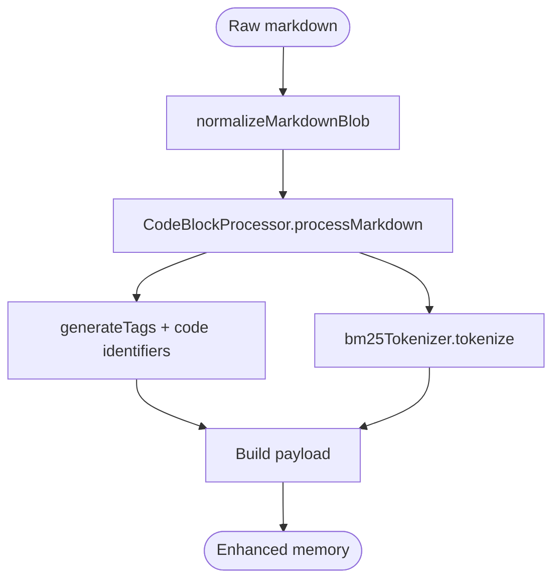
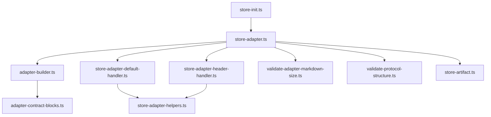

# Adapter Pattern Implementation

<cite>
**Referenced Files in This Document**
- [store-adapter.ts](file://src/services/memory/store-adapter.ts)
- [adapter-builder.ts](file://src/services/memory/adapter-builder.ts)
- [store-adapter-default-handler.ts](file://src/services/memory/store-adapter-default-handler.ts)
- [store-adapter-header-handler.ts](file://src/services/memory/store-adapter-header-handler.ts)
- [adapter-contract-blocks.ts](file://src/services/memory/adapter-contract-blocks.ts)
- [store-adapter-helpers.ts](file://src/services/memory/store-adapter-helpers.ts)
- [validate-adapter-markdown-size.ts](file://src/services/memory/validate-adapter-markdown-size.ts)
- [validate-protocol-structure.ts](file://src/services/memory/validate-protocol-structure.ts)
- [store-artifact.ts](file://src/services/memory/store-artifact.ts)
- [store-init.ts](file://src/services/memory/store-init.ts)
- [adapter-example-all-types.md](file://docs/examples/adapter-example-all-types.md)
- [adapter-example-mcp.md](file://docs/examples/adapter-example-mcp.md)
- [adapter-example-shell.md](file://docs/examples/adapter-example-shell.md)
- [adapter-markdown-size-limits.ts](file://src/config/adapter-markdown-size-limits.ts)
</cite>

## Table of Contents
1. [Introduction](#introduction)
2. [Project Structure](#project-structure)
3. [Core Components](#core-components)
4. [Architecture Overview](#architecture-overview)
5. [Detailed Component Analysis](#detailed-component-analysis)
6. [Dependency Analysis](#dependency-analysis)
7. [Performance Considerations](#performance-considerations)
8. [Troubleshooting Guide](#troubleshooting-guide)
9. [Conclusion](#conclusion)
10. [Appendices](#appendices)

## Introduction
This document explains the adapter pattern implementation used in memory storage. It covers the adapter builder system, contract blocks processing, and handler implementations for both default and header-based adapters. It also documents the markdown processing pipeline, content transformation workflows, adapter contract validation, block parsing, and content sanitization processes. Finally, it describes adapter registration, configuration options, customization capabilities, lifecycle management, error handling, and performance considerations.

## Project Structure
The adapter pattern is implemented in the memory service under src/services/memory. Key modules include:
- Adapter orchestration and entry points
- Builder for header-based adapters
- Handlers for default and header-based storage
- Contract block parsing and validation
- Helpers for slug allocation, duplicates, and similarity checks
- Artifact storage and initialization utilities
- Size and structure validators



**Diagram sources**
- [store-adapter.ts:43-148](file://src/services/memory/store-adapter.ts#L43-L148)
- [adapter-builder.ts:212-257](file://src/services/memory/adapter-builder.ts#L212-L257)
- [store-adapter-default-handler.ts:34-256](file://src/services/memory/store-adapter-default-handler.ts#L34-L256)
- [store-adapter-header-handler.ts:30-203](file://src/services/memory/store-adapter-header-handler.ts#L30-L203)
- [adapter-contract-blocks.ts:51-117](file://src/services/memory/adapter-contract-blocks.ts#L51-L117)
- [store-adapter-helpers.ts:112-172](file://src/services/memory/store-adapter-helpers.ts#L112-L172)
- [validate-adapter-markdown-size.ts:33-108](file://src/services/memory/validate-adapter-markdown-size.ts#L33-L108)
- [validate-protocol-structure.ts:113-186](file://src/services/memory/validate-protocol-structure.ts#L113-L186)
- [store-artifact.ts:168-300](file://src/services/memory/store-artifact.ts#L168-L300)
- [store-init.ts:171-348](file://src/services/memory/store-init.ts#L171-L348)

**Section sources**
- [store-adapter.ts:43-148](file://src/services/memory/store-adapter.ts#L43-L148)
- [adapter-builder.ts:212-257](file://src/services/memory/adapter-builder.ts#L212-L257)
- [store-adapter-default-handler.ts:34-256](file://src/services/memory/store-adapter-default-handler.ts#L34-L256)
- [store-adapter-header-handler.ts:30-203](file://src/services/memory/store-adapter-header-handler.ts#L30-L203)
- [adapter-contract-blocks.ts:51-117](file://src/services/memory/adapter-contract-blocks.ts#L51-L117)
- [store-adapter-helpers.ts:112-172](file://src/services/memory/store-adapter-helpers.ts#L112-L172)
- [validate-adapter-markdown-size.ts:33-108](file://src/services/memory/validate-adapter-markdown-size.ts#L33-L108)
- [validate-protocol-structure.ts:113-186](file://src/services/memory/validate-protocol-structure.ts#L113-L186)
- [store-artifact.ts:168-300](file://src/services/memory/store-artifact.ts#L168-L300)
- [store-init.ts:171-348](file://src/services/memory/store-init.ts#L171-L348)

## Core Components
- MemoryQdrantStoreAdapter: Orchestrates adapter storage, normalizes markdown, parses frontmatter, decides between header-based and default processing, and delegates to appropriate handlers.
- Adapter builder: Parses markdown into H1 sections, identifies contract blocks, sanitizes headings, extracts activation patterns and reward signals, and builds layer memories.
- Handlers:
  - Default handler: Stores one memory per document with activation-aware embeddings and sparse BM25 indexing.
  - Header-based handler: Stores memories grouped by H1/H2 segments with layer metadata and optional reward signal propagation.
- Contract blocks parser: Finds and validates JSON contract blocks, rejects mixed fences, and supports trailing contract extraction.
- Helpers: Duplicate detection, slug allocation, similarity guard, domain/task/type derivation.
- Validators: Size limits for markdown and artifacts, protocol structure validation.
- Artifact storage: Attaches artifacts to adapters with MIME-aware metadata and deduplication.
- Initialization: Ensures Qdrant collection has required vectors, BM25 support, and full-text indexes.

**Section sources**
- [store-adapter.ts:35-154](file://src/services/memory/store-adapter.ts#L35-L154)
- [adapter-builder.ts:75-210](file://src/services/memory/adapter-builder.ts#L75-L210)
- [store-adapter-default-handler.ts:34-256](file://src/services/memory/store-adapter-default-handler.ts#L34-L256)
- [store-adapter-header-handler.ts:30-203](file://src/services/memory/store-adapter-header-handler.ts#L30-L203)
- [adapter-contract-blocks.ts:51-117](file://src/services/memory/adapter-contract-blocks.ts#L51-L117)
- [store-adapter-helpers.ts:112-254](file://src/services/memory/store-adapter-helpers.ts#L112-L254)
- [validate-adapter-markdown-size.ts:33-127](file://src/services/memory/validate-adapter-markdown-size.ts#L33-L127)
- [validate-protocol-structure.ts:113-186](file://src/services/memory/validate-protocol-structure.ts#L113-L186)
- [store-artifact.ts:168-300](file://src/services/memory/store-artifact.ts#L168-L300)
- [store-init.ts:171-348](file://src/services/memory/store-init.ts#L171-L348)

## Architecture Overview
The adapter pattern follows a layered design:
- Entry point: MemoryQdrantStoreAdapter.storeAdapter orchestrates processing.
- Parsing: Header-based builder extracts H1 sections and contract blocks; default path uses single memory per document.
- Transformation: CodeBlockProcessor enhances content for embeddings; BM25 tokenizer generates sparse vectors.
- Storage: Handlers compute embeddings and payload, upsert into Qdrant, and invalidate caches.
- Validation: Size and structure validators protect ingestion; helpers prevent duplicates and manage slugs.



**Diagram sources**
- [store-adapter.ts:43-148](file://src/services/memory/store-adapter.ts#L43-L148)
- [adapter-builder.ts:212-257](file://src/services/memory/adapter-builder.ts#L212-L257)
- [store-adapter-default-handler.ts:34-256](file://src/services/memory/store-adapter-default-handler.ts#L34-L256)
- [store-adapter-header-handler.ts:30-203](file://src/services/memory/store-adapter-header-handler.ts#L30-L203)

## Detailed Component Analysis

### Adapter Orchestration and Lifecycle
- Normalization: Input markdown is normalized before processing.
- Frontmatter parsing: Single-doc mode parses frontmatter to derive protocol version and slug candidates.
- Header detection: If H1 sections and contract blocks are present, header-based adapter is built; otherwise, default path stores one memory per document.
- Similarity guard: Pre-train similarity check prevents accidental duplication by title.
- Slug allocation: Unique slug minting ensures protocol identity across spaces.
- Handler dispatch: Delegates to header-based or default handler depending on detected structure.
- Persistence: Qdrant upsert with dense and sparse vectors; cache invalidation; metrics updates.



**Diagram sources**
- [store-adapter.ts:43-148](file://src/services/memory/store-adapter.ts#L43-L148)
- [store-adapter-helpers.ts:112-172](file://src/services/memory/store-adapter-helpers.ts#L112-L172)

**Section sources**
- [store-adapter.ts:43-148](file://src/services/memory/store-adapter.ts#L43-L148)
- [store-adapter-helpers.ts:112-172](file://src/services/memory/store-adapter-helpers.ts#L112-L172)

### Header-Based Adapter Builder
- Heading sanitization: Removes STEP numbering and reordering markers from H2 headings to preserve layer order.
- Section segmentation: Splits content by H1 boundaries; each H1 becomes an adapter with ordered layers.
- Contract block parsing: Uses findAllLayerContractBlocks to split content into layers; trailing contract extraction for optional final layer.
- Activation patterns: Extracted from a dedicated H2 section and propagated to adapter metadata.
- Reward signal: Optional section captured and attached to all layers.
- Label derivation: Uses first H2 title or falls back to adapter title; generates layer labels from segments.



**Diagram sources**
- [adapter-builder.ts:13-210](file://src/services/memory/adapter-builder.ts#L13-L210)

**Section sources**
- [adapter-builder.ts:13-210](file://src/services/memory/adapter-builder.ts#L13-L210)
- [adapter-contract-blocks.ts:51-117](file://src/services/memory/adapter-contract-blocks.ts#L51-L117)

### Default Adapter Handler
- One-memory-per-document storage with activation-aware embeddings.
- Enhanced content generation via CodeBlockProcessor for improved retrieval.
- Dense vectors: primary, title, and activation pattern vectors computed in batches.
- Sparse BM25 indexing: Tokenized sparse representation for hybrid search.
- Payload construction: Includes adapter metadata, labels, tags, inference contract, and quality metadata.
- Upsert with fallback: Retries without BM25 if sparse vectors are unsupported.
- Metrics and cache: Updates memory store metrics and invalidates caches.



**Diagram sources**
- [store-adapter-default-handler.ts:34-256](file://src/services/memory/store-adapter-default-handler.ts#L34-L256)

**Section sources**
- [store-adapter-default-handler.ts:34-256](file://src/services/memory/store-adapter-default-handler.ts#L34-L256)

### Header-Based Adapter Handler
- Uses pre-built Memory[] from the builder with layer metadata.
- Computes embeddings for each memory and constructs payload with adapter metadata.
- Supports reward signal propagation across layers.
- Slug and adapter UUID resolution; handles duplicate adapters via forceUpdate.
- Upsert with BM25 fallback and cache invalidation.



**Diagram sources**
- [store-adapter-header-handler.ts:30-203](file://src/services/memory/store-adapter-header-handler.ts#L30-L203)

**Section sources**
- [store-adapter-header-handler.ts:30-203](file://src/services/memory/store-adapter-header-handler.ts#L30-L203)

### Contract Blocks Processing
- JSON contract block detection: Finds fenced ```json blocks and validates structure.
- Trailing contract extraction: Supports extracting a single contract from the end of content.
- Mixed fence rejection: Detects plain ``` blocks with contract JSON and flags as invalid.
- Allowed contract types: Enforces specific types for contracts (e.g., shell, mcp, user_input, comment, tensor).



**Diagram sources**
- [adapter-contract-blocks.ts:51-117](file://src/services/memory/adapter-contract-blocks.ts#L51-L117)

**Section sources**
- [adapter-contract-blocks.ts:51-117](file://src/services/memory/adapter-contract-blocks.ts#L51-L117)

### Content Transformation Workflows
- Markdown normalization: Cleans and standardizes input before processing.
- Code block enhancement: Identifies and enriches code snippets for embeddings.
- Tag generation: Creates tags from base content and code identifiers.
- Sparse tokenization: BM25 tokenizer converts text to sparse vectors.
- Quality metadata: Calculates task/type and quality metadata for each memory.



**Diagram sources**
- [adapter-builder.ts:82-210](file://src/services/memory/adapter-builder.ts#L82-L210)
- [store-adapter-default-handler.ts:50-106](file://src/services/memory/store-adapter-default-handler.ts#L50-L106)

**Section sources**
- [adapter-builder.ts:82-210](file://src/services/memory/adapter-builder.ts#L82-L210)
- [store-adapter-default-handler.ts:50-106](file://src/services/memory/store-adapter-default-handler.ts#L50-L106)

### Adapter Registration, Configuration, and Customization
- Adapter UUID generation:
  - Fork mode: Random UUID for new adapters.
  - Title-based mode: Deterministic UUID derived from adapter title.
- Slug allocation:
  - Author-supplied slugs: Collision-checked against other adapters in the same space.
  - Auto slugs: Iteratively suffixed until unique.
- Duplicate handling:
  - Throws error if duplicate exists and forceUpdate is false.
  - Deletes existing adapter when forceUpdate is true (with protection for protected spaces).
- Similarity guard:
  - Hybrid/vector similarity search on adapter titles before training.
- Configuration options:
  - StoreAdapterOptions: forceUpdate, protocolVersion, forkNewAdapter.
  - Size limits configurable via environment variables for adapter Markdown and artifacts.

**Section sources**
- [store-adapter.ts:18-23](file://src/services/memory/store-adapter.ts#L18-L23)
- [store-adapter-helpers.ts:49-93](file://src/services/memory/store-adapter-helpers.ts#L49-L93)
- [store-adapter-helpers.ts:201-254](file://src/services/memory/store-adapter-helpers.ts#L201-L254)
- [adapter-markdown-size-limits.ts:29-40](file://src/config/adapter-markdown-size-limits.ts#L29-L40)

### Practical Examples
- All challenge types: Demonstrates shell, mcp, user_input, and comment contracts in a single adapter with activation patterns and reward signal.
- MCP challenge: Minimal adapter with a single MCP step and verification.
- Shell challenge: Single shell step with exit code validation and reward signal.

**Section sources**
- [adapter-example-all-types.md:1-81](file://docs/examples/adapter-example-all-types.md#L1-L81)
- [adapter-example-mcp.md:1-53](file://docs/examples/adapter-example-mcp.md#L1-L53)
- [adapter-example-shell.md:1-33](file://docs/examples/adapter-example-shell.md#L1-L33)

## Dependency Analysis
Key dependencies and relationships:
- MemoryQdrantStoreAdapter depends on builder, handlers, helpers, validators, and artifact storage.
- Builders depend on contract block parsing and utilities.
- Handlers depend on embedding service, BM25 tokenizer, and vector naming utilities.
- Helpers encapsulate Qdrant filters, slug allocation, and similarity checks.
- Validators enforce ingestion policies; initialization ensures Qdrant schema compatibility.



**Diagram sources**
- [store-adapter.ts:1-154](file://src/services/memory/store-adapter.ts#L1-L154)
- [adapter-builder.ts:1-258](file://src/services/memory/adapter-builder.ts#L1-L258)
- [store-adapter-default-handler.ts:1-257](file://src/services/memory/store-adapter-default-handler.ts#L1-L257)
- [store-adapter-header-handler.ts:1-204](file://src/services/memory/store-adapter-header-handler.ts#L1-L204)
- [adapter-contract-blocks.ts:1-117](file://src/services/memory/adapter-contract-blocks.ts#L1-L117)
- [store-adapter-helpers.ts:1-255](file://src/services/memory/store-adapter-helpers.ts#L1-L255)
- [validate-adapter-markdown-size.ts:1-127](file://src/services/memory/validate-adapter-markdown-size.ts#L1-L127)
- [validate-protocol-structure.ts:1-187](file://src/services/memory/validate-protocol-structure.ts#L1-L187)
- [store-artifact.ts:1-301](file://src/services/memory/store-artifact.ts#L1-L301)
- [store-init.ts:1-348](file://src/services/memory/store-init.ts#L1-L348)

**Section sources**
- [store-adapter.ts:1-154](file://src/services/memory/store-adapter.ts#L1-L154)
- [adapter-builder.ts:1-258](file://src/services/memory/adapter-builder.ts#L1-L258)
- [store-adapter-default-handler.ts:1-257](file://src/services/memory/store-adapter-default-handler.ts#L1-L257)
- [store-adapter-header-handler.ts:1-204](file://src/services/memory/store-adapter-header-handler.ts#L1-L204)
- [adapter-contract-blocks.ts:1-117](file://src/services/memory/adapter-contract-blocks.ts#L1-L117)
- [store-adapter-helpers.ts:1-255](file://src/services/memory/store-adapter-helpers.ts#L1-L255)
- [validate-adapter-markdown-size.ts:1-127](file://src/services/memory/validate-adapter-markdown-size.ts#L1-L127)
- [validate-protocol-structure.ts:1-187](file://src/services/memory/validate-protocol-structure.ts#L1-L187)
- [store-artifact.ts:1-301](file://src/services/memory/store-artifact.ts#L1-L301)
- [store-init.ts:1-348](file://src/services/memory/store-init.ts#L1-L348)

## Performance Considerations
- Batch embeddings: Handlers compute embeddings in batches to reduce overhead.
- Sparse vector fallback: Automatic retry without BM25 when sparse vectors are unsupported.
- Vector migration: Initialization migrates and adds named vectors safely; preserves required vectors.
- Caching: Redis cache invalidation after updates reduces stale reads.
- Size limits: Early validation prevents oversized documents from entering the pipeline.

[No sources needed since this section provides general guidance]

## Troubleshooting Guide
Common issues and resolutions:
- Duplicate adapter: Use forceUpdate to replace; protected spaces are guarded.
- Similar adapter found: Adjust adapter title or use forceUpdate with the same adapter id.
- Slug conflicts: Use auto-suffixed slugs or choose a unique author-supplied slug.
- Vector configuration errors: Initialization ensures BM25 and named vectors; logs indicate migration steps.
- Mixed contract fences: Ensure only ```json fenced blocks contain contracts.
- Size limits exceeded: Reduce line count or total bytes; adjust environment variables.

**Section sources**
- [store-adapter-helpers.ts](file://src/services/memory/store-adapter-helpers.ts#L52-L93)
- [store-adapter-helpers.ts](file://src/services/memory/store-adapter-helpers.ts#L112-L172)
- [store-adapter-helpers.ts](file://src/services/memory/store-adapter-helpers.ts#L201-L254)
- [store-init.ts](file://src/services/memory/store-init.ts#L130-L148)
- [validate-protocol-structure.ts](file://src/services/memory/validate-protocol-structure.ts#L144-L160)
- [validate-adapter-markdown-size.ts](file://src/services/memory/validate-adapter-markdown-size.ts#L40-L108)

## Conclusion
The adapter pattern implementation provides a robust, validated pipeline for ingesting structured protocols into memory. It supports both header-based and default storage modes, enforces strict contract validation, and integrates seamlessly with Qdrant vector and payload indexing. With comprehensive helpers for slug allocation, duplicate handling, and similarity checks, it ensures reliable adapter lifecycle management while maintaining strong performance characteristics.

[No sources needed since this section summarizes without analyzing specific files]

## Appendices

### Adapter Contract Validation Checklist
- Required sections: Activation Patterns (first H2), Reward Signal (last H2), at least one ```json contract block.
- Fence consistency: Only ```json fenced blocks may contain contracts.
- Contract type: Must be one of allowed types (shell, mcp, user_input, comment, tensor).
- Structure: Multi-H1 documents must validate each H1 section’s first and last H2.

**Section sources**
- [validate-protocol-structure.ts:113-186](file://src/services/memory/validate-protocol-structure.ts#L113-L186)
- [adapter-contract-blocks.ts:79-117](file://src/services/memory/adapter-contract-blocks.ts#L79-L117)

### Configuration Options Reference
- StoreAdapterOptions:
  - forceUpdate: Replace existing adapter when duplicates are detected.
  - protocolVersion: Override protocol version for stored memories.
  - forkNewAdapter: Allocate a new adapter id instead of title-derived v5.
- Size limits:
  - KAIROS_ADAPTER_MARKDOWN_MAX_LINES
  - KAIROS_ADAPTER_MARKDOWN_MAX_LINE_BYTES
  - KAIROS_ADAPTER_MARKDOWN_SIZE_SAFETY_FACTOR

**Section sources**
- [store-adapter.ts:18-23](file://src/services/memory/store-adapter.ts#L18-L23)
- [adapter-markdown-size-limits.ts:29-40](file://src/config/adapter-markdown-size-limits.ts#L29-L40)