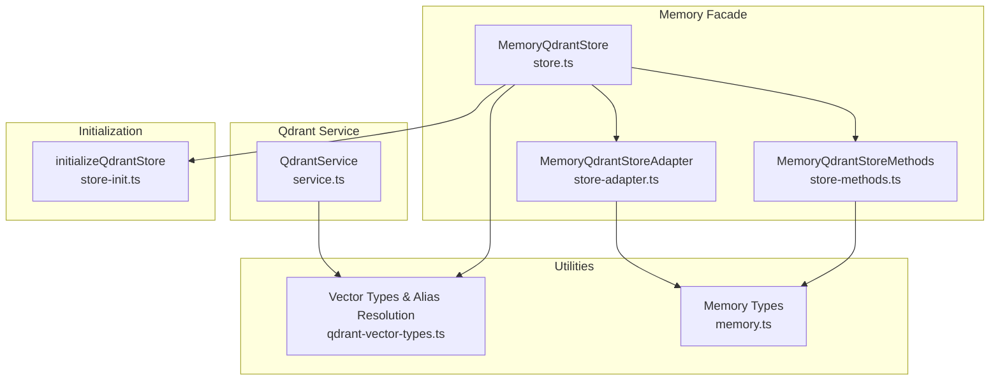
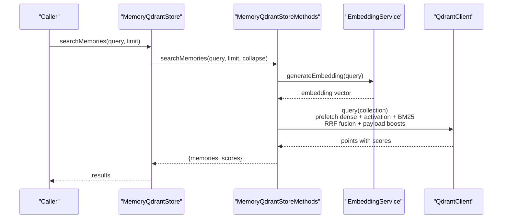
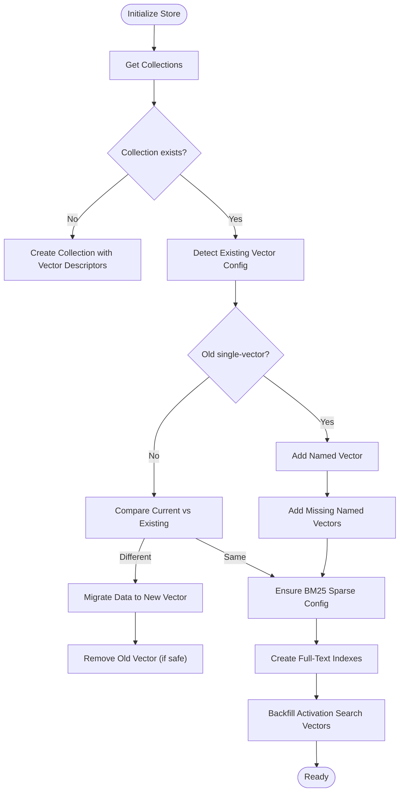
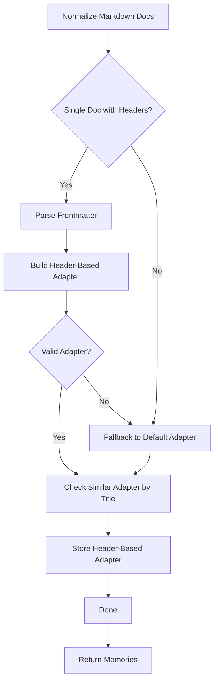
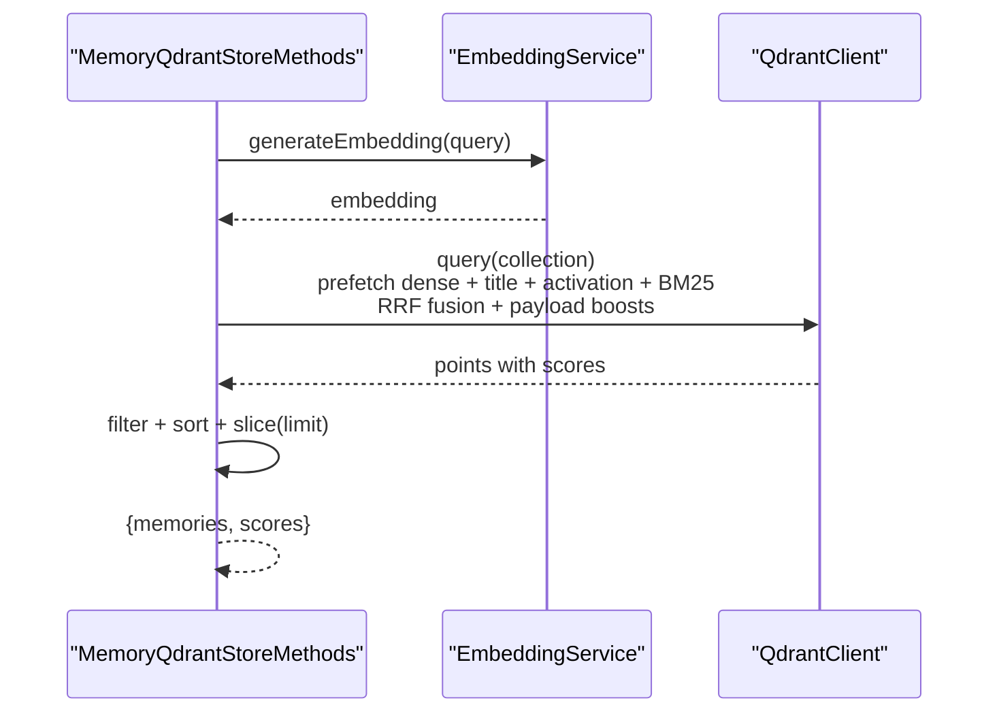
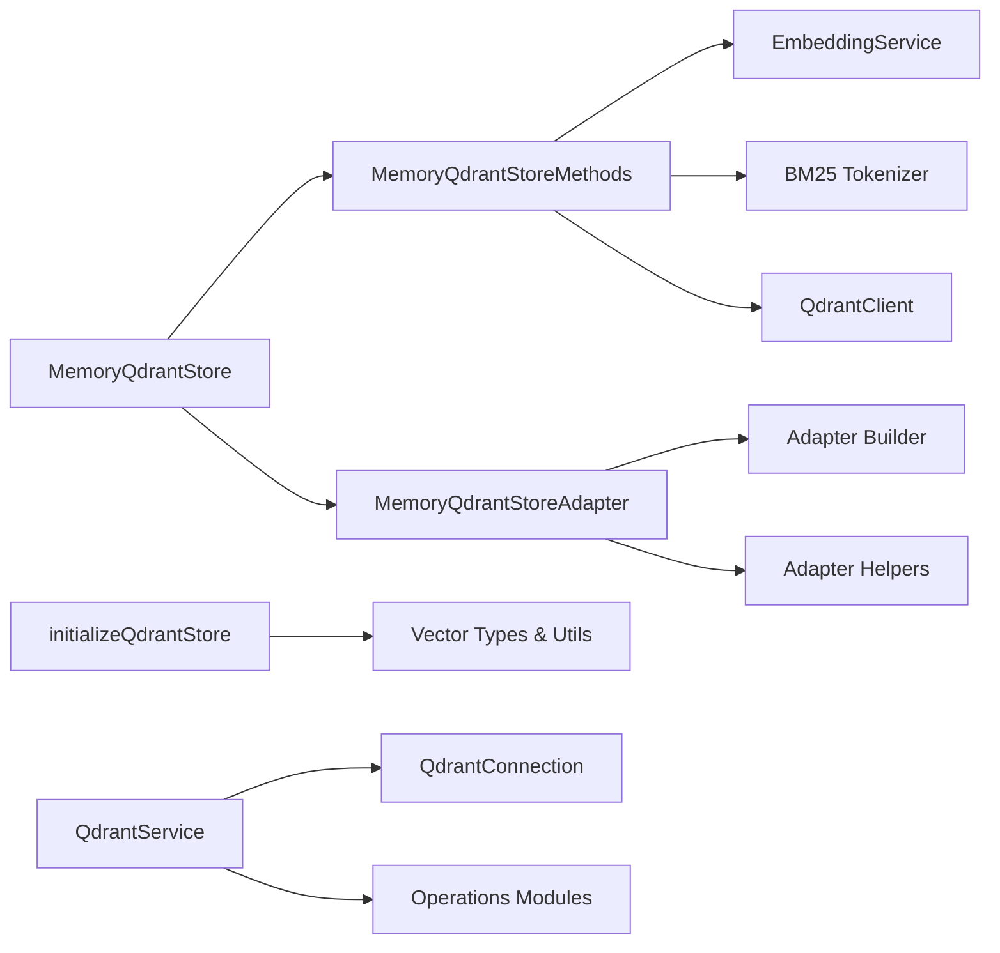
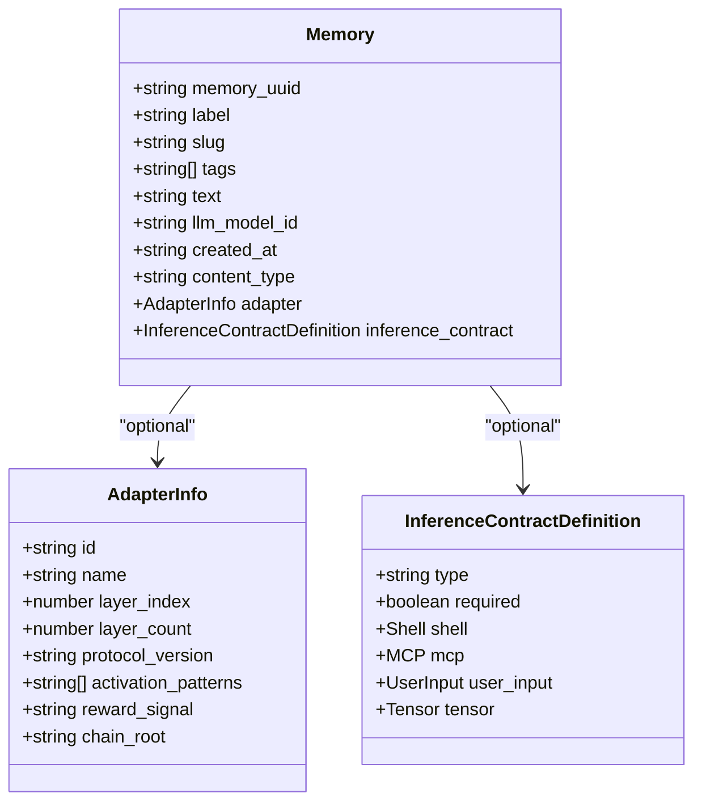

# Memory Management

<cite>
**Referenced Files in This Document**
- [src/services/memory/store.ts](file://src/services/memory/store.ts)
- [src/services/memory/store-init.ts](file://src/services/memory/store-init.ts)
- [src/services/memory/store-methods.ts](file://src/services/memory/store-methods.ts)
- [src/services/memory/store-adapter.ts](file://src/services/memory/store-adapter.ts)
- [src/services/memory/validate-adapter-markdown-size.ts](file://src/services/memory/validate-adapter-markdown-size.ts)
- [src/services/memory/activation-search-fields.ts](file://src/services/memory/activation-search-fields.ts)
- [src/services/qdrant/service.ts](file://src/services/qdrant/service.ts)
- [src/services/qdrant/search.ts](file://src/services/qdrant/search.ts)
- [src/utils/qdrant-vector-types.ts](file://src/utils/qdrant-vector-types.ts)
- [src/utils/qdrant-utils.ts](file://src/utils/qdrant-utils.ts)
- [src/types/memory.ts](file://src/types/memory.ts)
- [src/config/adapter-markdown-size-limits.ts](file://src/config/adapter-markdown-size-limits.ts)
- [src/utils/qdrant-vector-management.ts](file://src/utils/qdrant-vector-management.ts)
- [src/utils/qdrant-collection-utils.ts](file://src/utils/qdrant-collection-utils.ts)
- [src/utils/qdrant-query-utils.ts](file://src/utils/qdrant-query-utils.ts)
- [src/services/memory/adapter-builder.ts](file://src/services/memory/adapter-builder.ts)
- [src/services/memory/store-title-similarity-search.ts](file://src/services/memory/store-title-similarity-search.ts)
- [src/services/memory/qdrant-point-to-memory.ts](file://src/services/memory/qdrant-point-to-memory.ts)
- [src/services/memory/store-adapter-header-handler.ts](file://src/services/memory/store-adapter-header-handler.ts)
- [src/services/memory/store-adapter-default-handler.ts](file://src/services/memory/store-adapter-default-handler.ts)
- [src/services/memory/store-artifact.ts](file://src/services/memory/store-artifact.ts)
- [src/services/memory/store-adapter-helpers.ts](file://src/services/memory/store-adapter-helpers.ts)
- [src/utils/protocol-slug.ts](file://src/utils/protocol-slug.ts)
- [src/utils/memory-store-utils.ts](file://src/utils/memory-store-utils.ts)
- [src/utils/frontmatter.ts](file://src/utils/frontmatter.ts)
- [src/utils/tenant-context.ts](file://src/utils/tenant-context.ts)
- [src/utils/space-filter.ts](file://src/utils/space-filter.ts)
- [src/services/embedding/service.ts](file://src/services/embedding/service.ts)
- [src/services/embedding/bm25-tokenizer.ts](file://src/services/embedding/bm25-tokenizer.ts)
- [src/services/redis-cache.ts](file://src/services/redis-cache.ts)
- [src/services/memory/activation-search-backfill.ts](file://src/services/memory/activation-search-backfill.ts)
- [src/services/qdrant/quality.ts](file://src/services/qdrant/quality.ts)
- [src/services/qdrant/connection.ts](file://src/services/qdrant/connection.ts)
- [src/services/qdrant/memory-store.ts](file://src/services/qdrant/memory-store.ts)
- [src/services/qdrant/memory-retrieval.ts](file://src/services/qdrant/memory-retrieval.ts)
- [src/services/qdrant/memory-updates.ts](file://src/services/qdrant/memory-updates.ts)
- [src/services/qdrant/initialization.ts](file://src/services/qdrant/initialization.ts)
- [src/services/qdrant/listing.ts](file://src/services/qdrant/listing.ts)
- [src/services/qdrant/protocol.ts](file://src/services/qdrant/protocol.ts)
- [src/services/qdrant/reward-propagation.ts](file://src/services/qdrant/reward-propagation.ts)
- [src/services/qdrant/resources.ts](file://src/services/qdrant/resources.ts)
- [src/services/qdrant/types.ts](file://src/services/qdrant/types.ts)
- [src/services/qdrant/utils.ts](file://src/services/qdrant/utils.ts)
- [src/services/qdrant/undici-compat.ts](file://src/services/qdrant/undici-compat.ts)
- [src/services/qdrant/snapshots.ts](file://src/services/qdrant/snapshots.ts)
- [src/services/qdrant/protocol.ts](file://src/services/qdrant/protocol.ts)
- [src/services/qdrant/protocol.ts](file://src/services/qdrant/protocol.ts)
- [src/services/qdrant/protocol.ts](file://src/services/qdrant/protocol.ts)
- [src/services/qdrant/protocol.ts](file://src/services/qdrant/protocol.ts)
- [src/services/qdrant/protocol.ts](file://src/services/qdrant/protocol.ts)
- [src/services/qdrant/protocol.ts](file://src/services/qdrant/protocol.ts)
- [src/services/qdrant/protocol.ts](file://src/services/qdrant/protocol.ts)
- [src/services/qdrant/protocol.ts](file://src/services/qdrant/protocol.ts)
- [src/services/qdrant/protocol.ts](file://src/services/qdrant/protocol.ts)
- [src/services/qdrant/protocol.ts](file://src/services/qdrant/protocol.ts)
- [src/services/qdrant/protocol.ts](file://src/services/qdrant/protocol.ts)
- [src/services/qdrant/protocol.ts](file://src/services/qdrant/protocol.ts)
- [src/services/qdrant/protocol.ts](file://src/services/qdrant/protocol.ts)
- [src/services/qdrant/protocol.ts](file://src/services/qdrant/protocol.ts)
- [src/services/qdrant/protocol.ts](file://src/services/qdrant/protocol.ts)
- [src/services/qdrant/protocol.ts](file://src/services/qdrant/protocol.ts)
- [src/services/qdrant/protocol.ts](file://src/services/qdrant/protocol.ts)
- [src/services/qdrant/protocol.ts](file://src/services/qdrant/protocol.ts)
- [src/services/qdrant/protocol.ts](file://src/services/qdrant/protocol.ts)
- [src/services/qdrant/protocol.ts](file://src/services/qdrant/protocol.ts)
- [src/services/qdrant/protocol.ts](file://src/services/qdrant/protocol.ts)
- [src/services/qdrant/protocol.ts](file://src/services/qdrant/protocol.ts)
- [src/services/qdrant/protocol.ts](file://src/services/qdrant/protocol.ts)
- [......skipping......](file://src/services/qdrant/protocol.ts)
</cite>

## Table of Contents
1. [Introduction](#introduction)
2. [Project Structure](#project-structure)
3. [Core Components](#core-components)
4. [Architecture Overview](#architecture-overview)
5. [Detailed Component Analysis](#detailed-component-analysis)
6. [Dependency Analysis](#dependency-analysis)
7. [Performance Considerations](#performance-considerations)
8. [Troubleshooting Guide](#troubleshooting-guide)
9. [Conclusion](#conclusion)
10. [Appendices](#appendices)

## Introduction
This document explains the KAIROS MCP memory management system with a focus on Qdrant vector storage. It covers collection management, memory persistence and retrieval, the adapter pattern for different document types, the markdown processing pipeline, semantic search capabilities, memory validation rules, size limitations, initialization and health checks, collection alias resolution, lifecycle management, cleanup procedures, and troubleshooting. Practical examples illustrate storing and retrieving memories, configuring adapters, and optimizing search performance.

## Project Structure
The memory subsystem centers around two primary entry points:
- A high-level facade that composes Qdrant client, collection alias resolution, and adapter store: [src/services/memory/store.ts](file://src/services/memory/store.ts)
- A service-oriented facade that exposes Qdrant operations via a typed interface: [src/services/qdrant/service.ts](file://src/services/qdrant/service.ts)

Key supporting modules include:
- Initialization and migration of Qdrant collections: [src/services/memory/store-init.ts](file://src/services/memory/store-init.ts)
- Methods for retrieval and hybrid search: [src/services/memory/store-methods.ts](file://src/services/memory/store-methods.ts)
- Adapter store and artifact storage: [src/services/memory/store-adapter.ts](file://src/services/memory/store-adapter.ts)
- Validation of adapter Markdown size: [src/services/memory/validate-adapter-markdown-size.ts](file://src/services/memory/validate-adapter-markdown-size.ts)
- Vector naming and collection alias resolution: [src/utils/qdrant-vector-types.ts](file://src/utils/qdrant-vector-types.ts)
- Types for memory payloads: [src/types/memory.ts](file://src/types/memory.ts)

**Diagram sources**
- [src/services/memory/store.ts:20-53](file://src/services/memory/store.ts#L20-L53)
- [src/services/memory/store-methods.ts:25-38](file://src/services/memory/store-methods.ts#L25-L38)
- [src/services/memory/store-adapter.ts:35-41](file://src/services/memory/store-adapter.ts#L35-L41)
- [src/services/memory/store-init.ts:171-183](file://src/services/memory/store-init.ts#L171-L183)
- [src/utils/qdrant-vector-types.ts:50-57](file://src/utils/qdrant-vector-types.ts#L50-L57)
- [src/types/memory.ts:99-120](file://src/types/memory.ts#L99-L120)
- [src/services/qdrant/service.ts:16-27](file://src/services/qdrant/service.ts#L16-L27)

**Section sources**
- [src/services/memory/store.ts:1-152](file://src/services/memory/store.ts#L1-L152)
- [src/services/qdrant/service.ts:1-152](file://src/services/qdrant/service.ts#L1-L152)
- [src/services/memory/store-init.ts:1-348](file://src/services/memory/store-init.ts#L1-L348)
- [src/services/memory/store-methods.ts:1-298](file://src/services/memory/store-methods.ts#L1-L298)
- [src/services/memory/store-adapter.ts:1-154](file://src/services/memory/store-adapter.ts#L1-L154)
- [src/utils/qdrant-vector-types.ts:1-57](file://src/utils/qdrant-vector-types.ts#L1-L57)
- [src/types/memory.ts:1-125](file://src/types/memory.ts#L1-L125)

## Core Components
- MemoryQdrantStore: Composes Qdrant client, resolves collection aliases, initializes collections, exposes health checks, and delegates adapter and artifact storage to specialized handlers.
- MemoryQdrantStoreMethods: Implements retrieval and hybrid search using dense vectors, activation-focused dense vectors, and BM25 sparse vectors.
- MemoryQdrantStoreAdapter: Orchestrates adapter creation from markdown, validates sizes, normalizes content, and stores either header-based or default adapters.
- QdrantService: Higher-level service exposing CRUD and search operations backed by QdrantConnection and modular modules.

Key responsibilities:
- Collection management and migrations: ensure correct vector configuration, add BM25 sparse vectors, backfill activation search vectors, and maintain idempotence.
- Retrieval and caching: fetch memories, optionally bypass caches, and cache search results.
- Semantic search: hybrid dense + BM25 with payload-based boosting and RRF fusion.
- Adapter pattern: parse markdown into structured adapters with layers, activation patterns, and optional inference contracts.
- Size validation: enforce per-document and per-line limits for adapter Markdown and artifacts.

**Section sources**
- [src/services/memory/store.ts:20-152](file://src/services/memory/store.ts#L20-L152)
- [src/services/memory/store-methods.ts:25-298](file://src/services/memory/store-methods.ts#L25-L298)
- [src/services/memory/store-adapter.ts:35-154](file://src/services/memory/store-adapter.ts#L35-L154)
- [src/services/qdrant/service.ts:16-152](file://src/services/qdrant/service.ts#L16-L152)

## Architecture Overview
The memory system integrates embedding generation, vector indexing, and hybrid retrieval. The initialization routine ensures the collection supports dense vectors, activation vectors, and BM25 sparse vectors. Search leverages multiple query legs fused with reciprocal rank fusion and payload boosts.

**Diagram sources**
- [src/services/memory/store.ts:142-144](file://src/services/memory/store.ts#L142-L144)
- [src/services/memory/store-methods.ts:99-264](file://src/services/memory/store-methods.ts#L99-L264)
- [src/services/embedding/service.ts](file://src/services/embedding/service.ts)
- [src/services/embedding/bm25-tokenizer.ts](file://src/services/embedding/bm25-tokenizer.ts)

## Detailed Component Analysis

### Qdrant Vector Storage and Collection Management
- Vector descriptors: define primary, adapter title, and activation pattern vector names and properties.
- Collection existence and migration: create collection if missing, detect and migrate older single-vector layouts to named vectors, add missing vectors, and remove obsolete ones when safe.
- BM25 sparse vectors: ensure sparse vector configuration via update or recreation-based migration.
- Full-text indexes: create text indexes on adapter_name_text, label_text, activation_patterns_text, tags_text.
- Backfill activation search vectors: populate activation-focused dense vectors for existing points.

**Diagram sources**
- [src/services/memory/store-init.ts:171-348](file://src/services/memory/store-init.ts#L171-L348)
- [src/utils/qdrant-vector-types.ts:28-35](file://src/utils/qdrant-vector-types.ts#L28-L35)
- [src/utils/qdrant-vector-management.ts](file://src/utils/qdrant-vector-management.ts)
- [src/utils/qdrant-collection-utils.ts](file://src/utils/qdrant-collection-utils.ts)
- [src/services/memory/activation-search-backfill.ts](file://src/services/memory/activation-search-backfill.ts)

**Section sources**
- [src/services/memory/store-init.ts:1-348](file://src/services/memory/store-init.ts#L1-L348)
- [src/utils/qdrant-vector-types.ts:1-57](file://src/utils/qdrant-vector-types.ts#L1-L57)

### Adapter Pattern and Markdown Processing Pipeline
- Adapter builder: parses H1 sections, sanitizes headings, extracts activation patterns, splits by contract blocks, and builds layer memories with inference contracts.
- Header-based vs default adapter: prefer header-based parsing when feasible; otherwise fall back to default single-memory storage.
- Frontmatter and slug resolution: parse frontmatter, derive protocol version and slug candidates, and enforce slug validity.
- Similarity guard: check for similar adapters by title before storing to avoid duplicates.

**Diagram sources**
- [src/services/memory/store-adapter.ts:43-148](file://src/services/memory/store-adapter.ts#L43-L148)
- [src/services/memory/adapter-builder.ts:212-258](file://src/services/memory/adapter-builder.ts#L212-L258)
- [src/utils/memory-store-utils.ts](file://src/utils/memory-store-utils.ts)
- [src/utils/frontmatter.ts](file://src/utils/frontmatter.ts)
- [src/utils/protocol-slug.ts](file://src/utils/protocol-slug.ts)
- [src/services/memory/store-adapter-helpers.ts](file://src/services/memory/store-adapter-helpers.ts)

**Section sources**
- [src/services/memory/store-adapter.ts:1-154](file://src/services/memory/store-adapter.ts#L1-L154)
- [src/services/memory/adapter-builder.ts:1-258](file://src/services/memory/adapter-builder.ts#L1-L258)
- [src/utils/protocol-slug.ts:1-200](file://src/utils/protocol-slug.ts#L1-L200)

### Semantic Search Capabilities
- Hybrid search: dense vectors, adapter title vectors, activation pattern vectors, and BM25 sparse vectors are prefetched and fused with reciprocal rank fusion.
- Payload-based boosting: boost on adapter_name_text, activation_patterns_text, label_text, and tags_text.
- Fallback: if hybrid query fails, fall back to dense vector search.
- Collapse and filtering: collapse results by memory UUID, filter built-in search footers, and restrict by space and domain.

**Diagram sources**
- [src/services/memory/store-methods.ts:126-264](file://src/services/memory/store-methods.ts#L126-L264)
- [src/services/embedding/service.ts](file://src/services/embedding/service.ts)
- [src/services/embedding/bm25-tokenizer.ts](file://src/services/embedding/bm25-tokenizer.ts)

**Section sources**
- [src/services/memory/store-methods.ts:99-264](file://src/services/memory/store-methods.ts#L99-L264)
- [src/services/qdrant/search.ts:11-82](file://src/services/qdrant/search.ts#L11-L82)

### Memory Validation Rules and Size Limitations
- Adapter Markdown size validation: total UTF-8 byte limit, per-line byte limit, and optional enforced maximum line count.
- Artifact content validation: same total byte ceiling as adapter Markdown.
- Environment-driven limits: configurable via environment variables for maximum lines, maximum line bytes, and safety factor.

Practical guidance:
- Keep adapter Markdown under configured limits to avoid rejection during training or tuning.
- For long documents, consider splitting into smaller chunks or using artifacts for large payloads.

**Section sources**
- [src/services/memory/validate-adapter-markdown-size.ts:1-127](file://src/services/memory/validate-adapter-markdown-size.ts#L1-L127)
- [src/config/adapter-markdown-size-limits.ts:1-41](file://src/config/adapter-markdown-size-limits.ts#L1-L41)

### Initialization Process and Health Checks
- Initialization: ensure collection exists, configure vectors, add BM25, create full-text indexes, and backfill activation vectors.
- Health checks: verify connectivity and responsiveness with a timeout; returns boolean status and logs warnings on failure.

Operational tips:
- Run initialization at startup to guarantee schema readiness.
- Monitor health check failures and investigate network or authentication issues.

**Section sources**
- [src/services/memory/store.ts:55-121](file://src/services/memory/store.ts#L55-L121)
- [src/services/memory/store-init.ts:171-348](file://src/services/memory/store-init.ts#L171-L348)

### Collection Alias Resolution
- The 'current' alias resolves to a real collection name driven by environment variables, enabling dynamic routing without code changes.

Usage:
- Pass 'current' as the collection name to leverage environment-driven alias resolution.

**Section sources**
- [src/utils/qdrant-vector-types.ts:37-57](file://src/utils/qdrant-vector-types.ts#L37-L57)

### Practical Examples

#### Storing and Retrieving Memories
- Store adapter layers from markdown:
  - Use the adapter store to parse and persist header-based or default adapters.
  - See [src/services/memory/store-adapter.ts:43-148](file://src/services/memory/store-adapter.ts#L43-L148).
- Retrieve a memory by UUID:
  - Use the methods layer to fetch a memory, optionally bypassing cache for freshness.
  - See [src/services/memory/store-methods.ts:46-97](file://src/services/memory/store-methods.ts#L46-L97).
- Search memories:
  - Perform hybrid search with payload boosts and RRF fusion.
  - See [src/services/memory/store-methods.ts:99-264](file://src/services/memory/store-methods.ts#L99-L264).

#### Configuring Adapters
- Frontmatter and slug resolution:
  - Parse frontmatter, derive protocol version, and resolve slug candidates.
  - See [src/utils/frontmatter.ts](file://src/utils/frontmatter.ts) and [src/utils/protocol-slug.ts](file://src/utils/protocol-slug.ts).
- Similarity guard:
  - Prevent duplicate adapters by checking similarity by title before storing.
  - See [src/services/memory/store-adapter-helpers.ts](file://src/services/memory/store-adapter-helpers.ts).

#### Optimizing Search Performance
- Dense vector search:
  - Use the service wrapper for straightforward vector similarity search.
  - See [src/services/qdrant/search.ts:11-82](file://src/services/qdrant/search.ts#L11-L82).
- Payload-based boosting:
  - Leverage adapter_name_text, activation_patterns_text, label_text, and tags_text boosts in hybrid queries.
  - See [src/services/memory/store-methods.ts:156-221](file://src/services/memory/store-methods.ts#L156-L221).

**Section sources**
- [src/services/memory/store-adapter.ts:43-148](file://src/services/memory/store-adapter.ts#L43-L148)
- [src/services/memory/store-methods.ts:46-97](file://src/services/memory/store-methods.ts#L46-L97)
- [src/services/qdrant/search.ts:11-82](file://src/services/qdrant/search.ts#L11-L82)

### Memory Lifecycle Management and Cleanup
- Lifecycle stages:
  - Creation: parse markdown, validate sizes, and store memories.
  - Persistence: maintain vector embeddings and payload fields.
  - Retrieval: fetch by UUID or search with hybrid queries.
  - Updates and deletion: use Qdrant operations via the service layer.
- Cleanup procedures:
  - Drop collections when migrating schemas or during testing.
  - Remove obsolete vectors after successful migration.
  - Use alias management to switch targets without code changes.

**Section sources**
- [src/services/qdrant/service.ts:139-141](file://src/services/qdrant/service.ts#L139-L141)
- [src/services/memory/store-init.ts:320-332](file://src/services/memory/store-init.ts#L320-L332)

## Dependency Analysis
The memory system exhibits clear separation of concerns:
- Facade classes encapsulate client instantiation, alias resolution, and delegation.
- Methods module centralizes retrieval and search logic.
- Adapter store coordinates parsing, validation, and persistence.
- Utilities provide vector naming, collection utilities, and query helpers.
- Embedding and BM25 tokenization power semantic search.

**Diagram sources**
- [src/services/memory/store.ts:20-53](file://src/services/memory/store.ts#L20-L53)
- [src/services/memory/store-methods.ts:25-38](file://src/services/memory/store-methods.ts#L25-L38)
- [src/services/memory/store-adapter.ts:35-41](file://src/services/memory/store-adapter.ts#L35-L41)
- [src/services/memory/store-init.ts:1-30](file://src/services/memory/store-init.ts#L1-L30)
- [src/services/qdrant/service.ts:16-27](file://src/services/qdrant/service.ts#L16-L27)

**Section sources**
- [src/services/memory/store.ts:1-152](file://src/services/memory/store.ts#L1-L152)
- [src/services/memory/store-methods.ts:1-298](file://src/services/memory/store-methods.ts#L1-L298)
- [src/services/memory/store-adapter.ts:1-154](file://src/services/memory/store-adapter.ts#L1-L154)
- [src/services/qdrant/service.ts:1-152](file://src/services/qdrant/service.ts#L1-L152)

## Performance Considerations
- Vector configuration: ensure dense and activation vectors are named consistently and on disk to optimize IO.
- BM25 sparse vectors: enable hybrid search for improved recall and precision.
- Payload indexes: create text indexes on frequently queried fields to accelerate filtering and matching.
- Quantization and rescoring: enable quantization parameters for faster similarity computation.
- Caching: leverage Redis-backed search result caching to reduce repeated computations.
- Query fusion: use RRF fusion to combine multiple query legs effectively.

[No sources needed since this section provides general guidance]

## Troubleshooting Guide
Common issues and resolutions:
- Health check failures:
  - Verify Qdrant URL, API key, and network connectivity.
  - Check timeouts and retry policies.
  - See [src/services/memory/store.ts:59-121](file://src/services/memory/store.ts#L59-L121).
- Collection initialization errors:
  - Review vector descriptor mismatches and migration steps.
  - Ensure sufficient permissions for collection creation and updates.
  - See [src/services/memory/store-init.ts:171-348](file://src/services/memory/store-init.ts#L171-L348).
- Search failures:
  - Fall back to dense search when hybrid queries fail.
  - Validate embedding dimensions and vector names.
  - See [src/services/memory/store-methods.ts:223-236](file://src/services/memory/store-methods.ts#L223-L236).
- Adapter validation errors:
  - Enforce size limits and sanitize headings before training.
  - See [src/services/memory/validate-adapter-markdown-size.ts:33-108](file://src/services/memory/validate-adapter-markdown-size.ts#L33-L108).
- Quality tracking:
  - Track implementation attempts and success rates per model.
  - See [src/services/qdrant/quality.ts:75-92](file://src/services/qdrant/quality.ts#L75-L92).

**Section sources**
- [src/services/memory/store.ts:59-121](file://src/services/memory/store.ts#L59-L121)
- [src/services/memory/store-init.ts:171-348](file://src/services/memory/store-init.ts#L171-L348)
- [src/services/memory/store-methods.ts:223-236](file://src/services/memory/store-methods.ts#L223-L236)
- [src/services/memory/validate-adapter-markdown-size.ts:33-108](file://src/services/memory/validate-adapter-markdown-size.ts#L33-L108)
- [src/services/qdrant/quality.ts:75-92](file://src/services/qdrant/quality.ts#L75-L92)

## Conclusion
The KAIROS MCP memory management system provides a robust foundation for persistent, searchable, and adaptable knowledge storage. By combining Qdrant’s vector capabilities with a structured adapter pattern, it enables efficient training, retrieval, and refinement of protocol knowledge. Proper initialization, health monitoring, and validation ensure reliability, while hybrid search and payload-based boosting deliver strong semantic performance.

[No sources needed since this section summarizes without analyzing specific files]

## Appendices

### Data Model Overview
The memory type defines the persisted payload shape, including adapter metadata, inference contracts, and optional artifact fields.

**Diagram sources**
- [src/types/memory.ts:99-120](file://src/types/memory.ts#L99-L120)
- [src/types/memory.ts:1-125](file://src/types/memory.ts#L1-L125)

**Section sources**
- [src/types/memory.ts:1-125](file://src/types/memory.ts#L1-L125)