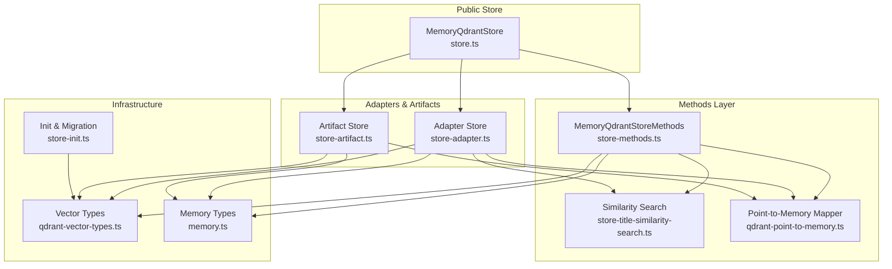
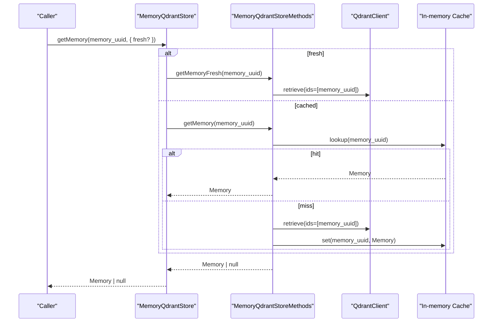
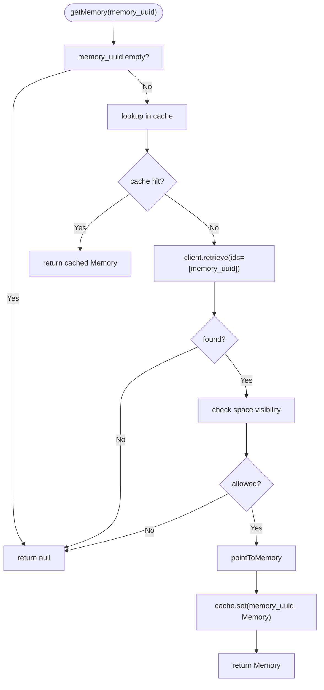
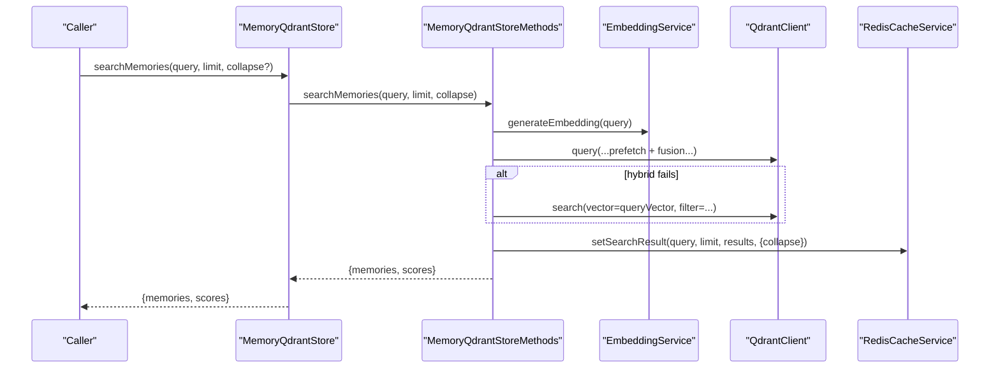
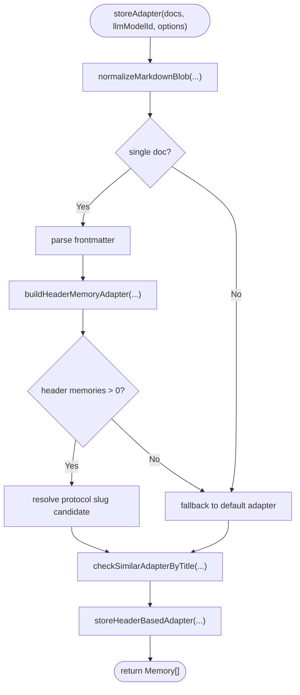
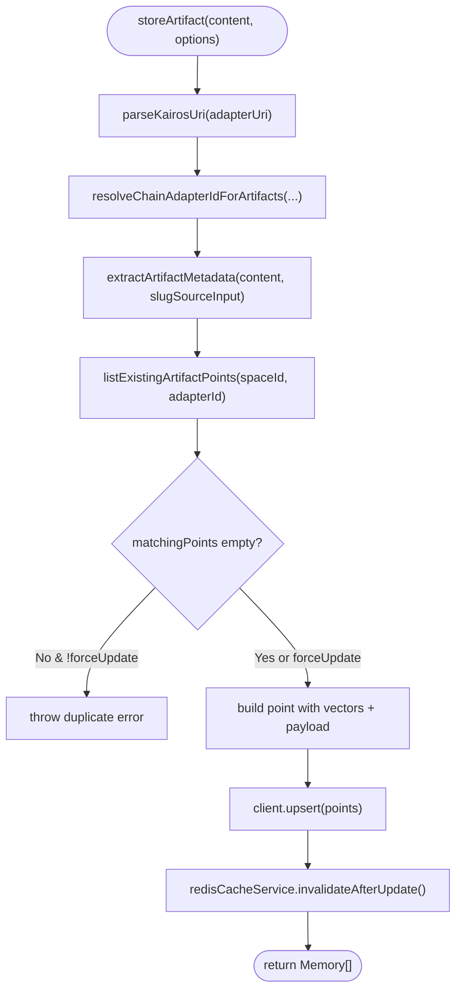
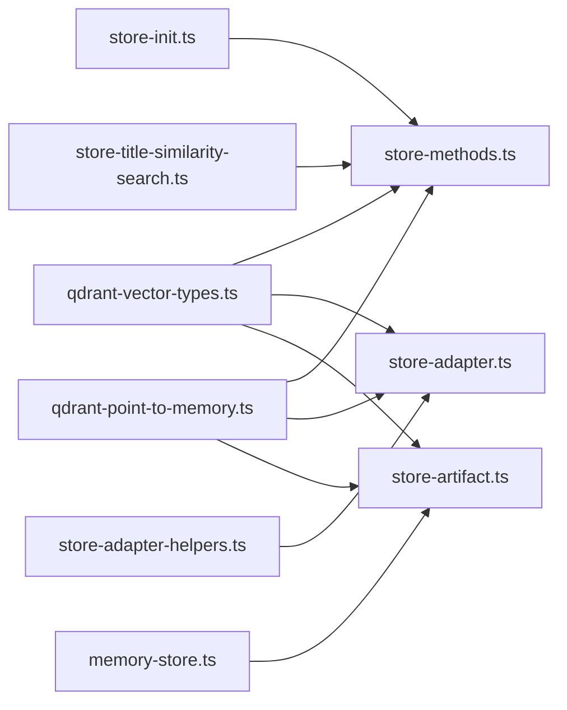

# Memory Store Methods

<cite>
**Referenced Files in This Document**
- [store-methods.ts](file://src/services/memory/store-methods.ts)
- [store.ts](file://src/services/memory/store.ts)
- [store-artifact.ts](file://src/services/memory/store-artifact.ts)
- [store-adapter.ts](file://src/services/memory/store-adapter.ts)
- [memory-accessors.ts](file://src/services/memory/memory-accessors.ts)
- [store-title-similarity-search.ts](file://src/services/memory/store-title-similarity-search.ts)
- [qdrant-point-to-memory.ts](file://src/services/memory/qdrant-point-to-memory.ts)
- [memory.ts](file://src/types/memory.ts)
- [qdrant-vector-types.ts](file://src/utils/qdrant-vector-types.ts)
- [store-init.ts](file://src/services/memory/store-init.ts)
- [memory-store-utils.ts](file://src/utils/memory-store-utils.ts)
- [memory-store.ts](file://src/services/memory-store.ts)
</cite>

## Table of Contents
1. [Introduction](#introduction)
2. [Project Structure](#project-structure)
3. [Core Components](#core-components)
4. [Architecture Overview](#architecture-overview)
5. [Detailed Component Analysis](#detailed-component-analysis)
6. [Dependency Analysis](#dependency-analysis)
7. [Performance Considerations](#performance-considerations)
8. [Troubleshooting Guide](#troubleshooting-guide)
9. [Conclusion](#conclusion)

## Introduction
This document explains the memory store methods implementation responsible for CRUD operations on memory entities, artifact storage, and retrieval patterns. It covers method signatures, parameter validation, return value structures, refresh mechanisms, caching strategies, data consistency guarantees, and performance optimization techniques. Practical examples demonstrate storing memories, querying with filters, and managing memory lifecycles.

## Project Structure
The memory store is implemented across several modules:
- Public store facade: orchestrates initialization, health checks, adapter and artifact storage, and memory retrieval/search.
- Internal methods: encapsulate Qdrant client interactions, hybrid search, and conversion from Qdrant points to Memory objects.
- Utilities: vector naming, similarity search, and point-to-memory mapping.
- Types: strongly typed Memory and related structures.

**Diagram sources**
- [store.ts:20-53](file://src/services/memory/store.ts#L20-L53)
- [store-methods.ts:25-38](file://src/services/memory/store-methods.ts#L25-L38)
- [store-adapter.ts:35-41](file://src/services/memory/store-adapter.ts#L35-L41)
- [store-artifact.ts:168-173](file://src/services/memory/store-artifact.ts#L168-L173)
- [store-title-similarity-search.ts:9-15](file://src/services/memory/store-title-similarity-search.ts#L9-L15)
- [qdrant-point-to-memory.ts:10-100](file://src/services/memory/qdrant-point-to-memory.ts#L10-L100)
- [qdrant-vector-types.ts:12-35](file://src/utils/qdrant-vector-types.ts#L12-L35)
- [store-init.ts:171-348](file://src/services/memory/store-init.ts#L171-L348)
- [memory.ts:99-120](file://src/types/memory.ts#L99-L120)

**Section sources**
- [store.ts:20-53](file://src/services/memory/store.ts#L20-L53)
- [store-methods.ts:25-38](file://src/services/memory/store-methods.ts#L25-L38)
- [store-adapter.ts:35-41](file://src/services/memory/store-adapter.ts#L35-L41)
- [store-artifact.ts:168-173](file://src/services/memory/store-artifact.ts#L168-L173)
- [store-title-similarity-search.ts:9-15](file://src/services/memory/store-title-similarity-search.ts#L9-L15)
- [qdrant-point-to-memory.ts:10-100](file://src/services/memory/qdrant-point-to-memory.ts#L10-L100)
- [qdrant-vector-types.ts:12-35](file://src/utils/qdrant-vector-types.ts#L12-L35)
- [store-init.ts:171-348](file://src/services/memory/store-init.ts#L171-L348)
- [memory.ts:99-120](file://src/types/memory.ts#L99-L120)

## Core Components
- MemoryQdrantStore: public facade exposing initialization, health checks, adapter storage, artifact storage, memory retrieval, and search.
- MemoryQdrantStoreMethods: internal methods implementing getMemory, getMemoryFresh, searchMemories, searchAdapterTitlesBySimilarity, and vectorized hybrid search.
- MemoryQdrantStoreAdapter: adapter storage pipeline coordinating header-based adapters, default adapters, slug allocation, and duplicate detection.
- Artifact storage: storeArtifact handles artifact ingestion, metadata extraction, slug/name uniqueness, and upsert with sparse/dense vectors.
- Accessor utilities: memory-accessors provide normalized access to adapter info, slug, chain root, and inference contract.
- Type system: Memory and related interfaces define the canonical shape of stored entities.

**Section sources**
- [store.ts:20-152](file://src/services/memory/store.ts#L20-L152)
- [store-methods.ts:25-298](file://src/services/memory/store-methods.ts#L25-L298)
- [store-adapter.ts:35-154](file://src/services/memory/store-adapter.ts#L35-L154)
- [store-artifact.ts:168-301](file://src/services/memory/store-artifact.ts#L168-L301)
- [memory-accessors.ts:1-42](file://src/services/memory/memory-accessors.ts#L1-L42)
- [memory.ts:99-120](file://src/types/memory.ts#L99-L120)

## Architecture Overview
The store architecture separates concerns:
- Initialization and health checks ensure Qdrant readiness and vector schema correctness.
- Retrieval uses in-process caching with manual invalidation and a “fresh” bypass for consistency.
- Search combines dense embeddings, adapter title embeddings, activation pattern embeddings, and BM25 sparse vectors with reciprocal rank fusion.
- Adapter and artifact ingestion enforce uniqueness, slug allocation, and vector schema migration.

**Diagram sources**
- [store.ts:135-140](file://src/services/memory/store.ts#L135-L140)
- [store-methods.ts:46-97](file://src/services/memory/store-methods.ts#L46-L97)

**Section sources**
- [store.ts:135-140](file://src/services/memory/store.ts#L135-L140)
- [store-methods.ts:46-97](file://src/services/memory/store-methods.ts#L46-L97)

## Detailed Component Analysis

### Memory Retrieval and Caching
- getMemory: validates input, checks in-process cache, retrieves from Qdrant, applies space-based visibility, converts to Memory, caches, and returns.
- getMemoryFresh: bypasses in-process cache, retrieves directly from Qdrant, applies visibility, and returns.
- invalidateLocalCache: clears in-process cache and resets loaded flag to force reloads.

**Diagram sources**
- [store-methods.ts:46-78](file://src/services/memory/store-methods.ts#L46-L78)
- [qdrant-point-to-memory.ts:10-100](file://src/services/memory/qdrant-point-to-memory.ts#L10-L100)

**Section sources**
- [store-methods.ts:46-97](file://src/services/memory/store-methods.ts#L46-L97)
- [qdrant-point-to-memory.ts:10-100](file://src/services/memory/qdrant-point-to-memory.ts#L10-L100)

### Memory Search and Hybrid Ranking
- searchMemories: generates embedding, builds hybrid query (dense + title + activation + BM25), applies RRF fusion, filters built-in footer protocols, sorts by score and UUID, and caches results.
- vectorSearch: fallback to dense search if hybrid query fails; ensures non-zero scores and deterministic ordering.

**Diagram sources**
- [store.ts:142-144](file://src/services/memory/store.ts#L142-L144)
- [store-methods.ts:99-264](file://src/services/memory/store-methods.ts#L99-L264)
- [store-title-similarity-search.ts:9-59](file://src/services/memory/store-title-similarity-search.ts#L9-L59)

**Section sources**
- [store.ts:142-144](file://src/services/memory/store.ts#L142-L144)
- [store-methods.ts:99-264](file://src/services/memory/store-methods.ts#L99-L264)
- [store-title-similarity-search.ts:9-59](file://src/services/memory/store-title-similarity-search.ts#L9-L59)

### Adapter Storage Pipeline
- storeAdapter: normalizes markdown, parses frontmatter, builds header-based adapter memories, validates slug, checks similarity, and stores via header/default handler.
- Similarity guard: pre-trains hybrid/title similarity search to prevent duplicates above threshold.
- Slug allocation: enforces uniqueness per space; author-supplied slugs conflict-checked; auto-suffixing with bounded attempts.

**Diagram sources**
- [store-adapter.ts:43-148](file://src/services/memory/store-adapter.ts#L43-L148)
- [store-adapter-helpers.ts:112-172](file://src/services/memory/store-adapter-helpers.ts#L112-L172)

**Section sources**
- [store-adapter.ts:43-148](file://src/services/memory/store-adapter.ts#L43-L148)
- [store-adapter-helpers.ts:112-172](file://src/services/memory/store-adapter-helpers.ts#L112-L172)

### Artifact Storage and Metadata
- storeArtifact: parses adapter URI, resolves adapter identity, extracts artifact metadata, computes SHA-256, builds tags, tokenizes BM25, upserts with dense vectors and optional BM25, and invalidates cache.
- Uniqueness: checks existing artifacts by name/slug within space and adapter; supports force update.

**Diagram sources**
- [store-artifact.ts:168-301](file://src/services/memory/store-artifact.ts#L168-L301)

**Section sources**
- [store-artifact.ts:168-301](file://src/services/memory/store-artifact.ts#L168-L301)

### Memory Accessor Functions
- getAdapterInfo/getAdapterId/getAdapterName: safely extract adapter metadata.
- getActivationPatterns/getLayerIndex/getLayerCount: access adapter metadata with defaults.
- getInferenceContract: extract inference contract if present.
- getAdapterSlugForSearchOutput/getChainRoot: normalize slugs and chain roots.

**Section sources**
- [memory-accessors.ts:1-42](file://src/services/memory/memory-accessors.ts#L1-L42)

### Data Persistence Strategies and Refresh Mechanisms
- In-process cache: Map-backed cache keyed by memory_uuid; invalidated via invalidateLocalCache.
- Fresh retrieval: getMemoryFresh bypasses cache to ensure latest data after updates.
- Redis cache: setSearchResult caches hybrid search results; invalidateAfterUpdate clears caches after write operations.
- Health checks: MemoryQdrantStore.checkHealth wraps Qdrant getCollections with timeout handling.

**Section sources**
- [store-methods.ts:41-44](file://src/services/memory/store-methods.ts#L41-L44)
- [store.ts:135-140](file://src/services/memory/store.ts#L135-L140)
- [store-artifact.ts:273](file://src/services/memory/store-artifact.ts#L273)
- [store.ts:59-121](file://src/services/memory/store.ts#L59-L121)

### Method Signatures, Validation, and Return Values
- getMemory(memory_uuid: string, options?: { fresh?: boolean }): Promise<Memory | null>
  - Validates non-empty memory_uuid; uses cache or retrieve; applies space visibility; returns Memory or null.
- getMemoryFresh(memory_uuid: string): Promise<Memory | null>
  - Bypasses cache; same visibility rules.
- searchMemories(query: string, limit: number, collapse?: boolean): Promise<{ memories: Memory[], scores: number[] }>
  - Generates embedding; hybrid search; caches results; returns ordered pairs.
- searchAdapterTitlesBySimilarity(query: string, limit: number): Promise<{ memories: Memory[], scores: number[] }>
  - Dense similarity on adapter titles; filters built-in footer protocols.
- storeAdapter(docs: string[], llmModelId: string, options?: StoreAdapterOptions): Promise<Memory[]>
  - Normalizes docs; parses frontmatter; builds header/default adapter; enforces slug and similarity; returns stored memories.
- storeArtifact(content: string, options: StoreArtifactOptions): Promise<Memory[]>
  - Validates adapter URI; resolves adapter; extracts metadata; upserts; returns stored memory.

**Section sources**
- [store.ts:135-144](file://src/services/memory/store.ts#L135-L144)
- [store-methods.ts:99-119](file://src/services/memory/store-methods.ts#L99-L119)
- [store-adapter.ts:43-152](file://src/services/memory/store-adapter.ts#L43-L152)
- [store-artifact.ts:168-173](file://src/services/memory/store-artifact.ts#L168-L173)

### Practical Examples
- Storing a header-based adapter:
  - Prepare markdown with frontmatter; call storeAdapter with llmModelId; optionally set forceUpdate or forkNewAdapter.
- Storing an artifact:
  - Call storeArtifact with content, adapterUri (kairos://adapter/{slug|uuid}), name, mime, llmModelId, and optional relativePath; handle duplicate errors if not forceUpdate.
- Querying with filters:
  - Use searchMemories(query, limit) for hybrid search; rely on space filters and built-in protocol filtering.
- Managing memory lifecycles:
  - After updates, call invalidateLocalCache on MemoryQdrantStoreMethods or rely on Redis invalidation; use getMemoryFresh for immediate consistency.

**Section sources**
- [store-adapter.ts:43-148](file://src/services/memory/store-adapter.ts#L43-L148)
- [store-artifact.ts:168-301](file://src/services/memory/store-artifact.ts#L168-L301)
- [store-methods.ts:41-44](file://src/services/memory/store-methods.ts#L41-L44)
- [store.ts:142-144](file://src/services/memory/store.ts#L142-L144)

## Dependency Analysis
- Vector naming and descriptors: qdrant-vector-types provides primary, adapter title, and activation pattern vector names and descriptors.
- Initialization and migrations: store-init ensures collection existence, vector schema correctness, BM25 sparse vectors, full-text indexes, and activation search vector backfill.
- Memory mapping: qdrant-point-to-memory converts Qdrant points to Memory with robust payload handling.
- Similarity search: store-title-similarity-search isolates embedding generation and dense search for adapter titles.
- Adapter helpers: store-adapter-helpers coordinates similarity checks, slug allocation, and duplicate handling.
- In-memory key-value store: memory-store.ts provides a simple in-memory implementation for environments without Redis.

**Diagram sources**
- [qdrant-vector-types.ts:12-35](file://src/utils/qdrant-vector-types.ts#L12-L35)
- [store-methods.ts:25-38](file://src/services/memory/store-methods.ts#L25-L38)
- [store-adapter.ts:35-41](file://src/services/memory/store-adapter.ts#L35-L41)
- [store-artifact.ts:168-173](file://src/services/memory/store-artifact.ts#L168-L173)
- [store-init.ts:171-348](file://src/services/memory/store-init.ts#L171-L348)
- [qdrant-point-to-memory.ts:10-100](file://src/services/memory/qdrant-point-to-memory.ts#L10-L100)
- [store-title-similarity-search.ts:9-15](file://src/services/memory/store-title-similarity-search.ts#L9-L15)
- [store-adapter-helpers.ts:112-172](file://src/services/memory/store-adapter-helpers.ts#L112-L172)
- [memory-store.ts:23-177](file://src/services/memory-store.ts#L23-L177)

**Section sources**
- [qdrant-vector-types.ts:12-35](file://src/utils/qdrant-vector-types.ts#L12-L35)
- [store-methods.ts:25-38](file://src/services/memory/store-methods.ts#L25-L38)
- [store-adapter.ts:35-41](file://src/services/memory/store-adapter.ts#L35-L41)
- [store-artifact.ts:168-173](file://src/services/memory/store-artifact.ts#L168-L173)
- [store-init.ts:171-348](file://src/services/memory/store-init.ts#L171-L348)
- [qdrant-point-to-memory.ts:10-100](file://src/services/memory/qdrant-point-to-memory.ts#L10-L100)
- [store-title-similarity-search.ts:9-15](file://src/services/memory/store-title-similarity-search.ts#L9-L15)
- [store-adapter-helpers.ts:112-172](file://src/services/memory/store-adapter-helpers.ts#L112-L172)
- [memory-store.ts:23-177](file://src/services/memory-store.ts#L23-L177)

## Performance Considerations
- Hybrid search tuning:
  - Adjust prefetch limits and fusion parameters to balance recall and latency.
  - Use quantization rescore for improved accuracy-cost trade-offs.
- Vector schema migration:
  - Named vectors enable efficient multi-modal embeddings; ensure migrations complete before enabling BM25 and full-text indexing.
- Caching:
  - In-process cache reduces repeated retrievals; invalidate after writes to maintain freshness.
  - Redis caching of search results amortizes expensive hybrid queries.
- Batch operations:
  - Prefer bulk upserts for artifacts and adapters; minimize round trips to Qdrant.
- Tokenization:
  - BM25 tokenization adds overhead; ensure tokenizer is configured and resilient to malformed inputs.

[No sources needed since this section provides general guidance]

## Troubleshooting Guide
- Hybrid search failures:
  - The system falls back to dense search automatically; monitor logs for warnings and retry conditions.
- Duplicate adapter or slug:
  - Similarity guard throws errors when threshold exceeded; use force_update to replace or choose a distinct title/slug.
- Protected spaces:
  - Protected write guards prevent modifications to protected entries; adjust permissions or use appropriate space context.
- Cache staleness:
  - Use getMemoryFresh or invalidateLocalCache to bypass or refresh in-process cache.
- Vector schema issues:
  - Initialization and migrations ensure correct vector descriptors and BM25 availability; verify logs for migration steps.

**Section sources**
- [store-methods.ts:223-236](file://src/services/memory/store-methods.ts#L223-L236)
- [store-adapter-helpers.ts:112-172](file://src/services/memory/store-adapter-helpers.ts#L112-L172)
- [store-adapter-helpers.ts:52-93](file://src/services/memory/store-adapter-helpers.ts#L52-L93)
- [store.ts:41-44](file://src/services/memory/store.ts#L41-L44)
- [store-init.ts:171-348](file://src/services/memory/store-init.ts#L171-L348)

## Conclusion
The memory store methods provide a robust, vector-aware persistence layer with hybrid search, strict access controls, and pragmatic caching. By leveraging named vectors, BM25, and pre-train similarity checks, the system balances performance and consistency. The adapter and artifact pipelines enforce uniqueness and metadata correctness, while refresh mechanisms and health checks ensure operational reliability.