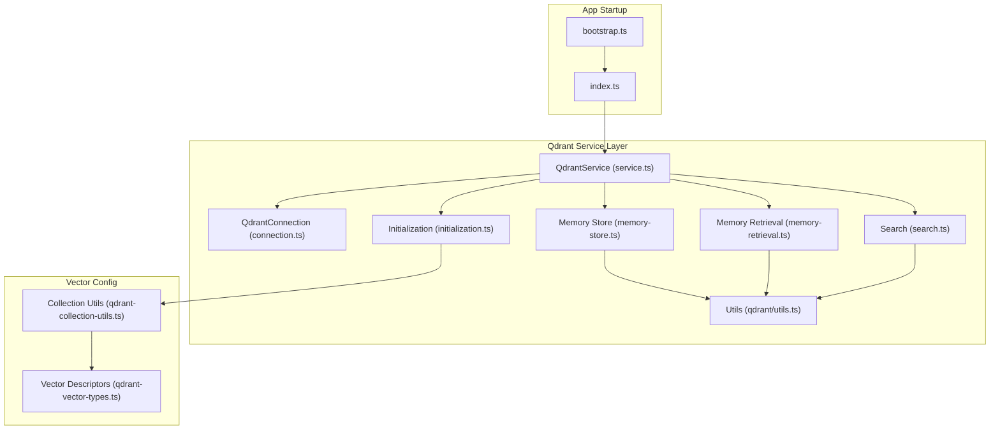
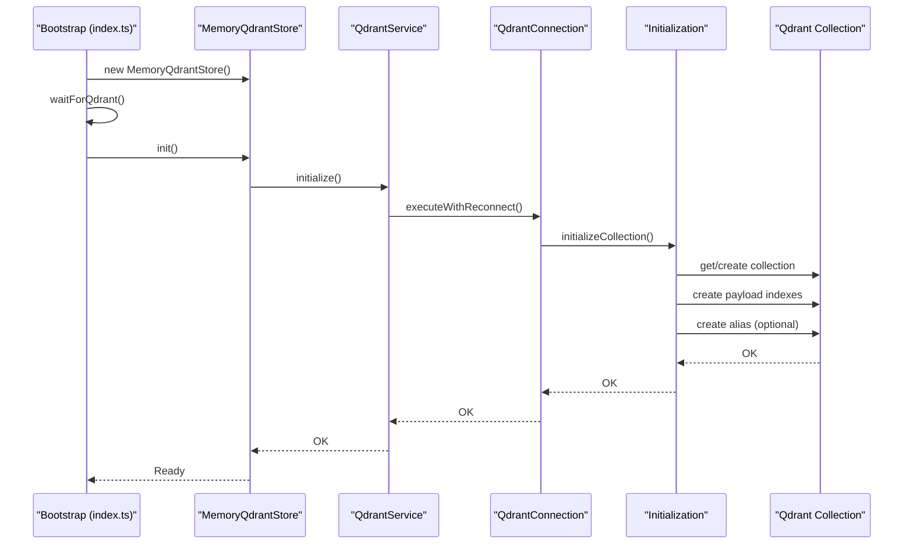
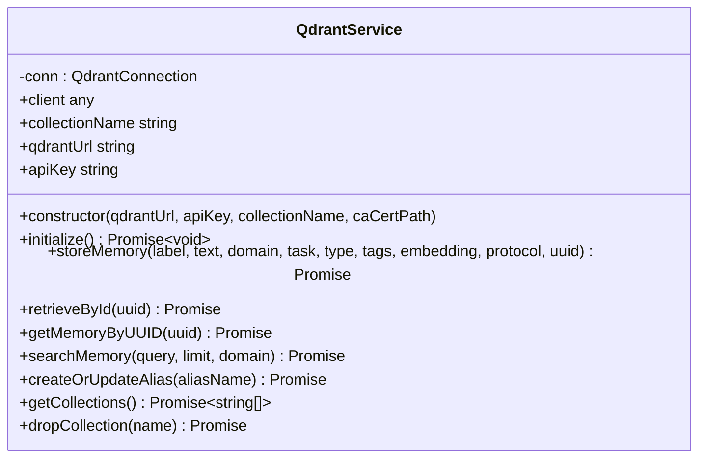
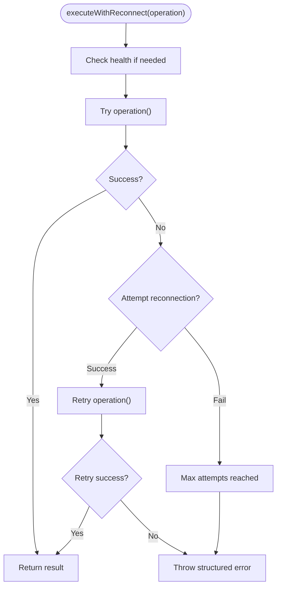
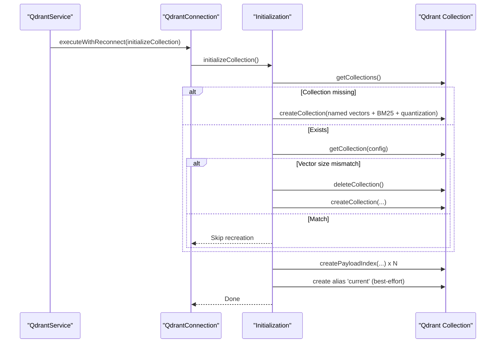
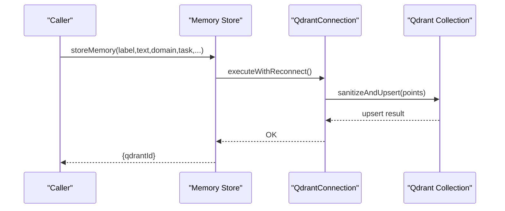
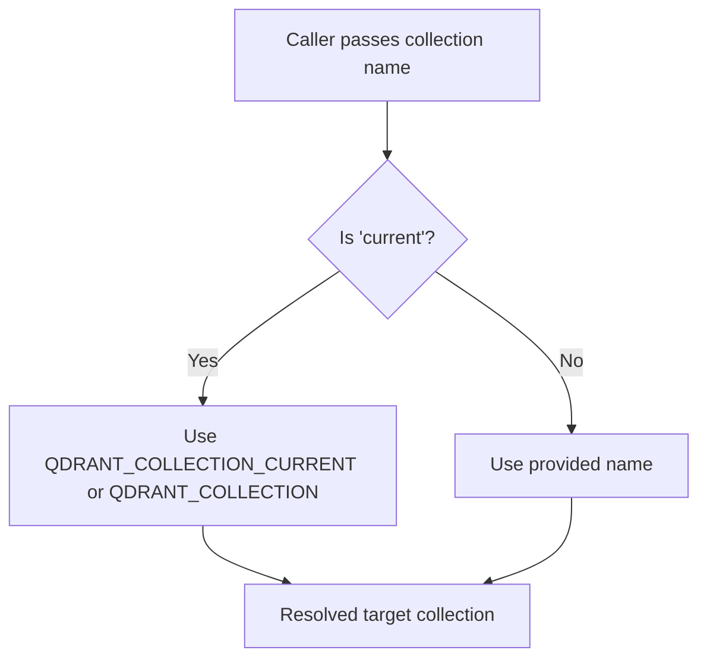
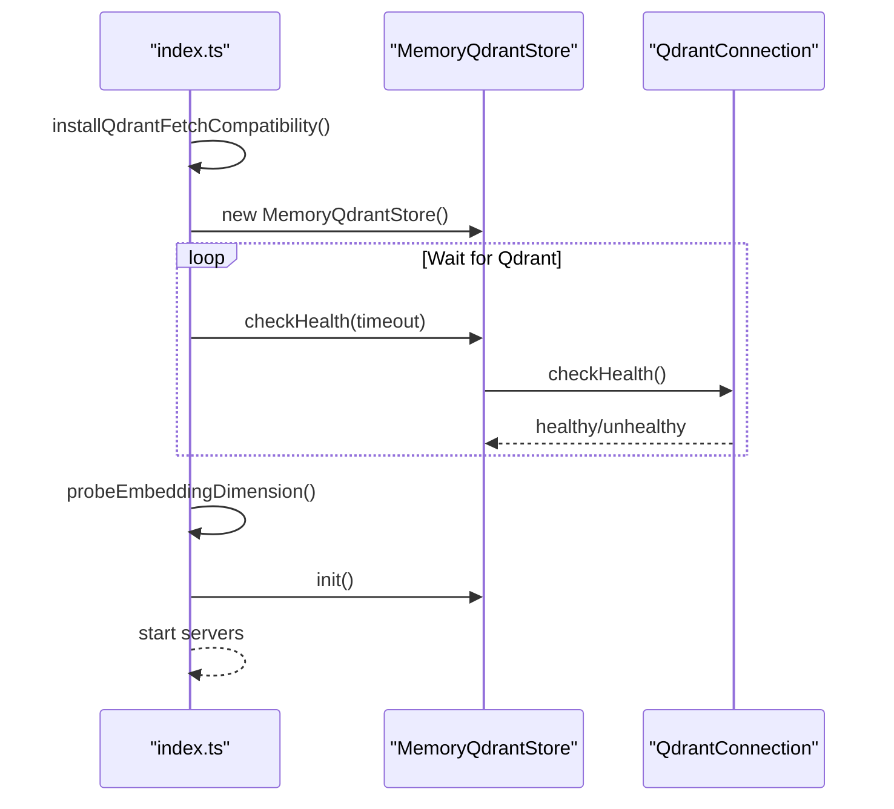
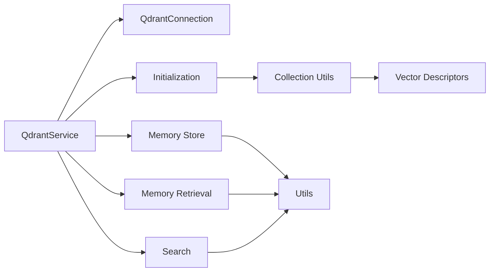

# Qdrant Integration

<cite>
**Referenced Files in This Document**
- [index.ts](file://src/index.ts)
- [bootstrap.ts](file://src/bootstrap.ts)
- [config.ts](file://src/config.ts)
- [qdrant/index.ts](file://src/services/qdrant/index.ts)
- [qdrant/service.ts](file://src/services/qdrant/service.ts)
- [qdrant/connection.ts](file://src/services/qdrant/connection.ts)
- [qdrant/initialization.ts](file://src/services/qdrant/initialization.ts)
- [qdrant/memory-store.ts](file://src/services/qdrant/memory-store.ts)
- [qdrant/search.ts](file://src/services/qdrant/search.ts)
- [qdrant/memory-retrieval.ts](file://src/services/qdrant/memory-retrieval.ts)
- [qdrant/utils.ts](file://src/services/qdrant/utils.ts)
- [qdrant-vector-types.ts](file://src/utils/qdrant-vector-types.ts)
- [qdrant-collection-utils.ts](file://src/utils/qdrant-collection-utils.ts)
- [qdrant-query-utils.ts](file://src/utils/qdrant-query-utils.ts)
</cite>

## Table of Contents
1. [Introduction](#introduction)
2. [Project Structure](#project-structure)
3. [Core Components](#core-components)
4. [Architecture Overview](#architecture-overview)
5. [Detailed Component Analysis](#detailed-component-analysis)
6. [Dependency Analysis](#dependency-analysis)
7. [Performance Considerations](#performance-considerations)
8. [Troubleshooting Guide](#troubleshooting-guide)
9. [Conclusion](#conclusion)
10. [Appendices](#appendices)

## Introduction
This document explains the Qdrant vector database integration in the application. It covers client initialization, connection management, collection configuration, alias resolution, API key authentication, health checks, initialization routines (including collection creation, vector configuration, and schema validation), client options, error handling, and operational guidance such as performance tuning, timeouts, and troubleshooting common connectivity issues.

## Project Structure
The Qdrant integration is organized around a service façade that composes a connection manager and specialized modules for initialization, storage, retrieval, search, and utilities. Environment-driven configuration supplies URLs, credentials, and behavior toggles. The application bootstraps by probing Qdrant availability before proceeding.

**Diagram sources**
- [bootstrap.ts:1-55](file://src/bootstrap.ts#L1-L55)
- [index.ts:74-134](file://src/index.ts#L74-L134)
- [qdrant/service.ts:16-152](file://src/services/qdrant/service.ts#L16-L152)
- [qdrant/connection.ts:11-131](file://src/services/qdrant/connection.ts#L11-L131)
- [qdrant/initialization.ts:12-92](file://src/services/qdrant/initialization.ts#L12-L92)
- [qdrant/memory-store.ts:14-126](file://src/services/qdrant/memory-store.ts#L14-L126)
- [qdrant/memory-retrieval.ts:25-102](file://src/services/qdrant/memory-retrieval.ts#L25-L102)
- [qdrant/search.ts:11-82](file://src/services/qdrant/search.ts#L11-L82)
- [qdrant/utils.ts:10-128](file://src/services/qdrant/utils.ts#L10-L128)
- [qdrant-vector-types.ts:28-57](file://src/utils/qdrant-vector-types.ts#L28-L57)
- [qdrant-collection-utils.ts:7-65](file://src/utils/qdrant-collection-utils.ts#L7-L65)

**Section sources**
- [index.ts:74-134](file://src/index.ts#L74-L134)
- [bootstrap.ts:1-55](file://src/bootstrap.ts#L1-L55)

## Core Components
- QdrantService: Public façade exposing initialization, memory store/retrieve/search, alias management, and listing/dropping collections.
- QdrantConnection: Encapsulates client construction, TLS configuration, health checks, and automatic reconnection with exponential backoff.
- Initialization: Creates or validates collection configuration, payload indexes, alias creation, and backfills missing metadata.
- Memory Store/Retrieve/Search: Implement upsert, retrieval, scrolling, and vector similarity search with tenant-aware filters.
- Vector Configuration: Resolves vector descriptors from embedding dimension and normalizes to Qdrant’s single or named vectors.
- Utilities: Payload validation, ID conversion, sanitization, and boolean parsing helpers.

**Section sources**
- [qdrant/service.ts:16-152](file://src/services/qdrant/service.ts#L16-L152)
- [qdrant/connection.ts:11-131](file://src/services/qdrant/connection.ts#L11-L131)
- [qdrant/initialization.ts:12-92](file://src/services/qdrant/initialization.ts#L12-L92)
- [qdrant/memory-store.ts:14-126](file://src/services/qdrant/memory-store.ts#L14-L126)
- [qdrant/memory-retrieval.ts:25-102](file://src/services/qdrant/memory-retrieval.ts#L25-L102)
- [qdrant/search.ts:11-82](file://src/services/qdrant/search.ts#L11-L82)
- [qdrant-vector-types.ts:28-57](file://src/utils/qdrant-vector-types.ts#L28-L57)
- [qdrant-collection-utils.ts:7-65](file://src/utils/qdrant-collection-utils.ts#L7-L65)
- [qdrant/utils.ts:10-128](file://src/services/qdrant/utils.ts#L10-L128)

## Architecture Overview
The integration follows a layered design:
- Application bootstraps, probes Qdrant, initializes embedding dimension, and then initializes the memory store.
- QdrantService composes QdrantConnection and delegates operations to specialized modules.
- Initialization ensures the collection exists with correct vector configuration and creates payload indexes.
- Memory operations leverage tenant-aware filters and invalidate caches upon write.

**Diagram sources**
- [index.ts:44-67](file://src/index.ts#L44-L67)
- [index.ts:84-94](file://src/index.ts#L84-L94)
- [qdrant/service.ts:47-49](file://src/services/qdrant/service.ts#L47-L49)
- [qdrant/connection.ts:98-131](file://src/services/qdrant/connection.ts#L98-L131)
- [qdrant/initialization.ts:12-92](file://src/services/qdrant/initialization.ts#L12-L92)

## Detailed Component Analysis

### QdrantService
- Responsibilities:
  - Initialize collection and indexes.
  - Store and retrieve memory points.
  - Search with vector similarity.
  - Manage aliases and list/drop collections.
  - Update quality metrics and propagate rewards.
- Construction:
  - Accepts URL, API key, collection name, and optional CA cert path.
  - Delegates to QdrantConnection for client instantiation and health checks.
- Public API surface:
  - initialize(), storeMemory(), retrieveById(), getMemoryByUUID(), searchMemory(), createOrUpdateAlias(), getCollections(), dropCollection(), and more.

**Diagram sources**
- [qdrant/service.ts:16-152](file://src/services/qdrant/service.ts#L16-L152)

**Section sources**
- [qdrant/service.ts:16-152](file://src/services/qdrant/service.ts#L16-L152)

### QdrantConnection
- Client initialization:
  - Supports HTTP and HTTPS; when HTTPS is used, optional custom CA certificate can be loaded.
  - API key is passed to the client when present.
- Health checks:
  - getCollections() determines health; successful checks reset reconnect counters.
- Automatic reconnection:
  - Exponential backoff with capped attempts.
  - executeWithReconnect wraps all operations to transparently retry on transient failures.
- Error handling:
  - Logs detailed error context and raises structured errors for persistent failures.

**Diagram sources**
- [qdrant/connection.ts:98-131](file://src/services/qdrant/connection.ts#L98-L131)

**Section sources**
- [qdrant/connection.ts:11-131](file://src/services/qdrant/connection.ts#L11-L131)

### Initialization and Collection Configuration
- Collection creation:
  - Creates collection with named vectors derived from embedding dimension.
  - Adds sparse BM25 vector configuration and scalar quantization.
- Schema validation:
  - Compares current vector size with expected; recreates collection if mismatch.
- Payload indexes:
  - Creates indexes for space_id, domain, type, task, protocol metadata, slugs, and text fields.
- Alias management:
  - Attempts multiple REST endpoints to create/update alias 'current'.
- Backfill:
  - Scans collection and backfills missing space_id metadata.

**Diagram sources**
- [qdrant/initialization.ts:12-92](file://src/services/qdrant/initialization.ts#L12-L92)
- [qdrant-collection-utils.ts:7-65](file://src/utils/qdrant-collection-utils.ts#L7-L65)
- [qdrant-vector-types.ts:28-35](file://src/utils/qdrant-vector-types.ts#L28-L35)

**Section sources**
- [qdrant/initialization.ts:12-92](file://src/services/qdrant/initialization.ts#L12-L92)
- [qdrant-collection-utils.ts:7-65](file://src/utils/qdrant-collection-utils.ts#L7-L65)
- [qdrant-vector-types.ts:28-35](file://src/utils/qdrant-vector-types.ts#L28-L35)

### Memory Store and Retrieval
- Store:
  - Generates deterministic IDs from URIs or accepts provided UUIDs.
  - Builds payload with tenant, protocol, and quality metadata.
  - Sanitizes and upserts points; invalidates caches after writes.
- Retrieve:
  - Validates and converts IDs, enforces space permissions, and returns accessible points.
  - Provides paginated scrolling for adapter layers and slug-based resolution.
- Search:
  - Generates embeddings for queries, builds tenant-aware filters, and performs vector search with rescore option.

**Diagram sources**
- [qdrant/memory-store.ts:14-126](file://src/services/qdrant/memory-store.ts#L14-L126)
- [qdrant/utils.ts:124-128](file://src/services/qdrant/utils.ts#L124-L128)

**Section sources**
- [qdrant/memory-store.ts:14-126](file://src/services/qdrant/memory-store.ts#L14-L126)
- [qdrant/memory-retrieval.ts:25-102](file://src/services/qdrant/memory-retrieval.ts#L25-L102)
- [qdrant/search.ts:11-82](file://src/services/qdrant/search.ts#L11-L82)
- [qdrant/utils.ts:124-128](file://src/services/qdrant/utils.ts#L124-L128)

### Collection Alias Resolution and API Key Authentication
- Alias resolution:
  - resolveCollectionAlias('current') maps to QDRANT_COLLECTION_CURRENT or falls back to QDRANT_COLLECTION.
- API key authentication:
  - API key is attached to client initialization and to manual alias requests.
- TLS:
  - HTTPS enables rejectUnauthorized; optional custom CA certificate can be loaded from path.

**Diagram sources**
- [qdrant-vector-types.ts:50-57](file://src/utils/qdrant-vector-types.ts#L50-L57)
- [config.ts:87-88](file://src/config.ts#L87-L88)
- [qdrant/connection.ts:43-58](file://src/services/qdrant/connection.ts#L43-L58)

**Section sources**
- [qdrant-vector-types.ts:50-57](file://src/utils/qdrant-vector-types.ts#L50-L57)
- [config.ts:87-88](file://src/config.ts#L87-L88)
- [qdrant/connection.ts:43-58](file://src/services/qdrant/connection.ts#L43-L58)

### Health Monitoring and Boot Process
- Boot:
  - Installs fetch compatibility, waits for Qdrant readiness with retries, probes embedding dimension, initializes memory store, optionally triggers snapshot, injects embedded resources, starts metrics server, and starts the main server.
- Health check:
  - QdrantConnection.checkHealth() uses getCollections() and resets reconnect counters on success.

**Diagram sources**
- [index.ts:44-67](file://src/index.ts#L44-L67)
- [index.ts:84-94](file://src/index.ts#L84-L94)
- [qdrant/connection.ts:63-74](file://src/services/qdrant/connection.ts#L63-L74)

**Section sources**
- [index.ts:44-67](file://src/index.ts#L44-L67)
- [index.ts:84-94](file://src/index.ts#L84-L94)
- [qdrant/connection.ts:63-74](file://src/services/qdrant/connection.ts#L63-L74)

## Dependency Analysis
- QdrantService depends on QdrantConnection and delegates to initialization, store, retrieval, search, and listing modules.
- Initialization depends on vector descriptors and collection utilities.
- Memory store/retrieval/search depend on utilities for validation and sanitization.
- Environment configuration drives URL, API key, collection name, and behavior toggles.

**Diagram sources**
- [qdrant/service.ts:16-152](file://src/services/qdrant/service.ts#L16-L152)
- [qdrant/initialization.ts:12-92](file://src/services/qdrant/initialization.ts#L12-L92)
- [qdrant/memory-store.ts:14-126](file://src/services/qdrant/memory-store.ts#L14-L126)
- [qdrant/memory-retrieval.ts:25-102](file://src/services/qdrant/memory-retrieval.ts#L25-L102)
- [qdrant/search.ts:11-82](file://src/services/qdrant/search.ts#L11-L82)
- [qdrant/utils.ts:10-128](file://src/services/qdrant/utils.ts#L10-L128)
- [qdrant-vector-types.ts:28-35](file://src/utils/qdrant-vector-types.ts#L28-L35)
- [qdrant-collection-utils.ts:7-65](file://src/utils/qdrant-collection-utils.ts#L7-L65)

**Section sources**
- [qdrant/service.ts:16-152](file://src/services/qdrant/service.ts#L16-L152)
- [qdrant/initialization.ts:12-92](file://src/services/qdrant/initialization.ts#L12-L92)
- [qdrant-vector-types.ts:28-35](file://src/utils/qdrant-vector-types.ts#L28-L35)
- [qdrant-collection-utils.ts:7-65](file://src/utils/qdrant-collection-utils.ts#L7-L65)
- [qdrant/utils.ts:10-128](file://src/services/qdrant/utils.ts#L10-L128)

## Performance Considerations
- Vector configuration:
  - Named vectors with cosine distance and on-disk storage reduce RAM usage.
  - Scalar quantization improves throughput and reduces memory footprint.
- Search parameters:
  - Rescore can improve accuracy but adds cost; controlled by environment toggle.
  - Limit and overfetch factors influence latency and recall.
- Indexing:
  - Payload indexes on high-cardinality fields (e.g., space_id, domain, type) improve filtering performance.
- Batch operations:
  - Scroll-based backfill and upsert batching minimize round trips.
- Caching:
  - Post-write cache invalidation ensures consistency; consider read-through caching for hot reads.

[No sources needed since this section provides general guidance]

## Troubleshooting Guide
Common issues and remedies:
- Qdrant not reachable:
  - Verify QDRANT_URL and network connectivity; confirm HTTPS settings and CA certificate path if using TLS.
  - Review health check logs and exponential backoff behavior.
- API key problems:
  - Ensure QDRANT_API_KEY is set and matches Qdrant configuration.
- Vector size mismatch:
  - On mismatch, the system recreates the collection; verify embedding dimension alignment.
- Alias creation fails:
  - The system tries multiple endpoints; check logs for attempted endpoints and statuses.
- Slow searches:
  - Enable payload indexes, adjust rescore setting, and tune limit and overfetch factors.
- Permission denied:
  - Ensure space filters align with tenant context; verify allowed space IDs.

**Section sources**
- [qdrant/connection.ts:63-74](file://src/services/qdrant/connection.ts#L63-L74)
- [qdrant/initialization.ts:39-46](file://src/services/qdrant/initialization.ts#L39-L46)
- [qdrant/initialization.ts:127-162](file://src/services/qdrant/initialization.ts#L127-L162)
- [qdrant-vector-types.ts:28-35](file://src/utils/qdrant-vector-types.ts#L28-L35)

## Conclusion
The Qdrant integration provides a robust, production-grade foundation for vector-backed memory with automatic initialization, resilient connectivity, and tenant-aware operations. By leveraging named vectors, payload indexing, and careful health monitoring, the system balances performance and reliability. Proper configuration of environment variables and operational practices ensures smooth deployment and maintenance.

[No sources needed since this section summarizes without analyzing specific files]

## Appendices

### Practical Examples

- Establishing a connection and initializing:
  - Construct QdrantService with URL, API key, and collection name; call initialize() to create collection and indexes.
  - Reference: [qdrant/service.ts:19-27](file://src/services/qdrant/service.ts#L19-L27), [qdrant/service.ts:47-49](file://src/services/qdrant/service.ts#L47-L49)

- Configuring collections and vector schema:
  - Collection creation uses named vectors derived from embedding dimension; sparse BM25 and quantization are applied.
  - Reference: [qdrant-collection-utils.ts:7-39](file://src/utils/qdrant-collection-utils.ts#L7-L39), [qdrant-vector-types.ts:28-35](file://src/utils/qdrant-vector-types.ts#L28-L35)

- Implementing health monitoring:
  - Use QdrantConnection.checkHealth() and executeWithReconnect() to wrap operations.
  - Reference: [qdrant/connection.ts:63-74](file://src/services/qdrant/connection.ts#L63-L74), [qdrant/connection.ts:98-131](file://src/services/qdrant/connection.ts#L98-L131)

- Performing vector similarity search:
  - Generate embeddings, build tenant-aware filters, and search with vector name and limit.
  - Reference: [qdrant/search.ts:11-82](file://src/services/qdrant/search.ts#L11-L82)

- Managing aliases:
  - Create or update alias 'current' using multiple endpoint variants.
  - Reference: [qdrant/initialization.ts:98-125](file://src/services/qdrant/initialization.ts#L98-L125)

### Environment Variables
- QDRANT_URL: Qdrant service URL (required).
- QDRANT_API_KEY: API key for authentication.
- QDRANT_COLLECTION: Target collection name or 'current' alias.
- QDRANT_COLLECTION_CURRENT: Resolved target when 'current' is used.
- QDRANT_CA_CERT_PATH: Path to custom CA certificate for HTTPS.
- QDRANT_RESCORE: Toggle for rescore during search.
- QDRANT_CREATE_ALIAS: Whether to create 'current' alias automatically.
- QDRANT_SNAPSHOT_ON_START: Enable snapshot creation at startup.
- QDRANT_SNAPSHOT_DIR: Directory for snapshots.

**Section sources**
- [config.ts:87-88](file://src/config.ts#L87-L88)
- [config.ts:242-251](file://src/config.ts#L242-L251)
- [config.ts:276-282](file://src/config.ts#L276-L282)
- [config.ts:275-330](file://src/config.ts#L275-L330)