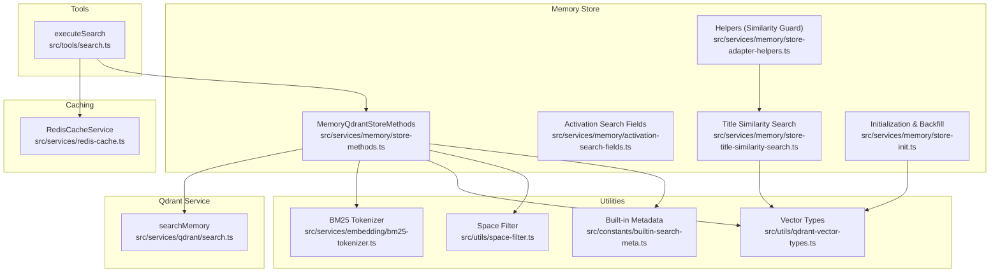
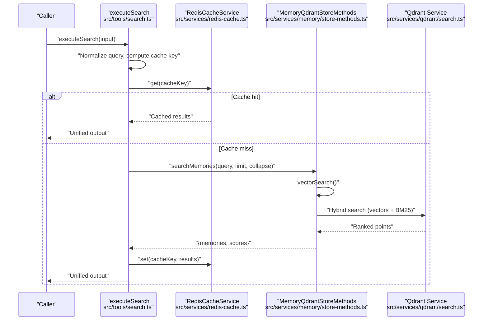
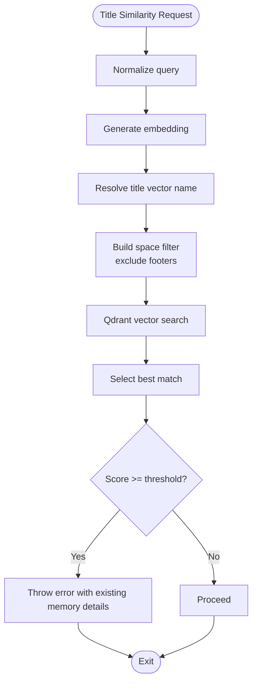
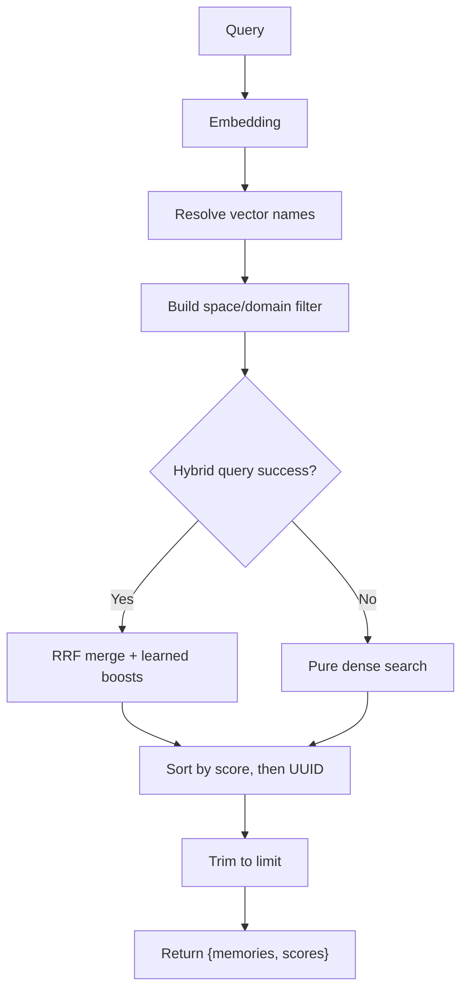
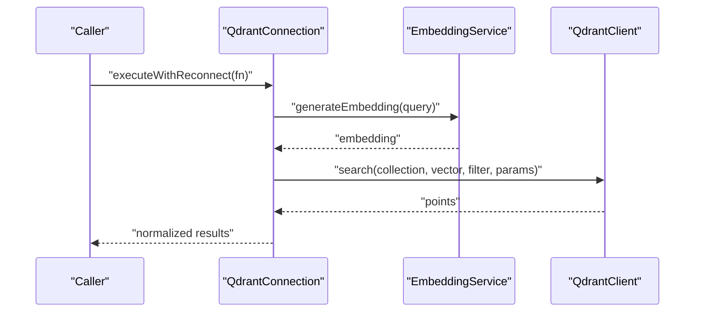
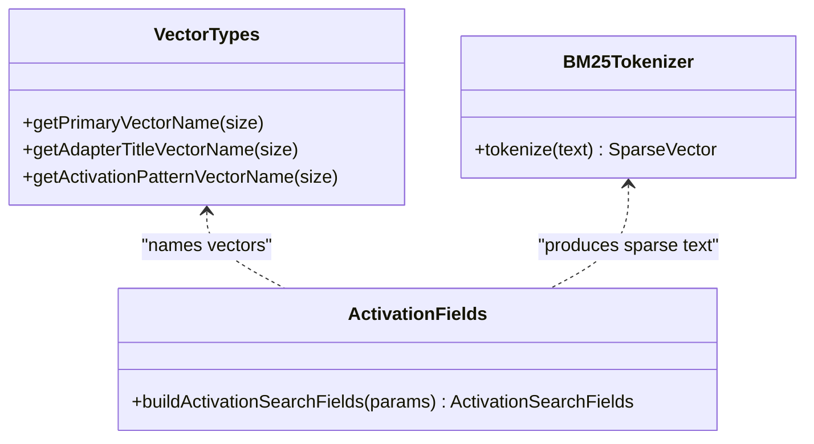
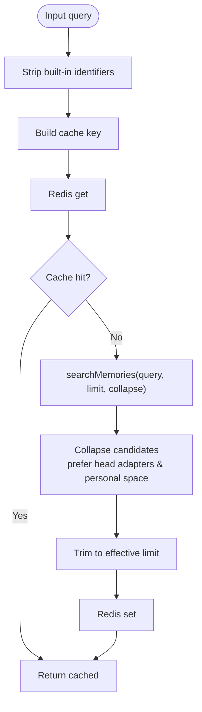
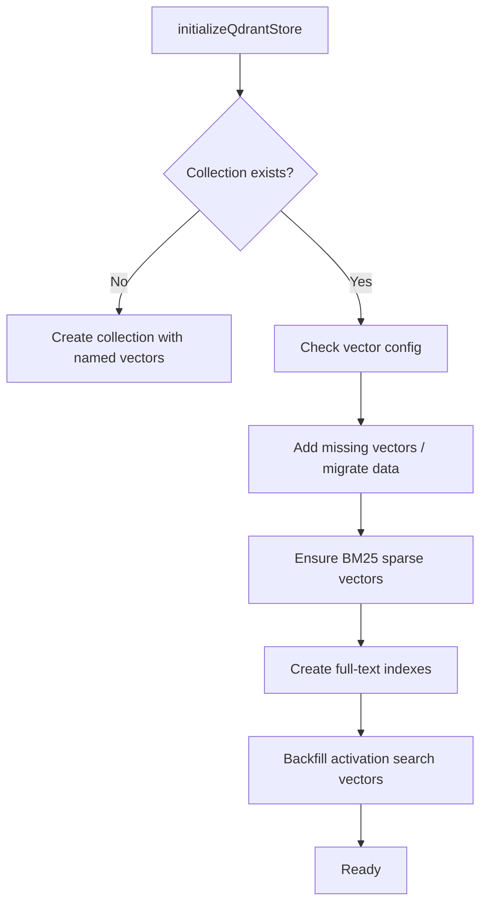
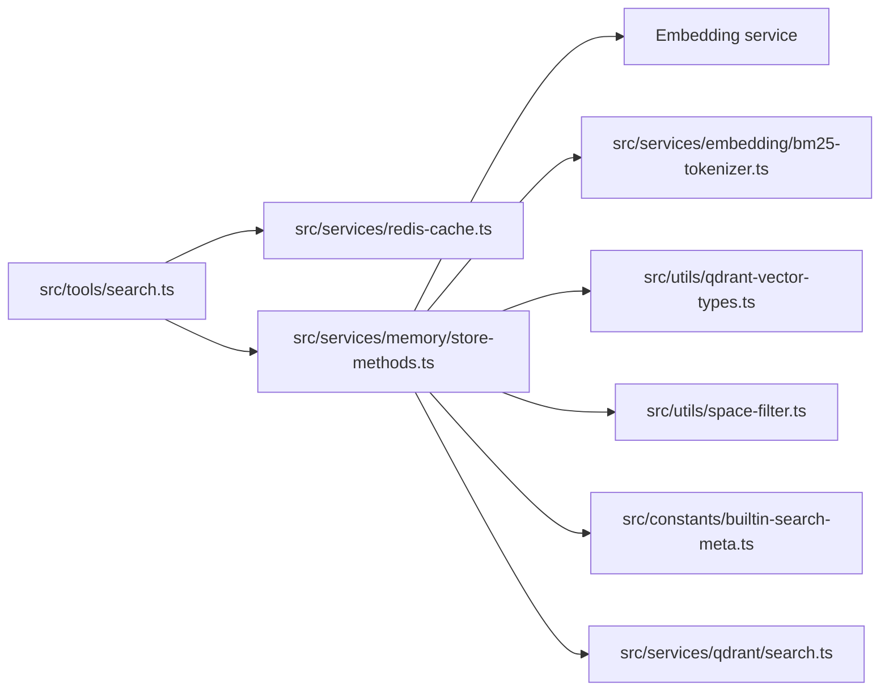

# Semantic Search & Retrieval

<cite>
**Referenced Files in This Document**
- [src/tools/search.ts](file://src/tools/search.ts)
- [src/services/qdrant/search.ts](file://src/services/qdrant/search.ts)
- [src/services/memory/store-methods.ts](file://src/services/memory/store-methods.ts)
- [src/services/memory/activation-search-fields.ts](file://src/services/memory/activation-search-fields.ts)
- [src/services/memory/store-title-similarity-search.ts](file://src/services/memory/store-title-similarity-search.ts)
- [src/services/memory/store-init.ts](file://src/services/memory/store-init.ts)
- [src/services/memory/store-adapter-helpers.ts](file://src/services/memory/store-adapter-helpers.ts)
- [src/services/redis-cache.ts](file://src/services/redis-cache.ts)
- [src/services/embedding/bm25-tokenizer.ts](file://src/services/embedding/bm25-tokenizer.ts)
- [src/utils/qdrant-vector-types.ts](file://src/utils/qdrant-vector-types.ts)
- [src/utils/space-filter.ts](file://src/utils/space-filter.ts)
- [src/constants/builtin-search-meta.ts](file://src/constants/builtin-search-meta.ts)
- [scripts/deploy-raw-qdrant-search.mjs](file://scripts/deploy-raw-qdrant-search.mjs)
- [tests/integration/activation-reranker.test.ts](file://tests/integration/activation-reranker.test.ts)
- [tests/unit/train-similarity-guard.test.ts](file://tests/unit/train-similarity-guard.test.ts)
</cite>

## Table of Contents
1. [Introduction](#introduction)
2. [Project Structure](#project-structure)
3. [Core Components](#core-components)
4. [Architecture Overview](#architecture-overview)
5. [Detailed Component Analysis](#detailed-component-analysis)
6. [Dependency Analysis](#dependency-analysis)
7. [Performance Considerations](#performance-considerations)
8. [Troubleshooting Guide](#troubleshooting-guide)
9. [Conclusion](#conclusion)
10. [Appendices](#appendices)

## Introduction
This document explains the semantic search and memory retrieval subsystem. It covers how queries are processed, how activation search fields are constructed, how Qdrant is integrated for vector similarity and hybrid search, how results are ranked and collapsed, and how caching and filtering are applied. It also provides practical guidance for configuring search parameters, optimizing performance, and interpreting results.

## Project Structure
The semantic search pipeline spans several modules:
- Tools: orchestrate search requests, apply caching, and produce unified output.
- Qdrant service: wraps vector search and returns normalized results.
- Memory store: executes hybrid vector/BM25 queries, applies filters, and manages caches.
- Utilities: BM25 tokenization, vector naming, space scoping, and built-in metadata.
- Helpers: similarity guards and slug allocation for training workflows.

**Diagram sources**
- [src/tools/search.ts:187-248](file://src/tools/search.ts#L187-L248)
- [src/services/qdrant/search.ts:11-82](file://src/services/qdrant/search.ts#L11-L82)
- [src/services/memory/store-methods.ts:99-264](file://src/services/memory/store-methods.ts#L99-L264)
- [src/services/memory/activation-search-fields.ts:42-92](file://src/services/memory/activation-search-fields.ts#L42-L92)
- [src/services/memory/store-title-similarity-search.ts:9-60](file://src/services/memory/store-title-similarity-search.ts#L9-L60)
- [src/services/memory/store-init.ts:171-348](file://src/services/memory/store-init.ts#L171-L348)
- [src/services/memory/store-adapter-helpers.ts:112-172](file://src/services/memory/store-adapter-helpers.ts#L112-L172)
- [src/services/redis-cache.ts:21-243](file://src/services/redis-cache.ts#L21-L243)
- [src/services/embedding/bm25-tokenizer.ts:37-57](file://src/services/embedding/bm25-tokenizer.ts#L37-L57)
- [src/utils/qdrant-vector-types.ts:28-57](file://src/utils/qdrant-vector-types.ts#L28-L57)
- [src/utils/space-filter.ts:14-26](file://src/utils/space-filter.ts#L14-L26)
- [src/constants/builtin-search-meta.ts:42-50](file://src/constants/builtin-search-meta.ts#L42-L50)

**Section sources**
- [src/tools/search.ts:187-248](file://src/tools/search.ts#L187-L248)
- [src/services/qdrant/search.ts:11-82](file://src/services/qdrant/search.ts#L11-L82)
- [src/services/memory/store-methods.ts:99-264](file://src/services/memory/store-methods.ts#L99-L264)
- [src/services/memory/activation-search-fields.ts:42-92](file://src/services/memory/activation-search-fields.ts#L42-L92)
- [src/services/memory/store-title-similarity-search.ts:9-60](file://src/services/memory/store-title-similarity-search.ts#L9-L60)
- [src/services/memory/store-init.ts:171-348](file://src/services/memory/store-init.ts#L171-L348)
- [src/services/memory/store-adapter-helpers.ts:112-172](file://src/services/memory/store-adapter-helpers.ts#L112-L172)
- [src/services/redis-cache.ts:21-243](file://src/services/redis-cache.ts#L21-L243)
- [src/services/embedding/bm25-tokenizer.ts:37-57](file://src/services/embedding/bm25-tokenizer.ts#L37-L57)
- [src/utils/qdrant-vector-types.ts:28-57](file://src/utils/qdrant-vector-types.ts#L28-L57)
- [src/utils/space-filter.ts:14-26](file://src/utils/space-filter.ts#L14-L26)
- [src/constants/builtin-search-meta.ts:42-50](file://src/constants/builtin-search-meta.ts#L42-L50)

## Core Components
- Query processing and caching:
  - The search tool normalizes queries, strips built-in protocol identifiers, and computes a cache key scoped to the current space and effective limit. Results are fetched from the memory store and optionally cached in Redis.
- Qdrant integration:
  - Vector similarity search is executed via the Qdrant service, which generates embeddings and applies space/domain filters. Results are normalized into a common shape.
- Hybrid search and ranking:
  - The memory store composes a hybrid query using multiple named vectors (primary, adapter title, activation patterns) and BM25 sparse vectors, then merges scores with learned boosting terms and a quality boost.
- Activation search fields:
  - Dense and sparse text fields are constructed from adapter name, label, activation patterns, tags, and content to improve recall and precision.
- Filtering and collapsing:
  - Filters constrain results to allowed spaces and exclude built-in footer protocols. Optional result collapsing prioritizes higher-layer adapters and personal space ownership.
- Caching and invalidation:
  - Dedicated search cache stores lightweight summaries; memory and search caches are invalidated on write operations.

**Section sources**
- [src/tools/search.ts:37-248](file://src/tools/search.ts#L37-L248)
- [src/services/qdrant/search.ts:11-82](file://src/services/qdrant/search.ts#L11-L82)
- [src/services/memory/store-methods.ts:126-264](file://src/services/memory/store-methods.ts#L126-L264)
- [src/services/memory/activation-search-fields.ts:42-92](file://src/services/memory/activation-search-fields.ts#L42-L92)
- [src/services/redis-cache.ts:31-70](file://src/services/redis-cache.ts#L31-L70)

## Architecture Overview
The semantic search flow integrates embedding generation, vector indexing, hybrid retrieval, and output shaping.

**Diagram sources**
- [src/tools/search.ts:187-248](file://src/tools/search.ts#L187-L248)
- [src/services/redis-cache.ts:36-70](file://src/services/redis-cache.ts#L36-L70)
- [src/services/memory/store-methods.ts:99-264](file://src/services/memory/store-methods.ts#L99-L264)
- [src/services/qdrant/search.ts:11-82](file://src/services/qdrant/search.ts#L11-L82)

## Detailed Component Analysis

### Activation Search Fields Configuration
Activation search fields define dense and sparse representations used during indexing and retrieval:
- Dense texts:
  - primaryDenseText: concatenation of title, activation patterns, tags, and content.
  - titleDenseText: adapter name and label.
  - activationPatternDenseText: activation patterns plus tags and label.
- Sparse text:
  - sparseText: combined title, activation patterns, tags, and content for BM25 indexing.
- Normalized payload fields:
  - adapterNameText, labelText, activationPatternsText, tagsText.

These fields are derived from memory metadata and activation patterns, normalized and deduplicated to reduce noise.

**Section sources**
- [src/services/memory/activation-search-fields.ts:42-92](file://src/services/memory/activation-search-fields.ts#L42-L92)

### Title Similarity Algorithms
Two complementary strategies are used:
- Dense vector similarity on adapter titles:
  - Generates a query vector and searches against a dedicated adapter title vector space, constrained to top-level adapters and excluding built-in footer protocols.
- Similarity guard for training:
  - Before storing a new adapter, the system checks for existing adapters with highly similar titles. If similarity exceeds a threshold, it blocks or advises replacement.

**Diagram sources**
- [src/services/memory/store-title-similarity-search.ts:9-60](file://src/services/memory/store-title-similarity-search.ts#L9-L60)
- [src/services/memory/store-adapter-helpers.ts:112-172](file://src/services/memory/store-adapter-helpers.ts#L112-L172)

**Section sources**
- [src/services/memory/store-title-similarity-search.ts:9-60](file://src/services/memory/store-title-similarity-search.ts#L9-L60)
- [src/services/memory/store-adapter-helpers.ts:112-172](file://src/services/memory/store-adapter-helpers.ts#L112-L172)

### Memory Retrieval Strategies
- Hybrid vector/BM25 retrieval:
  - Prefetches from multiple named vectors (primary, adapter title, activation patterns) and BM25 legs, then merges with Reciprocal Rank Fusion and applies learned boosts for adapter name, activation patterns, label, and tags, plus a quality boost.
  - Falls back to pure dense search if hybrid fails.
- Space and domain scoping:
  - Filters results to allowed spaces and optional domain.
- Footer exclusion:
  - Built-in footer protocols are excluded from results.
- Ranking stability:
  - When scores are equal, tiebreaks favor built-in identifiers and UUID ordering.

**Diagram sources**
- [src/services/memory/store-methods.ts:126-264](file://src/services/memory/store-methods.ts#L126-L264)
- [src/utils/space-filter.ts:14-26](file://src/utils/space-filter.ts#L14-L26)
- [src/constants/builtin-search-meta.ts:42-50](file://src/constants/builtin-search-meta.ts#L42-L50)

**Section sources**
- [src/services/memory/store-methods.ts:126-264](file://src/services/memory/store-methods.ts#L126-L264)
- [src/utils/space-filter.ts:14-26](file://src/utils/space-filter.ts#L14-L26)
- [src/constants/builtin-search-meta.ts:42-50](file://src/constants/builtin-search-meta.ts#L42-L50)

### Qdrant Search Integration
- Vector search wrapper:
  - Generates embeddings, builds filters, and executes vector search with quantization rescore enabled.
  - Normalizes results to a common shape with confidence and relevance fields.
- Raw score comparison:
  - A deployment script demonstrates how to run raw Qdrant similarity search to compare with application-level scores.

**Diagram sources**
- [src/services/qdrant/search.ts:11-82](file://src/services/qdrant/search.ts#L11-L82)

**Section sources**
- [src/services/qdrant/search.ts:11-82](file://src/services/qdrant/search.ts#L11-L82)
- [scripts/deploy-raw-qdrant-search.mjs:62-87](file://scripts/deploy-raw-qdrant-search.mjs#L62-L87)

### Vector Similarity Calculations and Field Mapping
- Vector naming:
  - Primary, adapter title, and activation pattern vectors are named consistently with the embedding dimension.
- BM25 tokenization:
  - Text is tokenized into sparse vectors using a fixed-size index space and sublinear term frequencies.
- Field mapping:
  - Dense fields are mapped to payload fields for learned boosting and BM25 indexing.

**Diagram sources**
- [src/utils/qdrant-vector-types.ts:12-35](file://src/utils/qdrant-vector-types.ts#L12-L35)
- [src/services/embedding/bm25-tokenizer.ts:37-57](file://src/services/embedding/bm25-tokenizer.ts#L37-L57)
- [src/services/memory/activation-search-fields.ts:42-92](file://src/services/memory/activation-search-fields.ts#L42-L92)

**Section sources**
- [src/utils/qdrant-vector-types.ts:12-35](file://src/utils/qdrant-vector-types.ts#L12-L35)
- [src/services/embedding/bm25-tokenizer.ts:37-57](file://src/services/embedding/bm25-tokenizer.ts#L37-L57)
- [src/services/memory/activation-search-fields.ts:42-92](file://src/services/memory/activation-search-fields.ts#L42-L92)

### Search Query Processing, Filtering, and Result Collapsing
- Query preprocessing:
  - Removes built-in protocol URIs and slugs from the query to avoid skewing search and cache keys.
- Filtering:
  - Enforces space isolation and optional domain constraints.
- Collapsing logic:
  - Candidates are grouped by adapter id or memory uuid, preferring top-layer adapters and personal space ownership when scores are tied.
- Limits and thresholds:
  - Effective limits are bounded and thresholds govern result inclusion.

**Diagram sources**
- [src/tools/search.ts:37-248](file://src/tools/search.ts#L37-L248)
- [src/services/redis-cache.ts:36-70](file://src/services/redis-cache.ts#L36-L70)

**Section sources**
- [src/tools/search.ts:37-248](file://src/tools/search.ts#L37-L248)
- [src/services/redis-cache.ts:36-70](file://src/services/redis-cache.ts#L36-L70)

### Initialization, Indexing, and Backfill
- Collection initialization:
  - Ensures named vector spaces, adds BM25 sparse vectors, creates full-text indexes, and backfills activation search vectors.
- Migration:
  - Supports both online updates and recreation-based migrations to add BM25 support.

**Diagram sources**
- [src/services/memory/store-init.ts:171-348](file://src/services/memory/store-init.ts#L171-L348)

**Section sources**
- [src/services/memory/store-init.ts:171-348](file://src/services/memory/store-init.ts#L171-L348)

## Dependency Analysis
Key dependencies and interactions:
- Tools depend on Redis cache and the memory store.
- Memory store depends on embedding service, BM25 tokenizer, vector naming utilities, space filters, and built-in metadata.
- Qdrant service depends on embedding service and metrics.

**Diagram sources**
- [src/tools/search.ts:187-248](file://src/tools/search.ts#L187-L248)
- [src/services/redis-cache.ts:21-243](file://src/services/redis-cache.ts#L21-L243)
- [src/services/memory/store-methods.ts:99-264](file://src/services/memory/store-methods.ts#L99-L264)
- [src/services/qdrant/search.ts:11-82](file://src/services/qdrant/search.ts#L11-L82)
- [src/services/embedding/bm25-tokenizer.ts:37-57](file://src/services/embedding/bm25-tokenizer.ts#L37-L57)
- [src/utils/qdrant-vector-types.ts:28-57](file://src/utils/qdrant-vector-types.ts#L28-L57)
- [src/utils/space-filter.ts:14-26](file://src/utils/space-filter.ts#L14-L26)
- [src/constants/builtin-search-meta.ts:42-50](file://src/constants/builtin-search-meta.ts#L42-L50)

**Section sources**
- [src/tools/search.ts:187-248](file://src/tools/search.ts#L187-L248)
- [src/services/memory/store-methods.ts:99-264](file://src/services/memory/store-methods.ts#L99-L264)
- [src/services/qdrant/search.ts:11-82](file://src/services/qdrant/search.ts#L11-L82)
- [src/services/redis-cache.ts:21-243](file://src/services/redis-cache.ts#L21-L243)
- [src/services/embedding/bm25-tokenizer.ts:37-57](file://src/services/embedding/bm25-tokenizer.ts#L37-L57)
- [src/utils/qdrant-vector-types.ts:28-57](file://src/utils/qdrant-vector-types.ts#L28-L57)
- [src/utils/space-filter.ts:14-26](file://src/utils/space-filter.ts#L14-L26)
- [src/constants/builtin-search-meta.ts:42-50](file://src/constants/builtin-search-meta.ts#L42-L50)

## Performance Considerations
- Vector configuration:
  - Named vectors enable targeted searches and efficient migration. Ensure the collection supports BM25 sparse vectors for hybrid search.
- Hybrid query tuning:
  - Adjust prefetch limits and fusion parameters to balance latency and recall.
- Scoring and boosting:
  - Learned boosts and quality metadata influence ranking; monitor distribution and adjust thresholds.
- Caching:
  - Use Redis cache for repeated queries; invalidate aggressively on writes to maintain freshness.
- Tokenization:
  - BM25 tokenization is deterministic and fast; ensure consistent preprocessing across indexing and querying.

[No sources needed since this section provides general guidance]

## Troubleshooting Guide
Common issues and remedies:
- Low recall or irrelevant results:
  - Verify activation search fields and BM25 indexing; confirm full-text indexes exist and vectors are populated.
  - Compare raw Qdrant scores with application scores to detect drift.
- Slow queries:
  - Reduce limit, ensure hybrid query succeeds (fallback to dense search is slower), and confirm vector names match embedding dimension.
- Incorrect filtering:
  - Confirm space filter construction and allowed space ids; ensure domain filters are applied when needed.
- Cache anomalies:
  - Clear search cache after bulk updates; verify invalidation events are published and consumed.
- Training conflicts:
  - Use the similarity guard to prevent near-duplicate adapters; adjust threshold or force update carefully.

**Section sources**
- [src/services/memory/store-methods.ts:223-236](file://src/services/memory/store-methods.ts#L223-L236)
- [src/services/memory/store-init.ts:157-169](file://src/services/memory/store-init.ts#L157-L169)
- [scripts/deploy-raw-qdrant-search.mjs:62-87](file://scripts/deploy-raw-qdrant-search.mjs#L62-L87)
- [src/services/redis-cache.ts:72-95](file://src/services/redis-cache.ts#L72-L95)
- [src/services/memory/store-adapter-helpers.ts:112-172](file://src/services/memory/store-adapter-helpers.ts#L112-L172)

## Conclusion
The semantic search and memory retrieval system combines named vector spaces, BM25 sparse indexing, and learned boosting to deliver precise, space-scoped results. Activation search fields and title similarity guards improve recall and prevent duplication. Caching and invalidation strategies balance performance and freshness. By tuning hybrid queries, thresholds, and vector configurations, teams can optimize both accuracy and latency.

[No sources needed since this section summarizes without analyzing specific files]

## Appendices

### Practical Examples

- Implementing semantic search:
  - Use the search tool to normalize queries, compute cache keys, and retrieve results from the memory store.
  - Example path: [src/tools/search.ts:187-248](file://src/tools/search.ts#L187-L248)

- Configuring search parameters:
  - Adjust effective limit, thresholds, and collapsing behavior via configuration and input parameters.
  - Example path: [src/tools/search.ts:195-198](file://src/tools/search.ts#L195-L198)

- Optimizing retrieval performance:
  - Ensure BM25 sparse vectors and full-text indexes are present; leverage hybrid queries; invalidate cache after updates.
  - Example path: [src/services/memory/store-init.ts:336-339](file://src/services/memory/store-init.ts#L336-L339)

- Interpreting search results:
  - Confidence and relevance reflect Qdrant scores; built-in footer protocols are excluded; collapsing prefers top-layer adapters.
  - Example path: [src/services/qdrant/search.ts:46-71](file://src/services/qdrant/search.ts#L46-L71)

- Troubleshooting accuracy:
  - Compare raw Qdrant scores; verify vector names and dimensions; confirm filters and indexes.
  - Example path: [scripts/deploy-raw-qdrant-search.mjs:62-87](file://scripts/deploy-raw-qdrant-search.mjs#L62-L87)

**Section sources**
- [src/tools/search.ts:187-248](file://src/tools/search.ts#L187-L248)
- [src/services/memory/store-init.ts:336-339](file://src/services/memory/store-init.ts#L336-L339)
- [src/services/qdrant/search.ts:46-71](file://src/services/qdrant/search.ts#L46-L71)
- [scripts/deploy-raw-qdrant-search.mjs:62-87](file://scripts/deploy-raw-qdrant-search.mjs#L62-L87)

### Validation and Tests
- Activation reranking behavior:
  - Integration tests validate that activation patterns influence ranking choices.
  - Example path: [tests/integration/activation-reranker.test.ts:112-121](file://tests/integration/activation-reranker.test.ts#L112-L121)

- Similarity guard behavior:
  - Unit tests verify that title similarity triggers guard logic and prevents duplicates.
  - Example path: [tests/unit/train-similarity-guard.test.ts:24-47](file://tests/unit/train-similarity-guard.test.ts#L24-L47)

**Section sources**
- [tests/integration/activation-reranker.test.ts:112-121](file://tests/integration/activation-reranker.test.ts#L112-L121)
- [tests/unit/train-similarity-guard.test.ts:24-47](file://tests/unit/train-similarity-guard.test.ts#L24-L47)