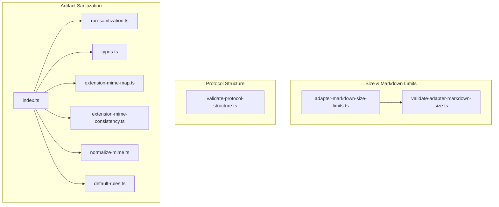
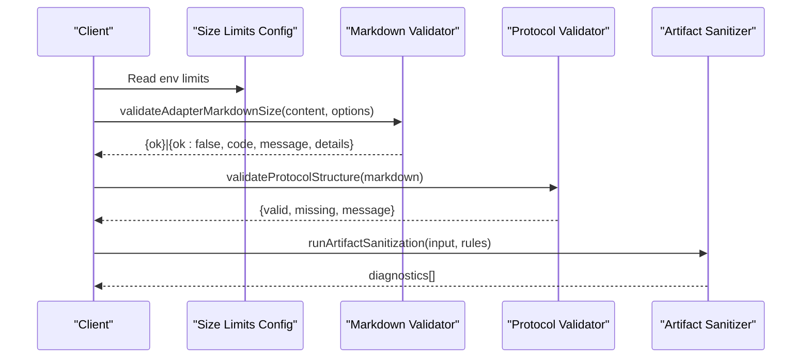
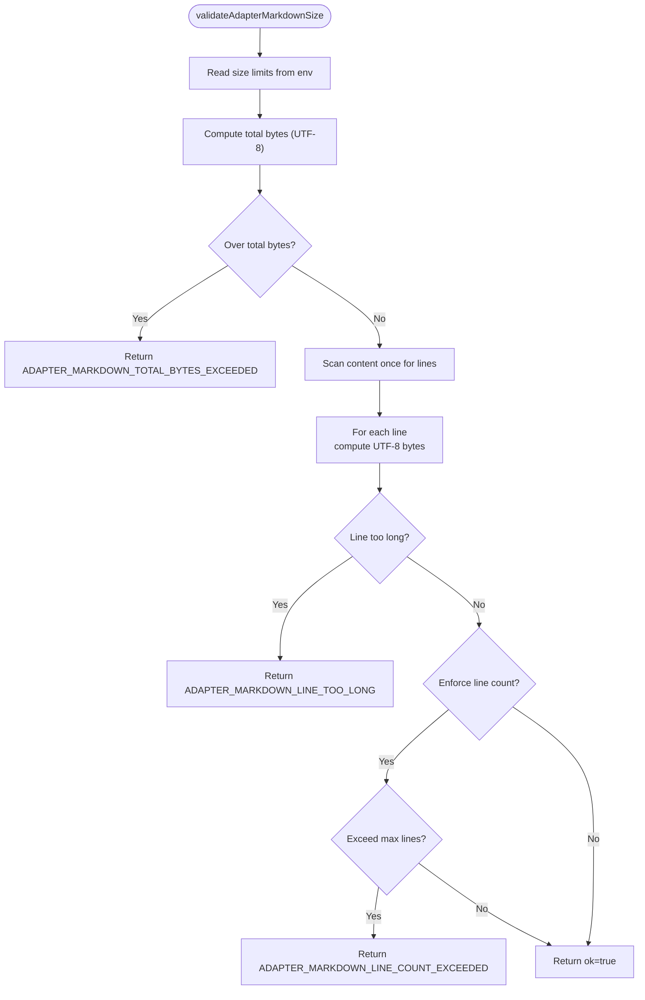
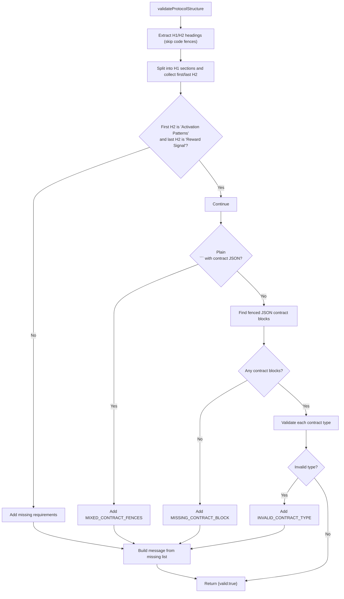
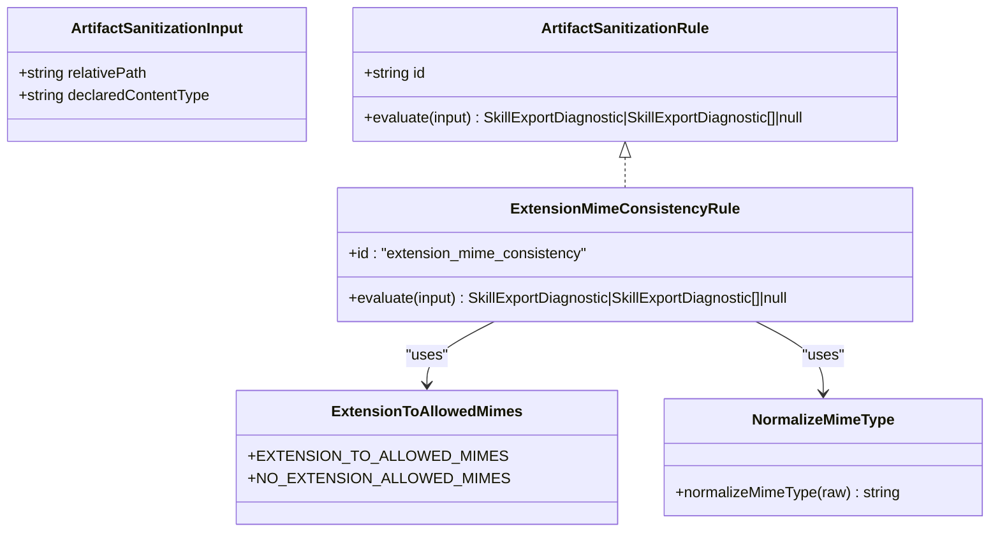
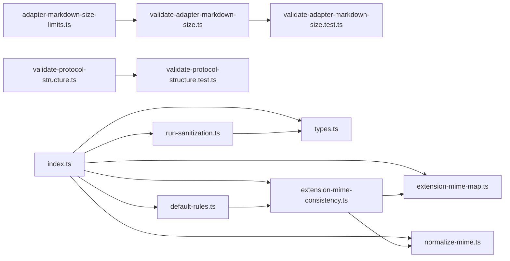

# Validation & Size Limits

<cite>
**Referenced Files in This Document**
- [adapter-markdown-size-limits.ts](file://src/config/adapter-markdown-size-limits.ts)
- [validate-adapter-markdown-size.ts](file://src/services/memory/validate-adapter-markdown-size.ts)
- [validate-protocol-structure.ts](file://src/services/memory/validate-protocol-structure.ts)
- [index.ts](file://src/tools/skill-export/artifact-sanitization/index.ts)
- [run-sanitization.ts](file://src/tools/skill-export/artifact-sanitization/run-sanitization.ts)
- [types.ts](file://src/tools/skill-export/artifact-sanitization/types.ts)
- [extension-mime-map.ts](file://src/tools/skill-export/artifact-sanitization/extension-mime-map.ts)
- [extension-mime-consistency.ts](file://src/tools/skill-export/artifact-sanitization/rules/extension-mime-consistency.ts)
- [normalize-mime.ts](file://src/tools/skill-export/artifact-sanitization/normalize-mime.ts)
- [default-rules.ts](file://src/tools/skill-export/artifact-sanitization/default-rules.ts)
- [workflow-train.md](file://docs/architecture/workflow-train.md)
- [validate-adapter-markdown-size.test.ts](file://tests/unit/validate-adapter-markdown-size.test.ts)
- [validate-protocol-structure.test.ts](file://tests/unit/validate-protocol-structure.test.ts)
- [artifact-sanitization.test.ts](file://tests/unit/artifact-sanitization.test.ts)
</cite>

## Table of Contents
1. [Introduction](#introduction)
2. [Project Structure](#project-structure)
3. [Core Components](#core-components)
4. [Architecture Overview](#architecture-overview)
5. [Detailed Component Analysis](#detailed-component-analysis)
6. [Dependency Analysis](#dependency-analysis)
7. [Performance Considerations](#performance-considerations)
8. [Troubleshooting Guide](#troubleshooting-guide)
9. [Conclusion](#conclusion)
10. [Appendices](#appendices)

## Introduction
This document explains the validation and size limitation systems used across adapter Markdown ingestion, protocol structure checks, and artifact sanitization. It covers:
- Adapter Markdown size validation (line count, per-line bytes, total UTF-8 bytes)
- Protocol structure validation (required sections, contract fences, and types)
- Artifact sanitization rules (MIME type consistency, extension validation, content sanitization)
- Validation rule configuration via environment variables
- Custom validation implementation patterns
- Error reporting and diagnostics
- Memory usage optimization and performance considerations
- Practical examples and debugging tips

## Project Structure
The validation subsystems are organized by domain:
- Size and Markdown limits: configuration and validator
- Protocol structure: parser and validator
- Artifact sanitization: pluggable rules and runner

**Diagram sources**
- [adapter-markdown-size-limits.ts:1-41](file://src/config/adapter-markdown-size-limits.ts#L1-L41)
- [validate-adapter-markdown-size.ts:1-127](file://src/services/memory/validate-adapter-markdown-size.ts#L1-L127)
- [validate-protocol-structure.ts:1-187](file://src/services/memory/validate-protocol-structure.ts#L1-L187)
- [index.ts:1-7](file://src/tools/skill-export/artifact-sanitization/index.ts#L1-L7)
- [run-sanitization.ts:1-31](file://src/tools/skill-export/artifact-sanitization/run-sanitization.ts#L1-L31)
- [types.ts:1-25](file://src/tools/skill-export/artifact-sanitization/types.ts#L1-L25)
- [extension-mime-map.ts:1-27](file://src/tools/skill-export/artifact-sanitization/extension-mime-map.ts#L1-L27)
- [extension-mime-consistency.ts:1-62](file://src/tools/skill-export/artifact-sanitization/rules/extension-mime-consistency.ts#L1-L62)
- [normalize-mime.ts:1-8](file://src/tools/skill-export/artifact-sanitization/normalize-mime.ts#L1-L8)
- [default-rules.ts:1-8](file://src/tools/skill-export/artifact-sanitization/default-rules.ts#L1-L8)

**Section sources**
- [adapter-markdown-size-limits.ts:1-41](file://src/config/adapter-markdown-size-limits.ts#L1-L41)
- [validate-adapter-markdown-size.ts:1-127](file://src/services/memory/validate-adapter-markdown-size.ts#L1-L127)
- [validate-protocol-structure.ts:1-187](file://src/services/memory/validate-protocol-structure.ts#L1-L187)
- [index.ts:1-7](file://src/tools/skill-export/artifact-sanitization/index.ts#L1-L7)
- [run-sanitization.ts:1-31](file://src/tools/skill-export/artifact-sanitization/run-sanitization.ts#L1-L31)
- [types.ts:1-25](file://src/tools/skill-export/artifact-sanitization/types.ts#L1-L25)
- [extension-mime-map.ts:1-27](file://src/tools/skill-export/artifact-sanitization/extension-mime-map.ts#L1-L27)
- [extension-mime-consistency.ts:1-62](file://src/tools/skill-export/artifact-sanitization/rules/extension-mime-consistency.ts#L1-L62)
- [normalize-mime.ts:1-8](file://src/tools/skill-export/artifact-sanitization/normalize-mime.ts#L1-L8)
- [default-rules.ts:1-8](file://src/tools/skill-export/artifact-sanitization/default-rules.ts#L1-L8)

## Core Components
- Adapter Markdown size limits and validator:
  - Environment-driven configuration for maximum lines, per-line bytes, and a safety factor that computes a total UTF-8 byte ceiling.
  - Single-pass UTF-8 validation that checks total bytes, per-line bytes, and optionally enforces a full-document line count.
- Protocol structure validator:
  - Ensures required H1/H2 headings, presence of fenced JSON contract blocks, and consistent contract types.
  - Detects mixed fences and enforces strict contract type constraints.
- Artifact sanitization:
  - Pluggable rule engine that evaluates artifact metadata (relative path and declared content type) against configured rules.
  - Default rule enforces extension–MIME consistency using a curated map and normalization.

**Section sources**
- [adapter-markdown-size-limits.ts:20-40](file://src/config/adapter-markdown-size-limits.ts#L20-L40)
- [validate-adapter-markdown-size.ts:11-108](file://src/services/memory/validate-adapter-markdown-size.ts#L11-L108)
- [validate-protocol-structure.ts:113-186](file://src/services/memory/validate-protocol-structure.ts#L113-L186)
- [types.ts:9-24](file://src/tools/skill-export/artifact-sanitization/types.ts#L9-L24)
- [extension-mime-consistency.ts:11-61](file://src/tools/skill-export/artifact-sanitization/rules/extension-mime-consistency.ts#L11-L61)

## Architecture Overview
The validation pipeline integrates at ingestion points for training, tuning, and exporting artifacts. The following diagram maps the major components and their interactions.

**Diagram sources**
- [adapter-markdown-size-limits.ts:28-40](file://src/config/adapter-markdown-size-limits.ts#L28-L40)
- [validate-adapter-markdown-size.ts:33-108](file://src/services/memory/validate-adapter-markdown-size.ts#L33-L108)
- [validate-protocol-structure.ts:113-186](file://src/services/memory/validate-protocol-structure.ts#L113-L186)
- [run-sanitization.ts:21-30](file://src/tools/skill-export/artifact-sanitization/run-sanitization.ts#L21-L30)

## Detailed Component Analysis

### Adapter Markdown Size Validation
Purpose:
- Prevent pathological inputs (e.g., extremely long single lines or very large documents) during training and tuning.
- Enforce both per-line and total UTF-8 byte ceilings, with optional enforcement of full-document line counts.

Key behaviors:
- Total byte check uses UTF-8 byte-length of the entire content.
- Per-line check scans the content once, tracking line boundaries and computing UTF-8 byte length per line.
- Optional full-document line count enforcement can be disabled for layer-body updates.
- Artifact content validation reuses the same total-byte ceiling.

Configuration:
- Environment variables define maximum lines, maximum bytes per line, and a safety factor applied to compute the total UTF-8 ceiling.

Error reporting:
- Structured result with a machine-readable code, human-readable message, and details for debugging.

**Diagram sources**
- [validate-adapter-markdown-size.ts:33-108](file://src/services/memory/validate-adapter-markdown-size.ts#L33-L108)
- [adapter-markdown-size-limits.ts:28-40](file://src/config/adapter-markdown-size-limits.ts#L28-L40)

**Section sources**
- [adapter-markdown-size-limits.ts:20-40](file://src/config/adapter-markdown-size-limits.ts#L20-L40)
- [validate-adapter-markdown-size.ts:11-108](file://src/services/memory/validate-adapter-markdown-size.ts#L11-L108)
- [workflow-train.md:42-54](file://docs/architecture/workflow-train.md#L42-L54)

### Protocol Structure Validation
Purpose:
- Ensure adapter Markdown conforms to required structural conventions before storing or training.

Key behaviors:
- Extracts H1 and H2 headings while skipping fenced code blocks.
- Validates that each top-level section starts with “Activation Patterns” and ends with “Reward Signal”.
- Requires at least one fenced JSON contract block and rejects mixed fences.
- Validates that each contract block declares a supported type.

Error reporting:
- Aggregates missing requirements into a machine-readable list and produces a descriptive message.

**Diagram sources**
- [validate-protocol-structure.ts](file://src/services/memory/validate-protocol-structure.ts#L113-L186)

**Section sources**
- [validate-protocol-structure.ts](file://src/services/memory/validate-protocol-structure.ts#L113-L186)
- [validate-protocol-structure.test.ts](file://tests/unit/validate-protocol-structure.test.ts#L301-L316)

### Artifact Sanitization Rules
Purpose:
- Enforce consistency between file extensions and declared content types during skill export and future artifact workflows.

Core components:
- Rule interface defines an id and an evaluate method returning zero, one, or multiple diagnostics.
- Default pipeline includes a rule that checks extension–MIME consistency using a curated map and normalized MIME types.
- Extension–MIME mapping supports common script and configuration file types; unknown extensions are not validated by this rule.
- MIME normalization strips parameters and lowercases values for deterministic comparison.

**Diagram sources**
- [types.ts](file://src/tools/skill-export/artifact-sanitization/types.ts#L9-L24)
- [extension-mime-consistency.ts](file://src/tools/skill-export/artifact-sanitization/rules/extension-mime-consistency.ts#L11-L61)
- [extension-mime-map.ts](file://src/tools/skill-export/artifact-sanitization/extension-mime-map.ts#L10-L26)
- [normalize-mime.ts](file://src/tools/skill-export/artifact-sanitization/normalize-mime.ts#L1-L8)

Implementation highlights:
- Rule evaluation is pure and free of I/O.
- Diagnostics include severity, code, and message for consistent reporting.
- The default rule set can be extended or replaced by callers.

**Section sources**
- [types.ts](file://src/tools/skill-export/artifact-sanitization/types.ts#L9-L24)
- [extension-mime-consistency.ts](file://src/tools/skill-export/artifact-sanitization/rules/extension-mime-consistency.ts#L11-L61)
- [extension-mime-map.ts](file://src/tools/skill-export/artifact-sanitization/extension-mime-map.ts#L10-L26)
- [normalize-mime.ts](file://src/tools/skill-export/artifact-sanitization/normalize-mime.ts#L1-L8)
- [default-rules.ts](file://src/tools/skill-export/artifact-sanitization/default-rules.ts#L5-L7)
- [run-sanitization.ts](file://src/tools/skill-export/artifact-sanitization/run-sanitization.ts#L21-L30)

### MIME Type Consistency Checking and Extension Validation
Behavior:
- If a file has no extension, only specific MIME types are allowed by policy.
- If a file has an extension, the declared MIME must match one of the allowed types for that extension.
- Unknown extensions are not validated by this rule; other rules may still apply.

Normalization:
- MIME types are normalized to lowercase and stripped of parameters before comparison.

Practical impact:
- Helps prevent mislabeling artifacts (e.g., a .py file with a non-text MIME) and improves export reliability.

**Section sources**
- [extension-mime-consistency.ts](file://src/tools/skill-export/artifact-sanitization/rules/extension-mime-consistency.ts#L19-L58)
- [extension-mime-map.ts](file://src/tools/skill-export/artifact-sanitization/extension-mime-map.ts#L10-L26)
- [normalize-mime.ts](file://src/tools/skill-export/artifact-sanitization/normalize-mime.ts#L2-L7)

### Content Sanitization Processes
Scope:
- The artifact sanitization system focuses on metadata and naming consistency rather than inspecting file contents.
- It is designed to be extensible; additional rules can target content inspection if needed.

Integration:
- Callers assemble a rule pipeline and invoke the runner to collect diagnostics.

**Section sources**
- [run-sanitization.ts](file://src/tools/skill-export/artifact-sanitization/run-sanitization.ts#L21-L30)
- [default-rules.ts](file://src/tools/skill-export/artifact-sanitization/default-rules.ts#L5-L7)

### Validation Rule Configuration
Environment-driven configuration:
- Adapter Markdown size limits are controlled via environment variables that are read on each call, enabling dynamic tuning without restarts.

Workflow alignment:
- Different workflows (train, tune, update) apply different enforcement modes:
  - Full adapter Markdown validation includes line count enforcement.
  - Layer-only body updates enforce total and per-line bytes without full-line count.

**Section sources**
- [adapter-markdown-size-limits.ts](file://src/config/adapter-markdown-size-limits.ts#L28-L40)
- [validate-adapter-markdown-size.ts](file://src/services/memory/validate-adapter-markdown-size.ts#L11-L14)
- [workflow-train.md](file://docs/architecture/workflow-train.md#L42-L54)

### Custom Validation Implementation
Pattern:
- Define a rule implementing the rule interface with a stable id and an evaluate method.
- Return null for pass, a single diagnostic, or an array of diagnostics for multiple issues.
- Integrate the rule into the pipeline by passing it to the runner or constructing a custom rule set.

Extensibility:
- New rules can be added alongside the default pipeline without changing existing logic.

**Section sources**
- [types.ts](file://src/tools/skill-export/artifact-sanitization/types.ts#L21-L24)
- [run-sanitization.ts](file://src/tools/skill-export/artifact-sanitization/run-sanitization.ts#L21-L30)
- [default-rules.ts](file://src/tools/skill-export/artifact-sanitization/default-rules.ts#L5-L7)

### Error Reporting Mechanisms
- Structured validation results include a machine-readable code, a human-friendly message, and a details object for diagnostics.
- Protocol validation aggregates missing requirements into a single message for actionable feedback.
- Artifact sanitization diagnostics include severity, code, and message for consistent triage.

**Section sources**
- [validate-adapter-markdown-size.ts](file://src/services/memory/validate-adapter-markdown-size.ts#L16-L23)
- [validate-protocol-structure.ts](file://src/services/memory/validate-protocol-structure.ts#L11-L15)
- [types.ts](file://src/tools/skill-export/artifact-sanitization/types.ts#L7-L11)

## Dependency Analysis
The following diagram shows how the validation components depend on each other and external configuration.

**Diagram sources**
- [adapter-markdown-size-limits.ts:28-40](file://src/config/adapter-markdown-size-limits.ts#L28-L40)
- [validate-adapter-markdown-size.ts:33-108](file://src/services/memory/validate-adapter-markdown-size.ts#L33-L108)
- [validate-protocol-structure.ts:113-186](file://src/services/memory/validate-protocol-structure.ts#L113-L186)
- [index.ts:1-7](file://src/tools/skill-export/artifact-sanitization/index.ts#L1-L7)
- [run-sanitization.ts:21-30](file://src/tools/skill-export/artifact-sanitization/run-sanitization.ts#L21-L30)
- [types.ts:9-24](file://src/tools/skill-export/artifact-sanitization/types.ts#L9-L24)
- [extension-mime-map.ts:10-26](file://src/tools/skill-export/artifact-sanitization/extension-mime-map.ts#L10-L26)
- [extension-mime-consistency.ts:11-61](file://src/tools/skill-export/artifact-sanitization/rules/extension-mime-consistency.ts#L11-L61)
- [normalize-mime.ts:1-8](file://src/tools/skill-export/artifact-sanitization/normalize-mime.ts#L1-L8)
- [default-rules.ts:5-7](file://src/tools/skill-export/artifact-sanitization/default-rules.ts#L5-L7)

**Section sources**
- [index.ts:1-7](file://src/tools/skill-export/artifact-sanitization/index.ts#L1-L7)
- [run-sanitization.ts:21-30](file://src/tools/skill-export/artifact-sanitization/run-sanitization.ts#L21-L30)
- [types.ts:9-24](file://src/tools/skill-export/artifact-sanitization/types.ts#L9-L24)
- [extension-mime-consistency.ts:11-61](file://src/tools/skill-export/artifact-sanitization/rules/extension-mime-consistency.ts#L11-L61)
- [extension-mime-map.ts:10-26](file://src/tools/skill-export/artifact-sanitization/extension-mime-map.ts#L10-L26)
- [normalize-mime.ts:1-8](file://src/tools/skill-export/artifact-sanitization/normalize-mime.ts#L1-L8)
- [default-rules.ts:5-7](file://src/tools/skill-export/artifact-sanitization/default-rules.ts#L5-L7)

## Performance Considerations
- Single-pass scanning:
  - The Markdown validator performs a single pass over the content, tracking line boundaries and computing UTF-8 byte lengths incrementally. This minimizes memory overhead and avoids multiple passes.
- Minimal allocations:
  - Line slicing uses indices to avoid unnecessary substring copies.
- UTF-8 byte length computation:
  - Uses efficient buffer-based counting for per-line and total byte checks.
- Rule pipeline:
  - The sanitizer runs rules sequentially and accumulates diagnostics, keeping memory usage predictable and avoiding repeated parsing.

Recommendations:
- Prefer environment-driven tuning for limits to adjust behavior without code changes.
- For large documents, consider streaming or chunked processing if extending the validator to handle larger inputs.
- Keep rule sets minimal and focused to reduce overhead during export.

**Section sources**
- [validate-adapter-markdown-size.ts:25-105](file://src/services/memory/validate-adapter-markdown-size.ts#L25-L105)
- [run-sanitization.ts:4-30](file://src/tools/skill-export/artifact-sanitization/run-sanitization.ts#L4-L30)

## Troubleshooting Guide
Common issues and resolutions:
- Adapter Markdown too large:
  - Symptom: Validation returns a total bytes exceeded error.
  - Action: Reduce document size or adjust environment limits.
  - Reference: [validate-adapter-markdown-size.ts:40-52](file://src/services/memory/validate-adapter-markdown-size.ts#L40-L52)
- Line too long:
  - Symptom: Validation returns a line too long error with line index and bytes.
  - Action: Break long lines or increase per-line limit via environment variable.
  - Reference: [validate-adapter-markdown-size.ts:71-82](file://src/services/memory/validate-adapter-markdown-size.ts#L71-L82)
- Excessive line count:
  - Symptom: Validation returns a line count exceeded error.
  - Action: Split content into smaller sections or increase the maximum lines via environment variable.
  - Reference: [validate-adapter-markdown-size.ts:85-95](file://src/services/memory/validate-adapter-markdown-size.ts#L85-L95)
- Protocol structure invalid:
  - Symptom: Validation returns missing requirements (e.g., missing H1, Activation Patterns, Reward Signal, contract blocks, or mixed fences).
  - Action: Follow the creation flow guidance and ensure proper H1/H2 headings and fenced JSON contract blocks.
  - Reference: [validate-protocol-structure.ts:117-183](file://src/services/memory/validate-protocol-structure.ts#L117-L183)
- Artifact extension–MIME mismatch:
  - Symptom: Warning diagnostics indicate extension–MIME inconsistency.
  - Action: Align declared content type with the extension or rename the file to match the intended type.
  - Reference: [extension-mime-consistency.ts:42-58](file://src/tools/skill-export/artifact-sanitization/rules/extension-mime-consistency.ts#L42-L58)

Debugging tips:
- Temporarily override environment variables to reproduce and isolate issues.
- Use targeted unit tests to validate assumptions about limits and rules.
  - Example: [validate-adapter-markdown-size.test.ts:10-39](file://tests/unit/validate-adapter-markdown-size.test.ts#L10-L39)
  - Example: [artifact-sanitization.test.ts](file://tests/unit/artifact-sanitization.test.ts)

**Section sources**
- [validate-adapter-markdown-size.ts:40-108](file://src/services/memory/validate-adapter-markdown-size.ts#L40-L108)
- [validate-protocol-structure.ts:117-183](file://src/services/memory/validate-protocol-structure.ts#L117-L183)
- [extension-mime-consistency.ts:42-58](file://src/tools/skill-export/artifact-sanitization/rules/extension-mime-consistency.ts#L42-L58)
- [validate-adapter-markdown-size.test.ts:10-39](file://tests/unit/validate-adapter-markdown-size.test.ts#L10-L39)
- [artifact-sanitization.test.ts](file://tests/unit/artifact-sanitization.test.ts)

## Conclusion
The validation and size limitation systems provide robust safeguards for adapter Markdown ingestion, protocol structure integrity, and artifact metadata consistency. They are configurable via environment variables, extensible through pluggable rules, and optimized for performance with minimal memory overhead. By following the guidelines and using the provided examples, teams can maintain high-quality inputs and reliable exports across training, tuning, and export workflows.

## Appendices

### Practical Examples

- Implementing a custom artifact sanitization rule:
  - Define a rule with a stable id and evaluate method that returns null, a single diagnostic, or an array of diagnostics.
  - Integrate the rule into the pipeline by passing it to the runner or constructing a custom rule set.
  - References: [types.ts:21-24](file://src/tools/skill-export/artifact-sanitization/types.ts#L21-L24), [run-sanitization.ts:21-30](file://src/tools/skill-export/artifact-sanitization/run-sanitization.ts#L21-L30), [default-rules.ts:5-7](file://src/tools/skill-export/artifact-sanitization/default-rules.ts#L5-L7)

- Configuring validation rules:
  - Adjust environment variables to tune adapter Markdown limits without restarting the service.
  - Reference: [adapter-markdown-size-limits.ts:28-40](file://src/config/adapter-markdown-size-limits.ts#L28-L40)

- Handling validation failures:
  - For Markdown size errors, review the returned code and details to determine whether to reduce content size or adjust limits.
  - For protocol structure errors, address missing headings or contract blocks as indicated by the aggregated message.
  - For artifact sanitization warnings, align extension and MIME type as suggested by the diagnostic messages.
  - References: [validate-adapter-markdown-size.ts:16-23](file://src/services/memory/validate-adapter-markdown-size.ts#L16-L23), [validate-protocol-structure.ts:164-183](file://src/services/memory/validate-protocol-structure.ts#L164-L183), [extension-mime-consistency.ts:42-58](file://src/tools/skill-export/artifact-sanitization/rules/extension-mime-consistency.ts#L42-L58)