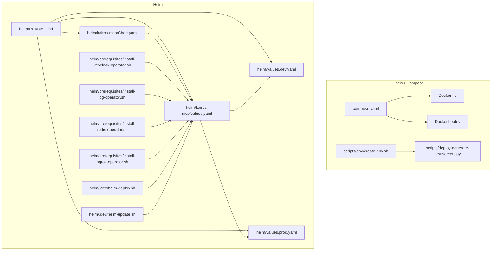
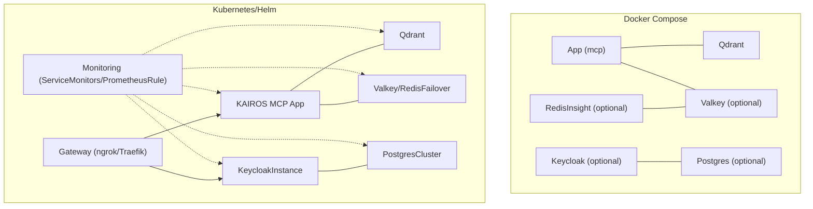
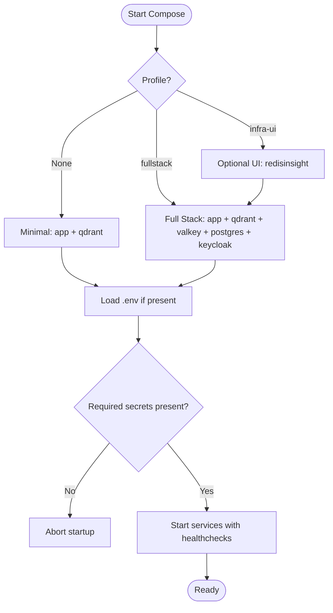
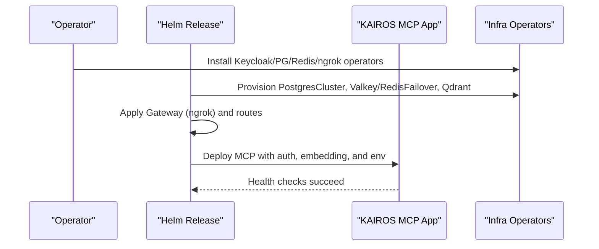
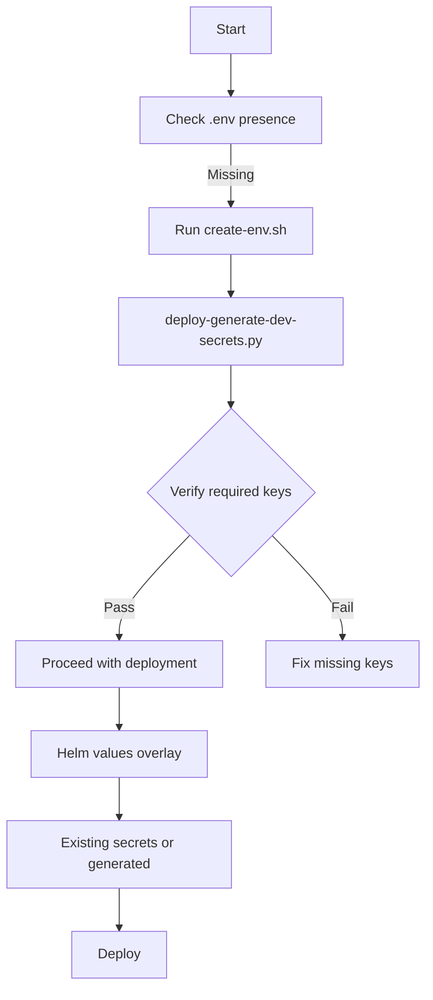
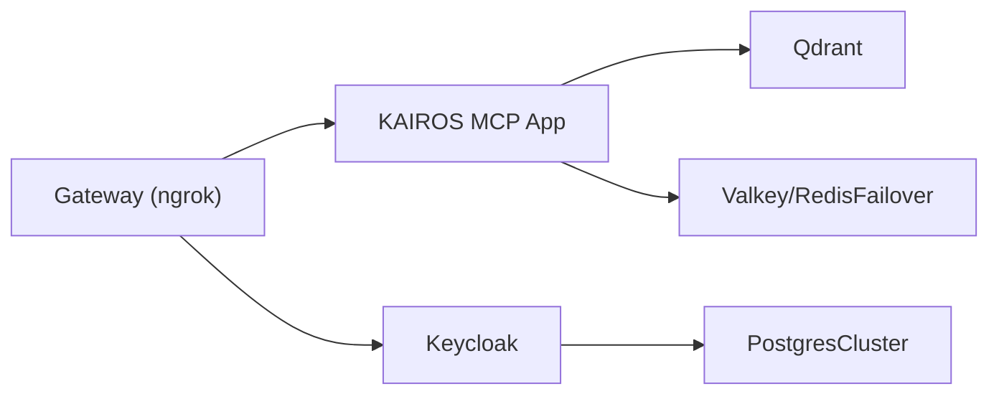

# Deployment & Operations

<cite>
**Referenced Files in This Document**
- [compose.yaml](file://compose.yaml)
- [Dockerfile](file://Dockerfile)
- [Dockerfile.dev](file://Dockerfile.dev)
- [scripts/env/create-env.sh](file://scripts/env/create-env.sh)
- [scripts/deploy-generate-dev-secrets.py](file://scripts/deploy-generate-dev-secrets.py)
- [scripts/deploy-dev-cli-ready.sh](file://scripts/deploy-dev-cli-ready.sh)
- [helm/README.md](file://helm/README.md)
- [helm/kairos-mcp/Chart.yaml](file://helm/kairos-mcp/Chart.yaml)
- [helm/kairos-mcp/values.yaml](file://helm/kairos-mcp/values.yaml)
- [helm/values.dev.yaml](file://helm/values.dev.yaml)
- [helm/values.prod.yaml](file://helm/values.prod.yaml)
- [helm/prerequisites/install-keycloak-operator.sh](file://helm/prerequisites/install-keycloak-operator.sh)
- [helm/prerequisites/install-pg-operator.sh](file://helm/prerequisites/install-pg-operator.sh)
- [helm/prerequisites/install-redis-operator.sh](file://helm/prerequisites/install-redis-operator.sh)
- [helm/prerequisites/install-ngrok-operator.sh](file://helm/prerequisites/install-ngrok-operator.sh)
- [helm/.dev/helm-deploy.sh](file://helm/.dev/helm-deploy.sh)
- [helm/.dev/helm-update.sh](file://helm/.dev/helm-update.sh)
</cite>

## Table of Contents
1. [Introduction](#introduction)
2. [Project Structure](#project-structure)
3. [Core Components](#core-components)
4. [Architecture Overview](#architecture-overview)
5. [Detailed Component Analysis](#detailed-component-analysis)
6. [Dependency Analysis](#dependency-analysis)
7. [Performance Considerations](#performance-considerations)
8. [Troubleshooting Guide](#troubleshooting-guide)
9. [Conclusion](#conclusion)
10. [Appendices](#appendices)

## Introduction
This document provides comprehensive deployment and operations guidance for KAIROS MCP across Docker Compose and Kubernetes/Helm environments. It covers minimal and full stack deployments, environment configuration, secret management, scaling parameters, monitoring, container orchestration, service discovery, and operational procedures. It also includes troubleshooting steps for common deployment issues.

## Project Structure
KAIROS MCP provides two primary deployment paths:
- Docker Compose for local and simple deployments with optional profiles for full stack and UI.
- Kubernetes/Helm for production-grade deployments with operator-driven infrastructure provisioning, gateway configuration, and monitoring.

**Diagram sources**
- [compose.yaml:1-183](file://compose.yaml#L1-L183)
- [Dockerfile:1-76](file://Dockerfile#L1-L76)
- [Dockerfile.dev:1-68](file://Dockerfile.dev#L1-L68)
- [scripts/env/create-env.sh:1-12](file://scripts/env/create-env.sh#L1-L12)
- [scripts/deploy-generate-dev-secrets.py:1-181](file://scripts/deploy-generate-dev-secrets.py#L1-L181)
- [helm/README.md:1-18](file://helm/README.md#L1-L18)
- [helm/kairos-mcp/Chart.yaml:1-23](file://helm/kairos-mcp/Chart.yaml#L1-L23)
- [helm/kairos-mcp/values.yaml:1-279](file://helm/kairos-mcp/values.yaml#L1-L279)
- [helm/values.dev.yaml:1-83](file://helm/values.dev.yaml#L1-L83)
- [helm/values.prod.yaml:1-94](file://helm/values.prod.yaml#L1-L94)
- [helm/prerequisites/install-keycloak-operator.sh:1-17](file://helm/prerequisites/install-keycloak-operator.sh#L1-L17)
- [helm/prerequisites/install-pg-operator.sh:1-16](file://helm/prerequisites/install-pg-operator.sh#L1-L16)
- [helm/prerequisites/install-redis-operator.sh:1-16](file://helm/prerequisites/install-redis-operator.sh#L1-L16)
- [helm/prerequisites/install-ngrok-operator.sh:1-38](file://helm/prerequisites/install-ngrok-operator.sh#L1-L38)
- [helm/.dev/helm-deploy.sh:1-242](file://helm/.dev/helm-deploy.sh#L1-L242)
- [helm/.dev/helm-update.sh:1-15](file://helm/.dev/helm-update.sh#L1-L15)

**Section sources**
- [compose.yaml:1-183](file://compose.yaml#L1-L183)
- [helm/README.md:1-18](file://helm/README.md#L1-L18)

## Core Components
- Application container image and health checks configured in Dockerfiles.
- Docker Compose services for Qdrant, optional Valkey/RedisInsight, Postgres, Keycloak, and the MCP application.
- Helm chart for Kubernetes with configurable profiles and operator-driven infrastructure.
- Scripts for environment generation, operator installation, and local Helm development.

**Section sources**
- [Dockerfile:1-76](file://Dockerfile#L1-L76)
- [Dockerfile.dev:1-68](file://Dockerfile.dev#L1-L68)
- [compose.yaml:10-183](file://compose.yaml#L10-L183)
- [helm/kairos-mcp/Chart.yaml:1-23](file://helm/kairos-mcp/Chart.yaml#L1-L23)
- [helm/kairos-mcp/values.yaml:1-279](file://helm/kairos-mcp/values.yaml#L1-L279)

## Architecture Overview
High-level deployment architectures for Docker Compose and Kubernetes/Helm:

**Diagram sources**
- [compose.yaml:10-183](file://compose.yaml#L10-L183)
- [helm/kairos-mcp/values.yaml:123-279](file://helm/kairos-mcp/values.yaml#L123-L279)
- [helm/values.dev.yaml:13-83](file://helm/values.dev.yaml#L13-L83)
- [helm/values.prod.yaml:10-94](file://helm/values.prod.yaml#L10-L94)

## Detailed Component Analysis

### Docker Compose Deployment
- Minimal stack: Qdrant + application.
- Full stack: adds Valkey, Postgres, Keycloak; optional UI via RedisInsight.
- Profiles:
  - Default (minimal): no profile flag.
  - Full stack: --profile fullstack.
  - Optional UI: --profile infra-ui (requires fullstack).
- Environment and secrets:
  - .env is required for full stack; generated from a template with scripts.
  - KEY_VALUE_STORE_PASSWORD (or REDIS_PASSWORD) is mandatory for Valkey in full stack.
  - QDRANT_API_KEY is mandatory for Qdrant.
- Volumes:
  - Named volumes for persistent data (Valkey, Qdrant, Postgres, RedisInsight).
  - Snapshot volume mounted for application backups.
- Networking:
  - Services communicate over a single bridge network.

**Diagram sources**
- [compose.yaml:4-8](file://compose.yaml#L4-L8)
- [compose.yaml:10-183](file://compose.yaml#L10-L183)
- [scripts/env/create-env.sh:1-12](file://scripts/env/create-env.sh#L1-12)
- [scripts/deploy-generate-dev-secrets.py:126-176](file://scripts/deploy-generate-dev-secrets.py#L126-L176)

**Section sources**
- [compose.yaml:4-8](file://compose.yaml#L4-L8)
- [compose.yaml:10-183](file://compose.yaml#L10-L183)
- [scripts/env/create-env.sh:1-12](file://scripts/env/create-env.sh#L1-L12)
- [scripts/deploy-generate-dev-secrets.py:126-176](file://scripts/deploy-generate-dev-secrets.py#L126-L176)

### Kubernetes/Helm Deployment
- Chart layout and quick start:
  - Operators, infrastructure, and application chart are organized under helm/.
  - Operators and ngrok infrastructure bootstrap are applied first.
- Helm values overlays:
  - values.dev.yaml: local development with ngrok, optional Keycloak realm import, embedded Ollama.
  - values.prod.yaml: production overlay with HPA, resource requests/limits, and monitoring disabled by default.
- Application configuration:
  - Image repository/tag, ports, auth realm/client/callback base URL, embedding provider configuration, and extra environment variables.
  - Horizontal Pod Autoscaling (HPA) and Vertical Pod Autoscaling (VPA) supported.
- Infrastructure operators:
  - Keycloak, Postgres, Redis, and ngrok operators installed via OLM or scripts.
- Gateway configuration:
  - GatewayClass “ngrok” is used; routes for MCP and Keycloak are configurable.
- Monitoring:
  - ServiceMonitors and PrometheusRule are configurable; defaults disabled.

**Diagram sources**
- [helm/README.md:1-18](file://helm/README.md#L1-L18)
- [helm/kairos-mcp/values.yaml:176-279](file://helm/kairos-mcp/values.yaml#L176-L279)
- [helm/values.dev.yaml:13-83](file://helm/values.dev.yaml#L13-L83)
- [helm/values.prod.yaml:10-94](file://helm/values.prod.yaml#L10-L94)

**Section sources**
- [helm/README.md:1-18](file://helm/README.md#L1-L18)
- [helm/kairos-mcp/Chart.yaml:1-23](file://helm/kairos-mcp/Chart.yaml#L1-L23)
- [helm/kairos-mcp/values.yaml:1-279](file://helm/kairos-mcp/values.yaml#L1-L279)
- [helm/values.dev.yaml:1-83](file://helm/values.dev.yaml#L1-L83)
- [helm/values.prod.yaml:1-94](file://helm/values.prod.yaml#L1-L94)

### Environment Configuration and Secret Management
- Development:
  - Generate .env from template using Python script; supports verification and regeneration.
  - Creates secrets for embedding provider and optional Keycloak realm import.
- Production:
  - Use Helm values overlays to reference existing secrets for embedding and configure OIDC groups allowlist.
  - Configure resource requests/limits and enable HPA/VPA for autoscaling.

**Diagram sources**
- [scripts/env/create-env.sh:1-12](file://scripts/env/create-env.sh#L1-L12)
- [scripts/deploy-generate-dev-secrets.py:126-176](file://scripts/deploy-generate-dev-secrets.py#L126-L176)
- [helm/values.prod.yaml:42-47](file://helm/values.prod.yaml#L42-L47)

**Section sources**
- [scripts/env/create-env.sh:1-12](file://scripts/env/create-env.sh#L1-L12)
- [scripts/deploy-generate-dev-secrets.py:126-176](file://scripts/deploy-generate-dev-secrets.py#L126-L176)
- [helm/values.prod.yaml:42-47](file://helm/values.prod.yaml#L42-L47)

### Scaling Parameters
- Kubernetes:
  - replicaCount for MCP app.
  - HPA with min/max replicas and CPU utilization target.
  - VPA for automatic resource tuning.
- Docker Compose:
  - Not applicable; scale via external orchestrator or reverse proxy.

**Section sources**
- [helm/kairos-mcp/values.yaml:73-87](file://helm/kairos-mcp/values.yaml#L73-L87)
- [helm/values.prod.yaml:37-41](file://helm/values.prod.yaml#L37-L41)

### Monitoring Setup
- ServiceMonitors and PrometheusRule are configurable under monitoring.
- Defaults are disabled; enable and align with your Prometheus Operator installation.

**Section sources**
- [helm/kairos-mcp/values.yaml:245-279](file://helm/kairos-mcp/values.yaml#L245-L279)

### Container Orchestration, Service Discovery, and Network Configuration
- Docker Compose:
  - Bridge network for service communication.
  - Health checks for readiness.
- Kubernetes:
  - GatewayClass “ngrok” with HTTPRoute/ReferenceGrant for routing.
  - Service discovery via Kubernetes DNS; MCP and Keycloak exposed via Gateway.

**Section sources**
- [compose.yaml:173-183](file://compose.yaml#L173-L183)
- [helm/kairos-mcp/values.yaml:88-122](file://helm/kairos-mcp/values.yaml#L88-L122)
- [helm/values.dev.yaml:41-59](file://helm/values.dev.yaml#L41-L59)
- [helm/values.prod.yaml:53-71](file://helm/values.prod.yaml#L53-L71)

### Operational Procedures
- Local development:
  - Build CLI, configure Keycloak realms, login via browser, and run a search test.
- Helm development:
  - Single entry point script installs operators, provisions infrastructure, and deploys chart with staged values.
  - Update script for quick upgrades with wait and timeout.

**Section sources**
- [scripts/deploy-dev-cli-ready.sh:1-24](file://scripts/deploy-dev-cli-ready.sh#L1-L24)
- [helm/.dev/helm-deploy.sh:1-242](file://helm/.dev/helm-deploy.sh#L1-L242)
- [helm/.dev/helm-update.sh:1-15](file://helm/.dev/helm-update.sh#L1-L15)

## Dependency Analysis
- Docker Compose:
  - App depends on Qdrant; optional dependencies on Valkey, Postgres, Keycloak; optional UI depends on Valkey.
- Kubernetes/Helm:
  - Chart depends on upstream Qdrant and Valkey Helm charts.
  - Operators provision PostgresCluster, RedisFailover, and Keycloak CRDs.

**Diagram sources**
- [compose.yaml:10-183](file://compose.yaml#L10-L183)
- [helm/kairos-mcp/Chart.yaml:14-23](file://helm/kairos-mcp/Chart.yaml#L14-L23)
- [helm/kairos-mcp/values.yaml:123-201](file://helm/kairos-mcp/values.yaml#L123-L201)

**Section sources**
- [compose.yaml:10-183](file://compose.yaml#L10-L183)
- [helm/kairos-mcp/Chart.yaml:14-23](file://helm/kairos-mcp/Chart.yaml#L14-L23)
- [helm/kairos-mcp/values.yaml:123-201](file://helm/kairos-mcp/values.yaml#L123-L201)

## Performance Considerations
- Qdrant memory tuning and logging level are configurable in Docker Compose.
- Kubernetes values include HPA and VPA for dynamic scaling and resource optimization.
- Embedding provider selection impacts latency and throughput; configure accordingly.

**Section sources**
- [compose.yaml:67-70](file://compose.yaml#L67-L70)
- [helm/kairos-mcp/values.yaml:73-87](file://helm/kairos-mcp/values.yaml#L73-L87)
- [helm/values.dev.yaml:30-37](file://helm/values.dev.yaml#L30-L37)
- [helm/values.prod.yaml:42-47](file://helm/values.prod.yaml#L42-L47)

## Troubleshooting Guide
- Docker Compose
  - Missing secrets: ensure KEY_VALUE_STORE_PASSWORD/REDIS_PASSWORD, QDRANT_API_KEY, and other required keys are set in .env.
  - Health checks failing: verify service ports and readiness endpoints.
  - Volume permissions: confirm named volumes exist and are writable.
- Kubernetes/Helm
  - Operator installation: ensure CRDs are established and namespaces are correctly targeted.
  - Gateway not ready: verify GatewayClass acceptance and route configuration.
  - Missing embedding secret: when Ollama is not enabled, ensure kairos-mcp-embedding secret is created with OPENAI_API_KEY.
  - Local dev script failures: confirm CLI build, Keycloak realm configuration, and successful login/search.

**Section sources**
- [compose.yaml:16-19](file://compose.yaml#L16-L19)
- [compose.yaml:66](file://compose.yaml#L66)
- [helm/prerequisites/install-keycloak-operator.sh:14](file://helm/prerequisites/install-keycloak-operator.sh#L14)
- [helm/prerequisites/install-pg-operator.sh:15](file://helm/prerequisites/install-pg-operator.sh#L15)
- [helm/prerequisites/install-redis-operator.sh:15](file://helm/prerequisites/install-redis-operator.sh#L15)
- [helm/prerequisites/install-ngrok-operator.sh:36](file://helm/prerequisites/install-ngrok-operator.sh#L36)
- [helm/.dev/helm-deploy.sh:214-233](file://helm/.dev/helm-deploy.sh#L214-L233)
- [scripts/deploy-dev-cli-ready.sh:18-22](file://scripts/deploy-dev-cli-ready.sh#L18-L22)

## Conclusion
KAIROS MCP supports straightforward deployments via Docker Compose for local and simple environments and robust Kubernetes/Helm deployments for production with operator-driven infrastructure, gateway routing, and monitoring. Proper environment configuration, secret management, and scaling parameters are essential for reliable operations.

## Appendices
- Docker Compose
  - Minimal: docker compose -p kairos-mcp up -d
  - Full stack: docker compose -p kairos-mcp --profile fullstack up -d
  - Optional UI: docker compose -p kairos-mcp --profile fullstack --profile infra-ui up -d
- Kubernetes/Helm
  - Quick start: apply operators and infrastructure, then install the chart with desired overlay.
  - Development: use helm/.dev/helm-deploy.sh for staged setup and upgrades.

**Section sources**
- [compose.yaml:4-8](file://compose.yaml#L4-L8)
- [helm/README.md:9-18](file://helm/README.md#L9-L18)
- [helm/.dev/helm-deploy.sh:1-242](file://helm/.dev/helm-deploy.sh#L1-L242)