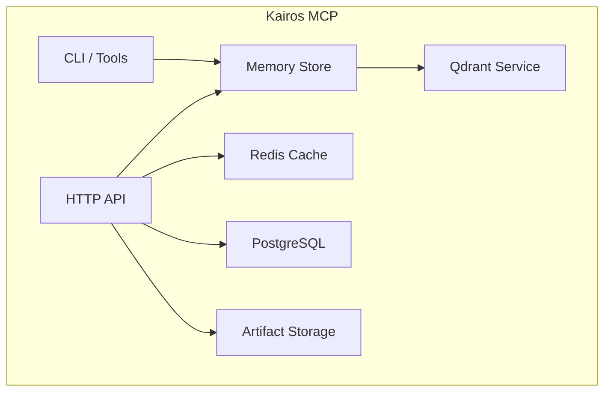
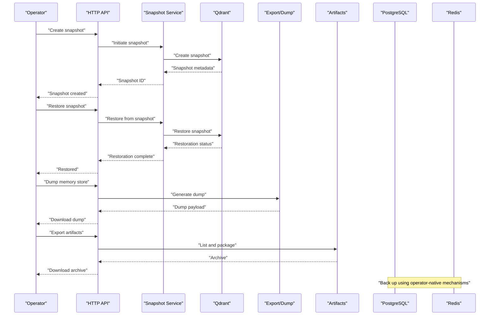
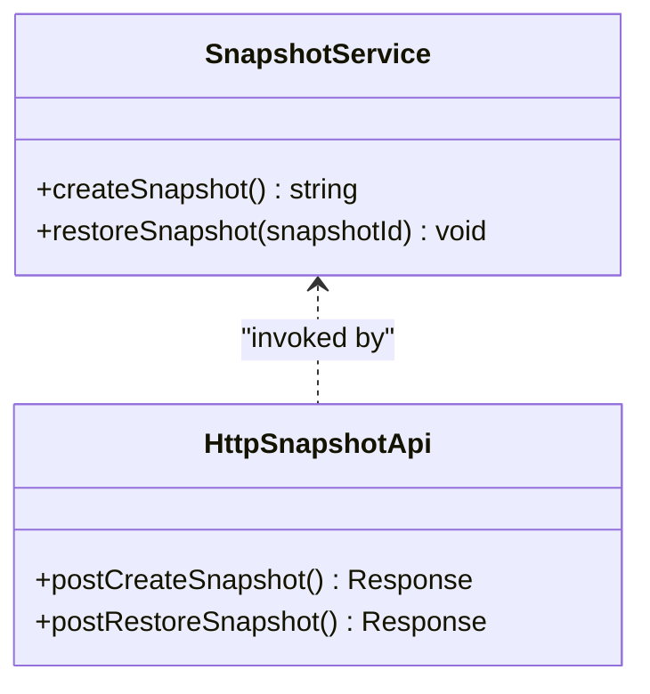
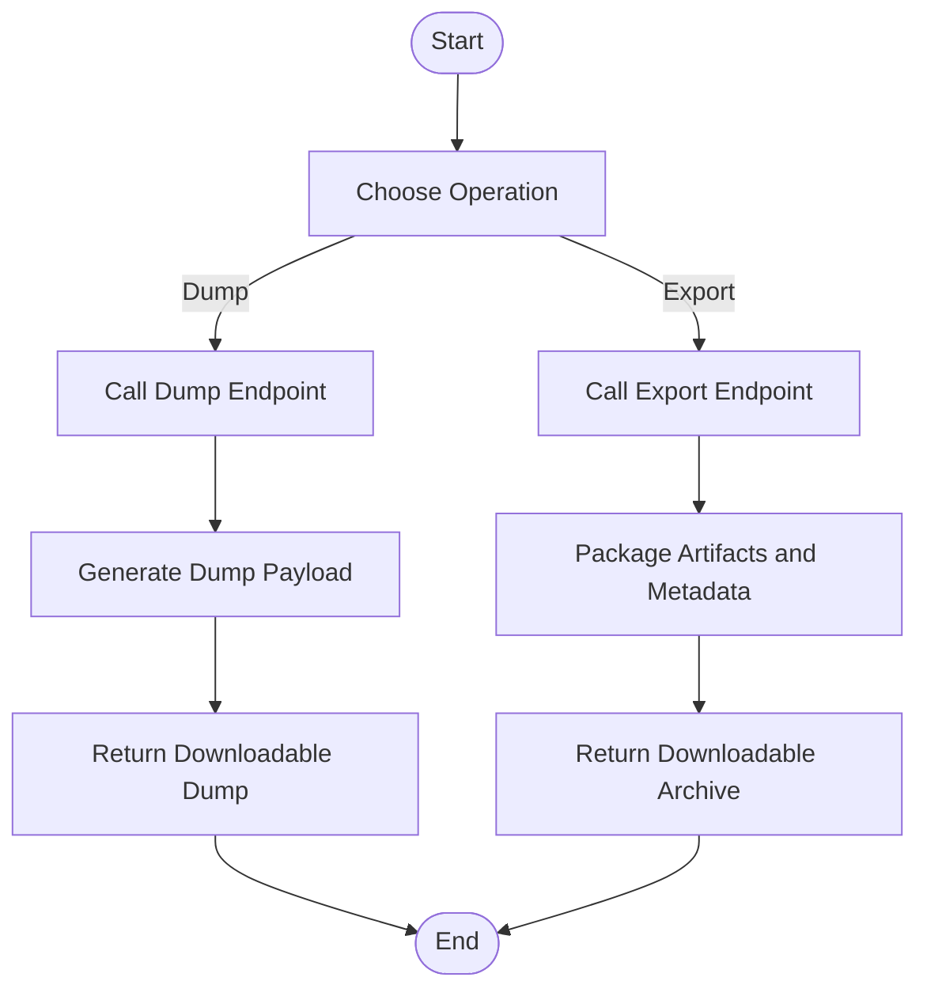
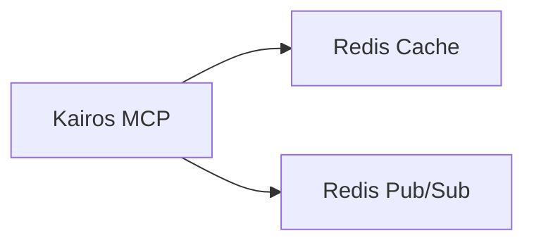
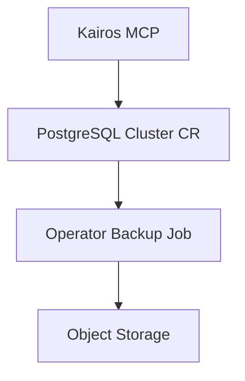
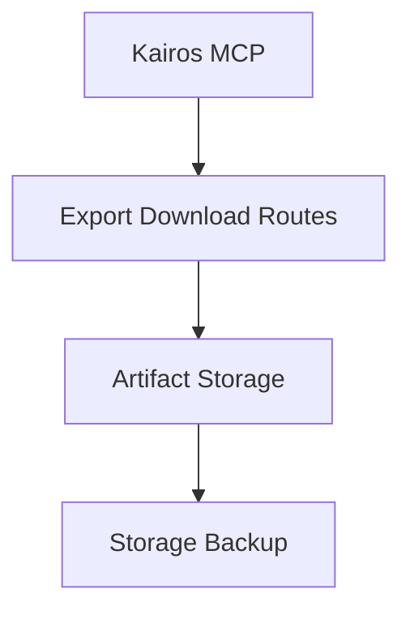
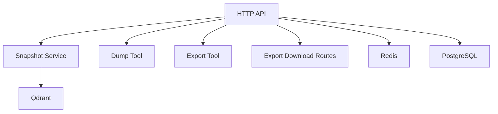

# Backup and Recovery

<cite>
**Referenced Files in This Document**
- [src/services/qdrant/snapshots.ts](file://src/services/qdrant/snapshots.ts)
- [src/http/http-api-snapshot.ts](file://src/http/http-api-snapshot.ts)
- [src/services/memory/store.ts](file://src/services/memory/store.ts)
- [src/services/memory/store-methods.ts](file://src/services/memory/store-methods.ts)
- [src/tools/dump.ts](file://src/tools/dump.ts)
- [src/http/http-api-dump.ts](file://src/http/http-api-dump.ts)
- [src/tools/export.ts](file://src/tools/export.ts)
- [src/http/http-export-download-routes.ts](file://src/http/http-export-download-routes.ts)
- [src/services/redis-cache.ts](file://src/services/redis-cache.ts)
- [src/services/redis.ts](file://src/services/redis.ts)
- [helm/kairos-mcp/templates/postgres-cluster-cr.yaml](file://helm/kairos-mcp/templates/postgres-cluster-cr.yaml)
- [helm/kairos-mcp/templates/redis-failover-cr.yaml](file://helm/kairos-mcp/templates/redis-failover-cr.yaml)
- [scripts/import-test-snapshot.sh](file://scripts/import-test-snapshot.sh)
- [scripts/seed-test-snapshot.sh](file://scripts/seed-test-snapshot.sh)
</cite>

## Table of Contents
1. [Introduction](#introduction)
2. [Project Structure](#project-structure)
3. [Core Components](#core-components)
4. [Architecture Overview](#architecture-overview)
5. [Detailed Component Analysis](#detailed-component-analysis)
6. [Dependency Analysis](#dependency-analysis)
7. [Performance Considerations](#performance-considerations)
8. [Troubleshooting Guide](#troubleshooting-guide)
9. [Conclusion](#conclusion)
10. [Appendices](#appendices)

## Introduction
This document provides comprehensive backup and recovery guidance for Kairos MCP, covering:
- Data export/import procedures for memory store, artifacts, and workflow states
- Snapshot creation and restoration for the Qdrant vector database
- PostgreSQL backup strategies
- Redis cache considerations
- Artifact storage backup
- Disaster recovery procedures
- Data migration strategies
- Testing recovery processes
- Automated backup scheduling and retention policies

The goal is to enable operators to protect data integrity, minimize downtime, and reliably restore services across environments.

## Project Structure
Kairos MCP integrates multiple persistent components:
- Memory store (vector search via Qdrant)
- Relational data via PostgreSQL (managed by an operator)
- Caching and pub/sub via Redis (managed by an operator)
- Artifacts stored on disk or external storage
- HTTP APIs and CLI tools for exporting and dumping data

[No sources needed since this diagram shows conceptual workflow, not actual code structure]

## Core Components
- Qdrant snapshot management for vector index snapshots
- Dump and export utilities for memory store content and artifacts
- Redis configuration for caching and pub/sub behavior
- Helm templates for PostgreSQL and Redis deployment configurations

Key responsibilities:
- Create and restore Qdrant snapshots
- Export and import memory store data and artifacts
- Configure and back up PostgreSQL and Redis
- Provide operational scripts for testing and seeding

**Section sources**
- [src/services/qdrant/snapshots.ts](file://src/services/qdrant/snapshots.ts)
- [src/http/http-api-snapshot.ts](file://src/http/http-api-snapshot.ts)
- [src/services/memory/store.ts](file://src/services/memory/store.ts)
- [src/services/memory/store-methods.ts](file://src/services/memory/store-methods.ts)
- [src/tools/dump.ts](file://src/tools/dump.ts)
- [src/http/http-api-dump.ts](file://src/http/http-api-dump.ts)
- [src/tools/export.ts](file://src/tools/export.ts)
- [src/http/http-export-download-routes.ts](file://src/http/http-export-download-routes.ts)
- [src/services/redis-cache.ts](file://src/services/redis-cache.ts)
- [src/services/redis.ts](file://src/services/redis.ts)
- [helm/kairos-mcp/templates/postgres-cluster-cr.yaml](file://helm/kairos-mcp/templates/postgres-cluster-cr.yaml)
- [helm/kairos-mcp/templates/redis-failover-cr.yaml](file://helm/kairos-mcp/templates/redis-failover-cr.yaml)

## Architecture Overview
Backup and recovery spans several subsystems:
- Vector index snapshots are managed through dedicated snapshot endpoints and service logic
- Memory store data can be dumped and exported via HTTP and CLI interfaces
- Artifacts are downloadable through specific routes
- PostgreSQL and Redis are provisioned via Kubernetes operators with their own backup mechanisms

**Diagram sources**
- [src/http/http-api-snapshot.ts](file://src/http/http-api-snapshot.ts)
- [src/services/qdrant/snapshots.ts](file://src/services/qdrant/snapshots.ts)
- [src/http/http-api-dump.ts](file://src/http/http-api-dump.ts)
- [src/tools/dump.ts](file://src/tools/dump.ts)
- [src/http/http-export-download-routes.ts](file://src/http/http-export-download-routes.ts)
- [src/tools/export.ts](file://src/tools/export.ts)

## Detailed Component Analysis

### Qdrant Snapshot Management
- Creation: The snapshot service coordinates with Qdrant to create a consistent snapshot of the vector index.
- Restoration: The service triggers a restore operation from a specified snapshot and reports completion.
- API exposure: HTTP endpoints wrap these operations for operator interaction.

**Diagram sources**
- [src/services/qdrant/snapshots.ts](file://src/services/qdrant/snapshots.ts)
- [src/http/http-api-snapshot.ts](file://src/http/http-api-snapshot.ts)

**Section sources**
- [src/services/qdrant/snapshots.ts](file://src/services/qdrant/snapshots.ts)
- [src/http/http-api-snapshot.ts](file://src/http/http-api-snapshot.ts)

### Memory Store Dump and Export
- Dump: Generates a structured representation of memory store contents for archival or migration.
- Export: Produces artifact bundles and related metadata for portability.
- HTTP endpoints expose both dump and export capabilities for automation.

**Diagram sources**
- [src/tools/dump.ts](file://src/tools/dump.ts)
- [src/http/http-api-dump.ts](file://src/http/http-api-dump.ts)
- [src/tools/export.ts](file://src/tools/export.ts)
- [src/http/http-export-download-routes.ts](file://src/http/http-export-download-routes.ts)

**Section sources**
- [src/services/memory/store.ts](file://src/services/memory/store.ts)
- [src/services/memory/store-methods.ts](file://src/services/memory/store-methods.ts)
- [src/tools/dump.ts](file://src/tools/dump.ts)
- [src/http/http-api-dump.ts](file://src/http/http-api-dump.ts)
- [src/tools/export.ts](file://src/tools/export.ts)
- [src/http/http-export-download-routes.ts](file://src/http/http-export-download-routes.ts)

### Redis Cache Considerations
- Role: Provides caching and pub/sub functionality; typically ephemeral but may hold transient state.
- Configuration: Connection settings and behavior are defined in service modules.
- Backup strategy: Since caches are often transient, focus on replication and failover rather than persistent backups.

**Diagram sources**
- [src/services/redis-cache.ts](file://src/services/redis-cache.ts)
- [src/services/redis.ts](file://src/services/redis.ts)

**Section sources**
- [src/services/redis-cache.ts](file://src/services/redis-cache.ts)
- [src/services/redis.ts](file://src/services/redis.ts)

### PostgreSQL Backup Strategies
- Provisioning: Managed via a PostgreSQL cluster custom resource.
- Operator-backed backups: Use the operator’s built-in backup and restore features to capture consistent snapshots of relational data.
- Retention: Configure retention policies at the operator level to manage storage costs and compliance.

**Diagram sources**
- [helm/kairos-mcp/templates/postgres-cluster-cr.yaml](file://helm/kairos-mcp/templates/postgres-cluster-cr.yaml)

**Section sources**
- [helm/kairos-mcp/templates/postgres-cluster-cr.yaml](file://helm/kairos-mcp/templates/postgres-cluster-cr.yaml)

### Artifact Storage Backup
- Artifacts are accessible via download routes and can be packaged for export.
- Ensure underlying storage (filesystem or object store) is backed up independently to preserve binary assets.

**Diagram sources**
- [src/http/http-export-download-routes.ts](file://src/http/http-export-download-routes.ts)
- [src/tools/export.ts](file://src/tools/export.ts)

**Section sources**
- [src/http/http-export-download-routes.ts](file://src/http/http-export-download-routes.ts)
- [src/tools/export.ts](file://src/tools/export.ts)

## Dependency Analysis
- HTTP API depends on snapshot service, dump/export tools, and artifact routes.
- Memory store interacts with Qdrant for vector operations and may use Redis for caching.
- PostgreSQL and Redis are provisioned via Kubernetes operators and should be backed up using operator-native mechanisms.

**Diagram sources**
- [src/http/http-api-snapshot.ts](file://src/http/http-api-snapshot.ts)
- [src/services/qdrant/snapshots.ts](file://src/services/qdrant/snapshots.ts)
- [src/tools/dump.ts](file://src/tools/dump.ts)
- [src/tools/export.ts](file://src/tools/export.ts)
- [src/http/http-export-download-routes.ts](file://src/http/http-export-download-routes.ts)
- [src/services/redis.ts](file://src/services/redis.ts)

**Section sources**
- [src/http/http-api-snapshot.ts](file://src/http/http-api-snapshot.ts)
- [src/services/qdrant/snapshots.ts](file://src/services/qdrant/snapshots.ts)
- [src/tools/dump.ts](file://src/tools/dump.ts)
- [src/tools/export.ts](file://src/tools/export.ts)
- [src/http/http-export-download-routes.ts](file://src/http/http-export-download-routes.ts)
- [src/services/redis.ts](file://src/services/redis.ts)

## Performance Considerations
- Scheduling snapshots during low-traffic windows to reduce contention.
- Staggering exports and dumps to avoid I/O spikes.
- Using incremental or differential backups where supported by operators.
- Monitoring snapshot size and restore time to plan capacity and RTO/RPO targets.

[No sources needed since this section provides general guidance]

## Troubleshooting Guide
- Verify snapshot availability and integrity before attempting restore.
- Validate that dump payloads match expected schema when importing into target environments.
- Confirm Redis connectivity and TTL settings if restoring cached state is required.
- Check PostgreSQL operator logs for backup job success and retention policy enforcement.

**Section sources**
- [src/services/qdrant/snapshots.ts](file://src/services/qdrant/snapshots.ts)
- [src/http/http-api-snapshot.ts](file://src/http/http-api-snapshot.ts)
- [src/tools/dump.ts](file://src/tools/dump.ts)
- [src/http/http-api-dump.ts](file://src/http/http-api-dump.ts)
- [src/services/redis-cache.ts](file://src/services/redis-cache.ts)
- [src/services/redis.ts](file://src/services/redis.ts)
- [helm/kairos-mcp/templates/postgres-cluster-cr.yaml](file://helm/kairos-mcp/templates/postgres-cluster-cr.yaml)

## Conclusion
A robust backup and recovery strategy for Kairos MCP combines:
- Consistent Qdrant snapshots for vector indexes
- Structured dumps and exports for memory store and artifacts
- Operator-managed backups for PostgreSQL and Redis
- Clear disaster recovery procedures and tested restoration workflows
- Automated scheduling and retention aligned with organizational policies

[No sources needed since this section summarizes without analyzing specific files]

## Appendices

### Operational Procedures

#### Create Qdrant Snapshot
- Trigger snapshot creation via the snapshot endpoint.
- Record the returned snapshot identifier for later restoration.

**Section sources**
- [src/http/http-api-snapshot.ts](file://src/http/http-api-snapshot.ts)
- [src/services/qdrant/snapshots.ts](file://src/services/qdrant/snapshots.ts)

#### Restore Qdrant Snapshot
- Invoke the restore endpoint with the snapshot identifier.
- Monitor restoration status and verify vector search consistency post-restore.

**Section sources**
- [src/http/http-api-snapshot.ts](file://src/http/http-api-snapshot.ts)
- [src/services/qdrant/snapshots.ts](file://src/services/qdrant/snapshots.ts)

#### Export Memory Store and Artifacts
- Use the dump endpoint to generate a structured dump of memory store data.
- Use the export endpoint to package artifacts and associated metadata.
- Download resulting payloads for archival or migration.

**Section sources**
- [src/http/http-api-dump.ts](file://src/http/http-api-dump.ts)
- [src/tools/dump.ts](file://src/tools/dump.ts)
- [src/http/http-export-download-routes.ts](file://src/http/http-export-download-routes.ts)
- [src/tools/export.ts](file://src/tools/export.ts)

#### Import Test Snapshot
- Utilize provided scripts to seed or import test snapshots for validation.

**Section sources**
- [scripts/import-test-snapshot.sh](file://scripts/import-test-snapshot.sh)
- [scripts/seed-test-snapshot.sh](file://scripts/seed-test-snapshot.sh)

#### PostgreSQL Backup and Restore
- Configure backups using the PostgreSQL operator’s custom resource definitions.
- Schedule periodic backups and define retention policies at the operator level.
- Restore from operator-managed backups following standard operator procedures.

**Section sources**
- [helm/kairos-mcp/templates/postgres-cluster-cr.yaml](file://helm/kairos-mcp/templates/postgres-cluster-cr.yaml)

#### Redis Failover and Resilience
- Deploy Redis with failover support via the Redis operator.
- Focus on high availability and replication rather than persistent backups for ephemeral cache data.

**Section sources**
- [helm/kairos-mcp/templates/redis-failover-cr.yaml](file://helm/kairos-mcp/templates/redis-failover-cr.yaml)

### Automated Backup Scheduling and Retention Policies
- Schedule Qdrant snapshots periodically using external orchestrators (e.g., CronJob).
- Configure PostgreSQL operator backup schedules and retention windows.
- Periodically trigger memory store dumps and artifact exports based on change frequency.
- Define retention policies for all backups to balance cost and compliance requirements.

[No sources needed since this section provides general guidance]