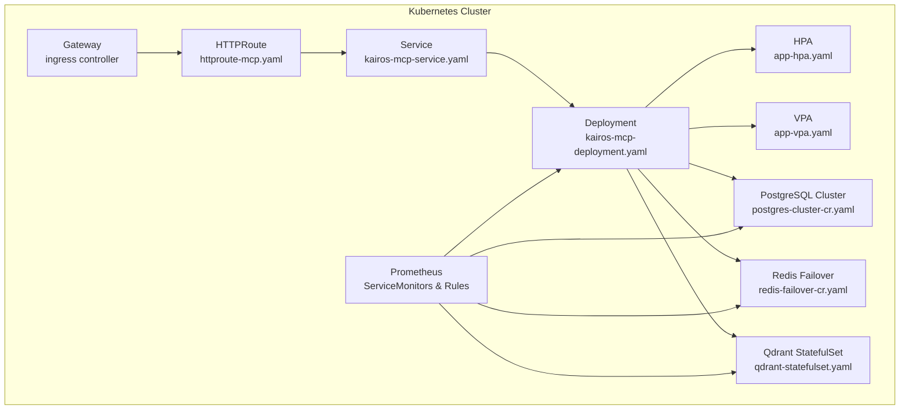
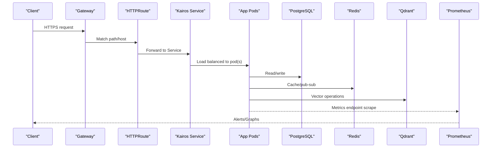
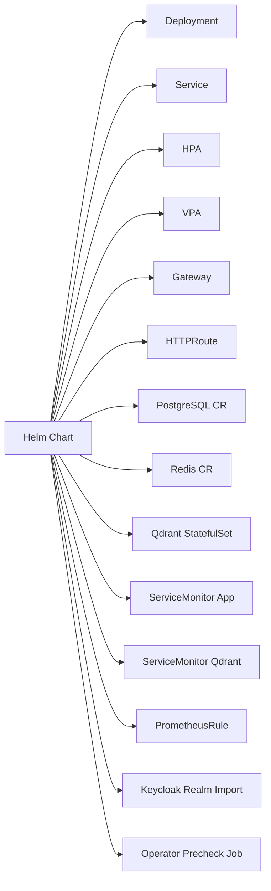

# Deployment and Operations

<cite>
**Referenced Files in This Document**
- [helm/README.md](file://helm/README.md)
- [helm/kairos-mcp/Chart.yaml](file://helm/kairos-mcp/Chart.yaml)
- [helm/kairos-mcp/values.yaml](file://helm/kairos-mcp/values.yaml)
- [helm/kairos-mcp/templates/kairos-mcp-deployment.yaml](file://helm/kairos-mcp/templates/kairos-mcp-deployment.yaml)
- [helm/kairos-mcp/templates/kairos-mcp-service.yaml](file://helm/kairos-mcp/templates/kairos-mcp-service.yaml)
- [helm/kairos-mcp/templates/app-hpa.yaml](file://helm/kairos-mcp/templates/app-hpa.yaml)
- [helm/kairos-mcp/templates/app-vpa.yaml](file://helm/kairos-mcp/templates/app-vpa.yaml)
- [helm/kairos-mcp/templates/gateway.yaml](file://helm/kairos-mcp/templates/gateway.yaml)
- [helm/kairos-mcp/templates/httproute-mcp.yaml](file://helm/kairos-mcp/templates/httproute-mcp.yaml)
- [helm/kairos-mcp/templates/postgres-cluster-cr.yaml](file://helm/kairos-mcp/templates/postgres-cluster-cr.yaml)
- [helm/kairos-mcp/templates/redis-failover-cr.yaml](file://helm/kairos-mcp/templates/redis-failover-cr.yaml)
- [helm/kairos-mcp/templates/qdrant-statefulset.yaml](file://helm/kairos-mcp/templates/qdrant-statefulset.yaml)
- [helm/kairos-mcp/templates/qdrant-servicemonitor.yaml](file://helm/kairos-mcp/templates/qdrant-servicemonitor.yaml)
- [helm/kairos-mcp/templates/prometheusrule.yaml](file://helm/kairos-mcp/templates/prometheusrule.yaml)
- [helm/kairos-mcp/templates/app-servicemonitor.yaml](file://helm/kairos-mcp/templates/app-servicemonitor.yaml)
- [helm/kairos-mcp/templates/keycloak-realm-import.yaml](file://helm/kairos-mcp/templates/keycloak-realm-import.yaml)
- [helm/kairos-mcp/templates/operator-precheck-job.yaml](file://helm/kairos-mcp/templates/operator-precheck-job.yaml)
- [helm/.dev/values.yaml](file://helm/.dev/values.yaml)
- [helm/.dev/values-tls.yaml](file://helm/.dev/values-tls.yaml)
- [helm/.dev/values-full.yaml](file://helm/.dev/values-full.yaml)
- [helm/values.prod.yaml](file://helm/values.prod.yaml)
- [src/http/http-health-routes.ts](file://src/http/http-health-routes.ts)
- [src/http/http-metrics-middleware.ts](file://src/http/http-metrics-middleware.ts)
- [src/metrics-server.ts](file://src/metrics-server.ts)
- [src/utils/structured-logger.ts](file://src/utils/structured-logger.ts)
- [scripts/kairos-db-init/README.md](file://scripts/kairos-db-init/README.md)
- [docs/install/helm.md](file://docs/install/helm.md)
- [docs/architecture/logging.md](file://docs/architecture/logging.md)
- [docs/security/incident-runbook.md](file://docs/security/incident-runbook.md)
</cite>

## Table of Contents
1. [Introduction](#introduction)
2. [Project Structure](#project-structure)
3. [Core Components](#core-components)
4. [Architecture Overview](#architecture-overview)
5. [Detailed Component Analysis](#detailed-component-analysis)
6. [Dependency Analysis](#dependency-analysis)
7. [Performance Considerations](#performance-considerations)
8. [Troubleshooting Guide](#troubleshooting-guide)
9. [Conclusion](#conclusion)
10. [Appendices](#appendices)

## Introduction
This document provides production-grade guidance for deploying and operating Kairos MCP on Kubernetes using Helm. It covers deployment strategies, scaling and load balancing, monitoring and observability (Prometheus metrics, structured logging, health checks), backup and recovery, performance tuning, capacity planning, high availability, disaster recovery, and operational runbooks for common incidents.

## Project Structure
Kairos MCP is deployed via a Helm chart that provisions the application, ingress/gateway, stateful services (PostgreSQL, Redis, Qdrant), and observability resources. The chart includes:
- Application Deployment and Service
- Horizontal and Vertical Pod Autoscalers
- Gateway and HTTPRoute for traffic routing
- Stateful components (database, cache, vector store)
- Prometheus ServiceMonitor and rules
- Operator prechecks and Keycloak realm import

**Diagram sources**
- [helm/kairos-mcp/templates/kairos-mcp-deployment.yaml](file://helm/kairos-mcp/templates/kairos-mcp-deployment.yaml)
- [helm/kairos-mcp/templates/kairos-mcp-service.yaml](file://helm/kairos-mcp/templates/kairos-mcp-service.yaml)
- [helm/kairos-mcp/templates/app-hpa.yaml](file://helm/kairos-mcp/templates/app-hpa.yaml)
- [helm/kairos-mcp/templates/app-vpa.yaml](file://helm/kairos-mcp/templates/app-vpa.yaml)
- [helm/kairos-mcp/templates/gateway.yaml](file://helm/kairos-mcp/templates/gateway.yaml)
- [helm/kairos-mcp/templates/httproute-mcp.yaml](file://helm/kairos-mcp/templates/httproute-mcp.yaml)
- [helm/kairos-mcp/templates/postgres-cluster-cr.yaml](file://helm/kairos-mcp/templates/postgres-cluster-cr.yaml)
- [helm/kairos-mcp/templates/redis-failover-cr.yaml](file://helm/kairos-mcp/templates/redis-failover-cr.yaml)
- [helm/kairos-mcp/templates/qdrant-statefulset.yaml](file://helm/kairos-mcp/templates/qdrant-statefulset.yaml)
- [helm/kairos-mcp/templates/app-servicemonitor.yaml](file://helm/kairos-mcp/templates/app-servicemonitor.yaml)
- [helm/kairos-mcp/templates/qdrant-servicemonitor.yaml](file://helm/kairos-mcp/templates/qdrant-servicemonitor.yaml)
- [helm/kairos-mcp/templates/prometheusrule.yaml](file://helm/kairos-mcp/templates/prometheusrule.yaml)

**Section sources**
- [helm/README.md](file://helm/README.md)
- [helm/kairos-mcp/Chart.yaml](file://helm/kairos-mcp/Chart.yaml)
- [docs/install/helm.md](file://docs/install/helm.md)

## Core Components
- Application server: Exposes HTTP API, MCP endpoints, UI assets, and health/metrics routes.
- Ingress/Gateway: Routes external traffic to the service via HTTPRoute.
- Databases and caches:
  - PostgreSQL for relational data.
  - Redis for caching and pub/sub.
  - Qdrant for vector search and embeddings.
- Observability:
  - Prometheus scraping via ServiceMonitors.
  - Structured logging for application logs.
  - Health check endpoints for readiness/liveness.
- Autoscaling:
  - HPA based on CPU/memory or custom metrics.
  - VPA for resource recommendations.

**Section sources**
- [helm/kairos-mcp/templates/kairos-mcp-deployment.yaml](file://helm/kairos-mcp/templates/kairos-mcp-deployment.yaml)
- [helm/kairos-mcp/templates/kairos-mcp-service.yaml](file://helm/kairos-mcp/templates/kairos-mcp-service.yaml)
- [helm/kairos-mcp/templates/app-hpa.yaml](file://helm/kairos-mcp/templates/app-hpa.yaml)
- [helm/kairos-mcp/templates/app-vpa.yaml](file://helm/kairos-mcp/templates/app-vpa.yaml)
- [helm/kairos-mcp/templates/gateway.yaml](file://helm/kairos-mcp/templates/gateway.yaml)
- [helm/kairos-mcp/templates/httproute-mcp.yaml](file://helm/kairos-mcp/templates/httproute-mcp.yaml)
- [helm/kairos-mcp/templates/postgres-cluster-cr.yaml](file://helm/kairos-mcp/templates/postgres-cluster-cr.yaml)
- [helm/kairos-mcp/templates/redis-failover-cr.yaml](file://helm/kairos-mcp/templates/redis-failover-cr.yaml)
- [helm/kairos-mcp/templates/qdrant-statefulset.yaml](file://helm/kairos-mcp/templates/qdrant-statefulset.yaml)
- [helm/kairos-mcp/templates/app-servicemonitor.yaml](file://helm/kairos-mcp/templates/app-servicemonitor.yaml)
- [helm/kairos-mcp/templates/qdrant-servicemonitor.yaml](file://helm/kairos-mcp/templates/qdrant-servicemonitor.yaml)
- [helm/kairos-mcp/templates/prometheusrule.yaml](file://helm/kairos-mcp/templates/prometheusrule.yaml)
- [src/http/http-health-routes.ts](file://src/http/http-health-routes.ts)
- [src/http/http-metrics-middleware.ts](file://src/http/http-metrics-middleware.ts)
- [src/metrics-server.ts](file://src/metrics-server.ts)
- [src/utils/structured-logger.ts](file://src/utils/structured-logger.ts)

## Architecture Overview
The production architecture centers around a stateless application layer behind an ingress gateway, with stateful backends managed by operators. Traffic flows from clients through the gateway to the application service, which interacts with PostgreSQL, Redis, and Qdrant. Prometheus scrapes metrics from all components.

**Diagram sources**
- [helm/kairos-mcp/templates/gateway.yaml](file://helm/kairos-mcp/templates/gateway.yaml)
- [helm/kairos-mcp/templates/httproute-mcp.yaml](file://helm/kairos-mcp/templates/httproute-mcp.yaml)
- [helm/kairos-mcp/templates/kairos-mcp-service.yaml](file://helm/kairos-mcp/templates/kairos-mcp-service.yaml)
- [helm/kairos-mcp/templates/kairos-mcp-deployment.yaml](file://helm/kairos-mcp/templates/kairos-mcp-deployment.yaml)
- [helm/kairos-mcp/templates/postgres-cluster-cr.yaml](file://helm/kairos-mcp/templates/postgres-cluster-cr.yaml)
- [helm/kairos-mcp/templates/redis-failover-cr.yaml](file://helm/kairos-mcp/templates/redis-failover-cr.yaml)
- [helm/kairos-mcp/templates/qdrant-statefulset.yaml](file://helm/kairos-mcp/templates/qdrant-statefulset.yaml)
- [helm/kairos-mcp/templates/app-servicemonitor.yaml](file://helm/kairos-mcp/templates/app-servicemonitor.yaml)
- [helm/kairos-mcp/templates/qdrant-servicemonitor.yaml](file://helm/kairos-mcp/templates/qdrant-servicemonitor.yaml)
- [helm/kairos-mcp/templates/prometheusrule.yaml](file://helm/kairos-mcp/templates/prometheusrule.yaml)

## Detailed Component Analysis

### Helm Chart and Values
- Chart metadata and dependencies are defined in the chart manifest.
- Default values include configuration for app replicas, storage classes, TLS, and operator features.
- Production values override defaults for HA, persistence, autoscaling, and security.

Key files:
- Chart definition and versioning
- Default values and feature toggles
- Production overrides

**Section sources**
- [helm/kairos-mcp/Chart.yaml](file://helm/kairos-mcp/Chart.yaml)
- [helm/kairos-mcp/values.yaml](file://helm/kairos-mcp/values.yaml)
- [helm/values.prod.yaml](file://helm/values.prod.yaml)

### Application Deployment and Scaling
- Deployment defines container specs, environment variables, probes, and resource requests/limits.
- HPA scales pods based on CPU/memory or custom metrics exposed by the app.
- VPA recommends resource adjustments over time.

Operational notes:
- Ensure readiness and liveness probes are configured to avoid rolling update issues.
- Set appropriate min/max replicas for baseline capacity and burst handling.
- Use VPA in recommendation mode during ramp-up, then apply suggested values.

**Section sources**
- [helm/kairos-mcp/templates/kairos-mcp-deployment.yaml](file://helm/kairos-mcp/templates/kairos-mcp-deployment.yaml)
- [helm/kairos-mcp/templates/app-hpa.yaml](file://helm/kairos-mcp/templates/app-hpa.yaml)
- [helm/kairos-mcp/templates/app-vpa.yaml](file://helm/kairos-mcp/templates/app-vpa.yaml)

### Networking and Load Balancing
- Gateway resource configures ingress controller settings.
- HTTPRoute maps host/path to the internal Service.
- Service exposes the app within the cluster; external access is via Gateway.

Best practices:
- Enable TLS termination at the Gateway.
- Configure connection limits and timeouts per your expected concurrency.
- Use sticky sessions only if required by application state (stateless design preferred).

**Section sources**
- [helm/kairos-mcp/templates/gateway.yaml](file://helm/kairos-mcp/templates/gateway.yaml)
- [helm/kairos-mcp/templates/httproute-mcp.yaml](file://helm/kairos-mcp/templates/httproute-mcp.yaml)
- [helm/kairos-mcp/templates/kairos-mcp-service.yaml](file://helm/kairos-mcp/templates/kairos-mcp-service.yaml)

### Stateful Services
- PostgreSQL: Managed cluster CR; ensure backups and replication are enabled.
- Redis: Failover CR for HA; configure persistence and memory policies.
- Qdrant: StatefulSet for vector index; allocate sufficient disk and CPU for indexing workloads.

Capacity tips:
- Size Postgres based on dataset growth and query patterns.
- Tune Redis maxmemory and eviction policy according to cache usage.
- Monitor Qdrant collection sizes and adjust shard count and replica factor.

**Section sources**
- [helm/kairos-mcp/templates/postgres-cluster-cr.yaml](file://helm/kairos-mcp/templates/postgres-cluster-cr.yaml)
- [helm/kairos-mcp/templates/redis-failover-cr.yaml](file://helm/kairos-mcp/templates/redis-failover-cr.yaml)
- [helm/kairos-mcp/templates/qdrant-statefulset.yaml](file://helm/kairos-mcp/templates/qdrant-statefulset.yaml)

### Observability and Monitoring
- Prometheus ServiceMonitors collect metrics from the app, Qdrant, and other components.
- Custom PrometheusRules define alerting thresholds.
- Application exposes health endpoints and metrics middleware.
- Structured logger emits JSON logs for log aggregation.

Implementation references:
- Health endpoints for readiness/liveness
- Metrics middleware and separate metrics server
- ServiceMonitors and PrometheusRules
- Structured logging utility

**Section sources**
- [src/http/http-health-routes.ts](file://src/http/http-health-routes.ts)
- [src/http/http-metrics-middleware.ts](file://src/http/http-metrics-middleware.ts)
- [src/metrics-server.ts](file://src/metrics-server.ts)
- [src/utils/structured-logger.ts](file://src/utils/structured-logger.ts)
- [helm/kairos-mcp/templates/app-servicemonitor.yaml](file://helm/kairos-mcp/templates/app-servicemonitor.yaml)
- [helm/kairos-mcp/templates/qdrant-servicemonitor.yaml](file://helm/kairos-mcp/templates/qdrant-servicemonitor.yaml)
- [helm/kairos-mcp/templates/prometheusrule.yaml](file://helm/kairos-mcp/templates/prometheusrule.yaml)
- [docs/architecture/logging.md](file://docs/architecture/logging.md)

### Authentication and Realm Import
- Keycloak realm import job applies configuration for OIDC integration.
- Ensure realm JSON is up-to-date and secrets are provisioned before rollout.

**Section sources**
- [helm/kairos-mcp/templates/keycloak-realm-import.yaml](file://helm/kairos-mcp/templates/keycloak-realm-import.yaml)

### Pre-install Checks
- Operator precheck job validates prerequisites (operators, CRDs, permissions).
- Use this to fail fast during CI/CD and prevent partial deployments.

**Section sources**
- [helm/kairos-mcp/templates/operator-precheck-job.yaml](file://helm/kairos-mcp/templates/operator-precheck-job.yaml)

## Dependency Analysis
The Helm chart orchestrates multiple Kubernetes resources and external integrations. The following diagram shows key runtime dependencies between chart templates.

**Diagram sources**
- [helm/kairos-mcp/templates/kairos-mcp-deployment.yaml](file://helm/kairos-mcp/templates/kairos-mcp-deployment.yaml)
- [helm/kairos-mcp/templates/kairos-mcp-service.yaml](file://helm/kairos-mcp/templates/kairos-mcp-service.yaml)
- [helm/kairos-mcp/templates/app-hpa.yaml](file://helm/kairos-mcp/templates/app-hpa.yaml)
- [helm/kairos-mcp/templates/app-vpa.yaml](file://helm/kairos-mcp/templates/app-vpa.yaml)
- [helm/kairos-mcp/templates/gateway.yaml](file://helm/kairos-mcp/templates/gateway.yaml)
- [helm/kairos-mcp/templates/httproute-mcp.yaml](file://helm/kairos-mcp/templates/httproute-mcp.yaml)
- [helm/kairos-mcp/templates/postgres-cluster-cr.yaml](file://helm/kairos-mcp/templates/postgres-cluster-cr.yaml)
- [helm/kairos-mcp/templates/redis-failover-cr.yaml](file://helm/kairos-mcp/templates/redis-failover-cr.yaml)
- [helm/kairos-mcp/templates/qdrant-statefulset.yaml](file://helm/kairos-mcp/templates/qdrant-statefulset.yaml)
- [helm/kairos-mcp/templates/app-servicemonitor.yaml](file://helm/kairos-mcp/templates/app-servicemonitor.yaml)
- [helm/kairos-mcp/templates/qdrant-servicemonitor.yaml](file://helm/kairos-mcp/templates/qdrant-servicemonitor.yaml)
- [helm/kairos-mcp/templates/prometheusrule.yaml](file://helm/kairos-mcp/templates/prometheusrule.yaml)
- [helm/kairos-mcp/templates/keycloak-realm-import.yaml](file://helm/kairos-mcp/templates/keycloak-realm-import.yaml)
- [helm/kairos-mcp/templates/operator-precheck-job.yaml](file://helm/kairos-mcp/templates/operator-precheck-job.yaml)

**Section sources**
- [helm/kairos-mcp/Chart.yaml](file://helm/kairos-mcp/Chart.yaml)
- [helm/kairos-mcp/values.yaml](file://helm/kairos-mcp/values.yaml)

## Performance Considerations
- Resource requests/limits:
  - Set realistic CPU and memory requests to ensure stable scheduling.
  - Use limits to protect nodes from noisy neighbors.
- Autoscaling:
  - HPA targets should reflect application behavior (CPU, memory, or custom metrics like queue depth).
  - Cooldown periods should avoid thrashing under bursty loads.
- Database tuning:
  - Postgres: tune shared buffers, work_mem, and connection pools.
  - Redis: set maxmemory and eviction policy aligned with cache hit ratios.
  - Qdrant: size disks for vector payloads and enable persistence.
- Concurrency:
  - Adjust worker threads/processes based on CPU cores and I/O characteristics.
- Caching:
  - Use Redis for session/state where applicable; monitor invalidation and TTLs.
- Garbage collection:
  - For Node.js, consider GC flags tuned for latency vs throughput.

[No sources needed since this section provides general guidance]

## Troubleshooting Guide

### Health and Readiness
- Verify health endpoints respond correctly.
- Check readiness probe failures to diagnose startup dependencies (DB connectivity, Keycloak reachability).

**Section sources**
- [src/http/http-health-routes.ts](file://src/http/http-health-routes.ts)

### Metrics and Alerting
- Confirm Prometheus can scrape the app and downstream components.
- Validate PrometheusRules fire as expected under load.

**Section sources**
- [src/http/http-metrics-middleware.ts](file://src/http/http-metrics-middleware.ts)
- [src/metrics-server.ts](file://src/metrics-server.ts)
- [helm/kairos-mcp/templates/app-servicemonitor.yaml](file://helm/kairos-mcp/templates/app-servicemonitor.yaml)
- [helm/kairos-mcp/templates/qdrant-servicemonitor.yaml](file://helm/kairos-mcp/templates/qdrant-servicemonitor.yaml)
- [helm/kairos-mcp/templates/prometheusrule.yaml](file://helm/kairos-mcp/templates/prometheusrule.yaml)

### Logging
- Ensure structured logs are emitted and collected by your log aggregator.
- Correlate trace IDs across requests and tools.

**Section sources**
- [src/utils/structured-logger.ts](file://src/utils/structured-logger.ts)
- [docs/architecture/logging.md](file://docs/architecture/logging.md)

### Common Incidents Runbook
- Authentication failures:
  - Validate Keycloak realm import and client credentials.
  - Check network policies and DNS resolution to Keycloak.
- High error rates:
  - Inspect health endpoint status and pod restarts.
  - Review metrics for upstream errors (DB, Qdrant).
- Slow queries:
  - Analyze database slow logs and Qdrant search latencies.
  - Scale read replicas or optimize indexes/collections.

**Section sources**
- [docs/security/incident-runbook.md](file://docs/security/incident-runbook.md)

## Conclusion
Deploying Kairos MCP in production requires careful sizing of stateful services, robust observability, and disciplined autoscaling. Use the provided Helm chart as a foundation, tailor values for your workload, and continuously validate performance and reliability through monitoring and incident drills.

[No sources needed since this section summarizes without analyzing specific files]

## Appendices

### Installation and Upgrade
- Install prerequisites and operators.
- Deploy the chart with production values.
- Perform upgrades with dry-run and rollback plans.

**Section sources**
- [docs/install/helm.md](file://docs/install/helm.md)
- [helm/.dev/values.yaml](file://helm/.dev/values.yaml)
- [helm/.dev/values-tls.yaml](file://helm/.dev/values-tls.yaml)
- [helm/.dev/values-full.yaml](file://helm/.dev/values-full.yaml)
- [helm/values.prod.yaml](file://helm/values.prod.yaml)

### Backup and Recovery Procedures
- PostgreSQL:
  - Use operator-native snapshots or pg_dump/pg_restore pipelines.
  - Schedule periodic backups and test restores.
- Redis:
  - Enable AOF/RDB persistence and snapshotting.
  - Periodically export dumps and verify integrity.
- Qdrant:
  - Export collections/snapshots and store off-cluster.
  - Validate restore procedures regularly.
- Artifacts and exports:
  - Back up persistent volumes used for artifacts.
  - Maintain versioned archives for auditability.

**Section sources**
- [scripts/kairos-db-init/README.md](file://scripts/kairos-db-init/README.md)

### High Availability and Disaster Recovery
- Multi-zone node pools and anti-affinity rules for pods.
- Database multi-AZ clusters with automatic failover.
- Redis Sentinel/Cluster for cache resilience.
- Qdrant sharding and replication for fault tolerance.
- DR plan:
  - Define RPO/RTO targets.
  - Automate restore scripts and validation.
  - Conduct periodic DR drills.

**Section sources**
- [helm/kairos-mcp/templates/postgres-cluster-cr.yaml](file://helm/kairos-mcp/templates/postgres-cluster-cr.yaml)
- [helm/kairos-mcp/templates/redis-failover-cr.yaml](file://helm/kairos-mcp/templates/redis-failover-cr.yaml)
- [helm/kairos-mcp/templates/qdrant-statefulset.yaml](file://helm/kairos-mcp/templates/qdrant-statefulset.yaml)

### Maintenance Procedures
- Rolling updates:
  - Use Helm upgrade with proper probes and strategy.
  - Validate post-upgrade health and metrics.
- Certificate rotation:
  - Rotate TLS certs at Gateway and reconfigure routes.
- Capacity reviews:
  - Quarterly review of resource utilization and autoscaler behavior.
  - Right-size stateful components based on trends.

**Section sources**
- [helm/kairos-mcp/templates/kairos-mcp-deployment.yaml](file://helm/kairos-mcp/templates/kairos-mcp-deployment.yaml)
- [helm/kairos-mcp/templates/gateway.yaml](file://helm/kairos-mcp/templates/gateway.yaml)
- [helm/kairos-mcp/templates/httproute-mcp.yaml](file://helm/kairos-mcp/templates/httproute-mcp.yaml)