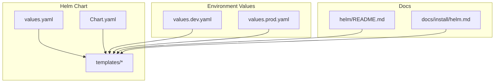
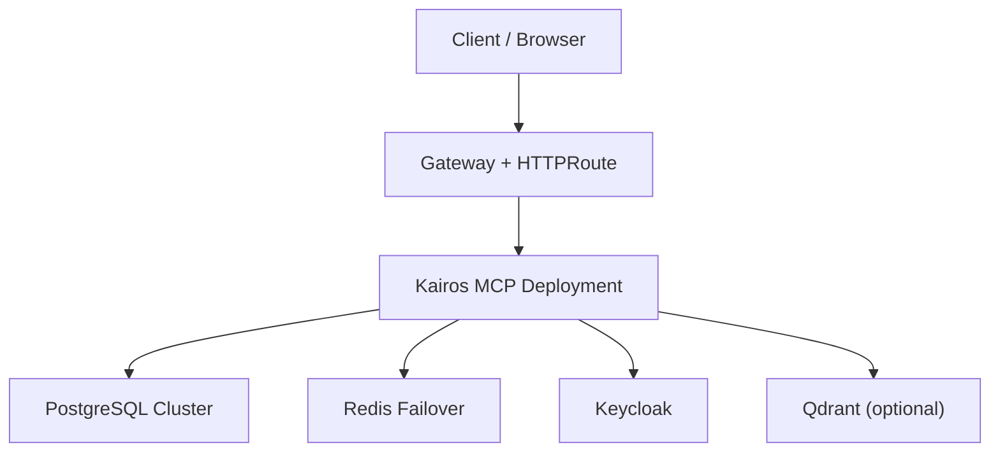
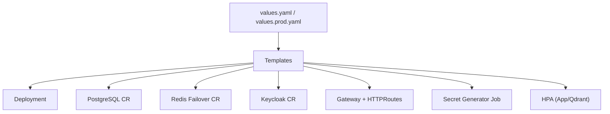

# Helm Chart Configuration

<cite>
**Referenced Files in This Document**
- [helm/kairos-mcp/values.yaml](file://helm/kairos-mcp/values.yaml)
- [helm/values.prod.yaml](file://helm/values.prod.yaml)
- [helm/README.md](file://helm/README.md)
- [helm/kairos-mcp/Chart.yaml](file://helm/kairos-mcp/Chart.yaml)
- [helm/kairos-mcp/README.md](file://helm/kairos-mcp/README.md)
- [docs/install/helm.md](file://docs/install/helm.md)
- [helm/kairos-mcp/templates/kairos-mcp-deployment.yaml](file://helm/kairos-mcp/templates/kairos-mcp-deployment.yaml)
- [helm/kairos-mcp/templates/postgres-cluster-cr.yaml](file://helm/kairos-mcp/templates/postgres-cluster-cr.yaml)
- [helm/kairos-mcp/templates/redis-failover-cr.yaml](file://helm/kairos-mcp/templates/redis-failover-cr.yaml)
- [helm/kairos-mcp/templates/keycloak-cr.yaml](file://helm/kairos-mcp/templates/keycloak-cr.yaml)
- [helm/kairos-mcp/templates/gateway.yaml](file://helm/kairos-mcp/templates/gateway.yaml)
- [helm/kairos-mcp/templates/httproute-mcp.yaml](file://helm/kairos-mcp/templates/httproute-mcp.yaml)
- [helm/kairos-mcp/templates/httproute-keycloak.yaml](file://helm/kairos-mcp/templates/httproute-keycloak.yaml)
- [helm/kairos-mcp/templates/credentials-secret-generator-job.yaml](file://helm/kairos-mcp/templates/credentials-secret-generator-job.yaml)
- [helm/kairos-mcp/templates/qdrant-hpa.yaml](file://helm/kairos-mcp/templates/qdrant-hpa.yaml)
- [helm/kairos-mcp/templates/app-hpa.yaml](file://helm/kairos-mcp/templates/app-hpa.yaml)
</cite>

## Table of Contents
1. [Introduction](#introduction)
2. [Project Structure](#project-structure)
3. [Core Components](#core-components)
4. [Architecture Overview](#architecture-overview)
5. [Detailed Component Analysis](#detailed-component-analysis)
6. [Dependency Analysis](#dependency-analysis)
7. [Performance Considerations](#performance-considerations)
8. [Troubleshooting Guide](#troubleshooting-guide)
9. [Conclusion](#conclusion)
10. [Appendices](#appendices)

## Introduction
This document provides comprehensive Helm chart configuration guidance for Kairos MCP. It explains all available values, environment-specific configurations, secret management, and custom resource definitions (CRDs) used to deploy the application with PostgreSQL, Redis, Keycloak, and optional components like Qdrant. It also includes examples for common deployment scenarios, configuration overrides, and production best practices.

## Project Structure
The Helm charts are organized under helm/kairos-mcp with templates that render Kubernetes resources. Environment-specific values files are provided at helm/values.dev.yaml and helm/values.prod.yaml. The top-level helm/README.md documents usage patterns and conventions.

**Diagram sources**
- [helm/kairos-mcp/values.yaml](file://helm/kairos-mcp/values.yaml)
- [helm/kairos-mcp/Chart.yaml](file://helm/kairos-mcp/Chart.yaml)
- [helm/values.prod.yaml](file://helm/values.prod.yaml)
- [helm/README.md](file://helm/README.md)
- [docs/install/helm.md](file://docs/install/helm.md)

**Section sources**
- [helm/README.md](file://helm/README.md)
- [docs/install/helm.md](file://docs/install/helm.md)
- [helm/kairos-mcp/Chart.yaml](file://helm/kairos-mcp/Chart.yaml)

## Core Components
Kairos MCP is deployed as a Kubernetes Deployment with supporting services and CRDs:
- Application Deployment: renders from kairos-mcp-deployment.yaml and consumes values for image, replicas, resources, probes, and environment variables.
- Database: Percona PostgreSQL cluster via postgres-cluster-cr.yaml.
- Cache/Session: Redis Failover via redis-failover-cr.yaml.
- Identity: Keycloak via keycloak-cr.yaml and related routes.
- Ingress/Gateway: Gateway and HTTPRoute resources for external access.
- Autoscaling: HPA for app and Qdrant.
- Secrets: Generated by credentials-secret-generator-job.yaml.

Key value categories:
- Application settings: image, replicas, resources, probes, logging, metrics, feature flags.
- Database connections: host, port, database name, credentials, SSL options.
- Redis configuration: host, port, password, TLS, failover mode.
- Keycloak integration: issuer URL, client ID/secret, realms, admin endpoints.
- Networking: gateway class, TLS secrets, route hosts.
- Observability: service monitors, Prometheus rules.
- Optional components: Qdrant storage, Ollama.

**Section sources**
- [helm/kairos-mcp/templates/kairos-mcp-deployment.yaml](file://helm/kairos-mcp/templates/kairos-mcp-deployment.yaml)
- [helm/kairos-mcp/templates/postgres-cluster-cr.yaml](file://helm/kairos-mcp/templates/postgres-cluster-cr.yaml)
- [helm/kairos-mcp/templates/redis-failover-cr.yaml](file://helm/kairos-mcp/templates/redis-failover-cr.yaml)
- [helm/kairos-mcp/templates/keycloak-cr.yaml](file://helm/kairos-mcp/templates/keycloak-cr.yaml)
- [helm/kairos-mcp/templates/gateway.yaml](file://helm/kairos-mcp/templates/gateway.yaml)
- [helm/kairos-mcp/templates/httproute-mcp.yaml](file://helm/kairos-mcp/templates/httproute-mcp.yaml)
- [helm/kairos-mcp/templates/httproute-keycloak.yaml](file://helm/kairos-mcp/templates/httproute-keycloak.yaml)
- [helm/kairos-mcp/templates/credentials-secret-generator-job.yaml](file://helm/kairos-mcp/templates/credentials-secret-generator-job.yaml)
- [helm/kairos-mcp/templates/qdrant-hpa.yaml](file://helm/kairos-mcp/templates/qdrant-hpa.yaml)
- [helm/kairos-mcp/templates/app-hpa.yaml](file://helm/kairos-mcp/templates/app-hpa.yaml)

## Architecture Overview
The following diagram maps core runtime components and their relationships as rendered by the Helm chart.

**Diagram sources**
- [helm/kairos-mcp/templates/gateway.yaml](file://helm/kairos-mcp/templates/gateway.yaml)
- [helm/kairos-mcp/templates/httproute-mcp.yaml](file://helm/kairos-mcp/templates/httproute-mcp.yaml)
- [helm/kairos-mcp/templates/kairos-mcp-deployment.yaml](file://helm/kairos-mcp/templates/kairos-mcp-deployment.yaml)
- [helm/kairos-mcp/templates/postgres-cluster-cr.yaml](file://helm/kairos-mcp/templates/postgres-cluster-cr.yaml)
- [helm/kairos-mcp/templates/redis-failover-cr.yaml](file://helm/kairos-mcp/templates/redis-failover-cr.yaml)
- [helm/kairos-mcp/templates/keycloak-cr.yaml](file://helm/kairos-mcp/templates/keycloak-cr.yaml)
- [helm/kairos-mcp/templates/qdrant-hpa.yaml](file://helm/kairos-mcp/templates/qdrant-hpa.yaml)

## Detailed Component Analysis

### Application Settings (Deployment)
- Image and tags: control container image and version.
- Replicas and autoscaling: base replica count and HPA targets.
- Resources: CPU/memory requests and limits.
- Probes: liveness/readiness/startup probes for health checks.
- Logging and metrics: log levels, structured logging, metrics endpoint exposure.
- Feature flags: toggles for UI, MCP features, and integrations.
- Environment variables: derived from values and secrets; include DB, Redis, Keycloak, and app-specific keys.

Best practices:
- Use separate values files per environment.
- Pin images to specific digests in production.
- Set meaningful resource requests/limits based on load tests.
- Enable readiness probes to avoid routing traffic before warm-up.

**Section sources**
- [helm/kairos-mcp/templates/kairos-mcp-deployment.yaml](file://helm/kairos-mcp/templates/kairos-mcp-deployment.yaml)
- [helm/kairos-mcp/templates/app-hpa.yaml](file://helm/kairos-mcp/templates/app-hpa.yaml)

### Database Connections (PostgreSQL)
- Connection parameters: host, port, database name, user, password, SSL mode.
- Operator-managed cluster: size, storage class, backup policy, high availability.
- Initialization: schema migrations and seed data handled by jobs or init containers.

Production considerations:
- Use managed storage classes with snapshots.
- Configure backups and retention policies.
- Ensure network policies allow only app pods to connect.

**Section sources**
- [helm/kairos-mcp/templates/postgres-cluster-cr.yaml](file://helm/kairos-mcp/templates/postgres-cluster-cr.yaml)

### Redis Configuration
- Connection parameters: host, port, password, TLS enablement.
- Failover mode: sentinel-based HA with master and replicas.
- Persistence: disk persistence and eviction policies.
- Session store alignment: ensure TTLs match application session behavior.

Production considerations:
- Enable TLS for Redis in production.
- Size memory appropriately and monitor hit ratios.
- Use dedicated namespaces and network policies.

**Section sources**
- [helm/kairos-mcp/templates/redis-failover-cr.yaml](file://helm/kairos-mcp/templates/redis-failover-cr.yaml)

### Keycloak Integration
- OIDC provider: issuer URL, client ID, client secret, scopes, and claims mapping.
- Realm configuration: realm import, default users, roles, and groups.
- Admin endpoints: internal admin API access for automation.
- Routes: HTTPRoute for Keycloak UI and admin redirect.

Security notes:
- Store client secrets in Kubernetes Secrets.
- Restrict admin endpoints to internal networks.
- Rotate secrets regularly and audit Keycloak logs.

**Section sources**
- [helm/kairos-mcp/templates/keycloak-cr.yaml](file://helm/kairos-mcp/templates/keycloak-cr.yaml)
- [helm/kairos-mcp/templates/httproute-keycloak.yaml](file://helm/kairos-mcp/templates/httproute-keycloak.yaml)

### Networking and Routing
- Gateway: ingress controller configuration and TLS termination.
- HTTPRoutes: expose MCP and Keycloak endpoints with hostnames and path rules.
- Reference grants: allow cross-namespace access where required.

Operational tips:
- Use consistent hostnames across environments.
- Enable TLS with managed certificates.
- Validate routes after upgrades.

**Section sources**
- [helm/kairos-mcp/templates/gateway.yaml](file://helm/kairos-mcp/templates/gateway.yaml)
- [helm/kairos-mcp/templates/httproute-mcp.yaml](file://helm/kairos-mcp/templates/httproute-mcp.yaml)
- [helm/kairos-mcp/templates/httproute-keycloak.yaml](file://helm/kairos-mcp/templates/httproute-keycloak.yaml)

### Secret Management
- Credentials generator job: creates application secrets from values or external vaults.
- Secret references: mounted as environment variables or config maps.
- Rotation strategy: update values and re-run job; roll out new pods.

Best practices:
- Never commit plaintext secrets to version control.
- Use sealed-secrets or external secret managers.
- Audit secret creation and rotation events.

**Section sources**
- [helm/kairos-mcp/templates/credentials-secret-generator-job.yaml](file://helm/kairos-mcp/templates/credentials-secret-generator-job.yaml)

### Optional Components (Qdrant)
- Qdrant stateful set and HPA for vector search.
- Storage sizing and persistence tuning.
- Network policies and monitoring.

When to enable:
- For semantic search and embedding-backed retrieval.
- Scale horizontally based on query volume.

**Section sources**
- [helm/kairos-mcp/templates/qdrant-hpa.yaml](file://helm/kairos-mcp/templates/qdrant-hpa.yaml)

## Dependency Analysis
The Helm chart orchestrates multiple dependencies. The following diagram shows how values drive template rendering and resource creation.

**Diagram sources**
- [helm/kairos-mcp/values.yaml](file://helm/kairos-mcp/values.yaml)
- [helm/values.prod.yaml](file://helm/values.prod.yaml)
- [helm/kairos-mcp/templates/kairos-mcp-deployment.yaml](file://helm/kairos-mcp/templates/kairos-mcp-deployment.yaml)
- [helm/kairos-mcp/templates/postgres-cluster-cr.yaml](file://helm/kairos-mcp/templates/postgres-cluster-cr.yaml)
- [helm/kairos-mcp/templates/redis-failover-cr.yaml](file://helm/kairos-mcp/templates/redis-failover-cr.yaml)
- [helm/kairos-mcp/templates/keycloak-cr.yaml](file://helm/kairos-mcp/templates/keycloak-cr.yaml)
- [helm/kairos-mcp/templates/gateway.yaml](file://helm/kairos-mcp/templates/gateway.yaml)
- [helm/kairos-mcp/templates/httproute-mcp.yaml](file://helm/kairos-mcp/templates/httproute-mcp.yaml)
- [helm/kairos-mcp/templates/httproute-keycloak.yaml](file://helm/kairos-mcp/templates/httproute-keycloak.yaml)
- [helm/kairos-mcp/templates/credentials-secret-generator-job.yaml](file://helm/kairos-mcp/templates/credentials-secret-generator-job.yaml)
- [helm/kairos-mcp/templates/qdrant-hpa.yaml](file://helm/kairos-mcp/templates/qdrant-hpa.yaml)
- [helm/kairos-mcp/templates/app-hpa.yaml](file://helm/kairos-mcp/templates/app-hpa.yaml)

**Section sources**
- [helm/kairos-mcp/values.yaml](file://helm/kairos-mcp/values.yaml)
- [helm/values.prod.yaml](file://helm/values.prod.yaml)

## Performance Considerations
- Right-size resources: set CPU/memory requests and limits based on profiling.
- Tune HPA: configure min/max replicas and target utilization thresholds.
- Database tuning: adjust connection pools and storage IOPS.
- Redis tuning: set maxmemory and eviction policies; enable persistence if needed.
- TLS overhead: terminate TLS at the gateway and use efficient ciphers.
- Monitoring: enable ServiceMonitors and PrometheusRules for alerting.

[No sources needed since this section provides general guidance]

## Troubleshooting Guide
Common issues and resolutions:
- Pod CrashLoopBackOff: check liveness/readiness probes and startup time; review logs and events.
- Database connectivity errors: verify credentials, network policies, and SSL settings.
- Redis timeouts: confirm host/port/password/TLS and memory limits.
- Keycloak login failures: validate issuer URL, client ID/secret, and realm configuration.
- Route not found: ensure GatewayClass exists and HTTPRoutes reference correct backends.
- Secret missing: run the credentials generator job and verify secret names.

Diagnostic steps:
- Inspect pod logs and describe events.
- Test connectivity from within the cluster to DB/Redis/Keycloak.
- Validate TLS certificates and DNS resolution.
- Review Prometheus metrics and alerts.

**Section sources**
- [helm/kairos-mcp/templates/kairos-mcp-deployment.yaml](file://helm/kairos-mcp/templates/kairos-mcp-deployment.yaml)
- [helm/kairos-mcp/templates/credentials-secret-generator-job.yaml](file://helm/kairos-mcp/templates/credentials-secret-generator-job.yaml)
- [helm/kairos-mcp/templates/gateway.yaml](file://helm/kairos-mcp/templates/gateway.yaml)
- [helm/kairos-mcp/templates/httproute-mcp.yaml](file://helm/kairos-mcp/templates/httproute-mcp.yaml)

## Conclusion
This guide consolidates Helm chart configuration for Kairos MCP, covering application settings, database and Redis connections, Keycloak integration, networking, secrets, and optional components. By following the environment-specific values and production best practices outlined here, you can reliably deploy and operate Kairos MCP across development and production clusters.

[No sources needed since this section summarizes without analyzing specific files]

## Appendices

### Common Deployment Scenarios
- Development:
  - Use values.dev.yaml with minimal resources and local storage classes.
  - Enable debug logging and disable strict TLS where appropriate.
- Staging:
  - Mirror production values with smaller sizes.
  - Enable full observability and automated backups.
- Production:
  - Use values.prod.yaml with pinned images, autoscaling, and hardened security.
  - Enforce TLS, RBAC, and network policies.

Configuration override examples:
- Override image tag: helm upgrade --set image.tag=vX.Y.Z ...
- Adjust replicas: helm upgrade --set replicaCount=3 ...
- Provide external DB: helm upgrade --set postgresql.host=db.example.com ...
- Configure Keycloak: helm upgrade --set keycloak.issuer=https://kc.example.com ...

**Section sources**
- [helm/values.prod.yaml](file://helm/values.prod.yaml)
- [helm/kairos-mcp/values.yaml](file://helm/kairos-mcp/values.yaml)
- [docs/install/helm.md](file://docs/install/helm.md)