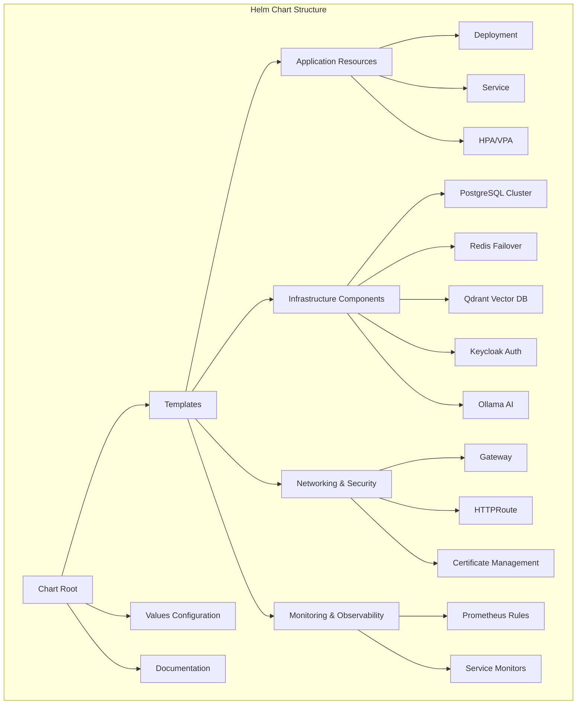
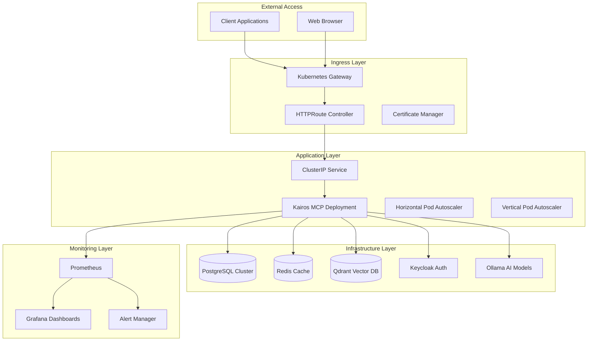
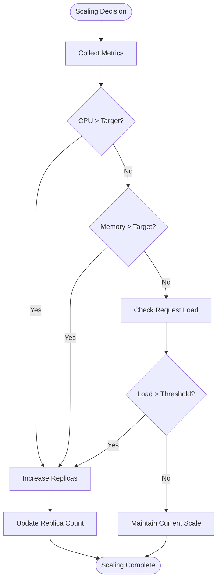
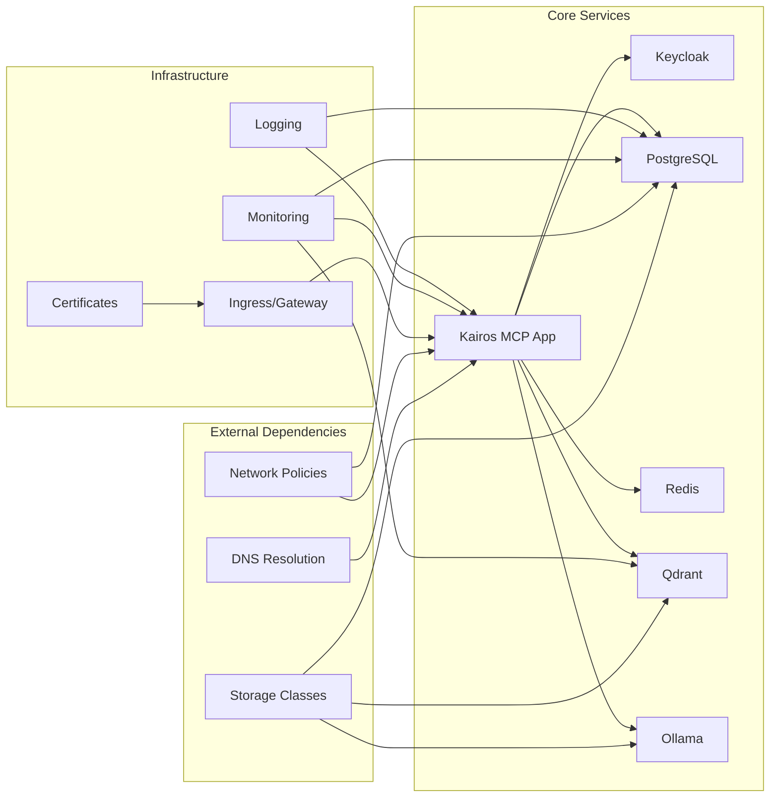

# Kubernetes Deployment

<cite>
**Referenced Files in This Document**
- [Chart.yaml](file://helm/kairos-mcp/Chart.yaml)
- [values.yaml](file://helm/kairos-mcp/values.yaml)
- [values.schema.json](file://helm/kairos-mcp/values.schema.json)
- [kairos-mcp-deployment.yaml](file://helm/kairos-mcp/templates/kairos-mcp-deployment.yaml)
- [kairos-mcp-service.yaml](file://helm/kairos-mcp/templates/kairos-mcp-service.yaml)
- [app-hpa.yaml](file://helm/kairos-mcp/templates/app-hpa.yaml)
- [app-vpa.yaml](file://helm/kairos-mcp/templates/app-vpa.yaml)
- [gateway.yaml](file://helm/kairos-mcp/templates/gateway.yaml)
- [httproute-mcp.yaml](file://helm/kairos-mcp/templates/httproute-mcp.yaml)
- [postgres-cluster-cr.yaml](file://helm/kairos-mcp/templates/postgres-cluster-cr.yaml)
- [redis-failover-cr.yaml](file://helm/kairos-mcp/templates/redis-failover-cr.yaml)
- [qdrant-hpa.yaml](file://helm/kairos-mcp/templates/qdrant-hpa.yaml)
- [ollama-statefulset.yaml](file://helm/kairos-mcp/templates/ollama-statefulset.yaml)
- [prometheusrule.yaml](file://helm/kairos-mcp/templates/prometheusrule.yaml)
- [helm.md](file://docs/install/helm.md)
</cite>

## Table of Contents
1. [Introduction](#introduction)
2. [Project Structure](#project-structure)
3. [Core Components](#core-components)
4. [Architecture Overview](#architecture-overview)
5. [Detailed Component Analysis](#detailed-component-analysis)
6. [Dependency Analysis](#dependency-analysis)
7. [Performance Considerations](#performance-considerations)
8. [Troubleshooting Guide](#troubleshooting-guide)
9. [Conclusion](#conclusion)
10. [Appendices](#appendices)

## Introduction

Kubernetes deployment for Kairos MCP provides a comprehensive production-ready solution using Helm charts. The deployment architecture supports high availability, horizontal scaling, and integrates with essential infrastructure components including PostgreSQL for persistence, Redis for caching, Qdrant for vector search, and Keycloak for authentication.

The Helm chart is designed to be flexible, supporting both development and production environments with configurable resource allocation, security contexts, and networking options. It includes built-in support for monitoring, logging, and operational best practices.

## Project Structure

The Kubernetes deployment is organized as a structured Helm chart with clear separation of concerns:



**Diagram sources**
- [Chart.yaml](file://helm/kairos-mcp/Chart.yaml)
- [kairos-mcp-deployment.yaml](file://helm/kairos-mcp/templates/kairos-mcp-deployment.yaml)
- [postgres-cluster-cr.yaml](file://helm/kairos-mcp/templates/postgres-cluster-cr.yaml)

**Section sources**
- [Chart.yaml](file://helm/kairos-mcp/Chart.yaml)
- [README.md](file://helm/kairos-mcp/README.md)

## Core Components

### Application Deployment

The core Kairos MCP application is deployed as a Kubernetes Deployment with support for horizontal pod autoscaling and vertical pod autoscaling. The deployment includes health checks, resource limits, and environment-specific configurations.

### Infrastructure Dependencies

The chart provisions several critical infrastructure components:

- **PostgreSQL**: High-availability database cluster for persistent storage
- **Redis**: In-memory cache with failover capabilities
- **Qdrant**: Vector database for semantic search functionality
- **Keycloak**: Identity and access management provider
- **Ollama**: Local AI model serving for embedding generation

### Networking Layer

Network exposure is handled through OpenShift Route or Kubernetes Ingress controllers with TLS termination and certificate management.

**Section sources**
- [kairos-mcp-deployment.yaml](file://helm/kairos-mcp/templates/kairos-mcp-deployment.yaml)
- [kairos-mcp-service.yaml](file://helm/kairos-mcp/templates/kairos-mcp-service.yaml)
- [postgres-cluster-cr.yaml](file://helm/kairos-mcp/templates/postgres-cluster-cr.yaml)
- [redis-failover-cr.yaml](file://helm/kairos-mcp/templates/redis-failover-cr.yaml)

## Architecture Overview

The Kairos MCP deployment follows a microservices architecture pattern with clear separation between stateless application pods and stateful infrastructure components:



**Diagram sources**
- [gateway.yaml](file://helm/kairos-mcp/templates/gateway.yaml)
- [httproute-mcp.yaml](file://helm/kairos-mcp/templates/httproute-mcp.yaml)
- [kairos-mcp-deployment.yaml](file://helm/kairos-mcp/templates/kairos-mcp-deployment.yaml)
- [prometheusrule.yaml](file://helm/kairos-mcp/templates/prometheusrule.yaml)

## Detailed Component Analysis

### Application Deployment Configuration

The Kairos MCP application deployment is configured with production-ready settings including resource requests/limits, health checks, and environment variables. The deployment supports rolling updates and rollback procedures.

#### Resource Allocation Strategy

Resource allocation is managed through Kubernetes resource specifications:

- **CPU Requests/Limits**: Configurable based on workload characteristics
- **Memory Requests/Limits**: Set to prevent memory leaks from affecting other pods
- **Storage Classes**: Persistent volumes for stateful components
- **Node Affinity**: Optional scheduling constraints for optimal placement

#### Scaling Configuration

Horizontal Pod Autoscaler (HPA) automatically scales the application based on CPU utilization and custom metrics:



**Diagram sources**
- [app-hpa.yaml](file://helm/kairos-mcp/templates/app-hpa.yaml)

Vertical Pod Autoscaler (VPA) optimizes resource allocation by adjusting requests and limits based on actual usage patterns.

**Section sources**
- [app-hpa.yaml](file://helm/kairos-mcp/templates/app-hpa.yaml)
- [app-vpa.yaml](file://helm/kairos-mcp/templates/app-vpa.yaml)

### Database Infrastructure

#### PostgreSQL Configuration

The PostgreSQL cluster is provisioned using the Percona Operator with high availability features:

- **Multi-replica setup** for fault tolerance
- **Automated backups** and point-in-time recovery
- **Connection pooling** for optimal performance
- **Storage class configuration** for persistent volumes

#### Redis Configuration

Redis is deployed with Sentinel-based failover:

- **Master-slave replication** for read scalability
- **Automatic failover** on master node failure
- **Memory optimization** with appropriate eviction policies
- **Persistence configuration** for data durability

**Section sources**
- [postgres-cluster-cr.yaml](file://helm/kairos-mcp/templates/postgres-cluster-cr.yaml)
- [redis-failover-cr.yaml](file://helm/kairos-mcp/templates/redis-failover-cr.yaml)

### Authentication and Authorization

Keycloak integration provides enterprise-grade authentication:

- **OIDC/OAuth2** protocol support
- **User realm configuration** with custom attributes
- **Client registration** for API access
- **Role-based access control** for resources

### Vector Search Infrastructure

Qdrant vector database enables semantic search capabilities:

- **Distributed collection** for large datasets
- **Automatic sharding** across nodes
- **Index optimization** for query performance
- **Backup and restore** procedures

**Section sources**
- [qdrant-hpa.yaml](file://helm/kairos-mcp/templates/qdrant-hpa.yaml)

### AI Model Serving

Ollama provides local AI model serving for embeddings and text processing:

- **StatefulSet deployment** for persistent model storage
- **GPU acceleration** support when available
- **Model caching** for improved performance
- **Resource isolation** from main application

**Section sources**
- [ollama-statefulset.yaml](file://helm/kairos-mcp/templates/ollama-statefulset.yaml)

## Dependency Analysis

The deployment has clear dependency relationships between components:



**Diagram sources**
- [kairos-mcp-deployment.yaml](file://helm/kairos-mcp/templates/kairos-mcp-deployment.yaml)
- [kairos-mcp-service.yaml](file://helm/kairos-mcp/templates/kairos-mcp-service.yaml)

### Component Coupling Analysis

- **Loose coupling** between application and infrastructure components via services
- **Configuration-driven** dependencies through environment variables
- **Health check endpoints** for dependency validation
- **Graceful degradation** when optional services are unavailable

**Section sources**
- [kairos-mcp-deployment.yaml](file://helm/kairos-mcp/templates/kairos-mcp-deployment.yaml)
- [kairos-mcp-service.yaml](file://helm/kairos-mcp/templates/kairos-mcp-service.yaml)

## Performance Considerations

### Resource Optimization

- **Right-sizing** based on workload analysis and monitoring data
- **Horizontal scaling** for handling traffic spikes
- **Vertical scaling** for memory-intensive operations
- **Pod anti-affinity** for distribution across nodes

### Database Performance

- **Connection pooling** to reduce overhead
- **Query optimization** through proper indexing
- **Read replicas** for scaling read operations
- **Caching strategies** at multiple levels

### Network Optimization

- **Service mesh integration** for advanced traffic management
- **Connection reuse** and keep-alive settings
- **Compression** for large payloads
- **CDN integration** for static assets

### Monitoring and Observability

Comprehensive monitoring setup includes:

- **Custom metrics** for business KPIs
- **Structured logging** with correlation IDs
- **Distributed tracing** for request flow analysis
- **Alerting rules** for proactive issue detection

**Section sources**
- [prometheusrule.yaml](file://helm/kairos-mcp/templates/prometheusrule.yaml)

## Troubleshooting Guide

### Common Deployment Issues

#### Pod Startup Failures

- **Image pull errors**: Verify image registry credentials and network connectivity
- **Resource constraints**: Check node capacity and resource quotas
- **Configuration errors**: Validate environment variables and config maps
- **Dependency failures**: Ensure all required services are available

#### Database Connection Issues

- **Authentication problems**: Verify credentials and network policies
- **Connection limits**: Check maximum connections and pool sizes
- **SSL/TLS configuration**: Ensure proper certificate setup
- **Network policies**: Verify inter-pod communication permissions

#### Scaling Problems

- **HPA not triggering**: Check metrics collection and target thresholds
- **Resource bottlenecks**: Analyze CPU/memory usage patterns
- **Node capacity**: Verify sufficient cluster resources
- **Sticky sessions**: Configure session affinity if needed

### Health Check Endpoints

The application exposes health check endpoints for liveness and readiness probes:

- `/healthz`: Basic health status
- `/ready`: Readiness check including dependencies
- `/metrics`: Prometheus metrics endpoint

### Log Analysis

Logs are structured and include:

- **Request correlation IDs** for tracing
- **Structured JSON format** for parsing
- **Log levels** for filtering
- **Context information** for debugging

**Section sources**
- [kairos-mcp-deployment.yaml](file://helm/kairos-mcp/templates/kairos-mcp-deployment.yaml)

## Conclusion

The Kairos MCP Kubernetes deployment provides a robust, scalable, and production-ready solution. The Helm chart abstracts complexity while maintaining flexibility for customization. Key strengths include:

- **Comprehensive infrastructure provisioning** with operators
- **Advanced scaling capabilities** with HPA/VPA
- **Enterprise security** with Keycloak integration
- **Production monitoring** with Prometheus and alerting
- **Flexible networking** with gateway and route management

The deployment supports both development and production environments with appropriate configuration variations. Regular updates to the chart ensure compatibility with latest Kubernetes versions and security patches.

## Appendices

### Installation Commands

Basic installation with default values:

```bash
helm install kairos-mcp ./helm/kairos-mcp -n kairos-mcp --create-namespace
```

Installation with custom values:

```bash
helm install kairos-mcp ./helm/kairos-mcp -n kairos-mcp \
  --create-namespace \
  -f values-custom.yaml
```

### Upgrade Procedures

Rolling upgrade with zero downtime:

```bash
helm upgrade kairos-mcp ./helm/kairos-mcp -n kairos-mcp \
  -f values-custom.yaml \
  --timeout 10m \
  --wait
```

Rollback procedure:

```bash
helm rollback kairos-mcp <previous-release-version> -n kairos-mcp
```

### Uninstallation

Complete removal of all resources:

```bash
helm uninstall kairos-mcp -n kairos-mcp
kubectl delete namespace kairos-mcp
```

**Section sources**
- [helm.md](file://docs/install/helm.md)