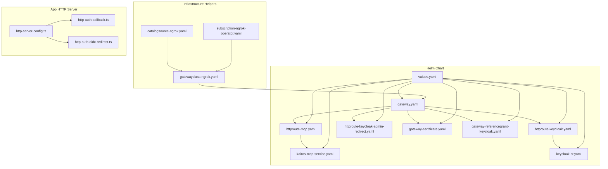
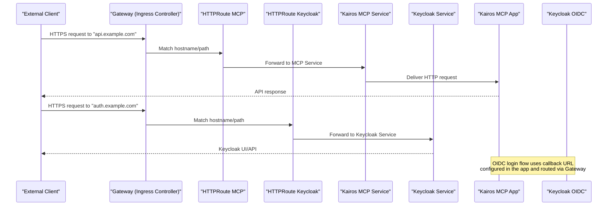
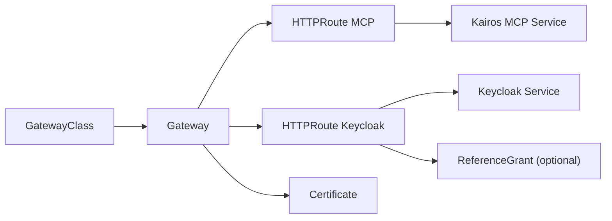
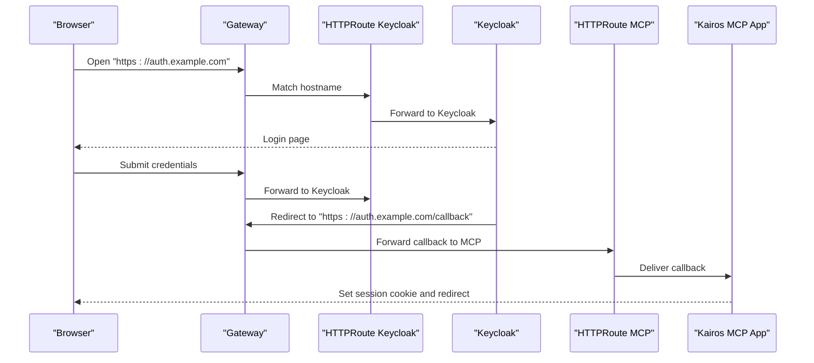

# Networking and Ingress

<cite>
**Referenced Files in This Document**
- [helm/kairos-mcp/templates/gateway.yaml](file://helm/kairos-mcp/templates/gateway.yaml)
- [helm/kairos-mcp/templates/httproute-mcp.yaml](file://helm/kairos-mcp/templates/httproute-mcp.yaml)
- [helm/kairos-mcp/templates/httproute-keycloak.yaml](file://helm/kairos-mcp/templates/httproute-keycloak.yaml)
- [helm/kairos-mcp/templates/httproute-keycloak-admin-redirect.yaml](file://helm/kairos-mcp/templates/httproute-keycloak-admin-redirect.yaml)
- [helm/kairos-mcp/templates/gateway-certificate.yaml](file://helm/kairos-mcp/templates/gateway-certificate.yaml)
- [helm/kairos-mcp/templates/gateway-referencegrant-keycloak.yaml](file://helm/kairos-mcp/templates/gateway-referencegrant-keycloak.yaml)
- [helm/kairos-mcp/templates/kairos-mcp-service.yaml](file://helm/kairos-mcp/templates/kairos-mcp-service.yaml)
- [helm/kairos-mcp/templates/keycloak-cr.yaml](file://helm/kairos-mcp/templates/keycloak-cr.yaml)
- [helm/kairos-mcp/values.yaml](file://helm/kairos-mcp/values.yaml)
- [helm/kairos-mcp/docs/OPERATORS.md](file://helm/kairos-mcp/docs/OPERATORS.md)
- [helm/infrastructure/gatewayclass-ngrok.yaml](file://helm/infrastructure/gatewayclass-ngrok.yaml)
- [helm/infrastructure/catalogsource-ngrok.yaml](file://helm/infrastructure/catalogsource-ngrok.yaml)
- [helm/infrastructure/subscription-ngrok-operator.yaml](file://helm/infrastructure/subscription-ngrok-operator.yaml)
- [src/http/http-server-config.ts](file://src/http/http-server-config.ts)
- [src/http/http-auth-callback.ts](file://src/http/http-auth-callback.ts)
- [src/http/http-auth-oidc-redirect.ts](file://src/http/http-auth-oidc-redirect.ts)
</cite>

## Table of Contents
1. [Introduction](#introduction)
2. [Project Structure](#project-structure)
3. [Core Components](#core-components)
4. [Architecture Overview](#architecture-overview)
5. [Detailed Component Analysis](#detailed-component-analysis)
6. [Dependency Analysis](#dependency-analysis)
7. [Performance Considerations](#performance-considerations)
8. [Troubleshooting Guide](#troubleshooting-guide)
9. [Conclusion](#conclusion)
10. [Appendices](#appendices)

## Introduction
This document explains how to configure networking and ingress for Kairos MCP using Kubernetes Gateway API. It covers:
- Gateway API configuration and HTTPRoute definitions for the MCP API and Keycloak
- TLS certificate management and SSL/TLS termination at the gateway
- Service discovery within the cluster
- Security contexts and network policies considerations
- External access patterns, domain routing, and OIDC integration with Keycloak
- Integration with popular ingress controllers and service meshes via Gateway API

The guidance is based on Helm templates and application HTTP server configuration included in this repository.

## Project Structure
Networking-related resources are primarily defined under the Helm chart for Kairos MCP and a small set of infrastructure helpers for optional operators (e.g., ngrok). The application’s HTTP server configuration also exposes environment-driven behavior relevant to ingress and OIDC flows.

**Diagram sources**
- [helm/kairos-mcp/templates/gateway.yaml](file://helm/kairos-mcp/templates/gateway.yaml)
- [helm/kairos-mcp/templates/httproute-mcp.yaml](file://helm/kairos-mcp/templates/httproute-mcp.yaml)
- [helm/kairos-mcp/templates/httproute-keycloak.yaml](file://helm/kairos-mcp/templates/httproute-keycloak.yaml)
- [helm/kairos-mcp/templates/httproute-keycloak-admin-redirect.yaml](file://helm/kairos-mcp/templates/httproute-keycloak-admin-redirect.yaml)
- [helm/kairos-mcp/templates/gateway-certificate.yaml](file://helm/kairos-mcp/templates/gateway-certificate.yaml)
- [helm/kairos-mcp/templates/gateway-referencegrant-keycloak.yaml](file://helm/kairos-mcp/templates/gateway-referencegrant-keycloak.yaml)
- [helm/kairos-mcp/templates/kairos-mcp-service.yaml](file://helm/kairos-mcp/templates/kairos-mcp-service.yaml)
- [helm/kairos-mcp/templates/keycloak-cr.yaml](file://helm/kairos-mcp/templates/keycloak-cr.yaml)
- [helm/kairos-mcp/values.yaml](file://helm/kairos-mcp/values.yaml)
- [helm/infrastructure/gatewayclass-ngrok.yaml](file://helm/infrastructure/gatewayclass-ngrok.yaml)
- [helm/infrastructure/catalogsource-ngrok.yaml](file://helm/infrastructure/catalogsource-ngrok.yaml)
- [helm/infrastructure/subscription-ngrok-operator.yaml](file://helm/infrastructure/subscription-ngrok-operator.yaml)
- [src/http/http-server-config.ts](file://src/http/http-server-config.ts)
- [src/http/http-auth-callback.ts](file://src/http/http-auth-callback.ts)
- [src/http/http-auth-oidc-redirect.ts](file://src/http/http-auth-oidc-redirect.ts)

**Section sources**
- [helm/kairos-mcp/templates/gateway.yaml](file://helm/kairos-mcp/templates/gateway.yaml)
- [helm/kairos-mcp/templates/httproute-mcp.yaml](file://helm/kairos-mcp/templates/httproute-mcp.yaml)
- [helm/kairos-mcp/templates/httproute-keycloak.yaml](file://helm/kairos-mcp/templates/httproute-keycloak.yaml)
- [helm/kairos-mcp/templates/httproute-keycloak-admin-redirect.yaml](file://helm/kairos-mcp/templates/httproute-keycloak-admin-redirect.yaml)
- [helm/kairos-mcp/templates/gateway-certificate.yaml](file://helm/kairos-mcp/templates/gateway-certificate.yaml)
- [helm/kairos-mcp/templates/gateway-referencegrant-keycloak.yaml](file://helm/kairos-mcp/templates/gateway-referencegrant-keycloak.yaml)
- [helm/kairos-mcp/templates/kairos-mcp-service.yaml](file://helm/kairos-mcp/templates/kairos-mcp-service.yaml)
- [helm/kairos-mcp/templates/keycloak-cr.yaml](file://helm/kairos-mcp/templates/keycloak-cr.yaml)
- [helm/kairos-mcp/values.yaml](file://helm/kairos-mcp/values.yaml)
- [helm/infrastructure/gatewayclass-ngrok.yaml](file://helm/infrastructure/gatewayclass-ngrok.yaml)
- [helm/infrastructure/catalogsource-ngrok.yaml](file://helm/infrastructure/catalogsource-ngrok.yaml)
- [helm/infrastructure/subscription-ngrok-operator.yaml](file://helm/infrastructure/subscription-ngrok-operator.yaml)
- [src/http/http-server-config.ts](file://src/http/http-server-config.ts)
- [src/http/http-auth-callback.ts](file://src/http/http-auth-callback.ts)
- [src/http/http-auth-oidc-redirect.ts](file://src/http/http-auth-oidc-redirect.ts)

## Core Components
- Gateway API Gateway: Defines an entry point for external traffic into the cluster and binds to a GatewayClass provided by an ingress controller or operator.
- HTTPRoutes: Route rules that map hostnames and paths to backend services (MCP API and Keycloak).
- TLS Certificate: A secret-backed certificate resource referenced by the Gateway for TLS termination.
- ReferenceGrant: Allows cross-namespace references from HTTPRoutes to secrets or services when needed.
- Services: Cluster-internal endpoints for the MCP API and Keycloak.
- Application HTTP Server: Configures base URLs, CORS, and OIDC callback handling used by clients behind the gateway.

Key responsibilities:
- Gateway and HTTPRoutes handle domain-based routing and path-based forwarding.
- TLS termination occurs at the Gateway using managed certificates.
- Service discovery uses standard Kubernetes Service objects.
- OIDC flows integrate with Keycloak through well-known redirect URIs configured in the app.

**Section sources**
- [helm/kairos-mcp/templates/gateway.yaml](file://helm/kairos-mcp/templates/gateway.yaml)
- [helm/kairos-mcp/templates/httproute-mcp.yaml](file://helm/kairos-mcp/templates/httproute-mcp.yaml)
- [helm/kairos-mcp/templates/httproute-keycloak.yaml](file://helm/kairos-mcp/templates/httproute-keycloak.yaml)
- [helm/kairos-mcp/templates/httproute-keycloak-admin-redirect.yaml](file://helm/kairos-mcp/templates/httproute-keycloak-admin-redirect.yaml)
- [helm/kairos-mcp/templates/gateway-certificate.yaml](file://helm/kairos-mcp/templates/gateway-certificate.yaml)
- [helm/kairos-mcp/templates/gateway-referencegrant-keycloak.yaml](file://helm/kairos-mcp/templates/gateway-referencegrant-keycloak.yaml)
- [helm/kairos-mcp/templates/kairos-mcp-service.yaml](file://helm/kairos-mcp/templates/kairos-mcp-service.yaml)
- [helm/kairos-mcp/templates/keycloak-cr.yaml](file://helm/kairos-mcp/templates/keycloak-cr.yaml)
- [src/http/http-server-config.ts](file://src/http/http-server-config.ts)
- [src/http/http-auth-callback.ts](file://src/http/http-auth-callback.ts)
- [src/http/http-auth-oidc-redirect.ts](file://src/http/http-auth-oidc-redirect.ts)

## Architecture Overview
The following diagram shows how external requests reach the MCP API and Keycloak via Gateway API, with TLS termination at the gateway and internal service discovery.

**Diagram sources**
- [helm/kairos-mcp/templates/gateway.yaml](file://helm/kairos-mcp/templates/gateway.yaml)
- [helm/kairos-mcp/templates/httproute-mcp.yaml](file://helm/kairos-mcp/templates/httproute-mcp.yaml)
- [helm/kairos-mcp/templates/httproute-keycloak.yaml](file://helm/kairos-mcp/templates/httproute-keycloak.yaml)
- [helm/kairos-mcp/templates/kairos-mcp-service.yaml](file://helm/kairos-mcp/templates/kairos-mcp-service.yaml)
- [helm/kairos-mcp/templates/keycloak-cr.yaml](file://helm/kairos-mcp/templates/keycloak-cr.yaml)
- [src/http/http-auth-callback.ts](file://src/http/http-auth-callback.ts)
- [src/http/http-auth-oidc-redirect.ts](file://src/http/http-auth-oidc-redirect.ts)

## Detailed Component Analysis

### Gateway API Configuration
- Gateway: Defines listeners (ports), allowed routes, and TLS settings. It binds to a GatewayClass provided by your chosen ingress controller/operator.
- GatewayClass: Optional helper templates exist for integrating with specific operators (e.g., ngrok). Ensure a compatible GatewayClass exists before applying the Gateway.
- Values: The Helm values file controls hostnames, TLS enablement, and route targets.

Operational notes:
- Use a single Gateway for multiple HTTPRoutes sharing the same listener configuration.
- Validate that the GatewayClass name matches your ingress controller installation.

**Section sources**
- [helm/kairos-mcp/templates/gateway.yaml](file://helm/kairos-mcp/templates/gateway.yaml)
- [helm/infrastructure/gatewayclass-ngrok.yaml](file://helm/infrastructure/gatewayclass-ngrok.yaml)
- [helm/kairos-mcp/values.yaml](file://helm/kairos-mcp/values.yaml)

### HTTPRoute Definitions

#### MCP API HTTPRoute
- Hostname: Typically points to the API domain (e.g., api.example.com).
- Paths: Routes API paths to the Kairos MCP Service.
- BackendRef: References the MCP Service port.

Behavior:
- All requests matching the hostname/path prefix are forwarded to the MCP Service.
- If TLS is enabled on the Gateway, the client connection is terminated at the gateway; upstream communication can be HTTP unless mTLS is configured.

**Section sources**
- [helm/kairos-mcp/templates/httproute-mcp.yaml](file://helm/kairos-mcp/templates/httproute-mcp.yaml)
- [helm/kairos-mcp/templates/kairos-mcp-service.yaml](file://helm/kairos-mcp/templates/kairos-mcp-service.yaml)
- [helm/kairos-mcp/values.yaml](file://helm/kairos-mcp/values.yaml)

#### Keycloak HTTPRoute
- Hostname: Points to the authentication domain (e.g., auth.example.com).
- Paths: Exposes Keycloak admin console and OIDC endpoints.
- BackendRef: References the Keycloak Service exposed by the Keycloak CR.

Notes:
- Admin console may require additional redirects handled by a dedicated HTTPRoute if necessary.

**Section sources**
- [helm/kairos-mcp/templates/httproute-keycloak.yaml](file://helm/kairos-mcp/templates/httproute-keycloak.yaml)
- [helm/kairos-mcp/templates/keycloak-cr.yaml](file://helm/kairos-mcp/templates/keycloak-cr.yaml)
- [helm/kairos-mcp/values.yaml](file://helm/kairos-mcp/values.yaml)

#### Keycloak Admin Redirect HTTPRoute
- Purpose: Ensures admin console redirects resolve correctly by mapping admin-specific paths back to Keycloak.
- Behavior: Forwards admin paths to the Keycloak Service.

**Section sources**
- [helm/kairos-mcp/templates/httproute-keycloak-admin-redirect.yaml](file://helm/kairos-mcp/templates/httproute-keycloak-admin-redirect.yaml)
- [helm/kairos-mcp/templates/keycloak-cr.yaml](file://helm/kairos-mcp/templates/keycloak-cr.yaml)

### TLS Certificate Management
- Certificate Resource: A certificate object referencing a Secret containing the TLS private key and certificate chain.
- Gateway TLS: The Gateway references the certificate for the listener(s), enabling HTTPS termination.
- ReferenceGrant: Used when the certificate or target service resides in a different namespace than the HTTPRoute/Gateway.

Best practices:
- Use a managed issuer (e.g., cert-manager) to provision and rotate certificates automatically.
- Ensure the Secret format matches the expected certificate type.

**Section sources**
- [helm/kairos-mcp/templates/gateway-certificate.yaml](file://helm/kairos-mcp/templates/gateway-certificate.yaml)
- [helm/kairos-mcp/templates/gateway.yaml](file://helm/kairos-mcp/templates/gateway.yaml)
- [helm/kairos-mcp/templates/gateway-referencegrant-keycloak.yaml](file://helm/kairos-mcp/templates/gateway-referencegrant-keycloak.yaml)
- [helm/kairos-mcp/values.yaml](file://helm/kairos-mcp/values.yaml)

### Service Discovery
- MCP Service: Exposes the Kairos MCP application inside the cluster. HTTPRoutes reference this Service for backend routing.
- Keycloak Service: Created by the Keycloak CR and referenced by Keycloak HTTPRoutes.

Discovery pattern:
- Clients outside the cluster never see internal Service names; they use DNS-resolvable hostnames configured in HTTPRoutes.
- Internal components communicate via Kubernetes Service DNS.

**Section sources**
- [helm/kairos-mcp/templates/kairos-mcp-service.yaml](file://helm/kairos-mcp/templates/kairos-mcp-service.yaml)
- [helm/kairos-mcp/templates/keycloak-cr.yaml](file://helm/kairos-mcp/templates/keycloak-cr.yaml)

### Security Contexts and Network Policies
- Pod Security: Apply appropriate securityContexts to containers (non-root, read-only filesystem where possible).
- Network Policies: Restrict ingress/egress to only required ports and namespaces.
- Gateway Security: Enforce TLS, restrict allowed hosts, and consider rate limiting at the gateway layer.

Recommendations:
- Limit inbound traffic to the Gateway to trusted CIDRs if feasible.
- Isolate Keycloak and MCP workloads in separate namespaces and allow only necessary cross-namespace access.

[No sources needed since this section provides general guidance]

### External Access Patterns and Domain Routing
- Single-domain routing: Serve both API and Auth under one domain using path-based HTTPRoutes.
- Multi-domain routing: Separate domains for API and Auth for clearer separation of concerns.
- Wildcard domains: Use wildcard hostnames where supported by your ingress controller.

Domain examples:
- api.example.com -> MCP API
- auth.example.com -> Keycloak

**Section sources**
- [helm/kairos-mcp/templates/httproute-mcp.yaml](file://helm/kairos-mcp/templates/httproute-mcp.yaml)
- [helm/kairos-mcp/templates/httproute-keycloak.yaml](file://helm/kairos-mcp/templates/httproute-keycloak.yaml)
- [helm/kairos-mcp/values.yaml](file://helm/kairos-mcp/values.yaml)

### SSL/TLS Termination and OIDC Callbacks
- TLS Termination: Handled at the Gateway using the referenced certificate.
- OIDC Callback: The application expects a callback URL under the auth domain. Ensure the callback path is reachable via the Keycloak HTTPRoute and that the app’s base URL and redirect URI are consistent.

Flow overview:
- Client initiates login via Keycloak.
- Keycloak redirects back to the MCP app’s callback endpoint.
- Gateway terminates TLS and forwards the request to the MCP Service.

**Section sources**
- [src/http/http-auth-callback.ts](file://src/http/http-auth-callback.ts)
- [src/http/http-auth-oidc-redirect.ts](file://src/http/http-auth-oidc-redirect.ts)
- [src/http/http-server-config.ts](file://src/http/http-server-config.ts)
- [helm/kairos-mcp/templates/httproute-keycloak.yaml](file://helm/kairos-mcp/templates/httproute-keycloak.yaml)
- [helm/kairos-mcp/templates/httproute-mcp.yaml](file://helm/kairos-mcp/templates/httproute-mcp.yaml)

### Integration With Popular Ingress Controllers and Service Meshes
- Ingress Controllers: Any controller implementing Gateway API (e.g., NGINX Gateway Controller, Contour, Envoy Gateway) can serve as the GatewayClass provider.
- Service Meshes: Mesh gateways exposing Gateway API listeners can integrate seamlessly with existing mesh policies.
- Operators: Optional helper templates demonstrate integration with an operator-based approach (ngrok example).

Steps:
- Install a Gateway API-capable controller and ensure a default GatewayClass exists.
- Apply the Gateway and HTTPRoutes from the Helm chart.
- Configure DNS to point hostnames to the Gateway’s external address.

**Section sources**
- [helm/kairos-mcp/templates/gateway.yaml](file://helm/kairos-mcp/templates/gateway.yaml)
- [helm/infrastructure/gatewayclass-ngrok.yaml](file://helm/infrastructure/gatewayclass-ngrok.yaml)
- [helm/infrastructure/catalogsource-ngrok.yaml](file://helm/infrastructure/catalogsource-ngrok.yaml)
- [helm/infrastructure/subscription-ngrok-operator.yaml](file://helm/infrastructure/subscription-ngrok-operator.yaml)
- [helm/kairos-mcp/docs/OPERATORS.md](file://helm/kairos-mcp/docs/OPERATORS.md)

## Dependency Analysis
The following diagram maps the primary dependencies between Gateway API resources and services.

**Diagram sources**
- [helm/kairos-mcp/templates/gateway.yaml](file://helm/kairos-mcp/templates/gateway.yaml)
- [helm/kairos-mcp/templates/httproute-mcp.yaml](file://helm/kairos-mcp/templates/httproute-mcp.yaml)
- [helm/kairos-mcp/templates/httproute-keycloak.yaml](file://helm/kairos-mcp/templates/httproute-keycloak.yaml)
- [helm/kairos-mcp/templates/gateway-certificate.yaml](file://helm/kairos-mcp/templates/gateway-certificate.yaml)
- [helm/kairos-mcp/templates/gateway-referencegrant-keycloak.yaml](file://helm/kairos-mcp/templates/gateway-referencegrant-keycloak.yaml)
- [helm/kairos-mcp/templates/kairos-mcp-service.yaml](file://helm/kairos-mcp/templates/kairos-mcp-service.yaml)
- [helm/kairos-mcp/templates/keycloak-cr.yaml](file://helm/kairos-mcp/templates/keycloak-cr.yaml)

**Section sources**
- [helm/kairos-mcp/templates/gateway.yaml](file://helm/kairos-mcp/templates/gateway.yaml)
- [helm/kairos-mcp/templates/httproute-mcp.yaml](file://helm/kairos-mcp/templates/httproute-mcp.yaml)
- [helm/kairos-mcp/templates/httproute-keycloak.yaml](file://helm/kairos-mcp/templates/httproute-keycloak.yaml)
- [helm/kairos-mcp/templates/gateway-certificate.yaml](file://helm/kairos-mcp/templates/gateway-certificate.yaml)
- [helm/kairos-mcp/templates/gateway-referencegrant-keycloak.yaml](file://helm/kairos-mcp/templates/gateway-referencegrant-keycloak.yaml)
- [helm/kairos-mcp/templates/kairos-mcp-service.yaml](file://helm/kairos-mcp/templates/kairos-mcp-service.yaml)
- [helm/kairos-mcp/templates/keycloak-cr.yaml](file://helm/kairos-mcp/templates/keycloak-cr.yaml)

## Performance Considerations
- Connection reuse: Enable keep-alive at the gateway for improved throughput.
- Buffering: Tune request/response buffering according to payload sizes.
- Rate limiting: Apply at the gateway layer to protect backend services.
- Caching: Consider caching static assets near the gateway if applicable.
- Horizontal scaling: Scale the MCP deployment and Keycloak replicas based on load.

[No sources needed since this section provides general guidance]

## Troubleshooting Guide
Common issues and checks:
- Gateway not ready: Verify GatewayClass exists and the controller is installed.
- TLS errors: Confirm the certificate Secret is valid and referenced correctly.
- 404 on routes: Check HTTPRoute hostnames and paths match incoming requests.
- OIDC callback failures: Ensure the callback URL is reachable and matches the app configuration.
- Cross-namespace references: Add a ReferenceGrant if secrets/services are in different namespaces.

Validation steps:
- Inspect Gateway status conditions.
- Check HTTPRoute backendRefs and policy attachments.
- Review logs of the ingress controller and application pods.

**Section sources**
- [helm/kairos-mcp/templates/gateway.yaml](file://helm/kairos-mcp/templates/gateway.yaml)
- [helm/kairos-mcp/templates/httproute-mcp.yaml](file://helm/kairos-mcp/templates/httproute-mcp.yaml)
- [helm/kairos-mcp/templates/httproute-keycloak.yaml](file://helm/kairos-mcp/templates/httproute-keycloak.yaml)
- [helm/kairos-mcp/templates/gateway-certificate.yaml](file://helm/kairos-mcp/templates/gateway-certificate.yaml)
- [helm/kairos-mcp/templates/gateway-referencegrant-keycloak.yaml](file://helm/kairos-mcp/templates/gateway-referencegrant-keycloak.yaml)
- [src/http/http-auth-callback.ts](file://src/http/http-auth-callback.ts)
- [src/http/http-auth-oidc-redirect.ts](file://src/http/http-auth-oidc-redirect.ts)

## Conclusion
By leveraging Gateway API, you can centrally manage external access to Kairos MCP and Keycloak with robust TLS termination, flexible domain routing, and clear separation of concerns. The provided Helm templates define the core building blocks—Gateway, HTTPRoutes, Services, and certificates—while the application’s HTTP server configuration ensures correct OIDC callback handling. Integrate with any Gateway API-capable ingress controller or service mesh to meet your operational requirements.

[No sources needed since this section summarizes without analyzing specific files]

## Appendices

### Example: End-to-End Login Flow Over Gateway

**Diagram sources**
- [helm/kairos-mcp/templates/httproute-keycloak.yaml](file://helm/kairos-mcp/templates/httproute-keycloak.yaml)
- [helm/kairos-mcp/templates/httproute-mcp.yaml](file://helm/kairos-mcp/templates/httproute-mcp.yaml)
- [src/http/http-auth-callback.ts](file://src/http/http-auth-callback.ts)
- [src/http/http-auth-oidc-redirect.ts](file://src/http/http-auth-oidc-redirect.ts)