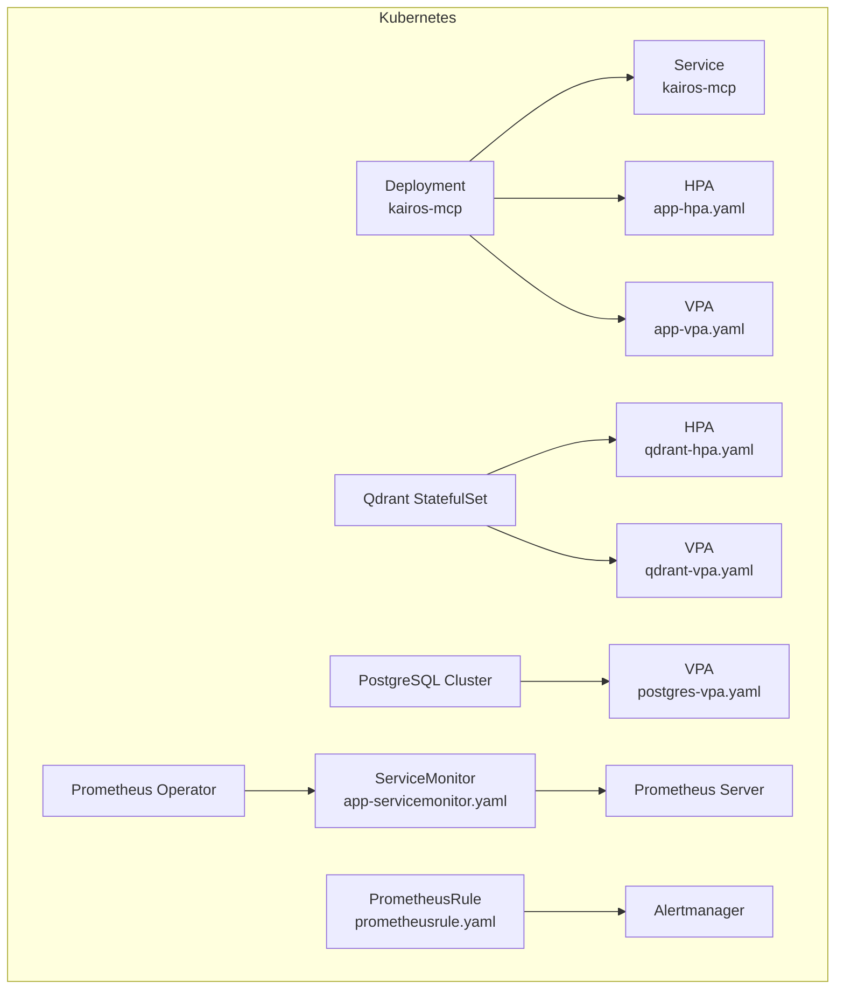
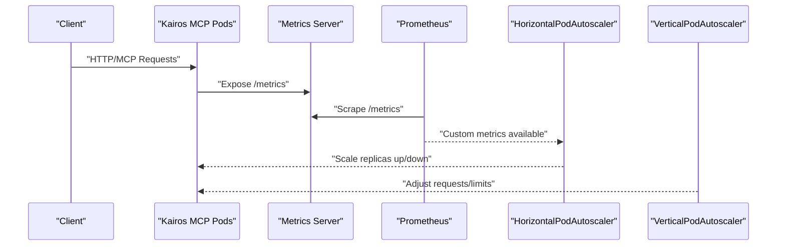
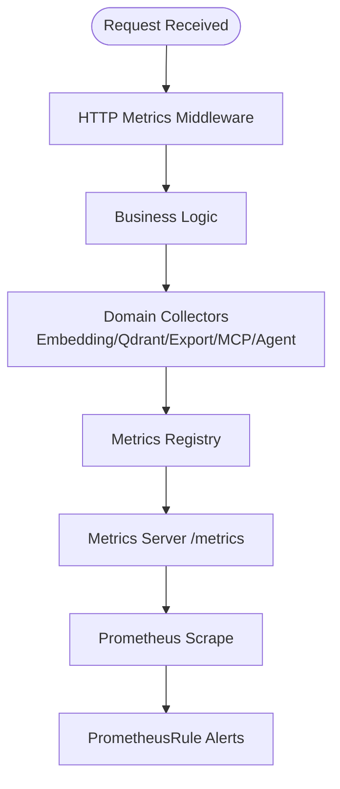
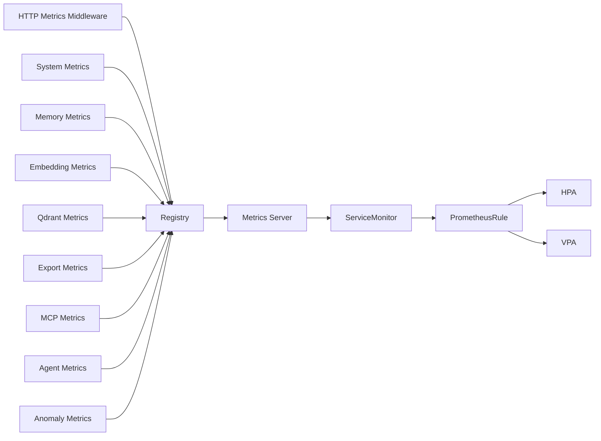

# Scaling and Load Balancing

<cite>
**Referenced Files in This Document**
- [helm/kairos-mcp/templates/app-hpa.yaml](file://helm/kairos-mcp/templates/app-hpa.yaml)
- [helm/kairos-mcp/templates/app-vpa.yaml](file://helm/kairos-mcp/templates/app-vpa.yaml)
- [helm/kairos-mcp/templates/qdrant-hpa.yaml](file://helm/kairos-mcp/templates/qdrant-hpa.yaml)
- [helm/kairos-mcp/templates/qdrant-vpa.yaml](file://helm/kairos-mcp/templates/qdrant-vpa.yaml)
- [helm/kairos-mcp/templates/postgres-vpa.yaml](file://helm/kairos-mcp/templates/postgres-vpa.yaml)
- [helm/kairos-mcp/templates/app-servicemonitor.yaml](file://helm/kairos-mcp/templates/app-servicemonitor.yaml)
- [helm/kairos-mcp/templates/prometheusrule.yaml](file://helm/kairos-mcp/templates/prometheusrule.yaml)
- [src/metrics-server.ts](file://src/metrics-server.ts)
- [src/http/http-metrics-middleware.ts](file://src/http/http-metrics-middleware.ts)
- [src/services/metrics/registry.ts](file://src/services/metrics/registry.ts)
- [src/services/metrics/http-metrics.ts](file://src/services/metrics/http-metrics.ts)
- [src/services/metrics/system-metrics.ts](file://src/services/metrics/system-metrics.ts)
- [src/services/metrics/memory-metrics.ts](file://src/services/metrics/memory-metrics.ts)
- [src/services/metrics/embedding-metrics.ts](file://src/services/metrics/embedding-metrics.ts)
- [src/services/metrics/qdrant-metrics.ts](file://src/services/metrics/qdrant-metrics.ts)
- [src/services/metrics/export-metrics.ts](file://src/services/metrics/export-metrics.ts)
- [src/services/metrics/mcp-metrics.ts](file://src/services/metrics/mcp-metrics.ts)
- [src/services/metrics/agent-metrics.ts](file://src/services/metrics/agent-metrics.ts)
- [src/services/metrics/anomaly-metrics.ts](file://src/services/metrics/anomaly-metrics.ts)
</cite>

## Table of Contents
1. [Introduction](#introduction)
2. [Project Structure](#project-structure)
3. [Core Components](#core-components)
4. [Architecture Overview](#architecture-overview)
5. [Detailed Component Analysis](#detailed-component-analysis)
6. [Dependency Analysis](#dependency-analysis)
7. [Performance Considerations](#performance-considerations)
8. [Troubleshooting Guide](#troubleshooting-guide)
9. [Conclusion](#conclusion)
10. [Appendices](#appendices)

## Introduction
This document provides comprehensive guidance for scaling and load balancing Kairos MCP on Kubernetes. It covers:
- Horizontal Pod Autoscaler (HPA) configuration using CPU, memory, and custom metrics
- Vertical Pod Autoscaler (VPA) settings for automatic resource adjustment
- Prometheus monitoring setup for scaling decisions, including custom metrics collection and alerting rules
- Performance tuning guidelines and capacity planning recommendations

The goal is to help operators run Kairos MCP at scale with predictable performance, efficient resource usage, and robust observability.

## Project Structure
Kairos MCP’s Kubernetes deployment artifacts are provided via Helm charts under helm/kairos-mcp/templates. The following resources are relevant to scaling and observability:
- HPA definitions for the application and Qdrant
- VPA definitions for the application, Qdrant, and PostgreSQL
- ServiceMonitor for scraping application metrics
- PrometheusRule for alerting based on application metrics

**Diagram sources**
- [helm/kairos-mcp/templates/app-hpa.yaml](file://helm/kairos-mcp/templates/app-hpa.yaml)
- [helm/kairos-mcp/templates/app-vpa.yaml](file://helm/kairos-mcp/templates/app-vpa.yaml)
- [helm/kairos-mcp/templates/qdrant-hpa.yaml](file://helm/kairos-mcp/templates/qdrant-hpa.yaml)
- [helm/kairos-mcp/templates/qdrant-vpa.yaml](file://helm/kairos-mcp/templates/qdrant-vpa.yaml)
- [helm/kairos-mcp/templates/postgres-vpa.yaml](file://helm/kairos-mcp/templates/postgres-vpa.yaml)
- [helm/kairos-mcp/templates/app-servicemonitor.yaml](file://helm/kairos-mcp/templates/app-servicemonitor.yaml)
- [helm/kairos-mcp/templates/prometheusrule.yaml](file://helm/kairos-mcp/templates/prometheusrule.yaml)

**Section sources**
- [helm/kairos-mcp/templates/app-hpa.yaml](file://helm/kairos-mcp/templates/app-hpa.yaml)
- [helm/kairos-mcp/templates/app-vpa.yaml](file://helm/kairos-mcp/templates/app-vpa.yaml)
- [helm/kairos-mcp/templates/qdrant-hpa.yaml](file://helm/kairos-mcp/templates/qdrant-hpa.yaml)
- [helm/kairos-mcp/templates/qdrant-vpa.yaml](file://helm/kairos-mcp/templates/qdrant-vpa.yaml)
- [helm/kairos-mcp/templates/postgres-vpa.yaml](file://helm/kairos-mcp/templates/postgres-vpa.yaml)
- [helm/kairos-mcp/templates/app-servicemonitor.yaml](file://helm/kairos-mcp/templates/app-servicemonitor.yaml)
- [helm/kairos-mcp/templates/prometheusrule.yaml](file://helm/kairos-mcp/templates/prometheusrule.yaml)

## Core Components
- Application Metrics Server: Exposes process and business metrics for Prometheus scraping.
- HTTP Metrics Middleware: Instruments HTTP request lifecycle metrics.
- Metrics Registry: Central registry for all metric collectors.
- Domain-specific Collectors: HTTP, system, memory, embedding, Qdrant, export, MCP, agent, anomaly metrics.
- Kubernetes Autoscalers: HPA and VPA for horizontal and vertical scaling.
- Observability: ServiceMonitor and PrometheusRule for scraping and alerting.

Key responsibilities:
- Provide accurate, low-overhead metrics for autoscaling and alerting
- Support both standard (CPU/memory) and custom metrics-based scaling
- Enable fine-grained control over resource requests/limits and auto-tuning

**Section sources**
- [src/metrics-server.ts](file://src/metrics-server.ts)
- [src/http/http-metrics-middleware.ts](file://src/http/http-metrics-middleware.ts)
- [src/services/metrics/registry.ts](file://src/services/metrics/registry.ts)
- [src/services/metrics/http-metrics.ts](file://src/services/metrics/http-metrics.ts)
- [src/services/metrics/system-metrics.ts](file://src/services/metrics/system-metrics.ts)
- [src/services/metrics/memory-metrics.ts](file://src/services/metrics/memory-metrics.ts)
- [src/services/metrics/embedding-metrics.ts](file://src/services/metrics/embedding-metrics.ts)
- [src/services/metrics/qdrant-metrics.ts](file://src/services/metrics/qdrant-metrics.ts)
- [src/services/metrics/export-metrics.ts](file://src/services/metrics/export-metrics.ts)
- [src/services/metrics/mcp-metrics.ts](file://src/services/metrics/mcp-metrics.ts)
- [src/services/metrics/agent-metrics.ts](file://src/services/metrics/agent-metrics.ts)
- [src/services/metrics/anomaly-metrics.ts](file://src/services/metrics/anomaly-metrics.ts)

## Architecture Overview
The autoscaling and observability architecture integrates the application’s metrics server with Prometheus and Kubernetes autoscalers.

**Diagram sources**
- [src/metrics-server.ts](file://src/metrics-server.ts)
- [src/http/http-metrics-middleware.ts](file://src/http/http-metrics-middleware.ts)
- [src/services/metrics/registry.ts](file://src/services/metrics/registry.ts)
- [helm/kairos-mcp/templates/app-hpa.yaml](file://helm/kairos-mcp/templates/app-hpa.yaml)
- [helm/kairos-mcp/templates/app-vpa.yaml](file://helm/kairos-mcp/templates/app-vpa.yaml)
- [helm/kairos-mcp/templates/app-servicemonitor.yaml](file://helm/kairos-mcp/templates/app-servicemonitor.yaml)

## Detailed Component Analysis

### Horizontal Pod Autoscaler (HPA)
- Purpose: Scale the number of Kairos MCP pods horizontally based on CPU, memory, or custom metrics.
- Typical targets:
  - CPU utilization threshold
  - Memory utilization threshold
  - Custom metrics from the application (e.g., queue depth, request latency percentiles, active sessions)
- Behavior:
  - Reacts to sustained metric trends over a stabilization window
  - Respects min/max replica bounds
  - Integrates with VPA cautiously to avoid oscillation

Recommendations:
- Start with conservative thresholds and tune based on observed latency and throughput
- Prefer custom metrics when available for more precise scaling signals
- Avoid combining HPA and VPA aggressively; use VPA primarily for right-sizing and HPA for elasticity

**Section sources**
- [helm/kairos-mcp/templates/app-hpa.yaml](file://helm/kairos-mcp/templates/app-hpa.yaml)

### Vertical Pod Autoscaler (VPA)
- Purpose: Automatically adjust CPU and memory requests and limits for pods to improve scheduling efficiency and reduce waste.
- Modes:
  - Recommend-only: Suggests optimal values without applying changes
  - Auto: Applies recommended values by restarting affected pods
- Best practices:
  - Begin in recommend-only mode to validate suggestions
  - Use update modes that minimize disruption (e.g., Updater with eviction controls)
  - Coordinate with HPA to prevent conflicting scaling actions

Components covered:
- Application VPA
- Qdrant VPA
- PostgreSQL VPA

**Section sources**
- [helm/kairos-mcp/templates/app-vpa.yaml](file://helm/kairos-mcp/templates/app-vpa.yaml)
- [helm/kairos-mcp/templates/qdrant-vpa.yaml](file://helm/kairos-mcp/templates/qdrant-vpa.yaml)
- [helm/kairos-mcp/templates/postgres-vpa.yaml](file://helm/kairos-mcp/templates/postgres-vpa.yaml)

### Prometheus Monitoring Setup
- Scraping:
  - ServiceMonitor exposes the application’s metrics endpoint for Prometheus
- Metrics exposed:
  - Process-level metrics (CPU, memory, GC)
  - HTTP request counters, latencies, errors
  - Business metrics (embedding, search, export, MCP tools, agents)
  - System and memory utilization
  - Qdrant integration metrics
- Alerting:
  - PrometheusRule defines alerts for high error rates, latency spikes, saturation, and resource pressure

Operational notes:
- Ensure the metrics endpoint is reachable by Prometheus
- Validate scrape intervals and retention policies align with your SLOs
- Use recording rules for expensive queries if needed

**Section sources**
- [helm/kairos-mcp/templates/app-servicemonitor.yaml](file://helm/kairos-mcp/templates/app-servicemonitor.yaml)
- [helm/kairos-mcp/templates/prometheusrule.yaml](file://helm/kairos-mcp/templates/prometheusrule.yaml)
- [src/metrics-server.ts](file://src/metrics-server.ts)
- [src/http/http-metrics-middleware.ts](file://src/http/http-metrics-middleware.ts)
- [src/services/metrics/registry.ts](file://src/services/metrics/registry.ts)
- [src/services/metrics/http-metrics.ts](file://src/services/metrics/http-metrics.ts)
- [src/services/metrics/system-metrics.ts](file://src/services/metrics/system-metrics.ts)
- [src/services/metrics/memory-metrics.ts](file://src/services/metrics/memory-metrics.ts)
- [src/services/metrics/embedding-metrics.ts](file://src/services/metrics/embedding-metrics.ts)
- [src/services/metrics/qdrant-metrics.ts](file://src/services/metrics/qdrant-metrics.ts)
- [src/services/metrics/export-metrics.ts](file://src/services/metrics/export-metrics.ts)
- [src/services/metrics/mcp-metrics.ts](file://src/services/metrics/mcp-metrics.ts)
- [src/services/metrics/agent-metrics.ts](file://src/services/metrics/agent-metrics.ts)
- [src/services/metrics/anomaly-metrics.ts](file://src/services/metrics/anomaly-metrics.ts)

### Metrics Collection Flow

**Diagram sources**
- [src/http/http-metrics-middleware.ts](file://src/http/http-metrics-middleware.ts)
- [src/services/metrics/registry.ts](file://src/services/metrics/registry.ts)
- [src/services/metrics/http-metrics.ts](file://src/services/metrics/http-metrics.ts)
- [src/services/metrics/embedding-metrics.ts](file://src/services/metrics/embedding-metrics.ts)
- [src/services/metrics/qdrant-metrics.ts](file://src/services/metrics/qdrant-metrics.ts)
- [src/services/metrics/export-metrics.ts](file://src/services/metrics/export-metrics.ts)
- [src/services/metrics/mcp-metrics.ts](file://src/services/metrics/mcp-metrics.ts)
- [src/services/metrics/agent-metrics.ts](file://src/services/metrics/agent-metrics.ts)
- [src/services/metrics/anomaly-metrics.ts](file://src/services/metrics/anomaly-metrics.ts)
- [src/metrics-server.ts](file://src/metrics-server.ts)
- [helm/kairos-mcp/templates/prometheusrule.yaml](file://helm/kairos-mcp/templates/prometheusrule.yaml)

## Dependency Analysis
The metrics subsystem composes multiple domain collectors into a single registry and exposes them via an HTTP endpoint consumed by Prometheus. Autoscalers depend on these metrics to make scaling decisions.

**Diagram sources**
- [src/http/http-metrics-middleware.ts](file://src/http/http-metrics-middleware.ts)
- [src/services/metrics/registry.ts](file://src/services/metrics/registry.ts)
- [src/services/metrics/system-metrics.ts](file://src/services/metrics/system-metrics.ts)
- [src/services/metrics/memory-metrics.ts](file://src/services/metrics/memory-metrics.ts)
- [src/services/metrics/embedding-metrics.ts](file://src/services/metrics/embedding-metrics.ts)
- [src/services/metrics/qdrant-metrics.ts](file://src/services/metrics/qdrant-metrics.ts)
- [src/services/metrics/export-metrics.ts](file://src/services/metrics/export-metrics.ts)
- [src/services/metrics/mcp-metrics.ts](file://src/services/metrics/mcp-metrics.ts)
- [src/services/metrics/agent-metrics.ts](file://src/services/metrics/agent-metrics.ts)
- [src/services/metrics/anomaly-metrics.ts](file://src/services/metrics/anomaly-metrics.ts)
- [src/metrics-server.ts](file://src/metrics-server.ts)
- [helm/kairos-mcp/templates/app-servicemonitor.yaml](file://helm/kairos-mcp/templates/app-servicemonitor.yaml)
- [helm/kairos-mcp/templates/prometheusrule.yaml](file://helm/kairos-mcp/templates/prometheusrule.yaml)
- [helm/kairos-mcp/templates/app-hpa.yaml](file://helm/kairos-mcp/templates/app-hpa.yaml)
- [helm/kairos-mcp/templates/app-vpa.yaml](file://helm/kairos-mcp/templates/app-vpa.yaml)

**Section sources**
- [src/services/metrics/registry.ts](file://src/services/metrics/registry.ts)
- [src/metrics-server.ts](file://src/metrics-server.ts)
- [helm/kairos-mcp/templates/app-servicemonitor.yaml](file://helm/kairos-mcp/templates/app-servicemonitor.yaml)
- [helm/kairos-mcp/templates/prometheusrule.yaml](file://helm/kairos-mcp/templates/prometheusrule.yaml)
- [helm/kairos-mcp/templates/app-hpa.yaml](file://helm/kairos-mcp/templates/app-hpa.yaml)
- [helm/kairos-mcp/templates/app-vpa.yaml](file://helm/kairos-mcp/templates/app-vpa.yaml)

## Performance Considerations
- Right-size resources:
  - Use VPA in recommend-only mode initially to validate CPU/memory requests/limits
  - Gradually enable auto mode with careful rollout strategies
- Tune HPA:
  - Set appropriate CPU/memory thresholds and stabilization windows
  - Prefer custom metrics for workload-specific scaling signals
- Reduce overhead:
  - Limit cardinality of labels on metrics
  - Use recording rules for complex queries
- Capacity planning:
  - Model peak concurrency and tail latencies
  - Size downstream dependencies (Qdrant, Redis, PostgreSQL) accordingly
  - Plan node pool capacity for bursty workloads and pod restarts during VPA updates

[No sources needed since this section provides general guidance]

## Troubleshooting Guide
Common issues and resolutions:
- Metrics not scraped:
  - Verify ServiceMonitor selectors and endpoints
  - Confirm network policies allow Prometheus to reach the app service
- HPA not scaling:
  - Check that custom metrics API is available and returning data
  - Review HPA conditions and events for errors
- VPA recommendations not applied:
  - Ensure VPA updater is configured and has permissions
  - Validate that pods can be evicted safely
- High error rates or latency:
  - Inspect PrometheusRule alerts and dashboards
  - Correlate spikes with deployments or external dependency degradation

**Section sources**
- [helm/kairos-mcp/templates/app-servicemonitor.yaml](file://helm/kairos-mcp/templates/app-servicemonitor.yaml)
- [helm/kairos-mcp/templates/prometheusrule.yaml](file://helm/kairos-mcp/templates/prometheusrule.yaml)
- [helm/kairos-mcp/templates/app-hpa.yaml](file://helm/kairos-mcp/templates/app-hpa.yaml)
- [helm/kairos-mcp/templates/app-vpa.yaml](file://helm/kairos-mcp/templates/app-vpa.yaml)

## Conclusion
By combining HPA for elasticity, VPA for right-sizing, and Prometheus-based observability, Kairos MCP can scale efficiently across varying loads. Start with conservative thresholds and VPA recommendation mode, then iteratively refine based on real-world telemetry. Use custom metrics where possible to drive more accurate scaling decisions and maintain strong SLOs.

[No sources needed since this section summarizes without analyzing specific files]

## Appendices

### Appendix A: Key Kubernetes Resources
- HPA: Horizontal scaling for the application and Qdrant
- VPA: Vertical scaling for the application, Qdrant, and PostgreSQL
- ServiceMonitor: Scrapes application metrics
- PrometheusRule: Defines alerting rules

**Section sources**
- [helm/kairos-mcp/templates/app-hpa.yaml](file://helm/kairos-mcp/templates/app-hpa.yaml)
- [helm/kairos-mcp/templates/qdrant-hpa.yaml](file://helm/kairos-mcp/templates/qdrant-hpa.yaml)
- [helm/kairos-mcp/templates/app-vpa.yaml](file://helm/kairos-mcp/templates/app-vpa.yaml)
- [helm/kairos-mcp/templates/qdrant-vpa.yaml](file://helm/kairos-mcp/templates/qdrant-vpa.yaml)
- [helm/kairos-mcp/templates/postgres-vpa.yaml](file://helm/kairos-mcp/templates/postgres-vpa.yaml)
- [helm/kairos-mcp/templates/app-servicemonitor.yaml](file://helm/kairos-mcp/templates/app-servicemonitor.yaml)
- [helm/kairos-mcp/templates/prometheusrule.yaml](file://helm/kairos-mcp/templates/prometheusrule.yaml)